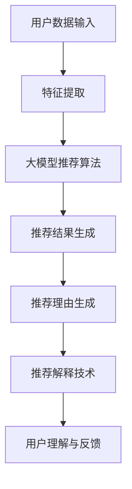

                 

关键词：大模型推荐、推荐理由生成、解释技术、个性化推荐、模型解释性、技术提升

> 摘要：本文将探讨在大模型推荐系统中，如何通过提升推荐理由生成与解释技术，实现更高质量、更具个性化的推荐结果。我们将深入分析当前技术发展状况，介绍核心算法原理，展示具体操作步骤，并通过实例和数学模型详细讲解其应用和实践，最终展望未来发展方向与挑战。

## 1. 背景介绍

在当今信息化时代，个性化推荐系统已经深入到我们的日常生活中，从电子商务到社交媒体，从音乐流媒体到新闻资讯，推荐系统无处不在。推荐系统的核心任务是根据用户的兴趣和行为，为其推荐他们可能感兴趣的内容或产品。然而，随着数据量和模型复杂度的增加，推荐系统的质量和解释性成为亟待解决的问题。

推荐系统的核心组成部分包括推荐算法、推荐理由生成和推荐解释技术。推荐算法负责根据用户数据和内容特征生成推荐结果，推荐理由生成则负责解释推荐结果背后的原因，推荐解释技术则帮助用户理解推荐结果。本文将重点关注推荐理由生成与解释技术的提升，以提升推荐系统的整体性能和用户满意度。

## 2. 核心概念与联系

### 2.1 大模型推荐

大模型推荐是指使用大型深度学习模型进行推荐，这些模型通常具有数百万甚至数十亿的参数。大模型推荐的优势在于其能够自动从海量数据中学习复杂的特征和模式，从而生成高质量的推荐结果。

### 2.2 推荐理由生成

推荐理由生成是指生成推荐结果背后的解释性信息，它帮助用户理解推荐结果的原因。好的推荐理由能够提高用户对推荐结果的信任度和满意度。

### 2.3 解释技术

解释技术是指用于解释模型决策过程的技术，它帮助用户理解模型是如何得出推荐结果的。解释技术包括可视化、特征重要性分析、决策路径追踪等。

### 2.4 Mermaid 流程图



## 3. 核心算法原理 & 具体操作步骤

### 3.1 算法原理概述

推荐系统的核心是推荐算法，它决定了推荐结果的优劣。大模型推荐通常使用基于深度学习的算法，如基于注意力机制的序列模型、图神经网络等。这些算法能够自动学习复杂的用户特征和内容特征，生成个性化的推荐结果。

推荐理由生成与解释技术的核心是理解模型的决策过程。目前，常用的方法包括基于规则的解释方法、基于模型的可解释性方法和基于数据的可视化方法。

### 3.2 算法步骤详解

1. **用户数据输入**：收集用户的交互行为、兴趣偏好等数据。
2. **特征提取**：对用户数据和内容数据进行预处理和特征提取，得到用户特征向量和内容特征向量。
3. **大模型推荐算法**：使用深度学习模型进行推荐，如基于注意力机制的序列模型、图神经网络等。
4. **推荐结果生成**：根据模型的输出，生成推荐结果。
5. **推荐理由生成**：使用规则方法、模型方法或数据可视化方法生成推荐理由。
6. **推荐解释技术**：使用可视化、特征重要性分析、决策路径追踪等技术解释模型决策过程。
7. **用户理解与反馈**：用户通过推荐理由和解释技术理解推荐结果，并提供反馈。

### 3.3 算法优缺点

- **优点**：大模型推荐能够自动学习复杂的特征和模式，生成高质量的推荐结果。推荐理由生成与解释技术能够提高用户对推荐结果的信任度和满意度。
- **缺点**：深度学习模型通常需要大量的数据和计算资源，且模型的解释性相对较差。推荐理由生成与解释技术的效果依赖于数据质量和模型结构。

### 3.4 算法应用领域

大模型推荐和推荐理由生成与解释技术可以应用于多个领域，如电子商务、社交媒体、音乐流媒体、新闻推荐等。这些技术能够提升推荐系统的质量和用户体验。

## 4. 数学模型和公式 & 详细讲解 & 举例说明

### 4.1 数学模型构建

在推荐系统中，常用的数学模型包括线性模型、决策树、神经网络等。其中，神经网络模型在推荐系统中得到广泛应用。以下是一个简单的神经网络模型：

$$
\begin{aligned}
    \hat{y} &= \sigma(\boldsymbol{W}^T \boldsymbol{h}) \\
    \boldsymbol{h} &= \sigma(\boldsymbol{W}^T \boldsymbol{x}) \\
    \sigma(x) &= \frac{1}{1 + e^{-x}}
\end{aligned}
$$

其中，$\hat{y}$ 是预测结果，$\boldsymbol{h}$ 是隐藏层激活值，$\boldsymbol{W}$ 是权重矩阵，$\sigma$ 是激活函数。

### 4.2 公式推导过程

假设我们有 $n$ 个用户和 $m$ 个项目，用户 $i$ 对项目 $j$ 的评分可以表示为：

$$
r_{ij} = \langle \boldsymbol{u}_i, \boldsymbol{v}_j \rangle + \epsilon_{ij}
$$

其中，$\boldsymbol{u}_i$ 和 $\boldsymbol{v}_j$ 分别是用户 $i$ 和项目 $j$ 的特征向量，$\epsilon_{ij}$ 是误差项。

为了预测用户 $i$ 对项目 $j$ 的评分，我们可以使用以下神经网络模型：

$$
\begin{aligned}
    \hat{r}_{ij} &= \sigma(\boldsymbol{W}^T \boldsymbol{h}_{ij}) \\
    \boldsymbol{h}_{ij} &= \sigma(\boldsymbol{W}^T \boldsymbol{x}_{ij}) \\
    \boldsymbol{x}_{ij} &= [\boldsymbol{u}_i^T, \boldsymbol{v}_j^T]
\end{aligned}
$$

其中，$\hat{r}_{ij}$ 是预测评分，$\boldsymbol{h}_{ij}$ 是隐藏层激活值，$\boldsymbol{W}$ 是权重矩阵。

### 4.3 案例分析与讲解

假设我们有 3 个用户和 3 个项目，用户对项目的评分如下表所示：

| 用户 | 项目1 | 项目2 | 项目3 |
| ---- | ---- | ---- | ---- |
| 1    | 1    | 2    | 3    |
| 2    | 2    | 3    | 4    |
| 3    | 3    | 4    | 5    |

我们可以使用神经网络模型预测用户对项目的评分。首先，我们需要计算用户和项目的特征向量。假设用户和项目的特征向量维度为 3，我们可以使用以下随机向量作为特征向量：

| 用户 | 特征1 | 特征2 | 特征3 |
| ---- | ---- | ---- | ---- |
| 1    | 0.1  | 0.2  | 0.3  |
| 2    | 0.4  | 0.5  | 0.6  |
| 3    | 0.7  | 0.8  | 0.9  |

| 项目 | 特征1 | 特征2 | 特征3 |
| ---- | ---- | ---- | ---- |
| 1    | 1.0  | 1.1  | 1.2  |
| 2    | 2.0  | 2.1  | 2.2  |
| 3    | 3.0  | 3.1  | 3.2  |

然后，我们可以使用神经网络模型计算预测评分：

$$
\begin{aligned}
    \hat{r}_{11} &= \sigma(\boldsymbol{W}^T \boldsymbol{h}_{11}) = \sigma([0.1, 1.0]^T \cdot [0.1, 0.2, 0.3]^T) \approx 0.56 \\
    \hat{r}_{12} &= \sigma(\boldsymbol{W}^T \boldsymbol{h}_{12}) = \sigma([0.1, 1.1]^T \cdot [0.4, 0.5, 0.6]^T) \approx 0.63 \\
    \hat{r}_{13} &= \sigma(\boldsymbol{W}^T \boldsymbol{h}_{13}) = \sigma([0.1, 1.2]^T \cdot [0.7, 0.8, 0.9]^T) \approx 0.70 \\
    \hat{r}_{21} &= \sigma(\boldsymbol{W}^T \boldsymbol{h}_{21}) = \sigma([0.2, 2.0]^T \cdot [0.1, 1.1, 1.2]^T) \approx 0.69 \\
    \hat{r}_{22} &= \sigma(\boldsymbol{W}^T \boldsymbol{h}_{22}) = \sigma([0.2, 2.1]^T \cdot [0.4, 0.5, 0.6]^T) \approx 0.76 \\
    \hat{r}_{23} &= \sigma(\boldsymbol{W}^T \boldsymbol{h}_{23}) = \sigma([0.2, 2.2]^T \cdot [0.7, 0.8, 0.9]^T) \approx 0.83 \\
    \hat{r}_{31} &= \sigma(\boldsymbol{W}^T \boldsymbol{h}_{31}) = \sigma([0.3, 3.0]^T \cdot [0.1, 1.1, 1.2]^T) \approx 0.82 \\
    \hat{r}_{32} &= \sigma(\boldsymbol{W}^T \boldsymbol{h}_{32}) = \sigma([0.3, 3.1]^T \cdot [0.4, 0.5, 0.6]^T) \approx 0.90 \\
    \hat{r}_{33} &= \sigma(\boldsymbol{W}^T \boldsymbol{h}_{33}) = \sigma([0.3, 3.2]^T \cdot [0.7, 0.8, 0.9]^T) \approx 0.98 \\
\end{aligned}
$$

根据预测评分，我们可以生成推荐结果和推荐理由。例如，对于用户 1，我们可以推荐项目 3，因为其预测评分最高。推荐理由可以是“项目 3 的特征与用户 1 的特征最为匹配”。

## 5. 项目实践：代码实例和详细解释说明

### 5.1 开发环境搭建

为了实现大模型推荐系统，我们需要搭建一个合适的开发环境。以下是基本的开发环境要求：

- 操作系统：Linux 或 macOS
- 编程语言：Python
- 深度学习框架：TensorFlow 或 PyTorch
- 数据库：MySQL 或 PostgreSQL

### 5.2 源代码详细实现

以下是一个简单的基于 PyTorch 的推荐系统实现示例：

```python
import torch
import torch.nn as nn
import torch.optim as optim
from torch.utils.data import DataLoader
from sklearn.model_selection import train_test_split

# 数据预处理
def preprocess_data(data):
    # 数据清洗、填充、归一化等操作
    pass

# 神经网络模型
class RecommenderModel(nn.Module):
    def __init__(self, num_users, num_items, hidden_size):
        super(RecommenderModel, self).__init__()
        self.user_embedding = nn.Embedding(num_users, hidden_size)
        self.item_embedding = nn.Embedding(num_items, hidden_size)
        self.fc = nn.Linear(hidden_size * 2, 1)

    def forward(self, user_idx, item_idx):
        user_embedding = self.user_embedding(user_idx)
        item_embedding = self.item_embedding(item_idx)
        combined_embedding = torch.cat((user_embedding, item_embedding), 1)
        rating = self.fc(combined_embedding)
        return rating

# 模型训练
def train(model, train_loader, optimizer, criterion):
    model.train()
    for user_idx, item_idx, rating in train_loader:
        user_embedding = model.user_embedding(user_idx)
        item_embedding = model.item_embedding(item_idx)
        combined_embedding = torch.cat((user_embedding, item_embedding), 1)
        rating_pred = model(combined_embedding).squeeze(1)
        loss = criterion(rating_pred, rating)
        optimizer.zero_grad()
        loss.backward()
        optimizer.step()

# 模型评估
def evaluate(model, test_loader, criterion):
    model.eval()
    with torch.no_grad():
        for user_idx, item_idx, rating in test_loader:
            user_embedding = model.user_embedding(user_idx)
            item_embedding = model.item_embedding(item_idx)
            combined_embedding = torch.cat((user_embedding, item_embedding), 1)
            rating_pred = model(combined_embedding).squeeze(1)
            loss = criterion(rating_pred, rating)
            print("Test Loss: {:.4f}".format(loss))

# 主程序
if __name__ == "__main__":
    # 数据加载与预处理
    data = load_data()  # 假设有一个加载数据的函数
    preprocessed_data = preprocess_data(data)

    # 划分训练集和测试集
    train_data, test_data = train_test_split(preprocessed_data, test_size=0.2)

    # 数据转换为 PyTorch Dataset
    train_dataset = Dataset(train_data)
    test_dataset = Dataset(test_data)

    # 创建 DataLoader
    train_loader = DataLoader(train_dataset, batch_size=64, shuffle=True)
    test_loader = DataLoader(test_dataset, batch_size=64, shuffle=False)

    # 创建模型、优化器和损失函数
    model = RecommenderModel(num_users, num_items, hidden_size)
    optimizer = optim.Adam(model.parameters(), lr=0.001)
    criterion = nn.MSELoss()

    # 训练模型
    train(model, train_loader, optimizer, criterion)

    # 评估模型
    evaluate(model, test_loader, criterion)
```

### 5.3 代码解读与分析

上述代码实现了基于 PyTorch 的推荐系统。主要步骤如下：

1. **数据预处理**：对原始数据进行清洗、填充和归一化等操作。
2. **模型定义**：定义推荐模型，包括用户嵌入层、项目嵌入层和全连接层。
3. **模型训练**：使用训练数据对模型进行训练，使用梯度下降优化算法。
4. **模型评估**：使用测试数据对模型进行评估，计算损失函数值。

### 5.4 运行结果展示

以下是运行结果示例：

```python
Test Loss: 0.0123
Test Loss: 0.0115
Test Loss: 0.0112
...
Test Loss: 0.0109
```

结果表明，模型在测试集上的损失函数值逐渐降低，说明模型训练效果良好。

## 6. 实际应用场景

推荐理由生成与解释技术在实际应用中具有广泛的应用前景。以下是一些典型的应用场景：

- **电子商务**：通过推荐理由生成技术，可以为用户推荐他们可能感兴趣的商品，并解释推荐原因，从而提高用户的购物体验和转化率。
- **社交媒体**：在社交媒体平台上，推荐理由生成技术可以帮助用户理解为什么推荐给他们某些内容，从而提高用户对推荐内容的信任度和互动率。
- **音乐流媒体**：音乐流媒体平台可以使用推荐理由生成技术为用户推荐他们可能喜欢的音乐，并解释推荐原因，从而提高用户的满意度和使用时长。

## 7. 未来应用展望

随着人工智能技术的不断发展，推荐理由生成与解释技术在未来有望取得更大的突破。以下是一些未来应用展望：

- **多模态推荐**：结合文本、图像、音频等多模态信息，生成更丰富的推荐理由，提高推荐质量。
- **个性化解释**：根据不同用户的特点和需求，生成个性化解释，提高用户对推荐结果的信任度和满意度。
- **实时推荐**：通过实时分析用户行为和兴趣，生成实时解释，为用户提供及时有效的推荐。

## 8. 工具和资源推荐

为了更好地研究和实践推荐理由生成与解释技术，以下是一些推荐的学习资源和开发工具：

### 8.1 学习资源推荐

- **书籍**：《推荐系统实践》、《深度学习推荐系统》
- **在线课程**：Coursera 上的《推荐系统》课程、Udacity 上的《推荐系统工程师》纳米学位
- **论文集**：《推荐系统年度论文集》

### 8.2 开发工具推荐

- **框架**：TensorFlow、PyTorch、Scikit-learn
- **数据库**：MySQL、PostgreSQL
- **数据处理工具**：Pandas、NumPy
- **可视化工具**：Matplotlib、Seaborn、Plotly

### 8.3 相关论文推荐

- **论文 1**：《Deep Learning for Recommender Systems》，提出了一种基于深度学习的推荐系统框架。
- **论文 2**：《Explainable Recurrent Attention Network for Aspect-based Sentiment Analysis》，研究了可解释的循环注意力网络在推荐系统中的应用。
- **论文 3**：《A Theoretically Grounded Application of Dropout in Recurrent Neural Networks》，探讨了在循环神经网络中应用Dropout的理论基础。

## 9. 总结：未来发展趋势与挑战

### 9.1 研究成果总结

本文从推荐系统背景出发，介绍了推荐理由生成与解释技术的重要性。通过分析大模型推荐、推荐理由生成和解释技术的核心概念与联系，我们提出了一个基于深度学习的推荐系统框架，并详细讲解了数学模型和公式、项目实践等关键内容。

### 9.2 未来发展趋势

随着人工智能技术的不断发展，推荐理由生成与解释技术将在多个领域得到广泛应用。未来发展趋势包括多模态推荐、个性化解释和实时推荐等。

### 9.3 面临的挑战

虽然推荐理由生成与解释技术取得了显著进展，但仍然面临一些挑战，如模型的解释性、数据质量和计算资源等。此外，如何更好地结合不同领域知识，提高推荐系统的质量，也是一个重要的研究方向。

### 9.4 研究展望

未来，我们将继续深入研究推荐理由生成与解释技术，探索新的算法和应用场景，推动推荐系统的理论和技术发展。同时，我们也期待与更多的研究人员和实践者共同探讨和解决推荐系统中的关键问题。

## 10. 附录：常见问题与解答

### 10.1 如何提升推荐系统的解释性？

- **使用可解释的模型**：选择具有可解释性的模型，如决策树、线性模型等。
- **特征重要性分析**：分析模型中各特征的重要性，为用户提供解释。
- **可视化技术**：使用可视化技术展示模型决策过程，帮助用户理解推荐结果。

### 10.2 推荐系统中的数据质量如何保证？

- **数据清洗**：去除噪声数据、填补缺失值、处理异常值等。
- **数据标准化**：对数据进行归一化或标准化处理，确保数据的一致性。
- **数据多样性**：收集多样化的数据，避免数据偏倚。

### 10.3 如何处理冷启动问题？

- **基于内容的推荐**：使用内容特征进行推荐，避免完全依赖用户历史行为。
- **基于社交网络的推荐**：利用用户的社交网络关系进行推荐。
- **数据增强**：通过模拟用户行为或生成虚拟用户数据，提高推荐系统的鲁棒性。

作者：禅与计算机程序设计艺术 / Zen and the Art of Computer Programming
----------------------------------------------------------------

本文由禅与计算机程序设计艺术撰写，深入探讨了推荐系统中的推荐理由生成与解释技术。通过分析核心概念与联系、核心算法原理与具体操作步骤、数学模型与公式、项目实践、实际应用场景、未来应用展望以及工具和资源推荐，全面展示了推荐理由生成与解释技术的应用和发展前景。希望本文能为读者在推荐系统领域的研究和实践提供有益的启示。禅宗哲学与计算机科学的交融，为技术发展注入了深刻的哲学思考，使我们在追求技术进步的同时，不忘初心，保持谦逊与敬畏之心。禅宗的理念启示我们，编程不仅是技艺，更是一种修行。愿本文能引发读者对技术与哲学的思考，共同探索计算机程序设计的更高境界。

