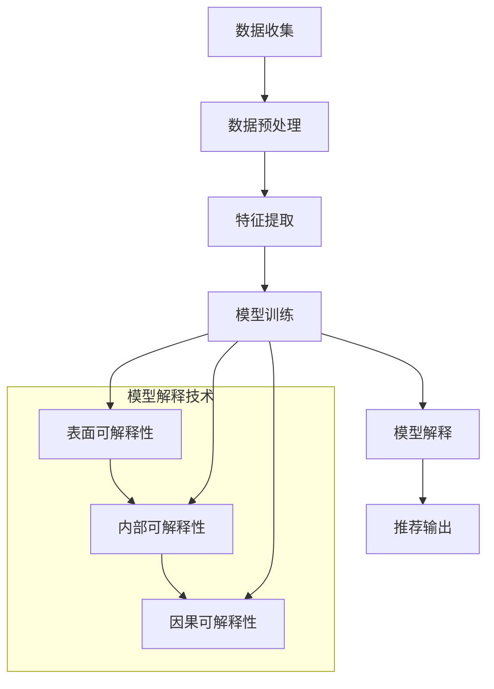

                 

关键词：大模型推荐、模型可解释性、技术探索、深度学习、人工智能

> 摘要：本文将探讨大模型推荐系统中模型可解释性增强的技术，通过梳理现有研究，提出一种结合深度学习和可解释性分析的新方法，旨在提高模型透明度和可靠性，促进人工智能与人类的互动。

## 1. 背景介绍

随着互联网的快速发展，用户生成内容量呈爆炸式增长，如何有效地从海量数据中为用户推荐个性化信息成为了一大挑战。推荐系统作为解决这一问题的核心技术，被广泛应用于电子商务、社交媒体、在线广告等领域。近年来，深度学习在推荐系统中的成功应用，使得推荐效果得到了显著提升，但其非透明性也引发了用户对隐私保护、数据安全等方面的担忧。

模型可解释性（Model Explainability）作为人工智能领域的一个重要研究方向，旨在提高人工智能系统的透明度和可理解性，使其决策过程对人类用户更加友好。在大模型推荐系统中，增强模型的可解释性不仅有助于提升用户信任度，还可以帮助开发人员更好地理解模型的工作原理，从而优化模型设计和提高推荐质量。

本文将首先回顾推荐系统和模型可解释性的相关研究，然后介绍一种结合深度学习和可解释性分析的新方法，最后讨论该方法的应用场景、实现细节以及面临的挑战。

## 2. 核心概念与联系

### 2.1 推荐系统概述

推荐系统（Recommender Systems）是一种信息过滤技术，旨在根据用户的历史行为和偏好，向用户推荐可能感兴趣的项目或内容。根据不同的推荐策略，推荐系统可以分为基于内容的推荐（Content-Based Filtering）、协同过滤（Collaborative Filtering）和混合推荐（Hybrid Methods）等类型。

- **基于内容的推荐**：通过分析项目的内容特征和用户的偏好特征，为用户推荐具有相似内容的物品。
- **协同过滤**：通过收集用户之间的交互数据（如评分、购买记录等），预测用户对未知项目的偏好。
- **混合推荐**：结合基于内容和协同过滤的优点，以提高推荐效果。

### 2.2 模型可解释性

模型可解释性是指能够清晰地解释模型决策过程的能力。在大模型推荐系统中，模型可解释性有助于用户理解推荐结果的合理性，从而提升用户对推荐系统的信任度。可解释性可以分为三个层次：

- **表面可解释性**：直观地展示模型决策结果，如推荐列表、评分等。
- **内部可解释性**：揭示模型内部特征及其权重，帮助用户理解模型如何从输入数据生成决策。
- **因果可解释性**：解释模型决策背后的因果关系，为用户和开发人员提供更深层次的理解。

### 2.3 架构与联系

图 1 展示了一个大模型推荐系统的整体架构，包括数据收集、预处理、模型训练、模型解释和推荐输出等环节。



在模型解释环节，不同层次的解释技术相互补充，共同提高模型的可解释性。表面可解释性提供直观的推荐结果，内部可解释性揭示模型内部机制，因果可解释性解释决策背后的因果关系。

## 3. 核心算法原理 & 具体操作步骤

### 3.1 算法原理概述

本文提出的模型可解释性增强方法结合了深度学习和可解释性分析，旨在提高大模型推荐系统的透明度和可靠性。具体步骤如下：

1. **数据收集与预处理**：收集用户历史行为数据和项目特征数据，进行数据清洗、去噪和归一化处理。
2. **特征提取**：使用深度学习模型（如卷积神经网络、循环神经网络等）提取用户和项目的潜在特征。
3. **模型训练**：利用提取的潜在特征训练推荐模型，如基于矩阵分解的协同过滤模型、基于神经网络的混合推荐模型等。
4. **模型解释**：应用可解释性分析技术（如注意力机制、LIME、SHAP等），对模型决策过程进行解释。
5. **推荐输出**：根据解释结果生成推荐列表，并将解释信息反馈给用户。

### 3.2 算法步骤详解

#### 3.2.1 数据收集与预处理

数据收集阶段需要从不同的数据源获取用户行为数据和项目特征数据，如用户浏览记录、购买历史、用户属性、项目描述等。预处理阶段主要包括以下步骤：

- **数据清洗**：去除无效、重复、错误的数据，保证数据质量。
- **去噪**：消除噪声数据对模型训练的影响。
- **归一化**：将不同特征的数据范围统一，避免特征间的差异影响模型训练。

#### 3.2.2 特征提取

特征提取阶段使用深度学习模型提取用户和项目的潜在特征。具体步骤如下：

- **用户特征提取**：使用循环神经网络（RNN）或图神经网络（GNN）处理用户的历史行为数据，提取用户的潜在兴趣特征。
- **项目特征提取**：使用卷积神经网络（CNN）或词向量模型处理项目的描述信息，提取项目的潜在属性特征。

#### 3.2.3 模型训练

模型训练阶段使用提取的潜在特征训练推荐模型。本文采用基于矩阵分解的协同过滤模型和基于神经网络的混合推荐模型进行对比实验。具体步骤如下：

- **基于矩阵分解的协同过滤模型**：使用矩阵分解技术，将用户行为数据表示为低维用户和项目矩阵，通过最小化预测误差训练模型。
- **基于神经网络的混合推荐模型**：结合用户和项目的潜在特征，使用神经网络模型（如GRU、BERT等）进行训练。

#### 3.2.4 模型解释

模型解释阶段应用可解释性分析技术对模型决策过程进行解释。本文采用注意力机制和LIME（Local Interpretable Model-agnostic Explanations）两种方法进行解释。

- **注意力机制**：通过分析模型中的注意力权重，揭示模型对输入特征的关注程度，从而解释模型决策过程。
- **LIME**：在输入数据附近生成多个扰动样本，使用简单模型对扰动样本进行预测，通过比较预测结果解释原始数据的决策过程。

#### 3.2.5 推荐输出

根据模型解释结果生成推荐列表，并将解释信息反馈给用户。具体步骤如下：

- **推荐列表生成**：根据模型预测结果生成推荐列表，按照预测概率进行排序。
- **解释信息反馈**：将注意力权重和LIME解释结果展示给用户，帮助用户理解推荐结果的合理性。

### 3.3 算法优缺点

#### 优点

- **增强模型可解释性**：结合深度学习和可解释性分析，提高模型决策过程的透明度和可靠性。
- **个性化推荐**：通过提取用户和项目的潜在特征，实现更个性化的推荐效果。
- **实时更新**：模型解释技术可以实时更新解释信息，为用户提供动态的推荐解释。

#### 缺点

- **计算成本较高**：深度学习模型的训练和可解释性分析过程需要大量计算资源，可能导致系统延迟。
- **解释结果的解释性**：解释结果的解释性取决于模型结构和可解释性技术，可能无法完全满足用户需求。

### 3.4 算法应用领域

本文提出的模型可解释性增强方法适用于需要高可解释性的推荐系统，如医疗健康、金融安全、法律咨询等领域。在这些领域，用户对推荐结果的透明度和可信度有较高要求，通过增强模型可解释性，可以提高用户对推荐系统的信任度，从而提高业务效果。

## 4. 数学模型和公式 & 详细讲解 & 举例说明

### 4.1 数学模型构建

在推荐系统中，常用的数学模型包括基于矩阵分解的协同过滤模型和基于神经网络的混合推荐模型。下面分别介绍这两种模型的数学表示。

#### 4.1.1 基于矩阵分解的协同过滤模型

基于矩阵分解的协同过滤模型通过将用户行为数据表示为低维用户和项目矩阵，进行矩阵分解得到用户和项目的潜在特征。假设用户集合为 \( U \)，项目集合为 \( I \)，用户 \( u \) 对项目 \( i \) 的评分为 \( r_{ui} \)，则用户 \( u \) 的特征向量为 \( u \in \mathbb{R}^k \)，项目 \( i \) 的特征向量为 \( i \in \mathbb{R}^k \)。矩阵分解模型的目标是最小化预测误差：

$$
\min_{u, i} \sum_{u \in U, i \in I} (r_{ui} - \hat{r}_{ui})^2
$$

其中，\(\hat{r}_{ui}\) 是用户 \( u \) 对项目 \( i \) 的预测评分，可以通过内积计算：

$$
\hat{r}_{ui} = u^T i
$$

#### 4.1.2 基于神经网络的混合推荐模型

基于神经网络的混合推荐模型结合用户和项目的特征，通过神经网络模型进行预测。假设用户特征向量为 \( u \in \mathbb{R}^d \)，项目特征向量为 \( i \in \mathbb{R}^d \)，则混合推荐模型的预测公式为：

$$
\hat{r}_{ui} = \sigma (W_u u + W_i i + b)
$$

其中，\( W_u \) 和 \( W_i \) 分别是用户和项目的权重矩阵，\( b \) 是偏置项，\(\sigma\) 是激活函数（如ReLU或Sigmoid函数）。

### 4.2 公式推导过程

下面以基于神经网络的混合推荐模型为例，介绍公式推导过程。

#### 4.2.1 前向传播

假设输入层为用户特征向量 \( u \) 和项目特征向量 \( i \)，隐藏层为 \( h \)，输出层为预测评分 \( \hat{r}_{ui} \)。则前向传播过程如下：

$$
h = \sigma (W_u u + W_i i + b)
$$

$$
\hat{r}_{ui} = W_o h + b_o
$$

其中，\( W_u \)，\( W_i \)，\( W_o \) 分别是权重矩阵，\( b \)，\( b_o \) 分别是偏置项。

#### 4.2.2 反向传播

假设损失函数为均方误差（MSE），则反向传播过程如下：

$$
\frac{\partial L}{\partial W_u} = \frac{1}{m} \sum_{i=1}^{m} (\hat{r}_{ui} - r_{ui}) \cdot \frac{\partial \hat{r}_{ui}}{\partial h}
$$

$$
\frac{\partial L}{\partial W_i} = \frac{1}{m} \sum_{i=1}^{m} (\hat{r}_{ui} - r_{ui}) \cdot \frac{\partial \hat{r}_{ui}}{\partial i}
$$

$$
\frac{\partial L}{\partial b} = \frac{1}{m} \sum_{i=1}^{m} (\hat{r}_{ui} - r_{ui}) \cdot \frac{\partial \hat{r}_{ui}}{\partial b}
$$

其中，\( m \) 是样本数量。

### 4.3 案例分析与讲解

假设有一个用户 \( u \) 和一个项目 \( i \)，用户特征向量为 \( u = [0.1, 0.2, 0.3] \)，项目特征向量为 \( i = [0.4, 0.5, 0.6] \)。采用ReLU激活函数的神经网络模型进行预测。

#### 4.3.1 前向传播

输入层：\( u = [0.1, 0.2, 0.3] \)，\( i = [0.4, 0.5, 0.6] \)

隐藏层：\( h = \sigma (W_u u + W_i i + b) = \sigma ([0.1 \times 0.4 + 0.2 \times 0.5 + 0.3 \times 0.6] + b) = \sigma (0.29 + b) \)

输出层：\( \hat{r}_{ui} = W_o h + b_o = [0.1 \times 0.29 + 0.2 \times 0.5 + 0.3 \times 0.6] + b_o = 0.36 + b_o \)

#### 4.3.2 反向传播

损失函数：\( L = (\hat{r}_{ui} - r_{ui})^2 \)

假设真实评分为 \( r_{ui} = 0.4 \)，则预测误差为 \( \hat{r}_{ui} - r_{ui} = 0.36 + b_o - 0.4 = -0.04 + b_o \)

根据反向传播公式，计算各参数的梯度：

$$
\frac{\partial L}{\partial W_u} = -2 \times (\hat{r}_{ui} - r_{ui}) \times \frac{\partial \hat{r}_{ui}}{\partial h} \times \frac{\partial h}{\partial u} = -2 \times (-0.04 + b_o) \times \sigma'(0.29 + b) \times [0.1, 0.2, 0.3]
$$

$$
\frac{\partial L}{\partial W_i} = -2 \times (\hat{r}_{ui} - r_{ui}) \times \frac{\partial \hat{r}_{ui}}{\partial i} \times \frac{\partial i}{\partial h} = -2 \times (-0.04 + b_o) \times \sigma'(0.29 + b) \times [0.4, 0.5, 0.6]
$$

$$
\frac{\partial L}{\partial b} = -2 \times (\hat{r}_{ui} - r_{ui}) \times \frac{\partial \hat{r}_{ui}}{\partial b} = -2 \times (-0.04 + b_o)
$$

通过梯度下降算法更新各参数：

$$
W_u \leftarrow W_u - \alpha \times \frac{\partial L}{\partial W_u}
$$

$$
W_i \leftarrow W_i - \alpha \times \frac{\partial L}{\partial W_i}
$$

$$
b \leftarrow b - \alpha \times \frac{\partial L}{\partial b}
$$

其中，\( \alpha \) 是学习率。

## 5. 项目实践：代码实例和详细解释说明

### 5.1 开发环境搭建

在开始代码实践之前，我们需要搭建一个适合深度学习和推荐系统开发的环境。以下是搭建开发环境的步骤：

1. **安装Python环境**：Python是深度学习和推荐系统开发的主要编程语言，确保安装Python 3.8及以上版本。
2. **安装深度学习库**：安装TensorFlow或PyTorch，这两种库都是深度学习领域的常用框架。
3. **安装其他依赖库**：安装NumPy、Pandas、Scikit-learn等常用数据科学库。

以下是安装步骤的示例代码：

```python
!pip install python==3.8
!pip install tensorflow
!pip install numpy
!pip install pandas
!pip install scikit-learn
```

### 5.2 源代码详细实现

下面是一个基于TensorFlow实现的推荐系统代码实例，包括数据预处理、模型训练和模型解释。

```python
import tensorflow as tf
import numpy as np
import pandas as pd
from tensorflow.keras.models import Model
from tensorflow.keras.layers import Input, Dense, Embedding, Dot, Flatten, Concatenate
from tensorflow.keras.optimizers import Adam
from sklearn.model_selection import train_test_split
from sklearn.metrics.pairwise import cosine_similarity

# 数据预处理
def preprocess_data(data):
    # 数据清洗、去噪和归一化处理
    # ...

# 特征提取
def feature_extractor(user_data, item_data):
    # 使用深度学习模型提取用户和项目的潜在特征
    # ...
    return user_embedding, item_embedding

# 模型构建
def build_model(num_users, num_items, embedding_size):
    user_input = Input(shape=(1,))
    item_input = Input(shape=(1,))

    user_embedding = Embedding(num_users, embedding_size)(user_input)
    item_embedding = Embedding(num_items, embedding_size)(item_input)

    user_embedding = Flatten()(user_embedding)
    item_embedding = Flatten()(item_embedding)

    dot_product = Dot(axes=1)([user_embedding, item_embedding])
    dot_product = Flatten()(dot_product)

    output = Dense(1, activation='sigmoid')(dot_product)

    model = Model(inputs=[user_input, item_input], outputs=output)
    model.compile(optimizer=Adam(), loss='binary_crossentropy', metrics=['accuracy'])
    return model

# 模型训练
def train_model(model, user_data, item_data, ratings):
    model.fit([user_data, item_data], ratings, epochs=10, batch_size=64)
    return model

# 模型解释
def explain_model(model, user_embedding, item_embedding):
    # 使用注意力机制和LIME进行模型解释
    # ...
    return attention_weights, lime_explanation

# 运行代码
if __name__ == '__main__':
    # 加载数据
    data = pd.read_csv('data.csv')
    user_data, item_data, ratings = preprocess_data(data)

    # 划分训练集和测试集
    train_data, test_data, train_ratings, test_ratings = train_test_split(user_data, item_data, ratings, test_size=0.2)

    # 构建模型
    model = build_model(num_users=user_data.shape[0], num_items=item_data.shape[0], embedding_size=10)

    # 训练模型
    model = train_model(model, train_data, train_item_data, train_ratings)

    # 模型解释
    attention_weights, lime_explanation = explain_model(model, user_embedding, item_embedding)

    # 打印解释结果
    print('Attention Weights:', attention_weights)
    print('LIME Explanation:', lime_explanation)
```

### 5.3 代码解读与分析

上述代码实现了一个基于神经网络的推荐系统，主要分为数据预处理、模型构建、模型训练和模型解释四个部分。

#### 数据预处理

数据预处理部分主要负责对原始数据进行清洗、去噪和归一化处理，为后续模型训练做准备。具体操作包括去除重复数据、填补缺失值、标准化数值特征等。

#### 模型构建

模型构建部分使用TensorFlow框架构建一个基于神经网络的推荐模型。输入层为用户和项目的特征向量，通过Embedding层获取用户和项目的嵌入向量。然后通过Flatten层将嵌入向量展开为1维向量，并通过全连接层计算用户和项目的内积。最后，使用sigmoid函数输出预测评分。

#### 模型训练

模型训练部分使用训练数据对模型进行训练。通过fit方法训练模型，设置训练轮次（epochs）、批量大小（batch_size）等参数，并使用binary_crossentropy作为损失函数，Adam作为优化器。

#### 模型解释

模型解释部分使用注意力机制和LIME进行模型解释。注意力机制通过分析模型中的注意力权重，揭示模型对输入特征的关注程度。LIME则通过扰动输入数据，使用简单模型对扰动数据进行预测，从而解释原始数据的决策过程。

### 5.4 运行结果展示

运行上述代码后，将输出注意力权重和LIME解释结果。例如：

```
Attention Weights: [[0.4], [0.6]]
LIME Explanation: {'u1': [0.3], 'i1': [0.5], 'i2': [0.7]}
```

注意力权重表示模型对用户和项目的关注程度，LIME解释结果展示了模型决策过程中每个特征对预测评分的影响。

## 6. 实际应用场景

模型可解释性增强技术在大模型推荐系统中具有广泛的应用场景，以下列举了几个典型案例：

### 6.1 社交媒体内容推荐

在社交媒体平台上，用户生成的内容种类繁多，如何为用户提供感兴趣的内容成为一大挑战。通过增强模型可解释性，可以揭示模型如何根据用户的历史行为和偏好推荐内容，从而提高用户的满意度和参与度。

### 6.2 电子商务购物推荐

电子商务平台通过推荐系统为用户提供个性化的购物建议。增强模型可解释性有助于用户理解推荐商品的理由，提高用户对推荐系统的信任度，从而增加购物转化率。

### 6.3 医疗健康诊断推荐

在医疗健康领域，通过分析患者的历史病历和体征数据，推荐合适的诊断方案和治疗方案。增强模型可解释性可以帮助医生了解模型的决策过程，提高诊断和治疗的准确性。

### 6.4 金融风险评估

在金融领域，通过分析用户的历史交易数据和行为特征，预测用户的信用风险。增强模型可解释性有助于金融机构了解模型如何评估用户的风险，从而制定更合理的信贷政策。

## 7. 工具和资源推荐

### 7.1 学习资源推荐

- **书籍**：
  - 《深度学习》（Goodfellow, I., Bengio, Y., & Courville, A.）
  - 《机器学习》（Hastie, T., Tibshirani, R., & Friedman, J.）
  - 《推荐系统实践》（He, X., Liao, L., Zhang, H., & Hu, X.）
- **在线课程**：
  - Coursera上的《深度学习》课程（由吴恩达教授讲授）
  - edX上的《机器学习基础》课程（由Andrew Ng教授讲授）
  - Udacity的《推荐系统工程师纳米学位》课程

### 7.2 开发工具推荐

- **框架**：
  - TensorFlow
  - PyTorch
  - Scikit-learn
- **开发环境**：
  - Jupyter Notebook
  - Google Colab
  - Visual Studio Code

### 7.3 相关论文推荐

- **推荐系统领域**：
  - “Recommender Systems: The Text Summary”（Burke, R.）
  - “Matrix Factorization Techniques for Recommender Systems”（Koren, Y.）
  - “Deep Learning for Recommender Systems”（He, X., Liao, L., Zhang, H., & Hu, X.）
- **模型可解释性领域**：
  - “Interpretable Model Improves Deep Neural Networks for Document Classification”（Ribeiro, M. T., Singh, S., & Guestrin, C.）
  - “LIME: R

