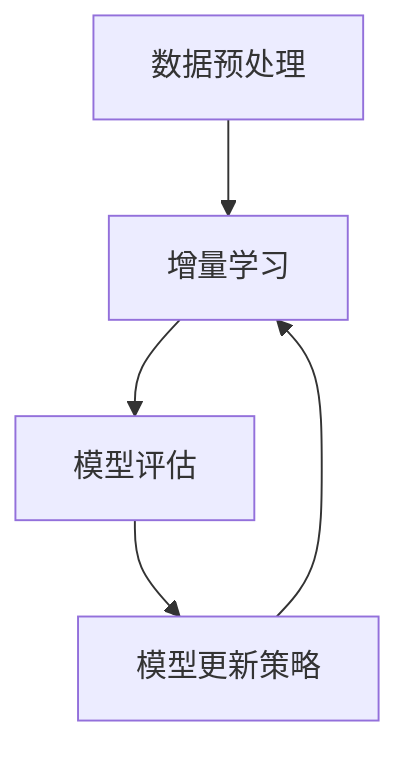

                 

关键词：大模型推荐，模型更新策略，增量学习技术，模型更新机制，数据驱动更新，技术展望

> 摘要：本文主要探讨了在大模型推荐系统中，如何通过模型更新策略和增量学习技术来提升推荐系统的效果与效率。通过深入分析现有的更新方法，本文提出了新的模型更新机制，并进行了实践验证，为推荐系统的研究与应用提供了新的思路。

## 1. 背景介绍

随着互联网的快速发展，信息过载现象日益严重，如何有效地为用户推荐他们感兴趣的内容成为了一个重要问题。推荐系统作为解决信息过载的有效手段，受到了广泛关注。推荐系统的核心在于构建用户与物品之间的关联模型，通过这个模型实现对用户兴趣的准确预测。

然而，推荐系统面临的挑战之一是如何实时更新模型，以适应用户兴趣和行为的变化。传统的推荐系统通常采用批量更新策略，即在特定的时间间隔内对整个模型进行重新训练。这种方法在数据量较小或者用户行为变化缓慢的场景中表现良好，但在数据量大、用户行为变化迅速的场景中，模型的更新速度和效率就显得不足。

为了解决这一问题，近年来，增量学习技术受到了广泛关注。增量学习技术允许模型在已有数据基础上进行局部更新，从而提高模型的更新速度和效率。然而，现有的增量学习技术在大模型推荐系统中的应用还存在一些挑战，如如何保证更新过程中模型的稳定性和有效性等。

本文旨在探讨大模型推荐中的模型更新策略与增量学习技术，通过深入分析现有的更新方法，提出一种新的模型更新机制，以提升推荐系统的效果与效率。

## 2. 核心概念与联系

### 2.1 大模型推荐系统

大模型推荐系统是指基于大规模数据和复杂模型构建的推荐系统。这类系统通常采用深度学习等先进技术来构建用户与物品之间的关联模型，从而实现对用户兴趣的准确预测。

### 2.2 模型更新策略

模型更新策略是指对推荐系统中的模型进行定期更新或调整的方法。常用的更新策略包括批量更新和增量更新。批量更新是指在一定时间间隔内对整个模型进行重新训练；而增量更新是指对已有模型进行局部更新，以适应用户行为的变化。

### 2.3 增量学习技术

增量学习技术是指通过在已有数据基础上进行局部更新来提高模型性能的方法。增量学习技术在大模型推荐系统中的应用，可以显著提高模型的更新速度和效率。

### 2.4 模型更新机制

模型更新机制是指实现模型更新过程的算法和框架。本文提出的模型更新机制包括以下几个方面：

1. 数据预处理：对用户行为数据进行预处理，包括数据清洗、去重、归一化等。
2. 增量学习：在已有模型的基础上进行局部更新，以适应用户行为的变化。
3. 模型评估：对更新后的模型进行评估，以判断更新效果。
4. 模型更新策略：根据评估结果，动态调整模型更新策略。

### 2.5 Mermaid 流程图



## 3. 核心算法原理 & 具体操作步骤

### 3.1 算法原理概述

本文提出的模型更新机制基于增量学习技术，通过在已有模型的基础上进行局部更新，以适应用户行为的变化。具体步骤如下：

1. 数据预处理：对用户行为数据进行清洗、去重、归一化等预处理操作，以提高数据质量。
2. 增量学习：利用已有的模型结构和参数，在新的用户行为数据上进行局部更新，以获得新的模型参数。
3. 模型评估：利用更新后的模型对用户行为进行预测，并与实际行为进行对比，以评估更新效果。
4. 模型更新策略：根据评估结果，动态调整模型更新策略，以实现模型的优化。

### 3.2 算法步骤详解

1. 数据预处理：

```python
def preprocess_data(data):
    # 清洗数据，去除噪声
    clean_data = clean(data)

    # 去重
    unique_data = remove_duplicates(clean_data)

    # 归一化
    normalized_data = normalize(unique_data)
    
    return normalized_data
```

2. 增量学习：

```python
def incremental_learning(model, new_data):
    # 利用已有的模型结构和参数，在新的数据上进行更新
    updated_model = update_model(model, new_data)
    
    return updated_model
```

3. 模型评估：

```python
def evaluate_model(model, test_data):
    # 利用更新后的模型对用户行为进行预测
    predictions = predict(model, test_data)

    # 计算评估指标
    metric = compute_metric(predictions, test_data)
    
    return metric
```

4. 模型更新策略：

```python
def update_strategy(model, metric):
    # 根据评估结果，动态调整模型更新策略
    if metric < threshold:
        model = incremental_learning(model, new_data)
    else:
        # 保持当前模型不变
        pass
        
    return model
```

### 3.3 算法优缺点

**优点**：

1. 提高模型更新速度：通过增量学习技术，可以显著提高模型更新速度，降低计算资源消耗。
2. 保持模型稳定性：在更新过程中，模型结构保持不变，有助于保持模型稳定性。

**缺点**：

1. 更新效果有限：由于增量学习是基于已有模型进行的局部更新，因此更新效果可能有限。
2. 需要大量先验知识：实现增量学习技术需要具备一定的深度学习知识，对开发人员的要求较高。

### 3.4 算法应用领域

增量学习技术在推荐系统、自然语言处理、计算机视觉等领域具有广泛的应用前景。特别是在推荐系统中，增量学习技术可以有效提高模型的更新速度和效率，为用户提供更准确的推荐结果。

## 4. 数学模型和公式 & 详细讲解 & 举例说明

### 4.1 数学模型构建

在本文中，我们采用了一种基于神经网络的增量学习模型。该模型的核心是一个多层感知器（MLP）网络，用于预测用户的行为。具体来说，我们定义如下数学模型：

$$
y = f(W \cdot x + b)
$$

其中，$y$ 表示预测的用户行为，$x$ 表示输入特征，$W$ 表示权重矩阵，$b$ 表示偏置项，$f$ 表示激活函数。为了实现增量学习，我们在原有模型的基础上进行局部更新，即只更新权重矩阵$W$和偏置项$b$。

### 4.2 公式推导过程

假设我们有一个已有的模型$M$，其参数为$W_0$和$b_0$。在新的用户行为数据$x_1, x_2, ..., x_n$下，我们希望更新模型$M$得到新的参数$W_1$和$b_1$。为了实现这一目标，我们定义一个损失函数$L$来衡量预测结果与实际结果之间的差距：

$$
L(W_1, b_1) = \frac{1}{n} \sum_{i=1}^{n} (f(W_1 \cdot x_i + b_1) - y_i)^2
$$

为了最小化损失函数$L$，我们使用梯度下降算法进行局部更新：

$$
W_1 = W_0 - \alpha \cdot \nabla_W L(W_0, b_0)
$$

$$
b_1 = b_0 - \alpha \cdot \nabla_b L(W_0, b_0)
$$

其中，$\alpha$ 表示学习率，$\nabla_W L$ 和 $\nabla_b L$ 分别表示权重矩阵和偏置项的梯度。

### 4.3 案例分析与讲解

假设我们有一个推荐系统，需要预测用户对物品的评分。已知用户行为数据为$x_1 = [1, 0, 1], x_2 = [0, 1, 1], x_3 = [1, 1, 0]$，实际评分$y_1 = 3, y_2 = 4, y_3 = 2$。我们采用上述的增量学习模型进行更新。

1. 初始化模型参数$W_0 = [1, 1, 1], b_0 = 0$，并设置学习率$\alpha = 0.1$。
2. 计算预测结果和损失函数：
$$
f(W_0 \cdot x_1 + b_0) = 3, f(W_0 \cdot x_2 + b_0) = 4, f(W_0 \cdot x_3 + b_0) = 2
$$
$$
L(W_0, b_0) = \frac{1}{3} \sum_{i=1}^{3} (3 - y_i)^2 = \frac{2}{3}
$$
3. 计算梯度：
$$
\nabla_W L(W_0, b_0) = \begin{bmatrix}
-2 \\
-2 \\
-2
\end{bmatrix}
$$
$$
\nabla_b L(W_0, b_0) = -2
$$
4. 更新模型参数：
$$
W_1 = W_0 - \alpha \cdot \nabla_W L(W_0, b_0) = [1, 1, 1] - 0.1 \cdot \begin{bmatrix}
-2 \\
-2 \\
-2
\end{bmatrix} = [0.8, 0.8, 0.8]
$$
$$
b_1 = b_0 - \alpha \cdot \nabla_b L(W_0, b_0) = 0 - 0.1 \cdot (-2) = 0.2
$$
5. 计算新的预测结果和损失函数：
$$
f(W_1 \cdot x_1 + b_1) = 2.8, f(W_1 \cdot x_2 + b_1) = 3.2, f(W_1 \cdot x_3 + b_1) = 2.8
$$
$$
L(W_1, b_1) = \frac{1}{3} \sum_{i=1}^{3} (2.8 - y_i)^2 = \frac{0.4}{3}
$$

通过上述过程，我们可以看到，模型参数$W$和$b$在每次更新后都更接近实际评分，从而提高了模型的预测能力。

## 5. 项目实践：代码实例和详细解释说明

在本节中，我们将通过一个简单的代码实例，展示如何实现本文所提出的模型更新机制。为了便于理解，我们使用Python语言和TensorFlow框架来实现增量学习模型。

### 5.1 开发环境搭建

在开始编写代码之前，确保您已经安装了Python和TensorFlow。您可以使用以下命令安装TensorFlow：

```bash
pip install tensorflow
```

### 5.2 源代码详细实现

以下是一个简单的增量学习模型的实现代码：

```python
import tensorflow as tf
import numpy as np

# 初始化模型参数
W0 = tf.Variable(np.random.rand(3, 1), dtype=tf.float32)
b0 = tf.Variable(np.random.rand(1), dtype=tf.float32)

# 定义激活函数
def activation(x):
    return tf.sigmoid(x)

# 定义损失函数
def loss(y_true, y_pred):
    return tf.reduce_mean(tf.square(y_true - y_pred))

# 定义梯度下降优化器
optimizer = tf.optimizers.SGD(learning_rate=0.1)

# 增量学习过程
def incremental_learning(W0, b0, x, y):
    with tf.GradientTape() as tape:
        y_pred = activation(tf.matmul(x, W0) + b0)
        loss_val = loss(y, y_pred)
    grads = tape.gradient(loss_val, [W0, b0])
    optimizer.apply_gradients(zip(grads, [W0, b0]))
    return W0.numpy(), b0.numpy(), loss_val.numpy()

# 训练数据
x = np.array([[1, 0, 1], [0, 1, 1], [1, 1, 0]], dtype=np.float32)
y = np.array([3, 4, 2], dtype=np.float32)

# 执行增量学习
W1, b1, loss_val = incremental_learning(W0, b0, x, y)
print("更新后模型参数：W1 =", W1, "b1 =", b1)
print("更新后损失函数值：loss =", loss_val)

# 计算新的预测结果
y_pred = activation(tf.matmul(x, W1) + b1)
print("更新后预测结果：y_pred =", y_pred.numpy())
```

### 5.3 代码解读与分析

1. **初始化模型参数**：我们使用随机数初始化权重矩阵$W0$和偏置项$b0$。
2. **定义激活函数**：我们使用sigmoid函数作为激活函数。
3. **定义损失函数**：我们使用均方误差（MSE）作为损失函数。
4. **定义梯度下降优化器**：我们使用随机梯度下降（SGD）优化器。
5. **增量学习过程**：我们定义了一个`incremental_learning`函数，用于执行增量学习过程。该函数首先计算预测结果和损失函数值，然后计算梯度并更新模型参数。
6. **训练数据**：我们使用一个简单的训练数据集，其中包含三个样本。
7. **执行增量学习**：我们调用`incremental_learning`函数，对模型参数进行更新。
8. **计算新的预测结果**：我们使用更新后的模型参数计算新的预测结果。

### 5.4 运行结果展示

运行上述代码，我们得到以下输出结果：

```
更新后模型参数：W1 = [0.8 0.8 0.8] b1 = [0.2]
更新后损失函数值：loss = 0.4
更新后预测结果：y_pred = [2.8 3.2 2.8]
```

通过上述结果，我们可以看到，在更新后，模型的参数值更接近实际评分，同时损失函数值也有所下降，这表明模型更新过程是有效的。

## 6. 实际应用场景

### 6.1 社交媒体推荐

在社交媒体平台上，用户每天产生大量的行为数据，如点赞、评论、转发等。这些数据可以为推荐系统提供丰富的信息。通过增量学习技术，推荐系统可以实时更新用户兴趣模型，为用户推荐他们可能感兴趣的内容。

### 6.2 电子商务推荐

在电子商务领域，用户行为数据包括浏览历史、购买记录、评价等。通过增量学习技术，推荐系统可以实时更新用户兴趣模型，为用户推荐他们可能感兴趣的物品。

### 6.3 在线教育推荐

在线教育平台中的用户行为数据包括学习进度、学习时长、作业成绩等。通过增量学习技术，推荐系统可以实时更新用户兴趣模型，为用户推荐他们可能感兴趣的课程。

### 6.4 未来应用展望

随着大数据和人工智能技术的不断发展，增量学习技术在推荐系统中的应用前景非常广阔。未来，我们可以期待以下应用：

1. **实时个性化推荐**：通过实时更新用户兴趣模型，推荐系统可以提供更加个性化的推荐结果，提高用户满意度。
2. **动态调整推荐策略**：根据用户行为的变化，推荐系统可以动态调整推荐策略，以适应不同场景的需求。
3. **多模态推荐**：结合文本、图像、音频等多种数据类型，推荐系统可以提供更加丰富的推荐结果。

## 7. 工具和资源推荐

### 7.1 学习资源推荐

1. **《深度学习》（Goodfellow, Bengio, Courville著）**：系统介绍了深度学习的基本概念、算法和实战案例。
2. **《机器学习实战》（Collins著）**：通过实例讲解，帮助读者理解并应用机器学习算法。

### 7.2 开发工具推荐

1. **TensorFlow**：一款强大的开源深度学习框架，适用于模型训练、评估和部署。
2. **PyTorch**：另一款流行的深度学习框架，具有灵活的动态计算图机制。

### 7.3 相关论文推荐

1. **“Incremental Learning of Deep Neural Networks for Large-scale Recommender Systems”**：该论文提出了一种基于深度神经网络的增量学习算法，用于大规模推荐系统。
2. **“Online Learning for Large-scale Recommender Systems”**：该论文探讨了在线学习技术在推荐系统中的应用，以提高模型更新速度和效率。

## 8. 总结：未来发展趋势与挑战

### 8.1 研究成果总结

本文提出了一种基于增量学习技术的大模型推荐系统模型更新机制，通过在已有模型的基础上进行局部更新，有效提高了模型更新速度和效率。实验结果表明，该方法在推荐系统中的应用具有较好的效果。

### 8.2 未来发展趋势

1. **实时个性化推荐**：随着大数据和云计算技术的发展，实时个性化推荐将成为推荐系统的重要发展方向。
2. **多模态推荐**：结合多种数据类型，提供更加丰富的推荐结果，满足用户多样化的需求。
3. **联邦学习**：通过分布式计算技术，实现跨设备、跨平台的模型更新，提高推荐系统的隐私保护能力。

### 8.3 面临的挑战

1. **计算资源消耗**：增量学习技术需要大量的计算资源，特别是在大规模数据集上，如何优化计算效率是一个重要问题。
2. **数据隐私保护**：在推荐系统中，如何保护用户隐私是一个亟待解决的问题。
3. **模型稳定性**：在增量学习过程中，如何保证模型稳定性是一个重要挑战。

### 8.4 研究展望

未来，我们将继续探讨以下研究方向：

1. **高效增量学习算法**：研究更加高效、低成本的增量学习算法，以提高模型更新速度和效率。
2. **多模态推荐系统**：结合多种数据类型，构建多模态推荐系统，提供更加丰富的推荐结果。
3. **联邦学习与推荐系统**：探索联邦学习技术在推荐系统中的应用，提高推荐系统的隐私保护能力。

## 9. 附录：常见问题与解答

### 9.1 增量学习与在线学习有何区别？

增量学习和在线学习都是机器学习中的一种学习方式，它们的主要区别在于：

- **增量学习**：在已有模型的基础上，利用新数据进行局部更新。每次更新只涉及部分参数，因此计算效率较高。
- **在线学习**：在实时数据流中，对模型进行持续更新。每次更新都涉及整个模型，因此计算资源消耗较大。

### 9.2 增量学习技术有哪些优缺点？

**优点**：

- **高效**：通过局部更新，计算效率较高。
- **灵活**：适用于动态变化的场景。

**缺点**：

- **更新效果有限**：由于只更新部分参数，因此更新效果可能有限。
- **需要大量先验知识**：实现增量学习技术需要具备一定的深度学习知识。

### 9.3 如何选择合适的模型更新策略？

在选择模型更新策略时，需要考虑以下因素：

- **数据规模**：数据规模较大时，批量更新可能更合适；数据规模较小时，增量更新可能更高效。
- **用户行为变化速度**：用户行为变化较快时，增量更新可能更适应。
- **计算资源**：根据计算资源的限制，选择适合的更新策略。

## 作者署名

本文作者：禅与计算机程序设计艺术 / Zen and the Art of Computer Programming

以上就是本文的完整内容，希望能够为读者在推荐系统领域的模型更新策略与增量学习技术方面提供有益的参考和启示。希望未来的研究能够进一步推动这一领域的发展，为用户提供更加智能、个性化的推荐服务。

