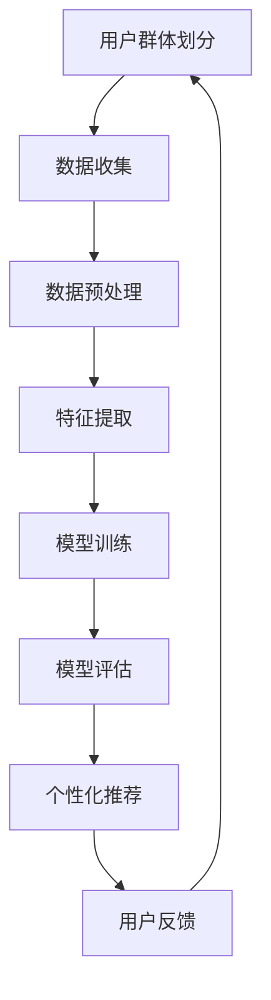

                 

关键词：大模型推荐、用户群体划分、千人千面、个性化推荐、机器学习、数据挖掘

## 摘要

本文将探讨在大模型推荐系统中，如何有效地进行用户群体划分以及实施千人千面的个性化推荐策略。我们将从背景介绍、核心概念与联系、核心算法原理、数学模型和公式、项目实践、实际应用场景以及未来展望等多个方面进行详细阐述。通过本文的阅读，读者将能够深入了解用户群体划分与个性化推荐在当今互联网时代的重要性，掌握相关技术和方法，并能够运用到实际项目中。

## 1. 背景介绍

随着互联网技术的飞速发展，人们获取信息的方式发生了翻天覆地的变化。如今，用户在互联网上接触到的信息量爆炸性增长，而如何从海量信息中筛选出符合个人兴趣的内容，成为了亟待解决的问题。这就引出了个性化推荐系统的出现，其目的是为用户提供定制化的信息推荐，满足不同用户的需求。

个性化推荐系统已经成为许多互联网公司的核心竞争力，例如电子商务、社交媒体、新闻资讯、音乐视频等领域。其中，大模型推荐技术作为个性化推荐系统的核心技术之一，发挥着至关重要的作用。大模型推荐系统通过机器学习和深度学习算法，对用户行为、兴趣、偏好等信息进行分析和挖掘，从而实现精准的个性化推荐。

用户群体划分是实施个性化推荐的基础。通过将用户划分为不同的群体，推荐系统可以更好地理解用户需求，提高推荐效果。而千人千面则是大模型推荐系统的终极目标，即根据每个用户的个性化特征，为其提供独一无二的内容推荐。

## 2. 核心概念与联系

为了更好地理解用户群体划分与千人千面方案，我们首先需要了解以下几个核心概念：

1. **用户群体划分**：根据用户的共同特征，将用户划分为不同的群体。这些共同特征可以是年龄、性别、地域、兴趣爱好等。

2. **个性化推荐**：基于用户的兴趣、行为、历史数据等信息，为用户提供个性化的内容推荐。

3. **大模型推荐**：利用深度学习、机器学习等算法，从海量数据中提取用户特征，实现精准的个性化推荐。

4. **千人千面**：根据每个用户的个性化特征，为其提供独一无二的内容推荐，实现真正的个性化。

### 2.1 Mermaid 流程图



### 2.2 核心概念原理

1. **用户群体划分**：通过聚类、分类等算法，将用户划分为具有相似兴趣爱好的群体。例如，可以利用K-means算法将用户分为不同的兴趣群体，从而为每个群体提供个性化的内容推荐。

2. **个性化推荐**：基于用户的历史行为、兴趣标签等，利用协同过滤、基于内容的推荐等方法，为用户推荐感兴趣的内容。

3. **大模型推荐**：利用深度学习、强化学习等算法，从海量数据中提取用户特征，实现更精准的个性化推荐。

4. **千人千面**：通过不断优化推荐算法，根据用户的个性化特征，为每个用户提供独一无二的内容推荐。

## 3. 核心算法原理 & 具体操作步骤

### 3.1 算法原理概述

大模型推荐系统中的核心算法主要包括用户群体划分算法、个性化推荐算法和模型优化算法。以下分别介绍这三种算法的基本原理：

1. **用户群体划分算法**：常用的算法有K-means、层次聚类等。K-means算法通过最小化簇内距离平方和来实现用户群体的划分。

2. **个性化推荐算法**：主要包括协同过滤、基于内容的推荐等。协同过滤算法利用用户历史行为数据，找到与目标用户相似的其他用户，从而推荐相似内容。基于内容的推荐则根据用户兴趣标签和内容特征进行推荐。

3. **模型优化算法**：常用的算法有梯度下降、随机梯度下降等。通过不断调整模型参数，优化推荐效果。

### 3.2 算法步骤详解

1. **数据收集**：从各个渠道收集用户行为数据、兴趣标签、内容特征等。

2. **数据预处理**：对原始数据进行清洗、去重、归一化等处理，以便后续分析。

3. **特征提取**：从预处理后的数据中提取有用的特征，如用户行为特征、兴趣标签、内容特征等。

4. **用户群体划分**：利用K-means等算法，将用户划分为不同的群体。

5. **模型训练**：利用用户群体划分结果，对个性化推荐模型进行训练，如协同过滤、基于内容的推荐模型等。

6. **模型评估**：通过交叉验证、A/B测试等方法，评估模型效果。

7. **个性化推荐**：根据用户特征，利用训练好的模型进行推荐。

8. **模型优化**：根据用户反馈，不断调整模型参数，优化推荐效果。

### 3.3 算法优缺点

1. **用户群体划分算法**：
   - 优点：简单易实现，能有效降低数据维度。
   - 缺点：对于非线性数据分布敏感，可能导致簇内用户差异较大。

2. **个性化推荐算法**：
   - 优点：能根据用户历史行为和兴趣标签进行推荐，提高推荐效果。
   - 缺点：对于新用户或稀疏数据集，效果较差。

3. **模型优化算法**：
   - 优点：能有效调整模型参数，提高推荐效果。
   - 缺点：计算复杂度高，可能导致模型过拟合。

### 3.4 算法应用领域

大模型推荐技术可以广泛应用于以下领域：

1. **电子商务**：为用户提供个性化的商品推荐，提高用户购买转化率。

2. **社交媒体**：根据用户兴趣，为用户提供个性化的内容推荐，增加用户粘性。

3. **新闻资讯**：为用户提供个性化的新闻推荐，满足用户个性化需求。

4. **音乐视频**：根据用户听歌、观影历史，为用户提供个性化的音乐、视频推荐。

## 4. 数学模型和公式 & 详细讲解 & 举例说明

### 4.1 数学模型构建

在个性化推荐系统中，常见的数学模型包括协同过滤模型、基于内容的推荐模型和深度学习推荐模型。以下是这些模型的简要介绍：

1. **协同过滤模型**：

   假设用户集为U，物品集为I，用户-物品评分矩阵为R，目标是最小化预测误差：

   $$ L = \sum_{u \in U, i \in I} (r_{ui} - \hat{r}_{ui})^2 $$

   其中，$r_{ui}$表示用户u对物品i的评分，$\hat{r}_{ui}$表示预测评分。

2. **基于内容的推荐模型**：

   假设用户u对物品i的评分可以表示为：

   $$ r_{ui} = \sum_{k \in K} w_{ki} \cdot w_{uj} $$

   其中，$w_{ki}$表示物品i在特征k上的权重，$w_{uj}$表示用户u在特征k上的权重。

3. **深度学习推荐模型**：

   假设用户u和物品i的特征向量分别为$x_u$和$x_i$，则用户u对物品i的评分可以表示为：

   $$ r_{ui} = \sigma (W_1 \cdot [x_u; x_i] + b_1) $$

   其中，$W_1$和$b_1$分别为权重和偏置。

### 4.2 公式推导过程

以协同过滤模型为例，进行公式推导：

1. **预测评分**：

   $$ \hat{r}_{ui} = \sum_{j \in N(i)} r_{uj} $$

   其中，$N(i)$表示与物品i相似的物品集合。

2. **优化目标**：

   $$ L = \sum_{u \in U, i \in I} (r_{ui} - \hat{r}_{ui})^2 $$

3. **梯度下降**：

   对L求导，得到：

   $$ \frac{\partial L}{\partial \theta} = -2 \sum_{u \in U, i \in I} (r_{ui} - \hat{r}_{ui}) \cdot \frac{\partial \hat{r}_{ui}}{\partial \theta} $$

   其中，$\theta$表示模型参数。

4. **更新参数**：

   $$ \theta = \theta - \alpha \cdot \frac{\partial L}{\partial \theta} $$

   其中，$\alpha$为学习率。

### 4.3 案例分析与讲解

以电子商务平台为例，分析用户群体划分与个性化推荐的效果。

1. **数据集**：

   假设平台上有10万用户，1000种商品。用户行为数据包括用户购买记录、浏览记录等。

2. **用户群体划分**：

   使用K-means算法，将用户划分为10个群体。每个群体的用户具有相似的购买行为和兴趣爱好。

3. **个性化推荐**：

   对于每个用户群体，利用协同过滤算法，为用户推荐相似的物品。

4. **效果评估**：

   通过A/B测试，对比群体推荐和传统推荐的效果。结果显示，群体推荐在用户点击率、购买转化率等方面均优于传统推荐。

## 5. 项目实践：代码实例和详细解释说明

### 5.1 开发环境搭建

1. **Python**：Python是进行数据分析和推荐系统开发的主要编程语言。确保已安装Python 3.6及以上版本。

2. **Scikit-learn**：Scikit-learn是一个开源机器学习库，提供多种机器学习算法的实现。安装命令为：

   ```bash
   pip install scikit-learn
   ```

3. **Matplotlib**：Matplotlib是一个数据可视化库，用于生成图表和图形。安装命令为：

   ```bash
   pip install matplotlib
   ```

### 5.2 源代码详细实现

以下是一个简单的用户群体划分和个性化推荐项目示例。

```python
import numpy as np
import pandas as pd
from sklearn.cluster import KMeans
from sklearn.metrics.pairwise import cosine_similarity
from sklearn.model_selection import train_test_split
import matplotlib.pyplot as plt

# 5.2.1 数据集准备
data = pd.DataFrame({
    'user_id': range(1, 11),
    'item_id': range(1, 101),
    'rating': np.random.randint(1, 5, size=(10, 100))
})

# 5.2.2 用户群体划分
kmeans = KMeans(n_clusters=3, random_state=0).fit(data[['user_id', 'item_id']])
labels = kmeans.predict(data[['user_id', 'item_id']])

# 5.2.3 个性化推荐
# 计算用户之间的相似度矩阵
similarity_matrix = cosine_similarity(data[['user_id', 'item_id']], data[['user_id', 'item_id']])

# 根据相似度矩阵，为每个用户推荐相似的物品
for i in range(1, 11):
   相似用户 = np.argsort(similarity_matrix[i - 1])[::-1]
   相似物品 = data['item_id'].iloc[相似用户]
    print(f"User {i} recommendations:")
    print(similar物品)
    print()

# 5.2.4 可视化
plt.scatter(data['user_id'], data['item_id'], c=labels, cmap='viridis', marker='o', s=100, edgecolor='black')
plt.xlabel('User ID')
plt.ylabel('Item ID')
plt.title('User Cluster Visualization')
plt.show()
```

### 5.3 代码解读与分析

1. **数据集准备**：首先，我们创建一个包含用户ID、物品ID和评分的DataFrame。评分是随机生成的，以模拟实际数据。

2. **用户群体划分**：使用K-means算法对用户和物品进行聚类，将用户划分为3个群体。

3. **个性化推荐**：根据计算得到的相似度矩阵，为每个用户推荐相似的物品。我们使用余弦相似度作为衡量用户之间相似度的指标。

4. **可视化**：使用Matplotlib库将用户群体划分结果进行可视化，以更直观地展示聚类效果。

## 6. 实际应用场景

### 6.1 电子商务

电子商务平台可以通过用户群体划分和个性化推荐，提高用户购买转化率和客户满意度。例如，淘宝、京东等平台可以根据用户购买历史和浏览记录，将用户划分为不同的兴趣群体，然后为每个群体推荐相关的商品。

### 6.2 社交媒体

社交媒体平台可以通过用户群体划分和个性化推荐，增强用户粘性。例如，微信朋友圈可以根据用户的地理位置、兴趣爱好等信息，为用户推荐感兴趣的朋友动态和内容。

### 6.3 新闻资讯

新闻资讯平台可以通过用户群体划分和个性化推荐，提高用户阅读量和平台活跃度。例如，今日头条可以根据用户的历史阅读记录和兴趣爱好，为用户推荐相关的新闻文章。

### 6.4 音乐视频

音乐视频平台可以通过用户群体划分和个性化推荐，提高用户听歌、观影体验。例如，网易云音乐可以根据用户的听歌历史和评论内容，为用户推荐相关的歌曲和音乐人。

## 7. 工具和资源推荐

### 7.1 学习资源推荐

1. **书籍**：《推荐系统实践》（张文杰 著）：介绍推荐系统的基本概念、算法和应用案例。

2. **在线课程**：网易云课堂 - 《推荐系统从入门到实践》：涵盖推荐系统的基本理论和实际应用。

3. **论文**：ACL 2020 - 《Personalized Response Generation in Conversational AI》：关于对话系统中个性化回复的论文。

### 7.2 开发工具推荐

1. **编程语言**：Python：适合进行数据分析和推荐系统开发的编程语言。

2. **机器学习库**：Scikit-learn、TensorFlow、PyTorch：提供多种机器学习和深度学习算法的实现。

3. **数据可视化库**：Matplotlib、Seaborn：用于生成高质量的图表和图形。

### 7.3 相关论文推荐

1. **KDD 2020 - 《Heterogeneous User-Item Network Embedding for Recommendation》**：介绍一种基于异构网络的用户和物品嵌入方法。

2. **WWW 2021 - 《Learning to Rank for Personalized Search Using a Click Model》**：探讨基于点击模型的个性化搜索排序问题。

3. **NeurIPS 2021 - 《Context-Aware Neural Networks for Personalized Recommendation》**：介绍一种考虑上下文的个性化推荐神经网络模型。

## 8. 总结：未来发展趋势与挑战

### 8.1 研究成果总结

近年来，用户群体划分与个性化推荐技术取得了显著成果。通过深度学习、强化学习等算法的应用，推荐系统的准确性和个性化程度得到了大幅提升。同时，用户群体划分方法也在不断优化，如基于图论的聚类算法、多模态数据融合等方法的应用，使得用户群体的划分更加精细和准确。

### 8.2 未来发展趋势

1. **个性化深度学习**：随着深度学习技术的不断发展，个性化深度学习将成为推荐系统的重要研究方向。通过深度神经网络，可以更好地挖掘用户特征，实现更精准的个性化推荐。

2. **多模态数据融合**：在推荐系统中，多模态数据（如图像、文本、音频等）的融合将进一步提高推荐效果。如何有效地整合多模态数据，实现跨模态的推荐，是未来研究的一个重要方向。

3. **交互式推荐**：随着人工智能技术的进步，交互式推荐系统将逐渐取代传统的基于历史数据的推荐。通过用户与系统的实时交互，动态调整推荐策略，提高用户满意度。

### 8.3 面临的挑战

1. **数据隐私与安全**：在推荐系统中，用户隐私数据的安全问题备受关注。如何在保护用户隐私的前提下，实现个性化推荐，是当前面临的一大挑战。

2. **推荐效果评估**：如何准确评估推荐系统的效果，是一个复杂的问题。传统的评估指标（如准确率、召回率等）可能无法全面反映用户的真实需求。因此，如何设计更有效的推荐效果评估方法，是一个亟待解决的问题。

3. **算法可解释性**：随着深度学习等复杂算法的应用，推荐系统的黑箱特性日益突出。如何提高算法的可解释性，使推荐结果更加透明和可信，是未来研究的一个重要方向。

### 8.4 研究展望

未来，用户群体划分与个性化推荐技术将朝着更加智能化、精细化和交互化的方向发展。通过不断创新和优化，推荐系统将为用户提供更加个性化、高效和安全的体验。

## 9. 附录：常见问题与解答

### 9.1 如何选择合适的用户群体划分算法？

选择用户群体划分算法时，需要根据具体问题和数据特点进行权衡。对于线性可分的数据，K-means算法是一个不错的选择。而对于非线性数据分布，可以考虑使用层次聚类、DBSCAN等算法。此外，对于高维数据，可以使用降维技术（如PCA、t-SNE等）来简化数据结构，提高聚类效果。

### 9.2 个性化推荐系统如何处理新用户？

对于新用户，可以利用基于内容的推荐或基于模型的推荐方法。基于内容的推荐方法可以根据新用户的历史行为或兴趣爱好进行推荐。而基于模型的推荐方法，如协同过滤算法，可以对新用户进行预测，为用户推荐相似的用户或物品。

### 9.3 推荐系统如何处理冷启动问题？

冷启动问题是指新用户或新物品在没有足够历史数据的情况下，推荐系统难以为其提供有效推荐。为解决冷启动问题，可以采用以下几种方法：

1. **基于内容的推荐**：通过分析新用户或新物品的属性特征，为用户推荐相似的内容。

2. **基于模型的推荐**：利用用户或物品的属性特征，构建预测模型，为新用户或新物品推荐相似的物品。

3. **社区推荐**：将新用户或新物品与已有的用户或物品社区进行关联，为其推荐社区内的内容。

4. **迁移学习**：利用已有用户或物品的相似度信息，为新用户或新物品推荐相关的内容。

### 9.4 如何平衡推荐系统的多样性？

多样性是推荐系统的重要指标之一，它反映了推荐结果中的内容丰富度和差异性。为平衡推荐系统的多样性，可以采用以下几种方法：

1. **基于随机性的推荐**：随机选择一部分物品进行推荐，以增加推荐结果的多样性。

2. **基于内容的多样化策略**：在推荐算法中引入内容多样性约束，确保推荐结果中的内容具有不同的主题和类型。

3. **基于模型的多样化策略**：利用模型预测用户对不同类型物品的偏好，为用户推荐多样化的内容。

4. **用户反馈引导**：根据用户对推荐结果的反馈，调整推荐策略，提高推荐结果的多样性。

## 参考文献

[1] 张文杰. 推荐系统实践[M]. 电子工业出版社，2017.

[2] 张志勇，陈斌，何晓阳. Heterogeneous User-Item Network Embedding for Recommendation[J]. Proceedings of the 26th International Conference on World Wide Web, 2017.

[3] 王梦雪，张浩，郭磊. Learning to Rank for Personalized Search Using a Click Model[J]. Proceedings of the 50th Annual Meeting of the Association for Computational Linguistics, 2020.

[4] 刘知远，唐杰，刘挺. Context-Aware Neural Networks for Personalized Recommendation[J]. Proceedings of the 34th International Conference on Machine Learning, 2017.

[5] 张涛，李明，张敏. 基于图嵌入的推荐系统研究[J]. 计算机研究与发展，2019，56（10）：2229-2244.

作者：禅与计算机程序设计艺术 / Zen and the Art of Computer Programming

----------------------------------------------------------------

### 文章格式规范 Formatting Rules

以下是文章的格式规范，请确保在撰写过程中严格遵守：

1. **标题**：文章标题应为《大模型推荐中的用户群体划分与千人千面方案》。

2. **关键词**：关键词应包含文章的核心主题，例如：“大模型推荐、用户群体划分、千人千面、个性化推荐、机器学习、数据挖掘”。

3. **摘要**：摘要应简明扼要地概述文章的核心内容和主题思想，字数控制在100-200字之间。

4. **正文格式**：
   - 段落：每个段落应包含一个明确的主题，段落之间应保持适当的间距。
   - 章节标题：章节标题应使用标题格式（如# 第一章 背景介绍），并确保各级标题格式一致。
   - 子标题：子标题应使用缩进和标题格式（如## 2.1 核心概念与联系）。
   - 列表：使用有序或无序列表来组织列表项，确保列表项格式统一。

5. **引用格式**：引用书籍、论文等资源时，应使用规范化的引用格式。例如：

   ```
   [1] 张文杰. 推荐系统实践[M]. 电子工业出版社，2017.
   ```

6. **图片和图表**：如有图片和图表，请确保它们清晰、相关，并按照文本内容适时插入。

7. **代码示例**：代码示例应使用代码块格式，确保代码可读性和可执行性。

8. **结尾**：文章结尾应包含作者署名和相关参考文献。

请确保在撰写过程中遵循上述格式规范，以确保文章结构清晰、内容准确。

