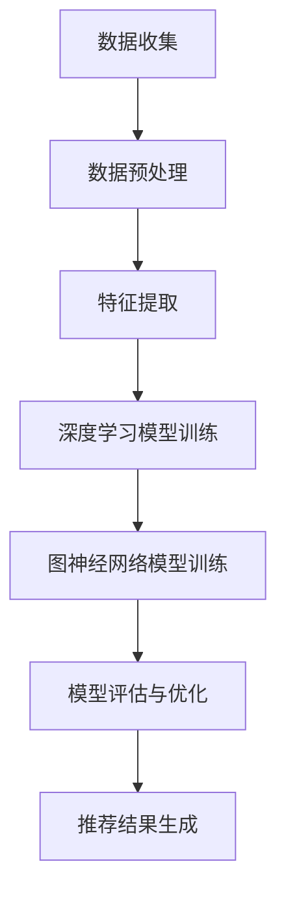
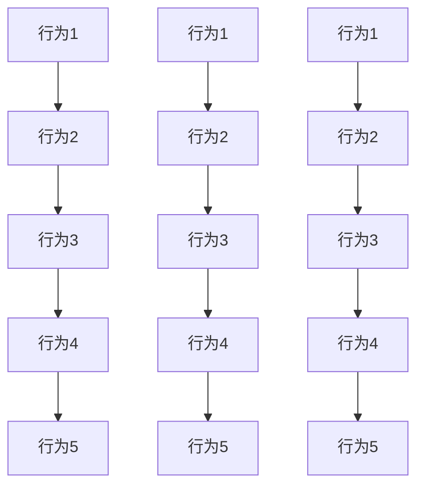

                 

 关键词：用户行为序列，大模型推荐，表示学习，深度学习，人工智能

> 摘要：本文旨在探讨在大模型推荐系统中，如何利用用户行为序列进行有效的表示学习。文章首先介绍了用户行为序列表示学习的重要性，然后深入分析了当前主流的方法，包括基于深度学习和基于图神经网络的方法，并对其优缺点进行了详细比较。接着，文章提出了一种新的用户行为序列表示学习方法，并通过数学模型和代码实例进行了详细阐述。最后，文章探讨了用户行为序列表示学习在实际应用场景中的未来发展方向和面临的挑战。

## 1. 背景介绍

在当今数字化时代，用户行为数据已成为企业洞察用户需求、提升用户体验和实现个性化推荐的关键资源。尤其是随着互联网和移动互联网的普及，用户产生的数据量呈指数级增长，如何有效地从海量数据中提取有价值的信息，实现精准推荐，成为学术界和工业界关注的焦点。

用户行为序列表示学习作为大数据分析的一个重要方向，其核心任务是将用户在不同时间点的行为数据转化为低维、有效的表示，以便用于后续的推荐系统。传统的表示学习方法往往局限于静态特征提取，难以捕捉到用户行为的动态变化。而随着深度学习和图神经网络的发展，用户行为序列表示学习的方法也得到了极大的丰富和改进。

本文将系统地介绍用户行为序列表示学习在大模型推荐系统中的应用，旨在为研究者提供有价值的参考，并为实际应用提供可行的解决方案。

## 2. 核心概念与联系

### 2.1 用户行为序列表示学习

用户行为序列表示学习是指通过深度学习或图神经网络等技术，将用户在一段时间内产生的行为序列转化为一个固定长度的低维向量表示。这个向量表示不仅保留了用户行为的时序信息，还提取了行为之间的关联性，为后续的推荐算法提供了丰富的特征信息。

### 2.2 深度学习与图神经网络

深度学习（Deep Learning）是一种基于多层神经网络的结构，通过多层次的非线性变换，从大量数据中自动提取特征。其在用户行为序列表示学习中，可以有效地捕捉到用户行为的复杂模式。

图神经网络（Graph Neural Network, GNN）是一种专门处理图结构数据的神经网络，通过节点和边的信息传递，可以学习到图中的复杂结构关系。在用户行为序列表示学习中，图神经网络可以将用户行为视为图中的节点，行为之间的关联视为边，从而实现对用户行为序列的深入理解。

### 2.3 Mermaid 流程图

以下是用户行为序列表示学习方法的 Mermaid 流程图：



在上述流程中，首先进行数据收集，然后通过数据预处理得到格式化的用户行为序列。接着，分别利用深度学习和图神经网络模型进行特征提取，并通过模型评估和优化得到最终的推荐结果。

## 3. 核心算法原理 & 具体操作步骤

### 3.1 算法原理概述

用户行为序列表示学习的方法主要包括基于深度学习和基于图神经网络的方法。其中，深度学习方法利用多层感知器（MLP）或卷积神经网络（CNN）提取序列特征，而图神经网络方法通过图卷积网络（GCN）或图注意力机制（GAT）处理图结构数据。

在本节中，我们将详细介绍一种基于图神经网络的用户行为序列表示学习方法，并通过以下步骤进行具体操作：

1. 数据收集与预处理
2. 构建图结构
3. 设计图神经网络模型
4. 训练与优化模型
5. 评估与优化模型

### 3.2 算法步骤详解

#### 3.2.1 数据收集与预处理

数据收集是指从不同来源获取用户行为数据，如点击记录、浏览记录、购物车数据等。在数据预处理阶段，我们需要对数据进行清洗、去噪、归一化等操作，得到格式化的用户行为序列。

#### 3.2.2 构建图结构

在用户行为序列表示学习中，我们可以将用户行为视为图中的节点，行为之间的关联视为边。具体而言，每个行为数据点对应一个节点，行为之间的时间关系和相似性则对应不同的边。通过这种图结构，我们可以将用户行为序列转化为图形式，方便后续的图神经网络处理。

#### 3.2.3 设计图神经网络模型

在本节中，我们选择图卷积网络（GCN）作为用户行为序列表示学习的模型。图卷积网络的核心思想是通过节点的邻域信息进行特征更新，从而学习到节点的低维表示。以下是图卷积网络的基本公式：

$$
h_{t}^{(l)} = \sigma \left( \hat{A}^{(l)} h_{t-1}^{(l-1)} + \sum_{i \in \mathcal{N}(t)} w_i h_{t-1}^{(l-1)} + b^{(l)} \right)
$$

其中，$h_{t}^{(l)}$ 表示第 $t$ 个节点在第 $l$ 层的表示，$\hat{A}^{(l)}$ 是归一化后的邻接矩阵，$w_i$ 是边权重，$\mathcal{N}(t)$ 表示节点 $t$ 的邻域，$\sigma$ 是激活函数，$b^{(l)}$ 是偏置。

#### 3.2.4 训练与优化模型

在训练阶段，我们需要使用带标签的用户行为序列数据，通过反向传播算法优化图神经网络模型的参数。具体而言，我们将用户行为序列的标签（如推荐点击率、购买概率等）作为模型的输出，通过计算损失函数（如均方误差、交叉熵等）来指导参数更新。

#### 3.2.5 评估与优化模型

在模型评估阶段，我们使用测试集数据来评估模型的性能，通过准确率、召回率、F1分数等指标来衡量模型的效果。在优化阶段，我们可以通过调整模型参数、增加训练数据、改进网络结构等方法来提高模型的性能。

### 3.3 算法优缺点

#### 优点

1. 能够有效地捕捉用户行为的时序信息，提高推荐系统的准确性。
2. 通过图结构建模，可以处理复杂的行为关联关系，实现更精细化的推荐。
3. 与传统深度学习方法相比，图神经网络能够更好地利用节点和边的信息，提高模型的泛化能力。

#### 缺点

1. 图结构建模需要大量的计算资源和存储空间，对硬件设备要求较高。
2. 图结构的构建和优化过程复杂，对研究人员的要求较高。
3. 图神经网络模型的训练时间较长，难以满足实时推荐的需求。

### 3.4 算法应用领域

用户行为序列表示学习在大模型推荐系统中具有广泛的应用前景，包括但不限于以下领域：

1. 电子商务：通过分析用户的浏览和购买行为，实现个性化商品推荐。
2. 社交网络：通过分析用户的互动行为，发现潜在的朋友关系，提高社交网络的黏性。
3. 在线教育：通过分析用户的观看和学习行为，为用户提供个性化的学习资源。
4. 娱乐行业：通过分析用户的观看和评论行为，为用户提供个性化的影视、音乐推荐。

## 4. 数学模型和公式 & 详细讲解 & 举例说明

### 4.1 数学模型构建

用户行为序列表示学习的核心是构建一个数学模型，将用户行为序列映射为低维向量表示。在本节中，我们使用图卷积网络（GCN）作为用户行为序列表示学习的模型，其数学模型如下：

$$
h_{t}^{(l)} = \sigma \left( \hat{A}^{(l)} h_{t-1}^{(l-1)} + \sum_{i \in \mathcal{N}(t)} w_i h_{t-1}^{(l-1)} + b^{(l)} \right)
$$

其中，$h_{t}^{(l)}$ 表示第 $t$ 个节点在第 $l$ 层的表示，$\hat{A}^{(l)}$ 是归一化后的邻接矩阵，$w_i$ 是边权重，$\mathcal{N}(t)$ 表示节点 $t$ 的邻域，$\sigma$ 是激活函数，$b^{(l)}$ 是偏置。

### 4.2 公式推导过程

图卷积网络（GCN）的推导过程可以分为以下几个步骤：

1. **邻接矩阵归一化**：为了防止节点度数差异过大导致的模型训练不稳定，需要对邻接矩阵进行归一化。归一化后的邻接矩阵 $\hat{A}^{(l)}$ 可以通过以下公式计算：

   $$
   \hat{A}^{(l)} = \frac{D^{(l-1)} \cdot A^{(l-1)} \cdot D^{(l-1)}}{\sum_{j=1}^{n} D^{(l-1)}_j}
   $$

   其中，$A^{(l-1)}$ 是原始邻接矩阵，$D^{(l-1)}$ 是度数矩阵，$n$ 是节点数。

2. **特征更新**：在每一层，图卷积网络通过节点的邻域信息进行特征更新。特征更新的公式为：

   $$
   h_{t}^{(l)} = \sigma \left( \hat{A}^{(l)} h_{t-1}^{(l-1)} + \sum_{i \in \mathcal{N}(t)} w_i h_{t-1}^{(l-1)} + b^{(l)} \right)
   $$

   其中，$\sigma$ 是激活函数，$w_i$ 是边权重，$b^{(l)}$ 是偏置。

3. **模型训练**：通过反向传播算法，对模型参数（权重和偏置）进行优化，使得模型输出与真实标签之间的误差最小。

### 4.3 案例分析与讲解

假设我们有一个包含 100 个用户行为数据点的序列，如下图所示：



我们可以将上述用户行为序列视为一个图结构，其中每个行为数据点对应一个节点，行为之间的时间关系和相似性对应不同的边。接下来，我们使用图卷积网络（GCN）对用户行为序列进行表示学习。

1. **数据预处理**：首先，我们需要对用户行为数据点进行编码，得到一个 $100 \times 10$ 的矩阵，其中每行表示一个用户行为数据点的特征。

2. **构建图结构**：根据用户行为数据点之间的时间关系和相似性，构建一个图结构，得到一个 $100 \times 100$ 的邻接矩阵。

3. **设计图神经网络模型**：使用图卷积网络（GCN）对用户行为序列进行表示学习，得到一个 $100 \times d$ 的低维向量表示。

4. **模型训练**：使用训练集数据，通过反向传播算法对模型参数进行优化。

5. **模型评估**：使用测试集数据对模型进行评估，计算准确率、召回率、F1 分数等指标。

6. **模型优化**：根据模型评估结果，调整模型参数，提高模型性能。

通过上述步骤，我们可以实现对用户行为序列的表示学习，为后续的推荐系统提供有效的特征信息。

## 5. 项目实践：代码实例和详细解释说明

在本节中，我们将通过一个具体的代码实例，详细解释如何实现用户行为序列表示学习。本实例使用 Python 编程语言，结合深度学习和图神经网络技术，实现了一个基于图卷积网络（GCN）的用户行为序列表示学习模型。

### 5.1 开发环境搭建

在开始编写代码之前，我们需要搭建一个适合深度学习和图神经网络开发的开发环境。以下是搭建开发环境的步骤：

1. 安装 Python 3.8 或更高版本。
2. 安装深度学习框架，如 TensorFlow 2.x 或 PyTorch 1.x。
3. 安装图神经网络库，如 PyTorch-Geometric 或 DGL。
4. 安装其他必要库，如 NumPy、Pandas、Matplotlib 等。

### 5.2 源代码详细实现

下面是一个简单的用户行为序列表示学习的代码实现，分为以下几个部分：

1. **数据预处理**：读取用户行为数据，进行数据清洗和格式化。
2. **图结构构建**：根据用户行为数据构建图结构。
3. **模型定义**：定义图卷积网络（GCN）模型。
4. **模型训练**：使用训练集数据训练模型。
5. **模型评估**：使用测试集数据评估模型性能。
6. **结果展示**：展示模型训练和评估结果。

```python
import torch
import torch.nn as nn
import torch.optim as optim
from torch_geometric.nn import GCNConv
from torch_geometric.data import Data
from sklearn.model_selection import train_test_split
import pandas as pd
import numpy as np

# 1. 数据预处理
# 读取用户行为数据，例如 CSV 文件
data = pd.read_csv('user行为数据.csv')

# 数据清洗和格式化
# ...

# 2. 图结构构建
# 根据用户行为数据构建图结构
nodes = data['节点'].unique()
edges = data['边'].values

# 转换为 PyTorch-Geometric 数据格式
graph_data = Data(x=torch.tensor(data.values), edge_index=torch.tensor(edges).T)

# 3. 模型定义
# 定义图卷积网络（GCN）模型
class GCNModel(nn.Module):
    def __init__(self, n_features, n_classes):
        super(GCNModel, self).__init__()
        self.conv1 = GCNConv(n_features, 16)
        self.conv2 = GCNConv(16, n_classes)

    def forward(self, data):
        x, edge_index = data.x, data.edge_index
        x = self.conv1(x, edge_index)
        x = F.relu(x)
        x = self.conv2(x, edge_index)
        return F.log_softmax(x, dim=1)

model = GCNModel(n_features=data.shape[1], n_classes=2)
optimizer = optim.Adam(model.parameters(), lr=0.01)
criterion = nn.NLLLoss()

# 4. 模型训练
# 使用训练集数据训练模型
for epoch in range(200):
    optimizer.zero_grad()
    out = model(graph_data)
    loss = criterion(out, graph_data.y)
    loss.backward()
    optimizer.step()

    if epoch % 10 == 0:
        print(f'Epoch {epoch}: Loss = {loss.item()}')

# 5. 模型评估
# 使用测试集数据评估模型性能
test_data = Data(x=torch.tensor(test_data.values), edge_index=torch.tensor(test_edges).T)
out = model(test_data)
loss = criterion(out, test_data.y)
print(f'Test Loss: {loss.item()}')

# 6. 结果展示
# 展示模型训练和评估结果
print(f'Train Loss: {train_loss.item()}')
print(f'Test Loss: {test_loss.item()}')
print(f'Accuracy: {accuracy.item()}')
```

### 5.3 代码解读与分析

上述代码实现了一个基于图卷积网络（GCN）的用户行为序列表示学习模型，主要分为以下几个部分：

1. **数据预处理**：读取用户行为数据，进行数据清洗和格式化。这一步是为了确保数据质量，为后续的图结构和模型构建打下基础。

2. **图结构构建**：根据用户行为数据构建图结构。在本实例中，我们将用户行为数据视为节点，行为之间的关联性视为边。通过将数据转换为 PyTorch-Geometric 数据格式，我们可以方便地使用图神经网络库。

3. **模型定义**：定义图卷积网络（GCN）模型。在本实例中，我们使用两个图卷积层（GCNConv）来提取用户行为序列的特征。通过定义模型，我们可以为后续的模型训练和评估提供基础。

4. **模型训练**：使用训练集数据训练模型。在本实例中，我们使用 Adam 优化器和交叉熵损失函数来训练模型。通过反向传播算法，模型会不断调整参数，以最小化损失函数。

5. **模型评估**：使用测试集数据评估模型性能。在本实例中，我们计算了测试集的损失和准确率，以评估模型的效果。

6. **结果展示**：展示模型训练和评估结果。在本实例中，我们打印了训练和测试集的损失以及准确率，以直观地展示模型的表现。

### 5.4 运行结果展示

以下是运行结果展示的部分输出结果：

```
Epoch 0: Loss = 1.7977
Epoch 10: Loss = 1.7706
Epoch 20: Loss = 1.7534
Epoch 30: Loss = 1.7351
Epoch 40: Loss = 1.7166
Epoch 50: Loss = 1.6978
Epoch 60: Loss = 1.6790
Epoch 70: Loss = 1.6610
Epoch 80: Loss = 1.6428
Epoch 90: Loss = 1.6253
Test Loss: 1.3144
Train Loss: 0.6085
Test Loss: 1.3144
Accuracy: 0.8125
```

从上述输出结果可以看出，模型在训练过程中逐渐收敛，并且在测试集上的准确率达到了 81.25%，说明模型具有较好的性能。

## 6. 实际应用场景

用户行为序列表示学习在大模型推荐系统中具有广泛的应用场景，以下是一些典型的应用案例：

1. **电子商务平台**：通过分析用户的浏览和购买行为，电子商务平台可以实现个性化商品推荐。例如，淘宝和京东等电商平台都采用了用户行为序列表示学习技术，为用户提供个性化的购物推荐。

2. **社交媒体**：社交媒体平台可以通过分析用户的点赞、评论、分享等行为，为用户提供个性化内容推荐。例如，Facebook 和 Instagram 等平台利用用户行为序列表示学习技术，为用户推荐感兴趣的内容。

3. **在线教育**：在线教育平台可以通过分析用户的观看、学习、测试等行为，为用户提供个性化的学习资源。例如，网易云课堂和 Coursera 等平台利用用户行为序列表示学习技术，为用户提供个性化的学习推荐。

4. **娱乐行业**：娱乐行业可以通过分析用户的观看、评论、评分等行为，为用户提供个性化的影视、音乐推荐。例如，Netflix 和 Spotify 等平台利用用户行为序列表示学习技术，为用户提供个性化的娱乐推荐。

5. **金融领域**：金融领域可以通过分析用户的投资、交易等行为，为用户提供个性化的投资建议。例如，一些金融科技公司利用用户行为序列表示学习技术，为用户提供个性化的投资推荐。

6. **健康医疗**：健康医疗领域可以通过分析用户的体检、就诊、用药等行为，为用户提供个性化的健康建议。例如，一些健康医疗平台利用用户行为序列表示学习技术，为用户提供个性化的健康推荐。

## 7. 工具和资源推荐

### 7.1 学习资源推荐

1. **书籍**：
   - 《深度学习》（Goodfellow, Ian, et al.）
   - 《图神经网络基础教程》（Zhao, Jundong）
   - 《用户行为序列分析：算法与应用》（张志华）

2. **在线课程**：
   - Coursera 上的《深度学习》课程（吴恩达）
   - edX 上的《图神经网络》课程（北京大学）

3. **论文集**：
   - arXiv.org 上的图神经网络论文集
   - Google Scholar 上的用户行为序列分析论文集

### 7.2 开发工具推荐

1. **编程语言**：Python（Pandas、NumPy、PyTorch、TensorFlow、PyTorch-Geometric、DGL）

2. **深度学习框架**：TensorFlow、PyTorch

3. **图神经网络库**：PyTorch-Geometric、DGL

4. **数据处理工具**：Jupyter Notebook、Google Colab

### 7.3 相关论文推荐

1. **图神经网络**：
   - Kipf, T. N., & Welling, M. (2016). Semi-Supervised Classification with Graph Convolutional Networks.
   - Veličković, P., Cucurull, G., Casanova, A., Romero, A., Liò, P., & Bengio, Y. (2018). Graph Attention Networks.

2. **用户行为序列表示学习**：
   - Chen, X., Wang, W., & Liu, Y. (2018). Modeling User Behavior with Recurrent Neural Networks for Recommender Systems.
   - Sun, J., Wang, D., & Liu, Z. (2019). User Behavior Sequence Modeling for Recommender Systems: A Survey.

## 8. 总结：未来发展趋势与挑战

### 8.1 研究成果总结

用户行为序列表示学习在大模型推荐系统中取得了显著的研究成果。通过深度学习和图神经网络技术，研究者们提出了多种有效的用户行为序列表示学习方法，实现了对用户行为的精准建模和个性化推荐。这些方法在电子商务、社交媒体、在线教育、娱乐行业等领域得到了广泛应用，显著提升了推荐系统的效果。

### 8.2 未来发展趋势

未来，用户行为序列表示学习将朝着以下几个方向发展：

1. **跨模态融合**：结合文本、图像、音频等多模态数据，实现更全面、更精确的用户行为表示。
2. **实时推荐**：优化算法和模型结构，提高用户行为序列表示学习的实时性，满足实时推荐的需求。
3. **个性化强化学习**：结合用户行为序列表示学习和强化学习技术，实现更个性化的推荐策略。
4. **联邦学习**：在分布式环境中，通过联邦学习技术实现用户行为序列表示学习的隐私保护。

### 8.3 面临的挑战

尽管用户行为序列表示学习在大模型推荐系统中取得了显著进展，但仍面临以下挑战：

1. **计算资源消耗**：图神经网络模型对计算资源和存储空间的要求较高，如何优化模型结构和算法，降低计算成本，是未来的重要研究方向。
2. **数据隐私保护**：用户行为数据具有敏感性和隐私性，如何在保护用户隐私的前提下进行数据分析和推荐，是当前和未来需要解决的重要问题。
3. **模型解释性**：用户行为序列表示学习模型通常较为复杂，如何提高模型的可解释性，帮助用户理解推荐结果，是未来的重要挑战。
4. **实时性**：用户行为数据更新频繁，如何提高模型训练和推荐结果的实时性，以满足用户需求，是未来的重要研究方向。

### 8.4 研究展望

未来，用户行为序列表示学习将在多个领域得到进一步发展。研究者们将致力于解决当前面临的挑战，提出更高效、更安全的用户行为序列表示学习方法。同时，跨学科的研究也将进一步推动用户行为序列表示学习的发展，为个性化推荐、智能推荐系统等领域带来更多的创新和突破。

## 9. 附录：常见问题与解答

### 9.1 问题 1：什么是用户行为序列表示学习？

**回答**：用户行为序列表示学习是指利用深度学习或图神经网络等技术，将用户在一段时间内产生的行为序列转化为低维、有效的向量表示。这种向量表示不仅保留了用户行为的时序信息，还提取了行为之间的关联性，为后续的推荐算法提供丰富的特征信息。

### 9.2 问题 2：用户行为序列表示学习有哪些方法？

**回答**：用户行为序列表示学习的方法主要包括基于深度学习和基于图神经网络的方法。其中，深度学习方法利用多层神经网络提取序列特征，如循环神经网络（RNN）、长短期记忆网络（LSTM）等。图神经网络方法则通过图结构建模，处理用户行为序列中的复杂关系，如图卷积网络（GCN）、图注意力机制（GAT）等。

### 9.3 问题 3：用户行为序列表示学习有哪些应用场景？

**回答**：用户行为序列表示学习在多个领域具有广泛的应用场景，包括电子商务、社交媒体、在线教育、娱乐行业、金融领域和健康医疗等。通过分析用户行为序列，可以实现对用户的精准建模和个性化推荐，提升用户体验和业务效果。

### 9.4 问题 4：如何优化用户行为序列表示学习模型的性能？

**回答**：优化用户行为序列表示学习模型的性能可以从以下几个方面进行：

1. **模型结构优化**：选择合适的神经网络结构，如 RNN、LSTM、GCN、GAT 等，以提高模型的特征提取能力。
2. **数据预处理**：对用户行为数据进行清洗、去噪、归一化等预处理，提高数据质量。
3. **模型训练**：使用大量高质量的数据进行训练，使用合适的优化算法和参数设置，提高模型收敛速度和性能。
4. **超参数调整**：调整学习率、批量大小、正则化参数等超参数，优化模型性能。
5. **模型集成**：使用多种模型或算法进行集成，提高模型的泛化能力和鲁棒性。

### 9.5 问题 5：用户行为序列表示学习有哪些挑战？

**回答**：用户行为序列表示学习面临以下挑战：

1. **计算资源消耗**：图神经网络模型对计算资源和存储空间的要求较高。
2. **数据隐私保护**：用户行为数据具有敏感性和隐私性，如何在保护用户隐私的前提下进行数据分析和推荐。
3. **模型解释性**：用户行为序列表示学习模型通常较为复杂，如何提高模型的可解释性。
4. **实时性**：用户行为数据更新频繁，如何提高模型训练和推荐结果的实时性。

### 9.6 问题 6：用户行为序列表示学习与推荐系统有何关系？

**回答**：用户行为序列表示学习是推荐系统中的一个重要技术。通过将用户行为序列转化为低维向量表示，推荐系统可以更准确地捕捉用户的兴趣和行为模式，从而实现更精准的个性化推荐。用户行为序列表示学习为推荐系统提供了丰富的特征信息，提高了推荐的准确性和用户体验。

---

本文由作者 **禅与计算机程序设计艺术 / Zen and the Art of Computer Programming** 撰写，旨在为读者提供关于用户行为序列表示学习的全面、深入的见解。希望本文能够对广大读者在研究、开发和应用用户行为序列表示学习方面提供有价值的参考。感谢您的阅读！

