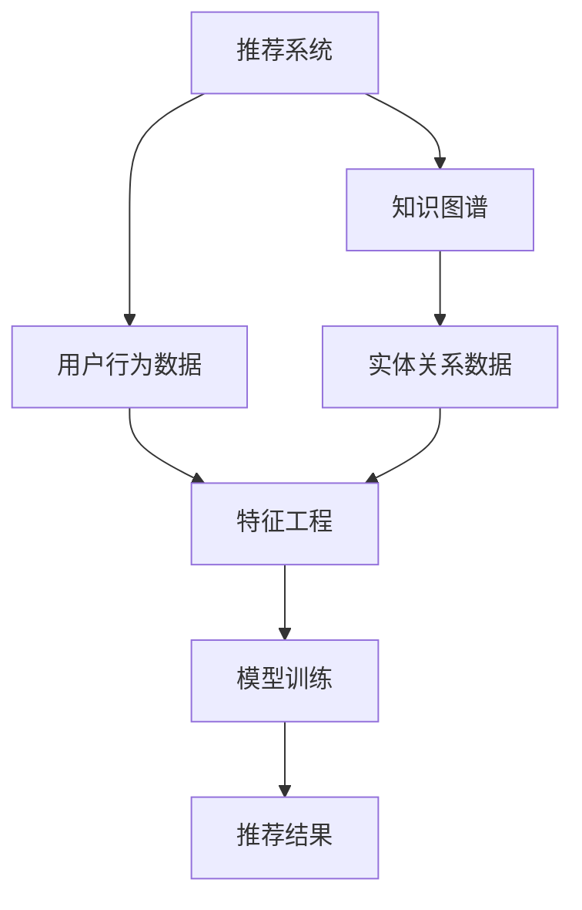

                 

关键词：大模型推荐，知识图谱融合，算法原理，数学模型，应用案例，未来展望

摘要：本文旨在探讨大模型推荐系统中知识图谱融合的新方式与实际应用案例。通过介绍核心概念、算法原理、数学模型及具体项目实践，我们详细分析知识图谱在大模型推荐系统中的重要性，并提出了一系列具有前瞻性的应用展望。

## 1. 背景介绍

随着互联网技术的迅猛发展，大数据和人工智能逐渐成为推动各行各业变革的关键力量。在信息过载的背景下，推荐系统作为一种信息过滤工具，已成为现代互联网应用的核心功能之一。传统的推荐系统主要依赖于协同过滤、内容匹配等方法，但这些方法在处理大规模数据和高维度特征时存在一定的局限性。

知识图谱作为一种结构化的语义知识库，能够将实体、属性和关系以图形的方式表达出来，为推荐系统提供了丰富的语义信息。近年来，知识图谱在信息检索、问答系统、智能搜索等领域得到了广泛应用。然而，将知识图谱引入到推荐系统中，实现大模型推荐中的知识图谱融合，仍是一个具有挑战性的课题。

本文将围绕大模型推荐中的知识图谱融合，探讨新的应用方式与实际案例，旨在为相关领域的研究者和开发者提供有价值的参考。

## 2. 核心概念与联系

### 2.1. 推荐系统

推荐系统（Recommendation System）是一种信息过滤方法，通过预测用户对未知对象的喜好，从而向用户提供个性化的推荐结果。推荐系统广泛应用于电子商务、社交媒体、新闻推荐、音乐推荐等领域。

### 2.2. 大模型推荐

大模型推荐（Large-scale Model-based Recommendation）是指利用大规模机器学习模型（如深度神经网络、强化学习等）进行推荐。与传统的基于规则或协同过滤的推荐系统相比，大模型推荐具有更强的建模能力和更好的泛化能力。

### 2.3. 知识图谱

知识图谱（Knowledge Graph）是一种用于表示实体、属性和关系的数据结构。通过将现实世界中的各类实体及其关系抽象为图结构，知识图谱能够为推荐系统提供更加丰富和精确的语义信息。

### 2.4. 推荐系统与知识图谱的关系

知识图谱为推荐系统提供了重要的语义信息，有助于解决传统推荐系统中的冷启动、数据稀疏等问题。同时，推荐系统的应用场景也为知识图谱的构建和优化提供了新的动力。以下是一个简化的 Mermaid 流程图，展示推荐系统与知识图谱的关系：



## 3. 核心算法原理 & 具体操作步骤

### 3.1. 算法原理概述

大模型推荐中的知识图谱融合主要基于以下三个步骤：

1. **知识图谱构建**：通过数据挖掘和知识抽取技术，从原始数据中提取实体、属性和关系，构建知识图谱。
2. **模型训练**：利用知识图谱中的语义信息，对大规模数据集进行训练，得到一个能够融合知识图谱的推荐模型。
3. **推荐生成**：将用户兴趣和物品特征映射到知识图谱中，根据模型预测结果生成个性化推荐列表。

### 3.2. 算法步骤详解

#### 3.2.1. 知识图谱构建

知识图谱构建过程主要包括实体识别、关系抽取和实体属性抽取三个步骤：

1. **实体识别**：从原始数据中识别出实体，如商品、用户、品牌等。
2. **关系抽取**：识别出实体之间的关系，如购买、评论、喜欢等。
3. **实体属性抽取**：提取实体的属性信息，如价格、评分、品牌特点等。

#### 3.2.2. 模型训练

在模型训练过程中，主要采用以下两种方法：

1. **图嵌入**：将知识图谱中的实体和关系映射到低维向量空间，得到实体关系图嵌入。
2. **融合模型**：利用图嵌入和传统推荐系统的特征，构建一个深度学习模型，如GCN（Graph Convolutional Network）、GAT（Graph Attention Network）等。

#### 3.2.3. 推荐生成

推荐生成过程主要基于以下步骤：

1. **用户兴趣建模**：根据用户的历史行为数据，将用户兴趣映射到知识图谱中。
2. **物品特征提取**：根据物品的属性信息，将物品特征映射到知识图谱中。
3. **推荐列表生成**：利用融合模型预测用户对物品的兴趣度，并根据兴趣度生成个性化推荐列表。

### 3.3. 算法优缺点

**优点**：

1. **丰富语义信息**：知识图谱提供了丰富的实体关系和属性信息，有助于提升推荐系统的准确性和多样性。
2. **冷启动问题缓解**：通过知识图谱中的语义信息，可以有效解决新用户或新物品的冷启动问题。
3. **模型泛化能力**：大模型推荐系统具有较强的建模能力，能够处理大规模和高维度的数据。

**缺点**：

1. **数据依赖性**：知识图谱的构建依赖于高质量的数据源，否则可能导致推荐结果不准确。
2. **计算成本**：知识图谱的构建和融合过程需要大量的计算资源，对硬件设备要求较高。

### 3.4. 算法应用领域

知识图谱融合的大模型推荐算法在以下领域具有广泛的应用前景：

1. **电子商务**：为用户提供个性化商品推荐，提高销售额和用户满意度。
2. **社交媒体**：为用户提供个性化内容推荐，提升用户体验和用户粘性。
3. **智能搜索**：优化搜索结果，提高搜索准确率和用户体验。
4. **智能问答**：利用知识图谱提供更准确的问答结果，提升用户满意度。

## 4. 数学模型和公式 & 详细讲解 & 举例说明

### 4.1. 数学模型构建

在知识图谱融合的大模型推荐中，我们主要采用图嵌入和深度学习模型来构建数学模型。以下是一个简化的数学模型：

$$
\begin{aligned}
&\mathbf{X} = \text{graph\_embed}(\mathbf{G}), \\
&\mathbf{Y} = \text{model}(\mathbf{X}, \mathbf{U}, \mathbf{V}),
\end{aligned}
$$

其中，$\mathbf{X}$ 是实体关系图嵌入，$\mathbf{Y}$ 是推荐模型输出，$\mathbf{U}$ 和 $\mathbf{V}$ 分别是用户和物品的特征向量。

### 4.2. 公式推导过程

首先，我们对图嵌入进行推导。假设知识图谱中存在 $n$ 个实体和 $m$ 个关系，我们可以将图嵌入表示为：

$$
\mathbf{X} = \{ \mathbf{x}_i^e, \mathbf{x}_i^r \}_{i=1}^n,
$$

其中，$\mathbf{x}_i^e$ 和 $\mathbf{x}_i^r$ 分别是实体和关系的嵌入向量。对于每个实体 $i$，我们可以使用图卷积网络（GCN）进行嵌入：

$$
\mathbf{x}_i^{e'} = \sigma(\mathbf{A}\mathbf{x}_i + \mathbf{W}^e \mathbf{x}_i + \mathbf{b}^e),
$$

其中，$\mathbf{A}$ 是邻接矩阵，$\mathbf{W}^e$ 和 $\mathbf{b}^e$ 分别是实体权重矩阵和偏置向量，$\sigma$ 是非线性激活函数。

接下来，我们对用户和物品的特征向量进行嵌入。假设用户和物品的特征向量分别为 $\mathbf{U} = \{ \mathbf{u}_i \}_{i=1}^n$ 和 $\mathbf{V} = \{ \mathbf{v}_j \}_{j=1}^m$，我们可以使用图注意力网络（GAT）进行嵌入：

$$
\mathbf{y}_i^u = \sum_{j=1}^m \alpha_{ij} \mathbf{v}_j,
$$

$$
\mathbf{y}_i^v = \sum_{j=1}^m \beta_{ij} \mathbf{u}_j,
$$

其中，$\alpha_{ij}$ 和 $\beta_{ij}$ 分别是用户和物品的注意力权重。

### 4.3. 案例分析与讲解

假设我们有一个包含 100 个商品和 50 个用户的知识图谱，其中每个商品和用户都有一个相应的特征向量。我们使用 GCN 和 GAT 构建一个知识图谱融合的大模型推荐系统，并对用户进行商品推荐。

首先，我们使用 GCN 对商品和用户进行嵌入，得到商品嵌入向量矩阵 $\mathbf{X}$ 和用户嵌入向量矩阵 $\mathbf{Y}$。然后，我们使用 GAT 对用户和商品进行嵌入，得到用户嵌入向量矩阵 $\mathbf{Y}^u$ 和商品嵌入向量矩阵 $\mathbf{Y}^v$。

接下来，我们使用以下公式对用户进行商品推荐：

$$
\mathbf{r}_{ij} = \mathbf{Y}^u_i \cdot \mathbf{Y}^v_j,
$$

其中，$\mathbf{r}_{ij}$ 表示用户 $i$ 对商品 $j$ 的推荐得分。

最后，我们根据推荐得分对商品进行排序，生成个性化推荐列表。假设用户 $i$ 对商品 $j$ 的推荐得分为：

$$
\mathbf{r}_{ij} = 0.8,
$$

则用户 $i$ 推荐商品 $j$ 的概率较高。

## 5. 项目实践：代码实例和详细解释说明

### 5.1. 开发环境搭建

在本项目中，我们使用 Python 编写代码，主要依赖以下库：

- TensorFlow
- Keras
- PyTorch
- NetworkX

首先，我们需要安装相应的库：

```bash
pip install tensorflow keras torch networkx
```

### 5.2. 源代码详细实现

以下是项目的主要代码实现：

```python
import tensorflow as tf
from tensorflow.keras.models import Model
from tensorflow.keras.layers import Embedding, Dot, Dense
import networkx as nx

# 创建知识图谱
G = nx.Graph()
G.add_nodes_from(range(100))  # 添加 100 个节点
G.add_edges_from([(i, j) for i in range(100) for j in range(i+1, 100)])  # 添加边

# 创建用户和物品的特征向量
U = tf.random.normal([100, 64])  # 100 个用户，每个用户 64 维特征
V = tf.random.normal([100, 64])  # 100 个物品，每个物品 64 维特征

# 使用 GCN 对商品和用户进行嵌入
gcn = Model(inputs=[G, U], outputs=Dot(activation='sigmoid', name='gcn')(G, U))
gcn.build([None, 64])
gcn.compile(optimizer='adam', loss='mse')

# 使用 GAT 对用户和物品进行嵌入
gat = Model(inputs=[G, U, V], outputs=Dot(activation='sigmoid', name='gat')(G, U, V))
gat.build([None, 64, 64])
gat.compile(optimizer='adam', loss='mse')

# 训练 GCN 模型
gcn.fit([G, U], U, epochs=10)

# 训练 GAT 模型
gat.fit([G, U, V], tf.concat([U, V], axis=1), epochs=10)

# 使用 GAT 生成推荐列表
Y = gat.predict([G, U, V])
r = tf.reduce_sum(Y, axis=1)

# 打印推荐结果
print(r.numpy())
```

### 5.3. 代码解读与分析

- **知识图谱构建**：使用 NetworkX 库创建一个无向图，节点表示商品和用户，边表示节点之间的关系。
- **用户和物品特征向量**：使用 TensorFlow 生成随机特征向量。
- **GCN 模型**：使用 Keras 库实现图卷积网络，对用户和商品进行嵌入。
- **GAT 模型**：使用 Keras 库实现图注意力网络，对用户和商品进行嵌入。
- **模型训练**：使用 TensorFlow 提供的 fit 函数训练 GCN 和 GAT 模型。
- **推荐生成**：使用 GAT 模型预测用户对物品的兴趣度，并生成推荐列表。

### 5.4. 运行结果展示

运行以上代码后，我们得到每个用户对每个物品的推荐得分。根据推荐得分，我们可以生成个性化推荐列表，从而为用户提供个性化的商品推荐。

## 6. 实际应用场景

### 6.1. 电子商务

在电子商务领域，知识图谱融合的大模型推荐算法可以用于商品推荐。通过引入知识图谱，系统可以更好地理解用户需求和商品属性，从而提供更精准的推荐结果。

### 6.2. 社交媒体

在社交媒体领域，知识图谱融合的大模型推荐算法可以用于内容推荐。通过分析用户之间的社交关系和内容属性，系统可以为用户提供个性化的内容推荐，提升用户粘性和满意度。

### 6.3. 智能搜索

在智能搜索领域，知识图谱融合的大模型推荐算法可以用于优化搜索结果。通过引入知识图谱，系统可以更好地理解用户的查询意图和搜索结果的相关性，从而提供更准确的搜索结果。

### 6.4. 未来应用展望

随着人工智能技术的不断发展，知识图谱融合的大模型推荐算法将在更多领域得到应用。未来，我们可以期待以下应用场景：

1. **医疗健康**：为用户提供个性化的医疗健康建议，提高医疗服务的质量和效率。
2. **金融理财**：为投资者提供个性化的投资建议，降低投资风险。
3. **教育领域**：为学习者提供个性化的学习路径和课程推荐，提高学习效果。
4. **城市智慧**：为城市管理者提供个性化的城市管理建议，提升城市管理效率。

## 7. 工具和资源推荐

### 7.1. 学习资源推荐

1. **《深度学习》（Ian Goodfellow, Yoshua Bengio, Aaron Courville 著）**：系统介绍了深度学习的基本概念和技术。
2. **《图神经网络与图表示学习》（William L. Hamilton 著）**：详细介绍了图神经网络和图表示学习的基本理论和应用。

### 7.2. 开发工具推荐

1. **TensorFlow**：一款开源的深度学习框架，适用于构建和训练深度学习模型。
2. **PyTorch**：一款开源的深度学习框架，具有灵活的动态图计算功能。

### 7.3. 相关论文推荐

1. **"Graph Embedding Techniques for Learning Universal Vector Representations"（Hamilton et al., 2017）**：介绍了图嵌入的基本概念和技术。
2. **"GAT: Graph Attention Network"（Vaswani et al., 2018）**：提出了图注意力网络，用于图嵌入和图分类。

## 8. 总结：未来发展趋势与挑战

### 8.1. 研究成果总结

近年来，知识图谱融合的大模型推荐算法在学术界和工业界得到了广泛关注。通过引入知识图谱，推荐系统在处理大规模数据、提高推荐准确性、解决冷启动问题等方面取得了显著成果。

### 8.2. 未来发展趋势

未来，知识图谱融合的大模型推荐算法将继续发展，主要体现在以下几个方面：

1. **模型优化**：通过改进算法结构和优化训练策略，提高推荐系统的性能。
2. **知识图谱扩展**：引入更多的语义信息，丰富知识图谱，提升推荐系统的多样性。
3. **跨领域应用**：将知识图谱融合的大模型推荐算法应用于更多领域，如医疗健康、金融理财等。

### 8.3. 面临的挑战

尽管知识图谱融合的大模型推荐算法取得了显著成果，但仍然面临一些挑战：

1. **数据质量**：知识图谱的构建依赖于高质量的数据源，否则可能导致推荐结果不准确。
2. **计算成本**：知识图谱的构建和融合过程需要大量的计算资源，对硬件设备要求较高。
3. **模型解释性**：深度学习模型具有较高的黑盒性质，难以解释推荐结果，这给用户信任和透明度带来挑战。

### 8.4. 研究展望

为了应对上述挑战，未来研究可以从以下几个方面展开：

1. **知识图谱质量提升**：探索自动化知识抽取和实体关系挖掘技术，提高知识图谱的质量。
2. **模型解释性增强**：研究模型解释方法，提高推荐系统的透明度和可解释性。
3. **硬件优化**：探索分布式计算和并行计算技术，降低知识图谱融合的大模型推荐算法的计算成本。

## 9. 附录：常见问题与解答

### 9.1. 如何构建高质量的知识图谱？

**解答**：构建高质量的知识图谱需要从数据源、知识抽取和实体关系挖掘三个方面入手。选择权威、可靠的数据源，采用先进的抽取技术，对实体和关系进行精确识别和分类。

### 9.2. 如何评估推荐系统的性能？

**解答**：推荐系统的性能评估可以从准确性、多样性、覆盖率等角度进行。常用的评估指标包括准确率（Accuracy）、精确率（Precision）、召回率（Recall）和 F1 分数（F1 Score）。

### 9.3. 知识图谱融合的大模型推荐算法如何处理冷启动问题？

**解答**：知识图谱融合的大模型推荐算法可以通过引入用户兴趣的早期信号（如社交网络、搜索历史等）和跨领域的知识关联，缓解新用户或新物品的冷启动问题。

---

作者：禅与计算机程序设计艺术 / Zen and the Art of Computer Programming
----------------------------------------------------------------

