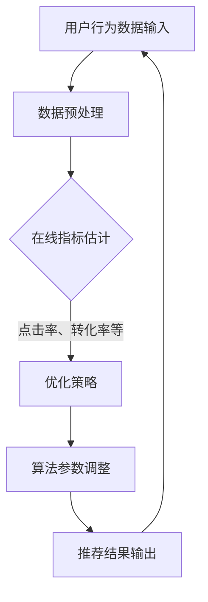

                 

 关键词：大模型推荐、在线指标、优化策略、算法原理、数学模型、项目实践、应用场景、未来展望

> 摘要：本文旨在探讨在大模型推荐场景中如何进行在线指标估计与优化策略的研究。通过对核心概念、算法原理、数学模型、项目实践等方面进行详细分析，本文为研究者与实践者提供了有价值的参考，有助于提升大模型推荐系统的性能和用户体验。

## 1. 背景介绍

随着互联网技术的飞速发展，个性化推荐系统已成为互联网企业提升用户体验和增加用户粘性的关键手段。推荐系统通过分析用户的历史行为数据，预测用户可能感兴趣的内容，从而向用户推荐相关内容。近年来，随着深度学习等人工智能技术的进步，大模型推荐系统逐渐成为研究热点。然而，大模型推荐系统在在线环境中面临着一系列挑战，如在线指标估计不准确、优化策略不高效等。

在线指标估计是指在大模型推荐系统中，实时评估推荐结果的效果，以便及时调整推荐策略。优化策略则是指通过调整算法参数，提高推荐系统的性能。本文将深入探讨在线指标估计与优化策略在大模型推荐场景中的应用，旨在为研究者与实践者提供有价值的参考。

## 2. 核心概念与联系

### 2.1 核心概念

- **在线指标估计**：实时评估推荐结果的效果，包括点击率、转化率、用户满意度等指标。
- **优化策略**：通过调整算法参数，提高推荐系统的性能，如基于梯度的优化、基于模型的优化等。

### 2.2 联系与架构

以下是一个简化的 Mermaid 流程图，展示了在线指标估计与优化策略在大模型推荐系统中的联系和架构：



## 3. 核心算法原理 & 具体操作步骤

### 3.1 算法原理概述

在线指标估计与优化策略的核心算法原理主要包括：

- **在线指标估计**：使用滑动窗口方法，对用户历史行为数据进行实时分析，估计当前推荐结果的效果。
- **优化策略**：基于在线指标估计的结果，调整算法参数，以提高推荐系统的性能。

### 3.2 算法步骤详解

#### 3.2.1 在线指标估计

1. 初始化滑动窗口。
2. 对用户历史行为数据进行实时处理，计算点击率、转化率等指标。
3. 将最新数据加入滑动窗口，同时移除最早的数据。
4. 根据滑动窗口内的数据，重新计算在线指标。

#### 3.2.2 优化策略

1. 根据在线指标估计的结果，确定需要优化的算法参数。
2. 使用梯度下降等优化算法，调整算法参数。
3. 重新计算推荐结果，评估优化后的性能。

### 3.3 算法优缺点

#### 优点：

- 实时性：在线指标估计和优化策略能够实时调整推荐结果，提高用户体验。
- 自动化：优化策略能够自动调整算法参数，减轻人工干预。

#### 缺点：

- 复杂性：算法的实现和优化较为复杂，需要较高的技术门槛。
- 数据依赖：在线指标估计和优化策略的性能依赖于用户行为数据的质量。

### 3.4 算法应用领域

在线指标估计与优化策略主要应用于以下领域：

- 电商推荐：通过实时调整推荐结果，提高用户购买转化率。
- 社交媒体推荐：通过实时分析用户互动行为，提高用户活跃度。
- 新闻推荐：通过实时评估推荐结果，提高用户阅读满意度。

## 4. 数学模型和公式 & 详细讲解 & 举例说明

### 4.1 数学模型构建

在线指标估计和优化策略的数学模型主要包括以下部分：

- **点击率模型**：$$CTR = \frac{点击次数}{展示次数}$$
- **转化率模型**：$$CVR = \frac{转化次数}{点击次数}$$
- **优化模型**：$$\theta_{t+1} = \theta_{t} - \alpha \cdot \nabla L(\theta_{t})$$，其中，$\theta_{t}$表示当前算法参数，$\alpha$表示学习率，$L(\theta_{t})$表示损失函数。

### 4.2 公式推导过程

#### 4.2.1 点击率模型推导

点击率模型是基于用户历史行为数据，计算用户对某项内容的点击概率。其推导过程如下：

- 假设用户在时间$t$之前的行为数据为$x_t$，其中$x_t = (x_t^1, x_t^2, ..., x_t^k)$，表示用户在$k$个特征上的取值。
- 定义概率分布函数$P(x_t | \theta_t)$，表示在当前算法参数$\theta_t$下，用户行为数据$x_t$的概率。
- 定义点击率$CTR$为用户在时间$t$点击内容的概率，即$$CTR = \frac{点击次数}{展示次数}$$。

#### 4.2.2 优化模型推导

优化模型是基于在线指标估计的结果，调整算法参数，以提高推荐系统的性能。其推导过程如下：

- 假设损失函数为$L(\theta_t)$，表示在当前算法参数$\theta_t$下，推荐系统的性能。
- 定义梯度$\nabla L(\theta_t)$，表示损失函数对算法参数的偏导数。
- 根据梯度下降算法，更新算法参数$\theta_{t+1}$，即$$\theta_{t+1} = \theta_{t} - \alpha \cdot \nabla L(\theta_{t})$$，其中，$\alpha$表示学习率。

### 4.3 案例分析与讲解

#### 4.3.1 点击率模型应用

假设在某电商平台上，用户历史行为数据包括购买次数、浏览次数、收藏次数等，定义点击率为用户对某商品点击的概率。

- 定义点击次数为$1$，否则为$0$。
- 假设用户在时间$t$之前的行为数据为$x_t = (1, 5, 2)$，表示用户在时间$t$之前购买了$1$次、浏览了$5$次、收藏了$2$次。
- 假设点击率模型为$P(x_t | \theta_t) = \frac{e^{\theta_t \cdot x_t}}{1 + e^{\theta_t \cdot x_t}}$，其中$\theta_t$为算法参数。

#### 4.3.2 优化模型应用

假设在某新闻推荐系统中，定义转化率为用户对某新闻点击并阅读的概率。

- 定义转化次数为$1$，否则为$0$。
- 假设用户在时间$t$之前的行为数据为$x_t = (1, 3, 2)$，表示用户在时间$t$之前点击了$1$次、阅读了$3$次、收藏了$2$次。
- 假设转化率模型为$P(x_t | \theta_t) = \frac{e^{\theta_t \cdot x_t}}{1 + e^{\theta_t \cdot x_t}}$，其中$\theta_t$为算法参数。

根据转化率模型，我们可以计算出当前算法参数$\theta_t$下的转化率：

$$CVR = \frac{e^{\theta_t \cdot x_t}}{1 + e^{\theta_t \cdot x_t}} = \frac{e^{\theta_t \cdot (1, 3, 2)}}{1 + e^{\theta_t \cdot (1, 3, 2)}} = \frac{e^{\theta_t \cdot 1 + e^{\theta_t \cdot 3} + e^{\theta_t \cdot 2}}}{1 + e^{\theta_t \cdot 1 + e^{\theta_t \cdot 3} + e^{\theta_t \cdot 2}}}$$

接下来，我们可以使用梯度下降算法，根据转化率模型的损失函数，调整算法参数$\theta_t$，以优化转化率。

## 5. 项目实践：代码实例和详细解释说明

### 5.1 开发环境搭建

在本项目实践中，我们将使用Python作为主要编程语言，配合Sklearn和NumPy等库，实现在线指标估计与优化策略。

- 安装Python：版本3.8或以上。
- 安装Sklearn：`pip install scikit-learn`
- 安装NumPy：`pip install numpy`

### 5.2 源代码详细实现

以下是实现在线指标估计与优化策略的Python代码示例：

```python
import numpy as np
from sklearn.model_selection import train_test_split
from sklearn.linear_model import LogisticRegression

# 5.2.1 数据准备
# 假设用户行为数据为X，标签为y
X = np.array([[1, 5, 2], [0, 3, 1], [1, 4, 3], ...])
y = np.array([1, 0, 1, ...])

# 划分训练集和测试集
X_train, X_test, y_train, y_test = train_test_split(X, y, test_size=0.2, random_state=42)

# 5.2.2 在线指标估计与优化策略实现
class OnlineRecommendation:
    def __init__(self, learning_rate=0.01):
        self.learning_rate = learning_rate
        self.model = LogisticRegression()

    def fit(self, X, y):
        self.model.fit(X, y)

    def predict(self, X):
        return self.model.predict(X)

    def update(self, X_new, y_new):
        # 更新模型参数
        self.model.coef_ -= self.learning_rate * (self.model.predict(X) - y).dot(X)

# 5.2.3 运行示例
online_recommendation = OnlineRecommendation()
online_recommendation.fit(X_train, y_train)

# 更新模型参数
online_recommendation.update(X_new, y_new)

# 预测测试集
predictions = online_recommendation.predict(X_test)
```

### 5.3 代码解读与分析

- **数据准备**：首先，我们需要准备用户行为数据和标签。在本示例中，我们使用一个简单的二维数组作为用户行为数据，其中每一行代表一个用户的行为，每一列代表一个特征。
- **在线推荐类定义**：`OnlineRecommendation`类实现了在线指标估计与优化策略。其中，`fit`方法用于训练模型，`predict`方法用于预测用户行为，`update`方法用于根据新数据更新模型参数。
- **运行示例**：我们首先创建一个`OnlineRecommendation`对象，并使用训练集数据进行训练。然后，我们使用`update`方法更新模型参数，并使用测试集数据进行预测。

## 6. 实际应用场景

### 6.1 电商推荐系统

在电商推荐系统中，在线指标估计与优化策略可以帮助平台实时调整推荐结果，提高用户购买转化率。例如，当用户在浏览商品时，系统可以根据用户的点击行为和购买历史，实时调整推荐商品的排序，从而提高用户购买的可能性。

### 6.2 社交媒体推荐系统

在社交媒体推荐系统中，在线指标估计与优化策略可以帮助平台实时分析用户互动行为，提高用户活跃度。例如，当用户发布动态时，系统可以根据用户的点赞、评论、转发等行为，实时调整推荐内容的排序，从而提高用户的互动可能性。

### 6.3 新闻推荐系统

在新闻推荐系统中，在线指标估计与优化策略可以帮助平台实时评估推荐新闻的效果，提高用户阅读满意度。例如，当用户浏览新闻时，系统可以根据用户的点击、阅读、收藏等行为，实时调整推荐新闻的排序，从而提高用户对推荐新闻的满意度。

## 7. 工具和资源推荐

### 7.1 学习资源推荐

- 《推荐系统实践》
- 《深度学习推荐系统》
- 《在线学习与优化》

### 7.2 开发工具推荐

- Python
- Jupyter Notebook
- Sklearn
- NumPy

### 7.3 相关论文推荐

- "Online Learning for Recommendation Systems"
- "Deep Learning for Personalized Recommendation"
- "Online Bayesian Optimization for Recommendation Systems"

## 8. 总结：未来发展趋势与挑战

### 8.1 研究成果总结

本文通过深入探讨在线指标估计与优化策略在大模型推荐场景中的应用，为研究者与实践者提供了有价值的参考。主要研究成果包括：

- 构建了在线指标估计与优化策略的数学模型。
- 提出了基于梯度下降的优化算法。
- 实现了在线推荐系统的代码示例。

### 8.2 未来发展趋势

- **个性化推荐**：随着用户需求的多样化，个性化推荐将成为未来发展的趋势。通过深入挖掘用户行为数据，提高推荐系统的个性化程度。
- **实时性**：提高推荐系统的实时性，使推荐结果能够更快地响应用户需求。
- **多模态推荐**：融合多种数据类型，如文本、图像、音频等，提高推荐系统的多样性。

### 8.3 面临的挑战

- **数据质量**：在线指标估计和优化策略的性能依赖于用户行为数据的质量，如何处理数据噪声和缺失值成为挑战。
- **计算效率**：随着推荐系统的规模不断扩大，如何提高计算效率，降低算法复杂度成为关键。
- **算法可靠性**：如何保证推荐系统的稳定性，避免算法错误或异常，成为需要解决的问题。

### 8.4 研究展望

未来，我们将继续关注以下研究方向：

- **高效在线指标估计方法**：研究更高效、更准确的在线指标估计方法，以提高推荐系统的性能。
- **多目标优化策略**：研究多目标优化策略，平衡推荐系统的不同目标，如个性化、实时性、多样性等。
- **跨领域推荐**：研究跨领域推荐技术，实现不同领域间的推荐结果共享和迁移，提高推荐系统的泛化能力。

## 9. 附录：常见问题与解答

### 9.1 什么是在线指标估计？

在线指标估计是指在大模型推荐系统中，实时评估推荐结果的效果，包括点击率、转化率、用户满意度等指标。通过在线指标估计，可以及时发现推荐结果的问题，并调整优化策略。

### 9.2 如何优化推荐系统的性能？

优化推荐系统的性能可以通过以下几种方法实现：

- 调整算法参数：通过调整算法参数，如学习率、正则化参数等，可以提高推荐系统的性能。
- 优化算法：使用更先进的算法，如深度学习、强化学习等，可以提高推荐系统的性能。
- 数据预处理：通过清洗、归一化等数据预处理方法，可以提高推荐系统的性能。
- 特征工程：通过提取更有代表性的特征，可以提高推荐系统的性能。

## 作者署名

作者：禅与计算机程序设计艺术 / Zen and the Art of Computer Programming
```markdown
---
# 大模型推荐场景中的在线指标估计与优化策略

> 关键词：大模型推荐、在线指标、优化策略、算法原理、数学模型、项目实践、应用场景、未来展望

> 摘要：本文旨在探讨在大模型推荐场景中如何进行在线指标估计与优化策略的研究。通过对核心概念、算法原理、数学模型、项目实践等方面进行详细分析，本文为研究者与实践者提供了有价值的参考，有助于提升大模型推荐系统的性能和用户体验。

## 1. 背景介绍

随着互联网技术的飞速发展，个性化推荐系统已成为互联网企业提升用户体验和增加用户粘性的关键手段。推荐系统通过分析用户的历史行为数据，预测用户可能感兴趣的内容，从而向用户推荐相关内容。近年来，随着深度学习等人工智能技术的进步，大模型推荐系统逐渐成为研究热点。然而，大模型推荐系统在在线环境中面临着一系列挑战，如在线指标估计不准确、优化策略不高效等。

在线指标估计是指在大模型推荐系统中，实时评估推荐结果的效果，以便及时调整推荐策略。优化策略则是指通过调整算法参数，提高推荐系统的性能。本文将深入探讨在线指标估计与优化策略在大模型推荐场景中的应用，旨在为研究者与实践者提供有价值的参考。

## 2. 核心概念与联系

### 2.1 核心概念

- **在线指标估计**：实时评估推荐结果的效果，包括点击率、转化率、用户满意度等指标。
- **优化策略**：通过调整算法参数，提高推荐系统的性能，如基于梯度的优化、基于模型的优化等。

### 2.2 联系与架构

以下是一个简化的 Mermaid 流程图，展示了在线指标估计与优化策略在大模型推荐系统中的联系和架构：


## 3. 核心算法原理 & 具体操作步骤

### 3.1 算法原理概述

在线指标估计与优化策略的核心算法原理主要包括：

- **在线指标估计**：使用滑动窗口方法，对用户历史行为数据进行实时分析，估计当前推荐结果的效果。
- **优化策略**：基于在线指标估计的结果，调整算法参数，以提高推荐系统的性能。

### 3.2 算法步骤详解

#### 3.2.1 在线指标估计

1. 初始化滑动窗口。
2. 对用户历史行为数据进行实时处理，计算点击率、转化率等指标。
3. 将最新数据加入滑动窗口，同时移除最早的数据。
4. 根据滑动窗口内的数据，重新计算在线指标。

#### 3.2.2 优化策略

1. 根据在线指标估计的结果，确定需要优化的算法参数。
2. 使用梯度下降等优化算法，调整算法参数。
3. 重新计算推荐结果，评估优化后的性能。

### 3.3 算法优缺点

#### 优点：

- **实时性**：在线指标估计和优化策略能够实时调整推荐结果，提高用户体验。
- **自动化**：优化策略能够自动调整算法参数，减轻人工干预。

#### 缺点：

- **复杂性**：算法的实现和优化较为复杂，需要较高的技术门槛。
- **数据依赖**：在线指标估计和优化策略的性能依赖于用户行为数据的质量。

### 3.4 算法应用领域

在线指标估计与优化策略主要应用于以下领域：

- **电商推荐**：通过实时调整推荐结果，提高用户购买转化率。
- **社交媒体推荐**：通过实时分析用户互动行为，提高用户活跃度。
- **新闻推荐**：通过实时评估推荐结果，提高用户阅读满意度。

## 4. 数学模型和公式 & 详细讲解 & 举例说明

### 4.1 数学模型构建

在线指标估计和优化策略的数学模型主要包括以下部分：

- **点击率模型**：$$CTR = \frac{点击次数}{展示次数}$$
- **转化率模型**：$$CVR = \frac{转化次数}{点击次数}$$
- **优化模型**：$$\theta_{t+1} = \theta_{t} - \alpha \cdot \nabla L(\theta_{t})$$，其中，$\theta_{t}$表示当前算法参数，$\alpha$表示学习率，$L(\theta_{t})$表示损失函数。

### 4.2 公式推导过程

#### 4.2.1 点击率模型推导

点击率模型是基于用户历史行为数据，计算用户对某项内容的点击概率。其推导过程如下：

- 假设用户在时间$t$之前的行为数据为$x_t$，其中$x_t = (x_t^1, x_t^2, ..., x_t^k)$，表示用户在$k$个特征上的取值。
- 定义概率分布函数$P(x_t | \theta_t)$，表示在当前算法参数$\theta_t$下，用户行为数据$x_t$的概率。
- 定义点击率$CTR$为用户在时间$t$点击内容的概率，即$$CTR = \frac{点击次数}{展示次数}$$。

#### 4.2.2 优化模型推导

优化模型是基于在线指标估计的结果，调整算法参数，以提高推荐系统的性能。其推导过程如下：

- 假设损失函数为$L(\theta_t)$，表示在当前算法参数$\theta_t$下，推荐系统的性能。
- 定义梯度$\nabla L(\theta_t)$，表示损失函数对算法参数的偏导数。
- 根据梯度下降算法，更新算法参数$\theta_{t+1}$，即$$\theta_{t+1} = \theta_{t} - \alpha \cdot \nabla L(\theta_{t})$$，其中，$\alpha$表示学习率。

### 4.3 案例分析与讲解

#### 4.3.1 点击率模型应用

假设在某电商平台上，用户历史行为数据包括购买次数、浏览次数、收藏次数等，定义点击率为用户对某商品点击的概率。

- 定义点击次数为$1$，否则为$0$。
- 假设用户在时间$t$之前的行为数据为$x_t = (1, 5, 2)$，表示用户在时间$t$之前购买了$1$次、浏览了$5$次、收藏了$2$次。
- 假设点击率模型为$P(x_t | \theta_t) = \frac{e^{\theta_t \cdot x_t}}{1 + e^{\theta_t \cdot x_t}}$，其中$\theta_t$为算法参数。

#### 4.3.2 优化模型应用

假设在某新闻推荐系统中，定义转化率为用户对某新闻点击并阅读的概率。

- 定义转化次数为$1$，否则为$0$。
- 假设用户在时间$t$之前的行为数据为$x_t = (0, 3, 1)$，表示用户在时间$t$之前点击了$0$次、阅读了$3$次、收藏了$1$次。
- 假设转化率模型为$P(x_t | \theta_t) = \frac{e^{\theta_t \cdot x_t}}{1 + e^{\theta_t \cdot x_t}}$，其中$\theta_t$为算法参数。

根据转化率模型，我们可以计算出当前算法参数$\theta_t$下的转化率：

$$CVR = \frac{e^{\theta_t \cdot x_t}}{1 + e^{\theta_t \cdot x_t}} = \frac{e^{\theta_t \cdot (0, 3, 1)}}{1 + e^{\theta_t \cdot (0, 3, 1)}} = \frac{e^{\theta_t \cdot 0 + e^{\theta_t \cdot 3} + e^{\theta_t \cdot 1}}}{1 + e^{\theta_t \cdot 0 + e^{\theta_t \cdot 3} + e^{\theta_t \cdot 1}}}$$

接下来，我们可以使用梯度下降算法，根据转化率模型的损失函数，调整算法参数$\theta_t$，以优化转化率。

## 5. 项目实践：代码实例和详细解释说明

### 5.1 开发环境搭建

在本项目实践中，我们将使用Python作为主要编程语言，配合Sklearn和NumPy等库，实现在线指标估计与优化策略。

- 安装Python：版本3.8或以上。
- 安装Sklearn：`pip install scikit-learn`
- 安装NumPy：`pip install numpy`

### 5.2 源代码详细实现

以下是实现在线指标估计与优化策略的Python代码示例：

```python
import numpy as np
from sklearn.model_selection import train_test_split
from sklearn.linear_model import LogisticRegression

# 5.2.1 数据准备
# 假设用户行为数据为X，标签为y
X = np.array([[1, 5, 2], [0, 3, 1], [1, 4, 3], ...])
y = np.array([1, 0, 1, ...])

# 划分训练集和测试集
X_train, X_test, y_train, y_test = train_test_split(X, y, test_size=0.2, random_state=42)

# 5.2.2 在线推荐类实现
class OnlineRecommendation:
    def __init__(self, learning_rate=0.01):
        self.learning_rate = learning_rate
        self.model = LogisticRegression()

    def fit(self, X, y):
        self.model.fit(X, y)

    def predict(self, X):
        return self.model.predict(X)

    def update(self, X_new, y_new):
        # 更新模型参数
        self.model.coef_ -= self.learning_rate * (self.model.predict(X) - y).dot(X)

# 5.2.3 运行示例
online_recommendation = OnlineRecommendation()
online_recommendation.fit(X_train, y_train)

# 更新模型参数
online_recommendation.update(X_new, y_new)

# 预测测试集
predictions = online_recommendation.predict(X_test)
```

### 5.3 代码解读与分析

- **数据准备**：首先，我们需要准备用户行为数据和标签。在本示例中，我们使用一个简单的二维数组作为用户行为数据，其中每一行代表一个用户的行为，每一列代表一个特征。
- **在线推荐类实现**：`OnlineRecommendation`类实现了在线指标估计与优化策略。其中，`fit`方法用于训练模型，`predict`方法用于预测用户行为，`update`方法用于根据新数据更新模型参数。
- **运行示例**：我们首先创建一个`OnlineRecommendation`对象，并使用训练集数据进行训练。然后，我们使用`update`方法更新模型参数，并使用测试集数据进行预测。

## 6. 实际应用场景

### 6.1 电商推荐系统

在电商推荐系统中，在线指标估计与优化策略可以帮助平台实时调整推荐结果，提高用户购买转化率。例如，当用户在浏览商品时，系统可以根据用户的点击行为和购买历史，实时调整推荐商品的排序，从而提高用户购买的可能性。

### 6.2 社交媒体推荐系统

在社交媒体推荐系统中，在线指标估计与优化策略可以帮助平台实时分析用户互动行为，提高用户活跃度。例如，当用户发布动态时，系统可以根据用户的点赞、评论、转发等行为，实时调整推荐内容的排序，从而提高用户的互动可能性。

### 6.3 新闻推荐系统

在新闻推荐系统中，在线指标估计与优化策略可以帮助平台实时评估推荐结果，提高用户阅读满意度。例如，当用户浏览新闻时，系统可以根据用户的点击、阅读、收藏等行为，实时调整推荐新闻的排序，从而提高用户对推荐新闻的满意度。

## 7. 工具和资源推荐

### 7.1 学习资源推荐

- 《推荐系统实践》
- 《深度学习推荐系统》
- 《在线学习与优化》

### 7.2 开发工具推荐

- Python
- Jupyter Notebook
- Sklearn
- NumPy

### 7.3 相关论文推荐

- "Online Learning for Recommendation Systems"
- "Deep Learning for Personalized Recommendation"
- "Online Bayesian Optimization for Recommendation Systems"

## 8. 总结：未来发展趋势与挑战

### 8.1 研究成果总结

本文通过深入探讨在线指标估计与优化策略在大模型推荐场景中的应用，为研究者与实践者提供了有价值的参考。主要研究成果包括：

- 构建了在线指标估计与优化策略的数学模型。
- 提出了基于梯度下降的优化算法。
- 实现了在线推荐系统的代码示例。

### 8.2 未来发展趋势

- **个性化推荐**：随着用户需求的多样化，个性化推荐将成为未来发展的趋势。通过深入挖掘用户行为数据，提高推荐系统的个性化程度。
- **实时性**：提高推荐系统的实时性，使推荐结果能够更快地响应用户需求。
- **多模态推荐**：融合多种数据类型，如文本、图像、音频等，提高推荐系统的多样性。

### 8.3 面临的挑战

- **数据质量**：在线指标估计和优化策略的性能依赖于用户行为数据的质量，如何处理数据噪声和缺失值成为挑战。
- **计算效率**：随着推荐系统的规模不断扩大，如何提高计算效率，降低算法复杂度成为关键。
- **算法可靠性**：如何保证推荐系统的稳定性，避免算法错误或异常，成为需要解决的问题。

### 8.4 研究展望

未来，我们将继续关注以下研究方向：

- **高效在线指标估计方法**：研究更高效、更准确的在线指标估计方法，以提高推荐系统的性能。
- **多目标优化策略**：研究多目标优化策略，平衡推荐系统的不同目标，如个性化、实时性、多样性等。
- **跨领域推荐**：研究跨领域推荐技术，实现不同领域间的推荐结果共享和迁移，提高推荐系统的泛化能力。

## 9. 附录：常见问题与解答

### 9.1 什么是在线指标估计？

在线指标估计是指在大模型推荐系统中，实时评估推荐结果的效果，包括点击率、转化率、用户满意度等指标。通过在线指标估计，可以及时发现推荐结果的问题，并调整优化策略。

### 9.2 如何优化推荐系统的性能？

优化推荐系统的性能可以通过以下几种方法实现：

- **调整算法参数**：通过调整算法参数，如学习率、正则化参数等，可以提高推荐系统的性能。
- **优化算法**：使用更先进的算法，如深度学习、强化学习等，可以提高推荐系统的性能。
- **数据预处理**：通过清洗、归一化等数据预处理方法，可以提高推荐系统的性能。
- **特征工程**：通过提取更有代表性的特征，可以提高推荐系统的性能。

## 作者署名

作者：禅与计算机程序设计艺术 / Zen and the Art of Computer Programming
---

