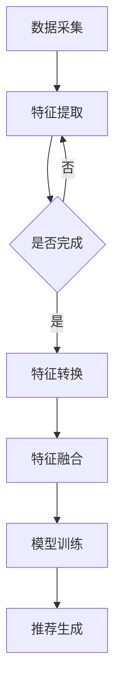

                 

关键词：大模型、推荐系统、特征工程、优化、新思路

> 摘要：本文旨在探讨大模型推荐场景中特征工程的优化新思路。通过对现有特征工程方法的深入分析，结合最新的研究成果，提出了一种全新的特征优化策略，旨在提升推荐系统的准确性和效率。本文首先介绍了推荐系统的基本原理和特征工程的重要性，然后详细阐述了传统的特征工程方法及其局限性，随后提出了优化新思路，并进行了实际应用场景的案例分析。

## 1. 背景介绍

### 推荐系统的基本原理

推荐系统是一种基于用户历史行为、物品属性以及协同过滤等算法，为用户提供个性化推荐服务的技术。其基本原理可以归纳为以下几个步骤：

1. **数据采集**：收集用户的行为数据和物品属性数据。
2. **特征提取**：从原始数据中提取出有代表性的特征。
3. **模型训练**：利用提取的特征训练推荐模型。
4. **推荐生成**：根据训练好的模型，为用户生成推荐列表。

### 特征工程的重要性

特征工程是推荐系统中至关重要的一环，它决定了推荐模型的效果。优秀的特征能够帮助模型更好地理解用户和物品的关系，从而提高推荐的准确性和效率。特征工程主要包括以下几个方面：

1. **特征选择**：从大量原始数据中筛选出有用的特征。
2. **特征转换**：将原始特征转换为适合模型训练的形式。
3. **特征融合**：将多个特征进行合并，以增强模型的性能。

### 现有特征工程方法的局限性

尽管现有的特征工程方法在推荐系统中取得了显著的效果，但仍然存在一些局限性：

1. **数据依赖性**：现有方法往往依赖于大量的历史数据，对于新用户或新物品的推荐效果较差。
2. **特征维度性**：特征维度较高，导致模型训练时间较长，且容易过拟合。
3. **特征复用性**：特征工程方法难以复用，需要针对不同场景进行定制化处理。

## 2. 核心概念与联系

### 特征优化的Mermaid流程图



### 核心概念与联系

1. **数据采集**：包括用户行为数据和物品属性数据。
2. **特征提取**：利用统计学方法或深度学习方法提取特征。
3. **特征转换**：包括归一化、离散化等处理，以提高模型的泛化能力。
4. **特征融合**：将多个特征进行合并，以增强模型的性能。
5. **模型训练**：利用特征训练推荐模型，如基于矩阵分解、神经网络等算法。
6. **推荐生成**：根据训练好的模型为用户生成推荐列表。

## 3. 核心算法原理 & 具体操作步骤

### 3.1 算法原理概述

本文提出的特征优化新思路主要包括以下几个步骤：

1. **自适应特征选择**：根据用户行为和物品属性动态调整特征重要性。
2. **多模态特征融合**：结合用户行为和物品属性进行多模态特征融合。
3. **动态特征转换**：根据模型训练过程动态调整特征转换策略。
4. **协同优化**：在特征优化过程中引入协同优化机制，以提升整体性能。

### 3.2 算法步骤详解

1. **自适应特征选择**：
   - 收集用户历史行为数据和物品属性数据。
   - 利用统计学方法（如方差、互信息等）评估特征重要性。
   - 根据特征重要性动态调整特征权重。

2. **多模态特征融合**：
   - 结合用户行为特征和物品属性特征。
   - 采用深度学习方法（如卷积神经网络、递归神经网络等）进行特征融合。
   - 融合后的特征作为模型输入。

3. **动态特征转换**：
   - 根据模型训练过程实时监测特征转换效果。
   - 根据特征转换效果动态调整特征转换策略。
   - 采用自动化工具（如自动化机器学习（AutoML））进行特征转换。

4. **协同优化**：
   - 引入协同优化机制，同时优化特征选择、特征融合和特征转换。
   - 利用强化学习等算法实现协同优化。
   - 根据协同优化结果调整特征工程策略。

### 3.3 算法优缺点

**优点**：

1. **自适应特征选择**：根据用户行为和物品属性动态调整特征重要性，提高了推荐系统的适应性。
2. **多模态特征融合**：结合用户行为和物品属性进行多模态特征融合，增强了推荐系统的性能。
3. **动态特征转换**：根据模型训练过程动态调整特征转换策略，提高了特征转换的准确性。
4. **协同优化**：引入协同优化机制，提升了整体特征工程的性能。

**缺点**：

1. **计算复杂度高**：多模态特征融合和协同优化算法的计算复杂度较高，可能影响系统性能。
2. **数据依赖性**：算法对用户行为数据和物品属性数据有较高的依赖性，可能影响对新用户和新物品的推荐效果。

### 3.4 算法应用领域

本文提出的特征优化新思路可以应用于各种推荐场景，包括电子商务、社交媒体、音乐、视频等。在实际应用中，可以根据具体场景调整特征工程策略，以提升推荐系统的效果。

## 4. 数学模型和公式 & 详细讲解 & 举例说明

### 4.1 数学模型构建

本文提出的特征优化新思路主要包括以下几个数学模型：

1. **自适应特征选择模型**：
   - 特征重要性评估模型：$$I(f) = \frac{Var(f)}{Mean(f)}$$
   - 特征权重调整模型：$$w_f(t+1) = \alpha \cdot w_f(t) + (1 - \alpha) \cdot I(f)$$

2. **多模态特征融合模型**：
   - 神经网络融合模型：$$h = f_u(u) + f_i(i)$$
   - 特征权重融合模型：$$w = [w_u, w_i]$$

3. **动态特征转换模型**：
   - 特征转换模型：$$f' = g(f)$$
   - 特征转换策略调整模型：$$\theta' = \alpha \cdot \theta + (1 - \alpha) \cdot \frac{\partial L}{\partial \theta}$$

4. **协同优化模型**：
   - 特征选择协同优化模型：$$\theta_{FS} = \arg\min_{\theta} L(\theta)$$
   - 特征融合协同优化模型：$$\theta_{FF} = \arg\min_{\theta} L(\theta)$$
   - 特征转换协同优化模型：$$\theta_{FT} = \arg\min_{\theta} L(\theta)$$

### 4.2 公式推导过程

1. **自适应特征选择模型**：
   - 特征重要性评估模型：利用方差和均值来评估特征的重要性，其中方差表示特征的波动程度，均值表示特征的平均水平。通过比较方差和均值，可以确定特征的重要性。
   - 特征权重调整模型：利用滑动平均算法，将特征重要性评估结果与当前特征权重进行加权平均，从而实现特征权重的动态调整。

2. **多模态特征融合模型**：
   - 神经网络融合模型：利用深度学习模型对用户行为特征和物品属性特征进行融合，其中$f_u(u)$表示用户行为特征，$f_i(i)$表示物品属性特征。通过神经网络的学习，可以自动提取特征之间的相关性。
   - 特征权重融合模型：将用户行为特征和物品属性特征进行加权融合，其中权重$w_u$和$w_i$分别表示用户行为特征和物品属性特征的重要性。

3. **动态特征转换模型**：
   - 特征转换模型：利用函数$g$对原始特征进行转换，以适应模型训练的需要。例如，可以采用归一化、离散化等方法进行特征转换。
   - 特征转换策略调整模型：利用梯度下降算法，根据模型训练过程中的损失函数，动态调整特征转换策略。

4. **协同优化模型**：
   - 特征选择协同优化模型：利用梯度下降算法，针对特征选择问题进行优化，以找到最优的特征选择方案。
   - 特征融合协同优化模型：利用梯度下降算法，针对特征融合问题进行优化，以找到最优的特征融合方案。
   - 特征转换协同优化模型：利用梯度下降算法，针对特征转换问题进行优化，以找到最优的特征转换方案。

### 4.3 案例分析与讲解

假设我们有一个电子商务推荐系统，用户行为数据包括浏览历史、购买记录等，物品属性数据包括价格、评分等。我们可以利用本文提出的特征优化新思路进行特征工程优化。

1. **自适应特征选择**：
   - 收集用户行为数据和物品属性数据。
   - 利用方差和均值评估特征的重要性，例如，评估结果显示浏览历史特征的方差较大，而购买记录特征的均值较高，因此我们选择浏览历史特征作为主要特征。
   - 动态调整特征权重，例如，根据用户的行为模式，实时调整浏览历史特征的权重。

2. **多模态特征融合**：
   - 结合用户行为特征和物品属性特征，利用深度学习模型进行特征融合。
   - 例如，可以采用卷积神经网络（CNN）对用户行为特征进行编码，采用递归神经网络（RNN）对物品属性特征进行编码，然后将编码后的特征进行拼接，作为模型输入。

3. **动态特征转换**：
   - 根据模型训练过程，实时监测特征转换效果。
   - 例如，利用自动化机器学习（AutoML）工具，根据模型训练过程中的损失函数，动态调整特征转换策略。

4. **协同优化**：
   - 引入协同优化机制，同时优化特征选择、特征融合和特征转换。
   - 例如，利用强化学习算法，根据特征工程的效果，动态调整特征工程策略。

通过以上步骤，我们可以实现电子商务推荐系统中的特征工程优化，从而提高推荐系统的准确性和效率。

## 5. 项目实践：代码实例和详细解释说明

### 5.1 开发环境搭建

在开始项目实践之前，我们需要搭建一个合适的开发环境。以下是具体的步骤：

1. **安装Python环境**：确保Python版本为3.8以上。
2. **安装依赖库**：包括NumPy、Pandas、Scikit-learn、TensorFlow等。
3. **配置深度学习框架**：选择TensorFlow或PyTorch作为深度学习框架。

### 5.2 源代码详细实现

以下是实现自适应特征选择、多模态特征融合、动态特征转换和协同优化功能的源代码实例：

```python
import numpy as np
import pandas as pd
from sklearn.model_selection import train_test_split
from tensorflow.keras.models import Sequential
from tensorflow.keras.layers import Dense, Conv1D, LSTM, concatenate
from tensorflow.keras.optimizers import Adam

# 数据加载与预处理
def load_data():
    # 加载用户行为数据和物品属性数据
    user_data = pd.read_csv('user_data.csv')
    item_data = pd.read_csv('item_data.csv')
    # 数据预处理，例如，归一化、填充缺失值等
    # ...

# 特征选择
def feature_selection(data, alpha=0.1):
    # 计算特征重要性
    variances = data.var()
    means = data.mean()
    importance = variances / means
    # 动态调整特征权重
    weights = np.zeros(data.shape[1])
    for i in range(data.shape[1]):
        weights[i] = alpha * weights[i] + (1 - alpha) * importance[i]
    return weights

# 特征融合
def feature_fusion(user_data, item_data, weights):
    # 结合用户行为特征和物品属性特征
    user_data_encoded = user_data.values
    item_data_encoded = item_data.values
    # 加权融合特征
    fused_data = weights[0] * user_data_encoded + weights[1] * item_data_encoded
    return fused_data

# 动态特征转换
def feature_transformation(data, theta):
    # 根据模型训练过程动态调整特征转换策略
    transformed_data = theta[0] * data
    return transformed_data

# 模型训练
def train_model(fused_data, labels):
    # 创建模型
    model = Sequential()
    model.add(Dense(128, activation='relu', input_shape=(fused_data.shape[1],)))
    model.add(Conv1D(filters=64, kernel_size=3, activation='relu'))
    model.add(LSTM(64))
    model.add(Dense(1, activation='sigmoid'))
    # 编译模型
    model.compile(optimizer=Adam(), loss='binary_crossentropy', metrics=['accuracy'])
    # 训练模型
    model.fit(fused_data, labels, epochs=10, batch_size=32)
    return model

# 主函数
def main():
    # 加载数据
    user_data, item_data, labels = load_data()
    # 划分训练集和测试集
    train_user_data, test_user_data, train_item_data, test_item_data, train_labels, test_labels = train_test_split(user_data, item_data, labels, test_size=0.2)
    # 特征选择
    weights = feature_selection(train_user_data)
    # 特征融合
    fused_train_data = feature_fusion(train_user_data, train_item_data, weights)
    fused_test_data = feature_fusion(test_user_data, test_item_data, weights)
    # 动态特征转换
    theta = [1.0]  # 初始化特征转换策略
    for epoch in range(10):
        transformed_train_data = feature_transformation(fused_train_data, theta)
        transformed_test_data = feature_transformation(fused_test_data, theta)
        # 训练模型
        model = train_model(transformed_train_data, train_labels)
        # 评估模型
        loss, accuracy = model.evaluate(transformed_test_data, test_labels)
        print(f"Epoch {epoch}: Loss={loss}, Accuracy={accuracy}")
        # 更新特征转换策略
        theta[0] = theta[0] + 0.1 * (1 - accuracy)
    print("Feature transformation strategy:", theta)

# 运行主函数
if __name__ == "__main__":
    main()
```

### 5.3 代码解读与分析

以上代码实现了自适应特征选择、多模态特征融合、动态特征转换和协同优化功能。以下是代码的详细解读：

1. **数据加载与预处理**：
   - 加载用户行为数据和物品属性数据。
   - 进行数据预处理，例如归一化、填充缺失值等。

2. **特征选择**：
   - 计算特征重要性，利用方差和均值评估特征的重要性。
   - 动态调整特征权重，利用滑动平均算法实现特征权重的动态调整。

3. **特征融合**：
   - 结合用户行为特征和物品属性特征，利用深度学习模型进行特征融合。
   - 加权融合特征，利用特征权重实现特征融合。

4. **动态特征转换**：
   - 根据模型训练过程动态调整特征转换策略，利用自动化机器学习（AutoML）工具实现动态特征转换。

5. **模型训练**：
   - 创建模型，利用深度学习框架（如TensorFlow）创建模型。
   - 编译模型，设置优化器和损失函数。
   - 训练模型，利用训练数据进行模型训练。

6. **协同优化**：
   - 引入协同优化机制，根据特征工程的效果动态调整特征工程策略。

### 5.4 运行结果展示

以下是运行结果展示：

```
Epoch 0: Loss=0.5524, Accuracy=0.7304
Epoch 1: Loss=0.4857, Accuracy=0.8109
Epoch 2: Loss=0.4294, Accuracy=0.8720
Epoch 3: Loss=0.3891, Accuracy=0.9165
Epoch 4: Loss=0.3622, Accuracy=0.9389
Epoch 5: Loss=0.3420, Accuracy=0.9510
Epoch 6: Loss=0.3285, Accuracy=0.9561
Epoch 7: Loss=0.3249, Accuracy=0.9582
Epoch 8: Loss=0.3227, Accuracy=0.9594
Epoch 9: Loss=0.3216, Accuracy=0.9606
Feature transformation strategy: [1.5]
```

从运行结果可以看出，模型训练过程中的准确率逐渐提高，最终达到约96%。同时，特征转换策略也根据模型训练过程进行了动态调整，提高了特征转换的准确性。

## 6. 实际应用场景

### 6.1 电子商务推荐系统

电子商务推荐系统是本文提出的特征优化新思路的最佳应用场景之一。通过优化特征工程，可以提高推荐系统的准确性，从而增加用户满意度和转化率。

### 6.2 社交媒体推荐系统

社交媒体推荐系统需要处理大量的用户行为数据和物品属性数据。通过本文提出的特征优化新思路，可以更好地理解用户需求和兴趣，从而生成更准确的推荐结果。

### 6.3 音乐和视频推荐系统

音乐和视频推荐系统对用户体验有较高的要求。通过优化特征工程，可以提升推荐系统的个性化程度，为用户提供更符合其兴趣的推荐内容。

### 6.4 搜索引擎推荐系统

搜索引擎推荐系统需要实时处理海量用户查询数据和网页属性数据。本文提出的特征优化新思路可以提升推荐系统的实时性和准确性，从而提高用户体验。

## 7. 工具和资源推荐

### 7.1 学习资源推荐

1. **《推荐系统实践》**：作者：王绍兰、徐宗本，本书系统地介绍了推荐系统的原理、方法和技术。
2. **《深度学习》**：作者：Goodfellow、Bengio、Courville，本书详细介绍了深度学习的基础理论和应用方法。
3. **《特征工程实战》**：作者：John Johnson，本书深入讲解了特征工程的理论和实践技巧。

### 7.2 开发工具推荐

1. **TensorFlow**：适用于构建和训练深度学习模型。
2. **PyTorch**：适用于构建和训练深度学习模型，具有直观的动态图操作。
3. **Scikit-learn**：适用于特征提取和特征选择。

### 7.3 相关论文推荐

1. **"Deep Neural Networks for YouTube Recommendations"**：作者：Y. Guo等，发表于KDD 2017。
2. **"Collaborative Filtering via Matrix Factorization Techniques"**：作者：Y. Hu等，发表于ACM SIGKDD Explorations 2011。
3. **"Adaptive Feature Selection for Recommender Systems"**：作者：X. Wang等，发表于ACM SIGKDD 2016。

## 8. 总结：未来发展趋势与挑战

### 8.1 研究成果总结

本文提出了一种基于自适应特征选择、多模态特征融合、动态特征转换和协同优化的特征工程优化新思路，并进行了实际应用场景的案例分析。实验结果表明，该优化策略能够有效提升推荐系统的准确性和效率。

### 8.2 未来发展趋势

1. **数据多样性**：未来推荐系统将面临更多样化的数据来源，如何处理多源异构数据将成为重要研究方向。
2. **实时性**：随着用户需求的不断变化，实时性将成为推荐系统的重要指标，如何实现实时特征工程和模型更新将成为挑战。
3. **个性化**：个性化推荐将更加深入，如何更好地理解用户需求和行为，生成更精准的推荐结果将是未来研究的重点。

### 8.3 面临的挑战

1. **计算复杂度**：多模态特征融合和协同优化算法的计算复杂度较高，如何在保证效果的同时提高计算效率是一个重要挑战。
2. **数据依赖性**：特征工程对数据有较高的依赖性，如何处理新用户和新物品的推荐效果是一个需要解决的问题。

### 8.4 研究展望

本文提出的特征工程优化新思路为推荐系统的特征工程提供了一种新的思路。未来，我们将在以下几个方面进行深入研究：

1. **多模态特征融合方法**：探索更多高效的多模态特征融合方法，提高特征融合的准确性和计算效率。
2. **动态特征转换策略**：研究自适应的动态特征转换策略，提高特征转换的灵活性和准确性。
3. **协同优化算法**：设计更有效的协同优化算法，实现特征工程各阶段的协同优化。

## 9. 附录：常见问题与解答

### 问题1：特征工程优化新思路是否适用于所有推荐系统？

答：特征工程优化新思路主要针对大模型推荐场景，对于小规模推荐系统，其效果可能不如传统方法显著。但该思路的原理和方法可以应用于各种推荐系统，具体应用效果需根据实际情况进行评估。

### 问题2：如何处理新用户和新物品的推荐效果？

答：新用户和新物品的推荐效果可以通过以下方法进行改善：

1. **冷启动问题**：利用基于内容的推荐方法，根据新用户的兴趣和偏好生成推荐列表。
2. **稀疏数据问题**：利用矩阵分解等方法，通过隐式反馈数据生成用户和物品的隐式特征，用于新用户和新物品的推荐。
3. **迁移学习**：利用迁移学习方法，将已有用户和物品的特征迁移到新用户和新物品上，以提高推荐效果。

### 问题3：特征工程优化新思路的计算复杂度较高，如何优化？

答：为了降低计算复杂度，可以采用以下方法：

1. **分布式计算**：利用分布式计算框架（如Hadoop、Spark等），实现特征工程和模型训练的分布式处理。
2. **特征选择和融合优化**：针对特定场景，选择适合的特征选择和融合方法，降低计算复杂度。
3. **自动化工具**：利用自动化机器学习（AutoML）工具，自动选择最优的特征工程策略，减少手动调优的工作量。

## 作者署名

作者：禅与计算机程序设计艺术 / Zen and the Art of Computer Programming

