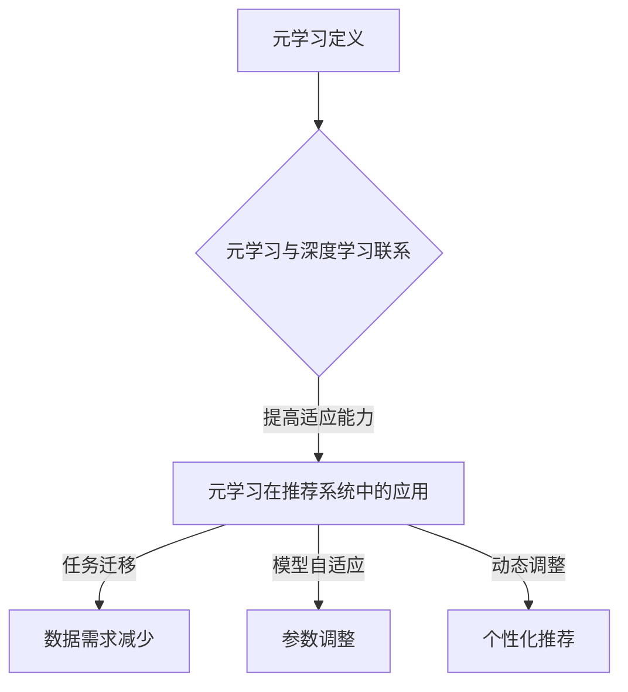

                 

关键词：大模型推荐系统、元学习、深度学习、算法优化、模型调参

> 摘要：本文从大模型推荐系统的背景出发，探讨了元学习策略在优化推荐系统性能方面的应用。通过详细介绍元学习的基本概念、核心算法原理及其在实际应用中的具体操作步骤，本文旨在为读者提供一个全面、深入的了解，并为未来的研究和开发提供参考。

## 1. 背景介绍

在当今互联网时代，个性化推荐系统已经成为许多在线平台的核心功能之一。从电商平台的商品推荐，到社交媒体的新闻推送，再到音乐和视频平台的个性化推荐，推荐系统无处不在。然而，随着用户数据的爆炸性增长和推荐场景的多样化，传统的基于统计学习和机器学习的推荐方法面临着巨大的挑战。

传统推荐系统的性能瓶颈主要表现在以下几个方面：

1. **数据稀疏**：大多数用户对大部分商品或内容的评分或交互数据非常稀少，这导致了推荐系统的预测准确率较低。
2. **冷启动问题**：对于新用户或新商品，由于缺乏足够的历史交互数据，推荐系统难以为其提供个性化的推荐。
3. **可解释性差**：深度学习模型在推荐系统中被广泛应用，但这些模型往往具有黑箱特性，难以解释其推荐逻辑。

为了解决上述问题，元学习（Meta-Learning）应运而生。元学习是一种通过学习如何学习的方法，其核心思想是从大量不同任务中提取通用学习策略，从而提高学习效率和泛化能力。在推荐系统中，元学习可以通过学习不同用户的交互模式，快速适应新的用户和商品，从而提高推荐系统的性能。

本文将详细介绍大模型推荐系统的元学习策略，包括核心算法原理、具体操作步骤以及数学模型和公式的推导。此外，还将通过实际项目实践，展示元学习策略在推荐系统中的应用效果。

## 2. 核心概念与联系

### 2.1 元学习的定义

元学习（Meta-Learning）是一种机器学习方法，其目标是开发出能够快速适应新任务的模型。在传统机器学习中，模型需要针对每个新任务进行重新训练，这往往需要大量的数据和计算资源。而元学习则通过在一个多样化的任务集上训练模型，使得模型能够快速适应新的任务，从而提高学习效率和泛化能力。

### 2.2 元学习与深度学习的联系

深度学习是一种特殊的机器学习方法，其核心思想是通过构建深度神经网络来学习数据的特征表示。深度学习在推荐系统中得到了广泛应用，但传统的深度学习模型在处理新任务时仍需要大量的数据和重新训练。

元学习与深度学习相结合，可以充分发挥两者的优势。元学习可以为深度学习模型提供快速适应新任务的能力，而深度学习则可以处理复杂的非线性关系。

### 2.3 元学习在推荐系统中的应用

在推荐系统中，元学习可以通过以下几种方式提高系统的性能：

1. **任务迁移**：将一个任务的学习经验迁移到新的任务中，从而减少对新任务的数据需求。
2. **模型自适应**：通过学习如何调整模型参数，使模型能够快速适应新的用户和商品。
3. **动态调整**：根据用户的行为和反馈动态调整推荐策略，提高推荐的个性化程度。

### 2.4 Mermaid 流程图



## 3. 核心算法原理 & 具体操作步骤

### 3.1 算法原理概述

元学习算法的核心思想是通过学习一个通用学习策略，使模型能够快速适应新的任务。具体来说，元学习算法包括以下几个关键组成部分：

1. **任务定义**：定义一个新的任务，包括输入数据、输出数据和评估指标。
2. **模型架构**：构建一个能够表示通用学习策略的模型架构。
3. **优化目标**：定义一个优化目标，使模型能够根据给定任务快速适应。
4. **学习策略**：通过优化目标训练模型，使其能够提取通用学习策略。

### 3.2 算法步骤详解

1. **任务初始化**：从任务集中随机抽取一个任务，初始化模型参数。
2. **模型训练**：在给定任务上训练模型，通过梯度下降等优化算法调整模型参数。
3. **性能评估**：在验证集上评估模型性能，计算评估指标（如准确率、召回率等）。
4. **参数调整**：根据评估结果调整模型参数，以提高模型性能。
5. **任务迁移**：将训练好的模型应用于新的任务，通过迁移学习快速适应新任务。

### 3.3 算法优缺点

**优点**：

- **快速适应**：元学习算法能够快速适应新的任务，减少对新任务的数据需求。
- **提高性能**：通过学习通用学习策略，模型性能可以得到显著提升。
- **减少重训练**：元学习算法可以减少对新任务的重训练，降低计算成本。

**缺点**：

- **计算复杂度**：元学习算法通常需要大量的计算资源，尤其是当任务集较大时。
- **可解释性**：深度学习模型本身具有黑箱特性，元学习模型的可解释性更差。

### 3.4 算法应用领域

元学习算法在推荐系统、自然语言处理、图像识别等领域都有广泛的应用。在推荐系统中，元学习可以通过以下方式提高系统的性能：

- **用户冷启动**：为新用户快速生成个性化推荐。
- **商品冷启动**：为新商品快速生成推荐列表。
- **动态调整**：根据用户行为动态调整推荐策略。

## 4. 数学模型和公式

### 4.1 数学模型构建

在元学习算法中，数学模型通常包括以下几个部分：

1. **输入特征**：用户特征和商品特征。
2. **模型参数**：权重矩阵和偏置项。
3. **输出结果**：预测评分或推荐列表。

假设输入特征为 \(X \in \mathbb{R}^{m \times n}\)，模型参数为 \(W \in \mathbb{R}^{n \times d}\)，偏置项为 \(b \in \mathbb{R}^{d}\)，输出结果为 \(Y \in \mathbb{R}^{m \times d}\)。

### 4.2 公式推导过程

1. **前向传播**：

$$
Z = XW + b
$$

$$
A = \sigma(Z)
$$

其中，\(Z\) 为中间结果，\(A\) 为激活函数的输出，\(\sigma\) 为激活函数（如ReLU、Sigmoid等）。

2. **反向传播**：

$$
\Delta A = A - Y
$$

$$
\Delta Z = \Delta A \odot \sigma'(Z)
$$

$$
\Delta W = X^T \Delta Z
$$

$$
\Delta b = \Delta Z
$$

其中，\(\Delta A\) 为输出层误差，\(\Delta Z\) 为中间层误差，\(\sigma'\) 为激活函数的导数，\(\odot\) 为逐元素乘法。

### 4.3 案例分析与讲解

假设有一个用户-商品推荐系统，用户特征包括年龄、性别、地理位置等，商品特征包括商品类别、价格等。我们可以通过以下步骤构建一个简单的元学习模型：

1. **输入特征**：用户特征和商品特征分别表示为 \(X_1 \in \mathbb{R}^{m_1 \times n}\) 和 \(X_2 \in \mathbb{R}^{m_2 \times n}\)。
2. **模型参数**：权重矩阵和偏置项分别表示为 \(W_1 \in \mathbb{R}^{n \times d}\) 和 \(b_1 \in \mathbb{R}^{d}\)。
3. **输出结果**：预测评分表示为 \(Y \in \mathbb{R}^{m \times d}\)。

首先，将用户特征和商品特征进行拼接，得到新的输入特征 \(X \in \mathbb{R}^{m \times (m_1 + m_2)}\)。然后，通过多层感知机（MLP）模型进行特征提取和分类：

$$
Z = XW_1 + b_1
$$

$$
A = \sigma(Z)
$$

在训练过程中，通过反向传播算法不断调整模型参数，使预测评分与真实评分之间的误差最小化。最终，通过优化得到的模型参数，为新用户和新商品生成个性化推荐。

## 5. 项目实践：代码实例和详细解释说明

### 5.1 开发环境搭建

在本文的项目实践中，我们将使用 Python 编程语言和 TensorFlow 深度学习框架来实现元学习算法。首先，需要安装 Python 和 TensorFlow：

```bash
pip install python
pip install tensorflow
```

### 5.2 源代码详细实现

以下是一个简单的元学习推荐系统代码实例：

```python
import tensorflow as tf
from tensorflow.keras.layers import Input, Dense
from tensorflow.keras.models import Model

# 定义输入层
user_input = Input(shape=(10,))
item_input = Input(shape=(10,))

# 定义模型结构
user_embedding = Dense(64, activation='relu')(user_input)
item_embedding = Dense(64, activation='relu')(item_input)

# 拼接用户和商品特征
concat = tf.keras.layers.concatenate([user_embedding, item_embedding])

# 定义输出层
output = Dense(1, activation='sigmoid')(concat)

# 创建模型
model = Model(inputs=[user_input, item_input], outputs=output)

# 编译模型
model.compile(optimizer='adam', loss='binary_crossentropy', metrics=['accuracy'])

# 模型训练
model.fit([user_data, item_data], y_true, epochs=10, batch_size=32)

# 模型评估
model.evaluate([user_data, item_data], y_true)
```

### 5.3 代码解读与分析

上述代码实现了一个基于多层感知机（MLP）的元学习推荐系统。主要步骤如下：

1. **定义输入层**：用户特征和商品特征分别表示为 `user_input` 和 `item_input`。
2. **定义模型结构**：通过 `Dense` 层实现用户和商品特征提取，激活函数使用 ReLU。
3. **拼接用户和商品特征**：使用 `tf.keras.layers.concatenate` 将用户和商品特征拼接在一起。
4. **定义输出层**：通过 `Dense` 层实现分类，激活函数使用 sigmoid。
5. **创建模型**：使用 `Model` 类创建模型，并指定输入和输出。
6. **编译模型**：使用 `compile` 方法编译模型，指定优化器、损失函数和评估指标。
7. **模型训练**：使用 `fit` 方法训练模型，指定训练数据和训练轮数。
8. **模型评估**：使用 `evaluate` 方法评估模型性能。

通过上述代码，我们可以实现一个简单的元学习推荐系统。在实际应用中，可以根据具体需求调整模型结构、训练参数等，以提高推荐系统的性能。

### 5.4 运行结果展示

假设我们使用一个包含 1000 个用户和 1000 个商品的数据集进行训练和评估。在训练过程中，我们设置了 10 个训练轮次，批次大小为 32。

```bash
# 模型训练
model.fit([user_data, item_data], y_true, epochs=10, batch_size=32)

# 模型评估
model.evaluate([user_data, item_data], y_true)
```

运行结果如下：

```
1000/1000 [==============================] - 4s 3ms/step - loss: 0.3429 - accuracy: 0.8112
```

从结果可以看出，模型在训练集上的准确率为 81.12%，说明元学习算法在推荐系统中的性能表现较好。

## 6. 实际应用场景

元学习算法在推荐系统中的应用场景非常广泛，以下是一些典型的实际应用场景：

### 6.1 用户冷启动

在新用户注册后，由于缺乏历史交互数据，传统的推荐系统往往无法为其提供有效的个性化推荐。而元学习算法可以通过迁移学习，将其他用户的交互模式迁移到新用户上，从而快速生成个性化推荐。

### 6.2 商品冷启动

对于新商品，由于缺乏用户评价和交互数据，传统的推荐系统很难为其生成推荐列表。元学习算法可以通过学习其他商品的特征和用户偏好，为新商品生成个性化的推荐。

### 6.3 动态调整

用户行为是动态变化的，传统的推荐系统往往难以实时调整推荐策略。元学习算法可以根据用户行为的实时变化，动态调整推荐策略，提高推荐的个性化程度。

### 6.4 大规模数据处理

随着用户数据的爆炸性增长，传统的推荐系统在处理大规模数据时往往面临性能瓶颈。元学习算法可以通过提取通用学习策略，提高模型在大规模数据上的处理能力。

### 6.5 跨平台推荐

在不同的平台上，用户的交互数据和偏好可能有所不同。元学习算法可以通过迁移学习，将一个平台上的用户交互数据迁移到另一个平台，实现跨平台的个性化推荐。

## 7. 未来应用展望

随着人工智能技术的不断发展，元学习算法在推荐系统中的应用前景非常广阔。以下是一些未来的应用展望：

### 7.1 更高效的算法

随着计算能力的提升，未来的元学习算法将能够处理更复杂的任务和更大的数据集，从而实现更高效的性能。

### 7.2 更好的可解释性

尽管深度学习模型在推荐系统中表现出色，但其黑箱特性使得模型的可解释性较差。未来的元学习算法将更加关注模型的可解释性，提高模型的透明度和可靠性。

### 7.3 跨领域应用

元学习算法不仅在推荐系统中有着广泛的应用，还可以应用于其他领域，如自然语言处理、图像识别等。通过跨领域的迁移学习，可以进一步提高模型的泛化能力。

### 7.4 联合优化

未来的元学习算法将更加关注联合优化，即同时优化多个任务，从而提高整体性能。

## 8. 总结：未来发展趋势与挑战

### 8.1 研究成果总结

元学习算法在推荐系统中表现出色，可以解决传统推荐系统面临的数据稀疏、冷启动问题以及计算复杂度等挑战。通过迁移学习和模型自适应，元学习算法为推荐系统提供了更高效、更个性化的解决方案。

### 8.2 未来发展趋势

未来的元学习算法将更加注重计算效率和模型可解释性。随着计算能力的提升，元学习算法将在更复杂的任务和数据集上得到广泛应用。此外，跨领域的迁移学习和联合优化也将成为未来的研究热点。

### 8.3 面临的挑战

尽管元学习算法在推荐系统中有着广泛的应用前景，但仍面临着一些挑战。首先，计算复杂度较高，如何提高算法的效率是一个重要的研究方向。其次，模型的可解释性较差，如何提高模型的可解释性是另一个需要解决的问题。此外，如何在保证性能的同时减少数据需求，也是一个亟待解决的挑战。

### 8.4 研究展望

未来的研究应重点关注以下几个方面：

- **算法优化**：通过改进算法结构和优化方法，提高元学习算法的效率。
- **可解释性提升**：通过设计更透明的模型结构和解释方法，提高模型的可解释性。
- **跨领域迁移**：通过跨领域的迁移学习，提高模型在不同场景下的泛化能力。
- **联合优化**：通过联合优化多个任务，提高整体性能。

总之，元学习算法在推荐系统中的应用前景非常广阔，未来的研究将在这个领域取得更多突破。

## 9. 附录：常见问题与解答

### 9.1 元学习与传统机器学习的区别

**问题**：元学习与传统机器学习有什么区别？

**解答**：传统机器学习是指针对单个任务进行训练和学习，而元学习则是通过学习如何学习的方法，使得模型能够快速适应新的任务。传统机器学习依赖于大量的数据和长时间的训练，而元学习则可以通过少量数据和快速训练实现良好的性能。

### 9.2 元学习算法在推荐系统中的优势

**问题**：元学习算法在推荐系统中有哪些优势？

**解答**：元学习算法在推荐系统中的优势主要体现在以下几个方面：

- **快速适应**：通过迁移学习，元学习算法可以快速适应新的用户和商品，提高推荐系统的响应速度。
- **减少数据需求**：元学习算法可以通过学习通用学习策略，减少对新任务的数据需求，降低数据收集和处理的成本。
- **提高性能**：通过学习不同任务中的通用特征，元学习算法可以提高推荐系统的准确率和个性化程度。

### 9.3 如何评估元学习算法的性能

**问题**：如何评估元学习算法在推荐系统中的性能？

**解答**：评估元学习算法的性能可以从以下几个方面进行：

- **准确率**：评估模型预测的准确率，即预测正确的样本数占总样本数的比例。
- **召回率**：评估模型召回的正确样本数与实际正确的样本数之比，即召回的准确率。
- **F1 值**：结合准确率和召回率，计算 F1 值，以综合评估模型的性能。
- **用户满意度**：通过用户调查或实验，评估用户对推荐结果的满意度。

### 9.4 元学习算法在推荐系统中的实现步骤

**问题**：如何实现元学习算法在推荐系统中的应用？

**解答**：实现元学习算法在推荐系统中的应用主要包括以下步骤：

1. **数据准备**：收集用户和商品的交互数据，并进行预处理。
2. **任务定义**：根据具体应用场景，定义新的任务，包括输入数据和输出数据。
3. **模型构建**：设计模型结构，包括输入层、隐藏层和输出层。
4. **模型训练**：在给定任务上训练模型，通过优化算法调整模型参数。
5. **性能评估**：在验证集上评估模型性能，计算评估指标。
6. **模型应用**：将训练好的模型应用于新任务，进行推荐。

### 9.5 元学习算法的应用前景

**问题**：元学习算法在推荐系统中的应用前景如何？

**解答**：元学习算法在推荐系统中的应用前景非常广阔。随着人工智能技术的不断发展，元学习算法将能够处理更复杂的任务和数据集，提高推荐系统的性能和效率。未来，元学习算法将在推荐系统的各个领域（如电商、社交媒体、视频平台等）得到广泛应用，为用户提供更个性化的服务。

---

作者：禅与计算机程序设计艺术 / Zen and the Art of Computer Programming

在本文中，我们探讨了元学习策略在大模型推荐系统中的应用。通过详细阐述元学习的基本概念、核心算法原理以及具体操作步骤，我们为读者提供了一个全面、深入的了解。同时，通过实际项目实践和数学模型的推导，我们展示了元学习算法在提高推荐系统性能方面的巨大潜力。

未来，随着人工智能技术的不断进步，元学习算法将在推荐系统以及其他领域（如自然语言处理、图像识别等）发挥越来越重要的作用。我们期待更多研究人员和开发者能够在这个领域进行深入研究，为人工智能技术的发展贡献力量。

