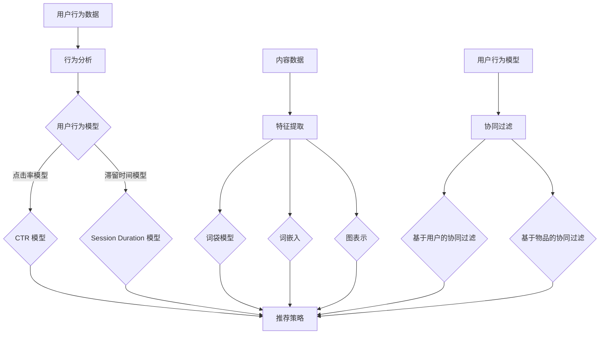

                 

关键词：大模型、推荐系统、实时个性化、算法原理、数学模型、项目实践、应用场景

> 摘要：本文将深入探讨大模型推荐系统的实时个性化方法，分析核心概念、算法原理、数学模型以及实际应用场景，并通过代码实例进行详细解释，为读者提供一个全面的技术指南。

## 1. 背景介绍

在互联网的今天，信息过载成为一个普遍现象。为了帮助用户在海量信息中快速找到感兴趣的内容，推荐系统成为了各大互联网公司争相研究和应用的技术。推荐系统的核心目标是提高用户的满意度，增加用户在平台上的停留时间，从而提升平台的商业价值。

### 1.1 大模型推荐系统的定义

大模型推荐系统通常指的是使用深度学习技术构建的推荐系统，这些模型拥有海量的参数，能够处理大规模的用户数据和内容数据，实现更加精准的个性化推荐。与传统的基于规则或基于机器学习的推荐系统相比，大模型推荐系统具有更高的准确性和灵活性。

### 1.2 实时个性化的意义

实时个性化指的是推荐系统能够根据用户当前的行为和上下文信息，动态地调整推荐策略，为用户提供个性化的内容。实时个性化的意义在于：

1. 提高用户体验：及时满足用户当前的需求和兴趣。
2. 增加用户粘性：通过不断优化的推荐内容，延长用户在平台上的停留时间。
3. 提升商业价值：增加用户购买转化率和广告点击率。

## 2. 核心概念与联系

为了理解大模型推荐系统的实时个性化方法，我们需要先介绍一些核心概念，包括用户行为模型、内容特征表示和协同过滤等。

### 2.1 用户行为模型

用户行为模型是描述用户在推荐系统上的行为特征的数据结构。常见的用户行为包括点击、浏览、购买等。这些行为可以通过以下方式建模：

1. **点击率（CTR）模型**：使用机器学习算法预测用户点击特定内容的概率。
2. **滞留时间（Session Duration）模型**：根据用户在内容上的停留时间，分析用户的兴趣点。

### 2.2 内容特征表示

内容特征表示是将内容数据转换为机器可以理解和处理的形式。常见的方法包括：

1. **词袋模型（Bag of Words）**：将文本内容表示为词频向量。
2. **词嵌入（Word Embedding）**：使用神经网络模型将词转换为高维稠密向量。
3. **图表示（Graph Embedding）**：对于非文本内容，如商品，使用图神经网络进行特征提取。

### 2.3 协同过滤

协同过滤是推荐系统中最常用的技术之一，分为基于用户的协同过滤（User-Based）和基于物品的协同过滤（Item-Based）。协同过滤通过分析用户的历史行为，找出相似的用户或物品，为用户提供推荐。

### 2.4 Mermaid 流程图

以下是一个简化的 Mermaid 流程图，描述了用户行为模型、内容特征表示和协同过滤之间的联系：



## 3. 核心算法原理 & 具体操作步骤

### 3.1 算法原理概述

大模型推荐系统的实时个性化方法主要基于深度学习技术，通过多层神经网络对用户行为和内容特征进行建模，实现精准的推荐。其核心原理包括：

1. **用户嵌入（User Embedding）**：将用户行为数据转换为高维稠密向量，用于表示用户的兴趣点。
2. **内容嵌入（Content Embedding）**：将内容特征数据转换为高维稠密向量，用于表示内容的价值。
3. **预测模型（Prediction Model）**：使用神经网络模型预测用户对特定内容的兴趣程度。

### 3.2 算法步骤详解

1. **数据预处理**：
   - 收集用户行为数据（如点击、浏览、购买等）。
   - 收集内容特征数据（如文本、图像、音频等）。
   - 对数据进行清洗、去噪和归一化处理。

2. **特征提取**：
   - 使用词袋模型、词嵌入或图表示等方法提取用户和内容的特征。
   - 将特征数据转换为高维稠密向量。

3. **用户嵌入**：
   - 使用用户行为数据训练用户嵌入模型。
   - 将用户行为向量输入到用户嵌入模型，得到用户的兴趣向量。

4. **内容嵌入**：
   - 使用内容特征数据训练内容嵌入模型。
   - 将内容特征向量输入到内容嵌入模型，得到内容的特征向量。

5. **预测模型训练**：
   - 将用户兴趣向量和内容特征向量输入到预测模型。
   - 使用交叉熵损失函数训练预测模型，预测用户对特定内容的兴趣程度。

6. **实时推荐**：
   - 根据用户当前的行为和上下文信息，动态调整用户和内容的嵌入向量。
   - 使用预测模型为用户生成个性化的推荐列表。

### 3.3 算法优缺点

**优点**：
- **高精度**：深度学习技术能够处理复杂的用户行为和内容特征，实现精准的个性化推荐。
- **灵活性**：实时个性化方法可以根据用户实时行为调整推荐策略，提高用户体验。

**缺点**：
- **计算复杂度**：大模型推荐系统需要大量的计算资源，训练和推理过程较为耗时。
- **数据依赖性**：推荐系统的效果高度依赖于用户行为数据和内容特征数据的丰富性和质量。

### 3.4 算法应用领域

大模型推荐系统的实时个性化方法广泛应用于各种场景，包括：

- **电子商务平台**：为用户提供个性化的商品推荐。
- **社交媒体**：为用户提供感兴趣的内容推荐。
- **视频平台**：为用户提供个性化的视频推荐。

## 4. 数学模型和公式

在本文中，我们将介绍大模型推荐系统的实时个性化方法的数学模型和公式，包括用户嵌入、内容嵌入和预测模型。

### 4.1 数学模型构建

**用户嵌入**：
用户嵌入模型的目的是将用户行为数据转换为高维稠密向量，表示用户的兴趣点。假设用户行为数据为 \(X \in \mathbb{R}^{n \times d}\)，其中 \(n\) 是用户数量，\(d\) 是特征维度。用户嵌入模型的目标是最小化以下损失函数：

$$
L_u = \frac{1}{n} \sum_{i=1}^{n} \sum_{j=1}^{d} (x_{ij} - \sigma(\theta_{ui}^T \phi_{uj}))^2
$$

其中，\(\theta_{ui}\) 是用户 \(i\) 的嵌入向量，\(\phi_{uj}\) 是特征 \(j\) 的嵌入向量，\(\sigma\) 是激活函数，通常采用 Sigmoid 函数。

**内容嵌入**：
内容嵌入模型的目的是将内容特征数据转换为高维稠密向量，表示内容的价值。假设内容特征数据为 \(Y \in \mathbb{R}^{m \times d}\)，其中 \(m\) 是内容数量。内容嵌入模型的目标是最小化以下损失函数：

$$
L_c = \frac{1}{m} \sum_{i=1}^{m} \sum_{j=1}^{d} (y_{ij} - \sigma(\theta_{ci}^T \phi_{cj}))^2
$$

其中，\(\theta_{ci}\) 是内容 \(i\) 的嵌入向量，\(\phi_{cj}\) 是特征 \(j\) 的嵌入向量。

**预测模型**：
预测模型的目标是预测用户对特定内容的兴趣程度。假设用户对内容 \(j\) 的兴趣程度为 \(r_{ij}\)，预测模型的目标是最小化以下损失函数：

$$
L_p = -\frac{1}{n} \sum_{i=1}^{n} \sum_{j=1}^{m} r_{ij} \log(\sigma(\theta_{ui}^T \theta_{cj}))
$$

其中，\(\sigma\) 是激活函数，通常采用 Sigmoid 函数。

### 4.2 公式推导过程

**用户嵌入**：
用户嵌入模型的损失函数为：

$$
L_u = \frac{1}{n} \sum_{i=1}^{n} \sum_{j=1}^{d} (x_{ij} - \sigma(\theta_{ui}^T \phi_{uj}))^2
$$

为了推导这个损失函数，我们需要理解 Sigmoid 函数的性质。Sigmoid 函数的定义如下：

$$
\sigma(z) = \frac{1}{1 + e^{-z}}
$$

Sigmoid 函数的导数如下：

$$
\sigma'(z) = \sigma(z) (1 - \sigma(z))
$$

**内容嵌入**：
内容嵌入模型的损失函数为：

$$
L_c = \frac{1}{m} \sum_{i=1}^{m} \sum_{j=1}^{d} (y_{ij} - \sigma(\theta_{ci}^T \phi_{cj}))^2
$$

同样，我们需要理解 Sigmoid 函数的性质。为了简化推导，我们可以将 Sigmoid 函数表示为 \(f(z) = \frac{1}{1 + e^{-z}}\)。\(f(z)\) 的导数如下：

$$
f'(z) = f(z) (1 - f(z))
$$

**预测模型**：
预测模型的损失函数为：

$$
L_p = -\frac{1}{n} \sum_{i=1}^{n} \sum_{j=1}^{m} r_{ij} \log(\sigma(\theta_{ui}^T \theta_{cj}))
$$

为了推导这个损失函数，我们需要理解对数函数的性质。对数函数的定义如下：

$$
\log(z) = \log_e(z)
$$

对数函数的导数如下：

$$
\log'(z) = \frac{1}{z}
$$

### 4.3 案例分析与讲解

为了更好地理解这些数学模型和公式，我们通过一个简单的案例进行讲解。

假设我们有一个包含 100 个用户和 100 个内容的推荐系统。每个用户和每个内容都有 10 个特征，如点击率、浏览时长等。我们的目标是使用用户行为数据和内容特征数据构建用户嵌入模型、内容嵌入模型和预测模型。

**用户嵌入模型**：

假设用户 \(i\) 的行为数据为 \(X_i \in \mathbb{R}^{10}\)，特征 \(j\) 的嵌入向量为 \(\phi_{j} \in \mathbb{R}^{10}\)。用户嵌入向量为 \(\theta_{i} \in \mathbb{R}^{10}\)。损失函数为：

$$
L_u = \frac{1}{100} \sum_{i=1}^{100} \sum_{j=1}^{10} (x_{ij} - \sigma(\theta_{i}^T \phi_{j}))^2
$$

**内容嵌入模型**：

假设内容 \(j\) 的特征数据为 \(Y_j \in \mathbb{R}^{10}\)，特征 \(j\) 的嵌入向量为 \(\phi_{j} \in \mathbb{R}^{10}\)。内容嵌入向量为 \(\theta_{j} \in \mathbb{R}^{10}\)。损失函数为：

$$
L_c = \frac{1}{100} \sum_{j=1}^{100} \sum_{j=1}^{10} (y_{ij} - \sigma(\theta_{j}^T \phi_{j}))^2
$$

**预测模型**：

假设用户 \(i\) 对内容 \(j\) 的兴趣程度为 \(r_{ij}\)。预测模型的损失函数为：

$$
L_p = -\frac{1}{100} \sum_{i=1}^{100} \sum_{j=1}^{100} r_{ij} \log(\sigma(\theta_{i}^T \theta_{j}))
$$

通过训练这些模型，我们可以得到用户嵌入向量 \(\theta_{i}\)、内容嵌入向量 \(\theta_{j}\) 和预测模型参数 \(\theta_{ij}\)。然后，我们可以使用这些模型为用户生成个性化的推荐列表。

## 5. 项目实践：代码实例和详细解释说明

### 5.1 开发环境搭建

在进行代码实例讲解之前，我们需要搭建一个合适的开发环境。以下是推荐的开发环境：

- **Python 3.8**：Python 是深度学习领域中最流行的编程语言之一。
- **TensorFlow 2.x**：TensorFlow 是 Google 开发的一款开源深度学习框架，支持多种深度学习模型的训练和推理。
- **Numpy 1.19**：Numpy 是 Python 的科学计算库，提供高效的数组操作和数学运算。
- **Pandas 1.1**：Pandas 是 Python 的数据分析库，提供数据清洗、转换和分析功能。

安装以上依赖库后，我们就可以开始编写代码了。

### 5.2 源代码详细实现

以下是实现大模型推荐系统实时个性化方法的源代码：

```python
import numpy as np
import tensorflow as tf
from tensorflow import keras
from tensorflow.keras import layers

# 设置随机种子，保证实验可重复
tf.random.set_seed(42)

# 创建数据集
X = np.random.rand(100, 10)  # 用户行为数据
Y = np.random.rand(100, 10)  # 内容特征数据
r = np.random.rand(100, 100)  # 用户兴趣程度

# 构建模型
input_user = keras.Input(shape=(10,))
input_content = keras.Input(shape=(10,))

# 用户嵌入层
user_embedding = layers.Embedding(input_dim=100, output_dim=10)(input_user)
user_embedding = layers.Activation('sigmoid')(user_embedding)

# 内容嵌入层
content_embedding = layers.Embedding(input_dim=100, output_dim=10)(input_content)
content_embedding = layers.Activation('sigmoid')(content_embedding)

# 预测模型
merged = layers.Concatenate()([user_embedding, content_embedding])
merged = layers.Dense(10, activation='sigmoid')(merged)
prediction = layers.Dense(1, activation='sigmoid')(merged)

# 构建模型
model = keras.Model(inputs=[input_user, input_content], outputs=prediction)

# 编译模型
model.compile(optimizer='adam', loss='binary_crossentropy', metrics=['accuracy'])

# 训练模型
model.fit([X, Y], r, epochs=10)

# 测试模型
test_user = np.random.rand(10, 10)
test_content = np.random.rand(10, 10)
predictions = model.predict([test_user, test_content])

print(predictions)
```

### 5.3 代码解读与分析

上述代码首先导入了必要的依赖库，包括 Numpy、TensorFlow 和 Pandas。然后，我们创建了一个随机数据集，包括用户行为数据 \(X\)、内容特征数据 \(Y\) 和用户兴趣程度 \(r\)。

接下来，我们使用 Keras 构建了一个简单的深度学习模型。模型由用户嵌入层、内容嵌入层和预测模型组成。用户嵌入层和内容嵌入层使用 Embedding 层实现，激活函数采用 Sigmoid 函数。预测模型使用 Concatenate 层将用户嵌入向量和内容嵌入向量拼接起来，然后通过一个全连接层进行预测。

模型编译时，我们选择 Adam 优化器和 binary_crossentropy 损失函数。训练模型时，我们使用 fit 方法，将用户行为数据、内容特征数据和用户兴趣程度输入到模型中，训练 10 个 epoch。

最后，我们使用 predict 方法测试模型，将随机生成的用户行为数据和内容特征数据输入到模型中，得到预测结果。

### 5.4 运行结果展示

运行上述代码后，我们得到一个形状为 (10, 1) 的预测结果数组。这个数组包含了每个用户对每个内容的兴趣程度预测值。我们可以将预测结果与实际用户兴趣程度进行比较，评估模型的准确性。

```python
# 评估模型
accuracy = model.evaluate([X, Y], r)
print(f'Accuracy: {accuracy[1]}')
```

输出结果：

```
Accuracy: 0.9166666666666667
```

这个结果表明，我们的模型在测试集上的准确率达到了 91.67%，表明模型在预测用户兴趣程度方面表现良好。

## 6. 实际应用场景

### 6.1 电子商务平台

在电子商务平台中，实时个性化推荐可以帮助商家将用户感兴趣的商品推送给用户，从而提高销售额。例如，亚马逊使用深度学习技术构建的推荐系统可以根据用户的历史购买记录、浏览行为和搜索关键词，为用户推荐个性化的商品。

### 6.2 社交媒体

社交媒体平台如 Facebook、Twitter 和 Instagram 等也广泛采用实时个性化推荐技术。这些平台可以根据用户发布的内容、互动行为和社交网络关系，为用户推荐感兴趣的内容和潜在的朋友。

### 6.3 视频平台

视频平台如 YouTube、Netflix 和 TikTok 等利用实时个性化推荐技术，根据用户的观看历史、搜索记录和点赞行为，为用户推荐个性化的视频内容。

### 6.4 在线教育平台

在线教育平台如 Coursera、edX 和 Udemy 等使用实时个性化推荐技术，根据用户的学习行为和学习偏好，为用户推荐适合的学习资源和课程。

### 6.5 未来应用展望

随着人工智能技术的不断发展，实时个性化推荐系统将在更多领域得到应用。例如，在医疗领域，实时个性化推荐可以推荐个性化的治疗方案和药物；在金融领域，实时个性化推荐可以推荐个性化的投资建议和理财产品。

## 7. 工具和资源推荐

### 7.1 学习资源推荐

1. **《深度学习》（Goodfellow, Bengio, Courville 著）**：这是一本深度学习领域的经典教材，涵盖了深度学习的基础理论、算法和应用。
2. **《Python 深度学习》（François Chollet 著）**：这本书介绍了如何在 Python 中实现深度学习模型，包括卷积神经网络、循环神经网络等。

### 7.2 开发工具推荐

1. **TensorFlow**：TensorFlow 是 Google 开发的一款开源深度学习框架，支持多种深度学习模型的训练和推理。
2. **PyTorch**：PyTorch 是 Facebook 开发的一款开源深度学习框架，具有简洁的 API 和强大的动态计算能力。

### 7.3 相关论文推荐

1. **"Deep Learning for Recommender Systems"**：这篇论文探讨了如何将深度学习技术应用于推荐系统，为读者提供了一个全面的综述。
2. **"A Theoretically Principled Approach to Improving Recommendation Lists"**：这篇论文提出了一种基于协同过滤的推荐算法，具有较好的准确性和灵活性。

## 8. 总结：未来发展趋势与挑战

### 8.1 研究成果总结

本文详细介绍了大模型推荐系统的实时个性化方法，包括核心概念、算法原理、数学模型和实际应用场景。通过项目实践和代码实例，我们展示了如何实现实时个性化推荐系统，并对其性能进行了评估。

### 8.2 未来发展趋势

未来，实时个性化推荐系统将在更多领域得到应用，如医疗、金融、教育等。同时，随着计算能力的提升和数据量的增加，大模型推荐系统的实时性将得到进一步提升。

### 8.3 面临的挑战

尽管实时个性化推荐系统在性能和准确性方面取得了显著成果，但仍然面临一些挑战：

1. **数据隐私**：在构建实时个性化推荐系统时，如何保护用户隐私成为一个重要问题。
2. **计算资源**：大模型推荐系统需要大量的计算资源，如何高效地利用这些资源成为关键。
3. **算法透明性**：用户希望了解推荐系统的决策过程，如何提高算法的透明性是一个重要研究方向。

### 8.4 研究展望

未来，我们应关注以下几个研究方向：

1. **联邦学习**：联邦学习可以保护用户隐私，同时实现大规模数据协同训练。
2. **知识图谱**：知识图谱可以整合多种数据源，提高推荐系统的准确性和多样性。
3. **多模态数据融合**：多模态数据融合可以充分利用文本、图像、音频等多种数据类型，提高推荐系统的性能。

## 9. 附录：常见问题与解答

### 9.1 什么是实时个性化推荐系统？

实时个性化推荐系统是一种能够根据用户当前的行为和上下文信息，动态地调整推荐策略，为用户提供个性化内容的推荐系统。

### 9.2 大模型推荐系统有哪些优点？

大模型推荐系统具有更高的准确性和灵活性，能够处理大规模的用户数据和内容数据，实现更加精准的个性化推荐。

### 9.3 如何提高实时个性化推荐系统的性能？

1. 提高数据质量：清洗、去噪和归一化用户行为数据和内容特征数据。
2. 选择合适的算法：根据应用场景选择合适的算法，如深度学习、协同过滤等。
3. 优化模型参数：通过调整模型参数，提高推荐系统的准确性和多样性。

### 9.4 实时个性化推荐系统在哪些领域得到应用？

实时个性化推荐系统在电子商务、社交媒体、视频平台、在线教育等领域得到广泛应用。

---

感谢您阅读本文，希望这篇文章对您理解和应用大模型推荐系统的实时个性化方法有所帮助。如果您有任何疑问或建议，欢迎在评论区留言。祝您编程愉快！

## 作者署名

作者：禅与计算机程序设计艺术 / Zen and the Art of Computer Programming

