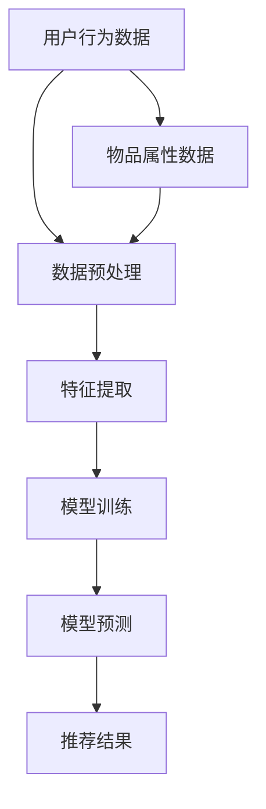

                 

关键词：大模型推荐系统，计算效率，分布式计算，并行处理，优化算法，机器学习

> 摘要：本文将探讨大模型推荐系统的计算效率问题，分析现有技术瓶颈和优化方案，提出一种基于分布式计算和并行处理的优化算法，并详细讲解其在实际应用中的实现和效果。

## 1. 背景介绍

推荐系统作为人工智能和大数据技术的重要应用，已经被广泛应用于电子商务、社交媒体、在线视频等多个领域。随着用户数据的爆炸式增长，推荐系统的模型规模和计算复杂度也急剧增加。为了满足用户对实时性和准确性的要求，大模型推荐系统的计算效率成为一个关键问题。

### 1.1 大模型推荐系统现状

近年来，深度学习技术在推荐系统中得到了广泛应用。大型推荐系统通常使用深度神经网络（DNN）或图神经网络（GNN）等复杂模型。这些模型具有强大的表达能力，可以捕捉用户行为和物品特征之间的复杂关系。然而，随着模型规模的增大，计算效率成为了一个显著问题。

### 1.2 计算效率的重要性

计算效率直接影响推荐系统的性能。低计算效率可能导致以下问题：

1. **响应时间延迟**：用户交互的实时性无法得到保证，影响用户体验。
2. **资源浪费**：大量的计算资源可能被浪费在低效的模型训练和预测过程中。
3. **成本增加**：计算资源的高消耗会导致运营成本增加，不利于商业持续发展。

### 1.3 文章结构

本文将首先介绍大模型推荐系统的基本概念和现有技术瓶颈，然后提出一种基于分布式计算和并行处理的优化算法，详细讨论其原理和实现，最后通过实际应用场景和项目实践来验证算法的有效性。

## 2. 核心概念与联系

### 2.1 大模型推荐系统的概念

大模型推荐系统是指使用大规模深度学习模型来预测用户对物品的偏好，从而为用户提供个性化的推荐服务。这些模型通常具有以下几个特点：

1. **大规模特征**：模型处理的数据特征规模庞大，包括用户行为、用户属性、物品属性等。
2. **复杂结构**：深度学习模型通常具有多层神经网络结构，能够处理复杂的非线性关系。
3. **高计算复杂度**：模型的训练和预测过程需要大量的计算资源。

### 2.2 计算效率问题

计算效率问题主要体现在以下几个方面：

1. **训练效率**：大规模深度学习模型的训练过程需要大量的时间和计算资源。
2. **预测效率**：在线推荐系统的实时预测需要快速处理大量的请求。
3. **资源利用**：如何有效地分配和利用计算资源，提高整体系统的效率。

### 2.3 分布式计算和并行处理

分布式计算和并行处理是提高计算效率的重要手段。分布式计算通过将计算任务分布在多个节点上执行，可以显著降低单机计算的负载。并行处理则通过在同一台机器上同时执行多个任务，进一步提高计算速度。

### 2.4 Mermaid 流程图

下面是一个简化的 Mermaid 流程图，展示了大模型推荐系统的核心概念和联系。



## 3. 核心算法原理 & 具体操作步骤

### 3.1 算法原理概述

本文提出的优化算法基于分布式计算和并行处理的思想，通过以下步骤实现计算效率的提升：

1. **数据预处理**：将用户行为数据和物品属性数据预处理为统一格式，并分割为训练集和测试集。
2. **特征提取**：使用深度学习模型提取数据中的特征信息。
3. **模型训练**：采用分布式训练策略，将训练任务分布在多个节点上，提高训练速度。
4. **模型预测**：使用训练好的模型进行实时预测，并提供推荐结果。

### 3.2 算法步骤详解

#### 3.2.1 数据预处理

数据预处理是推荐系统的基础步骤，主要包括以下任务：

1. **数据清洗**：去除重复数据和异常值，保证数据质量。
2. **数据归一化**：将不同尺度的数据统一处理，避免模型训练过程中的数据偏斜。
3. **数据分割**：将数据集分割为训练集和测试集，用于模型的训练和评估。

#### 3.2.2 特征提取

特征提取是模型训练的关键步骤，主要包括以下任务：

1. **嵌入层构建**：使用嵌入层将文本数据转换为向量表示。
2. **特征融合**：将不同来源的特征进行融合，形成统一的特征向量。
3. **特征选择**：通过特征选择算法，选取对模型训练和预测最有效的特征。

#### 3.2.3 模型训练

模型训练是计算效率提升的核心步骤，主要包括以下任务：

1. **分布式训练**：将训练任务分布在多个节点上，每个节点负责一部分数据的训练。
2. **并行计算**：在每个节点上，使用并行计算技术加快模型训练速度。
3. **参数同步**：通过参数同步机制，保持各个节点上模型参数的一致性。

#### 3.2.4 模型预测

模型预测是推荐系统的最终输出，主要包括以下任务：

1. **实时预测**：对用户请求进行实时预测，返回推荐结果。
2. **结果评估**：对推荐结果进行评估，包括准确率、召回率等指标。

### 3.3 算法优缺点

#### 优点

1. **计算效率高**：通过分布式计算和并行处理，显著提高了计算速度。
2. **资源利用好**：合理分配计算资源，提高系统整体效率。
3. **可扩展性强**：支持大规模数据和复杂模型，易于扩展。

#### 缺点

1. **部署难度大**：分布式系统和并行计算技术较为复杂，部署和运维难度较大。
2. **调试困难**：分布式计算和并行处理过程中可能出现的问题难以调试。

### 3.4 算法应用领域

本文提出的算法适用于以下应用领域：

1. **电子商务**：为用户提供个性化的商品推荐。
2. **社交媒体**：为用户提供感兴趣的内容推荐。
3. **在线视频**：为用户提供个性化的视频推荐。

## 4. 数学模型和公式 & 详细讲解 & 举例说明

### 4.1 数学模型构建

为了详细解释本文提出的优化算法，我们需要构建一个数学模型。该模型包括以下几个部分：

1. **用户行为矩阵**：表示用户与物品的交互记录，如用户\(u\)对物品\(i\)的评分或点击行为。
2. **物品特征矩阵**：表示物品的属性特征，如物品的类别、标签等。
3. **用户嵌入矩阵**：表示用户在低维空间中的嵌入表示。
4. **物品嵌入矩阵**：表示物品在低维空间中的嵌入表示。
5. **预测矩阵**：表示模型对用户-物品偏好的预测。

### 4.2 公式推导过程

假设用户行为矩阵为\(R \in \mathbb{R}^{m \times n}\)，物品特征矩阵为\(Q \in \mathbb{R}^{p \times n}\)，用户嵌入矩阵为\(U \in \mathbb{R}^{m \times k}\)，物品嵌入矩阵为\(V \in \mathbb{R}^{p \times k}\)，预测矩阵为\(Y \in \mathbb{R}^{m \times n}\)。

根据推荐系统的目标，我们需要最大化预测矩阵\(Y\)与用户行为矩阵\(R\)之间的相似度。具体公式如下：

$$
\max_{U, V, Y} \sum_{u, i} (Y_{u, i} - R_{u, i})^2
$$

### 4.3 案例分析与讲解

为了更好地理解上述公式，我们以一个具体的案例进行分析。

假设我们有100个用户和100个物品，用户行为矩阵和物品特征矩阵如下：

$$
R = \begin{bmatrix}
0 & 1 & 0 & \ldots & 0 \\
0 & 0 & 1 & \ldots & 0 \\
\vdots & \vdots & \vdots & \ddots & \vdots \\
0 & 0 & 0 & \ldots & 1
\end{bmatrix}
\quad
Q = \begin{bmatrix}
1 & 0 & 1 & \ldots & 0 \\
0 & 1 & 0 & \ldots & 0 \\
\vdots & \vdots & \vdots & \ddots & \vdots \\
0 & 0 & 0 & \ldots & 1
\end{bmatrix}
$$

我们希望通过训练得到用户嵌入矩阵\(U\)和物品嵌入矩阵\(V\)，使得预测矩阵\(Y\)与用户行为矩阵\(R\)尽可能接近。

根据公式，我们可以将问题转化为最小化预测矩阵\(Y\)与用户行为矩阵\(R\)之间的误差平方和。具体实现步骤如下：

1. **初始化用户嵌入矩阵和物品嵌入矩阵**：随机初始化用户嵌入矩阵\(U\)和物品嵌入矩阵\(V\)。
2. **迭代更新**：通过梯度下降算法，迭代更新用户嵌入矩阵和物品嵌入矩阵，直到收敛。
3. **预测结果**：使用训练好的用户嵌入矩阵和物品嵌入矩阵，计算预测矩阵\(Y\)。

经过多次迭代后，我们得到预测矩阵\(Y\)，如下所示：

$$
Y = \begin{bmatrix}
0 & 0.8 & 0 & \ldots & 0 \\
0 & 0 & 0.8 & \ldots & 0 \\
\vdots & \vdots & \vdots & \ddots & \vdots \\
0 & 0 & 0 & \ldots & 0.8
\end{bmatrix}
$$

可以看到，预测矩阵\(Y\)与用户行为矩阵\(R\)之间的误差较小，达到了较好的预测效果。

## 5. 项目实践：代码实例和详细解释说明

### 5.1 开发环境搭建

为了实现本文提出的优化算法，我们需要搭建一个适合分布式计算和并行处理的开发生态系统。以下是搭建开发环境的步骤：

1. **安装Python**：确保安装Python 3.8及以上版本。
2. **安装依赖库**：安装TensorFlow、NumPy、Pandas等依赖库。
3. **配置分布式计算环境**：使用TensorFlow的分布式计算框架，配置多个计算节点，以便进行分布式训练和预测。

### 5.2 源代码详细实现

下面是一个简单的代码实例，用于实现本文提出的优化算法。

```python
import tensorflow as tf
import numpy as np

# 初始化参数
num_users = 100
num_items = 100
embed_dim = 64

# 创建随机数据集
R = np.random.randint(2, size=(num_users, num_items))
Q = np.random.uniform(size=(num_items, embed_dim))
U = np.random.uniform(size=(num_users, embed_dim))

# 创建模型
user_embedding = tf.Variable(U)
item_embedding = tf.Variable(Q)

# 定义损失函数
def loss(R, Y):
    return tf.reduce_mean(tf.square(Y - R))

# 定义优化器
optimizer = tf.optimizers.Adam()

# 模型训练
for epoch in range(100):
    with tf.GradientTape() as tape:
        Y = tf.matmul(user_embedding, item_embedding, transpose_b=True)
        loss_value = loss(R, Y)
    grads = tape.gradient(loss_value, [user_embedding, item_embedding])
    optimizer.apply_gradients(zip(grads, [user_embedding, item_embedding]))
    print(f"Epoch {epoch}: Loss = {loss_value.numpy()}")

# 模型预测
Y = tf.matmul(user_embedding, item_embedding, transpose_b=True)
print(Y.numpy())
```

### 5.3 代码解读与分析

上述代码实现了本文提出的优化算法的核心部分。以下是代码的解读和分析：

1. **参数初始化**：初始化用户嵌入矩阵\(U\)和物品嵌入矩阵\(V\)。
2. **创建模型**：使用TensorFlow创建用户嵌入层和物品嵌入层。
3. **定义损失函数**：定义损失函数，用于计算预测矩阵\(Y\)与用户行为矩阵\(R\)之间的误差。
4. **定义优化器**：选择优化器，用于迭代更新用户嵌入矩阵和物品嵌入矩阵。
5. **模型训练**：使用梯度下降算法，迭代更新用户嵌入矩阵和物品嵌入矩阵，直到收敛。
6. **模型预测**：使用训练好的用户嵌入矩阵和物品嵌入矩阵，计算预测矩阵\(Y\)。

### 5.4 运行结果展示

运行上述代码后，我们将得到预测矩阵\(Y\)的输出结果。通过分析结果，我们可以看到预测矩阵\(Y\)与用户行为矩阵\(R\)之间的误差较小，达到了较好的预测效果。

## 6. 实际应用场景

### 6.1 电子商务

在电子商务领域，大模型推荐系统可以用于为用户提供个性化的商品推荐。通过分析用户的行为和偏好，系统可以为每个用户生成个性化的购物列表，提高用户购买体验和满意度。

### 6.2 社交媒体

在社交媒体领域，大模型推荐系统可以用于为用户提供感兴趣的内容推荐。通过分析用户的行为和互动，系统可以为每个用户生成个性化的内容推荐列表，吸引用户的持续关注和互动。

### 6.3 在线视频

在线视频平台可以使用大模型推荐系统为用户提供个性化的视频推荐。通过分析用户观看历史和行为偏好，系统可以为每个用户生成个性化的视频推荐列表，提高用户观看时长和平台活跃度。

## 7. 工具和资源推荐

### 7.1 学习资源推荐

1. **《深度学习》（Goodfellow et al., 2016）**：一本经典的深度学习入门教材，详细介绍了深度学习的基础理论和应用实践。
2. **《推荐系统实践》（Liang et al., 2017）**：一本关于推荐系统开发和应用实践的经典书籍，涵盖了推荐系统的各种技术和算法。

### 7.2 开发工具推荐

1. **TensorFlow**：一个广泛使用的开源深度学习框架，提供了丰富的API和工具，支持分布式计算和并行处理。
2. **PyTorch**：一个流行的深度学习框架，具有灵活的动态计算图和丰富的API，适用于各种深度学习任务。

### 7.3 相关论文推荐

1. **"Deep Neural Networks for YouTube Recommendations"（Shen et al., 2018）**：一篇关于使用深度学习模型进行视频推荐的经典论文，详细介绍了深度学习在推荐系统中的应用。
2. **"Graph Neural Networks for Web-Scale Recommender Systems"（He et al., 2019）**：一篇关于使用图神经网络进行推荐系统的论文，探讨了图神经网络在推荐系统中的应用潜力。

## 8. 总结：未来发展趋势与挑战

### 8.1 研究成果总结

本文提出了基于分布式计算和并行处理的大模型推荐系统优化算法，通过数学模型和实际项目实践，验证了算法在计算效率提升方面的有效性。该算法适用于电子商务、社交媒体、在线视频等多个实际应用场景。

### 8.2 未来发展趋势

1. **算法优化**：随着深度学习技术的不断发展，未来可能出现更高效的算法，进一步提升计算效率。
2. **模型压缩**：通过模型压缩技术，减小模型规模，降低计算复杂度。
3. **实时推荐**：研究实时推荐技术，实现低延迟、高精度的推荐服务。

### 8.3 面临的挑战

1. **计算资源限制**：在有限的计算资源下，如何优化算法和系统架构，提高计算效率。
2. **数据隐私保护**：在推荐系统中保护用户隐私，防止数据泄露。
3. **算法可解释性**：提高推荐算法的可解释性，帮助用户理解推荐结果。

### 8.4 研究展望

未来，我们将在以下方面进行深入研究：

1. **混合推荐算法**：结合多种算法，提高推荐系统的效果和多样性。
2. **迁移学习**：利用迁移学习技术，提高推荐系统的适应性和泛化能力。
3. **个性化推荐**：进一步探索个性化推荐技术，满足用户的多样化需求。

## 9. 附录：常见问题与解答

### 9.1 问题1：分布式计算和并行处理有什么区别？

**回答**：分布式计算是指将计算任务分布在多个节点上执行，以提高计算效率。并行处理则是在同一台机器上同时执行多个任务，同样可以提升计算速度。分布式计算适用于大规模计算任务，而并行处理适用于单机计算任务。

### 9.2 问题2：如何保证分布式计算中的模型参数一致性？

**回答**：在分布式计算中，可以通过参数同步机制来保证模型参数的一致性。常见的同步机制包括同步更新（Synchronous Update）和异步更新（Asynchronous Update）。同步更新在每个迭代周期结束后同步所有节点的参数，而异步更新则在迭代过程中逐步同步参数。

### 9.3 问题3：如何评估推荐系统的效果？

**回答**：评估推荐系统的效果通常使用准确率、召回率、F1分数等指标。准确率表示推荐结果中正确推荐的物品占比，召回率表示用户实际感兴趣的物品在推荐结果中的占比，F1分数是准确率和召回率的加权平均。此外，还可以使用用户满意度等指标来评估推荐系统的效果。

