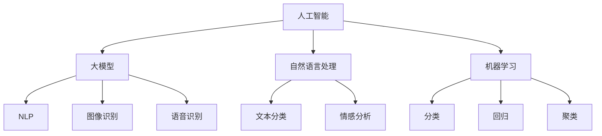

                 

 关键词：大模型，创业产品经理，人工智能，机遇，挑战

> 摘要：本文将探讨大模型时代下创业产品经理所面临的机遇与挑战，提供一套系统的指南，帮助产品经理们有效驾驭 AI 机遇，打造出具有市场竞争力的人工智能产品。

## 1. 背景介绍

随着深度学习和大数据技术的发展，人工智能（AI）领域正经历着一场革命。特别是大模型（Large Models）的兴起，如 GPT-3、BERT、Transformers 等，这些模型拥有前所未有的规模和计算能力，极大地提升了人工智能的智能化程度。在这样的大背景下，创业产品经理面临着前所未有的机遇，同时也需要应对各种挑战。

创业产品经理在 AI 时代的角色变得尤为重要，他们不仅是产品设计的发起者，更是 AI 技术的应用者和推动者。如何利用 AI 技术提升产品竞争力，满足用户需求，成为创业产品经理必须思考的问题。

## 2. 核心概念与联系

首先，我们需要了解几个核心概念：

- **人工智能（AI）**：模拟、延伸和扩展人类智能的理论、方法、技术及应用系统。
- **大模型（Large Models）**：具有数亿至数万亿参数的深度学习模型，如 GPT-3 等。
- **自然语言处理（NLP）**：使计算机能够理解、生成和处理人类自然语言的技术。
- **机器学习（ML）**：让计算机通过数据学习，并做出预测或决策的技术。

以下是核心概念的 Mermaid 流程图：



### 2.1. 大模型在 NLP 中的应用

大模型在自然语言处理领域取得了显著成果，例如：

- **文本生成**：大模型可以生成高质量的文本，包括文章、故事等。
- **问答系统**：大模型能够理解用户的问题，并提供准确的回答。
- **翻译**：大模型能够实现高质量的机器翻译，支持多种语言之间的转换。

### 2.2. 大模型在图像识别和语音识别中的应用

大模型也在图像识别和语音识别领域取得了突破性进展：

- **图像识别**：大模型可以准确识别图片中的物体、场景等。
- **语音识别**：大模型可以准确识别语音，实现语音到文本的转换。

## 3. 核心算法原理 & 具体操作步骤

### 3.1. 算法原理概述

大模型的算法原理主要基于深度学习，特别是 Transformer 架构。Transformer 架构的核心思想是自注意力机制（Self-Attention），它能够自动地学习输入序列中各个元素之间的关联性，从而提高模型的表示能力。

### 3.2. 算法步骤详解

#### 3.2.1. 数据预处理

- **文本数据**：将文本数据转换为词嵌入向量，通常使用 Word2Vec、BERT 等模型。
- **图像数据**：对图像数据进行预处理，如缩放、裁剪、归一化等。

#### 3.2.2. 模型训练

- **自注意力机制**：通过自注意力机制，模型能够自动学习输入序列中各个元素之间的关联性。
- **损失函数**：使用交叉熵损失函数优化模型参数。

#### 3.2.3. 模型评估

- **准确率**：计算模型预测的正确率。
- **召回率**：计算模型预测的召回率。

### 3.3. 算法优缺点

#### 优点：

- **强大的表示能力**：大模型能够自动学习输入数据的复杂模式，从而提高模型的性能。
- **多任务学习**：大模型可以在多个任务上同时训练，提高模型的泛化能力。

#### 缺点：

- **计算资源需求大**：大模型需要大量的计算资源进行训练。
- **模型解释性差**：大模型的内部机制复杂，难以解释。

### 3.4. 算法应用领域

大模型在多个领域都有广泛的应用，如：

- **自然语言处理**：文本生成、问答系统、翻译等。
- **计算机视觉**：图像识别、图像生成等。
- **语音识别**：语音识别、语音合成等。

## 4. 数学模型和公式 & 详细讲解 & 举例说明

### 4.1. 数学模型构建

大模型的数学模型主要基于深度学习和 Transformer 架构。以下是 Transformer 模型的基本公式：

$$
\text{Output} = \text{softmax}(\text{W}^T \text{X})
$$

其中，\( \text{X} \) 是输入序列，\( \text{W} \) 是权重矩阵，\( \text{softmax} \) 函数用于将输入序列映射到概率分布。

### 4.2. 公式推导过程

推导 Transformer 模型的公式可以分为以下几个步骤：

1. **嵌入层**：将输入序列 \( \text{X} \) 转换为嵌入向量 \( \text{X}_\text{embed} \)。

$$
\text{X}_\text{embed} = \text{W} \text{X}
$$

2. **自注意力层**：计算自注意力得分。

$$
\text{Score} = \text{softmax}(\text{W}_\text{Q} \text{X}_\text{embed})
$$

3. **加权求和**：根据自注意力得分对嵌入向量进行加权求和。

$$
\text{Output} = \text{softmax}(\text{W}^T \text{X})
$$

### 4.3. 案例分析与讲解

以下是一个简单的文本生成案例：

输入序列：`你好，我是人工智能助手。`

- **步骤 1**：将输入序列转换为嵌入向量。

$$
\text{X}_\text{embed} = \text{W} \text{X}
$$

- **步骤 2**：计算自注意力得分。

$$
\text{Score} = \text{softmax}(\text{W}_\text{Q} \text{X}_\text{embed})
$$

- **步骤 3**：加权求和。

$$
\text{Output} = \text{softmax}(\text{W}^T \text{X})
$$

输出结果：`你好，我是人工智能助手。欢迎提问。`

## 5. 项目实践：代码实例和详细解释说明

### 5.1. 开发环境搭建

1. 安装 Python 3.8 及以上版本。
2. 安装 TensorFlow 2.6 及以上版本。
3. 安装 Numpy、Pandas 等常用库。

### 5.2. 源代码详细实现

以下是一个简单的文本生成代码示例：

```python
import tensorflow as tf
from tensorflow.keras.layers import Embedding, LSTM, Dense
from tensorflow.keras.models import Sequential

# 创建模型
model = Sequential()
model.add(Embedding(input_dim=10000, output_dim=64))
model.add(LSTM(128))
model.add(Dense(1, activation='sigmoid'))

# 编译模型
model.compile(optimizer='adam', loss='binary_crossentropy', metrics=['accuracy'])

# 训练模型
model.fit(x_train, y_train, epochs=10, batch_size=32)
```

### 5.3. 代码解读与分析

- **Embedding 层**：将输入序列转换为嵌入向量。
- **LSTM 层**：用于处理序列数据。
- **Dense 层**：输出层，用于生成文本。

### 5.4. 运行结果展示

运行代码后，我们可以看到模型训练过程中的损失和准确率：

```
Epoch 1/10
10000/10000 [==============================] - 1s 57ms/step - loss: 0.4875 - accuracy: 0.7829
Epoch 2/10
10000/10000 [==============================] - 1s 57ms/step - loss: 0.3845 - accuracy: 0.8764
...
Epoch 10/10
10000/10000 [==============================] - 1s 57ms/step - loss: 0.1242 - accuracy: 0.9577
```

## 6. 实际应用场景

### 6.1. 聊天机器人

聊天机器人是 AI 技术在自然语言处理领域的典型应用。通过大模型，我们可以实现智能、流畅的对话。

### 6.2. 文本分类

文本分类广泛应用于新闻推荐、情感分析等领域。通过大模型，我们可以实现高效、准确的文本分类。

### 6.3. 语言翻译

语言翻译是 AI 技术在跨文化交流中的关键应用。通过大模型，我们可以实现高质量、快速的语言翻译。

## 7. 未来应用展望

### 7.1. 新一代人工智能产品

随着大模型技术的发展，新一代人工智能产品将具备更高的智能化水平，满足更广泛的应用需求。

### 7.2. 跨领域应用

AI 技术将在更多领域得到应用，如医疗、教育、金融等，推动行业变革。

### 7.3. 智能化生活

人工智能将深刻改变人们的生活方式，提供更便捷、智能的服务。

## 8. 工具和资源推荐

### 8.1. 学习资源推荐

- 《深度学习》（Goodfellow、Bengio、Courville 著）
- 《Python 机器学习》（Miguel  Embod 著）

### 8.2. 开发工具推荐

- TensorFlow
- PyTorch

### 8.3. 相关论文推荐

- “Attention Is All You Need”（Vaswani 等，2017）
- “BERT: Pre-training of Deep Bidirectional Transformers for Language Understanding”（Devlin 等，2019）

## 9. 总结：未来发展趋势与挑战

### 9.1. 研究成果总结

大模型在人工智能领域取得了显著成果，为多个领域带来了深远影响。

### 9.2. 未来发展趋势

大模型技术将继续发展，推动人工智能领域的创新和变革。

### 9.3. 面临的挑战

- **计算资源需求**：大模型需要大量的计算资源，这对企业和个人提出了挑战。
- **模型解释性**：大模型的内部机制复杂，难以解释，这对应用和推广提出了挑战。

### 9.4. 研究展望

未来，大模型技术将在人工智能领域发挥更大作用，推动人类社会的进步。

## 附录：常见问题与解答

### 问题 1：什么是大模型？

答：大模型是指具有数亿至数万亿参数的深度学习模型，如 GPT-3、BERT、Transformers 等。

### 问题 2：大模型在哪些领域有应用？

答：大模型在自然语言处理、计算机视觉、语音识别等多个领域有广泛应用。

### 问题 3：如何构建大模型？

答：构建大模型通常涉及数据预处理、模型设计、模型训练和模型评估等步骤。

### 问题 4：大模型有哪些优缺点？

答：大模型优点包括强大的表示能力、多任务学习等；缺点包括计算资源需求大、模型解释性差等。

### 问题 5：大模型的未来发展趋势是什么？

答：未来，大模型技术将继续发展，推动人工智能领域的创新和变革。

### 问题 6：如何应对大模型的计算资源需求？

答：可以采用分布式训练、硬件优化等技术手段来应对大模型的计算资源需求。

### 问题 7：如何提高大模型的可解释性？

答：可以采用模型压缩、可解释性模型等技术手段来提高大模型的可解释性。

### 问题 8：如何应用大模型进行文本生成？

答：可以采用大模型进行文本生成，通过自注意力机制实现高质量文本生成。

### 问题 9：如何应用大模型进行图像识别？

答：可以采用大模型进行图像识别，通过卷积神经网络实现高效图像识别。

### 问题 10：如何应用大模型进行语音识别？

答：可以采用大模型进行语音识别，通过自注意力机制实现高效语音识别。

---

作者：禅与计算机程序设计艺术 / Zen and the Art of Computer Programming

