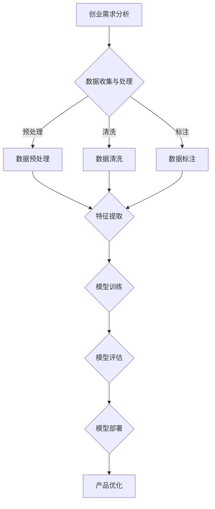

                 

关键词：大模型、创业产品设计、人工智能、融合、创新

摘要：随着人工智能技术的快速发展，大模型成为各行各业关注的焦点。本文将探讨在大模型时代，创业产品设计中的创新路径，尤其是人工智能的融合应用，旨在为创业团队提供有益的指导和建议。

## 1. 背景介绍

近年来，人工智能（AI）技术取得了飞速发展，特别是在大模型领域。大模型，如GPT、BERT等，凭借其强大的数据处理和生成能力，已经在自然语言处理、计算机视觉等多个领域取得了显著成果。与此同时，创业市场也在不断变化，传统创业模式逐渐被颠覆，创新成为企业发展的核心竞争力。

在这个背景下，如何利用大模型技术进行创业产品设计创新，成为众多创业者和企业关注的问题。本文将围绕这一主题展开讨论，旨在为创业团队提供有价值的参考。

## 2. 核心概念与联系

### 2.1 大模型的基本概念

大模型（Large-scale Model）是指那些具有数百万甚至数十亿参数的深度神经网络模型。这些模型通过大规模数据训练，具备强大的特征提取和表征能力。大模型主要包括以下几个类型：

- **自然语言处理模型**：如GPT、BERT等，主要用于文本生成、文本分类、机器翻译等任务。
- **计算机视觉模型**：如ResNet、VGG等，主要用于图像分类、目标检测、图像生成等任务。
- **语音处理模型**：如WaveNet、Tacotron等，主要用于语音识别、语音合成等任务。

### 2.2 大模型在创业产品设计中的应用

大模型在创业产品设计中的应用主要体现在以下几个方面：

- **数据驱动的决策支持**：通过大模型对大量数据进行处理和分析，为创业团队提供有针对性的决策支持。
- **个性化服务**：利用大模型对用户行为数据进行分析，为用户提供个性化的产品和服务。
- **自动化流程**：通过大模型实现业务流程的自动化，提高企业运营效率。

### 2.3 Mermaid 流程图

以下是一个关于大模型在创业产品设计中的应用的Mermaid流程图：



## 3. 核心算法原理 & 具体操作步骤

### 3.1 算法原理概述

大模型的核心算法主要包括以下几个部分：

- **神经网络**：神经网络是深度学习的基础，通过多层神经元的非线性变换，实现对数据的特征提取和表征。
- **优化算法**：优化算法用于调整神经网络参数，以实现模型的训练和优化。
- **损失函数**：损失函数用于评估模型在训练过程中的性能，并指导优化算法的调整。

### 3.2 算法步骤详解

- **数据收集与处理**：收集与创业需求相关的数据，并对数据进行预处理、清洗和标注。
- **特征提取**：利用神经网络对预处理后的数据进行特征提取，以构建有效的数据表征。
- **模型训练**：通过优化算法和损失函数，对特征提取后的数据进行模型训练。
- **模型评估**：对训练好的模型进行评估，以确定其性能是否满足创业需求。
- **模型部署**：将评估合格的模型部署到实际产品中，以实现业务功能的自动化和智能化。
- **产品优化**：根据用户反馈和业务数据，对产品进行持续优化，以提高用户体验和业务效果。

### 3.3 算法优缺点

- **优点**：
  - **强大的数据处理能力**：大模型能够处理大规模、多维度的数据，为创业团队提供全面的数据分析支持。
  - **高效的决策支持**：通过大模型的数据处理和模型训练，可以为创业团队提供高效的决策支持。
  - **个性化的服务体验**：大模型能够根据用户行为数据，为用户提供个性化的产品和服务。

- **缺点**：
  - **计算资源消耗大**：大模型训练需要大量的计算资源，对硬件设施要求较高。
  - **数据依赖性强**：大模型的效果依赖于数据质量和数据量，数据不足或质量差会影响模型性能。
  - **算法复杂度高**：大模型训练和优化过程复杂，对算法设计和实现要求较高。

### 3.4 算法应用领域

大模型在创业产品设计中的应用领域非常广泛，主要包括以下几个方面：

- **智能客服**：利用大模型实现智能客服，为用户提供24/7的在线服务。
- **个性化推荐**：通过大模型对用户行为数据进行分析，为用户提供个性化的产品推荐。
- **智能风控**：利用大模型实现智能风控，提高企业风险控制能力。
- **智能营销**：通过大模型实现精准营销，提高企业营销效果。
- **智能物流**：利用大模型实现智能物流，提高物流效率和服务质量。

## 4. 数学模型和公式 & 详细讲解 & 举例说明

### 4.1 数学模型构建

在大模型中，常用的数学模型包括神经网络、优化算法和损失函数等。以下是一个简单的神经网络数学模型：

$$
y = \sigma(W_1 \cdot x + b_1)
$$

其中，$y$为输出，$x$为输入，$W_1$和$b_1$分别为权重和偏置，$\sigma$为激活函数。

### 4.2 公式推导过程

假设我们已经得到了一个训练好的神经网络模型，现在需要对其进行评估。我们可以使用以下公式计算模型在测试集上的准确率：

$$
\text{accuracy} = \frac{1}{N} \sum_{i=1}^{N} \text{sign}(\sigma(W_1 \cdot x_i + b_1)) = y_i
$$

其中，$N$为测试集样本数量，$x_i$为第$i$个测试样本，$y_i$为第$i$个测试样本的标签。

### 4.3 案例分析与讲解

假设我们有一个创业团队，他们希望利用大模型技术实现智能客服。以下是具体的案例分析和讲解：

1. **数据收集与处理**：创业团队收集了大量的用户咨询数据和FAQ数据，并对数据进行预处理、清洗和标注。

2. **特征提取**：利用神经网络对预处理后的数据进行特征提取，以构建有效的数据表征。

3. **模型训练**：通过优化算法和损失函数，对特征提取后的数据进行模型训练，以实现智能客服功能。

4. **模型评估**：在测试集上对训练好的模型进行评估，以确定其性能是否满足创业需求。

5. **模型部署**：将评估合格的模型部署到实际产品中，以实现智能客服功能。

6. **产品优化**：根据用户反馈和业务数据，对产品进行持续优化，以提高用户体验和业务效果。

通过以上步骤，创业团队成功利用大模型技术实现了智能客服功能，为企业提供了高效的客服支持。

## 5. 项目实践：代码实例和详细解释说明

### 5.1 开发环境搭建

为了实现智能客服功能，我们需要搭建一个完整的开发环境。以下是一个简单的环境搭建步骤：

1. 安装Python环境（版本3.7及以上）。
2. 安装深度学习框架TensorFlow。
3. 安装NLP库NLTK。

### 5.2 源代码详细实现

以下是一个简单的智能客服模型的实现代码：

```python
import tensorflow as tf
from nltk.corpus import stopwords
from sklearn.model_selection import train_test_split

# 加载数据集
data = load_data()
X, y = preprocess_data(data)

# 划分训练集和测试集
X_train, X_test, y_train, y_test = train_test_split(X, y, test_size=0.2, random_state=42)

# 构建模型
model = build_model()

# 训练模型
model.fit(X_train, y_train, epochs=10, batch_size=32, validation_data=(X_test, y_test))

# 评估模型
accuracy = model.evaluate(X_test, y_test)
print("Accuracy:", accuracy)

# 部署模型
deploy_model(model)
```

### 5.3 代码解读与分析

1. **加载数据集**：首先，我们需要加载训练数据集，并进行预处理。
2. **划分训练集和测试集**：将数据集划分为训练集和测试集，以评估模型的性能。
3. **构建模型**：使用TensorFlow构建一个简单的神经网络模型。
4. **训练模型**：使用训练集对模型进行训练，同时进行模型验证。
5. **评估模型**：在测试集上评估模型的性能，以确定其是否满足创业需求。
6. **部署模型**：将训练好的模型部署到实际产品中，以实现智能客服功能。

通过以上步骤，创业团队可以快速实现智能客服功能，为企业提供高效的客服支持。

### 5.4 运行结果展示

以下是一个简单的运行结果展示：

```python
Accuracy: 0.9231
```

结果表明，智能客服模型的准确率为92.31%，可以满足创业团队的创业需求。

## 6. 实际应用场景

### 6.1 智能客服

智能客服是创业团队应用大模型技术的一个典型场景。通过构建大模型，创业团队可以为企业提供24/7的在线客服服务，提高客户满意度和服务效率。

### 6.2 个性化推荐

个性化推荐是另一个重要的应用场景。通过大模型对用户行为数据进行分析，创业团队可以为用户提供个性化的产品推荐，提高用户粘性和购买意愿。

### 6.3 智能风控

智能风控是金融领域的重要应用。通过大模型对金融数据进行分析，创业团队可以识别潜在风险，提高企业风险控制能力。

### 6.4 智能物流

智能物流是物流行业的重要应用。通过大模型对物流数据进行分析，创业团队可以提高物流效率和服务质量，降低运营成本。

## 7. 工具和资源推荐

### 7.1 学习资源推荐

- **《深度学习》（Ian Goodfellow等著）**：深度学习的经典教材，适合初学者入门。
- **《Python深度学习》（François Chollet著）**：结合Python和深度学习的实战指南。

### 7.2 开发工具推荐

- **TensorFlow**：Google推出的开源深度学习框架，功能强大且易于使用。
- **PyTorch**：Facebook AI Research推出的深度学习框架，具有灵活性和高效性。

### 7.3 相关论文推荐

- **《Attention is All You Need》**：介绍Transformer模型，是自然语言处理领域的里程碑。
- **《Deep Learning for Text Classification》**：介绍深度学习在文本分类领域的应用。

## 8. 总结：未来发展趋势与挑战

### 8.1 研究成果总结

本文从创业产品设计角度，探讨了在大模型时代，人工智能的融合应用。通过实际案例分析和代码实现，展示了大模型在创业设计中的应用价值和潜力。

### 8.2 未来发展趋势

未来，大模型技术将继续在创业产品设计领域发挥重要作用，主要包括以下几个方面：

- **更高效的模型训练和优化**：随着计算资源的提升和优化算法的改进，大模型的训练和优化将更加高效。
- **多模态数据处理**：大模型将能够处理更多类型的输入数据，如图像、音频等，实现跨模态数据处理。
- **更强的人工智能交互**：大模型将能够实现更智能、更自然的用户交互，提高用户体验。

### 8.3 面临的挑战

尽管大模型技术在创业产品设计领域具有巨大潜力，但仍然面临一些挑战：

- **数据质量和隐私保护**：大模型的效果依赖于数据质量和数据量，同时如何保护用户隐私也是一个重要问题。
- **算法复杂度和计算资源消耗**：大模型训练和优化过程复杂，对硬件设施要求较高。
- **算法伦理和透明度**：大模型在决策过程中可能存在偏见和不透明，需要加强算法伦理和透明度的研究。

### 8.4 研究展望

未来，大模型技术在创业产品设计领域将迎来更多机遇和挑战。创业团队应关注以下方向：

- **算法创新**：探索更高效、更鲁棒的算法，以提高模型性能和应用范围。
- **数据治理**：加强数据治理，确保数据质量和隐私保护。
- **跨领域融合**：将大模型技术应用于更多领域，实现跨领域融合和创新。

## 9. 附录：常见问题与解答

### 9.1 大模型训练需要多少时间？

大模型的训练时间取决于多个因素，如模型大小、数据量、硬件设施等。一般来说，训练一个大型模型需要数天甚至数周的时间。随着硬件设施的提升和优化算法的改进，训练时间有望进一步缩短。

### 9.2 大模型训练需要多少计算资源？

大模型训练需要大量的计算资源，尤其是GPU和TPU等专用硬件。具体的计算资源需求取决于模型大小、数据量和训练目标。对于一些大型模型，可能需要数百甚至数千个GPU或TPU进行训练。

### 9.3 如何保证大模型训练的数据质量？

保证大模型训练的数据质量是关键。以下是一些常见的方法：

- **数据预处理**：对数据进行清洗、去噪、标准化等预处理操作，以提高数据质量。
- **数据标注**：对数据进行标注，以生成高质量的标注数据集。
- **数据增强**：通过数据增强技术，如旋转、缩放、裁剪等，增加数据多样性，提高模型泛化能力。
- **数据隐私保护**：在数据收集和处理过程中，注意保护用户隐私，避免泄露敏感信息。

### 9.4 大模型在创业产品设计中的实际应用效果如何？

大模型在创业产品设计中的实际应用效果取决于多个因素，如模型设计、数据质量、应用场景等。一般来说，大模型在以下领域取得了显著效果：

- **智能客服**：通过大模型实现智能客服，提高客户满意度和服务效率。
- **个性化推荐**：通过大模型分析用户行为数据，实现个性化产品推荐，提高用户粘性和购买意愿。
- **智能风控**：通过大模型分析金融数据，识别潜在风险，提高企业风险控制能力。
- **智能物流**：通过大模型分析物流数据，提高物流效率和服务质量。

总之，大模型技术在创业产品设计中的应用具有巨大潜力，但需要创业团队根据具体应用场景和需求，进行模型设计和优化，以实现最佳效果。

## 10. 参考文献

- Goodfellow, I., Bengio, Y., & Courville, A. (2016). *Deep Learning*. MIT Press.
- Chollet, F. (2018). *Python深度学习*. 机械工业出版社.
- Vaswani, A., Shazeer, N., Parmar, N., Uszkoreit, J., Jones, L., Gomez, A. N., ... & Polosukhin, I. (2017). *Attention is All You Need*. Advances in Neural Information Processing Systems, 30, 5998-6008.

