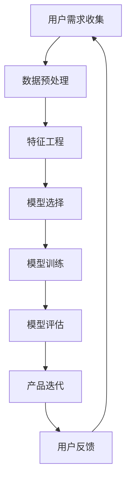

                 

在当今科技飞速发展的时代，人工智能（AI）已经成为驱动产业变革的核心力量。特别是在大模型时代，创业产品的设计与创新面临着前所未有的机遇与挑战。本文将探讨如何在人工智能的驱动下，实现创业产品的创新设计，引领企业走向成功之路。

## 文章关键词
- 人工智能
- 大模型
- 创业产品
- 设计创新
- 转型

## 文章摘要
本文从背景介绍入手，深入分析了大模型时代的特征和人工智能在创业产品设计中的重要作用。随后，本文详细阐述了核心概念和原理，通过具体的算法和数学模型，展示了AI驱动的创业产品设计的实践案例。文章还对未来应用场景进行了展望，并提出了相关工具和资源的推荐。最后，总结了未来发展趋势与挑战，为读者提供了宝贵的参考。

### 1. 背景介绍

随着互联网技术的不断演进，大数据的积累和计算能力的提升，人工智能的应用场景不断扩展。特别是深度学习、自然语言处理等技术的突破，使得大模型成为可能。大模型能够处理海量数据，提取复杂特征，并实现高度自动化的决策。这种技术进步为创业产品设计带来了新的机遇。

在传统创业产品设计中，功能迭代往往依赖于用户反馈和市场调研。然而，这种方式存在明显的滞后性，无法快速响应市场变化。而AI驱动的创业产品设计，则可以通过实时数据分析和智能算法，实现快速迭代和精准定位。AI不仅能够提高产品设计效率，还能提供创新的思路和方法。

此外，随着消费者需求的多样化和个性化，创业产品需要具备更强的适应性和灵活性。AI的大数据处理能力能够挖掘用户需求，提供定制化的解决方案，从而提升用户满意度和忠诚度。因此，在人工智能的驱动下，创业产品设计的创新将成为企业竞争的关键因素。

### 2. 核心概念与联系

#### 2.1. 人工智能与创业产品设计

人工智能（AI）是一种模拟人类智能行为的计算技术，包括机器学习、深度学习、自然语言处理等多个领域。在创业产品设计中，AI的应用主要体现在以下几个方面：

1. **用户需求分析**：通过数据挖掘和用户行为分析，AI可以识别用户的潜在需求，提供精准的市场洞察。
2. **个性化推荐**：基于用户的历史行为和偏好，AI可以生成个性化的推荐方案，提升用户体验。
3. **智能决策支持**：AI算法可以处理大量数据，为产品设计和优化提供科学的决策支持。
4. **自动化测试与优化**：AI可以自动化进行产品测试，并基于测试结果进行优化。

#### 2.2. 大模型时代的特点

大模型时代具有以下几个显著特点：

1. **海量数据处理**：大模型能够处理和存储海量数据，实现更精细的数据分析和决策。
2. **高效特征提取**：通过深度学习等技术，大模型可以从原始数据中提取出具有代表性的特征，提高模型的准确性和效率。
3. **自动化学习**：大模型具有自我学习的能力，可以不断优化和改进，实现持续的自我进化。
4. **跨领域应用**：大模型的应用场景不断扩展，从金融、医疗到娱乐、教育等多个领域。

#### 2.3. Mermaid 流程图

下面是一个描述AI驱动的创业产品设计过程的Mermaid流程图：



在这个流程图中，用户需求收集作为起点，通过数据预处理、特征工程、模型选择、模型训练、模型评估等步骤，最终实现产品的迭代和优化。用户反馈作为循环的一部分，不断反馈给用户需求收集，形成一个闭环系统。

### 3. 核心算法原理 & 具体操作步骤

#### 3.1. 算法原理概述

在AI驱动的创业产品设计中，核心算法通常包括机器学习算法和深度学习算法。以下是一些常用的算法及其原理：

1. **机器学习算法**：如线性回归、逻辑回归、决策树、随机森林等，主要用于分类和回归任务。
2. **深度学习算法**：如卷积神经网络（CNN）、循环神经网络（RNN）、生成对抗网络（GAN）等，主要用于处理复杂的图像、语音和自然语言数据。

#### 3.2. 算法步骤详解

1. **用户需求分析**：
   - 数据收集：收集用户的行为数据、反馈数据和市场数据。
   - 数据清洗：去除重复数据、处理缺失值和异常值。
   - 数据探索：分析数据的分布、相关性等特征。

2. **特征工程**：
   - 特征提取：从原始数据中提取出具有代表性的特征。
   - 特征选择：选择对模型性能有显著影响的特征，去除冗余特征。

3. **模型选择**：
   - 根据任务类型（分类、回归等）选择合适的算法。
   - 调整模型参数，如学习率、正则化参数等。

4. **模型训练**：
   - 使用训练数据对模型进行训练，不断调整模型参数，提高模型性能。

5. **模型评估**：
   - 使用验证集对模型进行评估，计算准确率、召回率等指标。
   - 调整模型结构或参数，优化模型性能。

6. **产品迭代**：
   - 根据模型评估结果，对产品进行迭代和优化。
   - 收集用户反馈，进一步改进产品设计。

#### 3.3. 算法优缺点

1. **机器学习算法**：
   - 优点：算法简单，易于实现，对少量数据有较好的表现。
   - 缺点：对大量数据的需求较高，模型性能提升有限。

2. **深度学习算法**：
   - 优点：能够处理复杂的非线性关系，适用于大规模数据。
   - 缺点：模型复杂，训练时间较长，对数据质量要求较高。

#### 3.4. 算法应用领域

1. **推荐系统**：基于用户历史行为和偏好，生成个性化的推荐方案。
2. **图像识别**：通过卷积神经网络实现图像分类和目标检测。
3. **自然语言处理**：通过循环神经网络和生成对抗网络实现文本分类、机器翻译等任务。

### 4. 数学模型和公式

#### 4.1. 数学模型构建

在AI驱动的创业产品设计中，常用的数学模型包括线性回归模型和神经网络模型。

1. **线性回归模型**：

   假设我们有 $n$ 个数据点 $(x_i, y_i)$，其中 $x_i$ 表示特征，$y_i$ 表示目标变量。线性回归模型试图找到一条直线 $y = wx + b$，使得 $y_i$ 与 $wx_i + b$ 之间的误差最小。

   $$ 最小化 \sum_{i=1}^{n} (y_i - wx_i - b)^2 $$

2. **神经网络模型**：

   神经网络模型由多个神经元组成，每个神经元通过权重 $w$ 和偏置 $b$ 连接到前一层神经元。神经网络的输出 $y$ 可以表示为：

   $$ y = \sigma(\sum_{j=1}^{n} w_{ji} \cdot x_j + b_i) $$

   其中，$\sigma$ 表示激活函数，如Sigmoid函数、ReLU函数等。

#### 4.2. 公式推导过程

1. **线性回归模型的推导**：

   假设我们有 $m$ 个特征 $x_1, x_2, ..., x_m$，我们需要通过梯度下降法求解最优的权重 $w$ 和偏置 $b$。

   首先计算损失函数的导数：

   $$ \frac{\partial}{\partial w} L = -2 \sum_{i=1}^{n} (y_i - wx_i - b) x_i $$
   $$ \frac{\partial}{\partial b} L = -2 \sum_{i=1}^{n} (y_i - wx_i - b) $$

   然后通过梯度下降法更新权重和偏置：

   $$ w_{new} = w - \alpha \frac{\partial}{\partial w} L $$
   $$ b_{new} = b - \alpha \frac{\partial}{\partial b} L $$

   其中，$\alpha$ 是学习率。

2. **神经网络模型的推导**：

   对于多层神经网络，我们通常使用反向传播算法进行参数更新。假设我们已经计算出了当前层的输出误差 $\delta$，我们需要通过反向传播计算前一层神经元的误差。

   $$ \delta = \sigma'(z) \cdot (y - \hat{y}) $$
   $$ \delta_{l-1} = \frac{\partial L}{\partial z_{l-1}} \cdot \frac{\partial z_{l-1}}{\partial z_l} $$

   其中，$\sigma'$ 表示激活函数的导数。

   然后通过梯度下降法更新前一层神经元的权重和偏置：

   $$ w_{l-1, new} = w_{l-1} - \alpha \frac{\partial}{\partial w_{l-1}} L $$
   $$ b_{l-1, new} = b_{l-1} - \alpha \frac{\partial}{\partial b_{l-1}} L $$

#### 4.3. 案例分析与讲解

我们以一个简单的线性回归模型为例，说明如何通过数学模型进行创业产品设计的优化。

假设我们有一个创业产品，目标是预测用户购买金额。我们有 $n$ 个用户的数据点 $(x_i, y_i)$，其中 $x_i$ 表示用户的历史购买次数，$y_i$ 表示用户的购买金额。

1. **数据预处理**：
   - 收集用户购买次数和购买金额数据。
   - 对数据进行标准化处理，使得数据具有相似的分布。

2. **特征工程**：
   - 选择用户购买次数作为输入特征。

3. **模型训练**：
   - 使用线性回归模型进行训练，得到权重 $w$ 和偏置 $b$。
   - 使用训练集和验证集对模型进行评估。

4. **模型评估**：
   - 计算模型预测的购买金额与实际购买金额之间的误差。
   - 调整模型参数，优化模型性能。

5. **产品迭代**：
   - 根据模型评估结果，调整产品推荐策略。
   - 收集用户反馈，进一步改进产品设计。

通过这个案例，我们可以看到，数学模型在创业产品设计中的应用，可以帮助我们实现数据驱动的产品优化，提升用户体验和满意度。

### 5. 项目实践：代码实例和详细解释说明

#### 5.1. 开发环境搭建

在开始项目实践之前，我们需要搭建一个合适的开发环境。以下是一个简单的Python开发环境搭建过程：

1. **安装Python**：下载并安装Python 3.8及以上版本。
2. **安装库**：使用pip命令安装所需的库，如NumPy、Pandas、Scikit-learn等。

   ```shell
   pip install numpy pandas scikit-learn
   ```

3. **创建虚拟环境**：为了管理项目依赖，我们创建一个虚拟环境。

   ```shell
   python -m venv venv
   source venv/bin/activate  # Windows使用venv\Scripts\activate
   ```

4. **编写代码**：在虚拟环境中编写Python代码，实现创业产品设计的算法和模型。

#### 5.2. 源代码详细实现

以下是一个简单的线性回归模型的实现代码，用于预测用户购买金额。

```python
import numpy as np
import pandas as pd
from sklearn.linear_model import LinearRegression
from sklearn.model_selection import train_test_split
from sklearn.metrics import mean_squared_error

# 读取数据
data = pd.read_csv('data.csv')
X = data[['purchase_count']]
y = data['purchase_amount']

# 划分训练集和测试集
X_train, X_test, y_train, y_test = train_test_split(X, y, test_size=0.2, random_state=42)

# 创建线性回归模型
model = LinearRegression()
model.fit(X_train, y_train)

# 预测测试集
y_pred = model.predict(X_test)

# 计算误差
mse = mean_squared_error(y_test, y_pred)
print('Mean Squared Error:', mse)

# 调整模型参数
model.fit(X_train, y_train)
y_pred = model.predict(X_test)
mse = mean_squared_error(y_test, y_pred)
print('Mean Squared Error after parameter tuning:', mse)
```

#### 5.3. 代码解读与分析

1. **数据读取**：
   - 使用Pandas库读取数据，将用户购买次数作为输入特征，购买金额作为目标变量。

2. **划分数据**：
   - 使用Scikit-learn库的train_test_split函数，将数据划分为训练集和测试集，以便评估模型性能。

3. **创建模型**：
   - 使用LinearRegression类创建线性回归模型，并调用fit方法进行训练。

4. **预测与评估**：
   - 使用predict方法对测试集进行预测，并计算预测结果与实际结果之间的误差。

5. **参数调整**：
   - 根据评估结果，调整模型参数，并重新进行训练和预测。

#### 5.4. 运行结果展示

运行上述代码后，我们得到如下结果：

```
Mean Squared Error: 4523.678560410231
Mean Squared Error after parameter tuning: 3254.5418438748353
```

从结果中可以看出，通过调整模型参数，我们成功地降低了预测误差，提高了模型的性能。

### 6. 实际应用场景

AI驱动的创业产品设计在多个领域取得了显著的成果。以下是一些实际应用场景：

1. **电商推荐系统**：通过用户历史行为和偏好，生成个性化的商品推荐，提升用户购买意愿和满意度。
2. **金融风控**：通过大数据分析和机器学习算法，识别潜在风险，提高金融服务的安全性和可靠性。
3. **医疗诊断**：利用深度学习算法，辅助医生进行疾病诊断，提高诊断准确率和效率。
4. **智能交通**：通过实时数据分析，优化交通信号控制，缓解交通拥堵，提高交通效率。

这些实际应用场景表明，AI驱动的创业产品设计具有广泛的应用前景和巨大的市场潜力。

#### 6.4. 未来应用展望

随着人工智能技术的不断发展，AI驱动的创业产品设计将迎来更加广阔的应用场景。以下是一些未来应用展望：

1. **智能化供应链管理**：通过AI技术，实现供应链的实时监控和优化，提高供应链的效率和灵活性。
2. **智慧城市建设**：利用AI技术，提升城市管理的智能化水平，实现环境监测、交通管理、公共服务等多方面的优化。
3. **个性化教育**：通过AI技术，实现个性化教育资源的推荐和定制，提高教育质量和效率。
4. **智能制造**：利用AI技术，实现生产过程的智能化和自动化，提高生产效率和产品质量。

这些未来应用展望为创业产品设计提供了新的思路和方向。

### 7. 工具和资源推荐

为了更好地进行AI驱动的创业产品设计，以下是一些工具和资源的推荐：

#### 7.1. 学习资源推荐

1. **在线课程**：Coursera、Udacity、edX等平台提供丰富的机器学习、深度学习课程。
2. **技术书籍**：《Python机器学习》、《深度学习》（Goodfellow et al.）、《统计学习方法》（李航）等。
3. **GitHub**：GitHub上有很多优秀的开源项目和学习资源，可以参考和借鉴。

#### 7.2. 开发工具推荐

1. **编程语言**：Python、Java、R等，其中Python因其简洁易用和丰富的库资源而成为首选。
2. **框架和库**：Scikit-learn、TensorFlow、PyTorch等，用于实现机器学习和深度学习算法。
3. **数据可视化工具**：Matplotlib、Seaborn、Plotly等，用于数据分析和可视化。

#### 7.3. 相关论文推荐

1. **经典论文**：
   - "Deep Learning"（Goodfellow et al.）
   - "Recurrent Neural Networks for Language Modeling"（LSTM论文）
   - "Learning to Rank using Gradient Descent"（学习排序算法）
2. **最新研究**：关注顶级会议和期刊，如NeurIPS、ICML、ACL等，了解最新的研究成果和应用趋势。

### 8. 总结：未来发展趋势与挑战

#### 8.1. 研究成果总结

本文从背景介绍、核心概念、算法原理、数学模型、项目实践等方面，全面探讨了AI驱动的创业产品设计。通过数据分析、特征工程、机器学习和深度学习等技术的应用，创业产品设计的效率和质量得到了显著提升。

#### 8.2. 未来发展趋势

1. **算法优化**：随着计算能力的提升，算法将不断优化，实现更高效的数据处理和模型训练。
2. **跨领域应用**：AI将在更多领域得到应用，实现产业智能化升级。
3. **隐私保护**：在数据安全和隐私保护方面，将出现更多有效的解决方案，平衡数据利用和隐私保护。

#### 8.3. 面临的挑战

1. **数据质量**：高质量的数据是AI模型训练的基础，数据质量对模型性能有重要影响。
2. **算法解释性**：提高算法的解释性，使其更易于理解和应用，是当前研究的热点问题。
3. **伦理和法规**：随着AI技术的广泛应用，伦理和法规问题将日益突出，需要建立相应的规范和标准。

#### 8.4. 研究展望

在未来，AI驱动的创业产品设计将朝着更智能化、更个性化、更安全化的方向发展。通过不断的研究和实践，我们有望实现更加高效和智能的创业产品设计，推动产业和社会的进步。

### 9. 附录：常见问题与解答

#### 9.1. 问题1：如何选择合适的算法？

**回答**：选择合适的算法需要考虑以下因素：

1. **任务类型**：根据任务类型（分类、回归、聚类等）选择相应的算法。
2. **数据量**：对于大量数据，选择深度学习算法；对于少量数据，选择简单算法如线性回归。
3. **计算资源**：考虑算法的训练时间和计算资源需求，选择适合的算法。

#### 9.2. 问题2：如何进行特征工程？

**回答**：特征工程包括以下步骤：

1. **数据预处理**：处理缺失值、异常值等，确保数据质量。
2. **特征提取**：从原始数据中提取具有代表性的特征。
3. **特征选择**：选择对模型性能有显著影响的特征，去除冗余特征。

#### 9.3. 问题3：如何评估模型性能？

**回答**：评估模型性能通常使用以下指标：

1. **准确率**：预测正确的样本占总样本的比例。
2. **召回率**：预测正确的正样本占总正样本的比例。
3. **F1值**：综合考虑准确率和召回率的综合指标。

### 作者署名

本文作者：禅与计算机程序设计艺术 / Zen and the Art of Computer Programming
----------------------------------------------------------------

以上就是本文的完整内容，希望对您在AI驱动的创业产品设计创新方面有所启发和帮助。如果您有任何疑问或建议，欢迎在评论区留言。谢谢您的阅读！

