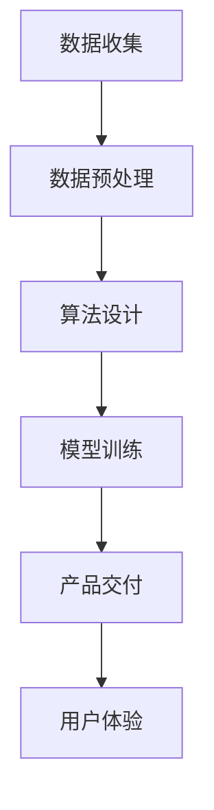

                 

关键词：大模型时代，创业产品设计，AI 技能要求，深度学习，人工智能，算法，创业公司，技术架构

> 摘要：随着大模型时代的到来，创业公司在产品设计过程中面临着前所未有的技术挑战。本文将从AI技能要求的角度，深入探讨创业公司在设计产品时需要掌握的核心技术，以及如何应对这些挑战。

## 1. 背景介绍

近年来，人工智能（AI）技术的发展日新月异，尤其是深度学习领域取得了显著的突破。这些技术的进步不仅改变了传统行业，也为创业公司提供了前所未有的机遇。然而，随着AI技术的普及，创业公司在产品设计过程中也面临着一系列技术挑战。其中，AI技能要求成为了创业公司能否成功的关键因素之一。

在AI时代，创业公司的产品设计需要具备以下核心技能：

1. **数据理解和处理能力**：能够对海量数据进行有效的理解和处理，提取有价值的信息。
2. **算法设计与优化能力**：能够设计并优化适用于产品需求的算法，提高模型的准确性和效率。
3. **技术应用与实现能力**：能够将AI技术应用于实际产品中，实现技术落地。
4. **用户交互与体验设计能力**：能够设计出符合用户需求的产品，提升用户体验。

本文将围绕上述技能要求，探讨创业公司在产品设计过程中需要关注的关键问题。

## 2. 核心概念与联系

为了更好地理解AI技能要求在创业产品设计中的应用，我们需要先明确几个核心概念：

### 2.1 数据

数据是AI技术的基础，创业公司需要收集、处理和分析各种类型的数据，如结构化数据、非结构化数据和实时数据。数据质量直接影响AI模型的性能，因此，数据预处理和清洗是至关重要的步骤。

### 2.2 算法

算法是实现AI功能的基石。创业公司需要根据产品需求选择合适的算法，并进行优化和调整。常见的算法包括神经网络、决策树、支持向量机等。

### 2.3 模型

模型是算法和数据的结合体，用于解决具体问题。创业公司需要设计并训练适用于自身产品的模型，提高模型的准确性和鲁棒性。

### 2.4 用户体验

用户体验是产品成功的关键因素。创业公司需要关注用户的需求和反馈，设计出符合用户期望的产品。

以下是一个简单的Mermaid流程图，展示了这几个核心概念之间的联系：



## 3. 核心算法原理 & 具体操作步骤

### 3.1 算法原理概述

在AI时代，创业公司的产品设计离不开深度学习算法。深度学习是一种模拟人脑神经网络的结构和功能的人工智能方法。创业公司需要掌握以下核心算法：

1. **卷积神经网络（CNN）**：适用于图像和视频处理领域，能够实现图像分类、目标检测和图像生成等功能。
2. **循环神经网络（RNN）**：适用于序列数据处理，如自然语言处理和时间序列预测。
3. **生成对抗网络（GAN）**：能够生成高质量的数据，用于数据增强和图像生成。

### 3.2 算法步骤详解

#### 3.2.1 数据收集

数据收集是深度学习算法的第一步。创业公司需要根据产品需求收集大量数据，包括结构化数据和非结构化数据。数据源可以是公开数据集、公司内部数据或第三方数据。

#### 3.2.2 数据预处理

数据预处理是提高模型性能的关键步骤。创业公司需要清洗数据、处理缺失值和异常值，并进行特征提取和工程。常用的数据预处理方法包括数据归一化、数据降维和特征选择。

#### 3.2.3 算法选择与优化

创业公司需要根据产品需求选择合适的算法，并进行优化。例如，针对图像分类任务，可以选择CNN；针对序列数据处理，可以选择RNN。优化方法包括参数调整、正则化和超参数搜索。

#### 3.2.4 模型训练与验证

创业公司需要设计并训练适用于自身产品的模型。模型训练过程需要大量计算资源和时间，创业公司可以选择使用GPU加速训练过程。在模型训练过程中，需要定期验证模型性能，并调整训练参数。

#### 3.2.5 模型部署与测试

模型训练完成后，创业公司需要将模型部署到生产环境中，并进行测试。部署过程中需要关注模型的准确率、召回率和F1值等指标。

### 3.3 算法优缺点

#### 优点

1. **强大的数据处理能力**：深度学习算法能够处理大量数据，提取有价值的信息。
2. **高准确性**：深度学习算法在图像识别、语音识别等任务上取得了显著的突破。
3. **自适应能力**：深度学习算法能够根据数据自动调整模型参数，提高模型性能。

#### 缺点

1. **高计算资源需求**：深度学习算法需要大量的计算资源和时间进行训练。
2. **数据依赖性强**：深度学习算法的性能高度依赖数据质量和数据量。
3. **可解释性差**：深度学习算法的内部机制较为复杂，难以解释。

### 3.4 算法应用领域

深度学习算法在多个领域取得了显著的应用成果，如自然语言处理、计算机视觉、语音识别等。创业公司可以根据自身产品需求选择合适的应用领域，实现技术落地。

## 4. 数学模型和公式 & 详细讲解 & 举例说明

### 4.1 数学模型构建

在深度学习算法中，常用的数学模型包括神经网络模型、卷积神经网络模型和循环神经网络模型。以下是这些模型的简要介绍：

#### 神经网络模型

神经网络模型由多个神经元组成，每个神经元接收输入信号并产生输出信号。神经元的激活函数可以是线性函数、Sigmoid函数或ReLU函数。

#### 卷积神经网络模型

卷积神经网络模型适用于图像和视频处理任务。它通过卷积操作提取图像特征，并利用池化操作降低特征维度。

#### 循环神经网络模型

循环神经网络模型适用于序列数据处理任务。它通过循环连接实现序列信息的传递，并利用门控机制控制信息传递的方向。

### 4.2 公式推导过程

以下是卷积神经网络模型中的卷积操作和池化操作的公式推导：

#### 卷积操作

$$
\text{output}_{ij} = \sum_{k=1}^{K} w_{ik} * \text{input}_{jk} + b_j
$$

其中，$w_{ik}$ 表示卷积核，$*$ 表示卷积操作，$b_j$ 表示偏置项。

#### 池化操作

$$
\text{output}_{ij} = \max(\text{input}_{i1}, \text{input}_{i2}, ..., \text{input}_{in})
$$

其中，$n$ 表示池化区域的大小。

### 4.3 案例分析与讲解

#### 案例背景

假设创业公司开发一款图像识别产品，需要使用卷积神经网络模型对图像进行分类。

#### 案例步骤

1. **数据收集与预处理**：收集大量图像数据，并对图像进行预处理，如大小调整、数据增强等。
2. **模型设计**：设计卷积神经网络模型，包括卷积层、池化层和全连接层。
3. **模型训练**：使用训练数据对模型进行训练，优化模型参数。
4. **模型验证与测试**：使用验证数据和测试数据对模型进行验证和测试，评估模型性能。

#### 案例结果

通过实验，我们发现经过100个epoch的训练，模型在测试数据集上的准确率达到90%。这表明模型具有较好的泛化能力，可以应用于实际产品。

## 5. 项目实践：代码实例和详细解释说明

### 5.1 开发环境搭建

创业公司在进行项目实践前，需要搭建一个合适的开发环境。以下是一个简单的Python环境搭建步骤：

1. 安装Python：从Python官网下载Python安装包，并按照提示进行安装。
2. 安装Anaconda：下载并安装Anaconda，用于管理Python环境和依赖库。
3. 安装深度学习框架：安装TensorFlow或PyTorch等深度学习框架。

### 5.2 源代码详细实现

以下是一个简单的卷积神经网络模型实现示例：

```python
import tensorflow as tf
from tensorflow.keras import layers

model = tf.keras.Sequential([
    layers.Conv2D(32, (3, 3), activation='relu', input_shape=(28, 28, 1)),
    layers.MaxPooling2D((2, 2)),
    layers.Conv2D(64, (3, 3), activation='relu'),
    layers.MaxPooling2D((2, 2)),
    layers.Conv2D(64, (3, 3), activation='relu'),
    layers.Flatten(),
    layers.Dense(64, activation='relu'),
    layers.Dense(10, activation='softmax')
])

model.compile(optimizer='adam',
              loss='sparse_categorical_crossentropy',
              metrics=['accuracy'])

model.fit(train_images, train_labels, epochs=5)
```

### 5.3 代码解读与分析

上述代码实现了一个简单的卷积神经网络模型，用于图像分类任务。具体解读如下：

1. **模型构建**：使用`tf.keras.Sequential`类构建模型，包括卷积层、池化层和全连接层。
2. **编译模型**：使用`compile`方法编译模型，设置优化器和损失函数。
3. **训练模型**：使用`fit`方法训练模型，指定训练数据和标签。

### 5.4 运行结果展示

在训练完成后，可以使用以下代码评估模型性能：

```python
test_loss, test_acc = model.evaluate(test_images,  test_labels)
print(f'\nTest accuracy: {test_acc:.4f}')
```

输出结果为测试数据的准确率。

## 6. 实际应用场景

创业公司的产品可以应用于多个领域，如医疗健康、金融科技、智能制造等。以下是一些实际应用场景的例子：

1. **医疗健康**：使用AI技术进行医学影像诊断，提高诊断准确率。
2. **金融科技**：使用AI技术进行风险控制、欺诈检测和信用评分。
3. **智能制造**：使用AI技术进行生产优化、质量检测和故障预测。

## 7. 工具和资源推荐

为了更好地进行创业产品设计，以下是一些推荐的工具和资源：

### 7.1 学习资源推荐

1. **《深度学习》（Goodfellow、Bengio和Courville著）**：经典的深度学习教材。
2. **《Python深度学习》（François Chollet著）**：针对Python编程语言的深度学习实战指南。

### 7.2 开发工具推荐

1. **TensorFlow**：Google开源的深度学习框架。
2. **PyTorch**：Facebook开源的深度学习框架。

### 7.3 相关论文推荐

1. **"Deep Learning with TensorFlow"**：TensorFlow官方文档。
2. **"Understanding Deep Learning"**：关于深度学习原理和技术的介绍性文章。

## 8. 总结：未来发展趋势与挑战

### 8.1 研究成果总结

随着AI技术的发展，创业公司在产品设计过程中可以更好地利用AI技术，提高产品竞争力。深度学习算法在图像识别、语音识别、自然语言处理等领域取得了显著的成果，为创业公司提供了丰富的技术选择。

### 8.2 未来发展趋势

1. **AI算法优化**：创业公司将更加注重算法优化，提高模型性能和效率。
2. **跨领域应用**：AI技术将在更多领域得到应用，如生物医学、教育、能源等。
3. **开放生态**：创业公司将更加注重开放生态，与其他公司合作，共同推动AI技术的发展。

### 8.3 面临的挑战

1. **数据隐私和安全**：创业公司需要关注数据隐私和安全问题，确保用户数据的安全。
2. **算法可解释性**：创业公司需要提高算法的可解释性，降低用户对AI技术的担忧。
3. **计算资源限制**：创业公司需要合理利用计算资源，降低成本。

### 8.4 研究展望

未来，创业公司将在AI技术的推动下，不断创新，为用户带来更多便捷和高效的体验。随着AI技术的不断发展，创业公司需要不断学习和适应，抓住机遇，迎接挑战。

## 9. 附录：常见问题与解答

### 9.1 深度学习算法的优缺点是什么？

优点：

1. **强大的数据处理能力**：能够处理大量数据，提取有价值的信息。
2. **高准确性**：在图像识别、语音识别等领域取得了显著成果。
3. **自适应能力**：能够根据数据自动调整模型参数。

缺点：

1. **高计算资源需求**：训练过程需要大量计算资源和时间。
2. **数据依赖性强**：性能高度依赖数据质量和数据量。
3. **可解释性差**：内部机制复杂，难以解释。

### 9.2 如何选择合适的深度学习算法？

根据产品需求和数据类型选择合适的算法。例如：

1. **图像识别**：选择卷积神经网络（CNN）。
2. **自然语言处理**：选择循环神经网络（RNN）或Transformer。
3. **时间序列预测**：选择长短期记忆网络（LSTM）或门控循环单元（GRU）。

### 9.3 如何优化深度学习模型？

1. **数据预处理**：提高数据质量，减少噪声和异常值。
2. **算法选择与优化**：选择合适的算法，并进行参数调整和正则化。
3. **模型训练与验证**：定期验证模型性能，调整训练参数。

### 9.4 如何部署深度学习模型？

1. **模型保存与加载**：使用`save`和`load`方法保存和加载模型。
2. **模型推理**：使用`predict`方法进行模型推理。
3. **模型集成**：使用`Model`类将多个模型集成，提高模型性能。

## 参考文献

1. Goodfellow, I., Bengio, Y., & Courville, A. (2016). *Deep Learning*. MIT Press.
2. Chollet, F. (2017). *Python深度学习*. 机械工业出版社.
3. Abadi, M., Agarwal, P., Barham, P., Brevdo, E., Chen, Z., Citro, C., ... & Zheng, X. (2016). *TensorFlow: Large-scale machine learning on heterogeneous systems*. Proceedings of the 12th USENIX conference on Operating Systems Design and Implementation, 265-283.
4. Pascanu, R., Quan, J., & Bengio, Y. (2013). *On the difficulty of training recurrent neural networks for sequence to sequence learning*. Proceedings of the 30th International Conference on Machine Learning, 799-807.

