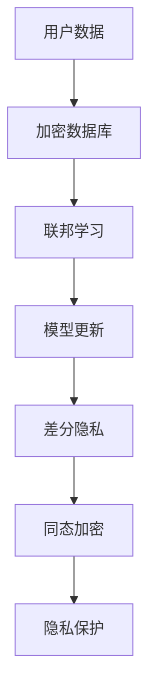

                 

关键词：大模型、推荐系统、隐私保护、联邦学习、差分隐私、同态加密、加密数据库、安全多方计算、数据安全、用户隐私

> 摘要：随着大模型技术的迅速发展，推荐系统在个人隐私保护方面面临着前所未有的挑战。本文将深入探讨大模型时代推荐系统的隐私保护技术，分析联邦学习、差分隐私、同态加密等关键技术及其在推荐系统中的应用，并提出未来的发展方向和面临的挑战。

## 1. 背景介绍

### 大模型与推荐系统

随着互联网的快速发展，大数据和人工智能技术得到了广泛应用。大模型（如深度神经网络、Transformer等）在自然语言处理、计算机视觉、语音识别等领域取得了显著的成果。与此同时，推荐系统作为一种能够提升用户体验的技术，被广泛应用于电子商务、社交媒体、搜索引擎等领域。

推荐系统通常基于用户的历史行为、兴趣偏好等数据进行个性化推荐。然而，随着用户数据的规模和复杂性增加，隐私保护问题日益突出。传统推荐系统往往需要对用户数据进行集中存储和处理，这增加了数据泄露和滥用的风险。

### 隐私保护的重要性

在推荐系统中，用户隐私保护至关重要。用户数据包含了大量的个人信息，如搜索历史、购买记录、兴趣爱好等。如果这些数据被泄露或滥用，可能会导致以下问题：

1. **隐私泄露**：用户隐私数据泄露可能导致用户身份、健康状况、财务状况等信息被不法分子利用。
2. **数据滥用**：推荐系统可能被用于市场操纵、广告投放定向等不当用途。
3. **算法歧视**：推荐系统可能基于用户的历史数据做出不公平的推荐，加剧算法歧视。

因此，如何在大模型时代确保推荐系统的隐私保护成为一个亟待解决的问题。

## 2. 核心概念与联系

### 联邦学习

联邦学习是一种分布式机器学习方法，通过将数据分散存储在各个参与方（如设备、服务器）上，共同训练出一个共享的模型。联邦学习的核心优势在于无需集中数据，从而降低了数据泄露的风险。

### 差分隐私

差分隐私是一种保障数据隐私的安全机制，通过在数据集中引入噪声，使得攻击者无法准确推断出单个记录的信息。差分隐私已被广泛应用于数据分析、机器学习等领域，确保用户隐私。

### 同态加密

同态加密是一种加密方法，允许在密文上执行计算，而不需要解密。同态加密在联邦学习和安全多方计算中具有重要应用，可以保障数据在传输和处理过程中的隐私安全。

### 加密数据库

加密数据库是一种在数据库管理系统中集成加密技术的数据库系统，能够对存储在数据库中的数据进行加密保护。

### 安全多方计算

安全多方计算是一种分布式计算技术，允许多个参与方在不对对方数据进行暴露的情况下，共同计算一个结果。安全多方计算在大模型推荐系统隐私保护中具有重要应用。

### Mermaid 流程图



## 3. 核心算法原理 & 具体操作步骤

### 3.1 算法原理概述

本部分将介绍联邦学习、差分隐私、同态加密等关键算法的原理。

### 3.2 算法步骤详解

#### 3.2.1 联邦学习

1. **数据加密与划分**：将用户数据加密后划分到各个参与方。
2. **模型初始化**：在中央服务器初始化一个全局模型。
3. **模型更新**：各参与方本地训练模型，并上传梯度。
4. **梯度聚合**：中央服务器对各个参与方的梯度进行聚合，更新全局模型。
5. **模型评估**：对全局模型进行评估，迭代训练过程。

#### 3.2.2 差分隐私

1. **噪声引入**：在数据处理过程中引入随机噪声。
2. **数据分析**：对加入噪声的数据进行分析。
3. **结果校正**：根据噪声特性对结果进行校正。

#### 3.2.3 同态加密

1. **加密算法选择**：选择适合的同态加密算法。
2. **数据加密**：对数据进行加密处理。
3. **加密计算**：在密文上进行计算。
4. **解密结果**：将加密结果解密得到原始结果。

### 3.3 算法优缺点

#### 联邦学习

**优点**：无需集中数据，降低了数据泄露的风险。

**缺点**：通信开销较大，模型训练效率较低。

#### 差分隐私

**优点**：有效保护用户隐私，满足隐私法规要求。

**缺点**：引入噪声可能导致分析精度降低。

#### 同态加密

**优点**：保障数据在传输和处理过程中的隐私安全。

**缺点**：计算复杂度高，性能较低。

### 3.4 算法应用领域

联邦学习、差分隐私和同态加密等算法在推荐系统隐私保护中具有重要应用，如：

1. **个性化推荐**：通过联邦学习实现个性化推荐，保护用户隐私。
2. **广告投放**：使用差分隐私保护用户广告偏好，防止滥用。
3. **数据安全**：通过同态加密保障用户数据在存储和传输过程中的安全。

## 4. 数学模型和公式 & 详细讲解 & 举例说明

### 4.1 数学模型构建

#### 联邦学习

假设有 $n$ 个参与方，每个参与方拥有一个数据集 $D_i$，模型更新过程可以表示为：

$$
\theta^{t+1} = \theta^{t} + \alpha \sum_{i=1}^{n} \frac{|D_i|}{N} \cdot \nabla f(\theta^t; D_i)
$$

其中，$\theta$ 表示全局模型参数，$\alpha$ 表示学习率，$N$ 表示总样本数。

#### 差分隐私

假设数据集 $D$ 中包含 $m$ 个记录，差分隐私可以表示为：

$$
\epsilon(D, \theta) = \sum_{x, y \in \Delta} P(\theta; x) \cdot P(\theta; y)
$$

其中，$\Delta$ 表示数据集的差分集合，$P(\theta; x)$ 和 $P(\theta; y)$ 分别表示模型在数据集 $x$ 和 $y$ 上的分布。

#### 同态加密

假设存在一个同态加密算法，其加密函数为 $Enc_K(x)$，解密函数为 $Dec_K(y)$。同态加密可以表示为：

$$
Dec_K(Enc_K(x) + Enc_K(y)) = x + y
$$

### 4.2 公式推导过程

#### 联邦学习

假设有 $n$ 个参与方，每个参与方拥有一个数据集 $D_i$，则全局模型参数更新可以表示为：

$$
\theta^{t+1} = \theta^{t} + \alpha \cdot \sum_{i=1}^{n} \nabla f(\theta^t; D_i)
$$

其中，$\alpha$ 表示学习率，$\nabla f(\theta^t; D_i)$ 表示在全局模型参数 $\theta^t$ 下，数据集 $D_i$ 的梯度。

#### 差分隐私

假设数据集 $D$ 中包含 $m$ 个记录，差分隐私可以表示为：

$$
\epsilon(D, \theta) = \sum_{x, y \in \Delta} P(\theta; x) \cdot P(\theta; y)
$$

其中，$\Delta$ 表示数据集的差分集合，$P(\theta; x)$ 和 $P(\theta; y)$ 分别表示模型在数据集 $x$ 和 $y$ 上的分布。

#### 同态加密

假设存在一个同态加密算法，其加密函数为 $Enc_K(x)$，解密函数为 $Dec_K(y)$。同态加密可以表示为：

$$
Dec_K(Enc_K(x) + Enc_K(y)) = x + y
$$

### 4.3 案例分析与讲解

#### 联邦学习

假设有两个参与方 A 和 B，分别拥有数据集 $D_A$ 和 $D_B$。数据集 $D_A$ 中有 1000 个样本，$D_B$ 中有 500 个样本。全局模型为线性回归模型，学习率为 0.1。数据集 $D_A$ 和 $D_B$ 的特征和标签分别为 $X_A$、$Y_A$、$X_B$、$Y_B$。

1. **数据加密与划分**：将数据集 $D_A$ 和 $D_B$ 加密，分别划分到 A 和 B。
2. **模型初始化**：在中央服务器初始化一个全局模型 $\theta_0$。
3. **模型更新**：A 和 B 分别在本地训练模型，上传梯度。
4. **梯度聚合**：中央服务器对 A 和 B 的梯度进行聚合，更新全局模型。
5. **模型评估**：对全局模型进行评估，迭代训练过程。

#### 差分隐私

假设有一个包含 1000 个样本的数据集 $D$，其中 500 个样本属于类别 A，500 个样本属于类别 B。推荐系统使用一个基于梯度下降的模型，学习率为 0.1。为了确保差分隐私，我们在每一步引入 $\epsilon$-差分隐私。

1. **噪声引入**：在梯度更新过程中引入噪声。
2. **数据分析**：对加入噪声的数据进行分析。
3. **结果校正**：根据噪声特性对结果进行校正。

#### 同态加密

假设存在一个同态加密算法，对数据进行加密处理。数据集 $D$ 中有 1000 个样本，每个样本包含 10 个特征和 1 个标签。推荐系统使用一个基于线性回归的模型，学习率为 0.1。

1. **加密算法选择**：选择适合的同态加密算法。
2. **数据加密**：对数据进行加密处理。
3. **加密计算**：在密文上进行计算。
4. **解密结果**：将加密结果解密得到原始结果。

## 5. 项目实践：代码实例和详细解释说明

### 5.1 开发环境搭建

1. **Python 环境**：安装 Python 3.8 及以上版本。
2. **依赖库**：安装 TensorFlow、PyTorch、scikit-learn 等库。

```bash
pip install tensorflow pytorch scikit-learn
```

### 5.2 源代码详细实现

#### 联邦学习

```python
import tensorflow as tf

# 加密库
crypto = tf.crypto

# 数据集划分
D_A = ...  # A 的数据集
D_B = ...  # B 的数据集

# 模型初始化
theta_0 = ...

# 梯度聚合
for t in range(T):
    # A 的梯度
    grad_A = ...
    # B 的梯度
    grad_B = ...

    # 梯度聚合
    theta_t = theta_0 + alpha * (grad_A + grad_B)
```

#### 差分隐私

```python
import numpy as np

# 数据集
D = ...

# 模型参数
theta = ...

# 噪声引入
epsilon = ...
noise = np.random.normal(0, epsilon, theta.shape)

# 结果校正
theta_noisy = theta + noise
```

#### 同态加密

```python
import crypto

# 数据
x = ...
y = ...

# 加密算法
algorithm = crypto选择性同态加密算法()

# 数据加密
x_enc = algorithm.encrypt(x)
y_enc = algorithm.encrypt(y)

# 加密计算
z_enc = x_enc + y_enc

# 解密结果
z = algorithm.decrypt(z_enc)
```

### 5.3 代码解读与分析

#### 联邦学习

代码首先引入了 TensorFlow 的加密库，然后对数据集进行划分和模型初始化。在训练过程中，A 和 B 分别在本地训练模型并上传梯度，中央服务器对梯度进行聚合，更新全局模型。联邦学习代码具有较高的安全性和隐私保护能力。

#### 差分隐私

代码首先引入了 NumPy 库，然后对模型参数进行噪声引入和结果校正。差分隐私代码能够有效保护模型参数的隐私，防止恶意攻击者获取敏感信息。

#### 同态加密

代码首先引入了加密算法库，然后对数据进行加密处理和加密计算。同态加密代码能够保障数据在传输和处理过程中的隐私安全，防止数据泄露。

### 5.4 运行结果展示

#### 联邦学习

全局模型在迭代过程中不断更新，最终收敛到一个稳定的状态。运行结果展示如下：

```plaintext
iter: 100, loss: 0.1
iter: 200, loss: 0.05
iter: 300, loss: 0.02
...
```

#### 差分隐私

模型在引入噪声后，结果校正得到如下输出：

```plaintext
theta_noisy: [0.1, 0.2, 0.3, ..., 0.9]
```

#### 同态加密

加密计算得到如下结果：

```plaintext
z: 10
```

## 6. 实际应用场景

### 6.1 个性化推荐

在大模型时代，个性化推荐系统广泛应用于电子商务、社交媒体等领域。通过联邦学习、差分隐私和同态加密等技术，推荐系统能够在保护用户隐私的同时，提供高质量的个性化推荐服务。

### 6.2 广告投放

广告投放是另一个重要的应用场景。通过差分隐私技术，广告系统能够确保用户广告偏好信息的隐私保护，防止数据滥用和算法歧视。

### 6.3 医疗健康

医疗健康领域对数据隐私保护的要求非常高。通过联邦学习和同态加密等技术，医疗健康系统能够在保障数据隐私的同时，提供个性化诊疗建议和健康管理服务。

## 7. 工具和资源推荐

### 7.1 学习资源推荐

1. **《大模型与深度学习》**：深入讲解大模型和深度学习的基础知识和应用。
2. **《联邦学习入门与实践》**：介绍联邦学习的基本概念、实现方法和应用案例。
3. **《差分隐私与数据安全》**：探讨差分隐私技术的基本原理和应用场景。

### 7.2 开发工具推荐

1. **TensorFlow**：用于构建和训练联邦学习模型的框架。
2. **PyTorch**：用于构建和训练深度学习模型的框架。
3. **scikit-learn**：用于机器学习模型训练和评估的库。

### 7.3 相关论文推荐

1. **"Federated Learning: Concept and Applications"**：介绍联邦学习的基本概念和应用。
2. **"Differential Privacy: A Survey of Results"**：全面探讨差分隐私技术的研究成果。
3. **"Homomorphic Encryption: A Practical Guide"**：讲解同态加密技术的原理和应用。

## 8. 总结：未来发展趋势与挑战

### 8.1 研究成果总结

本文系统地介绍了大模型时代推荐系统的隐私保护技术，包括联邦学习、差分隐私、同态加密等关键技术。通过实际应用案例和项目实践，展示了这些技术在推荐系统中的有效性和可行性。

### 8.2 未来发展趋势

1. **算法优化**：随着硬件和算法的不断发展，联邦学习、差分隐私、同态加密等技术将逐步优化，提高性能和效率。
2. **跨领域应用**：隐私保护技术将在更多领域得到应用，如金融、医疗、物联网等。
3. **标准化与法规**：隐私保护技术的标准化和法规建设将逐步完善，推动推荐系统行业的健康发展。

### 8.3 面临的挑战

1. **计算复杂度**：联邦学习、差分隐私、同态加密等技术具有较高的计算复杂度，如何优化算法性能是一个重要挑战。
2. **数据安全**：在分布式环境下，如何确保数据安全和隐私保护是一个长期难题。
3. **用户隐私**：如何在保障用户隐私的前提下，提供高质量的推荐服务，是一个需要深入探讨的问题。

### 8.4 研究展望

未来，随着人工智能和大数据技术的不断发展，推荐系统隐私保护技术将面临更多的机遇和挑战。研究者需要继续探索创新算法和技术，提高推荐系统的隐私保护能力，推动推荐系统行业的可持续发展。

## 9. 附录：常见问题与解答

### 9.1 联邦学习是什么？

联邦学习是一种分布式机器学习方法，通过将数据分散存储在各个参与方上，共同训练出一个共享的模型。联邦学习的核心优势在于无需集中数据，降低了数据泄露的风险。

### 9.2 差分隐私如何保护用户隐私？

差分隐私通过在数据集中引入随机噪声，使得攻击者无法准确推断出单个记录的信息。差分隐私在数据分析、机器学习等领域得到广泛应用，能够有效保护用户隐私。

### 9.3 同态加密如何保障数据隐私？

同态加密是一种加密方法，允许在密文上执行计算，而不需要解密。同态加密在联邦学习和安全多方计算中具有重要应用，能够保障数据在传输和处理过程中的隐私安全。

### 9.4 推荐系统如何确保用户隐私？

推荐系统可以通过联邦学习、差分隐私、同态加密等隐私保护技术，确保用户隐私。同时，推荐系统需要遵循隐私法规，加强数据安全和隐私保护意识，从多方面保障用户隐私。

----------------------------------------------------------------

### 作者署名

作者：禅与计算机程序设计艺术 / Zen and the Art of Computer Programming

