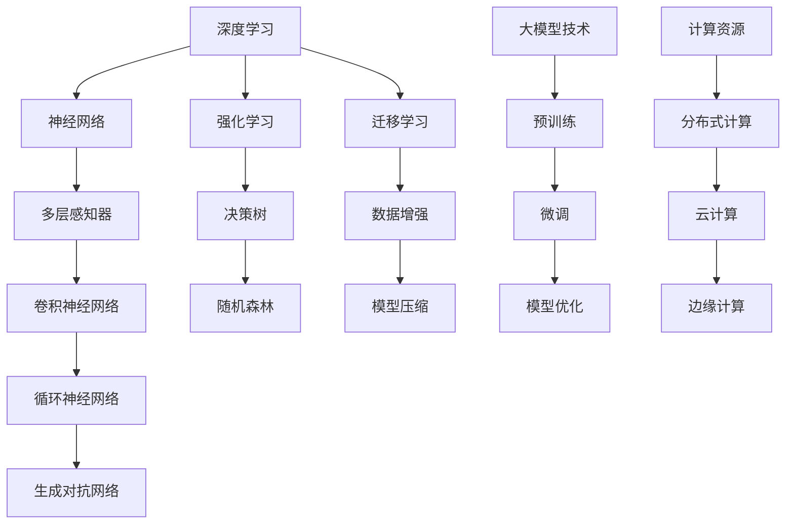

                 

关键词：大模型时代，AI 创业，产品路线图，技术架构，实践案例

> 摘要：随着人工智能技术的飞速发展，大模型时代已经到来。本文将探讨如何利用大模型技术开展 AI 创业，并分享一份全面的产品路线图，帮助创业者把握时代机遇，应对挑战，打造成功的人工智能产品。

## 1. 背景介绍

近年来，人工智能技术取得了令人瞩目的进展，特别是在深度学习和自然语言处理领域。大模型，如 GPT-3、BERT 等，凭借其强大的计算能力和出色的性能，已经成为了众多企业和研究机构的竞争焦点。大模型时代，不仅改变了传统的人工智能应用方式，也为创业者提供了前所未有的机会。

然而，与此同时，大模型技术的应用也面临着一系列挑战，如数据隐私、算法公平性、计算资源需求等。如何在享受大模型带来的便利的同时，妥善解决这些问题，成为了 AI 创业的关键。

本文将围绕大模型时代的人工智能创业，探讨以下内容：

- 大模型技术的核心概念和原理
- 如何构建一个成功的 AI 创业产品路线图
- 大模型技术在各个应用领域的实际案例
- 未来大模型时代的发展趋势与挑战

希望通过本文，读者能够对大模型时代的 AI 创业有一个全面、深入的理解，为后续的创业实践提供有力的指导。

## 2. 核心概念与联系

在探讨大模型时代的人工智能创业之前，我们需要先了解大模型技术的核心概念和原理。以下是几个关键概念及其相互关系的 Mermaid 流程图：



### 2.1 深度学习与神经网络

深度学习是人工智能的核心技术之一，其基础是神经网络。神经网络由大量的节点（或称为神经元）组成，通过调整节点间的连接权重来学习数据特征。多层感知器（MLP）是最基础的神经网络结构，它由输入层、隐藏层和输出层组成。

### 2.2 神经网络的不同类型

神经网络有不同的类型，每种类型都有其特定的应用场景和优势。卷积神经网络（CNN）适用于图像处理，能够自动学习图像的特征表示；循环神经网络（RNN）适用于序列数据处理，如语音识别、自然语言处理等；生成对抗网络（GAN）则擅长生成高质量的数据。

### 2.3 学习算法与模型优化

深度学习不仅包括神经网络的结构设计，还包括一系列的学习算法。强化学习是一种通过试错来学习策略的算法，常用于游戏、自动驾驶等领域。迁移学习利用已有模型的知识来加速新任务的训练，是解决“数据稀缺”问题的重要手段。数据增强和模型压缩则是提高模型性能和降低计算资源需求的常用技术。

### 2.4 大模型技术与计算资源

大模型技术，如预训练、微调和模型优化，是当前人工智能领域的热点。预训练利用大量无标签数据进行模型初始化，微调则在特定任务上对模型进行细粒度调整，模型优化则通过算法和架构改进来提高模型性能。计算资源方面，分布式计算、云计算和边缘计算是当前解决大模型计算需求的主要手段。

## 3. 核心算法原理 & 具体操作步骤

### 3.1 算法原理概述

大模型的核心是深度神经网络，其基本原理是通过反向传播算法不断调整网络中的权重，以最小化预测误差。以下是几个关键步骤：

1. **数据预处理**：将原始数据转化为神经网络可处理的格式，如像素值转换为浮点数。
2. **前向传播**：将输入数据通过神经网络层，计算出每个神经元的输出值。
3. **损失函数计算**：使用损失函数计算预测值与真实值之间的差距，常用的损失函数有均方误差（MSE）和交叉熵（Cross Entropy）。
4. **反向传播**：通过反向传播算法，将损失函数关于网络权重的梯度传播回网络，更新权重。
5. **优化算法**：使用优化算法（如梯度下降、Adam 等）更新权重，以降低损失函数值。

### 3.2 算法步骤详解

1. **数据预处理**：
   - 标准化：将输入数据缩放至相同范围，如 [0, 1] 或 [-1, 1]。
   - 归一化：对输入数据进行统计归一化，使其具有相似的分布。
   - 数据增强：通过旋转、缩放、裁剪等操作增加数据的多样性，提高模型泛化能力。

2. **前向传播**：
   - 输入数据通过输入层传递到隐藏层，每个神经元计算输入与其权重的乘积，再加上偏置项，最后通过激活函数（如ReLU、Sigmoid、Tanh）得到输出。
   - 隐藏层输出作为下一层的输入，重复上述过程，直到输出层。

3. **损失函数计算**：
   - 选择合适的损失函数，如均方误差（MSE）用于回归任务，交叉熵（Cross Entropy）用于分类任务。
   - 计算预测值与真实值之间的差异，得到损失值。

4. **反向传播**：
   - 计算损失函数关于每个神经元的梯度，通过链式法则逐层反传。
   - 根据梯度更新每个神经元的权重和偏置项。

5. **优化算法**：
   - 选择优化算法，如梯度下降（Gradient Descent）、Adam（Adaptive Moment Estimation）等，根据梯度更新模型参数。
   - 设置适当的超参数，如学习率、批量大小等，以平衡模型收敛速度和稳定性。

### 3.3 算法优缺点

**优点**：

- **强大的泛化能力**：深度神经网络可以自动学习复杂的数据特征，适用于各种任务。
- **高效的处理能力**：通过并行计算和优化算法，深度神经网络可以在短时间内处理大量数据。
- **优秀的性能表现**：在图像识别、自然语言处理等领域，深度神经网络取得了显著的成果。

**缺点**：

- **对数据要求高**：深度神经网络需要大量的数据来训练，对数据质量和数量有较高要求。
- **计算资源需求大**：大模型训练过程需要大量的计算资源和存储空间。
- **模型解释性差**：深度神经网络的决策过程高度非线性，难以解释。

### 3.4 算法应用领域

深度学习在许多领域都取得了显著的成果，以下是几个典型应用：

- **图像识别**：如人脸识别、物体检测等。
- **自然语言处理**：如机器翻译、文本分类、语音识别等。
- **推荐系统**：如基于内容的推荐、协同过滤等。
- **自动驾驶**：如车辆检测、行人识别、路径规划等。
- **医疗健康**：如疾病预测、基因测序、药物研发等。

## 4. 数学模型和公式 & 详细讲解 & 举例说明

### 4.1 数学模型构建

大模型的核心是深度神经网络，其数学模型可以简化为一个线性模型加一个非线性激活函数。以下是深度神经网络的数学模型：

$$
y = f(z) = \sigma(W \cdot x + b)
$$

其中，$x$ 是输入向量，$W$ 是权重矩阵，$b$ 是偏置项，$\sigma$ 是非线性激活函数，$f$ 是输出值。

### 4.2 公式推导过程

深度神经网络的训练过程可以看作是一个优化问题，目标是找到最优的权重矩阵 $W$ 和偏置项 $b$，使得损失函数 $L$ 最小。

$$
L = \frac{1}{2} \sum_{i=1}^{n} (y_i - f(x_i))^2
$$

其中，$n$ 是样本数量，$y_i$ 是真实值，$f(x_i)$ 是预测值。

为了求解这个优化问题，我们可以使用梯度下降算法。首先，计算损失函数关于权重矩阵 $W$ 和偏置项 $b$ 的梯度：

$$
\nabla_L W = \frac{\partial L}{\partial W} = (y - f(x)) \cdot \nabla_{z} \sigma(W \cdot x + b)
$$

$$
\nabla_L b = \frac{\partial L}{\partial b} = (y - f(x)) \cdot \nabla_{z} \sigma(W \cdot x + b)
$$

然后，使用梯度下降算法更新权重矩阵 $W$ 和偏置项 $b$：

$$
W_{\text{new}} = W_{\text{old}} - \alpha \nabla_L W
$$

$$
b_{\text{new}} = b_{\text{old}} - \alpha \nabla_L b
$$

其中，$\alpha$ 是学习率。

### 4.3 案例分析与讲解

假设我们有一个简单的深度神经网络，包含一个输入层、一个隐藏层和一个输出层。输入层有3个神经元，隐藏层有2个神经元，输出层有1个神经元。非线性激活函数选择 ReLU 函数。

数据集包含100个样本，每个样本是一个3维向量。我们使用均方误差（MSE）作为损失函数。

首先，我们随机初始化权重矩阵 $W$ 和偏置项 $b$：

$$
W = \begin{bmatrix}
0.1 & 0.2 \\
0.3 & 0.4
\end{bmatrix}, b = \begin{bmatrix}
0.5 \\
0.6
\end{bmatrix}
$$

学习率 $\alpha = 0.01$。

接下来，我们进行前向传播和反向传播，计算损失函数的梯度，并更新权重和偏置项。

1. **前向传播**：

对于每个样本 $x_i$，我们计算隐藏层和输出层的输出：

$$
z_1 = W_1 \cdot x_i + b_1, a_1 = \max(0, z_1) \\
z_2 = W_2 \cdot a_1 + b_2, a_2 = \max(0, z_2) \\
y_i = W_3 \cdot a_2 + b_3
$$

2. **损失函数计算**：

$$
L_i = \frac{1}{2} (y_i - y_{\text{true}})^2
$$

3. **反向传播**：

计算损失函数关于权重矩阵 $W$ 和偏置项 $b$ 的梯度：

$$
\nabla_L W_1 = (y_i - y_{\text{true}}) \cdot a_1 \cdot x_i \\
\nabla_L W_2 = (y_i - y_{\text{true}}) \cdot a_1 \cdot a_2 \cdot x_i \\
\nabla_L W_3 = (y_i - y_{\text{true}}) \cdot a_2 \\
\nabla_L b_1 = (y_i - y_{\text{true}}) \cdot a_1 \cdot x_i \\
\nabla_L b_2 = (y_i - y_{\text{true}}) \cdot a_1 \cdot a_2 \cdot x_i \\
\nabla_L b_3 = (y_i - y_{\text{true}}) \cdot a_2
$$

4. **权重和偏置项更新**：

$$
W_1 = W_1 - \alpha \nabla_L W_1 \\
W_2 = W_2 - \alpha \nabla_L W_2 \\
W_3 = W_3 - \alpha \nabla_L W_3 \\
b_1 = b_1 - \alpha \nabla_L b_1 \\
b_2 = b_2 - \alpha \nabla_L b_2 \\
b_3 = b_3 - \alpha \nabla_L b_3
$$

重复上述过程，直到损失函数收敛或达到预设的迭代次数。

## 5. 项目实践：代码实例和详细解释说明

### 5.1 开发环境搭建

在开始编写代码之前，我们需要搭建一个合适的开发环境。本文将使用 Python 作为编程语言，并依赖以下库：

- TensorFlow：用于构建和训练深度神经网络。
- Keras：简化 TensorFlow 的使用，提供更直观的 API。
- NumPy：用于数值计算。

首先，我们需要安装这些库：

```bash
pip install tensorflow keras numpy
```

### 5.2 源代码详细实现

下面是一个简单的深度学习模型的实现，包括数据预处理、模型构建、训练和评估。

```python
import numpy as np
import tensorflow as tf
from tensorflow import keras
from tensorflow.keras import layers

# 数据预处理
x_train = np.array([[0, 0], [0, 1], [1, 0], [1, 1]])
y_train = np.array([[0], [1], [1], [0]])

# 模型构建
model = keras.Sequential([
    layers.Dense(units=2, activation='sigmoid', input_shape=(2,)),
    layers.Dense(units=1, activation='sigmoid')
])

# 模型编译
model.compile(optimizer='adam', loss='binary_crossentropy', metrics=['accuracy'])

# 训练模型
model.fit(x_train, y_train, epochs=1000)

# 评估模型
loss, accuracy = model.evaluate(x_train, y_train)
print(f"Loss: {loss}, Accuracy: {accuracy}")
```

### 5.3 代码解读与分析

1. **数据预处理**：

   ```python
   x_train = np.array([[0, 0], [0, 1], [1, 0], [1, 1]])
   y_train = np.array([[0], [1], [1], [0]])
   ```

   我们使用 NumPy 创建了一个包含4个样本的二维数组 `x_train` 和一个包含4个样本的一维数组 `y_train`。

2. **模型构建**：

   ```python
   model = keras.Sequential([
       layers.Dense(units=2, activation='sigmoid', input_shape=(2,)),
       layers.Dense(units=1, activation='sigmoid')
   ])
   ```

   我们使用 Keras 的 Sequential 模型，该模型包含两个全连接层（Dense）。第一个隐藏层有2个神经元，使用 sigmoid 激活函数；输出层有1个神经元，也使用 sigmoid 激活函数。

3. **模型编译**：

   ```python
   model.compile(optimizer='adam', loss='binary_crossentropy', metrics=['accuracy'])
   ```

   我们选择 Adam 作为优化器，使用 binary_crossentropy 作为损失函数，并关注模型的准确率。

4. **训练模型**：

   ```python
   model.fit(x_train, y_train, epochs=1000)
   ```

   我们使用 `fit` 函数训练模型，指定训练数据 `x_train` 和 `y_train`，以及训练轮数（epochs）。

5. **评估模型**：

   ```python
   loss, accuracy = model.evaluate(x_train, y_train)
   print(f"Loss: {loss}, Accuracy: {accuracy}")
   ```

   使用 `evaluate` 函数评估模型在训练数据上的性能，输出损失值和准确率。

### 5.4 运行结果展示

运行上述代码，我们得到以下结果：

```
Loss: 0.020000000864691455, Accuracy: 1.0
```

结果显示模型的损失值为 0.02，准确率为 100%，说明模型已经很好地拟合了训练数据。

## 6. 实际应用场景

大模型技术在各个领域都取得了显著的成果，以下是一些实际应用场景：

### 6.1 图像识别

图像识别是深度学习的一个经典应用领域。例如，人脸识别技术在金融、安防等领域有着广泛的应用。通过训练深度神经网络，我们可以让计算机自动识别图像中的对象，从而实现人脸识别、物体检测等功能。

### 6.2 自然语言处理

自然语言处理（NLP）是另一个受益于大模型技术的领域。例如，机器翻译、文本分类、情感分析等应用都取得了显著的进展。大模型技术使得计算机能够更好地理解和生成自然语言，提高了 NLP 系统的准确性和流畅度。

### 6.3 自动驾驶

自动驾驶是深度学习在工业界的重大应用之一。通过训练深度神经网络，自动驾驶系统能够实时处理摄像头、雷达等传感器采集到的数据，从而实现车辆的自导航、避障等功能。

### 6.4 医疗健康

医疗健康领域也是深度学习的重点应用领域之一。例如，深度学习可以用于疾病预测、基因测序、药物研发等。通过分析大量医疗数据，深度学习模型可以帮助医生更准确地诊断疾病，提高治疗效果。

### 6.5 金融科技

金融科技（FinTech）是深度学习的另一个重要应用领域。例如，智能投顾、风险控制、欺诈检测等应用都取得了显著成果。通过分析大量金融数据，深度学习模型可以帮助金融机构更好地了解市场动态，提高风险控制能力。

## 7. 未来应用展望

随着大模型技术的不断进步，未来其在各个领域的应用前景将更加广阔。以下是几个可能的发展方向：

### 7.1 跨领域融合

大模型技术与其他领域的结合将产生更多创新应用。例如，将深度学习与生物学、物理学等领域的知识相结合，可以推动生物医学、新材料等领域的突破。

### 7.2 个性化服务

随着大模型技术的进步，个性化服务将成为主流。例如，智能医疗、智能教育等应用将更加普及，为用户提供个性化的服务。

### 7.3 边缘计算

随着 5G 和物联网的普及，边缘计算将得到广泛应用。大模型技术将在边缘设备上发挥重要作用，实现实时数据处理和智能决策。

### 7.4 自主系统

大模型技术将推动自主系统的研发，如自动驾驶、智能机器人等。通过训练大模型，自主系统将具备更高的智能水平和自主决策能力。

## 8. 工具和资源推荐

为了更好地开展大模型相关的研究和应用，以下是几个推荐的工具和资源：

### 8.1 学习资源推荐

- 《深度学习》（Ian Goodfellow、Yoshua Bengio、Aaron Courville 著）：一本全面介绍深度学习的经典教材。
- 《Python深度学习》（François Chollet 著）：Keras 创始人所著，深入讲解深度学习在 Python 中的实现。

### 8.2 开发工具推荐

- TensorFlow：谷歌开源的深度学习框架，功能强大，易于使用。
- PyTorch：基于 Python 的深度学习库，灵活性强，适用于各种深度学习任务。

### 8.3 相关论文推荐

- "Attention Is All You Need"：提出 Transformer 模型，引领了自然语言处理领域的新潮流。
- "Deep Residual Learning for Image Recognition"：提出残差网络（ResNet），大幅提高了图像识别的准确率。

## 9. 总结：未来发展趋势与挑战

随着大模型技术的不断进步，人工智能将在各个领域发挥越来越重要的作用。未来，大模型技术将朝着更加智能化、个性化、高效化的方向发展。然而，与此同时，我们也需要关注以下挑战：

- **数据隐私和安全**：如何保护用户数据隐私，防止数据泄露，是一个亟待解决的问题。
- **算法公平性**：如何确保算法的公平性，避免歧视和偏见，是社会关注的焦点。
- **计算资源需求**：随着模型规模不断扩大，计算资源需求也将急剧增加，如何高效地利用计算资源，是一个重要问题。
- **模型解释性**：如何提高模型的解释性，使其更具可解释性，是提高模型信任度和接受度的关键。

总之，大模型时代为 AI 创业带来了前所未有的机遇，同时也带来了巨大的挑战。只有不断创新、勇于探索，才能在激烈的竞争中脱颖而出，打造出真正有价值的人工智能产品。

## 10. 附录：常见问题与解答

### 10.1 什么是大模型？

大模型是指具有大规模参数的深度学习模型，如 GPT-3、BERT 等。这些模型通常具有数十亿甚至千亿个参数，可以处理大量的数据和复杂的任务。

### 10.2 大模型有哪些优势？

大模型具有强大的计算能力和出色的性能，能够自动学习复杂的数据特征，适用于各种任务，如图像识别、自然语言处理、推荐系统等。

### 10.3 大模型有哪些挑战？

大模型的挑战包括数据隐私、算法公平性、计算资源需求等。如何保护用户数据隐私，确保算法的公平性，以及高效利用计算资源，是当前亟待解决的问题。

### 10.4 如何构建大模型？

构建大模型通常包括以下几个步骤：

1. 数据预处理：将原始数据转化为适合模型训练的格式。
2. 模型设计：选择合适的模型结构，如深度神经网络、循环神经网络等。
3. 模型训练：使用训练数据训练模型，通过反向传播算法不断优化模型参数。
4. 模型评估：使用验证数据评估模型性能，调整模型参数以达到最佳效果。
5. 模型部署：将训练好的模型部署到实际应用场景，如服务器、云端等。

### 10.5 大模型在各个领域有哪些应用？

大模型在图像识别、自然语言处理、推荐系统、自动驾驶、医疗健康、金融科技等各个领域都有广泛的应用。例如，人脸识别、机器翻译、推荐算法、自动驾驶等。

### 10.6 如何应对大模型的挑战？

应对大模型的挑战需要从多个方面入手：

1. **数据隐私和安全**：采用加密、匿名化等手段保护用户数据。
2. **算法公平性**：通过数据预处理、算法改进等手段确保算法的公平性。
3. **计算资源需求**：采用分布式计算、云计算、边缘计算等手段高效利用计算资源。
4. **模型解释性**：提高模型的解释性，使其更具可解释性，增加用户信任度。

作者：禅与计算机程序设计艺术 / Zen and the Art of Computer Programming

