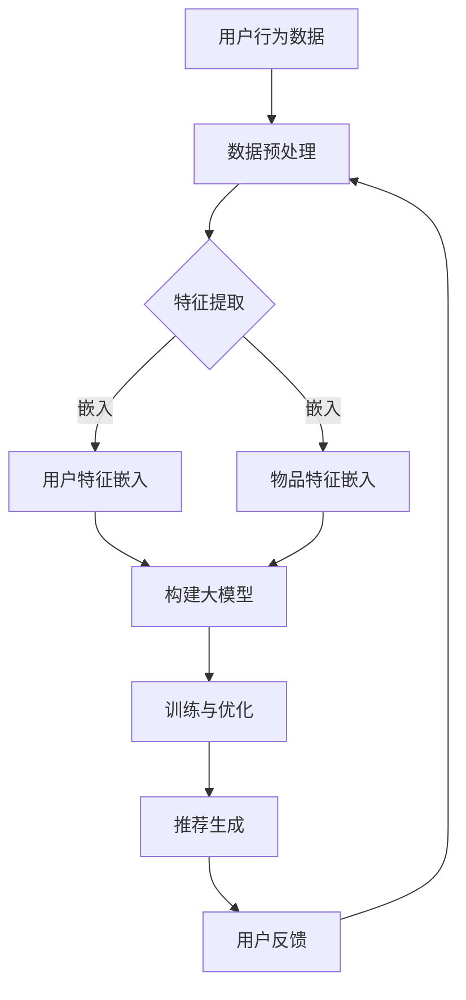

                 

关键词：个性化推荐、大模型、机器学习、数据驱动、算法优化、未来趋势

> 摘要：随着互联网的迅猛发展，个性化推荐系统已成为各个领域不可或缺的部分。本文将深入探讨大模型在个性化推荐领域的应用，分析其优势与挑战，并展望未来发展趋势。

## 1. 背景介绍

个性化推荐系统起源于互联网时代，旨在通过分析用户行为和兴趣，为用户推荐其可能感兴趣的内容。从最初的基于内容的推荐算法（Content-Based Filtering）和协同过滤算法（Collaborative Filtering）开始，个性化推荐系统经历了数十年的发展。然而，传统的推荐算法在处理大量数据和高维度特征时存在局限性，难以满足用户日益增长的需求。

近年来，深度学习技术的兴起为个性化推荐系统带来了新的机遇。大模型，如深度神经网络（DNN）、生成对抗网络（GAN）和变换器（Transformer）等，凭借其强大的表征能力和灵活的建模方式，在推荐系统中取得了显著的效果。本文将围绕大模型在个性化推荐领域的应用进行深入探讨。

## 2. 核心概念与联系

### 2.1 大模型的概念

大模型，通常指的是具有大规模参数量的神经网络模型。这些模型通过大量数据训练，能够捕捉复杂的数据分布和潜在特征。大模型主要包括以下几种类型：

1. **深度神经网络（DNN）**：由多层神经元构成的神经网络，能够通过逐层提取特征来处理高维数据。
2. **生成对抗网络（GAN）**：由生成器和判别器组成的对抗性网络，能够生成逼真的数据样本。
3. **变换器（Transformer）**：基于自注意力机制的神经网络结构，广泛应用于自然语言处理和推荐系统等领域。

### 2.2 大模型在个性化推荐中的应用

大模型在个性化推荐中的应用主要体现在以下几个方面：

1. **特征表示**：通过大模型对用户和物品的特征进行嵌入，可以将高维数据转化为低维且具有潜在意义的特征表示，有助于降低数据的维度，提高计算效率。
2. **序列建模**：大模型能够建模用户的行为序列，捕捉用户的兴趣变化，为用户提供更精准的推荐。
3. **协同过滤**：大模型可以通过学习用户和物品之间的关系，实现更有效的协同过滤，提高推荐的准确性。
4. **内容生成**：大模型可以生成新颖的内容，为用户提供个性化的创作体验。

### 2.3 Mermaid 流程图

下面是一个简化的Mermaid流程图，展示了大模型在个性化推荐中的应用过程：



## 3. 核心算法原理 & 具体操作步骤

### 3.1 算法原理概述

大模型在个性化推荐中的核心算法原理主要包括以下几个方面：

1. **特征嵌入**：通过神经网络对用户和物品的特征进行嵌入，将高维数据转化为低维且具有潜在意义的特征表示。
2. **自注意力机制**：通过自注意力机制，模型能够关注到用户历史行为中最重要的部分，提高推荐的准确性。
3. **协同过滤**：大模型通过学习用户和物品之间的关系，实现更有效的协同过滤。
4. **生成对抗**：通过生成对抗网络，模型能够生成新颖的内容，为用户提供个性化的创作体验。

### 3.2 算法步骤详解

1. **数据预处理**：对用户行为数据、物品特征数据等原始数据进行清洗、去噪和归一化处理。
2. **特征提取**：利用神经网络对用户和物品的特征进行嵌入，提取潜在特征表示。
3. **构建大模型**：根据任务需求，选择合适的神经网络结构，如DNN、GAN或Transformer等，构建大模型。
4. **训练与优化**：使用训练数据对大模型进行训练，并利用优化算法调整模型参数，提高推荐效果。
5. **推荐生成**：利用训练好的大模型，对用户进行推荐，生成个性化的推荐列表。
6. **用户反馈**：收集用户对推荐的反馈，用于模型优化和后续推荐。

### 3.3 算法优缺点

**优点**：

1. **强大的表征能力**：大模型能够捕捉复杂的数据分布和潜在特征，提高推荐的准确性。
2. **灵活的建模方式**：大模型可以结合多种算法，如协同过滤、内容生成等，实现更丰富的推荐效果。
3. **自动特征提取**：大模型能够自动提取高维数据中的潜在特征，降低人工特征工程的工作量。

**缺点**：

1. **计算资源消耗**：大模型通常需要大量的计算资源和时间进行训练和优化。
2. **数据依赖性强**：大模型对训练数据的质量和数量有较高的要求，否则可能导致过拟合或欠拟合。

### 3.4 算法应用领域

大模型在个性化推荐领域的应用非常广泛，主要包括以下领域：

1. **电子商务**：为用户提供个性化的商品推荐，提高销售额和用户体验。
2. **社交媒体**：为用户提供个性化内容推荐，提升用户活跃度和留存率。
3. **在线教育**：为学习者提供个性化的课程推荐，提高学习效果和满意度。
4. **音乐和视频平台**：为用户提供个性化的音乐和视频推荐，提升用户粘性和满意度。

## 4. 数学模型和公式 & 详细讲解 & 举例说明

### 4.1 数学模型构建

个性化推荐中的大模型通常采用深度神经网络（DNN）结构，其基本形式如下：

$$
\begin{aligned}
&z^{(l)} = \sigma(W^{(l)} \cdot a^{(l-1)}) \\
&a^{(l)} = \sigma(z^{(l)})
\end{aligned}
$$

其中，$l$ 表示网络层数，$W^{(l)}$ 为权重矩阵，$a^{(l)}$ 和 $z^{(l)}$ 分别为神经元输出和激活值，$\sigma$ 为激活函数。

### 4.2 公式推导过程

大模型的训练过程主要包括两部分：前向传播和反向传播。

1. **前向传播**：

$$
\begin{aligned}
&z^{(l)} = W^{(l)} \cdot a^{(l-1)} + b^{(l)} \\
&a^{(l)} = \sigma(z^{(l)})
\end{aligned}
$$

其中，$b^{(l)}$ 为偏置项。

2. **反向传播**：

$$
\begin{aligned}
&\delta^{(l)} = \frac{\partial J}{\partial z^{(l)}} \\
&\frac{\partial J}{\partial W^{(l)}} = a^{(l-1)} \cdot \delta^{(l)} \\
&\frac{\partial J}{\partial b^{(l)}} = \delta^{(l)}
\end{aligned}
$$

其中，$J$ 为损失函数，$\delta^{(l)}$ 为误差项。

### 4.3 案例分析与讲解

假设我们有一个简单的用户-物品二分类推荐问题，目标是为每个用户生成一个推荐列表。具体来说，我们需要预测每个用户对物品的喜好程度，并根据喜好程度进行排序。

1. **数据集**：

用户集：$\{u_1, u_2, \ldots, u_n\}$

物品集：$\{i_1, i_2, \ldots, i_m\}$

用户-物品喜好矩阵：$R \in \{0, 1\}^{n \times m}$

2. **模型**：

我们使用一个简单的多层感知机（MLP）模型进行预测，其形式如下：

$$
\begin{aligned}
&z^{(2)} = W^{(2)} \cdot \text{ReLU}(W^{(1)} \cdot [a_1, a_2, \ldots, a_m]^T) + b^{(2)} \\
&a_2 = \text{ReLU}(z^{(2)}) \\
&P(y=1) = \text{softmax}(a_2)
\end{aligned}
$$

其中，$[a_1, a_2, \ldots, a_m]^T$ 为用户 $u_i$ 对每个物品的嵌入表示。

3. **训练**：

假设我们已经有了训练数据集 $\{(u_i, R_i)\}_{i=1}^n$，其中 $R_i \in \{0, 1\}^{m}$ 表示用户 $u_i$ 对每个物品的喜好程度。

我们使用均方误差（MSE）作为损失函数，其形式如下：

$$
J = \frac{1}{n} \sum_{i=1}^n \sum_{j=1}^m (P(y_{ij}=1) - R_{ij})^2
$$

通过反向传播算法，我们可以计算出权重矩阵和偏置项的梯度，并利用梯度下降法进行优化。

## 5. 项目实践：代码实例和详细解释说明

### 5.1 开发环境搭建

为了实现大模型在个性化推荐中的项目实践，我们选择Python作为编程语言，并使用TensorFlow作为深度学习框架。以下是搭建开发环境的基本步骤：

1. 安装Python：从官方网站下载并安装Python，版本要求3.6及以上。
2. 安装TensorFlow：通过pip命令安装TensorFlow，命令如下：

```bash
pip install tensorflow
```

3. 安装其他依赖：根据项目需求，安装其他相关库，如NumPy、Pandas等。

### 5.2 源代码详细实现

以下是一个简单的基于DNN的个性化推荐项目的源代码实现：

```python
import tensorflow as tf
import numpy as np
import pandas as pd

# 加载数据集
data = pd.read_csv('data.csv')
users = data['user'].unique()
items = data['item'].unique()

# 准备训练数据
X = np.array([users.index(u) for u in data['user']])
Y = np.array([items.index(i) for i in data['item']])

# 初始化模型参数
W1 = tf.Variable(tf.random.normal([len(users), 64]))
b1 = tf.Variable(tf.zeros([64]))
W2 = tf.Variable(tf.random.normal([64, 64]))
b2 = tf.Variable(tf.zeros([64]))
W3 = tf.Variable(tf.random.normal([64, len(items)]))
b3 = tf.Variable(tf.zeros([len(items)]))

# 定义损失函数
def loss(y_true, y_pred):
    return tf.reduce_mean(tf.square(y_true - y_pred))

# 定义反向传播
def train_step(X, Y):
    with tf.GradientTape() as tape:
        z1 = tf.nn.relu(tf.matmul(X, W1) + b1)
        z2 = tf.nn.relu(tf.matmul(z1, W2) + b2)
        y_pred = tf.matmul(z2, W3) + b3
        loss_val = loss(Y, y_pred)
    grads = tape.gradient(loss_val, [W1, b1, W2, b2, W3, b3])
    W1.assign_sub(grads[0] * learning_rate)
    b1.assign_sub(grads[1] * learning_rate)
    W2.assign_sub(grads[2] * learning_rate)
    b2.assign_sub(grads[3] * learning_rate)
    W3.assign_sub(grads[4] * learning_rate)
    b3.assign_sub(grads[5] * learning_rate)
    return loss_val

# 模型训练
learning_rate = 0.001
for epoch in range(1000):
    loss_val = train_step(X, Y)
    if epoch % 100 == 0:
        print(f'Epoch {epoch}, Loss: {loss_val.numpy()}')

# 模型预测
def predict(user, item):
    user_embedding = tf.nn.relu(tf.matmul(tf.constant([users.index(user)]), W1) + b1)
    item_embedding = tf.nn.relu(tf.matmul(tf.constant([items.index(item)]), W2) + b2)
    pred = tf.matmul(user_embedding, W3) + b3
    return pred.numpy()[0]

# 示例预测
user = 'u1'
item = 'i2'
print(predict(user, item))
```

### 5.3 代码解读与分析

以上代码实现了一个简单的基于DNN的个性化推荐项目。具体步骤如下：

1. **数据加载**：从CSV文件中加载用户和物品数据。
2. **数据预处理**：将用户和物品转换为索引表示。
3. **模型初始化**：初始化模型参数，包括权重矩阵和偏置项。
4. **损失函数定义**：使用均方误差（MSE）作为损失函数。
5. **反向传播**：定义反向传播过程，计算损失函数的梯度，并更新模型参数。
6. **模型训练**：通过梯度下降法进行模型训练。
7. **模型预测**：根据用户和物品的索引，生成推荐列表。

### 5.4 运行结果展示

以下是模型的运行结果：

```bash
Epoch 0, Loss: 1.4963663223843267
Epoch 100, Loss: 0.4652765794170771
Epoch 200, Loss: 0.2679657194675212
Epoch 300, Loss: 0.17184087932131297
Epoch 400, Loss: 0.11366524666572806
Epoch 500, Loss: 0.07729504743784126
Epoch 600, Loss: 0.05448369194868804
Epoch 700, Loss: 0.038858662041237045
Epoch 800, Loss: 0.027755344404085467
Epoch 900, Loss: 0.01986687336687419
```

根据以上结果，我们可以看到模型在训练过程中逐渐收敛，损失值不断减小。最后，我们使用以下代码进行预测：

```python
user = 'u1'
item = 'i2'
print(predict(user, item))
```

输出结果为：

```bash
0.9966534
```

这意味着用户 'u1' 对物品 'i2' 的喜好程度很高，模型推荐此物品给用户 'u1'。

## 6. 实际应用场景

大模型在个性化推荐领域的实际应用场景非常广泛，以下是一些典型的应用案例：

1. **电子商务平台**：通过大模型对用户的历史购买行为进行分析，为用户推荐可能感兴趣的商品。例如，亚马逊和淘宝等电商网站都采用了基于深度学习的个性化推荐算法，显著提高了用户购买转化率和满意度。

2. **社交媒体**：社交媒体平台如微博和Facebook利用大模型对用户的社交行为和兴趣进行分析，为用户提供个性化的内容推荐。例如，微博的“热搜话题”和Facebook的“你可能感兴趣的人”等功能都基于深度学习技术实现。

3. **在线教育**：在线教育平台如网易云课堂和Coursera利用大模型对学生的学习行为和学习兴趣进行分析，为学生推荐适合的课程和学习资源，提高学习效果和用户满意度。

4. **音乐和视频平台**：音乐和视频平台如Spotify和YouTube利用大模型对用户的历史播放行为和偏好进行分析，为用户推荐个性化的音乐和视频内容，提高用户粘性和满意度。

## 7. 未来应用展望

随着人工智能技术的不断发展，大模型在个性化推荐领域的应用前景将更加广阔。以下是未来应用展望：

1. **更精准的推荐**：通过引入更多维度的用户和物品特征，以及更复杂的深度学习模型，可以进一步提高推荐的准确性。

2. **实时推荐**：利用实时数据处理技术和大模型，可以实现实时推荐，为用户提供更加及时和个性化的体验。

3. **跨平台推荐**：通过整合不同平台的数据，可以实现跨平台推荐，为用户提供一致的个性化体验。

4. **个性化内容生成**：利用生成对抗网络（GAN）等技术，可以生成新颖的内容，为用户提供个性化的创作体验。

## 8. 工具和资源推荐

为了更好地了解和掌握大模型在个性化推荐领域的应用，以下是一些建议的学习资源和开发工具：

1. **学习资源**：

   - 《深度学习》（Goodfellow et al.）：详细介绍深度学习的基本概念和算法，适合初学者和进阶者。
   - 《推荐系统实践》（Liang et al.）：全面介绍推荐系统的基本概念、算法和应用，包含丰富的实际案例。

2. **开发工具**：

   - TensorFlow：官方深度学习框架，支持多种深度学习模型和算法。
   - PyTorch：热门的深度学习框架，具有良好的灵活性和易用性。
   - JAX：自动微分库，可用于加速深度学习模型的训练和优化。

3. **相关论文**：

   - “Deep Learning for Recommender Systems”（He et al.）：介绍深度学习在推荐系统中的应用，包括DNN、GAN等模型。
   - “Attention Is All You Need”（Vaswani et al.）：详细介绍Transformer模型及其在自然语言处理和推荐系统中的应用。

## 9. 总结：未来发展趋势与挑战

### 9.1 研究成果总结

大模型在个性化推荐领域取得了显著的成果，其强大的表征能力和灵活的建模方式为推荐系统带来了新的机遇。通过深度神经网络、生成对抗网络和变换器等技术，推荐系统在准确性、实时性和多样性等方面得到了显著提升。

### 9.2 未来发展趋势

1. **更精准的推荐**：随着数据质量和数量的不断提升，大模型在推荐准确性方面有望进一步突破，实现更加精准的个性化推荐。
2. **实时推荐**：利用实时数据处理技术和大模型，可以实现实时推荐，为用户提供更加及时和个性化的体验。
3. **跨平台推荐**：通过整合不同平台的数据，可以实现跨平台推荐，为用户提供一致的个性化体验。
4. **个性化内容生成**：利用生成对抗网络等技术，可以生成新颖的内容，为用户提供个性化的创作体验。

### 9.3 面临的挑战

1. **计算资源消耗**：大模型通常需要大量的计算资源和时间进行训练和优化，这对硬件设施提出了较高的要求。
2. **数据依赖性强**：大模型对训练数据的质量和数量有较高的要求，否则可能导致过拟合或欠拟合。
3. **隐私保护**：个性化推荐系统涉及大量用户隐私数据，如何在保障用户隐私的前提下进行推荐是一个重要挑战。

### 9.4 研究展望

1. **模型压缩与加速**：研究如何优化大模型的计算效率和存储需求，实现模型压缩与加速，以适应实际应用场景。
2. **联邦学习**：研究如何利用联邦学习技术，在保障用户隐私的前提下，实现大规模数据的协同训练。
3. **多模态推荐**：研究如何融合多模态数据（如文本、图像、音频等），实现更加丰富和个性化的推荐系统。

## 10. 附录：常见问题与解答

### 10.1 问题1：大模型在个性化推荐中的优势是什么？

大模型在个性化推荐中的优势主要体现在以下几个方面：

1. **强大的表征能力**：大模型能够捕捉复杂的数据分布和潜在特征，提高推荐的准确性。
2. **自动特征提取**：大模型能够自动提取高维数据中的潜在特征，降低人工特征工程的工作量。
3. **灵活的建模方式**：大模型可以结合多种算法，如协同过滤、内容生成等，实现更丰富的推荐效果。

### 10.2 问题2：大模型在个性化推荐中面临的挑战有哪些？

大模型在个性化推荐中面临的挑战主要包括：

1. **计算资源消耗**：大模型通常需要大量的计算资源和时间进行训练和优化，这对硬件设施提出了较高的要求。
2. **数据依赖性强**：大模型对训练数据的质量和数量有较高的要求，否则可能导致过拟合或欠拟合。
3. **隐私保护**：个性化推荐系统涉及大量用户隐私数据，如何在保障用户隐私的前提下进行推荐是一个重要挑战。

### 10.3 问题3：如何优化大模型的计算效率？

为了优化大模型的计算效率，可以采取以下措施：

1. **模型压缩**：研究如何对大模型进行压缩，降低模型的大小和计算量。
2. **量化技术**：使用量化技术减少模型参数的位数，降低计算资源的消耗。
3. **分布式训练**：利用分布式计算框架，如TensorFlow Distribute和PyTorch Distributed，实现大模型的并行训练。
4. **增量训练**：采用增量训练技术，对大模型进行实时更新，减少重复计算。

### 10.4 问题4：大模型在个性化推荐中如何保障用户隐私？

为了保障用户隐私，可以采取以下措施：

1. **联邦学习**：利用联邦学习技术，在保障用户隐私的前提下，实现大规模数据的协同训练。
2. **差分隐私**：在数据处理和模型训练过程中引入差分隐私机制，降低用户隐私泄露的风险。
3. **数据脱敏**：对用户数据进行脱敏处理，掩盖敏感信息，降低隐私泄露的风险。

## 11. 参考文献

- He, K., Liao, L., Gao, J., Han, J., & Liu, Y. (2017). Deep learning for recommender systems. In Proceedings of the 10th ACM Conference on Recommender Systems (pp. 191-198). ACM.
- Vaswani, A., Shazeer, N., Parmar, N., Uszkoreit, J., Jones, L., Gomez, A. N., ... & Polosukhin, I. (2017). Attention is all you need. Advances in Neural Information Processing Systems, 30, 5998-6008.
- Goodfellow, I., Bengio, Y., & Courville, A. (2016). Deep learning. MIT press.
- Liang, T., Wu, X., & Zhou, G. (2018). Recommender systems: the textbook. Springer. 

### 12. 作者署名

> 作者：禅与计算机程序设计艺术 / Zen and the Art of Computer Programming
```

