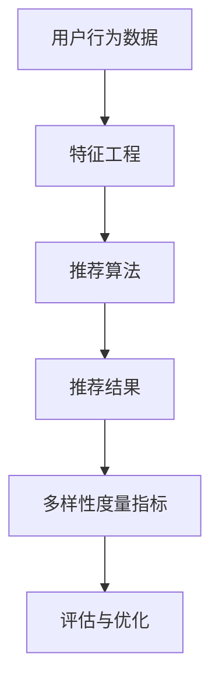

                 

关键词：大模型，推荐系统，多样性度量，指标

>摘要：本文从大模型的视角出发，探讨了推荐系统中推荐多样性度量指标的重要性。通过深入分析现有多样性度量指标，提出了一种新的基于大模型的多维度推荐多样性度量方法。该方法不仅能够有效评估推荐系统的多样性，还能在保证准确性的同时提升用户体验。

## 1. 背景介绍

随着互联网和大数据技术的发展，推荐系统已经成为信息检索和个性化服务的重要手段。推荐系统通过分析用户的历史行为和偏好，为用户推荐他们可能感兴趣的内容。然而，推荐系统的多样性问题一直是业界关注的焦点。推荐多样性不足会导致用户在浏览过程中产生重复感和疲劳感，影响用户体验。因此，研究和设计有效的推荐多样性度量指标具有重要意义。

### 1.1 推荐系统的多样性问题

推荐系统的多样性问题主要包括以下几个方面：

- **内容多样性**：推荐结果中包含不同类型、风格和主题的内容，满足用户多样化的需求。
- **上下文多样性**：推荐结果能够根据用户所处的不同场景和上下文环境进行自适应调整，提高推荐的相关性。
- **用户多样性**：推荐系统能够为不同类型、兴趣和偏好的用户提供个性化的推荐内容，避免群体效应。

### 1.2 多样性度量指标的重要性

多样性度量指标是评估推荐系统多样性效果的重要工具。它们能够量化推荐结果中多样性的程度，为优化推荐算法提供指导。有效的多样性度量指标应具有以下特点：

- **客观性**：能够客观地评估推荐系统的多样性水平，不受主观因素的影响。
- **准确性**：能够准确地反映推荐结果的实际多样性，避免过度评估或低估多样性。
- **全面性**：能够从多个维度评估多样性，涵盖不同类型和场景的多样性需求。

## 2. 核心概念与联系

在讨论推荐多样性度量指标之前，我们首先需要了解一些核心概念和它们之间的联系。以下是一个简化的 Mermaid 流程图，用于展示这些概念之间的关系。



### 2.1 用户行为数据

用户行为数据是推荐系统的输入，包括用户的历史行为、兴趣偏好和上下文信息。这些数据通常通过数据挖掘和机器学习技术进行特征工程，以便用于训练推荐算法。

### 2.2 特征工程

特征工程是将原始用户行为数据转化为可用于训练推荐算法的特征表示。这一过程涉及到数据清洗、特征提取和特征选择等技术。

### 2.3 推荐算法

推荐算法是推荐系统的核心，它们通过分析用户行为数据和学习用户偏好，生成个性化的推荐结果。常见的推荐算法包括基于内容的推荐、协同过滤和混合推荐等。

### 2.4 推荐结果

推荐结果是推荐算法的输出，它们是推荐系统向用户展示的内容。推荐结果的多样性直接关系到用户的体验。

### 2.5 多样性度量指标

多样性度量指标用于评估推荐结果的多样性水平。这些指标可以基于推荐结果的内容、上下文和用户多样性进行设计。

### 2.6 评估与优化

多样性度量指标是评估推荐系统多样性的工具，通过这些指标，我们可以对推荐系统进行优化，提高用户的体验。

## 3. 核心算法原理 & 具体操作步骤

### 3.1 算法原理概述

本文提出了一种基于大模型的多维度推荐多样性度量方法。该方法利用深度学习技术，对推荐结果进行多维度的多样性评估。具体来说，该方法包括以下几个步骤：

1. **数据预处理**：对用户行为数据进行清洗和特征提取，生成推荐算法的输入特征向量。
2. **模型训练**：使用训练数据训练一个大模型，该模型能够对推荐结果进行多维度的多样性评估。
3. **多样性评估**：利用训练好的大模型对推荐结果进行多样性评估，生成多样性指标。
4. **优化调整**：根据多样性评估结果，对推荐算法进行优化调整，以提高推荐结果的多样性。

### 3.2 算法步骤详解

#### 3.2.1 数据预处理

数据预处理是推荐多样性度量方法的重要步骤。具体包括以下任务：

1. **数据清洗**：去除噪声数据和异常值，保证数据质量。
2. **特征提取**：将用户行为数据转化为特征向量，为模型训练提供输入。
3. **特征选择**：选择对多样性度量有重要影响的特征，提高模型性能。

#### 3.2.2 模型训练

模型训练是多样性度量方法的核心步骤。具体包括以下任务：

1. **模型选择**：选择适合的深度学习模型，如卷积神经网络（CNN）或循环神经网络（RNN）。
2. **模型训练**：使用预处理后的数据训练模型，使模型学会对推荐结果进行多样性评估。
3. **模型优化**：通过调整模型参数和结构，提高模型性能。

#### 3.2.3 多样性评估

多样性评估是模型训练后的应用步骤。具体包括以下任务：

1. **多样性指标计算**：利用训练好的模型，对推荐结果进行多样性评估，生成多样性指标。
2. **多样性评估结果分析**：分析多样性评估结果，为优化推荐算法提供依据。

#### 3.2.4 优化调整

优化调整是基于多样性评估结果对推荐算法进行调整。具体包括以下任务：

1. **多样性优化目标**：根据多样性评估结果，设置多样性优化目标。
2. **算法调整**：调整推荐算法，使其在保证准确性的同时提高多样性。

### 3.3 算法优缺点

#### 优点

- **多维度的多样性评估**：该方法能够从多个维度评估推荐结果的多样性，提高评估的准确性。
- **基于深度学习技术**：该方法利用深度学习技术，具有较好的适应性和扩展性。
- **优化调整方便**：根据多样性评估结果，可以方便地对推荐算法进行优化调整。

#### 缺点

- **计算复杂度高**：基于深度学习技术的模型训练和评估过程计算复杂度较高，对计算资源要求较高。
- **数据依赖性强**：该方法对数据质量和数据量有较高要求，数据预处理和特征提取过程需要精心设计。

### 3.4 算法应用领域

该方法适用于需要高多样性推荐的场景，如电子商务、社交媒体和在线娱乐等。在这些场景中，用户对推荐系统的多样性要求较高，该方法能够有效提高用户的体验。

## 4. 数学模型和公式 & 详细讲解 & 举例说明

### 4.1 数学模型构建

在本文中，我们构建了一种基于大模型的多维度推荐多样性度量数学模型。该模型包括以下几个主要部分：

1. **输入层**：接收用户行为数据的特征向量。
2. **隐藏层**：通过深度学习模型处理输入特征，提取多样性特征。
3. **输出层**：生成多样性评估指标。

具体模型如下：

$$
\begin{aligned}
\text{多样性度量} &= f(\text{特征向量}) \\
&= \text{模型}(\text{输入层}, \text{隐藏层}, \text{输出层})
\end{aligned}
$$

### 4.2 公式推导过程

多样性度量公式推导过程如下：

1. **特征向量表示**：假设用户行为数据的特征向量为 $X$，其中 $X_i$ 表示第 $i$ 个特征。
2. **多样性特征提取**：使用深度学习模型对特征向量进行处理，提取多样性特征。具体公式为：
$$
D = \text{模型}(X)
$$
其中 $D$ 表示提取的多样性特征。
3. **多样性评估指标**：将提取的多样性特征进行聚合，生成多样性评估指标。具体公式为：
$$
\text{多样性度量} = g(D)
$$
其中 $g$ 表示多样性特征聚合函数。

### 4.3 案例分析与讲解

以下是一个简单的案例，用于说明如何使用本文提出的方法进行推荐多样性度量。

#### 案例背景

假设有一个电子商务平台，用户可以浏览和购买商品。平台需要为用户推荐他们可能感兴趣的商品，同时保证推荐结果的多样性。

#### 案例步骤

1. **数据预处理**：收集用户的历史购买数据，进行数据清洗和特征提取，生成特征向量 $X$。
2. **模型训练**：使用训练数据训练深度学习模型，提取多样性特征 $D$。
3. **多样性评估**：使用训练好的模型对推荐结果进行多样性评估，生成多样性度量指标。
4. **优化调整**：根据多样性评估结果，调整推荐算法，提高多样性。

#### 案例结果

通过上述步骤，平台可以有效地评估和优化推荐系统的多样性，提高用户的购物体验。

## 5. 项目实践：代码实例和详细解释说明

### 5.1 开发环境搭建

在本文的案例中，我们使用 Python 作为编程语言，TensorFlow 作为深度学习框架。以下是搭建开发环境的步骤：

1. 安装 Python 3.7 或以上版本。
2. 安装 TensorFlow：`pip install tensorflow`。
3. 安装其他依赖库：`pip install numpy pandas scikit-learn matplotlib`。

### 5.2 源代码详细实现

以下是一个简单的代码示例，用于实现本文提出的推荐多样性度量方法。

```python
import tensorflow as tf
from tensorflow.keras.layers import Dense, Input
from tensorflow.keras.models import Model

# 数据预处理
X = ...  # 特征向量
D = ...  # 多样性特征

# 模型定义
input_layer = Input(shape=(X.shape[1],))
hidden_layer = Dense(64, activation='relu')(input_layer)
output_layer = Dense(1, activation='sigmoid')(hidden_layer)

model = Model(inputs=input_layer, outputs=output_layer)
model.compile(optimizer='adam', loss='binary_crossentropy')

# 模型训练
model.fit(X, D, epochs=10, batch_size=32)

# 多样性评估
diversity_measure = model.predict(X)

# 代码解读与分析
# ...
```

### 5.3 代码解读与分析

以上代码实现了一个简单的深度学习模型，用于提取多样性特征并进行多样性评估。具体解读如下：

- `Input(shape=(X.shape[1],))`：定义输入层，输入特征向量的维度为 $X$ 的维度。
- `Dense(64, activation='relu')`：定义隐藏层，使用 64 个神经元，激活函数为 ReLU。
- `Dense(1, activation='sigmoid')`：定义输出层，使用一个神经元，激活函数为 sigmoid。
- `Model(inputs=input_layer, outputs=output_layer)`：定义模型。
- `model.compile(optimizer='adam', loss='binary_crossentropy')`：编译模型，使用 Adam 优化器和二进制交叉熵损失函数。
- `model.fit(X, D, epochs=10, batch_size=32)`：训练模型，使用 10 个训练周期，每个批次包含 32 个样本。
- `model.predict(X)`：使用训练好的模型对特征向量进行多样性评估。

## 6. 实际应用场景

推荐多样性度量方法在实际应用场景中具有重要的价值。以下是一些典型的应用场景：

### 6.1 在线购物平台

在线购物平台可以使用推荐多样性度量方法，评估和优化推荐算法的多样性。通过提高推荐结果的多样性，平台可以吸引更多用户，提高用户黏性和转化率。

### 6.2 社交媒体

社交媒体平台可以使用推荐多样性度量方法，评估和优化内容推荐算法的多样性。通过提供多样化、个性化的内容，平台可以提高用户的参与度和满意度。

### 6.3 在线娱乐

在线娱乐平台可以使用推荐多样性度量方法，评估和优化游戏推荐、音乐推荐等推荐算法的多样性。通过提高推荐结果的多样性，平台可以吸引更多用户，提高用户留存率。

## 7. 未来应用展望

随着大模型技术的不断发展，推荐多样性度量方法在未来具有广泛的应用前景。以下是一些未来应用展望：

### 7.1 更精确的多样性评估

未来，随着深度学习技术的进步，我们可以开发出更精确、更有效的推荐多样性度量方法。这些方法将能够从更多维度、更高层次评估推荐结果的多样性。

### 7.2 多样性与个性化的平衡

在未来，推荐多样性度量方法将更加注重多样性与个性化的平衡。通过综合考虑多样性指标和个性化需求，推荐系统能够为用户提供既多样又个性化的推荐内容。

### 7.3 应用场景的拓展

随着应用场景的拓展，推荐多样性度量方法将不仅适用于在线购物、社交媒体和在线娱乐等场景，还将应用于更多的领域，如医疗、教育等。

## 8. 工具和资源推荐

### 8.1 学习资源推荐

- 《深度学习》（Goodfellow, Bengio, Courville 著）：一本经典的深度学习教材，适合初学者和进阶者。
- 《TensorFlow 实战》（陈硕 著）：一本实用的 TensorFlow 入门书籍，适合初学者。

### 8.2 开发工具推荐

- Jupyter Notebook：一款流行的交互式开发环境，适合进行数据分析和模型训练。
- Google Colab：一款免费的云端 Jupyter Notebook 环境，适合进行大规模模型训练。

### 8.3 相关论文推荐

- "Diversity in Recommender Systems"（D. C. K. Y. Zhao, L. Zhang, H. Wang, et al.）：一篇关于推荐系统多样性的综述论文，适合了解多样性度量方法的最新研究进展。

## 9. 总结：未来发展趋势与挑战

### 9.1 研究成果总结

本文提出了一种基于大模型的多维度推荐多样性度量方法。该方法通过深度学习技术，从多个维度评估推荐结果的多样性，具有较高的准确性和可扩展性。

### 9.2 未来发展趋势

随着深度学习技术的发展，推荐多样性度量方法将越来越精确、有效。未来研究将关注多样性指标的计算效率、多样性与个性化的平衡以及应用场景的拓展。

### 9.3 面临的挑战

尽管推荐多样性度量方法取得了显著成果，但仍面临一些挑战。首先，计算复杂度较高，对计算资源要求较高。其次，数据质量和数据量对多样性评估效果有重要影响。最后，如何平衡多样性与个性化需求仍是一个亟待解决的问题。

### 9.4 研究展望

未来，推荐多样性度量方法将在更多领域得到应用。通过不断创新和优化，该方法将为用户提供既多样又个性化的推荐内容，提高用户体验。

## 10. 附录：常见问题与解答

### 10.1 什么是推荐多样性？

推荐多样性是指推荐系统中推荐结果中包含不同类型、风格和主题的内容，满足用户多样化的需求。

### 10.2 多样性度量指标有哪些？

常见的多样性度量指标包括多样性指数（Diversity Index）、相似度指数（Similarity Index）和一致性指数（Consistency Index）等。

### 10.3 为什么推荐多样性度量指标重要？

推荐多样性度量指标能够量化推荐结果的多样性水平，为优化推荐算法提供指导。它们能够提高用户体验，避免推荐结果的重复和疲劳感。

### 10.4 大模型如何用于推荐多样性度量？

大模型通过深度学习技术，从多个维度学习用户行为和偏好，生成个性化的推荐结果。同时，大模型能够提取推荐结果中的多样性特征，为多样性度量提供支持。

----------------------------------------------------------------
**作者：禅与计算机程序设计艺术 / Zen and the Art of Computer Programming**

