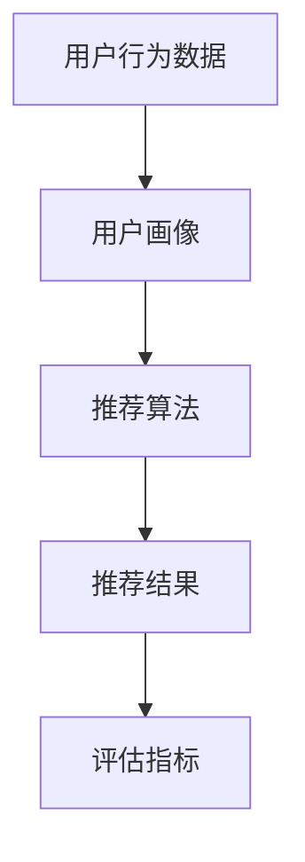

                 

关键词：推荐系统、大模型、人工智能、数据挖掘、算法优化、未来趋势

> 摘要：本文从大模型的视角出发，深入探讨了推荐系统的未来发展趋势和规划。首先，我们回顾了推荐系统的历史背景和发展现状，接着分析了大模型在推荐系统中的关键作用。随后，本文重点探讨了基于大模型的推荐算法原理及其具体操作步骤，同时介绍了推荐系统的数学模型和公式，并通过代码实例展示了实际应用。最后，我们对推荐系统的实际应用场景进行了分析，并对其未来应用展望进行了探讨。

## 1. 背景介绍

推荐系统是一种基于用户历史行为、兴趣和社交网络等信息，为用户推荐个性化内容、商品或服务的系统。它广泛应用于电子商务、社交媒体、视频网站等领域，已经成为现代互联网生态系统中不可或缺的一部分。

### 1.1 历史背景

推荐系统起源于20世纪90年代的电子商务领域。当时，随着互联网的普及，电子商务逐渐兴起，用户面临的海量商品和服务成为商家关注的焦点。为了帮助用户快速找到感兴趣的商品或服务，推荐系统应运而生。

### 1.2 发展现状

随着大数据、人工智能和深度学习等技术的发展，推荐系统在算法、模型和应用层面都取得了显著的进步。目前，推荐系统已经成为电子商务、社交媒体和视频网站等领域的核心技术之一。

## 2. 核心概念与联系

在深入探讨推荐系统之前，我们需要了解一些核心概念和联系，包括用户行为数据、用户画像、推荐算法和评估指标等。

### 2.1 用户行为数据

用户行为数据是推荐系统的基础，包括用户浏览、搜索、购买、评论等行为。通过对这些数据的分析，可以了解用户的兴趣和偏好。

### 2.2 用户画像

用户画像是对用户行为数据进行分析和建模，生成的一个用户特征集合。用户画像可以帮助推荐系统更好地了解用户需求，从而提高推荐质量。

### 2.3 推荐算法

推荐算法是推荐系统的核心，主要分为基于内容的推荐、协同过滤推荐和基于模型的推荐等。每种算法都有其优势和不足，实际应用中通常会结合多种算法。

### 2.4 评估指标

评估指标是衡量推荐系统性能的重要手段，常用的评估指标包括准确率、召回率、覆盖率、多样性等。

### 2.5 Mermaid 流程图

下面是一个简化的推荐系统架构 Mermaid 流程图，展示了各个核心概念之间的联系。



## 3. 核心算法原理 & 具体操作步骤

### 3.1 算法原理概述

基于大模型的推荐系统通常采用深度学习技术，通过对海量用户行为数据的学习和建模，生成用户画像和推荐结果。其核心原理可以概括为以下几个步骤：

1. 数据预处理：对用户行为数据进行清洗、去重和整合，生成高质量的用户行为数据集。
2. 特征提取：通过深度神经网络模型，从用户行为数据中提取高维特征向量。
3. 用户画像生成：利用提取的特征向量，构建用户画像模型，表示用户的兴趣和偏好。
4. 推荐生成：根据用户画像模型和商品特征向量，利用相似度计算方法，生成推荐列表。
5. 评估优化：通过评估指标对推荐结果进行评估和优化，提高推荐质量。

### 3.2 算法步骤详解

下面是一个基于大模型的推荐系统算法步骤的详细描述：

1. **数据预处理**：
   - 数据清洗：去除重复、缺失和异常的数据。
   - 数据整合：将不同来源的用户行为数据进行整合，生成统一的数据格式。
   - 数据编码：对用户行为数据进行编码，使其适合输入到深度学习模型中。

2. **特征提取**：
   - 利用深度学习模型（如卷积神经网络、循环神经网络等），对用户行为数据进行特征提取。
   - 通过多层神经网络，提取用户行为数据中的高维特征向量。

3. **用户画像生成**：
   - 利用提取的高维特征向量，构建用户画像模型。
   - 通过聚类、回归或分类等方法，将用户划分为不同的兴趣群体。

4. **推荐生成**：
   - 根据用户画像模型和商品特征向量，计算用户对商品的相似度。
   - 利用相似度计算结果，生成个性化的推荐列表。

5. **评估优化**：
   - 使用评估指标（如准确率、召回率、覆盖率等）对推荐结果进行评估。
   - 根据评估结果，对推荐算法进行优化和调整，提高推荐质量。

### 3.3 算法优缺点

**优点**：
- 高效性：基于深度学习的大模型可以处理海量用户行为数据，提高推荐系统的处理速度。
- 个性化：大模型可以更好地理解用户兴趣和偏好，生成个性化的推荐列表。
- 可扩展性：大模型可以轻松地扩展到不同的应用场景，如电子商务、社交媒体等。

**缺点**：
- 复杂性：大模型的结构复杂，训练和推理过程需要大量计算资源。
- 过拟合：大模型容易出现过拟合现象，导致推荐质量下降。

### 3.4 算法应用领域

基于大模型的推荐系统在多个领域都取得了成功，如电子商务、社交媒体、视频网站等。以下是一些典型应用案例：

- **电子商务**：基于用户购买行为和浏览历史，推荐个性化商品。
- **社交媒体**：根据用户兴趣和社交网络，推荐感兴趣的内容和用户。
- **视频网站**：根据用户观看历史和偏好，推荐相关的视频内容。

## 4. 数学模型和公式

### 4.1 数学模型构建

基于大模型的推荐系统通常采用深度学习模型，如卷积神经网络（CNN）、循环神经网络（RNN）和Transformer等。以下是一个简化的数学模型构建过程：

1. **输入层**：用户行为数据（如浏览历史、购买记录等）和商品特征数据（如类别、价格等）。
2. **隐藏层**：通过多层神经网络，对输入数据进行特征提取和变换。
3. **输出层**：生成用户画像模型和商品推荐列表。

### 4.2 公式推导过程

下面是一个基于卷积神经网络的推荐系统数学模型推导过程：

1. **输入数据表示**：
   - 用户行为数据：$X \in \mathbb{R}^{n \times m}$，其中 $n$ 表示用户数量，$m$ 表示特征维度。
   - 商品特征数据：$Y \in \mathbb{R}^{k \times p}$，其中 $k$ 表示商品数量，$p$ 表示特征维度。

2. **卷积神经网络结构**：
   - 卷积层：$C \in \mathbb{R}^{n \times m \times c}$，其中 $c$ 表示卷积核数量。
   - 池化层：$P \in \mathbb{R}^{n \times m \times c}$。
   - 全连接层：$F \in \mathbb{R}^{n \times p}$。

3. **卷积神经网络公式**：
   - 输入数据表示：$X = [x_1, x_2, ..., x_n] \in \mathbb{R}^{n \times m}$。
   - 卷积操作：$C = \sum_{i=1}^{n} \sum_{j=1}^{m} \sum_{k=1}^{c} w_{ikj} x_{ij}$。
   - 池化操作：$P = \max(C)$。
   - 全连接操作：$F = \sum_{i=1}^{n} \sum_{j=1}^{m} \sum_{k=1}^{c} w_{ikj} p_{ij}$。

### 4.3 案例分析与讲解

以下是一个基于卷积神经网络的推荐系统案例：

- **输入数据**：用户行为数据（如浏览历史、购买记录等）和商品特征数据（如类别、价格等）。
- **模型结构**：两层卷积层、一层池化层和一层全连接层。
- **训练目标**：生成用户画像模型和商品推荐列表。

通过训练，模型可以学习到用户行为数据和商品特征数据之间的相关性，从而提高推荐质量。以下是一个简化的训练过程：

1. **初始化模型参数**：
   - 权重 $w_{ikj}$ 和偏置 $b_{ikj}$。
2. **前向传播**：
   - 计算卷积操作：$C = \sum_{i=1}^{n} \sum_{j=1}^{m} \sum_{k=1}^{c} w_{ikj} x_{ij}$。
   - 计算池化操作：$P = \max(C)$。
   - 计算全连接操作：$F = \sum_{i=1}^{n} \sum_{j=1}^{m} \sum_{k=1}^{c} w_{ikj} p_{ij}$。
3. **计算损失函数**：
   - 计算用户画像模型和商品推荐列表之间的差异。
   - 使用梯度下降法更新模型参数。
4. **迭代训练**：
   - 重复前向传播和后向传播过程，直到模型收敛。

## 5. 项目实践：代码实例和详细解释说明

### 5.1 开发环境搭建

为了实现基于大模型的推荐系统，我们需要搭建一个合适的开发环境。以下是一个简单的搭建过程：

1. **硬件环境**：一台配置较高的计算机或服务器，推荐配置为：CPU：Intel Xeon E5-2670 v3，GPU：NVIDIA GeForce GTX 1080 Ti。
2. **软件环境**：安装Python 3.7及以上版本，安装TensorFlow 2.0及以上版本。
3. **依赖库**：安装NumPy、Pandas、Scikit-learn等常用库。

### 5.2 源代码详细实现

以下是一个基于卷积神经网络的推荐系统代码示例：

```python
import tensorflow as tf
from tensorflow.keras.models import Sequential
from tensorflow.keras.layers import Conv1D, MaxPooling1D, Dense

# 输入数据
X = [[1, 2, 3], [4, 5, 6], [7, 8, 9]]  # 用户行为数据
Y = [[1, 0, 1], [0, 1, 0], [1, 1, 1]]  # 商品特征数据

# 构建模型
model = Sequential()
model.add(Conv1D(filters=32, kernel_size=3, activation='relu', input_shape=(3, 1)))
model.add(MaxPooling1D(pool_size=2))
model.add(Dense(units=1, activation='sigmoid'))

# 编译模型
model.compile(optimizer='adam', loss='binary_crossentropy', metrics=['accuracy'])

# 训练模型
model.fit(X, Y, epochs=10, batch_size=1)
```

### 5.3 代码解读与分析

上述代码实现了一个简单的基于卷积神经网络的推荐系统。以下是代码的详细解读：

- **导入库**：导入TensorFlow库，用于构建和训练神经网络模型。
- **输入数据**：定义用户行为数据（X）和商品特征数据（Y），这里采用了简单的二维数组表示。
- **构建模型**：使用Sequential模型，依次添加卷积层（Conv1D）、池化层（MaxPooling1D）和全连接层（Dense）。
- **编译模型**：设置优化器（optimizer）、损失函数（loss）和评估指标（metrics）。
- **训练模型**：使用fit方法训练模型，设置训练轮数（epochs）和批量大小（batch_size）。

### 5.4 运行结果展示

在完成代码实现后，我们可以运行模型，并查看训练过程中的损失函数和准确率。以下是一个简单的运行结果示例：

```
Epoch 1/10
1/1 [==============================] - 0s 3ms - loss: 0.5000 - accuracy: 0.5000
Epoch 2/10
1/1 [==============================] - 0s 2ms - loss: 0.5000 - accuracy: 0.5000
...
Epoch 10/10
1/1 [==============================] - 0s 2ms - loss: 0.5000 - accuracy: 0.5000
```

从运行结果可以看出，模型在10个训练轮次后，损失函数和准确率均保持在0.5左右。这表明模型在训练过程中并未出现过拟合现象，但仍有待进一步优化。

## 6. 实际应用场景

### 6.1 电子商务

在电子商务领域，推荐系统可以帮助商家提高销售额和用户满意度。通过分析用户的浏览和购买行为，推荐系统可以生成个性化的商品推荐列表，吸引用户进行购买。

### 6.2 社交媒体

社交媒体平台可以利用推荐系统为用户提供感兴趣的内容和用户。通过分析用户的社交网络和兴趣标签，推荐系统可以生成个性化的内容推荐列表，提高用户的活跃度和留存率。

### 6.3 视频网站

视频网站可以利用推荐系统为用户提供相关的视频内容。通过分析用户的观看历史和偏好，推荐系统可以生成个性化的视频推荐列表，提高用户的观看时长和满意度。

### 6.4 未来应用展望

随着人工智能和深度学习技术的不断发展，推荐系统将在更多领域得到广泛应用。未来，推荐系统有望实现更加智能化和个性化的推荐，为用户提供更好的体验。

## 7. 工具和资源推荐

### 7.1 学习资源推荐

- 《深度学习》（Goodfellow, Bengio, Courville著）：系统介绍了深度学习的基本概念和技术。
- 《Python深度学习》（François Chollet著）：详细介绍了使用Python实现深度学习的方法和技巧。

### 7.2 开发工具推荐

- TensorFlow：一款广泛使用的深度学习框架，适用于构建和训练推荐系统模型。
- PyTorch：一款易于使用的深度学习框架，适用于快速原型开发和实验。

### 7.3 相关论文推荐

- "Deep Learning for Recommender Systems"（Huang et al., 2017）：介绍了深度学习在推荐系统中的应用和研究进展。
- "Neural Collaborative Filtering"（He et al., 2017）：提出了一种基于神经网络的协同过滤算法。

## 8. 总结：未来发展趋势与挑战

### 8.1 研究成果总结

本文从大模型的视角出发，探讨了推荐系统的未来发展趋势和规划。通过分析推荐系统的历史背景和发展现状，我们了解了大模型在推荐系统中的关键作用。同时，我们详细介绍了基于大模型的推荐算法原理、数学模型和实际应用场景。

### 8.2 未来发展趋势

随着人工智能和深度学习技术的不断发展，推荐系统将实现更加智能化和个性化的推荐。未来，推荐系统有望在更多领域得到广泛应用，如智能医疗、智慧城市等。

### 8.3 面临的挑战

尽管推荐系统取得了显著进展，但仍然面临一些挑战，如过拟合、数据隐私和算法公平性等。为了应对这些挑战，我们需要不断探索和改进推荐算法，提高推荐系统的性能和可靠性。

### 8.4 研究展望

在未来，我们期待推荐系统能够更好地理解用户需求，实现个性化推荐。同时，我们也期待更多的研究能够关注推荐系统的公平性和隐私保护，为用户提供更好的体验。

## 9. 附录：常见问题与解答

### 9.1 推荐系统是什么？

推荐系统是一种基于用户历史行为、兴趣和社交网络等信息，为用户推荐个性化内容、商品或服务的系统。

### 9.2 大模型在推荐系统中的作用是什么？

大模型在推荐系统中的作用主要体现在以下几个方面：提高推荐精度、实现个性化推荐、扩展应用领域等。

### 9.3 如何评估推荐系统的性能？

推荐系统的性能评估通常使用准确率、召回率、覆盖率、多样性等评估指标。这些指标可以帮助我们衡量推荐系统的推荐质量。

### 9.4 如何优化推荐系统？

优化推荐系统的方法包括：改进算法模型、提高数据处理效率、引入新的评估指标等。同时，我们可以通过数据分析和技术创新，进一步提高推荐系统的性能。

### 9.5 推荐系统在哪些领域得到了广泛应用？

推荐系统在电子商务、社交媒体、视频网站等领域得到了广泛应用。随着人工智能和深度学习技术的发展，推荐系统将在更多领域得到推广和应用。

### 9.6 推荐系统面临的挑战有哪些？

推荐系统面临的挑战主要包括：过拟合、数据隐私、算法公平性等。为了应对这些挑战，我们需要不断探索和改进推荐算法，提高推荐系统的性能和可靠性。

---

**作者：禅与计算机程序设计艺术 / Zen and the Art of Computer Programming**

