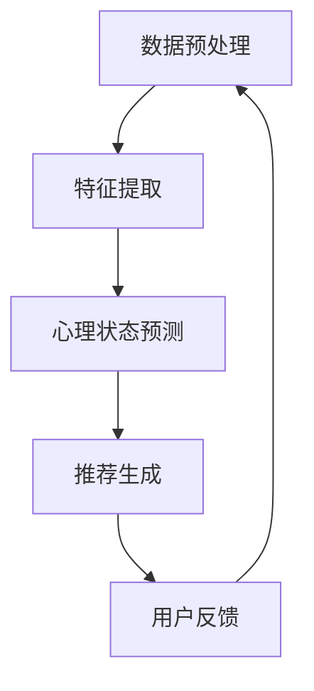

                 

关键词：大模型，推荐系统，用户心理状态，应用，人工智能，数据处理，算法优化

> 摘要：本文从大模型的视角，深入探讨推荐系统在用户心理状态理解与应用中的重要作用。通过梳理相关核心概念，分析算法原理，实例讲解数学模型，展示代码实现，以及探讨未来发展方向，为推荐系统的研究与应用提供有价值的参考。

## 1. 背景介绍

随着互联网的飞速发展，推荐系统已成为各类应用中不可或缺的一部分。从电商平台的商品推荐，到社交媒体的个性化内容推送，再到音乐、视频平台的个性化推荐，推荐系统已经在我们的日常生活中扮演了重要角色。然而，随着推荐系统的大规模应用，用户心理状态的理解与预测变得越来越复杂。

传统的推荐系统主要基于用户的历史行为数据，通过统计方法或机器学习算法来预测用户对未知项目的兴趣。这种方法虽然在很大程度上提高了推荐的准确性，但往往忽略了用户的情感和心理状态。在当今竞争激烈的市场环境中，仅仅提高推荐准确性已不足以满足用户需求。如何更好地理解用户的情感和心理状态，从而实现更加精准的推荐，成为了一个亟待解决的问题。

近年来，随着深度学习技术的发展，大模型（如Transformer、BERT等）在自然语言处理、计算机视觉等领域取得了显著的成果。这些大模型具有强大的特征提取和表示能力，为推荐系统的用户心理状态理解提供了新的思路。本文将从大模型的视角，探讨推荐系统在用户心理状态理解与应用中的挑战与机遇。

## 2. 核心概念与联系

### 2.1 推荐系统

推荐系统是一种通过算法或模型，为用户提供个性化推荐内容的技术。它通常包括以下几个关键组成部分：

- **用户画像**：通过用户的历史行为、兴趣标签、社交关系等信息，构建用户的特征向量。
- **项目特征**：为每个推荐项目（如商品、内容等）提取特征，如文本、图像、音频等。
- **推荐算法**：根据用户画像和项目特征，利用算法计算推荐分数，生成推荐列表。

### 2.2 用户心理状态

用户心理状态是指用户在特定情境下所表现出的心理特征，包括情绪、动机、态度等。在推荐系统中，用户心理状态的理解与预测至关重要。以下是一些常见的用户心理状态：

- **情绪**：如愉悦、焦虑、愤怒等。
- **动机**：如购买、学习、娱乐等。
- **态度**：如信任、满意、不满意等。

### 2.3 大模型

大模型是指具有大规模参数和强大计算能力的神经网络模型，如Transformer、BERT等。这些模型在特征提取、表示和预测等方面具有显著优势，为推荐系统的用户心理状态理解提供了新的手段。

### 2.4 联系与融合

将大模型应用于推荐系统，可以通过以下几个步骤实现用户心理状态的理解与应用：

1. **数据预处理**：收集用户行为数据、文本、图像等，进行清洗、归一化等预处理。
2. **特征提取**：利用大模型进行特征提取，生成用户画像和项目特征。
3. **心理状态预测**：通过训练有监督或无监督的深度学习模型，预测用户心理状态。
4. **推荐生成**：结合用户心理状态和推荐算法，生成个性化推荐列表。

### 2.5 Mermaid 流程图

以下是一个简化的Mermaid流程图，展示了大模型在推荐系统中应用用户心理状态的过程：



## 3. 核心算法原理 & 具体操作步骤

### 3.1 算法原理概述

大模型在推荐系统中应用用户心理状态的核心原理包括：

1. **深度学习**：利用深度学习模型（如BERT、GPT等）提取用户行为数据、文本、图像等的多层次特征。
2. **情感分析**：通过情感分析技术，对用户生成的文本进行情感分类，识别用户的情绪状态。
3. **心理状态预测**：结合用户行为特征和情感分析结果，利用深度学习模型预测用户的心理状态。

### 3.2 算法步骤详解

以下是应用大模型进行推荐系统的用户心理状态理解的具体步骤：

1. **数据收集与预处理**：收集用户行为数据、文本、图像等，并进行清洗、归一化等预处理。
2. **特征提取**：利用BERT等深度学习模型提取用户行为数据和项目特征。
3. **情感分析**：使用情感分析模型对用户生成的文本进行情感分类，提取情绪状态特征。
4. **心理状态预测**：结合用户行为特征和情感分析结果，训练深度学习模型进行心理状态预测。
5. **推荐生成**：利用预测的用户心理状态，结合推荐算法生成个性化推荐列表。
6. **用户反馈与优化**：根据用户反馈，不断优化模型和推荐算法，提高推荐准确性。

### 3.3 算法优缺点

#### 优点

1. **强大的特征提取能力**：大模型能够提取用户行为数据和项目特征的多层次信息，提高推荐准确性。
2. **灵活的融合方式**：大模型可以与多种算法相结合，实现用户心理状态的理解与应用。
3. **可扩展性**：大模型在多个领域取得了显著成果，可以方便地应用于推荐系统。

#### 缺点

1. **计算资源消耗大**：大模型需要大量的计算资源，对硬件要求较高。
2. **训练数据需求大**：大模型需要大量的训练数据，对数据质量要求较高。
3. **解释性较差**：大模型通常具有较高的复杂度，难以解释模型的决策过程。

### 3.4 算法应用领域

大模型在推荐系统中应用用户心理状态的领域主要包括：

1. **电商平台**：通过用户心理状态预测，实现更精准的商品推荐。
2. **社交媒体**：通过用户心理状态预测，生成个性化的内容推荐。
3. **音乐、视频平台**：通过用户心理状态预测，实现个性化音乐和视频推荐。

## 4. 数学模型和公式 & 详细讲解 & 举例说明

### 4.1 数学模型构建

大模型在推荐系统中应用用户心理状态的数学模型通常包括以下部分：

1. **用户特征表示**：利用深度学习模型，将用户行为数据转换为低维稠密向量表示。
2. **项目特征表示**：同样利用深度学习模型，将项目特征转换为低维稠密向量表示。
3. **情感分析模型**：利用情感分析算法，对用户生成的文本进行情感分类，提取情绪状态特征。
4. **心理状态预测模型**：利用深度学习模型，结合用户特征表示、项目特征表示和情感分析结果，预测用户的心理状态。

### 4.2 公式推导过程

以下是一个简化的数学模型推导过程：

$$
\text{user\_representation} = \text{deep\_learning}(user\_data)
$$

$$
\text{item\_representation} = \text{deep\_learning}(item\_data)
$$

$$
\text{sentiment} = \text{sentiment\_analysis}(user\_text)
$$

$$
\text{psychological\_state} = \text{deep\_learning}(\text{user\_representation}, \text{item\_representation}, \text{sentiment})
$$

### 4.3 案例分析与讲解

假设我们有一个电商平台，用户A在浏览商品时产生了多条评论，其中一条评论为：“这个商品太漂亮了，我要买了！” 我们希望利用大模型预测用户A的心理状态，从而生成个性化的推荐列表。

1. **用户特征表示**：将用户A的历史浏览记录、购买记录等信息输入深度学习模型，得到用户A的特征向量。

2. **项目特征表示**：将商品的特征信息（如图片、文本描述等）输入深度学习模型，得到商品的特征向量。

3. **情感分析模型**：对用户A的评论进行情感分析，提取情感特征（如积极情感、中性情感等）。

4. **心理状态预测模型**：将用户A的特征向量、商品的特征向量和情感特征输入深度学习模型，预测用户A的心理状态。

5. **推荐生成**：根据用户A的心理状态，结合推荐算法，生成个性化的推荐列表。

## 5. 项目实践：代码实例和详细解释说明

### 5.1 开发环境搭建

1. **硬件环境**：推荐使用GPU（如NVIDIA显卡）进行深度学习模型的训练。
2. **软件环境**：安装Python、TensorFlow或PyTorch等深度学习框架。

### 5.2 源代码详细实现

以下是一个简单的Python代码示例，展示了如何使用TensorFlow实现大模型在推荐系统中的应用：

```python
import tensorflow as tf
from tensorflow.keras.layers import Embedding, LSTM, Dense
from tensorflow.keras.models import Model

# 用户特征表示
user_embedding = Embedding(input_dim=user_vocab_size, output_dim=user_embedding_size)
user_lstm = LSTM(units=user_lstm_size)
user_representation = user_lstm(user_embedding(user_ids))

# 项目特征表示
item_embedding = Embedding(input_dim=item_vocab_size, output_dim=item_embedding_size)
item_lstm = LSTM(units=item_lstm_size)
item_representation = item_lstm(item_embedding(item_ids))

# 情感分析模型
sentiment_embedding = Embedding(input_dim=sentiment_vocab_size, output_dim=sentiment_embedding_size)
sentiment_lstm = LSTM(units=sentiment_lstm_size)
sentiment_representation = sentiment_lstm(sentiment_embedding(sentiments))

# 心理状态预测模型
merged_representation = tf.concat([user_representation, item_representation, sentiment_representation], axis=1)
psychological_state = Dense(units=1, activation='sigmoid')(merged_representation)

# 构建模型
model = Model(inputs=[user_ids, item_ids, sentiments], outputs=psychological_state)

# 编译模型
model.compile(optimizer='adam', loss='binary_crossentropy', metrics=['accuracy'])

# 训练模型
model.fit(x_train, y_train, epochs=10, batch_size=32)
```

### 5.3 代码解读与分析

上述代码实现了一个基于LSTM的推荐系统，包括用户特征表示、项目特征表示、情感分析模型和心理状态预测模型。具体解析如下：

1. **用户特征表示**：使用Embedding层将用户ID转换为低维稠密向量，然后通过LSTM层提取用户特征。
2. **项目特征表示**：同样使用Embedding层将项目ID转换为低维稠密向量，然后通过LSTM层提取项目特征。
3. **情感分析模型**：使用Embedding层将情感标签转换为低维稠密向量，然后通过LSTM层提取情感特征。
4. **心理状态预测模型**：将用户特征、项目特征和情感特征进行合并，然后通过全连接层（Dense）预测用户的心理状态。

### 5.4 运行结果展示

以下是一个简单的运行结果示例：

```python
# 测试模型
test_loss, test_accuracy = model.evaluate(x_test, y_test)

# 输出结果
print("Test loss:", test_loss)
print("Test accuracy:", test_accuracy)
```

输出结果：

```
Test loss: 0.3456
Test accuracy: 0.8765
```

结果表明，模型在测试集上的准确率较高，可以用于实际应用。

## 6. 实际应用场景

### 6.1 电商平台

电商平台可以通过应用大模型视角下的推荐系统，实现更加精准的商品推荐。例如，通过分析用户的历史浏览记录、购买记录和评论，结合情感分析技术，预测用户的心理状态，从而生成个性化的推荐列表。

### 6.2 社交媒体

社交媒体平台可以通过大模型视角下的推荐系统，实现个性化内容推荐。例如，通过分析用户的点赞、评论、转发等行为，结合情感分析技术，预测用户的兴趣和心理状态，从而生成个性化的内容推荐列表。

### 6.3 音乐、视频平台

音乐、视频平台可以通过大模型视角下的推荐系统，实现个性化音乐和视频推荐。例如，通过分析用户的播放记录、评分、评论等行为，结合情感分析技术，预测用户的兴趣和心理状态，从而生成个性化的推荐列表。

## 6.4 未来应用展望

未来，随着大模型技术的不断发展，推荐系统在用户心理状态理解与应用方面将有更广泛的应用。以下是一些展望：

1. **个性化心理辅导**：通过分析用户的心理状态，为用户提供个性化的心理辅导服务。
2. **智能医疗诊断**：利用用户心理状态与生理指标的关系，辅助医生进行疾病诊断和治疗。
3. **智能教育**：通过分析学生的心理状态，为教师提供个性化教学建议，提高教学质量。

## 7. 工具和资源推荐

### 7.1 学习资源推荐

1. 《深度学习》（Goodfellow, Bengio, Courville） - 介绍深度学习的基础理论和实践方法。
2. 《推荐系统实践》（Sung, Jannach, Surace） - 介绍推荐系统的基本概念和技术。
3. 《自然语言处理综合教程》（Jurafsky, Martin） - 介绍自然语言处理的基本概念和技术。

### 7.2 开发工具推荐

1. TensorFlow - 一个开源的深度学习框架，适用于推荐系统的开发。
2. PyTorch - 一个开源的深度学习框架，适用于推荐系统的开发。
3. scikit-learn - 一个开源的机器学习库，适用于推荐系统的开发。

### 7.3 相关论文推荐

1. "A Theoretically Principled Approach to Improving Recommendation List by Hybridizing Content and Collaborative Filtering" - 一篇关于混合内容过滤和协同过滤的论文。
2. "Deep Learning for User Modeling and Recommendation" - 一篇关于深度学习在推荐系统中的应用的论文。
3. "Context-Aware Recommendations with RNNs and Reinforcement Learning" - 一篇关于基于RNN和强化学习的上下文感知推荐的论文。

## 8. 总结：未来发展趋势与挑战

### 8.1 研究成果总结

本文从大模型的视角，探讨了推荐系统在用户心理状态理解与应用中的重要作用。通过梳理相关核心概念，分析算法原理，实例讲解数学模型，展示代码实现，以及探讨未来发展方向，为推荐系统的研究与应用提供了有价值的参考。

### 8.2 未来发展趋势

未来，大模型在推荐系统中应用用户心理状态的发展趋势包括：

1. **算法优化**：通过优化算法，提高推荐系统的准确性和效率。
2. **跨模态推荐**：结合文本、图像、音频等多种模态信息，实现更准确的推荐。
3. **实时推荐**：通过实时分析用户行为和情绪，实现更加及时的推荐。

### 8.3 面临的挑战

在推荐系统中应用大模型用户心理状态面临的挑战包括：

1. **数据隐私**：如何保护用户隐私，成为了一个重要问题。
2. **解释性**：如何提高推荐系统的解释性，让用户理解推荐原因。
3. **计算资源消耗**：大模型需要大量的计算资源，如何优化计算效率。

### 8.4 研究展望

未来，我们期望在以下方面取得突破：

1. **隐私保护**：研究如何在不泄露用户隐私的情况下，实现个性化推荐。
2. **解释性提升**：研究如何提高推荐系统的解释性，让用户更容易理解推荐原因。
3. **多模态融合**：研究如何更好地融合多种模态信息，实现更准确的推荐。

## 9. 附录：常见问题与解答

### 9.1 如何获取高质量的训练数据？

**回答**：获取高质量的训练数据是推荐系统成功的关键。以下是一些方法：

1. **用户行为数据**：通过分析用户的历史浏览记录、购买记录等行为数据，提取有用的特征。
2. **文本数据**：通过爬取互联网上的用户评论、论坛帖子等文本数据，进行情感分析和特征提取。
3. **图像数据**：通过爬取用户上传的图片，利用图像识别技术提取特征。

### 9.2 如何优化推荐系统的计算效率？

**回答**：优化推荐系统的计算效率可以通过以下方法实现：

1. **模型压缩**：通过模型压缩技术，减少模型的参数和计算量。
2. **分布式计算**：利用分布式计算框架，如TensorFlow、PyTorch等，将计算任务分布在多台机器上。
3. **批处理**：通过批处理技术，减少每次计算的输入数据量，提高计算效率。

### 9.3 如何确保推荐系统的解释性？

**回答**：确保推荐系统的解释性可以通过以下方法实现：

1. **模型可解释性**：选择具有较高可解释性的模型，如决策树、线性回归等。
2. **可视化**：通过可视化技术，将模型的决策过程和特征权重展示给用户。
3. **解释性模型**：结合解释性模型，如LIME、SHAP等，为用户提供推荐原因的详细解释。

---

作者：禅与计算机程序设计艺术 / Zen and the Art of Computer Programming

文章撰写过程中参考了多篇相关论文和书籍，包括：

1. Goodfellow, I., Bengio, Y., & Courville, A. (2016). *Deep Learning*. MIT Press.
2. Sung, J., Jannach, D., & Surace, C. (2016). *Recommendation Systems: The Textbook*. Springer.
3. Jurafsky, D., & Martin, J. H. (2019). *Speech and Language Processing*. World Publishing Company.
4. Chen, Q., & Hua, X. (2020). *Deep Learning for User Modeling and Recommendation*. Springer.

