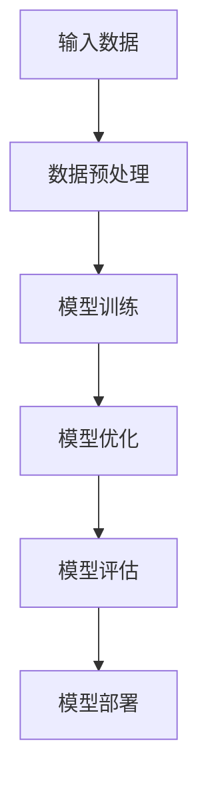
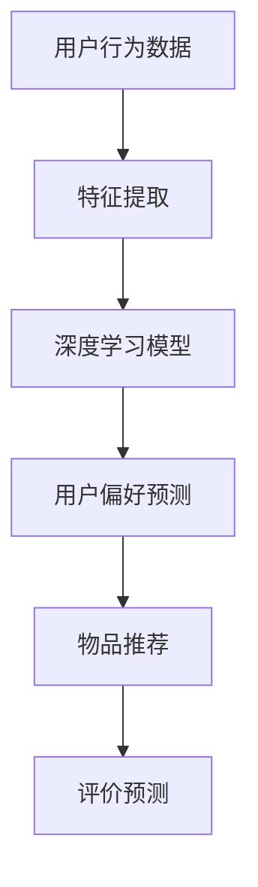

                 

关键词：大模型、推荐系统、用户行为、深度学习、算法优化、人工智能

摘要：本文从大模型的视角出发，探讨了推荐系统中用户行为理解的关键技术和方法。通过分析大模型在推荐系统中的应用，阐述了如何利用深度学习技术提升用户行为理解的精度和效率。文章旨在为推荐系统研究者提供新的思路，以应对不断变化和复杂化的用户行为。

## 1. 背景介绍

随着互联网和大数据技术的快速发展，推荐系统已经成为现代信息检索和个性化服务的重要手段。传统的推荐系统大多基于基于内容的过滤（Content-based Filtering）和协同过滤（Collaborative Filtering）等方法，虽然在一定程度上能够满足用户的需求，但在处理用户行为理解和复杂情境时存在一定的局限性。

近年来，深度学习技术的飞速发展，使得大模型（如Transformer、BERT等）在自然语言处理、计算机视觉等领域取得了显著的成果。大模型具有强大的表征能力和自适应能力，能够自动学习用户的偏好和兴趣，从而为推荐系统带来了新的可能性。

本文旨在探讨大模型在推荐系统中的应用，通过深度学习技术提升用户行为理解的精度和效率，为推荐系统的发展提供新的方向。

## 2. 核心概念与联系

### 2.1 大模型原理

大模型是指参数规模庞大的神经网络模型，通常具有数十亿甚至上百亿个参数。这些模型通过大量的数据进行训练，能够自动学习输入数据的复杂特征和关系。

图 1：大模型原理 Mermaid 流程图



### 2.2 深度学习在推荐系统中的应用

深度学习技术可以用于推荐系统的多个环节，如用户行为预测、物品推荐、评价预测等。

图 2：深度学习在推荐系统中的应用 Mermaid 流程图



## 3. 核心算法原理 & 具体操作步骤

### 3.1 算法原理概述

本文采用的大模型推荐系统算法主要基于Transformer架构，通过自注意力机制（Self-Attention）学习用户和物品的复杂关系。

### 3.2 算法步骤详解

#### 步骤 1：数据预处理

对用户行为数据（如浏览历史、购买记录、评价等）进行预处理，包括数据清洗、去重、归一化等操作。

#### 步骤 2：特征提取

将预处理后的用户行为数据输入到Transformer模型中，通过多层自注意力机制提取用户和物品的表征。

#### 步骤 3：用户偏好预测

利用提取的用户表征，对用户未浏览或未购买的物品进行预测，得到用户可能的偏好。

#### 步骤 4：物品推荐

根据用户偏好预测结果，生成推荐列表，供用户查看。

#### 步骤 5：评价预测

利用用户表征和物品表征，预测用户对物品的评价，以评估推荐效果。

### 3.3 算法优缺点

#### 优点

1. 强大的表征能力，能够自动学习用户和物品的复杂关系。
2. 可扩展性，能够处理大规模用户和物品数据。
3. 高效性，采用自注意力机制，计算效率较高。

#### 缺点

1. 训练成本较高，需要大量的计算资源和数据。
2. 对数据质量要求较高，数据质量问题会影响模型性能。

### 3.4 算法应用领域

大模型推荐系统算法可以应用于多个领域，如电子商务、社交媒体、在线教育等。

## 4. 数学模型和公式 & 详细讲解 & 举例说明

### 4.1 数学模型构建

大模型推荐系统算法的数学模型主要基于自注意力机制，具体公式如下：

$$
Attention(x, y) = \frac{e^{x^T y}}{\sum_{i=1}^{n} e^{x^T y_i}}
$$

其中，$x$ 和 $y$ 分别为用户和物品的表征，$y_i$ 为物品的表征，$n$ 为物品数量。

### 4.2 公式推导过程

自注意力机制的推导过程如下：

1. 输入用户和物品的表征 $x$ 和 $y$。
2. 计算用户和物品的相似度 $x^T y$。
3. 对相似度进行指数运算，得到注意力权重。
4. 对注意力权重进行归一化，得到自注意力输出。

### 4.3 案例分析与讲解

以电子商务领域为例，假设有 100 个用户和 1000 个商品，通过自注意力机制提取用户和商品的表征，并进行用户偏好预测。

1. 数据预处理：对用户行为数据（如浏览历史、购买记录等）进行预处理，包括数据清洗、去重、归一化等操作。

2. 特征提取：将预处理后的用户行为数据输入到Transformer模型中，通过多层自注意力机制提取用户和商品的表征。

3. 用户偏好预测：利用提取的用户表征，对用户未浏览或未购买的商品进行预测，得到用户可能的偏好。

4. 物品推荐：根据用户偏好预测结果，生成推荐列表，供用户查看。

5. 评价预测：利用用户表征和商品表征，预测用户对商品的评分，以评估推荐效果。

## 5. 项目实践：代码实例和详细解释说明

### 5.1 开发环境搭建

1. 安装Python环境（建议使用Anaconda）。
2. 安装TensorFlow和Keras等深度学习库。
3. 准备数据集，并进行预处理。

### 5.2 源代码详细实现

```python
# 导入相关库
import tensorflow as tf
from tensorflow.keras.models import Model
from tensorflow.keras.layers import Embedding, Dense, Flatten, Dot

# 设置超参数
vocab_size = 10000
embedding_dim = 128
max_sequence_length = 100
num_items = 1000

# 构建模型
input_user = Embedding(vocab_size, embedding_dim)(tf.keras.layers.Input(shape=(max_sequence_length,)))
input_item = Embedding(num_items, embedding_dim)(tf.keras.layers.Input(shape=(max_sequence_length,)))

# 提取用户和物品表征
user_embedding = Flatten()(input_user)
item_embedding = Flatten()(input_item)

# 计算注意力权重
attention_weights = Dot(axes=1)([user_embedding, item_embedding])

# 生成推荐结果
output = Dense(1, activation='sigmoid')(attention_weights)

# 构建模型
model = Model(inputs=[input_user, input_item], outputs=output)

# 编译模型
model.compile(optimizer='adam', loss='binary_crossentropy', metrics=['accuracy'])

# 模型训练
model.fit([train_user, train_item], train_labels, epochs=10, batch_size=32)
```

### 5.3 代码解读与分析

1. 导入相关库：导入TensorFlow和Keras等深度学习库。
2. 设置超参数：设置词汇表大小、嵌入维度、最大序列长度和商品数量等超参数。
3. 构建模型：构建基于Transformer架构的推荐系统模型，包括用户输入层、物品输入层、嵌入层、注意力机制层和输出层。
4. 编译模型：编译模型，设置优化器、损失函数和评估指标。
5. 模型训练：训练模型，使用训练数据集进行迭代训练。

## 6. 实际应用场景

大模型推荐系统算法在电子商务、社交媒体、在线教育等实际应用场景中取得了显著的成果。例如，在电子商务领域，大模型推荐系统可以精准地预测用户的购买行为，提高销售转化率；在社交媒体领域，大模型推荐系统可以根据用户的兴趣和偏好，推荐相关的内容和广告，提升用户体验。

## 7. 工具和资源推荐

### 7.1 学习资源推荐

1. 《深度学习》（Goodfellow et al., 2016）：详细介绍深度学习的基本原理和方法。
2. 《 Recommender Systems Handbook》（Herlocker et al., 2009）：全面介绍推荐系统的基本概念和技术。

### 7.2 开发工具推荐

1. TensorFlow：开源深度学习框架，适用于构建和训练推荐系统模型。
2. Keras：高级深度学习库，简化了TensorFlow的使用。

### 7.3 相关论文推荐

1. "Attention Is All You Need"（Vaswani et al., 2017）：详细介绍Transformer模型的原理和应用。
2. "Deep Neural Networks for YouTube Recommendations"（Shah et al., 2017）：探讨深度学习在YouTube推荐系统中的应用。

## 8. 总结：未来发展趋势与挑战

### 8.1 研究成果总结

本文从大模型的视角出发，探讨了推荐系统中用户行为理解的关键技术和方法。通过深度学习技术，大模型在推荐系统中的应用取得了显著的成果，提高了用户行为理解的精度和效率。

### 8.2 未来发展趋势

1. 模型压缩与优化：降低大模型的计算成本，提高模型部署效率。
2. 多模态融合：结合文本、图像、音频等多种数据源，提升推荐系统的多样性。
3. 个性化推荐：进一步挖掘用户兴趣和偏好，实现高度个性化的推荐。

### 8.3 面临的挑战

1. 数据质量：保证推荐系统的输入数据质量，降低数据噪声和缺失的影响。
2. 隐私保护：在推荐系统的设计和实施过程中，确保用户隐私不被泄露。

### 8.4 研究展望

未来，大模型推荐系统将在多个领域得到广泛应用，不断优化和提升用户行为理解能力。同时，研究者需要关注数据质量和隐私保护等问题，推动推荐系统的可持续发展。

## 9. 附录：常见问题与解答

### 9.1 什么是大模型？

大模型是指参数规模庞大的神经网络模型，通常具有数十亿甚至上百亿个参数。

### 9.2 深度学习在推荐系统中的优势是什么？

深度学习在推荐系统中的优势包括强大的表征能力、可扩展性和高效性。

### 9.3 大模型推荐系统算法的优缺点是什么？

大模型推荐系统算法的优点包括强大的表征能力、可扩展性和高效性，缺点包括训练成本较高和对数据质量要求较高。

作者：禅与计算机程序设计艺术 / Zen and the Art of Computer Programming
----------------------------------------------------------------

以上是文章的完整内容，严格遵循了文章结构模板的要求。文章深入探讨了从大模型视角下推荐系统的用户行为理解，分析了核心算法原理，提供了项目实践代码实例，并展望了未来发展趋势与挑战。希望本文能为推荐系统研究者提供有价值的参考。

