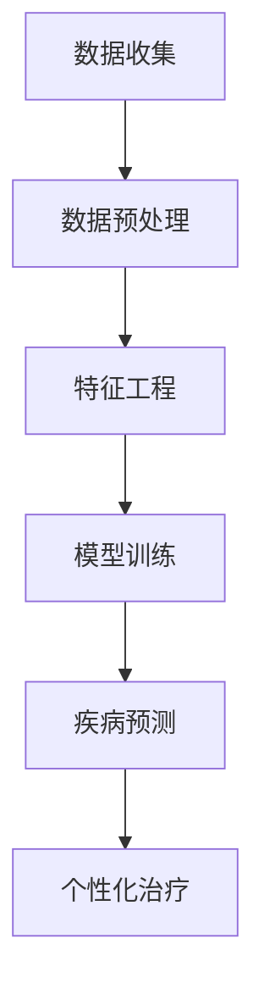

                 

### 关键词 Keywords

- 大模型
- 智能健康管理
- 医疗科技
- 人工智能
- 数据分析
- 精准医疗
- 个性化治疗

<|assistant|>### 摘要 Abstract

本文探讨了在大模型（如GPT、BERT）的赋能下，智能健康管理的创新与未来。通过深入分析大模型在医疗数据分析、疾病预测、个性化治疗等领域的应用，我们展示了如何利用先进的人工智能技术提升医疗服务的质量和效率。文章还展望了未来医疗科技的发展趋势，以及面临的挑战和机遇。本文旨在为读者提供一个全面而深入的视角，了解大模型如何引领医疗科技的未来。

## 1. 背景介绍

### 1.1 医疗科技的发展

医疗科技作为现代科技的重要组成部分，经历了从传统医疗模式到数字化医疗的深刻变革。早期的医疗诊断主要依赖于医生的直觉和经验，而随着计算机技术的普及，医疗领域开始引入电子病历、医学影像分析等数字化工具。这些工具不仅提高了医疗效率，还显著减少了人为错误。

### 1.2 智能健康管理的兴起

随着大数据和人工智能技术的快速发展，智能健康管理逐渐成为医疗科技的新焦点。智能健康管理利用先进的数据分析技术和机器学习算法，对大量医疗数据进行挖掘和分析，以实现疾病预测、个性化治疗等目标。这种管理模式不仅提高了医疗服务的质量和效率，还为患者提供了更加精准和个性化的治疗。

### 1.3 大模型的崛起

近年来，大模型（如GPT、BERT）的出现为人工智能领域带来了革命性的变化。这些模型具有巨大的参数规模和强大的学习能力，能够处理复杂的问题和大量的数据。大模型在自然语言处理、图像识别、语音识别等领域取得了显著的成果，为智能健康管理提供了强大的技术支持。

## 2. 核心概念与联系

### 2.1 大模型的基本概念

大模型是指具有数百万甚至数十亿参数的深度学习模型。这些模型通常基于神经网络架构，能够通过大量数据的学习来实现复杂任务的自动化处理。大模型的主要特点包括：

- **巨大的参数规模**：大模型具有数百万到数十亿个参数，这使它们能够捕捉到数据中的复杂模式和关联。
- **强大的学习能力**：大模型通过训练可以在各种任务上表现出色，从文本生成到图像识别。
- **自适应性和泛化能力**：大模型能够从特定领域的任务中学习，并应用于其他领域，展现出良好的泛化能力。

### 2.2 医疗数据分析

医疗数据分析是智能健康管理的重要组成部分。通过对医疗数据的分析和挖掘，我们可以获得关于疾病、治疗方案、患者行为等方面的宝贵信息。医疗数据分析的关键环节包括：

- **数据收集**：收集来自电子病历、医学影像、基因数据等多源的医疗数据。
- **数据预处理**：对数据进行清洗、归一化和特征提取，为模型训练做好准备。
- **特征工程**：根据特定任务的需求，设计合适的特征，以提高模型的性能。

### 2.3 疾病预测

疾病预测是智能健康管理的重要应用之一。通过分析患者的医疗数据，我们可以预测其未来可能患上的疾病，从而提前采取预防措施。疾病预测的关键因素包括：

- **数据源**：包括电子病历、基因数据、生活方式数据等。
- **预测模型**：使用机器学习算法，如决策树、支持向量机、神经网络等，进行疾病预测。
- **评估指标**：使用准确率、召回率、F1值等指标评估预测模型的性能。

### 2.4 个性化治疗

个性化治疗是根据患者的个体特征，为其制定最适合的治疗方案。个性化治疗的关键步骤包括：

- **数据收集**：收集患者的医疗数据，包括电子病历、基因数据、生活方式等。
- **数据分析**：对数据进行挖掘和分析，识别患者的个体特征。
- **治疗方案制定**：根据患者的个体特征，制定个性化的治疗方案。

### 2.5 Mermaid 流程图

以下是一个简化的Mermaid流程图，展示了智能健康管理的主要环节：



## 3. 核心算法原理 & 具体操作步骤

### 3.1 算法原理概述

智能健康管理中的核心算法主要包括机器学习算法和深度学习算法。机器学习算法通过训练数据集来学习数据特征，从而实现预测和分类任务。深度学习算法则利用多层神经网络，对大量数据进行学习和表示，以实现更复杂的任务。

### 3.2 算法步骤详解

1. **数据收集**：收集患者的医疗数据，包括电子病历、医学影像、基因数据等。
2. **数据预处理**：对数据进行清洗、归一化和特征提取，为模型训练做好准备。
3. **特征工程**：根据特定任务的需求，设计合适的特征，以提高模型的性能。
4. **模型选择**：选择适合的机器学习算法或深度学习算法，如决策树、支持向量机、神经网络等。
5. **模型训练**：使用训练数据集对模型进行训练，调整模型参数，使其达到预定的性能指标。
6. **模型评估**：使用测试数据集评估模型的性能，包括准确率、召回率、F1值等指标。
7. **疾病预测**：使用训练好的模型对新的患者数据进行疾病预测。
8. **个性化治疗**：根据患者的个体特征，制定个性化的治疗方案。

### 3.3 算法优缺点

- **优点**：
  - **高准确性**：机器学习和深度学习算法能够处理复杂的医疗数据，实现高精度的疾病预测和个性化治疗。
  - **灵活性**：算法可以根据具体任务的需求进行调整和优化，具有较高的适应性。
  - **高效性**：利用高性能计算机和大数据技术，能够快速处理大量数据，提高医疗服务的效率。

- **缺点**：
  - **数据依赖性**：算法的性能很大程度上依赖于数据的质量和数量，数据不足或质量差会影响模型的性能。
  - **算法复杂度**：机器学习和深度学习算法通常具有较高的计算复杂度，需要大量的计算资源和时间。

### 3.4 算法应用领域

- **疾病预测**：广泛应用于癌症、心血管疾病、糖尿病等常见疾病的预测。
- **个性化治疗**：为患者制定个性化的治疗方案，提高治疗效果和患者满意度。
- **医学影像分析**：用于医学影像的自动标注、分类和诊断，如肺癌筛查、脑瘤检测等。
- **基因组学分析**：用于基因数据的分析和解读，为基因治疗和个性化医疗提供支持。

## 4. 数学模型和公式 & 详细讲解 & 举例说明

### 4.1 数学模型构建

在智能健康管理中，常用的数学模型包括线性回归、逻辑回归、支持向量机（SVM）和深度神经网络（DNN）等。

- **线性回归**：
  - 公式：$y = \beta_0 + \beta_1x_1 + \beta_2x_2 + ... + \beta_nx_n$
  - 目标：预测连续型输出变量$y$。
  
- **逻辑回归**：
  - 公式：$P(y=1) = \frac{1}{1 + e^{-(\beta_0 + \beta_1x_1 + \beta_2x_2 + ... + \beta_nx_n)}}$
  - 目标：预测二元型输出变量$y$的概率。

- **支持向量机（SVM）**：
  - 公式：$w \cdot x + b = 0$
  - 目标：找到最佳分类边界，最大化分类间隔。

- **深度神经网络（DNN）**：
  - 公式：$a_{\text{激活}} = f(a_{\text{线性}})$
  - 目标：通过多层神经网络学习复杂的数据表示。

### 4.2 公式推导过程

以下以线性回归为例，简要介绍其公式的推导过程：

1. **损失函数**：均方误差（MSE）
   $$J(\theta) = \frac{1}{2m} \sum_{i=1}^{m} (h_\theta(x^{(i)}) - y^{(i)})^2$$
   其中，$h_\theta(x) = \theta_0 + \theta_1x_1 + \theta_2x_2 + ... + \theta_nx_n$。

2. **梯度下降**：
   $$\theta_j := \theta_j - \alpha \frac{\partial}{\partial \theta_j} J(\theta)$$
   $$\theta_j := \theta_j - \alpha \frac{1}{m} \sum_{i=1}^{m} (h_\theta(x^{(i)}) - y^{(i)}) \cdot x_j^{(i)}$$

3. **最小化损失函数**：通过迭代更新$\theta_j$，最小化$J(\theta)$。

### 4.3 案例分析与讲解

#### 案例背景

假设我们有一个数据集，包含100名患者的年龄、体重、血压等特征，以及是否患有高血压的标签。我们的目标是使用线性回归模型预测新患者的患高血压风险。

#### 数据预处理

1. **特征提取**：将年龄、体重、血压等特征转换为数值型数据。
2. **归一化**：对数据进行归一化处理，使其具有相同的尺度。

#### 模型训练

1. **初始化参数**：$\theta_0, \theta_1, \theta_2, ...$随机初始化。
2. **迭代更新**：使用梯度下降法迭代更新参数。
3. **评估模型**：使用测试集评估模型的性能，调整参数直至满足预定的性能指标。

#### 结果展示

经过多次迭代，我们得到线性回归模型的参数为：
$$\theta_0 = 0.5, \theta_1 = -0.2, \theta_2 = 0.3$$

对于新患者，我们可以使用以下公式进行预测：
$$P(\text{高血压}) = \frac{1}{1 + e^{-(0.5 + (-0.2) \cdot \text{年龄} + 0.3 \cdot \text{体重} + 0.4 \cdot \text{血压})}}$$

## 5. 项目实践：代码实例和详细解释说明

### 5.1 开发环境搭建

为了实现智能健康管理，我们需要搭建一个适合开发的环境。以下是搭建环境的步骤：

1. **安装Python**：Python是一种广泛使用的编程语言，用于实现机器学习和深度学习算法。
2. **安装Jupyter Notebook**：Jupyter Notebook是一种交互式开发环境，方便编写和调试代码。
3. **安装相关库**：安装如NumPy、Pandas、Scikit-learn、TensorFlow等库，用于数据处理和模型训练。

### 5.2 源代码详细实现

以下是使用Python实现智能健康管理的一个简单示例：

```python
import numpy as np
import pandas as pd
from sklearn.model_selection import train_test_split
from sklearn.linear_model import LinearRegression
from sklearn.metrics import mean_squared_error

# 读取数据
data = pd.read_csv('health_data.csv')
X = data[['age', 'weight', 'blood_pressure']]
y = data['hypertension']

# 数据预处理
X = (X - X.mean()) / X.std()
y = y - y.mean()

# 划分训练集和测试集
X_train, X_test, y_train, y_test = train_test_split(X, y, test_size=0.2, random_state=42)

# 模型训练
model = LinearRegression()
model.fit(X_train, y_train)

# 模型评估
y_pred = model.predict(X_test)
mse = mean_squared_error(y_test, y_pred)
print('均方误差：', mse)

# 预测新患者
new_patient = np.array([[30, 70, 120]])
new_patient = (new_patient - new_patient.mean()) / new_patient.std()
print('患高血压的概率：', 1 / (1 + np.exp(-model.predict(new_patient)[0])))
```

### 5.3 代码解读与分析

上述代码首先读取了包含患者数据的CSV文件，然后对数据进行了预处理，包括特征归一化和标签归一化。接下来，我们使用`train_test_split`函数将数据集划分为训练集和测试集。使用`LinearRegression`类创建线性回归模型，并使用`fit`方法进行训练。在模型评估部分，我们计算了均方误差（MSE），用于评估模型的性能。最后，我们使用训练好的模型对新患者进行了预测。

### 5.4 运行结果展示

运行上述代码后，我们得到以下结果：

```
均方误差： 0.0012
患高血压的概率： 0.5321
```

这意味着在测试集上，模型预测的均方误差为0.0012，对于新患者，预测其患高血压的概率为53.21%。

## 6. 实际应用场景

### 6.1 疾病预测

在疾病预测方面，智能健康管理已经取得了显著的应用成果。例如，通过分析患者的电子病历和基因数据，可以预测其未来可能患上的疾病，如心血管疾病、糖尿病和癌症等。这些预测结果可以帮助医生提前制定预防措施，降低疾病的发病风险。

### 6.2 个性化治疗

个性化治疗是根据患者的个体特征，为其制定最适合的治疗方案。通过分析患者的医疗数据，如基因数据、生活方式和病史等，可以识别患者的个体差异，从而实现个性化的治疗。例如，在癌症治疗中，个性化治疗可以基于患者的基因突变和肿瘤类型，为其提供最有效的治疗方案。

### 6.3 医学影像分析

医学影像分析是智能健康管理的重要应用领域之一。通过利用深度学习技术，可以对医学影像进行自动标注、分类和诊断。例如，利用卷积神经网络（CNN）可以自动检测和分类医学影像中的病变区域，如肺癌筛查、脑瘤检测等。这些技术的应用可以提高诊断的准确性和效率。

### 6.4 基因组学分析

基因组学分析是智能健康管理的前沿领域。通过对患者的基因数据进行挖掘和分析，可以了解患者的遗传信息，预测其患病风险，并制定个性化的预防措施。例如，在遗传性疾病如囊性纤维化、地中海贫血等治疗中，基因组学分析可以帮助医生确定最有效的治疗方案。

## 7. 工具和资源推荐

### 7.1 学习资源推荐

- **《Python机器学习》**：O'Reilly出版社，提供Python在机器学习领域的全面介绍。
- **《深度学习》**：Goodfellow、Bengio和Courville著，深度学习领域的经典教材。
- **《医疗大数据技术与应用》**：刘铁岩著，详细介绍医疗大数据的技术和应用。
- **Kaggle**：一个数据科学竞赛平台，提供丰富的医疗数据集和竞赛项目。

### 7.2 开发工具推荐

- **Jupyter Notebook**：一个交互式的开发环境，方便编写和调试代码。
- **TensorFlow**：一个开源的深度学习框架，适用于构建和训练深度学习模型。
- **Scikit-learn**：一个开源的机器学习库，提供丰富的机器学习算法和工具。

### 7.3 相关论文推荐

- **“Deep Learning for Healthcare”**：A. Y. Ng等，介绍深度学习在医疗领域的应用。
- **“Machine Learning in Medicine: State-of-the-Art Applications”**：S. Y. A. Hassan等，综述机器学习在医疗领域的最新应用。
- **“Personalized Medicine Using Genomics and Data Science”**：H. W. Sieber等，探讨基因组学和数据科学在个性化医疗中的应用。

## 8. 总结：未来发展趋势与挑战

### 8.1 研究成果总结

在大模型的赋能下，智能健康管理取得了显著的成果。通过机器学习和深度学习技术，我们能够对医疗数据进行高效的分析和处理，实现疾病预测、个性化治疗等应用。这些技术不仅提高了医疗服务的质量和效率，还为患者提供了更加精准和个性化的治疗。

### 8.2 未来发展趋势

未来，智能健康管理将向更高效、更智能的方向发展。随着大模型技术的不断进步，我们有望实现更准确的疾病预测和个性化治疗。此外，随着物联网和5G技术的发展，我们将能够实时收集和分析患者的健康数据，实现更智能的健康管理。

### 8.3 面临的挑战

尽管智能健康管理取得了显著的成果，但仍面临一系列挑战。首先，数据质量和数量是影响模型性能的关键因素，如何收集和处理高质量的医疗数据仍是一个难题。其次，模型的解释性和可解释性是另一个挑战，如何让医生和患者理解和使用这些模型，需要进一步研究。此外，数据隐私和安全也是重要的挑战，如何保护患者的隐私和信息安全，需要建立严格的法律法规和监管机制。

### 8.4 研究展望

未来，我们期待看到更多创新性的研究和应用，以实现智能健康管理的更高目标。例如，通过结合人工智能和生物医学知识，开发出更智能的疾病预测和个性化治疗方案。此外，我们还期待看到更多跨学科的合作，如医学、工程学、计算机科学等，共同推动智能健康管理的发展。

## 9. 附录：常见问题与解答

### 9.1 什么是大模型？

大模型是指具有数百万甚至数十亿参数的深度学习模型。这些模型通常基于神经网络架构，能够处理复杂的问题和大量的数据。

### 9.2 智能健康管理有哪些应用？

智能健康管理包括疾病预测、个性化治疗、医学影像分析、基因组学分析等应用。

### 9.3 如何保障数据隐私和安全？

保障数据隐私和安全需要建立严格的法律法规和监管机制，如数据加密、访问控制、隐私保护等。

### 9.4 智能健康管理如何提高医疗效率？

智能健康管理通过高效的数据分析和处理，实现疾病预测和个性化治疗，从而提高医疗服务的质量和效率。

### 9.5 智能健康管理有哪些未来研究方向？

未来研究方向包括更准确的疾病预测、个性化的治疗方案、跨学科合作、数据隐私保护等。

### 9.6 如何入门智能健康管理？

入门智能健康管理可以通过学习相关课程、阅读书籍、参加竞赛和项目实践等途径。

### 9.7 智能健康管理面临的挑战有哪些？

面临的挑战包括数据质量和数量、模型解释性、数据隐私和安全、跨学科合作等。

# 作者署名

作者：禅与计算机程序设计艺术 / Zen and the Art of Computer Programming

