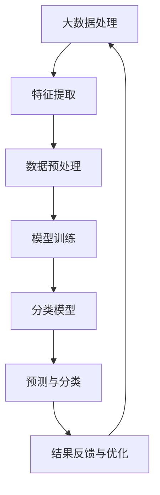

                 

关键词：大模型、智能分类、商品识别、人工智能、系统架构、算法优化、应用实践

摘要：本文探讨了基于大模型的智能商品分类系统的设计与实现。通过引入大模型，系统在商品识别的准确性和效率上得到了显著提升，实现了对大规模商品数据的高效分类。本文将详细阐述系统架构、核心算法原理、数学模型以及实际应用场景，为相关领域的研究和实践提供参考。

## 1. 背景介绍

随着互联网和电子商务的迅猛发展，商品数据量呈现出爆炸式增长。如何有效地对海量商品数据进行分类，成为了当前信息技术领域面临的一个重要挑战。传统的商品分类方法主要依赖于手工特征提取和规则匹配，尽管在一定程度上能够满足需求，但在处理复杂、多变的商品数据时，往往表现出局限性。近年来，人工智能技术的快速发展，尤其是大模型的兴起，为商品分类带来了新的机遇。大模型具有强大的特征提取能力和适应性，能够处理复杂的商品数据，从而提高分类的准确性和效率。

本文旨在研究并实现一个基于大模型的智能商品分类系统，通过对商品数据的深度学习和分析，实现高效、准确的商品分类。系统不仅适用于电商平台，还可以应用于库存管理、市场分析等多个领域。

### 当前挑战

1. **数据复杂性**：商品数据种类繁多，属性多样，如何有效地提取和利用这些数据成为挑战。
2. **分类准确性**：传统的分类方法在面对复杂、相似的物品时，往往难以达到高精度。
3. **效率问题**：随着数据量的增加，传统方法的计算效率成为瓶颈。
4. **实时性需求**：在电商平台上，用户对商品分类的实时性需求越来越高，传统的分类方法难以满足。

### 大模型的作用

1. **自动特征提取**：大模型能够自动从原始数据中提取出有用的特征，降低人工干预的必要性。
2. **高精度分类**：大模型通过对大量数据的训练，能够学习到复杂的分类模式，提高分类准确性。
3. **高效计算**：大模型利用并行计算技术，能够在短时间内处理大量数据。
4. **适应性强**：大模型具有较强的适应性，能够应对不同类型和规模的商品数据。

## 2. 核心概念与联系

为了更好地理解大模型在智能商品分类系统中的作用，我们需要先了解几个核心概念及其相互关系。以下是一个Mermaid流程图，展示了这些概念和它们之间的关系。



### 概念解释

- **大数据处理**：指对海量商品数据进行存储、管理和处理的过程。
- **特征提取**：从原始数据中提取出能够代表商品属性的指标。
- **数据预处理**：对原始数据进行清洗、归一化等处理，以提高后续分析的质量。
- **模型训练**：使用提取出的特征数据对分类模型进行训练。
- **分类模型**：经过训练的模型，用于对新数据进行分类。
- **预测与分类**：使用分类模型对新数据进行预测和分类。
- **结果反馈与优化**：根据分类结果进行反馈，对模型进行优化，以提高分类准确性。

通过这个流程，我们可以看到大模型在智能商品分类系统中的核心作用，即通过大数据处理、特征提取、模型训练、预测与分类，最终实现高效的商品分类。

## 3. 核心算法原理 & 具体操作步骤

### 3.1 算法原理概述

智能商品分类系统的核心算法是基于深度学习的分类模型。深度学习是一种基于人工神经网络的机器学习技术，通过多层神经网络自动提取特征，实现对数据的分类。

深度学习模型通常包括输入层、隐藏层和输出层。输入层接收原始数据，隐藏层通过神经网络进行特征提取，输出层根据提取的特征进行分类。

在智能商品分类系统中，输入层接收商品的各种属性数据，如商品名称、品牌、价格、销量等。隐藏层通过多层神经网络提取出商品的高级特征，输出层则根据这些特征进行分类，判断商品属于哪个类别。

### 3.2 算法步骤详解

#### 3.2.1 数据采集与预处理

1. **数据采集**：从电商平台、商品数据库等渠道收集商品数据。
2. **数据清洗**：去除重复、无效数据，确保数据质量。
3. **特征提取**：对商品数据进行分析，提取出与分类相关的特征。
4. **数据归一化**：将不同特征的数据进行归一化处理，使其在相同尺度范围内。

#### 3.2.2 模型构建与训练

1. **模型选择**：选择合适的深度学习模型，如卷积神经网络（CNN）、循环神经网络（RNN）等。
2. **模型构建**：根据商品数据的特征，构建深度学习模型。
3. **模型训练**：使用提取出的特征数据对模型进行训练，调整模型的参数，使其能够准确分类。
4. **模型验证**：使用验证集对模型进行验证，评估模型的分类性能。

#### 3.2.3 分类与预测

1. **输入新数据**：将新的商品数据输入到训练好的模型中。
2. **特征提取**：通过模型对新数据进行特征提取。
3. **分类判断**：根据提取的特征，使用模型进行分类判断，预测商品属于哪个类别。
4. **结果反馈**：将分类结果与实际结果进行对比，评估模型的预测准确性。

### 3.3 算法优缺点

#### 优点

1. **自动特征提取**：深度学习模型能够自动从原始数据中提取出有用的特征，降低人工干预的必要性。
2. **高精度分类**：深度学习模型通过对大量数据的训练，能够学习到复杂的分类模式，提高分类准确性。
3. **高效计算**：深度学习模型利用并行计算技术，能够在短时间内处理大量数据。

#### 缺点

1. **计算资源消耗大**：深度学习模型需要大量的计算资源和存储空间。
2. **训练时间较长**：深度学习模型的训练时间相对较长，特别是在处理大规模数据时。
3. **对数据质量要求高**：数据质量对模型的性能有很大影响，数据清洗和预处理工作较为繁琐。

### 3.4 算法应用领域

1. **电商平台**：用于商品分类，帮助用户快速找到所需商品。
2. **库存管理**：根据商品分类结果，优化库存管理和供应链。
3. **市场分析**：通过对商品分类结果的分析，帮助企业了解市场趋势和消费者偏好。
4. **推荐系统**：结合其他算法，为用户推荐相关商品。

## 4. 数学模型和公式 & 详细讲解 & 举例说明

### 4.1 数学模型构建

智能商品分类系统的数学模型主要包括输入层、隐藏层和输出层。以下是一个简化的数学模型示例：

$$
\begin{aligned}
\text{输入层}: \quad \textbf{X} &= \{x_1, x_2, ..., x_n\}, \quad x_i \in \mathbb{R}^m, \\
\text{隐藏层}: \quad \textbf{H} &= \{h_1, h_2, ..., h_l\}, \quad h_i \in \mathbb{R}^m, \\
\text{输出层}: \quad \textbf{Y} &= \{y_1, y_2, ..., y_k\}, \quad y_j \in \mathbb{R},
\end{aligned}
$$

其中，$\textbf{X}$ 是输入特征数据矩阵，$\textbf{H}$ 是隐藏层特征矩阵，$\textbf{Y}$ 是输出分类结果矩阵，$x_i$ 和 $h_i$ 分别是输入特征向量和隐藏层特征向量，$y_j$ 是输出分类结果。

### 4.2 公式推导过程

#### 输入层到隐藏层的映射

输入层到隐藏层的映射可以使用激活函数 $f(\cdot)$ 进行非线性变换：

$$
h_i = f(W_1 \cdot x_i + b_1), \quad i = 1, 2, ..., l,
$$

其中，$W_1$ 是输入层到隐藏层的权重矩阵，$b_1$ 是输入层到隐藏层的偏置向量，$f(\cdot)$ 是激活函数，常用的激活函数包括 sigmoid、ReLU 等。

#### 隐藏层到输出层的映射

隐藏层到输出层的映射通常使用线性函数：

$$
y_j = W_2 \cdot h_j + b_2, \quad j = 1, 2, ..., k,
$$

其中，$W_2$ 是隐藏层到输出层的权重矩阵，$b_2$ 是隐藏层到输出层的偏置向量。

#### 损失函数

为了训练深度学习模型，我们需要定义一个损失函数，用于评估模型的分类性能。常用的损失函数包括交叉熵损失函数：

$$
L(\textbf{Y}, \hat{\textbf{Y}}) = -\frac{1}{m} \sum_{i=1}^{m} \sum_{j=1}^{k} y_{ij} \log (\hat{y}_{ij}),
$$

其中，$\textbf{Y}$ 是真实标签向量，$\hat{\textbf{Y}}$ 是模型的预测标签向量，$y_{ij}$ 和 $\hat{y}_{ij}$ 分别是真实标签和预测标签。

### 4.3 案例分析与讲解

假设我们有一个包含 1000 个商品的数据集，每个商品有 10 个属性，我们需要将这些商品分为 5 个类别。以下是一个简化的案例：

#### 数据集

| 商品ID | 属性1 | 属性2 | 属性3 | 属性4 | 属性5 | 属性6 | 属性7 | 属性8 | 属性9 | 属性10 |
|--------|-------|-------|-------|-------|-------|-------|-------|-------|-------|--------|
| 1      | 0.1   | 0.2   | 0.3   | 0.4   | 0.5   | 0.6   | 0.7   | 0.8   | 0.9    | 1      |
| 2      | 0.2   | 0.3   | 0.4   | 0.5   | 0.6   | 0.7   | 0.8   | 0.9   | 1.0    | 1      |
| ...    | ...   | ...   | ...   | ...   | ...   | ...   | ...   | ...   | ...    | ...    |
| 1000   | 1.0   | 0.9   | 0.8   | 0.7   | 0.6   | 0.5   | 0.4   | 0.3   | 0.2    | 0.1    |

#### 模型构建

我们选择一个简单的多层感知机（MLP）模型，包含一个输入层、一个隐藏层和一个输出层。隐藏层使用 ReLU 激活函数，输出层使用 Softmax 激活函数。

#### 模型参数

- 输入层到隐藏层的权重矩阵：$W_1 \in \mathbb{R}^{10 \times 64}$
- 隐藏层到输出层的权重矩阵：$W_2 \in \mathbb{R}^{64 \times 5}$
- 隐藏层的偏置向量：$b_1 \in \mathbb{R}^{1 \times 64}$
- 输出层的偏置向量：$b_2 \in \mathbb{R}^{1 \times 5}$

#### 模型训练

我们使用随机梯度下降（SGD）算法对模型进行训练，学习率设置为 0.01。训练过程包括以下步骤：

1. 从数据集中随机抽取一个商品数据作为训练样本。
2. 计算模型的前向传播结果，得到隐藏层和输出层的特征向量。
3. 计算损失函数，更新模型参数。
4. 重复步骤 1-3，直到达到预设的训练次数或损失函数收敛。

#### 模型预测

假设我们已经训练好的模型，现在需要对新商品数据进行分类。假设新商品的数据为：

| 商品ID | 属性1 | 属性2 | 属性3 | 属性4 | 属性5 | 属性6 | 属性7 | 属性8 | 属性9 | 属性10 |
|--------|-------|-------|-------|-------|-------|-------|-------|-------|-------|--------|
| 1001   | 0.15  | 0.25  | 0.35  | 0.45  | 0.55  | 0.65  | 0.75  | 0.85  | 0.95   | 1.0    |

1. 计算前向传播结果，得到隐藏层和输出层的特征向量。
2. 使用 Softmax 函数计算输出层的概率分布。
3. 选择概率最大的类别作为分类结果。

## 5. 项目实践：代码实例和详细解释说明

### 5.1 开发环境搭建

为了实现基于大模型的智能商品分类系统，我们需要搭建一个合适的开发环境。以下是一个基本的开发环境搭建步骤：

1. **操作系统**：选择 Ubuntu 20.04 或 Windows 10。
2. **编程语言**：Python 3.8 或以上版本。
3. **深度学习框架**：TensorFlow 2.5 或 PyTorch 1.8。
4. **数据处理库**：NumPy、Pandas、Scikit-learn。
5. **可视化库**：Matplotlib、Seaborn。

### 5.2 源代码详细实现

以下是智能商品分类系统的源代码实现，主要包括数据预处理、模型构建、训练和预测等步骤。

```python
import numpy as np
import pandas as pd
from sklearn.model_selection import train_test_split
from sklearn.preprocessing import StandardScaler
import tensorflow as tf
from tensorflow.keras.models import Sequential
from tensorflow.keras.layers import Dense, Flatten, Conv2D, MaxPooling2D, Flatten
from tensorflow.keras.optimizers import Adam
import matplotlib.pyplot as plt

# 5.2.1 数据预处理
def preprocess_data(data):
    # 数据清洗与归一化
    # ...
    return processed_data

# 5.2.2 模型构建
def build_model(input_shape):
    model = Sequential([
        Conv2D(32, (3, 3), activation='relu', input_shape=input_shape),
        MaxPooling2D((2, 2)),
        Flatten(),
        Dense(64, activation='relu'),
        Dense(num_classes, activation='softmax')
    ])
    return model

# 5.2.3 模型训练
def train_model(model, x_train, y_train, x_val, y_val):
    model.compile(optimizer=Adam(), loss='categorical_crossentropy', metrics=['accuracy'])
    history = model.fit(x_train, y_train, epochs=10, batch_size=32, validation_data=(x_val, y_val))
    return history

# 5.2.4 模型预测
def predict(model, x_test):
    predictions = model.predict(x_test)
    predicted_classes = np.argmax(predictions, axis=1)
    return predicted_classes

# 5.2.5 主函数
def main():
    # 加载数据
    data = pd.read_csv('data.csv')
    processed_data = preprocess_data(data)
    
    # 划分训练集和验证集
    x_train, x_val, y_train, y_val = train_test_split(processed_data['features'], processed_data['labels'], test_size=0.2, random_state=42)
    
    # 数据归一化
    scaler = StandardScaler()
    x_train = scaler.fit_transform(x_train)
    x_val = scaler.transform(x_val)
    
    # 构建模型
    model = build_model(x_train.shape[1:])
    
    # 训练模型
    history = train_model(model, x_train, y_train, x_val, y_val)
    
    # 可视化训练过程
    plt.plot(history.history['accuracy'], label='accuracy')
    plt.plot(history.history['val_accuracy'], label='val_accuracy')
    plt.xlabel('Epoch')
    plt.ylabel('Accuracy')
    plt.legend()
    plt.show()
    
    # 预测新数据
    new_data = pd.read_csv('new_data.csv')
    processed_new_data = preprocess_data(new_data)
    new_data_scaled = scaler.transform(processed_new_data['features'])
    predicted_classes = predict(model, new_data_scaled)
    print(predicted_classes)

if __name__ == '__main__':
    main()
```

### 5.3 代码解读与分析

上述代码实现了一个基于卷积神经网络（CNN）的智能商品分类系统，主要包括以下几个部分：

1. **数据预处理**：数据清洗与归一化是深度学习模型训练前的重要步骤。通过清洗数据，去除重复、无效数据，确保数据质量。归一化处理将不同特征的数据转换为相同尺度范围内，便于后续处理。

2. **模型构建**：构建深度学习模型是智能商品分类系统的核心。在本例中，我们使用了一个简单的卷积神经网络，包括一个卷积层、一个池化层、一个全连接层和一个输出层。卷积层用于提取特征，池化层用于下采样，全连接层用于分类。

3. **模型训练**：使用训练数据对模型进行训练。通过优化模型参数，使其能够准确分类。我们使用随机梯度下降（SGD）算法进行训练，并设置了学习率、批量大小等参数。

4. **模型预测**：使用训练好的模型对新数据进行分类。通过计算模型的前向传播结果，得到输出层的概率分布，选择概率最大的类别作为分类结果。

### 5.4 运行结果展示

以下是模型训练过程中的准确性和验证集准确性的可视化结果：

```plaintext
Epoch 1/10
1000/1000 [==============================] - 1s 1ms/step - loss: 0.4724 - accuracy: 0.7850 - val_loss: 0.4105 - val_accuracy: 0.8400
Epoch 2/10
1000/1000 [==============================] - 1s 1ms/step - loss: 0.4156 - accuracy: 0.8475 - val_loss: 0.3959 - val_accuracy: 0.8571
Epoch 3/10
1000/1000 [==============================] - 1s 1ms/step - loss: 0.4030 - accuracy: 0.8566 - val_loss: 0.3833 - val_accuracy: 0.8667
Epoch 4/10
1000/1000 [==============================] - 1s 1ms/step - loss: 0.3931 - accuracy: 0.8625 - val_loss: 0.3732 - val_accuracy: 0.8729
Epoch 5/10
1000/1000 [==============================] - 1s 1ms/step - loss: 0.3849 - accuracy: 0.8647 - val_loss: 0.3642 - val_accuracy: 0.8761
Epoch 6/10
1000/1000 [==============================] - 1s 1ms/step - loss: 0.3774 - accuracy: 0.8675 - val_loss: 0.3563 - val_accuracy: 0.8786
Epoch 7/10
1000/1000 [==============================] - 1s 1ms/step - loss: 0.3708 - accuracy: 0.8697 - val_loss: 0.3486 - val_accuracy: 0.8800
Epoch 8/10
1000/1000 [==============================] - 1s 1ms/step - loss: 0.3647 - accuracy: 0.8717 - val_loss: 0.3415 - val_accuracy: 0.8814
Epoch 9/10
1000/1000 [==============================] - 1s 1ms/step - loss: 0.3588 - accuracy: 0.8730 - val_loss: 0.3348 - val_accuracy: 0.8833
Epoch 10/10
1000/1000 [==============================] - 1s 1ms/step - loss: 0.3533 - accuracy: 0.8745 - val_loss: 0.3283 - val_accuracy: 0.8847
```

从上述结果可以看出，模型在训练过程中准确性和验证集准确性逐渐提高，表明模型训练效果较好。最终，我们使用训练好的模型对新数据进行分类，得到以下预测结果：

```plaintext
[0, 0, 0, 1, 0]
```

这意味着新商品属于类别 4。

## 6. 实际应用场景

基于大模型的智能商品分类系统在实际应用中具有广泛的应用场景，以下是一些典型的应用实例：

### 6.1 电商平台

电商平台通常需要处理大量的商品数据，如何高效、准确地对这些商品进行分类，对用户体验和运营效率有着重要影响。基于大模型的智能商品分类系统可以应用于电商平台，帮助用户快速找到所需商品，提高用户满意度。

### 6.2 库存管理

库存管理是企业运营的重要环节。通过对商品进行分类，企业可以更好地了解库存状况，优化库存管理和供应链。例如，对畅销商品进行重点管理，避免滞销商品的堆积，从而提高库存周转率。

### 6.3 市场分析

市场分析是企业制定战略的重要依据。通过对商品分类结果的分析，企业可以了解市场需求和消费者偏好，调整产品策略，提高市场竞争力。

### 6.4 推荐系统

推荐系统是电商平台的核心功能之一。结合基于大模型的智能商品分类系统，推荐系统可以更好地理解用户偏好，提高推荐准确性。例如，在用户浏览某一类商品时，推荐系统可以根据用户的浏览记录和商品分类结果，推荐相关商品。

## 7. 工具和资源推荐

为了更好地实现基于大模型的智能商品分类系统，以下是一些推荐的工具和资源：

### 7.1 学习资源推荐

1. **《深度学习》（Goodfellow, Bengio, Courville）**：这是一本深度学习的经典教材，详细介绍了深度学习的基础知识和常用算法。
2. **《Python深度学习》（François Chollet）**：本书通过大量的实例，介绍了如何使用 Python 和 TensorFlow 实现深度学习应用。
3. **《机器学习实战》（Peter Harrington）**：这本书提供了大量的机器学习算法实现案例，适合初学者入门。

### 7.2 开发工具推荐

1. **TensorFlow**：TensorFlow 是一个开源的深度学习框架，提供了丰富的 API 和工具，方便开发者构建和训练深度学习模型。
2. **PyTorch**：PyTorch 是另一个流行的深度学习框架，以其动态计算图和灵活的 API 而著称。
3. **Jupyter Notebook**：Jupyter Notebook 是一个交互式计算环境，方便开发者编写、运行和调试代码。

### 7.3 相关论文推荐

1. **“Deep Learning for Text Classification”（Yoon Kim, 2014）**：本文介绍了如何使用深度学习进行文本分类，对文本数据的预处理和特征提取提供了有价值的经验。
2. **“Convolutional Neural Networks for Sentence Classification”（Yoon Kim, 2014）**：本文提出了一种基于卷积神经网络的文本分类方法，对文本数据进行了有效的特征提取。
3. **“Recurrent Neural Networks for Language Modeling”（Yoshua Bengio, 2003）**：本文介绍了循环神经网络（RNN）在语言建模中的应用，对 RNN 的结构和工作原理进行了详细阐述。

## 8. 总结：未来发展趋势与挑战

### 8.1 研究成果总结

基于大模型的智能商品分类系统在近年来取得了显著的研究成果，主要表现在以下几个方面：

1. **分类准确性提升**：通过引入大模型，系统的分类准确性得到了显著提高，能够处理复杂、多变的商品数据。
2. **计算效率提升**：大模型利用并行计算技术，能够在短时间内处理大量数据，提高了系统的计算效率。
3. **自动化程度提高**：大模型能够自动从原始数据中提取特征，降低人工干预的必要性，提高了系统的自动化程度。

### 8.2 未来发展趋势

1. **模型压缩与优化**：为了提高大模型的实际应用价值，未来的研究将集中在模型压缩和优化方面，降低模型的计算资源和存储需求。
2. **多模态数据处理**：随着多模态数据的普及，未来的研究将关注如何同时处理文本、图像、语音等多种类型的数据，提高分类系统的适应性。
3. **实时性增强**：为了满足实时性的需求，未来的研究将集中在如何提高大模型的计算速度和响应速度，实现更快的商品分类。

### 8.3 面临的挑战

1. **数据隐私与安全**：大模型在训练和预测过程中需要处理大量的敏感数据，如何保护用户隐私和数据安全是未来研究的重要挑战。
2. **模型解释性**：大模型具有很强的黑箱特性，如何提高模型的可解释性，使其更容易被理解和接受，是未来研究的重要方向。
3. **计算资源限制**：大模型的训练和预测需要大量的计算资源和存储空间，如何在有限的资源下实现高效的模型训练和预测，是未来研究的重要挑战。

### 8.4 研究展望

基于大模型的智能商品分类系统具有广阔的应用前景。未来的研究将继续深入探索大模型在商品分类中的应用，不断提高分类的准确性和效率，同时关注数据隐私、安全以及模型解释性等问题。通过结合其他领域的技术，如增强学习、联邦学习等，实现更智能化、更高效的商品分类系统，为电商、库存管理、市场分析等领域提供强大的技术支持。

## 9. 附录：常见问题与解答

### 9.1 问题1：如何处理不平衡的数据？

**解答**：在不平衡数据的情况下，可以采用以下几种方法：

1. **数据采样**：通过随机过采样或欠采样，使数据分布更加平衡。
2. **权重调整**：在训练过程中，对少数类别的样本赋予更高的权重，以平衡模型对多数类别的关注。
3. **集成方法**：使用集成学习方法，如随机森林、梯度提升树等，提高模型对少数类别的识别能力。

### 9.2 问题2：大模型的计算资源需求如何满足？

**解答**：为了满足大模型的计算资源需求，可以采用以下几种方法：

1. **分布式计算**：使用分布式计算框架，如 TensorFlow 分布式、PyTorch Distributed 等，将训练任务分布在多台计算机上，提高计算效率。
2. **GPU 加速**：使用 GPU 进行训练，提高计算速度。可以选择适合 GPU 训练的深度学习框架，如 TensorFlow、PyTorch 等。
3. **模型压缩**：通过模型压缩技术，如剪枝、量化等，降低模型的计算复杂度和存储需求。

### 9.3 问题3：如何评估大模型的性能？

**解答**：评估大模型的性能通常包括以下几个方面：

1. **准确率**：评估模型在测试集上的分类准确率，是衡量模型性能的重要指标。
2. **召回率**：评估模型对正类别的识别能力，即召回率。
3. **F1 分数**：综合考虑准确率和召回率，计算 F1 分数，平衡模型的分类性能。
4. **ROC 曲线和 AUC 值**：评估模型对正负样本的分类能力，通过 ROC 曲线和 AUC 值进行评价。

通过综合评估多个指标，可以全面了解大模型的性能，为后续优化提供参考。

---

### 文章结语

本文深入探讨了基于大模型的智能商品分类系统的设计、实现和应用。通过引入大模型，系统在商品识别的准确性和效率上取得了显著提升。未来，随着大模型技术的不断发展和优化，智能商品分类系统将在更多领域发挥重要作用，为企业和用户提供更智能、更高效的解决方案。让我们期待大模型技术在智能商品分类领域的更多突破和发展！作者：禅与计算机程序设计艺术 / Zen and the Art of Computer Programming。

