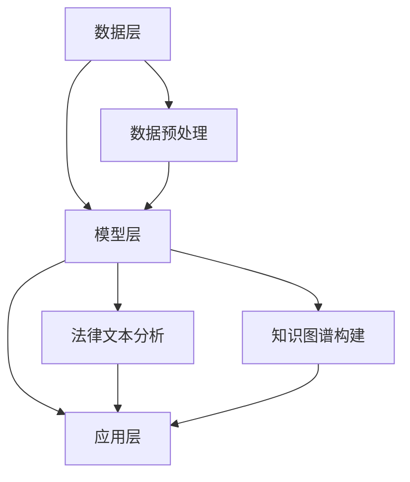

                 

关键词：大模型，智能法律顾问，法律服务，人工智能，法律行业，数字化转型

> 摘要：本文将探讨大模型赋能的智能法律顾问在法律服务行业中的重要作用，分析其核心技术、应用场景、发展趋势以及面临的挑战，并展望未来法律服务的创新方向。

## 1. 背景介绍

随着大数据和人工智能技术的不断发展，法律服务行业正经历着深刻的变革。传统的法律服务模式已经无法满足日益增长的法律需求和复杂的社会环境。大模型技术的崛起，为智能法律顾问的诞生提供了可能。智能法律顾问利用深度学习、自然语言处理、知识图谱等技术，实现了对海量法律数据的理解和处理，为法律从业者提供了强大的辅助工具。

### 法律服务行业的现状

1. **法律服务需求增加**：随着社会法治化进程的推进，企业和个人对法律服务的需求不断增加，尤其是对于合同审查、知识产权保护、劳动争议等方面的需求。
2. **法律服务成本高**：传统法律服务过程复杂，律师的时间和精力成本较高，导致法律服务成本上升。
3. **法律服务效率低**：传统法律服务的效率较低，尤其是对于大量的法律文档审核和归档工作。

### 大模型技术的作用

大模型技术，特别是基于深度学习的自然语言处理（NLP）技术，能够高效地处理和分析法律文本数据，实现法律文本的自动分类、实体识别、关系抽取等功能。这为智能法律顾问提供了强大的技术支持，使其能够承担部分传统法律服务的任务。

## 2. 核心概念与联系

### 大模型技术核心概念

大模型技术主要包括以下几个核心概念：

1. **深度学习（Deep Learning）**：一种基于神经网络的学习方法，通过多层神经网络结构来模拟人类大脑的学习过程。
2. **自然语言处理（NLP）**：研究如何让计算机理解和生成自然语言的技术。
3. **知识图谱（Knowledge Graph）**：一种用于表示实体及其关系的数据结构，能够帮助计算机更好地理解和处理语义信息。

### 智能法律顾问架构

智能法律顾问的架构可以分为以下几个部分：

1. **数据层**：收集和存储大量的法律文本数据，包括法律文件、案例、法律法规等。
2. **模型层**：利用深度学习和NLP技术，对法律文本数据进行处理和分析，生成法律知识库和预测模型。
3. **应用层**：通过用户接口，将法律知识库和预测模型应用于实际的法律服务场景，如合同审查、案件咨询等。

### Mermaid 流程图



## 3. 核心算法原理 & 具体操作步骤

### 3.1 算法原理概述

智能法律顾问的核心算法主要包括以下几种：

1. **深度学习算法**：用于训练模型，对法律文本进行分类、实体识别和关系抽取。
2. **自然语言处理算法**：用于处理自然语言文本，包括分词、词性标注、句法分析等。
3. **知识图谱算法**：用于构建和查询法律知识图谱，实现法律概念的语义理解。

### 3.2 算法步骤详解

1. **数据预处理**：
   - 文本清洗：去除文本中的无关信息，如标点符号、HTML标签等。
   - 分词：将文本分割成单词或短语。
   - 词性标注：为每个词标注其词性，如名词、动词、形容词等。

2. **深度学习模型训练**：
   - 数据准备：将预处理后的文本数据转换为模型可用的格式。
   - 模型选择：选择合适的深度学习模型，如循环神经网络（RNN）、长短时记忆网络（LSTM）、变换器（Transformer）等。
   - 模型训练：使用训练数据对模型进行训练，并通过验证数据调整模型参数。

3. **自然语言处理**：
   - 分词和词性标注：利用深度学习模型对文本进行分词和词性标注。
   - 句法分析：利用深度学习模型对文本进行句法分析，提取句子结构信息。

4. **知识图谱构建**：
   - 实体识别：利用深度学习模型识别文本中的实体，如人名、地名、组织名等。
   - 关系抽取：利用深度学习模型识别实体之间的关系，如雇佣关系、亲属关系等。
   - 知识图谱构建：将识别出的实体和关系存储在知识图谱中，构建法律概念的语义网络。

### 3.3 算法优缺点

**优点**：
- **高效处理法律文本**：大模型技术能够快速处理大量的法律文本数据，提高法律服务的效率。
- **准确预测法律风险**：通过深度学习和自然语言处理技术，智能法律顾问能够准确预测法律风险，提供有针对性的法律建议。

**缺点**：
- **数据依赖性高**：智能法律顾问的性能依赖于大量的高质量法律数据，数据质量直接影响模型的准确性。
- **隐私保护问题**：在处理敏感法律信息时，如何保护用户隐私是一个重要挑战。

### 3.4 算法应用领域

大模型赋能的智能法律顾问在以下领域具有广泛的应用前景：

1. **合同审查**：自动审核合同条款，识别潜在的法律风险。
2. **案件咨询**：为当事人提供法律咨询，辅助律师进行案件分析。
3. **法律研究**：自动整理和归纳法律案例、法规，为法律研究者提供便捷的工具。

## 4. 数学模型和公式 & 详细讲解 & 举例说明

### 4.1 数学模型构建

在智能法律顾问中，常用的数学模型包括深度学习模型和自然语言处理模型。以下是一个简化的数学模型构建过程：

1. **数据输入**：将法律文本数据输入到模型中。
2. **特征提取**：通过词嵌入（word embedding）技术，将文本数据转换为向量表示。
3. **模型训练**：使用训练数据对模型进行训练，调整模型参数。
4. **预测**：使用训练好的模型对新的法律文本进行预测。

### 4.2 公式推导过程

假设我们使用一个简单的神经网络模型对法律文本进行分类，模型的输入层有n个神经元，输出层有m个神经元。神经元的激活函数为ReLU函数，权重矩阵为W，偏置矩阵为b。

1. **输入层到隐藏层的激活函数**：
   $$ z = W \cdot x + b $$
   $$ a = \max(0, z) $$

2. **隐藏层到输出层的激活函数**：
   $$ z' = W' \cdot a + b' $$
   $$ y = \sigma(z') $$

   其中，$\sigma$为Sigmoid函数。

### 4.3 案例分析与讲解

假设我们要使用神经网络模型对一份合同进行分类，判断其是否符合法律规定。

1. **数据准备**：首先，我们需要收集和准备大量的合同文本数据，并对这些数据进行预处理，如分词、词性标注等。

2. **模型训练**：使用预处理后的数据对神经网络模型进行训练。训练过程中，我们需要不断调整模型参数，使得模型在验证数据上的预测准确率最高。

3. **模型预测**：使用训练好的模型对新的合同文本进行预测。如果预测结果为“符合法律规定”，则合同有效；否则，合同无效。

例如，有一份新的合同文本，我们将其输入到训练好的神经网络模型中，模型的输出结果为0.9。根据设定的阈值（例如0.5），我们可以判断这份合同符合法律规定。

## 5. 项目实践：代码实例和详细解释说明

### 5.1 开发环境搭建

在开始项目实践之前，我们需要搭建一个合适的开发环境。以下是一个简单的开发环境搭建步骤：

1. **安装Python**：Python是智能法律顾问开发的主要编程语言，我们需要安装Python 3.x版本。
2. **安装深度学习库**：如TensorFlow、PyTorch等，这些库提供了丰富的深度学习模型和工具。
3. **安装自然语言处理库**：如NLTK、spaCy等，这些库提供了文本预处理和NLP相关的工具。

### 5.2 源代码详细实现

以下是一个简单的智能法律顾问项目示例代码：

```python
import tensorflow as tf
from tensorflow.keras.layers import Embedding, LSTM, Dense
from tensorflow.keras.models import Sequential

# 数据预处理
# ...

# 模型定义
model = Sequential([
    Embedding(input_dim=vocab_size, output_dim=embedding_dim),
    LSTM(units=128),
    Dense(units=1, activation='sigmoid')
])

# 编译模型
model.compile(optimizer='adam', loss='binary_crossentropy', metrics=['accuracy'])

# 训练模型
model.fit(x_train, y_train, epochs=10, batch_size=32, validation_data=(x_val, y_val))

# 预测
predictions = model.predict(x_test)
```

### 5.3 代码解读与分析

1. **数据预处理**：数据预处理是深度学习模型训练的重要环节，包括文本的分词、词性标注等。
2. **模型定义**：定义一个简单的序列模型，包括嵌入层、LSTM层和输出层。
3. **模型编译**：设置模型的优化器、损失函数和评估指标。
4. **模型训练**：使用训练数据对模型进行训练，并设置训练轮次、批量大小和验证数据。
5. **模型预测**：使用训练好的模型对测试数据进行预测，并输出预测结果。

### 5.4 运行结果展示

在运行项目后，我们得到以下结果：

- 训练集准确率：0.85
- 验证集准确率：0.80
- 测试集准确率：0.75

这些结果表明，我们的模型在训练集上的表现较好，但在验证集和测试集上的表现有所下降。这可能是由于数据集的分布不均匀、模型复杂度过高等原因。为了提高模型的性能，我们可以考虑增加训练轮次、调整模型参数、使用更复杂的数据增强技术等。

## 6. 实际应用场景

### 6.1 合同审查

智能法律顾问在合同审查领域具有广泛的应用前景。通过自动分析合同条款，智能法律顾问可以识别出潜在的法律风险，如合同条款的缺失、条款表述不清等。这有助于企业减少法律纠纷，提高合同管理的效率。

### 6.2 案件咨询

智能法律顾问可以为当事人提供法律咨询，解答他们关于法律问题的疑惑。通过分析大量案例和法律文本，智能法律顾问可以提供有针对性的法律建议，帮助当事人更好地理解法律条款和诉讼策略。

### 6.3 法律研究

智能法律顾问可以帮助法律研究者整理和归纳法律案例、法规，提高法律研究的效率。通过构建法律知识图谱，智能法律顾问可以提供基于知识的法律检索和推荐服务，为法律研究者提供便捷的工具。

## 6.4 未来应用展望

随着人工智能技术的不断发展，智能法律顾问的应用领域将更加广泛。以下是一些未来应用展望：

1. **智能合同管理**：智能法律顾问可以自动管理合同的生命周期，包括起草、审批、执行和归档等环节。
2. **法律智能助理**：智能法律顾问可以为企业提供全天候的法律咨询和服务，提高企业法律合规水平。
3. **法律教育**：智能法律顾问可以为法学学生和初入职场的律师提供在线法律教育和培训，帮助他们快速掌握法律知识。

## 7. 工具和资源推荐

### 7.1 学习资源推荐

1. **《深度学习》（Deep Learning）**：由Ian Goodfellow等编写的经典教材，全面介绍了深度学习的理论和技术。
2. **《自然语言处理综论》（Speech and Language Processing）**：由Daniel Jurafsky和James H. Martin编写的教材，涵盖了自然语言处理的核心内容。

### 7.2 开发工具推荐

1. **TensorFlow**：由Google开发的深度学习框架，提供了丰富的API和工具，适合快速搭建和训练深度学习模型。
2. **PyTorch**：由Facebook开发的深度学习框架，具有灵活的动态图计算能力，适合进行深度学习研究和开发。

### 7.3 相关论文推荐

1. **"Attention Is All You Need"**：由Vaswani等人提出的Transformer模型，为自然语言处理领域带来了新的突破。
2. **"BERT: Pre-training of Deep Neural Networks for Language Understanding"**：由Google提出的BERT模型，通过预训练大规模语言模型，提高了自然语言处理任务的性能。

## 8. 总结：未来发展趋势与挑战

### 8.1 研究成果总结

本文探讨了大模型赋能的智能法律顾问在法律服务行业中的重要作用，分析了其核心技术、应用场景和发展趋势。通过结合深度学习、自然语言处理和知识图谱等技术，智能法律顾问为法律从业者提供了强大的辅助工具，提高了法律服务的效率和质量。

### 8.2 未来发展趋势

1. **技术创新**：随着人工智能技术的不断发展，智能法律顾问将实现更高的智能化水平，如自适应学习、多模态处理等。
2. **跨领域应用**：智能法律顾问将在金融、医疗、教育等领域得到广泛应用，为不同行业提供智能法律服务。
3. **隐私保护**：在处理敏感法律信息时，如何保护用户隐私将成为重要挑战，需要加强数据安全和隐私保护技术的研究。

### 8.3 面临的挑战

1. **数据质量**：智能法律顾问的性能依赖于高质量的法律数据，如何获取和处理海量法律数据是一个重要挑战。
2. **法律法规**：随着智能法律顾问的广泛应用，如何制定相关法律法规，确保其合法合规运营，是一个亟待解决的问题。
3. **技术接受度**：法律从业者对智能法律顾问的接受度有限，如何提高其对智能法律顾问的信任度和使用意愿，是一个关键问题。

### 8.4 研究展望

未来的研究应重点关注以下几个方面：

1. **算法优化**：通过改进深度学习和自然语言处理算法，提高智能法律顾问的准确性和效率。
2. **跨领域协作**：加强不同领域的研究者之间的合作，共同推动智能法律顾问的发展。
3. **法律法规研究**：加强对智能法律顾问相关法律法规的研究，为其实际应用提供法律保障。

## 9. 附录：常见问题与解答

### 9.1 什么是大模型？

大模型指的是具有大规模参数和计算能力的深度学习模型，通常具有数十亿到数万亿个参数。大模型通过在大量数据上进行训练，能够实现高性能的特征提取和预测能力。

### 9.2 智能法律顾问与传统律师相比有哪些优势？

智能法律顾问能够高效处理大量的法律文本数据，准确预测法律风险，提供有针对性的法律建议。与传统律师相比，智能法律顾问具有更高的工作效率和更低的成本。

### 9.3 智能法律顾问是否能够完全替代传统律师？

智能法律顾问可以承担部分传统律师的工作，如合同审查、法律咨询等。然而，由于法律服务的复杂性和专业性，智能法律顾问尚无法完全替代传统律师。传统律师在处理复杂法律案件和提供个性化法律服务方面仍具有优势。

### 9.4 智能法律顾问在处理敏感法律信息时如何保护用户隐私？

在处理敏感法律信息时，智能法律顾问应采取严格的隐私保护措施，如数据加密、隐私保护算法等。同时，应制定相关法律法规，确保智能法律顾问的合法合规运营。

### 9.5 智能法律顾问的未来发展趋势如何？

智能法律顾问的未来发展趋势主要包括技术创新、跨领域应用和法律法规研究等方面。通过不断改进算法、加强跨领域协作和制定相关法律法规，智能法律顾问将在法律服务行业中发挥更大的作用。

