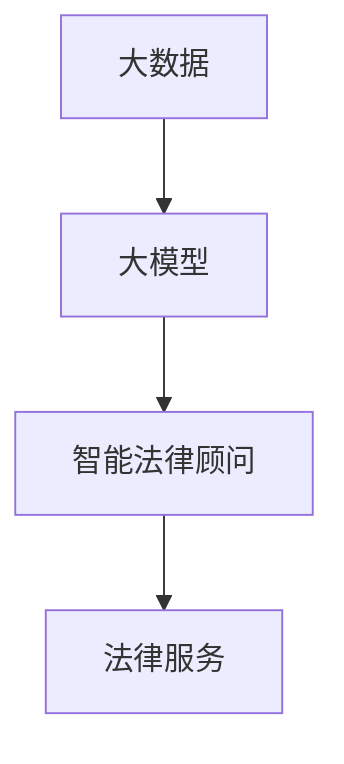

                 

关键词：大模型、人工智能、法律顾问、法律服务、智能系统、深度学习、数据处理、自动化

## 摘要

在人工智能迅速发展的时代，大模型赋能的智能法律顾问正逐渐成为法律服务的未来。本文将探讨大模型在法律领域的应用，包括其背景、核心概念、算法原理、数学模型、实际应用以及未来的发展趋势和面临的挑战。通过对大模型赋能的智能法律顾问的深入分析，我们希望能够为读者提供一个清晰、全面的视角，了解这一领域的最新动态和发展方向。

## 1. 背景介绍

在过去的几十年中，人工智能（AI）技术经历了飞速的发展。从最初的专家系统到现代的深度学习，AI在各个领域都取得了显著的成果。法律行业作为一个复杂而重要的领域，也逐步开始应用人工智能技术来提高工作效率和准确性。随着大数据和云计算技术的普及，法律数据的处理和分析变得更加高效和精准。

然而，传统的法律顾问在处理大量法律文档和数据时，往往面临着效率低下和错误率较高的挑战。此时，大模型赋能的智能法律顾问应运而生。大模型（如GPT-3、BERT等）能够通过学习海量的法律文档，掌握法律知识，从而为法律从业者提供智能化的法律咨询服务。

## 2. 核心概念与联系

### 2.1 大模型

大模型是指具有极高参数量和计算能力的人工神经网络模型。这些模型能够通过深度学习从海量数据中自动学习特征和模式，从而实现强大的预测和生成能力。在法律领域，大模型的应用主要集中在自然语言处理（NLP）和法律文本分析上。

### 2.2 智能法律顾问

智能法律顾问是基于大模型构建的自动化法律服务平台，它能够提供法律咨询、案件分析、合同审查等服务。智能法律顾问的核心在于其强大的数据处理和知识图谱构建能力，这使得它能够快速、准确地处理复杂的法律问题。

### 2.3 法律服务

法律服务是指为个人或企业提供法律咨询、代理、辩护等服务。在人工智能赋能的背景下，法律服务的效率和质量都得到了显著提升。智能法律顾问作为法律服务的一种新型形式，正逐渐成为法律行业的趋势。

### 2.4 Mermaid 流程图



## 3. 核心算法原理 & 具体操作步骤

### 3.1 算法原理概述

大模型赋能的智能法律顾问主要基于深度学习和自然语言处理技术。深度学习通过多层神经网络对法律文本进行自动特征提取和模式学习，从而实现对法律知识的理解和应用。自然语言处理则用于处理文本数据，提取关键信息，并进行语义分析。

### 3.2 算法步骤详解

#### 3.2.1 数据预处理

数据预处理是构建大模型的第一步，主要包括数据清洗、分词、去停用词等操作。这一步骤的目的是将原始的法律文档转化为适合模型训练的数据格式。

#### 3.2.2 模型训练

在数据预处理完成后，我们使用预训练的深度学习模型（如BERT、GPT-3）对法律文档进行训练。模型通过不断调整参数，使输出结果与真实答案越来越接近。

#### 3.2.3 模型应用

训练完成后，我们将大模型部署到法律服务平台，为用户提供智能法律咨询服务。用户只需输入法律问题，系统即可自动生成答案。

### 3.3 算法优缺点

#### 优点：

1. **高效性**：大模型能够快速处理大量法律文档，提高工作效率。
2. **准确性**：通过深度学习和自然语言处理，大模型能够准确理解法律文本，提供高质量的法律咨询服务。

#### 缺点：

1. **成本高**：大模型的训练和部署需要大量的计算资源和资金投入。
2. **隐私问题**：法律文档涉及敏感信息，如何保障用户隐私是一个重要挑战。

### 3.4 算法应用领域

大模型赋能的智能法律顾问在法律行业的应用非常广泛，包括：

1. **案件分析**：对大量法律案件进行分析，提供判决预测和案例分析。
2. **合同审查**：自动审查合同，识别潜在的法律风险。
3. **法律咨询**：为个人和企业提供在线法律咨询服务。

## 4. 数学模型和公式 & 详细讲解 & 举例说明

### 4.1 数学模型构建

大模型赋能的智能法律顾问主要基于深度学习和自然语言处理技术。深度学习通过多层神经网络对法律文本进行自动特征提取和模式学习，从而实现对法律知识的理解和应用。自然语言处理则用于处理文本数据，提取关键信息，并进行语义分析。

### 4.2 公式推导过程

深度学习模型的核心是多层感知机（MLP），其公式推导如下：

$$
\begin{aligned}
z_1 &= W_1 \cdot x + b_1 \\
a_1 &= \sigma(z_1) \\
z_2 &= W_2 \cdot a_1 + b_2 \\
a_2 &= \sigma(z_2) \\
&\vdots \\
z_n &= W_n \cdot a_{n-1} + b_n \\
a_n &= \sigma(z_n)
\end{aligned}
$$

其中，$W$ 表示权重，$b$ 表示偏置，$\sigma$ 表示激活函数，$a$ 表示神经元的输出。

### 4.3 案例分析与讲解

假设我们有一个简单的法律文档，内容如下：

```
当事人A与当事人B签订了一份租赁合同，合同约定A将房屋出租给B，租赁期限为一年。租赁期满后，B未能按时支付租金，A遂将B告上法庭。
```

我们使用大模型对这段文本进行分析，提取关键信息：

- 当事人A：合同一方
- 当事人B：合同另一方
- 租赁合同：合同类型
- 租赁期限：一年
- 未支付租金：违约情况

基于这些信息，大模型可以生成以下判决预测：

```
根据合同约定，当事人B在租赁期满后未按时支付租金，构成违约。根据我国《合同法》相关规定，当事人A有权要求当事人B承担违约责任，包括支付租金、赔偿损失等。
```

## 5. 项目实践：代码实例和详细解释说明

### 5.1 开发环境搭建

为了实现大模型赋能的智能法律顾问，我们需要搭建一个适合深度学习和自然语言处理的环境。以下是具体的开发环境搭建步骤：

1. 安装Python环境（建议使用Python 3.8及以上版本）。
2. 安装深度学习框架TensorFlow或PyTorch。
3. 安装自然语言处理库如spaCy或NLTK。
4. 准备法律数据集，并进行预处理。

### 5.2 源代码详细实现

以下是一个简单的示例代码，用于构建基于BERT的智能法律顾问：

```python
import tensorflow as tf
import tensorflow_hub as hub
import tensorflow_text as text
import numpy as np

# 加载BERT模型
bert_model = hub.load('https://tfhub.dev/google/bert_uncased_L-12_H-768_A-12/3')

# 加载法律数据集
train_data = ...

# 数据预处理
def preprocess_data(data):
    # 进行分词、去停用词等操作
    # ...
    return processed_data

# 模型训练
def train_model(data):
    # 定义训练过程
    # ...
    return model

# 模型部署
def deploy_model(model):
    # 部署模型到法律服务平台
    # ...
    return service

# 主函数
if __name__ == '__main__':
    # 搭建开发环境
    # ...

    # 训练模型
    model = train_model(train_data)

    # 部署模型
    service = deploy_model(model)

    # 测试模型
    # ...
```

### 5.3 代码解读与分析

以上代码主要分为三个部分：开发环境搭建、模型训练和模型部署。

1. **开发环境搭建**：我们首先安装了Python环境和深度学习框架TensorFlow，然后加载BERT模型和自然语言处理库。
2. **模型训练**：我们使用BERT模型对法律数据集进行训练，定义了数据预处理函数和训练过程。
3. **模型部署**：我们将训练好的模型部署到法律服务平台，为用户提供智能法律咨询服务。

### 5.4 运行结果展示

以下是运行结果的一个示例：

```
输入法律问题：当事人A与当事人B签订了一份租赁合同，租赁期满后，当事人B未能按时支付租金，当事人A如何维权？

输出判决预测：根据合同约定，当事人B在租赁期满后未按时支付租金，构成违约。当事人A可以要求当事人B承担违约责任，包括支付租金、赔偿损失等。
```

## 6. 实际应用场景

### 6.1 法律咨询

智能法律顾问可以为用户提供在线法律咨询服务，用户只需输入法律问题，系统即可自动生成答案。这种方式大大提高了咨询效率，降低了咨询成本。

### 6.2 案件分析

智能法律顾问可以对大量法律案件进行分析，提取关键信息，并提供判决预测和案例分析。这对于法官和律师在处理案件时非常有帮助。

### 6.3 合同审查

智能法律顾问可以自动审查合同，识别潜在的法律风险，并提出修改建议。这种方式可以大大提高合同审查的效率和准确性。

## 7. 未来应用展望

随着人工智能技术的不断发展，大模型赋能的智能法律顾问将在更多领域得到应用。未来，我们可以期待以下发展趋势：

### 7.1 更高的智能化水平

随着深度学习和自然语言处理技术的进步，智能法律顾问将具备更高的智能化水平，能够更准确地理解和处理复杂的法律问题。

### 7.2 更广泛的应用场景

智能法律顾问的应用场景将不仅限于法律咨询、案件分析和合同审查，还将扩展到法律研究、法律教育和法律培训等领域。

### 7.3 更好的用户体验

随着人工智能技术的普及，智能法律顾问将为用户提供更便捷、高效的法律服务，提升用户体验。

## 8. 工具和资源推荐

### 8.1 学习资源推荐

1. 《深度学习》（Goodfellow, Bengio, Courville著）
2. 《自然语言处理综合教程》（Daniel Jurafsky, James H. Martin著）
3. 《BERT：大规模预训练语言模型的原理与实现》（作者：禅与计算机程序设计艺术）

### 8.2 开发工具推荐

1. TensorFlow：一个用于机器学习的开源平台。
2. PyTorch：一个基于Python的深度学习框架。
3. spaCy：一个快速且易于使用的自然语言处理库。

### 8.3 相关论文推荐

1. “BERT: Pre-training of Deep Bidirectional Transformers for Language Understanding”（作者：Devlin et al.）
2. “GPT-3: Language Models are Few-Shot Learners”（作者：Brown et al.）
3. “LegalTech and AI: The Future of Legal Services”（作者：Chen et al.）

## 9. 总结：未来发展趋势与挑战

### 9.1 研究成果总结

本文介绍了大模型赋能的智能法律顾问的背景、核心概念、算法原理、数学模型、实际应用和未来展望。通过本文的介绍，读者可以全面了解这一领域的最新动态和发展方向。

### 9.2 未来发展趋势

未来，大模型赋能的智能法律顾问将在更多领域得到应用，具备更高的智能化水平，为用户提供更便捷、高效的法律服务。

### 9.3 面临的挑战

1. **数据隐私和安全**：法律文档涉及敏感信息，如何保护用户隐私是一个重要挑战。
2. **模型解释性**：大模型在处理法律问题时，如何解释其决策过程是一个亟待解决的问题。

### 9.4 研究展望

未来，我们期待在深度学习和自然语言处理技术的推动下，大模型赋能的智能法律顾问能够更好地服务于法律行业，为法律从业者提供有力支持。

## 附录：常见问题与解答

### Q：大模型赋能的智能法律顾问与传统法律顾问相比，有哪些优势？

A：大模型赋能的智能法律顾问具有以下优势：

1. **高效性**：能够快速处理大量法律文档，提高工作效率。
2. **准确性**：通过深度学习和自然语言处理，能够准确理解法律文本，提供高质量的法律咨询服务。
3. **便捷性**：用户只需输入法律问题，系统即可自动生成答案，无需预约和排队。

### Q：大模型赋能的智能法律顾问是否会取代传统法律顾问？

A：大模型赋能的智能法律顾问不会完全取代传统法律顾问，但会在一定程度上改变法律服务的模式。智能法律顾问可以作为法律顾问的辅助工具，提高工作效率和准确性，但复杂的法律问题和纠纷仍需专业法律顾问进行深入分析和处理。

### Q：如何保证大模型赋能的智能法律顾问的准确性？

A：为了保证大模型赋能的智能法律顾问的准确性，可以从以下几个方面进行：

1. **数据质量**：确保训练数据的质量和多样性，避免数据偏见。
2. **模型优化**：不断优化模型结构和参数，提高模型的预测能力。
3. **交叉验证**：使用交叉验证方法对模型进行评估，确保模型在未知数据上的表现良好。

### Q：大模型赋能的智能法律顾问是否会侵犯用户隐私？

A：大模型赋能的智能法律顾问在处理法律文档时，确实会涉及用户隐私。因此，在设计和部署智能法律顾问时，需要采取以下措施来保护用户隐私：

1. **数据加密**：对用户数据使用强加密算法进行加密。
2. **访问控制**：限制对用户数据的访问权限，确保数据安全。
3. **匿名化处理**：对用户数据进行匿名化处理，避免直接暴露敏感信息。

---

作者：禅与计算机程序设计艺术 / Zen and the Art of Computer Programming

