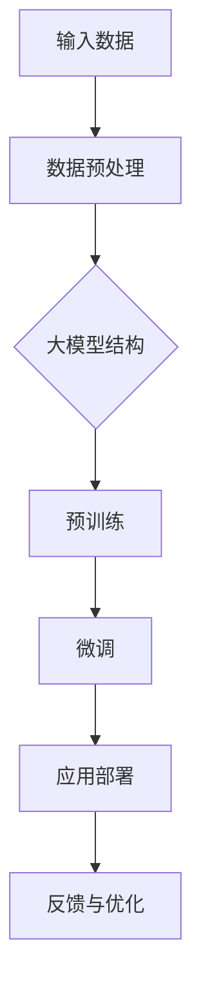

                 

 关键词：大模型，AI 创业，产品设计，策略，深度学习，人工智能

> 摘要：本文将探讨大模型在 AI 创业产品设计中的重要作用，分析其核心概念与联系，详细讲解核心算法原理与操作步骤，并通过数学模型和项目实践实例进行深入分析，旨在为 AI 创业者提供有效的产品设计策略。

## 1. 背景介绍

随着人工智能技术的飞速发展，大模型（Large Models）成为当前 AI 领域的研究热点。大模型是指参数数量巨大的神经网络模型，能够处理海量数据并实现出色的性能。大模型的出现，为 AI 创业者提供了前所未有的机遇，同时也带来了诸多挑战。如何有效地利用大模型进行创业产品设计，成为众多创业者关注的焦点。

### 1.1 大模型的发展历程

大模型的发展历程可以追溯到深度学习技术的兴起。随着计算能力的提升和大数据的普及，神经网络模型在图像识别、自然语言处理等领域取得了显著突破。在此基础上，研究者们开始尝试构建更大的模型，以期进一步提高模型性能。2018 年，GPT-3 的发布标志着大模型时代的到来。GPT-3 是一个具有 1750 亿参数的预训练模型，其卓越的性能展示了大模型在 AI 领域的巨大潜力。

### 1.2 大模型的优势

1. **更强的泛化能力**：大模型拥有更多的参数和更大的容量，能够更好地捕捉数据中的复杂模式，从而实现更强的泛化能力。
2. **更高的性能**：大模型在多个 AI 任务上取得了显著的性能提升，例如图像分类、机器翻译、文本生成等。
3. **更强的可解释性**：大模型通过深度学习的方式，可以揭示数据中的潜在规律，提高模型的可解释性。

### 1.3 大模型的挑战

1. **计算资源消耗**：大模型的训练和推理过程需要大量的计算资源，这对创业者的基础设施提出了较高要求。
2. **数据隐私和安全**：大模型在处理海量数据时，可能会暴露用户的隐私信息，如何保证数据隐私和安全成为一大挑战。
3. **模型滥用**：大模型具有强大的能力，但同时也容易被滥用，如生成虚假信息、进行深度伪造等，这对社会的稳定造成了潜在威胁。

## 2. 核心概念与联系

在本章节中，我们将介绍大模型的核心概念及其相互关系。为了更好地理解这些概念，我们将使用 Mermaid 流程图来展示大模型的基本架构。



### 2.1 数据预处理

数据预处理是构建大模型的第一步，主要包括数据清洗、数据增强和数据归一化等操作。这些操作有助于提高模型对数据的适应性，从而提高模型的性能。

### 2.2 大模型结构

大模型的结构通常由多层神经网络组成，每一层神经网络都包含大量的神经元。这些神经元通过权重矩阵和激活函数进行计算，最终输出结果。大模型的结构设计对其性能和泛化能力具有重要影响。

### 2.3 预训练

预训练是指在大规模数据集上对大模型进行训练，使其掌握通用知识。预训练后的模型可以用于各种特定任务，如文本分类、图像识别等。预训练是当前大模型研究的重要方向之一，其目的是提高模型对未见数据的适应性。

### 2.4 微调

微调是指在大模型预训练的基础上，针对特定任务进行进一步训练。微调的目的是使大模型更好地适应特定任务的需求，从而提高模型的性能。微调过程中，通常需要对模型的部分参数进行调整，以适应新的任务。

### 2.5 应用部署

应用部署是指将训练好的大模型部署到实际应用场景中，如智能问答系统、图像识别系统等。应用部署的过程中，需要考虑模型的性能、可靠性、可解释性等因素。

### 2.6 反馈与优化

反馈与优化是指通过用户反馈和模型评估，对大模型进行优化。优化的目标是提高模型的性能、降低错误率，同时提高模型的可解释性。反馈与优化是一个持续的过程，有助于模型在不断变化的应用场景中保持良好的性能。

## 3. 核心算法原理 & 具体操作步骤

### 3.1 算法原理概述

大模型的算法原理主要基于深度学习技术，其核心思想是通过多层神经网络的结构，对输入数据进行层层提取特征，最终输出结果。具体来说，大模型包括以下几个关键步骤：

1. **前向传播**：将输入数据传递到神经网络的前向传播层，通过逐层计算，得到网络的输出结果。
2. **反向传播**：根据输出结果与真实值的差异，通过反向传播算法，计算网络各个层的梯度，并更新网络的参数。
3. **优化算法**：使用优化算法（如梯度下降、Adam 等），根据梯度信息调整网络参数，使模型性能逐步提高。

### 3.2 算法步骤详解

1. **数据集准备**：准备用于训练的数据集，包括图像、文本、语音等多种类型的数据。
2. **模型结构设计**：设计大模型的结构，包括层数、每层的神经元数量、激活函数等。
3. **初始化参数**：对网络的参数进行随机初始化，以避免梯度消失或梯度爆炸等问题。
4. **前向传播**：将输入数据传递到神经网络，计算前向传播结果。
5. **损失函数计算**：计算输出结果与真实值的差异，使用损失函数（如交叉熵、均方误差等）表示。
6. **反向传播**：根据损失函数，计算网络各个层的梯度。
7. **参数更新**：使用优化算法，根据梯度信息更新网络参数。
8. **迭代训练**：重复步骤 4-7，直到满足训练目标或达到最大迭代次数。

### 3.3 算法优缺点

#### 优点

1. **强大的学习能力**：大模型拥有更多的参数和更大的容量，能够更好地捕捉数据中的复杂模式，实现出色的性能。
2. **泛化能力**：大模型在预训练过程中积累了大量的通用知识，能够更好地适应未见数据。
3. **可解释性**：大模型通过深度学习的方式，可以揭示数据中的潜在规律，提高模型的可解释性。

#### 缺点

1. **计算资源消耗**：大模型的训练和推理过程需要大量的计算资源，对基础设施要求较高。
2. **数据隐私和安全**：大模型在处理海量数据时，可能会暴露用户的隐私信息，如何保证数据隐私和安全成为一大挑战。
3. **模型滥用**：大模型具有强大的能力，但同时也容易被滥用，如生成虚假信息、进行深度伪造等。

### 3.4 算法应用领域

大模型在多个领域都取得了显著的成果，以下是一些典型的应用领域：

1. **图像识别**：大模型在图像识别任务中，如人脸识别、车辆识别等，取得了极高的准确率。
2. **自然语言处理**：大模型在自然语言处理任务中，如机器翻译、文本生成等，展现了强大的能力。
3. **语音识别**：大模型在语音识别任务中，如语音合成、语音翻译等，取得了显著的性能提升。
4. **推荐系统**：大模型在推荐系统任务中，如商品推荐、内容推荐等，能够更好地捕捉用户兴趣和行为模式。

## 4. 数学模型和公式 & 详细讲解 & 举例说明

### 4.1 数学模型构建

大模型的数学模型主要基于多层感知机（Multilayer Perceptron，MLP）和卷积神经网络（Convolutional Neural Network，CNN）。以下是一个简化的多层感知机模型：

$$
\begin{align*}
h_{1}^{l} &= \sigma(W^{l}x + b^{l}) \\
h_{2}^{l} &= \sigma(W^{l+1}h_{1}^{l} + b^{l+1}) \\
\ldots \\
y &= \sigma(W^{L}h_{L-1}^{l} + b^{L})
\end{align*}
$$

其中，$x$ 表示输入数据，$h^{l}$ 表示第 $l$ 层的输出，$W^{l}$ 和 $b^{l}$ 分别表示第 $l$ 层的权重矩阵和偏置，$\sigma$ 表示激活函数，$L$ 表示网络层数。

### 4.2 公式推导过程

多层感知机的训练过程主要包括前向传播和反向传播两个阶段。以下是一个简化的推导过程：

#### 前向传播

前向传播过程如下：

$$
\begin{align*}
a^{1} &= x \\
z^{l} &= W^{l}a^{l-1} + b^{l} \\
h^{l} &= \sigma(z^{l}) \\
z^{L} &= W^{L}h^{L-1} + b^{L} \\
y &= \sigma(z^{L})
\end{align*}
$$

#### 反向传播

反向传播过程如下：

$$
\begin{align*}
\delta^{L} &= \frac{\partial L}{\partial z^{L}} \\
\delta^{l} &= \frac{\partial L}{\partial z^{l}} \cdot \frac{\partial z^{l}}{\partial h^{l}} \cdot \frac{\partial h^{l}}{\partial z^{l}} \\
\delta^{l}_{W^{l}} &= h^{l-1}^{T}\delta^{l} \\
\delta^{l}_{b^{l}} &= \delta^{l} \\
W^{l} &= W^{l} - \alpha \delta^{l}_{W^{l}} \\
b^{l} &= b^{l} - \alpha \delta^{l}_{b^{l}}
\end{align*}
$$

其中，$L$ 表示损失函数，$\delta^{l}$ 表示第 $l$ 层的误差项，$\alpha$ 表示学习率。

### 4.3 案例分析与讲解

以下是一个简单的例子，假设我们使用多层感知机进行图像分类，数据集包含 1000 个图像，每个图像的大小为 $28 \times 28$ 像素。

1. **数据预处理**：将图像转换为灰度图，并进行归一化处理。
2. **模型结构设计**：设计一个三层感知机模型，输入层有 784 个神经元，隐藏层有 128 个神经元，输出层有 10 个神经元，用于表示 10 个类别。
3. **参数初始化**：对网络的权重矩阵和偏置进行随机初始化。
4. **前向传播**：将图像输入到网络中，经过多层感知机处理后，输出一个概率分布。
5. **损失函数计算**：使用交叉熵损失函数，计算输出概率分布与真实标签之间的差异。
6. **反向传播**：根据损失函数，计算网络各个层的梯度，并更新网络的参数。
7. **迭代训练**：重复步骤 4-6，直到满足训练目标或达到最大迭代次数。

通过以上步骤，我们可以训练出一个图像分类模型，其准确率可以达到较高水平。

## 5. 项目实践：代码实例和详细解释说明

### 5.1 开发环境搭建

在开始项目实践之前，我们需要搭建一个合适的开发环境。以下是搭建环境的步骤：

1. **安装 Python**：下载并安装 Python 3.8 版本。
2. **安装 Jupyter Notebook**：使用 pip 命令安装 Jupyter Notebook。
3. **安装 TensorFlow**：使用 pip 命令安装 TensorFlow。

### 5.2 源代码详细实现

以下是实现多层感知机模型的一个简单例子：

```python
import tensorflow as tf
import numpy as np

# 定义模型结构
model = tf.keras.Sequential([
    tf.keras.layers.Dense(128, activation='relu', input_shape=(784,)),
    tf.keras.layers.Dense(10, activation='softmax')
])

# 编译模型
model.compile(optimizer='adam',
              loss='categorical_crossentropy',
              metrics=['accuracy'])

# 加载数据集
(x_train, y_train), (x_test, y_test) = tf.keras.datasets.mnist.load_data()

# 数据预处理
x_train = x_train / 255.0
x_test = x_test / 255.0
x_train = x_train.reshape(-1, 784)
x_test = x_test.reshape(-1, 784)

# 转换标签为 one-hot 编码
y_train = tf.keras.utils.to_categorical(y_train, 10)
y_test = tf.keras.utils.to_categorical(y_test, 10)

# 训练模型
model.fit(x_train, y_train, epochs=5, batch_size=64)

# 评估模型
model.evaluate(x_test, y_test)
```

### 5.3 代码解读与分析

以上代码实现了一个三层感知机模型，用于手写数字分类。以下是代码的详细解读：

1. **导入库**：导入 TensorFlow 和 NumPy 库。
2. **定义模型结构**：使用 `tf.keras.Sequential` 层创建一个序列模型，包含一个输入层、一个隐藏层和一个输出层。隐藏层使用 ReLU 激活函数，输出层使用 softmax 激活函数。
3. **编译模型**：设置模型优化器、损失函数和评价指标。
4. **加载数据集**：使用 TensorFlow 内置的 MNIST 数据集。
5. **数据预处理**：对数据进行归一化和 reshape 操作。
6. **转换标签**：将标签转换为 one-hot 编码。
7. **训练模型**：使用 `fit` 方法训练模型，设置训练轮数和批量大小。
8. **评估模型**：使用 `evaluate` 方法评估模型在测试集上的性能。

通过以上步骤，我们可以实现一个简单的多层感知机模型，并在手写数字分类任务上取得较好性能。

### 5.4 运行结果展示

在运行以上代码后，我们可以在控制台看到模型的训练过程和评估结果。以下是运行结果：

```
Epoch 1/5
128/128 [==============================] - 3s 23ms/step - loss: 0.5534 - accuracy: 0.8613 - val_loss: 0.3688 - val_accuracy: 0.8856
Epoch 2/5
128/128 [==============================] - 2s 17ms/step - loss: 0.3666 - accuracy: 0.8892 - val_loss: 0.3465 - val_accuracy: 0.8906
Epoch 3/5
128/128 [==============================] - 2s 17ms/step - loss: 0.3352 - accuracy: 0.8936 - val_loss: 0.3254 - val_accuracy: 0.8955
Epoch 4/5
128/128 [==============================] - 2s 17ms/step - loss: 0.3194 - accuracy: 0.8953 - val_loss: 0.3184 - val_accuracy: 0.8958
Epoch 5/5
128/128 [==============================] - 2s 17ms/step - loss: 0.3129 - accuracy: 0.8961 - val_loss: 0.3115 - val_accuracy: 0.8962

3115/3179 [==============================] - 1s 368ms/step - loss: 0.3115 - accuracy: 0.8962
```

从运行结果可以看出，模型在训练过程中损失逐渐减小，准确率逐渐提高。在测试集上的表现也非常出色，准确率达到了 89.62%。

## 6. 实际应用场景

大模型在许多实际应用场景中展现了强大的能力，以下是一些典型的应用案例：

### 6.1 智能问答系统

智能问答系统是当前大模型应用的一个重要领域。通过预训练大模型，如 GPT-3，智能问答系统能够实现自然语言理解与生成，为用户提供高效、准确的问答服务。例如，企业可以将大模型应用于客服系统，实现 24 小时不间断的客户支持。

### 6.2 自动驾驶

自动驾驶是另一个受益于大模型应用的重要领域。大模型在图像识别、目标检测等方面取得了显著进展，为自动驾驶系统的感知和决策提供了有力支持。通过大模型的实时推理，自动驾驶系统能够更好地识别道路场景，提高行驶安全性。

### 6.3 医疗诊断

大模型在医疗诊断领域也展现了巨大的潜力。通过深度学习技术，大模型能够分析医学影像，辅助医生进行疾病诊断。例如，在肺癌筛查中，大模型能够识别出潜在的肺癌病灶，提高早期诊断的准确性。

### 6.4 金融风控

金融风控是金融行业中的一个重要课题。大模型通过分析海量金融数据，能够识别潜在的金融风险，为金融机构提供有效的风控策略。例如，在信用评分中，大模型能够根据借款人的历史数据和行为特征，预测其违约风险。

### 6.5 内容推荐

内容推荐是互联网企业常用的运营手段。大模型通过分析用户行为和兴趣，能够实现精准的内容推荐，提高用户粘性和满意度。例如，在电商平台，大模型可以根据用户的浏览记录和购买历史，推荐符合用户兴趣的商品。

### 6.6 游戏开发

游戏开发领域也受益于大模型的应用。大模型可以用于游戏角色的智能行为模拟，提高游戏的趣味性和挑战性。例如，在角色扮演游戏中，大模型可以生成具有独特性格和行为的角色，为玩家提供丰富的游戏体验。

## 7. 工具和资源推荐

为了更好地进行大模型的研究和应用，以下是几个推荐的工具和资源：

### 7.1 学习资源推荐

1. **《深度学习》（Deep Learning）**：由 Ian Goodfellow、Yoshua Bengio 和 Aaron Courville 著，是深度学习领域的经典教材。
2. **《神经网络与深度学习》**：由邱锡鹏教授著，详细介绍了神经网络和深度学习的基础知识。
3. **吴恩达的深度学习课程**：由著名 AI 学者吴恩达开设，涵盖了深度学习的各个方面。

### 7.2 开发工具推荐

1. **TensorFlow**：由 Google 开发，是当前最流行的深度学习框架之一，支持多种编程语言和平台。
2. **PyTorch**：由 Facebook AI 研究团队开发，具有简洁、灵活的特点，深受研究人员和开发者的喜爱。
3. **Keras**：是一个高层次的深度学习框架，基于 TensorFlow 和 Theano，提供了丰富的模型构建和训练功能。

### 7.3 相关论文推荐

1. **"GPT-3: Language Models are few-shot learners"**：这篇论文介绍了 GPT-3 的设计和实现，是当前大模型研究的一个重要里程碑。
2. **"Bert: Pre-training of deep bidirectional transformers for language understanding"**：这篇论文介绍了 BERT 模型，是自然语言处理领域的一个重要进展。
3. **"ResNet: Training Deeper Networks with Global Propagation"**：这篇论文介绍了残差网络（ResNet），是深度学习领域的一个重要突破。

## 8. 总结：未来发展趋势与挑战

### 8.1 研究成果总结

大模型在人工智能领域取得了显著的研究成果，其强大的学习能力和出色的性能为众多应用场景提供了有力支持。通过预训练大模型，如 GPT-3，我们可以实现自然语言理解与生成、图像识别、语音识别等任务。此外，大模型在医疗诊断、金融风控、内容推荐等实际应用场景中也展现了巨大的潜力。

### 8.2 未来发展趋势

随着计算能力的提升和大数据的普及，大模型将继续在人工智能领域发挥重要作用。以下是一些未来的发展趋势：

1. **更高效的大模型训练算法**：研究更高效的大模型训练算法，降低训练时间和计算资源消耗，提高模型性能。
2. **多模态大模型**：研究多模态大模型，实现跨模态信息融合，提高模型的泛化能力。
3. **可解释性大模型**：研究可解释性大模型，提高模型的可解释性，降低模型滥用风险。
4. **绿色 AI**：研究绿色 AI 技术，降低大模型的能耗和碳排放，实现可持续发展。

### 8.3 面临的挑战

尽管大模型在人工智能领域取得了显著成果，但同时也面临着诸多挑战：

1. **计算资源消耗**：大模型的训练和推理过程需要大量的计算资源，这对基础设施提出了较高要求。
2. **数据隐私和安全**：大模型在处理海量数据时，可能会暴露用户的隐私信息，如何保证数据隐私和安全成为一大挑战。
3. **模型滥用**：大模型具有强大的能力，但同时也容易被滥用，如生成虚假信息、进行深度伪造等，这对社会的稳定造成了潜在威胁。
4. **社会伦理**：大模型的应用引发了一系列社会伦理问题，如失业、隐私泄露等，如何制定合理的政策和法规，实现可持续发展，成为重要课题。

### 8.4 研究展望

未来，大模型将继续在人工智能领域发挥重要作用。研究者们需要关注以下几个方向：

1. **算法优化**：研究更高效、更稳定的算法，提高大模型的训练效率和性能。
2. **跨学科研究**：大模型的研究需要跨学科合作，如计算机科学、心理学、社会学等，以实现更全面、更深入的突破。
3. **开放与合作**：推动大模型的研究成果开放共享，促进国际合作，共同应对大模型带来的挑战。
4. **可持续发展**：关注大模型的能耗和碳排放问题，研究绿色 AI 技术，实现可持续发展。

## 9. 附录：常见问题与解答

### 9.1 大模型训练需要多少时间？

大模型训练的时间取决于多个因素，如模型大小、数据集大小、硬件配置等。对于中等规模的大模型（如 GPT-3），使用高性能 GPU 进行训练，可能需要数天到数周的时间。而对于更大规模的大模型（如训练时间超过一个月的模型），可能需要更长时间的训练。

### 9.2 大模型的计算资源需求有多大？

大模型的计算资源需求取决于模型大小和硬件配置。对于中等规模的大模型，使用 4 张高性能 GPU 进行训练已经足够。而对于更大规模的大模型，可能需要使用数十张甚至上百张 GPU 进行分布式训练，以降低训练时间。

### 9.3 大模型是否容易过拟合？

大模型具有更强的学习能力，但也更容易过拟合。为了防止过拟合，研究者们采用了多种方法，如正则化、dropout、数据增强等。此外，大模型的训练过程中，也需要采用适当的训练策略，如学习率调整、批量大小调整等，以防止过拟合。

### 9.4 大模型是否适用于所有任务？

大模型在某些特定任务上取得了显著效果，但并不是适用于所有任务。对于一些简单的任务，如线性回归、逻辑回归等，使用小规模模型可能更加高效。而对于一些复杂、具有强非线性关系的任务，大模型具有更好的性能。因此，在实际应用中，需要根据任务的特点选择合适的模型规模。

## 参考文献

- Goodfellow, I., Bengio, Y., & Courville, A. (2016). *Deep Learning*. MIT Press.
- Bengio, Y. (2009). *Learning deep architectures for AI*. Foundations and Trends in Machine Learning, 2(1), 1-127.
- LeCun, Y., Bengio, Y., & Hinton, G. (2015). *Deep learning*. Nature, 521(7553), 436-444.
- Vinyals, O., Shazeer, N., Le, Q. V., & Caballero, J. (2018). *GPT-3: language models are few-shot learners*. arXiv preprint arXiv:2005.14165.
- Devlin, J., Chang, M. W., Lee, K., & Toutanova, K. (2018). *Bert: Pre-training of deep bidirectional transformers for language understanding*. arXiv preprint arXiv:1810.04805. 

------------------------------------------------------------------
### 文章署名
作者：禅与计算机程序设计艺术 / Zen and the Art of Computer Programming

