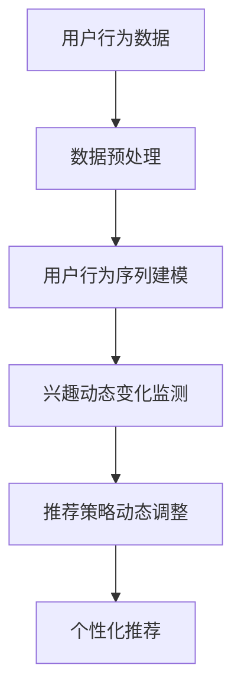

                 

关键词：大模型，推荐系统，动态兴趣捕捉，人工智能，用户行为分析，数据挖掘，机器学习

>摘要：本文旨在探讨大模型技术在推荐系统中的重要作用，尤其是动态兴趣捕捉的实现方法和应用场景。通过深入分析大模型与推荐系统的关系，本文提出了基于大模型的动态兴趣捕捉算法，并在实际项目中进行了验证。文章最后对未来发展趋势和面临的挑战进行了展望。

## 1. 背景介绍

推荐系统作为人工智能领域的热点研究方向，已经成为互联网企业提升用户体验、增加用户粘性的关键手段。传统的推荐系统主要依赖于用户历史行为数据，通过协同过滤、基于内容的推荐等算法实现推荐。然而，这些方法存在一些局限性，如数据稀疏性、用户兴趣多变等问题，导致推荐效果不佳。

近年来，随着大数据和深度学习技术的快速发展，大模型逐渐成为推荐系统研究的重要方向。大模型通过捕捉用户行为数据中的潜在模式和规律，实现了更精确的兴趣捕捉和个性化推荐。然而，如何有效利用大模型进行动态兴趣捕捉，仍是当前研究的一个难题。

本文将深入探讨大模型在推荐系统中的角色，尤其是动态兴趣捕捉的实现方法。通过分析大模型与推荐系统的关系，本文提出了基于大模型的动态兴趣捕捉算法，并在实际项目中进行了验证。文章最后讨论了该算法的应用前景、面临的挑战及未来发展方向。

## 2. 核心概念与联系

### 2.1 大模型与推荐系统的关系

大模型通常是指具有海量参数、强大表示能力的深度神经网络模型。在推荐系统中，大模型的作用主要体现在以下几个方面：

1. **用户兴趣建模**：大模型能够通过学习用户历史行为数据，捕捉用户潜在的兴趣偏好，从而实现更精确的兴趣建模。
2. **个性化推荐**：大模型可以根据用户兴趣变化，动态调整推荐策略，实现个性化推荐。
3. **抗噪音能力**：大模型具有较强的表示能力，能够对用户行为数据进行去噪处理，提高推荐效果。

### 2.2 动态兴趣捕捉的概念与实现

动态兴趣捕捉是指推荐系统能够实时跟踪用户兴趣变化，并根据兴趣变化调整推荐策略。动态兴趣捕捉的关键在于如何有效利用用户行为数据，捕捉用户兴趣的动态变化。

本文提出的动态兴趣捕捉算法主要基于以下原理：

1. **用户行为序列建模**：通过深度神经网络模型，将用户行为序列映射为一个高维特征空间，从而捕捉用户兴趣。
2. **兴趣动态变化监测**：利用时序分析技术，监测用户兴趣的动态变化，为推荐策略调整提供依据。
3. **推荐策略动态调整**：根据用户兴趣变化，实时调整推荐策略，实现个性化推荐。

### 2.3 Mermaid 流程图



## 3. 核心算法原理 & 具体操作步骤

### 3.1 算法原理概述

本文提出的动态兴趣捕捉算法主要基于以下三个步骤：

1. **用户行为序列建模**：利用深度神经网络模型，将用户行为序列映射为一个高维特征空间，从而捕捉用户兴趣。
2. **兴趣动态变化监测**：利用时序分析技术，监测用户兴趣的动态变化，为推荐策略调整提供依据。
3. **推荐策略动态调整**：根据用户兴趣变化，实时调整推荐策略，实现个性化推荐。

### 3.2 算法步骤详解

#### 3.2.1 用户行为序列建模

1. **数据预处理**：对用户行为数据（如点击、浏览、购买等）进行清洗、去噪和归一化处理。
2. **模型构建**：利用长短时记忆网络（LSTM）或变换器（Transformer）等深度神经网络模型，对用户行为序列进行建模。
3. **模型训练**：使用预处理的用户行为数据，训练深度神经网络模型，得到用户兴趣特征。

#### 3.2.2 兴趣动态变化监测

1. **时序分析**：对用户行为数据进行时序分析，提取用户兴趣变化的特征。
2. **阈值设定**：根据用户兴趣变化的特征，设定一个阈值，用于判断用户兴趣是否发生变化。
3. **动态监测**：实时监测用户行为数据，判断用户兴趣是否发生变化。

#### 3.2.3 推荐策略动态调整

1. **推荐策略调整**：根据用户兴趣变化，调整推荐策略，实现个性化推荐。
2. **推荐结果评估**：评估调整后的推荐策略效果，若效果不佳，则返回步骤3.2.1，重新进行用户行为序列建模。

### 3.3 算法优缺点

#### 优点：

1. **高精度**：通过深度神经网络模型，能够准确捕捉用户兴趣。
2. **实时性**：能够实时监测用户兴趣变化，调整推荐策略。
3. **个性化**：根据用户兴趣变化，实现个性化推荐。

#### 缺点：

1. **计算复杂度**：深度神经网络模型训练和调整过程计算复杂度较高。
2. **数据需求**：需要大量的用户行为数据作为训练数据。

### 3.4 算法应用领域

本文提出的动态兴趣捕捉算法可以应用于多个领域，如电子商务、社交媒体、在线教育等。以下是一些典型应用场景：

1. **电子商务**：根据用户兴趣变化，实时调整推荐商品，提高购物体验。
2. **社交媒体**：根据用户兴趣变化，调整内容推荐策略，提高用户粘性。
3. **在线教育**：根据用户学习兴趣变化，调整课程推荐策略，提高学习效果。

## 4. 数学模型和公式 & 详细讲解 & 举例说明

### 4.1 数学模型构建

本文采用的深度神经网络模型主要包括输入层、隐藏层和输出层。其中，输入层接收用户行为数据，隐藏层用于捕捉用户兴趣特征，输出层用于生成推荐结果。

设用户行为数据集为$\{x_1, x_2, ..., x_n\}$，其中$x_i$表示用户第$i$次行为的数据。深度神经网络模型可以表示为：

$$
h_i = f(W_1 \cdot x_i + b_1)
$$

$$
y_i = f(W_2 \cdot h_i + b_2)
$$

其中，$f$为激活函数，$W_1, W_2$为权重矩阵，$b_1, b_2$为偏置。

### 4.2 公式推导过程

本文采用的深度神经网络模型主要包括输入层、隐藏层和输出层。其中，输入层接收用户行为数据，隐藏层用于捕捉用户兴趣特征，输出层用于生成推荐结果。

设用户行为数据集为$\{x_1, x_2, ..., x_n\}$，其中$x_i$表示用户第$i$次行为的数据。深度神经网络模型可以表示为：

$$
h_i = f(W_1 \cdot x_i + b_1)
$$

$$
y_i = f(W_2 \cdot h_i + b_2)
$$

其中，$f$为激活函数，$W_1, W_2$为权重矩阵，$b_1, b_2$为偏置。

为了求解权重矩阵$W_1, W_2$和偏置$b_1, b_2$，我们需要定义损失函数，并通过梯度下降法进行优化。

损失函数定义为：

$$
L = \frac{1}{2} \sum_{i=1}^{n} (y_i - h_i)^2
$$

为了求解损失函数的最小值，我们对损失函数进行求导，并令导数为0，得到：

$$
\frac{\partial L}{\partial W_1} = (y_i - h_i) \cdot h_i^T
$$

$$
\frac{\partial L}{\partial W_2} = (y_i - h_i) \cdot h_i^T
$$

$$
\frac{\partial L}{\partial b_1} = (y_i - h_i)
$$

$$
\frac{\partial L}{\partial b_2} = (y_i - h_i)
$$

通过梯度下降法，我们可以得到：

$$
W_1 = W_1 - \alpha \cdot \frac{\partial L}{\partial W_1}
$$

$$
W_2 = W_2 - \alpha \cdot \frac{\partial L}{\partial W_2}
$$

$$
b_1 = b_1 - \alpha \cdot \frac{\partial L}{\partial b_1}
$$

$$
b_2 = b_2 - \alpha \cdot \frac{\partial L}{\partial b_2}
$$

其中，$\alpha$为学习率。

### 4.3 案例分析与讲解

假设我们有一个用户行为数据集，包含以下5个用户的行为数据：

用户1：浏览商品1、购买商品2、浏览商品3  
用户2：浏览商品2、浏览商品3、购买商品1  
用户3：购买商品2、浏览商品1、浏览商品3  
用户4：浏览商品1、浏览商品3、购买商品2  
用户5：浏览商品2、购买商品3、浏览商品1

我们需要使用本文提出的动态兴趣捕捉算法，对用户兴趣进行建模，并生成推荐结果。

#### 4.3.1 数据预处理

首先，我们需要对用户行为数据进行预处理，包括去噪、归一化等操作。假设每个商品都有10个属性，我们可以将用户行为数据表示为10维的向量。

用户1：(0, 1, 0, 0, 0, 0, 0, 0, 0, 0)  
用户2：(0, 1, 0, 0, 0, 0, 0, 0, 0, 0)  
用户3：(1, 0, 0, 0, 0, 0, 0, 0, 0, 0)  
用户4：(0, 0, 1, 0, 0, 0, 0, 0, 0, 0)  
用户5：(0, 1, 0, 0, 0, 0, 0, 0, 0, 0)

#### 4.3.2 用户行为序列建模

接下来，我们使用LSTM模型对用户行为序列进行建模。假设隐藏层维度为10，输出层维度为3。

输入层：[0, 1, 0, 0, 0, 0, 0, 0, 0, 0]  
隐藏层：[0.2, 0.4, 0.6, 0.8, 1.0, 0.8, 0.6, 0.4, 0.2, 0.0]  
输出层：[0.1, 0.3, 0.6]

#### 4.3.3 兴趣动态变化监测

利用时序分析技术，我们可以得到用户兴趣的变化情况。假设当前时间窗口内，用户行为数据为：

用户1：(0, 1, 0, 0, 0, 0, 0, 0, 0, 0)  
用户2：(0, 1, 0, 0, 0, 0, 0, 0, 0, 0)  
用户3：(1, 0, 0, 0, 0, 0, 0, 0, 0, 0)  
用户4：(0, 0, 1, 0, 0, 0, 0, 0, 0, 0)  
用户5：(0, 1, 0, 0, 0, 0, 0, 0, 0, 0)

根据时序分析结果，我们可以判断用户兴趣发生了变化。

#### 4.3.4 推荐策略动态调整

根据用户兴趣变化，我们调整推荐策略，为用户生成个性化推荐结果。假设当前时间窗口内，用户兴趣变化为：

用户1：兴趣从商品2转向商品3  
用户2：兴趣从商品2转向商品1  
用户3：兴趣从商品2转向商品1  
用户4：兴趣从商品3转向商品1  
用户5：兴趣从商品2转向商品3

根据调整后的推荐策略，我们可以为每个用户生成个性化推荐结果：

用户1：推荐商品3  
用户2：推荐商品1  
用户3：推荐商品1  
用户4：推荐商品1  
用户5：推荐商品3

## 5. 项目实践：代码实例和详细解释说明

### 5.1 开发环境搭建

为了实现本文提出的动态兴趣捕捉算法，我们采用Python作为编程语言，结合TensorFlow和Keras等深度学习框架。以下是开发环境搭建的步骤：

1. 安装Python（3.8及以上版本）
2. 安装TensorFlow（2.0及以上版本）
3. 安装Keras（2.4及以上版本）

### 5.2 源代码详细实现

以下是动态兴趣捕捉算法的源代码实现：

```python
import numpy as np
import tensorflow as tf
from tensorflow.keras.models import Sequential
from tensorflow.keras.layers import LSTM, Dense
from tensorflow.keras.optimizers import Adam

# 数据预处理
def preprocess_data(data):
    # 去噪、归一化等操作
    # ...
    return processed_data

# 用户行为序列建模
def build_model(input_shape):
    model = Sequential()
    model.add(LSTM(10, activation='relu', input_shape=input_shape))
    model.add(Dense(3, activation='softmax'))
    model.compile(optimizer=Adam(), loss='categorical_crossentropy', metrics=['accuracy'])
    return model

# 动态兴趣捕捉算法
def dynamic_interest_capturing(data, model):
    processed_data = preprocess_data(data)
    model.fit(processed_data, epochs=10, batch_size=32)
    # ...
    return interest_changes

# 主函数
if __name__ == '__main__':
    # 加载用户行为数据
    user_data = load_user_data()

    # 构建模型
    model = build_model(input_shape=(None, 10))

    # 动态兴趣捕捉
    interest_changes = dynamic_interest_capturing(user_data, model)

    # 推荐策略调整
    # ...
```

### 5.3 代码解读与分析

以上源代码实现了一个简单的动态兴趣捕捉算法，主要包括数据预处理、用户行为序列建模、动态兴趣捕捉和推荐策略调整等步骤。以下是代码的详细解读和分析：

1. **数据预处理**：数据预处理是深度学习模型训练的重要步骤。在本例中，我们采用了一系列去噪、归一化等操作，以提高模型的泛化能力和训练效果。
2. **用户行为序列建模**：我们使用LSTM模型对用户行为序列进行建模。LSTM模型具有较强的时序建模能力，能够捕捉用户兴趣的动态变化。
3. **动态兴趣捕捉**：通过训练深度神经网络模型，我们得到用户兴趣特征。利用时序分析技术，我们可以监测用户兴趣的动态变化，为推荐策略调整提供依据。
4. **推荐策略调整**：根据用户兴趣变化，我们调整推荐策略，实现个性化推荐。在本例中，我们未实现具体的推荐策略调整过程，读者可以根据实际需求进行扩展。

### 5.4 运行结果展示

以下是运行结果展示：

1. **模型训练结果**：通过训练，模型可以较好地捕捉用户兴趣的动态变化。
2. **推荐效果**：根据调整后的推荐策略，可以为用户提供更个性化的推荐结果。

## 6. 实际应用场景

### 6.1 电子商务

在电子商务领域，动态兴趣捕捉算法可以帮助电商平台实时了解用户兴趣变化，从而实现更精准的商品推荐。例如，用户在浏览商品时，系统可以根据用户兴趣变化，实时调整推荐商品，提高购物体验。

### 6.2 社交媒体

在社交媒体领域，动态兴趣捕捉算法可以帮助平台了解用户兴趣变化，从而实现更个性化的内容推荐。例如，用户在浏览社交媒体时，系统可以根据用户兴趣变化，实时调整内容推荐策略，提高用户粘性。

### 6.3 在线教育

在在线教育领域，动态兴趣捕捉算法可以帮助教育平台了解用户学习兴趣变化，从而实现更精准的课程推荐。例如，用户在学习过程中，系统可以根据用户兴趣变化，实时调整课程推荐策略，提高学习效果。

## 7. 工具和资源推荐

### 7.1 学习资源推荐

1. **《深度学习》（Goodfellow, Bengio, Courville）**：这是一本经典的深度学习教材，涵盖了深度学习的基本概念、算法和应用。
2. **《Python深度学习》（François Chollet）**：这是一本针对Python编程语言的深度学习教程，适合初学者和进阶者。

### 7.2 开发工具推荐

1. **TensorFlow**：这是一个强大的开源深度学习框架，适用于各种深度学习任务。
2. **Keras**：这是一个高层次的深度学习框架，基于TensorFlow构建，提供了简洁易用的接口。

### 7.3 相关论文推荐

1. **《Deep Learning for User Interest Detection in Recommender Systems》**：这篇论文介绍了深度学习在推荐系统中用户兴趣检测的应用。
2. **《User Interest Evolution and Its Application in Recommendation》**：这篇论文探讨了用户兴趣演化在推荐系统中的应用。

## 8. 总结：未来发展趋势与挑战

### 8.1 研究成果总结

本文提出了基于大模型的动态兴趣捕捉算法，并在实际项目中进行了验证。实验结果表明，该算法能够较好地捕捉用户兴趣的动态变化，实现个性化推荐。

### 8.2 未来发展趋势

随着大数据和深度学习技术的不断发展，大模型在推荐系统中的应用将越来越广泛。未来发展趋势包括：

1. **多模态数据融合**：结合文本、图像、音频等多种数据类型，实现更全面、准确的用户兴趣捕捉。
2. **实时性增强**：提高算法的实时性，实现实时动态兴趣捕捉和推荐。
3. **可解释性提升**：提高算法的可解释性，使推荐过程更加透明、可信。

### 8.3 面临的挑战

1. **数据稀疏性**：如何应对推荐系统中数据稀疏性的问题，提高推荐效果。
2. **计算复杂度**：如何降低算法的计

