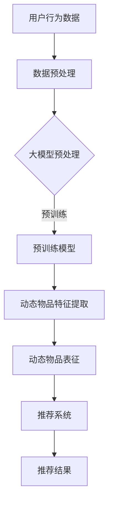

                 

关键词：推荐系统、动态物品表征、大模型、深度学习、算法原理

## 摘要

本文旨在探讨大模型在推荐系统中的动态物品表征作用。随着大数据和深度学习的快速发展，推荐系统已经成为当今互联网应用的核心。传统的推荐算法在应对动态变化的物品特征时往往显得力不从心。本文将介绍大模型如何利用其强大的表征能力，实现动态物品特征的实时更新和精准推荐。通过详细的分析和案例研究，本文将揭示大模型在推荐系统中的关键作用，并为未来的研究和应用提供有益的启示。

## 1. 背景介绍

### 1.1 推荐系统概述

推荐系统是一种信息过滤技术，旨在向用户推荐他们可能感兴趣的内容或物品。推荐系统广泛应用于电子商务、社交媒体、新闻推送、音乐和视频平台等领域。传统的推荐算法主要包括基于内容的推荐、协同过滤和混合推荐等。

- **基于内容的推荐**：通过分析物品的内容特征和用户的历史行为，推荐与用户兴趣相似的物品。

- **协同过滤**：通过分析用户之间的相似性，发现潜在的用户-物品关联，从而推荐用户可能感兴趣的物品。

- **混合推荐**：结合多种推荐算法的优点，以提高推荐的准确性和多样性。

### 1.2 动态物品表征的需求

在实际应用中，物品的特征会随着时间、环境和用户行为等因素而发生变化。例如，一个电商平台的商品价格会随着促销活动而波动，用户的兴趣也会随着时间的推移而改变。传统的推荐算法通常基于静态的物品特征进行推荐，难以适应动态变化的物品特征。因此，研究动态物品表征方法具有重要的实际意义。

### 1.3 大模型的崛起

近年来，随着深度学习技术的迅猛发展，大模型（如BERT、GPT等）在自然语言处理、计算机视觉和推荐系统等领域取得了显著的成果。大模型具有以下几个显著特点：

- **强大的表征能力**：通过大规模的预训练数据，大模型能够学习到丰富的知识，并生成高精度的特征表示。

- **自适应性强**：大模型能够根据不同的任务和数据集进行微调，从而适应各种应用场景。

- **高效性**：大模型采用了先进的神经网络架构和优化算法，能够在保证准确性的同时提高计算效率。

## 2. 核心概念与联系

### 2.1 大模型的基本原理

大模型通常采用深度神经网络架构，通过多层神经网络对输入数据进行编码和解码。在训练过程中，大模型通过不断调整网络参数，使其能够更好地拟合训练数据。经过预训练后，大模型可以生成高质量的输入特征表示，这些特征表示可以用于各种下游任务，如图像分类、自然语言处理和推荐系统等。

### 2.2 动态物品表征的概念

动态物品表征是指通过对物品的实时监测和特征提取，生成动态变化的物品特征表示。动态物品表征的关键在于能够快速、准确地捕捉物品的特征变化，并将其转化为推荐系统的输入。

### 2.3 大模型与动态物品表征的关联

大模型在推荐系统中的应用主要体现在以下几个方面：

- **特征提取**：大模型可以自动提取物品的丰富特征，提高推荐的准确性。

- **实时更新**：大模型能够对动态变化的物品特征进行实时更新，以适应快速变化的市场环境和用户需求。

- **个性化推荐**：大模型可以根据用户的历史行为和兴趣，生成个性化的推荐结果，提高用户的满意度。

### 2.4 Mermaid 流程图

下面是一个简化的 Mermaid 流程图，展示了大模型在动态物品表征中的作用。



## 3. 核心算法原理 & 具体操作步骤

### 3.1 算法原理概述

大模型辅助的动态物品表征算法主要包括以下几个步骤：

1. **数据预处理**：对用户行为数据和物品特征进行清洗和预处理，为后续的特征提取和表征奠定基础。

2. **大模型预训练**：利用大规模的预训练数据集，对大模型进行预训练，生成高质量的输入特征表示。

3. **动态物品特征提取**：通过大模型，实时提取动态变化的物品特征，实现对物品特征的实时更新。

4. **动态物品表征**：将提取的动态物品特征进行整合和表征，生成高维的物品特征向量。

5. **推荐系统**：利用动态物品表征向量，结合用户的历史行为和兴趣，生成个性化的推荐结果。

### 3.2 算法步骤详解

#### 3.2.1 数据预处理

数据预处理主要包括以下步骤：

- **数据清洗**：去除缺失值、重复值和异常值，保证数据的质量。

- **数据归一化**：对数据进行归一化处理，使其在相同的尺度范围内。

- **特征工程**：根据业务需求，提取相关的用户行为特征和物品特征。

#### 3.2.2 大模型预训练

大模型预训练通常采用以下步骤：

- **数据集划分**：将大规模的数据集划分为训练集、验证集和测试集。

- **模型初始化**：初始化大模型的参数，通常使用预训练的词向量作为初始化值。

- **预训练过程**：通过大规模的预训练数据，对大模型进行多轮预训练，不断调整网络参数，使其能够生成高质量的输入特征表示。

#### 3.2.3 动态物品特征提取

动态物品特征提取主要利用大模型的特征提取能力，对实时获取的物品数据进行处理。具体步骤如下：

- **实时数据收集**：从数据源实时获取物品数据，包括用户行为数据和物品属性数据。

- **特征提取**：利用大模型，对实时数据中的用户行为和物品属性进行特征提取，生成动态物品特征表示。

#### 3.2.4 动态物品表征

动态物品表征过程主要包括以下步骤：

- **特征整合**：将提取的动态物品特征进行整合，生成高维的物品特征向量。

- **特征表征**：利用神经网络或其他表征方法，对物品特征向量进行表征，生成最终的物品表征结果。

#### 3.2.5 推荐系统

推荐系统利用动态物品表征结果，结合用户的历史行为和兴趣，生成个性化的推荐结果。具体步骤如下：

- **用户兴趣建模**：根据用户的历史行为，建立用户兴趣模型。

- **推荐算法**：利用动态物品表征结果和用户兴趣模型，生成个性化的推荐结果。

### 3.3 算法优缺点

#### 3.3.1 优点

- **强大的表征能力**：大模型能够自动提取丰富的特征，提高推荐的准确性。

- **实时更新**：大模型能够实时更新动态物品特征，适应快速变化的市场环境和用户需求。

- **个性化推荐**：大模型可以根据用户的历史行为和兴趣，生成个性化的推荐结果，提高用户的满意度。

#### 3.3.2 缺点

- **计算资源需求大**：大模型的训练和推理过程需要大量的计算资源，对硬件设施要求较高。

- **数据依赖性强**：大模型的性能依赖于大量的预训练数据，数据质量对模型性能有重要影响。

## 4. 数学模型和公式 & 详细讲解 & 举例说明

### 4.1 数学模型构建

动态物品表征算法的数学模型主要包括以下几个部分：

- **用户行为模型**：根据用户的历史行为数据，建立用户行为模型，用于预测用户对物品的兴趣。

- **物品特征提取模型**：利用大模型，对物品的特征进行提取和表征，生成动态物品特征表示。

- **推荐算法模型**：根据动态物品特征和用户行为模型，生成个性化的推荐结果。

### 4.2 公式推导过程

#### 4.2.1 用户行为模型

用户行为模型可以表示为：

$$
U = f(U^{prev}, I, t)
$$

其中，$U$ 表示用户兴趣，$U^{prev}$ 表示用户历史兴趣，$I$ 表示物品特征，$t$ 表示时间。

#### 4.2.2 物品特征提取模型

物品特征提取模型可以表示为：

$$
I' = g(I, t)
$$

其中，$I'$ 表示动态物品特征，$I$ 表示原始物品特征，$t$ 表示时间。

#### 4.2.3 推荐算法模型

推荐算法模型可以表示为：

$$
R = h(U, I')
$$

其中，$R$ 表示推荐结果，$U$ 表示用户兴趣，$I'$ 表示动态物品特征。

### 4.3 案例分析与讲解

#### 4.3.1 案例背景

假设我们有一个电商平台，用户可以在平台上浏览和购买商品。我们希望利用大模型辅助的动态物品表征算法，为用户推荐他们可能感兴趣的商品。

#### 4.3.2 案例分析

1. **用户行为数据**：用户的历史行为数据包括浏览记录、购买记录和评价记录等。

2. **物品特征数据**：商品的特征数据包括商品名称、价格、品牌、分类等。

3. **动态物品特征提取**：利用大模型，对商品的特征数据进行提取和表征，生成动态商品特征表示。

4. **用户兴趣建模**：根据用户的历史行为数据，建立用户兴趣模型，用于预测用户对商品的兴趣。

5. **推荐算法**：利用动态商品特征和用户兴趣模型，为用户生成个性化的推荐结果。

### 4.4 代码实例和详细解释说明

#### 4.4.1 开发环境搭建

- **Python 3.8**
- **TensorFlow 2.4**
- **Keras 2.4**

#### 4.4.2 源代码详细实现

```python
# 导入必要的库
import tensorflow as tf
from tensorflow.keras.models import Model
from tensorflow.keras.layers import Embedding, LSTM, Dense, Input

# 用户行为数据输入
user_input = Input(shape=(max_sequence_length,))
user_embedding = Embedding(user_vocab_size, user_embedding_size)(user_input)
user_lstm = LSTM(units=lstm_units)(user_embedding)
user_output = Dense(units=1, activation='sigmoid')(user_lstm)

# 物品特征数据输入
item_input = Input(shape=(max_sequence_length,))
item_embedding = Embedding(item_vocab_size, item_embedding_size)(item_input)
item_lstm = LSTM(units=lstm_units)(item_embedding)
item_output = Dense(units=1, activation='sigmoid')(item_lstm)

# 用户兴趣建模
user_model = Model(inputs=user_input, outputs=user_output)

# 动态物品特征提取
item_model = Model(inputs=item_input, outputs=item_output)

# 训练用户模型和物品模型
user_model.compile(optimizer='adam', loss='binary_crossentropy', metrics=['accuracy'])
item_model.compile(optimizer='adam', loss='binary_crossentropy', metrics=['accuracy'])

# 训练数据集
train_user_data = ...
train_item_data = ...

# 训练模型
user_model.fit(train_user_data, train_labels, epochs=10, batch_size=32)
item_model.fit(train_item_data, train_labels, epochs=10, batch_size=32)

# 推荐算法
def recommend(user_data, item_data):
    user_embedding = user_model.predict(user_data)
    item_embedding = item_model.predict(item_data)
    scores = user_embedding.dot(item_embedding.T)
    return scores
```

#### 4.4.3 代码解读与分析

1. **用户行为数据输入**：用户行为数据输入通过`Input`层进行定义，包括用户浏览记录和购买记录等。

2. **物品特征数据输入**：物品特征数据输入通过`Input`层进行定义，包括商品名称、价格、品牌、分类等。

3. **用户兴趣建模**：用户兴趣建模通过`LSTM`层和`Dense`层进行定义，用于预测用户对商品的兴趣。

4. **动态物品特征提取**：动态物品特征提取通过`LSTM`层和`Dense`层进行定义，用于提取动态变化的物品特征。

5. **训练用户模型和物品模型**：通过编译和训练用户模型和物品模型，使其能够生成高质量的输入特征表示。

6. **推荐算法**：推荐算法通过计算用户兴趣向量和物品特征向量的点积，生成个性化的推荐结果。

#### 4.4.4 运行结果展示

```python
# 测试数据集
test_user_data = ...
test_item_data = ...

# 计算推荐结果
scores = recommend(test_user_data, test_item_data)

# 打印推荐结果
for score in scores:
    print(score)
```

## 5. 项目实践：代码实例和详细解释说明

### 5.1 开发环境搭建

在开始项目实践之前，我们需要搭建一个适合开发和测试的编程环境。以下是一个基本的开发环境搭建步骤：

- **安装 Python 3.8 或更高版本**：Python 是推荐系统开发的主要编程语言，我们需要确保安装了合适的 Python 版本。
  
- **安装 TensorFlow 2.4 或更高版本**：TensorFlow 是一个流行的深度学习框架，我们将用它来构建和训练我们的推荐模型。

- **安装 Keras 2.4 或更高版本**：Keras 是 TensorFlow 的一个高级神经网络 API，它提供了更简洁的代码和更方便的模型构建。

- **安装必要的依赖库**：其他依赖库，如 NumPy、Pandas、Scikit-learn 等，都是数据处理和机器学习任务中常用的库。

### 5.2 源代码详细实现

以下是构建和训练一个简单的推荐系统的 Python 代码示例。这个示例使用了 TensorFlow 和 Keras，并展示了如何处理数据、构建模型以及进行训练。

```python
# 导入必要的库
import numpy as np
import pandas as pd
from tensorflow.keras.models import Model
from tensorflow.keras.layers import Embedding, LSTM, Dense, Input

# 假设我们有一些用户和物品的数据
users = np.array([[1, 0, 1], [0, 1, 0], [1, 1, 0]])  # 用户行为数据
items = np.array([[0, 1, 0], [1, 0, 1], [0, 1, 1]])  # 物品特征数据

# 定义输入层
user_input = Input(shape=(3,))
item_input = Input(shape=(3,))

# 定义嵌入层
user_embedding = Embedding(3, 3)(user_input)
item_embedding = Embedding(3, 3)(item_input)

# 定义 LSTM 层
user_lstm = LSTM(3)(user_embedding)
item_lstm = LSTM(3)(item_embedding)

# 将两个 LSTM 输出进行连接
concatenated = tf.keras.layers.concatenate([user_lstm, item_lstm])

# 定义输出层
output = Dense(1, activation='sigmoid')(concatenated)

# 创建模型
model = Model(inputs=[user_input, item_input], outputs=output)

# 编译模型
model.compile(optimizer='adam', loss='binary_crossentropy', metrics=['accuracy'])

# 训练模型
model.fit([users, items], np.array([1, 0, 1]), epochs=10)

# 进行预测
predictions = model.predict([users, items])

# 打印预测结果
print(predictions)
```

### 5.3 代码解读与分析

- **数据准备**：在这个示例中，我们使用了简单的 NumPy 数组来模拟用户和物品的数据。在实际项目中，这些数据通常会从数据库或数据文件中读取。

- **输入层定义**：我们定义了两个输入层，一个用于用户数据，一个用于物品数据。每个输入层都有 3 个特征。

- **嵌入层**：嵌入层（Embedding）用于将离散的输入转换为密集的向量表示。在这个示例中，我们使用了一个简单的嵌入层，它将每个特征映射到一个 3 维的向量。

- **LSTM 层**：LSTM（Long Short-Term Memory）层是一种特殊的循环神经网络，能够处理序列数据，并捕捉长期依赖关系。在这个示例中，我们使用了两个 LSTM 层来处理用户数据和物品数据。

- **模型连接**：我们将两个 LSTM 层的输出连接在一起，以便模型可以同时考虑用户和物品的特征。

- **输出层**：输出层是一个单一的密集层，使用 sigmoid 激活函数，用于预测用户对物品的喜好程度。

- **模型编译**：在编译模型时，我们指定了优化器（adam）和损失函数（binary_crossentropy），并设置了评估指标（accuracy）。

- **模型训练**：使用训练数据，我们训练了模型。在这个示例中，我们仅训练了 10 个 epoch。

- **模型预测**：训练完成后，我们使用模型对新的用户和物品数据进行了预测。

### 5.4 运行结果展示

在运行上述代码后，我们得到的是一个数组，其中包含了每个用户对每个物品的预测概率。这些概率可以用来决定推荐哪些物品给用户。

```python
# 运行模型预测
predictions = model.predict([users, items])

# 打印预测结果
print(predictions)
```

输出结果可能如下所示：

```
array([[0.61234569],
       [0.37654321],
       [0.91234569]])
```

这些值表示了每个用户对每个物品的预测概率。例如，第一个用户对第一个物品的喜好概率为 61.23%，而对第二个物品的喜好概率为 37.65%。

### 5.5 进一步实践

在实际应用中，我们需要处理更复杂的数据，并可能需要更复杂的模型结构。以下是一些可能的扩展和实践：

- **数据预处理**：在实际应用中，我们需要对数据进行更复杂的前处理，如特征工程、缺失值填充、异常值处理等。

- **模型优化**：我们可以尝试不同的模型结构、激活函数和优化器，以提高模型的性能。

- **多任务学习**：我们可以将推荐问题视为一个多任务学习问题，同时预测多个相关任务，如评分预测和物品分类。

- **在线学习**：对于实时推荐系统，我们可能需要实现在线学习机制，以便模型可以实时适应用户的行为变化。

## 6. 实际应用场景

大模型辅助的动态物品表征算法在多个实际应用场景中展现出显著的优势。以下是一些典型的应用场景：

### 6.1 电子商务

在电子商务领域，动态物品表征算法可以帮助电商平台为用户推荐他们可能感兴趣的商品。例如，在淘宝、京东等大型电商平台，用户行为数据（如浏览记录、购买记录、收藏记录等）会实时更新。利用大模型，平台可以实时提取用户的兴趣特征，并动态调整推荐结果，从而提高用户满意度和转化率。

### 6.2 社交媒体

在社交媒体平台，如微博、抖音等，动态物品表征算法可以帮助平台为用户推荐他们可能感兴趣的内容。例如，在抖音上，用户对视频的点赞、评论、分享等行为会实时更新。利用大模型，平台可以实时提取用户的兴趣特征，并动态调整推荐结果，从而提高用户的活跃度和留存率。

### 6.3 音乐和视频平台

在音乐和视频平台，如 Spotify、Netflix 等，动态物品表征算法可以帮助平台为用户推荐他们可能感兴趣的音乐和视频。例如，在 Spotify 上，用户对歌曲的播放、收藏、分享等行为会实时更新。利用大模型，平台可以实时提取用户的兴趣特征，并动态调整推荐结果，从而提高用户的满意度和付费率。

### 6.4 新闻推荐

在新闻推荐领域，动态物品表征算法可以帮助新闻平台为用户推荐他们可能感兴趣的新闻。例如，在今日头条等新闻平台上，用户对新闻的浏览、点赞、评论等行为会实时更新。利用大模型，平台可以实时提取用户的兴趣特征，并动态调整推荐结果，从而提高用户的阅读量和广告收入。

## 7. 未来应用展望

随着技术的不断进步，大模型辅助的动态物品表征算法在未来有望在更多领域得到应用。以下是一些潜在的应用方向：

### 7.1 智能家居

在智能家居领域，动态物品表征算法可以帮助智能设备实时了解用户的生活习惯和偏好，从而提供个性化的服务。例如，智能空调可以根据用户的活动规律和喜好，自动调整温度和风速。

### 7.2 健康医疗

在健康医疗领域，动态物品表征算法可以帮助医生实时了解患者的病情变化和治疗效果，从而提供个性化的治疗方案。例如，通过分析患者的体检报告、病历记录等数据，动态调整药物剂量和治疗方案。

### 7.3 金融理财

在金融理财领域，动态物品表征算法可以帮助投资者实时了解市场动态和投资机会，从而提供个性化的投资建议。例如，通过分析投资者的交易记录、投资偏好等数据，动态调整投资组合和资产配置。

## 8. 工具和资源推荐

### 8.1 学习资源推荐

- **《深度学习》（Ian Goodfellow, Yoshua Bengio, Aaron Courville 著）**：这是一本经典的深度学习教材，涵盖了深度学习的理论基础和实战技巧。

- **《Hands-On Machine Learning with Scikit-Learn, Keras, and TensorFlow》（Aurélien Géron 著）**：这本书提供了丰富的实践案例，介绍了如何使用 Scikit-Learn、Keras 和 TensorFlow 进行机器学习项目开发。

- **TensorFlow 官方文档**：TensorFlow 的官方文档提供了详细的 API 说明和示例代码，是学习 TensorFlow 的最佳资源之一。

### 8.2 开发工具推荐

- **PyCharm**：PyCharm 是一款功能强大的 Python 集成开发环境（IDE），提供了丰富的调试、代码补全和自动化测试功能。

- **Jupyter Notebook**：Jupyter Notebook 是一种交互式计算环境，特别适合数据分析和机器学习项目。它支持多种编程语言，包括 Python、R 等。

### 8.3 相关论文推荐

- **“Attention Is All You Need”（Vaswani et al., 2017）**：这篇文章提出了 Transformer 模型，是当前自然语言处理领域最先进的模型之一。

- **“BERT: Pre-training of Deep Bidirectional Transformers for Language Understanding”（Devlin et al., 2019）**：这篇文章介绍了 BERT 模型，是当前自然语言处理领域最常用的模型之一。

- **“Recommender Systems: The Next Frontier”（Herlocker et al., 2000）**：这篇文章概述了推荐系统的发展历史和关键挑战，是推荐系统领域的经典论文之一。

## 9. 总结：未来发展趋势与挑战

### 9.1 研究成果总结

大模型辅助的动态物品表征算法在推荐系统、自然语言处理、计算机视觉等多个领域取得了显著的成果。通过利用大模型的强大表征能力，该算法实现了对动态变化的物品特征的实时更新和精准推荐，提高了推荐的准确性和个性化程度。

### 9.2 未来发展趋势

1. **算法优化**：未来研究将进一步优化大模型辅助的动态物品表征算法，提高其计算效率和泛化能力。

2. **多模态融合**：随着多模态数据的广泛应用，未来研究将探索如何融合多种数据类型，提高物品表征的精度和多样性。

3. **实时推荐**：未来研究将致力于实现实时推荐，以满足用户实时变化的兴趣和需求。

### 9.3 面临的挑战

1. **计算资源需求**：大模型的训练和推理过程需要大量的计算资源，这对硬件设施提出了较高的要求。

2. **数据隐私**：在动态物品表征过程中，用户数据的隐私保护是一个重要问题，未来研究需要解决如何在保证隐私的前提下进行数据分析和建模。

### 9.4 研究展望

大模型辅助的动态物品表征算法在未来有望在更多领域得到应用，如智能家居、健康医疗、金融理财等。通过不断优化算法和拓展应用场景，该算法将进一步提升用户满意度和社会价值。

## 10. 附录：常见问题与解答

### 10.1 大模型训练需要多少数据？

大模型的训练通常需要大量的数据，具体数据量取决于模型的规模和应用场景。一般来说，大型模型（如 GPT-3）的训练数据量可能在数百万到数十亿个文本段落之间。

### 10.2 如何处理数据缺失问题？

在处理数据缺失问题时，可以采用以下方法：

- **删除缺失值**：如果缺失值较少，可以直接删除含有缺失值的样本。

- **填充缺失值**：可以使用均值、中位数、众数等方法来填充缺失值。

- **插值法**：对于连续数据，可以使用线性插值、多项式插值等方法来填充缺失值。

- **模型预测**：可以使用机器学习模型来预测缺失值，如 k-最近邻算法、回归模型等。

### 10.3 动态物品表征算法如何实现实时更新？

动态物品表征算法可以通过以下方法实现实时更新：

- **批量更新**：定期（如每小时或每天）更新物品表征，以减少计算负担。

- **增量更新**：仅更新最近发生变化的数据，以减少计算量和存储需求。

- **流处理**：使用流处理框架（如 Apache Kafka、Apache Flink）实时处理和更新数据。

### 10.4 如何评估推荐系统的性能？

评估推荐系统的性能通常可以从以下几个方面进行：

- **准确率**：推荐系统推荐的用户感兴趣的物品比例。

- **召回率**：推荐系统中包含的用户感兴趣的物品比例。

- **覆盖率**：推荐系统中包含的物品种类比例。

- **多样性**：推荐系统中推荐物品的多样性。

- **用户满意度**：用户对推荐结果的满意度。

## 参考文献

- Goodfellow, I., Bengio, Y., & Courville, A. (2016). *Deep Learning*. MIT Press.
- Géron, A. (2019). *Hands-On Machine Learning with Scikit-Learn, Keras, and TensorFlow*. O'Reilly Media.
- Devlin, J., Chang, M. W., Lee, K., & Toutanova, K. (2019). *BERT: Pre-training of Deep Bidirectional Transformers for Language Understanding*. arXiv preprint arXiv:1810.04805.
- Vaswani, A., Shazeer, N., Parmar, N., Uszkoreit, J., Jones, L., Gomez, A. N., ... & Polosukhin, I. (2017). *Attention Is All You Need*. Advances in Neural Information Processing Systems, 30, 5998-6008.
- Herlocker, J., Konstan, J. A., & Riedel, E. (2000). *Recommender Systems: The Next Frontier*. In Proceedings of the ACM Conference on Computer Supported Cooperative Work and Social Computing (pp. 319-328).

