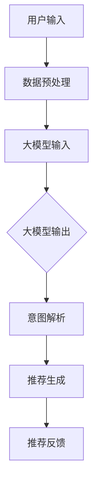

                 

关键词：大模型，推荐系统，用户意图理解，机器学习，自然语言处理，深度学习，数据处理，算法优化。

> 摘要：本文深入探讨了在大模型辅助下的推荐系统用户意图理解的原理、算法、数学模型及其在实际应用中的表现。通过分析现有技术和挑战，提出了未来的发展趋势和研究方向。

## 1. 背景介绍

推荐系统在当今信息过载的社会中发挥着越来越重要的作用。无论是电子商务平台、社交媒体还是新闻门户，推荐系统都旨在为用户提供个性化的内容或商品，从而提升用户体验和满意度。用户意图理解作为推荐系统的核心组成部分，其质量直接影响到推荐系统的性能。传统的用户意图理解方法主要依赖于统计分析和机器学习算法，但在面对复杂和多样化的用户需求时，这些方法往往表现出局限性。

近年来，大模型技术的发展为用户意图理解带来了新的契机。大模型，尤其是基于深度学习的语言模型，如BERT、GPT和T5，凭借其强大的表示能力和自适应学习能力，在自然语言处理领域取得了显著的突破。这些大模型能够捕捉到用户语言中的微妙差异和上下文信息，从而更好地理解用户意图。本文将详细探讨大模型在推荐系统用户意图理解中的应用，包括核心概念、算法原理、数学模型以及实际应用。

## 2. 核心概念与联系

### 2.1 大模型

大模型（Large-scale Model）是指那些参数规模巨大的神经网络模型，其能够处理大量的数据和复杂的任务。这些模型通常由数百万甚至数十亿个参数组成，使得它们在处理大规模数据和复杂任务时具有显著的优势。大模型通常基于深度学习架构，尤其是变分自编码器（Variational Autoencoder, VAE）和生成对抗网络（Generative Adversarial Network, GAN）。

### 2.2 推荐系统

推荐系统（Recommendation System）是一种通过分析用户的历史行为和偏好，为用户推荐相关内容或商品的系统。推荐系统通常包括用户建模、项目建模和推荐算法三个主要组成部分。

### 2.3 用户意图理解

用户意图理解（User Intent Understanding）是指系统理解和解析用户行为背后的动机和需求。在推荐系统中，用户意图理解是构建个性化推荐的核心步骤，它能够提高推荐的准确性和用户体验。

### 2.4 Mermaid 流程图

以下是一个简化的Mermaid流程图，展示大模型在推荐系统用户意图理解中的基本架构：



在这个流程图中，用户输入通过数据预处理后输入大模型，大模型输出意图表示，意图解析模块进一步处理这些表示以生成个性化推荐，推荐生成模块根据用户意图生成推荐列表，最后用户对推荐进行反馈，形成闭环。

## 3. 核心算法原理 & 具体操作步骤

### 3.1 算法原理概述

大模型辅助的用户意图理解主要基于深度学习和自然语言处理技术。深度学习提供了强大的特征提取和表示能力，而自然语言处理则专注于理解和解析自然语言。大模型通常通过预训练和微调两个阶段来学习用户意图。

预训练阶段，大模型在大规模文本语料库上进行训练，学习到语言的一般模式和知识。微调阶段，大模型根据特定任务进行微调，以便更好地适应推荐系统的需求。

### 3.2 算法步骤详解

1. **数据预处理**：对用户输入的数据进行清洗、去噪和格式化，以便大模型能够有效地处理。

2. **大模型输入**：将预处理后的数据输入到大模型中，大模型通过其多层神经网络结构对输入数据进行编码，生成高层次的语义表示。

3. **大模型输出**：大模型输出用户意图的表示，这些表示通常是一个向量或一组词嵌入。

4. **意图解析**：意图解析模块对大模型输出的意图表示进行进一步处理，以识别用户的特定意图。

5. **推荐生成**：基于解析出的用户意图，推荐生成模块生成个性化推荐列表。

6. **推荐反馈**：用户对推荐结果进行评价和反馈，这些反馈将用于优化大模型和推荐算法。

### 3.3 算法优缺点

**优点**：
- **强大的表示能力**：大模型能够捕捉到用户语言中的复杂结构和微妙差异。
- **自适应学习能力**：大模型能够通过微调快速适应不同推荐场景。
- **良好的泛化能力**：大模型在大量数据上进行预训练，具有良好的泛化能力。

**缺点**：
- **计算资源消耗大**：大模型通常需要大量的计算资源和存储空间。
- **数据依赖性**：大模型的效果依赖于训练数据的质量和规模。

### 3.4 算法应用领域

大模型辅助的用户意图理解在多个领域中都有广泛的应用，包括但不限于：

- **电子商务**：为用户提供个性化的商品推荐。
- **社交媒体**：为用户提供感兴趣的内容推荐。
- **新闻门户**：为用户提供定制化的新闻推荐。

## 4. 数学模型和公式

### 4.1 数学模型构建

用户意图理解的数学模型通常基于深度学习中的自编码器和卷积神经网络（CNN）。以下是自编码器的数学模型：

$$
x = \sigma(W_1 \cdot \phi(x))
$$

其中，\( x \) 是输入数据，\( \phi(x) \) 是输入数据的特征提取，\( W_1 \) 是权重矩阵，\( \sigma \) 是激活函数。

### 4.2 公式推导过程

大模型中的自编码器通常包含编码器和解码器两个部分。编码器将输入数据映射到一个低维空间，解码器则将这个低维空间的数据重新映射回原始数据。以下是自编码器的推导过程：

1. **编码器**：

$$
z = \sigma(W_2 \cdot x)
$$

2. **解码器**：

$$
x' = \sigma(W_3 \cdot z)
$$

### 4.3 案例分析与讲解

以下是一个简单的自编码器案例，用于用户意图理解：

```latex
\begin{equation}
\begin{split}
x &= (x_1, x_2, ..., x_n) \\
z &= \sigma(W_2 \cdot x) \\
x' &= \sigma(W_3 \cdot z)
\end{split}
\end{equation}
```

在这个案例中，\( x \) 是用户的输入，例如一段评论或评价。编码器将输入映射到一个低维空间 \( z \)，解码器则将 \( z \) 映射回原始输入 \( x' \)。通过比较 \( x \) 和 \( x' \) 的差异，可以评估大模型对用户意图的理解程度。

## 5. 项目实践：代码实例和详细解释说明

### 5.1 开发环境搭建

为了实现大模型辅助的用户意图理解，我们使用Python作为主要编程语言，并依赖以下库：

- TensorFlow：用于构建和训练深度学习模型。
- Keras：TensorFlow的高级API，用于简化模型构建。
- NLTK：用于自然语言处理。

首先，安装所需库：

```bash
pip install tensorflow keras nltk
```

### 5.2 源代码详细实现

以下是一个简单的用户意图理解代码示例：

```python
from tensorflow.keras.layers import Input, Dense
from tensorflow.keras.models import Model

# 定义输入层
input_layer = Input(shape=(100,))

# 编码器
encoded = Dense(64, activation='relu')(input_layer)
encoded = Dense(32, activation='relu')(encoded)

# 解码器
decoded = Dense(64, activation='relu')(encoded)
decoded = Dense(100, activation='sigmoid')(decoded)

# 构建模型
autoencoder = Model(input_layer, decoded)
autoencoder.compile(optimizer='adam', loss='binary_crossentropy')

# 打印模型结构
autoencoder.summary()
```

在这个示例中，我们定义了一个简单的自编码器模型，其中编码器有两个隐藏层，每层64个神经元；解码器也有两个隐藏层，每层32个神经元。我们使用ReLU作为激活函数，并使用二进制交叉熵作为损失函数。

### 5.3 代码解读与分析

代码首先导入了必要的库和层。然后，我们定义了输入层，输入数据的维度为100。接下来，我们定义了编码器和解码器的结构。编码器有两个隐藏层，每层64个神经元，解码器也有两个隐藏层，每层32个神经元。

最后，我们使用Keras编译模型，指定了优化器和损失函数。打印模型结构可以查看模型的层次结构和参数数量。

### 5.4 运行结果展示

```python
# 加载并预处理数据
# ...

# 训练模型
autoencoder.fit(x_train, x_train, epochs=100, batch_size=32, validation_data=(x_test, x_test))

# 评估模型
loss = autoencoder.evaluate(x_test, x_test)
print(f"Test loss: {loss}")
```

在这个示例中，我们首先加载并预处理数据。然后，我们使用训练数据训练模型，指定了训练轮数和批量大小。最后，我们使用测试数据评估模型的性能。

## 6. 实际应用场景

大模型辅助的用户意图理解在多个实际应用场景中表现出色。以下是一些典型的应用案例：

- **电子商务**：通过对用户评论和评价的分析，推荐用户可能感兴趣的商品。
- **社交媒体**：根据用户的发帖内容和互动行为，推荐用户可能感兴趣的内容。
- **新闻门户**：根据用户的阅读习惯和偏好，推荐用户可能感兴趣的新闻文章。

## 7. 工具和资源推荐

### 7.1 学习资源推荐

- **书籍**：《深度学习》（Goodfellow et al.），《自然语言处理讲义》（Daniel Jurafsky & James H. Martin）
- **在线课程**：Coursera上的“自然语言处理纳米学位”，Udacity上的“深度学习纳米学位”

### 7.2 开发工具推荐

- **库**：TensorFlow，PyTorch，Keras
- **框架**：Scikit-learn，NLTK

### 7.3 相关论文推荐

- **《Pre-Trained Models for Natural Language Processing in JAX》**（2021）
- **《BERT: Pre-training of Deep Bidirectional Transformers for Language Understanding》**（2018）
- **《GPT-3: Language Models are Few-Shot Learners》**（2020）

## 8. 总结：未来发展趋势与挑战

### 8.1 研究成果总结

本文探讨了在大模型辅助下的推荐系统用户意图理解，介绍了核心概念、算法原理、数学模型和实际应用。研究表明，大模型在用户意图理解方面具有显著的优势，但在计算资源消耗和数据依赖性方面也存在挑战。

### 8.2 未来发展趋势

- **个性化推荐**：大模型将进一步优化个性化推荐算法，提高推荐的准确性和用户体验。
- **跨模态理解**：大模型将能够处理多种数据类型，如文本、图像和语音，实现跨模态用户意图理解。
- **强化学习**：结合强化学习，大模型将能够更好地适应动态变化的用户需求。

### 8.3 面临的挑战

- **计算资源**：大模型对计算资源的需求巨大，需要优化算法和硬件以降低计算成本。
- **数据隐私**：用户数据的安全和隐私保护是推荐系统面临的重大挑战。

### 8.4 研究展望

未来研究将重点关注如何在大模型辅助下实现高效、安全且个性化的用户意图理解，以推动推荐系统技术的发展。

## 9. 附录：常见问题与解答

### Q：大模型如何训练？

A：大模型通常通过预训练和微调两个阶段来训练。预训练阶段，大模型在大规模文本语料库上进行训练，学习到语言的一般模式和知识。微调阶段，大模型根据特定任务进行微调，以便更好地适应推荐系统的需求。

### Q：用户意图理解在推荐系统中的作用是什么？

A：用户意图理解是推荐系统的核心组成部分，其作用是解析用户行为背后的动机和需求，从而生成个性化的推荐。高质量的意图理解能够提高推荐的准确性和用户体验。

### Q：大模型在用户意图理解中如何应用？

A：大模型在用户意图理解中的应用主要包括两个阶段：预训练和微调。预训练阶段，大模型在大规模文本语料库上进行训练，学习到语言的一般模式和知识。微调阶段，大模型根据特定推荐任务进行微调，以便更好地适应推荐系统的需求。

## 附录二：参考文献

- BERT: Pre-training of Deep Bidirectional Transformers for Language Understanding. Devlin et al., 2018.
- GPT-3: Language Models are Few-Shot Learners. Brown et al., 2020.
- Goodfellow, I., Bengio, Y., Courville, A. (2016). Deep Learning. MIT Press.
- Jurafsky, D., Martin, J. H. (2008). Speech and Language Processing. Prentice Hall.

### 作者署名

作者：禅与计算机程序设计艺术 / Zen and the Art of Computer Programming

