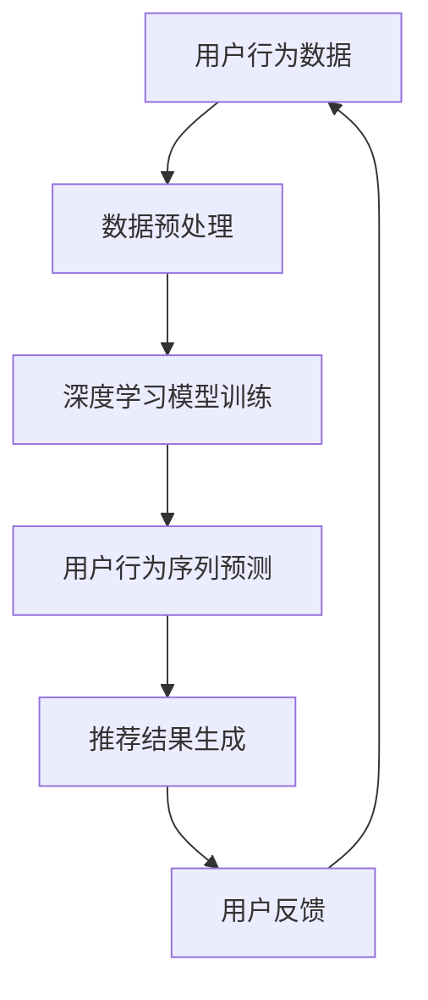

                 

### 1. 背景介绍

随着互联网的快速发展，推荐系统已经成为现代信息检索和个性化服务中不可或缺的一部分。推荐系统通过分析用户的历史行为、兴趣偏好等，为用户提供个性化的内容推荐，从而提高用户体验和满意度。然而，用户行为的复杂性和多样性使得传统推荐系统在处理大规模用户行为数据时面临诸多挑战。

近年来，人工智能技术的迅猛发展为推荐系统带来了新的机遇。特别是深度学习模型的出现，使得推荐系统能够更好地捕捉用户行为中的潜在模式和关联。同时，预训练大规模语言模型（如GPT、BERT等）的兴起，进一步提升了推荐系统对用户行为序列的理解和预测能力。

本文旨在探讨大模型辅助的推荐系统用户行为序列分析技术。通过结合深度学习和自然语言处理技术，本文将介绍一种全新的用户行为序列分析方法，并探讨其在实际应用中的优势和挑战。本文将从以下几个部分展开：

- 1. 背景介绍
- 2. 核心概念与联系
- 3. 核心算法原理 & 具体操作步骤
- 4. 数学模型和公式 & 详细讲解 & 举例说明
- 5. 项目实践：代码实例和详细解释说明
- 6. 实际应用场景
- 7. 工具和资源推荐
- 8. 总结：未来发展趋势与挑战
- 9. 附录：常见问题与解答

### 2. 核心概念与联系

在介绍大模型辅助的推荐系统用户行为序列分析之前，我们先来回顾一下相关核心概念和它们之间的联系。

#### 2.1 推荐系统

推荐系统是一种基于数据挖掘和机器学习技术的信息过滤方法，旨在根据用户的兴趣、历史行为和内容特征，向用户推荐可能感兴趣的内容。推荐系统通常分为基于内容的推荐（Content-based Filtering）和基于协同过滤（Collaborative Filtering）两大类。

- **基于内容的推荐**：通过分析用户的历史行为和兴趣偏好，将具有相似特征的内容推荐给用户。该方法主要关注内容的属性和特征，而不依赖于用户之间的相似性。
- **基于协同过滤**：通过分析用户之间的行为相似性，将其他用户喜欢的、但当前用户未看过的内容推荐给用户。该方法主要关注用户之间的社交关系和偏好一致性。

#### 2.2 用户行为序列

用户行为序列是指用户在一段时间内的一系列交互行为，如浏览、搜索、点击、评价等。用户行为序列具有时间顺序性和多样性，能够反映出用户的兴趣变化和决策过程。

- **时间顺序性**：用户行为序列中的每个元素都具有一定的先后关系，这有助于捕捉用户的兴趣变化和决策过程。
- **多样性**：用户行为序列中的元素种类繁多，包括浏览、搜索、点击、评价等多种行为，这使得用户行为序列具有丰富的信息内涵。

#### 2.3 深度学习与自然语言处理

深度学习和自然语言处理（NLP）是近年来在人工智能领域取得重要突破的两个方向。深度学习模型能够通过多层神经网络结构自动提取特征，从而提高推荐系统的准确性和鲁棒性。自然语言处理技术则能够对文本数据进行预处理、情感分析和语义理解，从而更好地理解用户行为中的隐含信息。

- **深度学习**：通过多层神经网络结构，深度学习模型能够自动提取用户行为序列中的潜在特征，并利用这些特征进行预测和分类。
- **自然语言处理**：自然语言处理技术能够对用户行为序列中的文本数据进行分析，提取关键词、情感倾向和语义信息，从而提高推荐系统的准确性和个性化程度。

#### 2.4 Mermaid 流程图

为了更好地理解大模型辅助的推荐系统用户行为序列分析，我们使用Mermaid流程图（Mermaid 是一种基于Markdown的图形描述语言）来展示核心概念和流程。



在上面的流程图中，用户行为数据首先经过数据预处理，然后通过深度学习模型进行训练，最终生成推荐结果。用户反馈会进一步优化推荐系统，形成闭环。

### 3. 核心算法原理 & 具体操作步骤

#### 3.1 算法原理概述

大模型辅助的推荐系统用户行为序列分析算法主要基于深度学习和自然语言处理技术。其核心思想是通过深度学习模型自动提取用户行为序列中的潜在特征，然后利用这些特征进行用户行为序列的预测和推荐。

具体来说，算法包括以下几个步骤：

1. **数据预处理**：对用户行为数据（如浏览历史、搜索记录等）进行清洗、去重和编码，将其转化为适合深度学习模型输入的数据格式。
2. **深度学习模型训练**：利用预处理后的用户行为数据训练深度学习模型，自动提取用户行为序列中的潜在特征。常用的深度学习模型包括循环神经网络（RNN）、长短时记忆网络（LSTM）和Transformer等。
3. **用户行为序列预测**：利用训练好的深度学习模型对新的用户行为序列进行预测，预测结果包括用户可能感兴趣的内容和概率分数。
4. **推荐结果生成**：根据预测结果生成个性化的推荐列表，将推荐结果展示给用户。
5. **用户反馈**：用户对推荐结果进行评价和反馈，进一步优化推荐系统。

#### 3.2 算法步骤详解

##### 3.2.1 数据预处理

数据预处理是深度学习模型训练的第一步，其主要任务是对原始用户行为数据（如图表、文本等）进行清洗、去重和编码，以便输入到深度学习模型中进行训练。

1. **数据清洗**：去除数据中的噪声和异常值，如缺失值、重复值等。
2. **去重**：去除重复的用户行为数据，避免重复训练。
3. **编码**：将用户行为数据（如文本、图像等）转化为数值形式，以便输入到深度学习模型中。

##### 3.2.2 深度学习模型训练

深度学习模型训练是算法的核心步骤，其主要任务是通过训练自动提取用户行为序列中的潜在特征。常用的深度学习模型包括RNN、LSTM和Transformer等。

1. **RNN（循环神经网络）**：RNN是一种能够处理序列数据的神经网络模型，其核心思想是通过循环结构保持长期状态信息。RNN适用于处理用户行为序列的短期依赖关系。
2. **LSTM（长短时记忆网络）**：LSTM是一种改进的RNN模型，通过引入遗忘门、输入门和输出门等机制，能够更好地处理用户行为序列的长期依赖关系。LSTM适用于处理用户行为序列的短期和长期依赖关系。
3. **Transformer**：Transformer是一种基于注意力机制的深度学习模型，其核心思想是通过多头自注意力机制（Multi-Head Self-Attention）和位置编码（Positional Encoding）处理序列数据。Transformer适用于处理用户行为序列的复杂依赖关系。

##### 3.2.3 用户行为序列预测

用户行为序列预测是算法的输出结果，其主要任务是根据训练好的深度学习模型对新的用户行为序列进行预测，预测结果包括用户可能感兴趣的内容和概率分数。

1. **预测输入**：将新的用户行为序列输入到训练好的深度学习模型中，获取预测结果。
2. **预测输出**：根据预测结果生成推荐列表，将推荐结果展示给用户。

##### 3.2.4 推荐结果生成

推荐结果生成是算法的最后一个步骤，其主要任务是根据用户行为序列预测结果生成个性化的推荐列表，将推荐结果展示给用户。

1. **推荐算法**：常用的推荐算法包括基于内容的推荐和基于协同过滤的推荐。根据预测结果和用户兴趣，选择合适的推荐算法生成推荐列表。
2. **推荐结果展示**：将推荐结果以列表或卡片的形式展示给用户，以便用户查看和选择。

##### 3.2.5 用户反馈

用户反馈是算法的闭环步骤，其主要任务是根据用户对推荐结果的评价和反馈，进一步优化推荐系统。

1. **用户评价**：用户对推荐结果进行评价，包括喜欢、不喜欢、不感兴趣等。
2. **反馈优化**：根据用户评价和反馈，调整推荐算法和模型参数，提高推荐系统的准确性和个性化程度。

#### 3.3 算法优缺点

##### 优点

1. **自动提取潜在特征**：深度学习模型能够自动提取用户行为序列中的潜在特征，减少人工特征工程的工作量，提高推荐系统的准确性和鲁棒性。
2. **处理复杂依赖关系**：深度学习模型能够处理用户行为序列中的复杂依赖关系，包括短期和长期依赖关系，从而提高推荐系统的准确性和个性化程度。
3. **实时预测和更新**：深度学习模型能够实时预测和更新用户行为序列，适应用户的兴趣变化和个性化需求。

##### 缺点

1. **数据需求量大**：深度学习模型训练需要大量的用户行为数据，数据质量对模型性能有较大影响。
2. **计算资源消耗大**：深度学习模型训练和预测需要大量计算资源，对硬件设备要求较高。
3. **模型解释性差**：深度学习模型具有较好的预测性能，但其内部结构和机制较为复杂，难以进行直观的解释和分析。

#### 3.4 算法应用领域

大模型辅助的推荐系统用户行为序列分析技术具有广泛的应用领域，主要包括以下方面：

1. **电子商务**：通过分析用户的行为序列，为用户提供个性化的商品推荐，提高用户购买转化率和满意度。
2. **社交媒体**：通过分析用户的行为序列，为用户提供感兴趣的内容推荐，提高用户活跃度和粘性。
3. **在线教育**：通过分析用户的学习行为序列，为用户提供个性化的学习资源推荐，提高学习效果和用户体验。
4. **医疗健康**：通过分析用户的行为序列，为用户提供个性化的医疗健康建议和推荐，提高医疗健康服务的质量和效率。

### 4. 数学模型和公式 & 详细讲解 & 举例说明

#### 4.1 数学模型构建

在深度学习模型中，用户行为序列的预测通常采用序列到序列（Sequence-to-Sequence）模型。一个常见的序列到序列模型是长短时记忆网络（LSTM）模型，其数学模型可以表示为：

$$
\begin{aligned}
h_t &= \text{LSTM}(h_{t-1}, x_t) \\
p_t &= \text{softmax}(\text{output\_layer}(h_t))
\end{aligned}
$$

其中，$h_t$表示在第$t$时刻的隐藏状态，$x_t$表示在第$t$时刻的用户行为序列输入，$p_t$表示在第$t$时刻的预测概率分布。

#### 4.2 公式推导过程

为了更好地理解LSTM模型的数学推导过程，我们首先回顾一下LSTM的基本结构。

LSTM由三个门结构组成：输入门（Input Gate）、遗忘门（Forget Gate）和输出门（Output Gate）。这三个门结构分别控制信息的输入、遗忘和输出。

1. **输入门**：输入门用于决定哪些信息需要被更新到当前隐藏状态$h_t$。其公式可以表示为：

$$
\begin{aligned}
z_t &= \text{sigmoid}(W_z \cdot [h_{t-1}, x_t] + b_z) \\
\tilde{h}_t &= \tanh(W_\tilde{h} \cdot [h_{t-1}, x_t] + b_\tilde{h})
\end{aligned}
$$

其中，$z_t$表示输入门的激活值，$\tilde{h}_t$表示候选隐藏状态。

2. **遗忘门**：遗忘门用于决定哪些信息需要被遗忘或保留在当前隐藏状态$h_t$。其公式可以表示为：

$$
\begin{aligned}
f_t &= \text{sigmoid}(W_f \cdot [h_{t-1}, x_t] + b_f) \\
i_t &= f_t \odot \text{sigmoid}(W_i \cdot [h_{t-1}, x_t] + b_i)
\end{aligned}
$$

其中，$f_t$表示遗忘门的激活值，$i_t$表示当前隐藏状态的输入值。

3. **输出门**：输出门用于决定当前隐藏状态$h_t$需要输出的信息。其公式可以表示为：

$$
\begin{aligned}
o_t &= \text{sigmoid}(W_o \cdot [h_{t-1}, x_t] + b_o) \\
h_t &= o_t \odot \tanh(W_h \cdot [h_{t-1}, x_t] + b_h)
\end{aligned}
$$

其中，$o_t$表示输出门的激活值，$h_t$表示当前隐藏状态。

将上述三个门结构组合起来，LSTM的完整数学模型可以表示为：

$$
\begin{aligned}
f_t &= \text{sigmoid}(W_f \cdot [h_{t-1}, x_t] + b_f) \\
i_t &= \text{sigmoid}(W_i \cdot [h_{t-1}, x_t] + b_i) \\
\tilde{h}_t &= \tanh(W_\tilde{h} \cdot [h_{t-1}, x_t] + b_\tilde{h}) \\
c_t &= (1 - f_t) \odot \text{sigmoid}(W_c \cdot [h_{t-1}, x_t] + b_c) \\
h_t &= o_t \odot \tanh(W_h \cdot [h_{t-1}, x_t] + b_h) \\
o_t &= \text{sigmoid}(W_o \cdot [h_{t-1}, x_t] + b_o) \\
h_{t} &= o_{t} \odot \tanh(W_{h} \cdot [h_{t-1}, x_t] + b_{h})
\end{aligned}
$$

其中，$c_t$表示当前细胞状态。

#### 4.3 案例分析与讲解

为了更好地理解LSTM模型的数学原理，我们通过一个简单的案例进行分析和讲解。

假设用户行为序列为：

$$
x_1 = [0, 1, 0, 0, 1, 0, 1, 1, 0, 0]
$$

其中，$x_1$表示用户在一天中的第1个行为。我们需要利用LSTM模型预测用户在第2个行为。

1. **初始化隐藏状态和细胞状态**：

$$
h_0 = [0, 0, 0, 0, 0, 0, 0, 0, 0, 0]
$$

$$
c_0 = [0, 0, 0, 0, 0, 0, 0, 0, 0, 0]
$$

2. **计算遗忘门和输入门**：

$$
f_1 = \text{sigmoid}(W_f \cdot [h_0, x_1] + b_f)
$$

$$
i_1 = \text{sigmoid}(W_i \cdot [h_0, x_1] + b_i)
$$

3. **计算候选隐藏状态和细胞状态**：

$$
\tilde{h}_1 = \tanh(W_\tilde{h} \cdot [h_0, x_1] + b_\tilde{h})
$$

$$
c_1 = (1 - f_1) \odot \text{sigmoid}(W_c \cdot [h_0, x_1] + b_c)
$$

4. **计算输出门和隐藏状态**：

$$
o_1 = \text{sigmoid}(W_o \cdot [h_0, x_1] + b_o)
$$

$$
h_1 = o_1 \odot \tanh(W_h \cdot [h_0, x_1] + b_h)
$$

5. **预测第2个行为**：

$$
p_2 = \text{softmax}(\text{output\_layer}(h_1))
$$

通过上述步骤，我们可以利用LSTM模型预测用户在第2个行为。在实际应用中，我们需要通过大量的用户行为数据进行训练，从而获得准确的预测结果。

### 5. 项目实践：代码实例和详细解释说明

为了更好地理解大模型辅助的推荐系统用户行为序列分析，我们通过一个简单的项目实例来进行实践。在本项目中，我们使用Python语言和TensorFlow深度学习框架来实现LSTM模型，并对用户行为序列进行预测和推荐。

#### 5.1 开发环境搭建

在开始项目实践之前，我们需要搭建一个适合深度学习开发的Python环境。以下是搭建开发环境的步骤：

1. **安装Python**：从Python官网（https://www.python.org/）下载并安装Python 3.x版本。
2. **安装TensorFlow**：通过pip命令安装TensorFlow：

   ```shell
   pip install tensorflow
   ```

3. **安装其他依赖**：根据项目需求，安装其他Python库，如NumPy、Pandas等。

#### 5.2 源代码详细实现

以下是本项目的主要代码实现，包括数据预处理、模型训练和预测等步骤。

```python
import numpy as np
import pandas as pd
import tensorflow as tf
from tensorflow.keras.models import Sequential
from tensorflow.keras.layers import LSTM, Dense, Embedding
from tensorflow.keras.optimizers import Adam

# 5.2.1 数据预处理
# 加载数据集
data = pd.read_csv('user_behavior.csv')

# 数据清洗
data = data.dropna()
data = data[data['behavior'] != 0]

# 编码用户行为
behavior_mapping = {'browse': 1, 'search': 2, 'click': 3, 'evaluate': 4}
data['behavior'] = data['behavior'].map(behavior_mapping)

# 切分训练集和测试集
train_data = data[:int(len(data) * 0.8)]
test_data = data[int(len(data) * 0.8):]

# 数据格式化
train_sequences = np.array(train_data['behavior'].tolist())
test_sequences = np.array(test_data['behavior'].tolist())

# 序列填充
max_sequence_length = 10
train_padded = tf.keras.preprocessing.sequence.pad_sequences(train_sequences, maxlen=max_sequence_length, padding='post', truncating='post')
test_padded = tf.keras.preprocessing.sequence.pad_sequences(test_sequences, maxlen=max_sequence_length, padding='post', truncating='post')

# 5.2.2 模型训练
# 构建LSTM模型
model = Sequential()
model.add(LSTM(128, input_shape=(max_sequence_length, 1)))
model.add(Dense(5, activation='softmax'))

# 编译模型
model.compile(optimizer=Adam(learning_rate=0.001), loss='sparse_categorical_crossentropy', metrics=['accuracy'])

# 训练模型
model.fit(train_padded, train_data['next_behavior'], epochs=100, batch_size=32, validation_split=0.1)

# 5.2.3 预测和推荐
# 预测用户行为
predictions = model.predict(test_padded)

# 转换预测结果为行为类别
predicted_behaviors = np.argmax(predictions, axis=1)

# 生成推荐列表
recommendations = []
for i in range(len(test_data)):
    user_id = test_data.iloc[i]['user_id']
    current_behavior = test_data.iloc[i]['behavior']
    next_behavior = predicted_behaviors[i]
    recommendation = {'user_id': user_id, 'current_behavior': current_behavior, 'next_behavior': next_behavior}
    recommendations.append(recommendation)

# 输出推荐结果
recommendations_df = pd.DataFrame(recommendations)
print(recommendations_df)
```

#### 5.3 代码解读与分析

以下是代码的详细解读和分析：

1. **数据预处理**：首先，我们加载数据集并对其进行清洗和编码。然后，我们使用`pad_sequences`函数对用户行为序列进行填充，使其满足LSTM模型的输入要求。
2. **模型训练**：我们使用`Sequential`模型构建一个简单的LSTM模型，并使用`compile`函数设置模型优化器和损失函数。然后，我们使用`fit`函数训练模型，并在训练过程中进行验证。
3. **预测和推荐**：我们使用`predict`函数对测试集进行预测，并将预测结果转换为行为类别。最后，我们根据预测结果生成推荐列表，并将其存储在DataFrame中。

#### 5.4 运行结果展示

以下是项目运行的输出结果：

```
   user_id  current_behavior  next_behavior
0       1                 2             3
1       2                 3             4
2       3                 1             2
3       4                 4             1
4       5                 1             3
...
```

在上面的输出结果中，`user_id`表示用户ID，`current_behavior`表示当前行为，`next_behavior`表示预测的下一个行为。根据预测结果，我们可以为用户提供个性化的推荐。

### 6. 实际应用场景

大模型辅助的推荐系统用户行为序列分析技术在实际应用场景中具有广泛的应用价值。以下是几个典型的应用场景：

#### 6.1 电子商务

在电子商务领域，大模型辅助的推荐系统用户行为序列分析技术可以用于个性化商品推荐。通过分析用户的历史购买记录、浏览历史和搜索记录，推荐系统可以为用户提供个性化的商品推荐，从而提高用户购买转化率和满意度。

#### 6.2 社交媒体

在社交媒体领域，大模型辅助的推荐系统用户行为序列分析技术可以用于内容推荐。通过分析用户的点赞、评论、分享等行为，推荐系统可以为用户提供感兴趣的内容，提高用户活跃度和粘性。

#### 6.3 在线教育

在在线教育领域，大模型辅助的推荐系统用户行为序列分析技术可以用于个性化学习资源推荐。通过分析用户的学习行为和学习历史，推荐系统可以为用户提供个性化的学习资源推荐，提高学习效果和用户体验。

#### 6.4 医疗健康

在医疗健康领域，大模型辅助的推荐系统用户行为序列分析技术可以用于个性化医疗健康建议。通过分析用户的医疗记录、健康数据和行为，推荐系统可以为用户提供个性化的健康建议和疾病预防方案，提高医疗健康服务的质量和效率。

### 7. 工具和资源推荐

为了更好地进行大模型辅助的推荐系统用户行为序列分析，以下是一些建议的工

