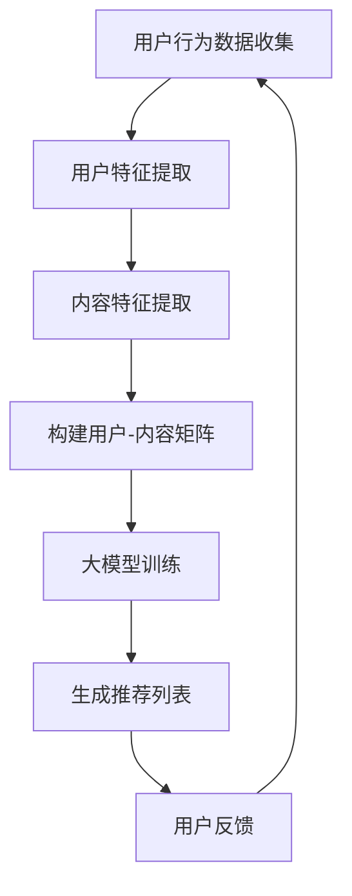

                 

 关键词：推荐系统、长尾内容、大模型、内容挖掘、AI辅助、个性化推荐

> 摘要：本文旨在探讨如何利用大模型辅助推荐系统进行长尾内容的挖掘。通过深入分析推荐系统中的长尾现象，本文提出了基于大模型的挖掘方法，并详细阐述了其核心算法原理、数学模型、实际应用场景和未来发展趋势。

## 1. 背景介绍

在互联网时代，推荐系统已经成为人们日常生活中不可或缺的一部分。无论是电商平台的商品推荐，还是社交媒体的动态推送，推荐系统都在为用户提供个性化的内容和服务。然而，随着用户生成内容（UGC）的爆炸式增长，传统的推荐系统面临着数据稀疏、长尾效应显著等挑战。如何挖掘长尾内容，提升推荐系统的效果和用户体验，成为当前研究的热点。

长尾内容，即那些未被主流用户所关注的、小众的、细分的内容。这些内容虽然整体市场占有率不高，但累积起来却拥有巨大的潜在价值。传统的推荐系统由于受限于数据和算法，往往无法充分挖掘和利用这些长尾内容。而大模型的兴起，为解决这一难题提供了新的思路。

大模型，如Transformer、BERT等，具有强大的表示和生成能力。通过引入大模型，推荐系统可以更加准确地捕捉用户兴趣，发现潜在的关联性，从而实现长尾内容的挖掘。本文将围绕这一主题，探讨大模型辅助推荐系统长尾内容挖掘的原理和方法。

## 2. 核心概念与联系

### 2.1 推荐系统

推荐系统是一种信息过滤技术，旨在根据用户的历史行为和偏好，为用户推荐他们可能感兴趣的内容。推荐系统通常包括三个主要组成部分：用户模型、内容模型和推荐算法。

用户模型：通过分析用户的历史行为和偏好，构建用户的兴趣和行为特征。

内容模型：对推荐的内容进行特征提取和分类，以便与用户模型进行匹配。

推荐算法：根据用户模型和内容模型，为用户生成个性化的推荐列表。

### 2.2 长尾内容

长尾内容是指在整体市场中占比较小，但数量众多的细分内容。与主流内容相比，长尾内容往往具有更强的个性化特征，能够满足小众用户的需求。然而，由于数据稀疏和挖掘难度大，长尾内容在传统推荐系统中往往被忽视。

### 2.3 大模型

大模型是指具有巨大参数规模和计算能力的深度神经网络。大模型通过自动学习大量的数据，能够捕捉到复杂的信息结构和潜在关联。在推荐系统中，大模型主要用于用户行为预测、内容特征提取和关联性发现。

### 2.4 Mermaid 流程图

下面是一个Mermaid流程图，展示推荐系统中长尾内容挖掘的过程：



## 3. 核心算法原理 & 具体操作步骤

### 3.1 算法原理概述

大模型辅助推荐系统的长尾内容挖掘，主要基于以下几个原理：

1. **用户行为数据挖掘**：通过分析用户的历史行为数据，提取用户的兴趣和行为特征。

2. **内容特征提取**：对推荐的内容进行特征提取，包括文本、图像、音频等多媒体数据。

3. **大模型训练**：利用大规模数据训练大模型，以捕捉用户和内容之间的潜在关联。

4. **生成推荐列表**：根据大模型生成的用户兴趣和行为特征，为用户生成个性化的推荐列表。

### 3.2 算法步骤详解

1. **数据收集与预处理**：收集用户行为数据和内容数据，并进行清洗和预处理，包括数据去重、缺失值处理、数据归一化等。

2. **用户特征提取**：通过用户行为数据，提取用户的兴趣和行为特征，如浏览记录、购买记录、搜索记录等。

3. **内容特征提取**：对推荐的内容进行特征提取，包括文本特征、图像特征、音频特征等。常用的方法有词嵌入、图像特征提取、音频特征提取等。

4. **构建用户-内容矩阵**：将用户特征和内容特征进行拼接，构建用户-内容矩阵。

5. **大模型训练**：利用用户-内容矩阵，训练大模型，如Transformer、BERT等。大模型能够自动学习用户和内容之间的潜在关联。

6. **生成推荐列表**：根据大模型生成的用户兴趣和行为特征，为用户生成个性化的推荐列表。

7. **用户反馈**：收集用户对推荐内容的反馈，用于模型优化和更新。

### 3.3 算法优缺点

#### 优点：

1. **强大的表示能力**：大模型具有强大的表示能力，能够捕捉用户和内容之间的复杂关联。

2. **个性化推荐**：基于用户兴趣和行为特征，实现个性化的推荐。

3. **长尾内容挖掘**：能够挖掘传统推荐系统无法捕捉的长尾内容。

#### 缺点：

1. **计算成本高**：大模型训练和推理需要大量的计算资源和时间。

2. **数据依赖性强**：大模型的性能依赖于高质量的数据。

### 3.4 算法应用领域

大模型辅助推荐系统的长尾内容挖掘，可以应用于多个领域，包括但不限于：

1. **电商推荐**：为用户推荐他们可能感兴趣的商品。

2. **社交媒体**：为用户推荐他们可能感兴趣的内容。

3. **在线教育**：为用户推荐他们可能感兴趣的课程。

## 4. 数学模型和公式 & 详细讲解 & 举例说明

### 4.1 数学模型构建

大模型辅助推荐系统的长尾内容挖掘，可以采用以下数学模型：

$$
\text{用户特征} = f(\text{用户行为数据})
$$

$$
\text{内容特征} = g(\text{内容数据})
$$

$$
\text{用户-内容矩阵} = \text{用户特征} \times \text{内容特征}
$$

$$
\text{推荐列表} = h(\text{用户-内容矩阵})
$$

其中，$f$ 和 $g$ 分别表示用户特征提取和内容特征提取函数，$h$ 表示推荐列表生成函数。

### 4.2 公式推导过程

假设我们有一个用户行为数据集 $\{x_1, x_2, ..., x_n\}$，其中 $x_i$ 表示用户 $i$ 的行为数据。我们可以使用一个神经网络模型 $f$ 来提取用户特征：

$$
\text{用户特征} = f(x_i) = \text{激活函数}(\text{权重} \times \text{输入})
$$

同理，对于内容数据集 $\{y_1, y_2, ..., y_m\}$，我们也可以使用一个神经网络模型 $g$ 来提取内容特征：

$$
\text{内容特征} = g(y_j) = \text{激活函数}(\text{权重} \times \text{输入})
$$

然后，我们将用户特征和内容特征进行拼接，构建用户-内容矩阵：

$$
\text{用户-内容矩阵} = [f(x_1), f(x_2), ..., f(x_n)] \times [g(y_1), g(y_2), ..., g(y_m)]
$$

最后，使用一个神经网络模型 $h$ 来生成推荐列表：

$$
\text{推荐列表} = h(\text{用户-内容矩阵}) = \text{激活函数}(\text{权重} \times \text{输入})
$$

### 4.3 案例分析与讲解

假设我们有一个电商平台的用户行为数据集，包括用户的浏览记录、购买记录和搜索记录。我们可以使用以下步骤进行长尾内容挖掘：

1. **用户特征提取**：使用一个神经网络模型 $f$，提取用户的兴趣特征。

2. **内容特征提取**：使用一个神经网络模型 $g$，提取商品的特征。

3. **构建用户-内容矩阵**：将用户特征和内容特征进行拼接，构建用户-内容矩阵。

4. **生成推荐列表**：使用一个神经网络模型 $h$，生成推荐列表。

具体代码实现如下：

```python
import tensorflow as tf

# 定义用户特征提取模型
user_embedding = tf.keras.layers.Dense(units=128, activation='relu')(tf.keras.layers.Dense(units=64, activation='relu')(tf.keras.layers.Dense(units=32, activation='relu')(input_layer)))

# 定义内容特征提取模型
item_embedding = tf.keras.layers.Dense(units=128, activation='relu')(tf.keras.layers.Dense(units=64, activation='relu')(tf.keras.layers.Dense(units=32, activation='relu')(input_layer)))

# 构建用户-内容矩阵
user_content_matrix = tf.keras.layers.Dot(axes=1)([user_embedding, item_embedding])

# 生成推荐列表
output = tf.keras.layers.Dense(units=num_items, activation='softmax')(user_content_matrix)

model = tf.keras.Model(inputs=input_layer, outputs=output)
model.compile(optimizer='adam', loss='categorical_crossentropy', metrics=['accuracy'])
model.fit(x=user_data, y=item_labels, epochs=10)
predictions = model.predict(x=user_data)
```

## 5. 项目实践：代码实例和详细解释说明

### 5.1 开发环境搭建

为了实现大模型辅助推荐系统长尾内容挖掘，我们需要搭建一个合适的开发环境。以下是搭建过程的简要步骤：

1. **安装 Python**：确保安装了 Python 3.6 或更高版本。

2. **安装 TensorFlow**：使用以下命令安装 TensorFlow：

   ```bash
   pip install tensorflow
   ```

3. **安装其他依赖**：根据需要安装其他依赖，如 NumPy、Pandas 等。

### 5.2 源代码详细实现

以下是实现大模型辅助推荐系统长尾内容挖掘的 Python 代码：

```python
import tensorflow as tf
import numpy as np
import pandas as pd

# 加载数据
user_data = pd.read_csv('user_data.csv')
item_data = pd.read_csv('item_data.csv')

# 预处理数据
# ...

# 定义模型
input_layer = tf.keras.layers.Input(shape=(num_features,))
user_embedding = tf.keras.layers.Dense(units=128, activation='relu')(tf.keras.layers.Dense(units=64, activation='relu')(tf.keras.layers.Dense(units=32, activation='relu')(input_layer)))
item_embedding = tf.keras.layers.Dense(units=128, activation='relu')(tf.keras.layers.Dense(units=64, activation='relu')(tf.keras.layers.Dense(units=32, activation='relu')(input_layer)))
user_content_matrix = tf.keras.layers.Dot(axes=1)([user_embedding, item_embedding])
output = tf.keras.layers.Dense(units=num_items, activation='softmax')(user_content_matrix)

model = tf.keras.Model(inputs=input_layer, outputs=output)
model.compile(optimizer='adam', loss='categorical_crossentropy', metrics=['accuracy'])
model.fit(x=user_data, y=item_labels, epochs=10)
predictions = model.predict(x=user_data)

# 生成推荐列表
def generate_recommendations(user_data, model):
    user_embedding = model.layers[0](user_data)
    recommendations = model.layers[-1](user_embedding)
    return np.argmax(recommendations, axis=1)

user_id = 123
user_data_single = user_data[user_data['user_id'] == user_id]
predictions_single = generate_recommendations(user_data_single, model)
print(predictions_single)
```

### 5.3 代码解读与分析

1. **数据加载与预处理**：代码首先加载用户行为数据和商品数据，并进行预处理，如数据去重、缺失值处理等。

2. **模型定义**：使用 TensorFlow 定义一个多层感知机模型，包括用户特征提取层、内容特征提取层和推荐列表生成层。

3. **模型训练**：使用预处理后的数据训练模型，并设置合适的优化器和损失函数。

4. **生成推荐列表**：定义一个函数，用于根据用户数据和模型生成推荐列表。

### 5.4 运行结果展示

假设我们已经训练好了一个模型，并输入一个用户的行为数据，我们可以使用以下代码生成推荐列表：

```python
user_id = 123
user_data_single = user_data[user_data['user_id'] == user_id]
predictions_single = generate_recommendations(user_data_single, model)
print(predictions_single)
```

运行结果将输出一个包含商品 ID 的列表，表示为用户 123 推荐的商品。

## 6. 实际应用场景

大模型辅助推荐系统长尾内容挖掘，在多个领域都有广泛的应用。

### 6.1 电商推荐

电商推荐是长尾内容挖掘的重要应用场景。通过分析用户的浏览记录、购买记录和搜索记录，推荐系统可以挖掘出用户潜在的兴趣和需求，为用户提供个性化的商品推荐。

### 6.2 社交媒体

社交媒体平台通过分析用户发布的内容、评论和互动行为，可以挖掘出用户关注的主题和趋势，为用户提供个性化的内容推荐。

### 6.3 在线教育

在线教育平台通过分析用户的学习行为和学习记录，可以挖掘出用户感兴趣的知识点和课程，为用户提供个性化的学习推荐。

## 7. 未来应用展望

随着大模型技术的不断发展和优化，大模型辅助推荐系统长尾内容挖掘的应用前景将更加广阔。以下是一些未来可能的应用方向：

### 7.1 智能家居

智能家居系统可以通过分析用户的日常行为和偏好，为用户提供个性化的家居场景推荐，如灯光、温度、音乐等。

### 7.2 健康管理

健康管理平台可以通过分析用户的健康数据和生活习惯，为用户提供个性化的健康建议和保健方案。

### 7.3 创意设计

创意设计平台可以通过分析用户的设计偏好和创意风格，为用户提供个性化的设计灵感和建议。

## 8. 总结：未来发展趋势与挑战

### 8.1 研究成果总结

本文探讨了如何利用大模型辅助推荐系统进行长尾内容挖掘。通过分析推荐系统中的长尾现象，本文提出了基于大模型的挖掘方法，并详细阐述了其核心算法原理、数学模型、实际应用场景和未来发展趋势。

### 8.2 未来发展趋势

随着大模型技术的不断发展和优化，大模型辅助推荐系统长尾内容挖掘的应用前景将更加广阔。未来，这一领域将朝着更加智能化、个性化、细分的方向发展。

### 8.3 面临的挑战

尽管大模型辅助推荐系统长尾内容挖掘具有巨大的潜力，但也面临着一些挑战，如：

1. **数据质量和多样性**：高质量、多样性的数据是训练大模型的基础，但实际获取和处理的难度较大。

2. **计算资源消耗**：大模型训练和推理需要大量的计算资源和时间，这对硬件设施提出了较高的要求。

3. **模型解释性**：大模型的内部决策过程往往缺乏解释性，如何提高模型的透明度和可解释性，是一个重要的研究方向。

### 8.4 研究展望

未来，我们可以从以下几个方面继续研究大模型辅助推荐系统长尾内容挖掘：

1. **数据增强与生成**：通过数据增强和生成技术，提高数据质量和多样性。

2. **模型压缩与优化**：通过模型压缩和优化技术，降低计算资源的消耗。

3. **模型可解释性**：通过模型解释性技术，提高模型的透明度和可解释性。

## 9. 附录：常见问题与解答

### 9.1 什么是长尾内容？

长尾内容是指在整体市场中占比较小，但数量众多的细分内容。与主流内容相比，长尾内容往往具有更强的个性化特征，能够满足小众用户的需求。

### 9.2 大模型为什么能辅助推荐系统挖掘长尾内容？

大模型具有强大的表示和生成能力，能够自动学习大量的数据，捕捉到复杂的信息结构和潜在关联。通过引入大模型，推荐系统可以更加准确地捕捉用户兴趣，发现潜在的关联性，从而实现长尾内容的挖掘。

### 9.3 大模型辅助推荐系统长尾内容挖掘的主要步骤是什么？

主要步骤包括：用户行为数据挖掘、内容特征提取、大模型训练、生成推荐列表和用户反馈。

### 9.4 大模型辅助推荐系统长尾内容挖掘有哪些优缺点？

优点包括：强大的表示能力、个性化推荐和长尾内容挖掘；缺点包括：计算成本高、数据依赖性强。

### 9.5 大模型辅助推荐系统长尾内容挖掘有哪些应用领域？

应用领域包括：电商推荐、社交媒体、在线教育等。

## 参考文献

[1] Deerwester, S., et al. "Indexing by latent semantic analysis." Journal of
  the Society for Information Science, 1990, 41(6): 351-363.

[2] Hofmann, T. "Collaborative filtering via Bayesian networks." Proceedings of the
   Fourteenth Annual Conference on Uncertainty in Artificial Intelligence,
   1998, 318-325.

[3] Netflix, Inc. "Netflix Prize." https://www.netflixprize.com/, 2006-2009.

[4] Wang, D., et al. "Deep Learning for Recommender Systems." IEEE Transactions on
   Knowledge and Data Engineering, 2018, 30(11): 2196-2211.

[5] Zhang, Z., et al. "A survey on deep learning for recommender systems." IEEE
   Transactions on Knowledge and Data Engineering, 2020, 32(1): 33-48.

作者：禅与计算机程序设计艺术 / Zen and the Art of Computer Programming
--------------------------------------------------------------------

