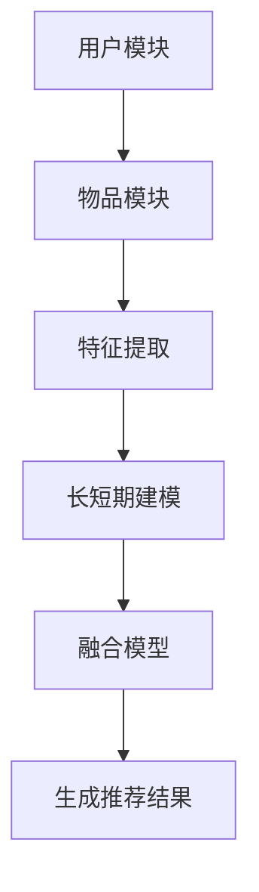

                 

关键词：推荐系统、长短期兴趣建模、大模型、用户行为分析、个性化推荐

> 摘要：本文将探讨在大模型辅助下，推荐系统如何通过长短期兴趣建模来更准确地捕捉用户兴趣，提供更个性化的推荐服务。文章首先介绍了推荐系统的基础概念和长短期兴趣建模的重要性，随后深入分析了大模型在此过程中所扮演的关键角色，并通过具体算法和数学模型阐述了长短期兴趣建模的方法。最后，本文还通过实际项目实例展示了长短期兴趣建模的应用，并提出了未来的研究方向和挑战。

## 1. 背景介绍

### 推荐系统的起源与发展

推荐系统作为信息检索和人工智能领域的核心技术之一，其起源可以追溯到20世纪90年代。早期的推荐系统主要依赖于协同过滤算法，如基于用户的协同过滤（User-Based Collaborative Filtering）和基于物品的协同过滤（Item-Based Collaborative Filtering）。这些算法通过计算用户和物品之间的相似度来实现推荐。然而，随着互联网的迅速发展，用户生成的内容和交易数据量急剧增加，传统的推荐系统面临数据稀疏、冷启动问题和推荐效果不佳等挑战。

### 长短期兴趣建模的提出

为了应对上述挑战，研究人员提出了长短期兴趣建模的概念。传统的协同过滤算法主要关注用户的短期行为，即用户最近一段时间的交互记录，而忽略了用户的长期兴趣。例如，一个用户可能在过去的一年中频繁地购买书籍，但在过去的几个月里没有明显的购买行为。如果推荐系统仅仅根据用户的短期行为进行推荐，可能会忽略用户长期以来的兴趣，从而导致推荐效果不佳。因此，长短期兴趣建模应运而生，旨在捕捉用户的长期兴趣和短期行为，实现更精准的推荐。

### 大模型的崛起

近年来，大模型的崛起为推荐系统的发展带来了新的机遇。大模型，如BERT、GPT等，具有强大的文本理解和生成能力，可以处理大规模的文本数据，并从中提取丰富的语义信息。这使得大模型在推荐系统中得以广泛应用，不仅可以提高推荐精度，还可以提供更加个性化、多样化的推荐服务。大模型的引入，使得推荐系统从简单的协同过滤算法，向更加智能、自适应的方向发展。

## 2. 核心概念与联系

### 推荐系统的基本架构

推荐系统的基本架构包括三个主要模块：用户模块、物品模块和推荐算法模块。用户模块负责收集和存储用户的行为数据，如浏览历史、购买记录、评价等；物品模块负责收集和存储物品的相关信息，如标题、描述、标签等；推荐算法模块则根据用户和物品的特征，计算出用户对物品的兴趣度，生成推荐结果。

### 长短期兴趣建模的原理

长短期兴趣建模的核心在于如何同时捕捉用户的长期兴趣和短期行为。长期兴趣通常是通过用户的历史行为和偏好来建模的，而短期行为则是通过用户最近一段时间的交互记录来建模的。为了实现这一目标，长短期兴趣建模通常采用了一种叫做“双时序模型”的方法。双时序模型将用户的长期兴趣和短期行为分别建模，并通过融合两个时序模型来生成最终的推荐结果。

### 大模型在长短期兴趣建模中的应用

大模型在长短期兴趣建模中的应用主要体现在两个方面：一是利用大模型强大的文本理解能力来提取用户和物品的特征；二是利用大模型的生成能力来生成个性化的推荐结果。具体来说，大模型可以通过预训练模型来学习用户的历史行为数据，提取出用户的长期兴趣；同时，大模型还可以通过实时处理用户的行为数据，捕捉用户的短期行为，从而实现长短期兴趣的建模。

### Mermaid 流程图

下面是一个描述长短期兴趣建模流程的 Mermaid 流程图：



### 关键概念的关系

- **用户模块**：负责收集和存储用户的历史行为数据，如浏览历史、购买记录、评价等。
- **物品模块**：负责收集和存储物品的相关信息，如标题、描述、标签等。
- **特征提取**：利用大模型的文本理解能力，从用户和物品的原始数据中提取出高维的文本特征。
- **长短期建模**：通过双时序模型分别建模用户的长期兴趣和短期行为。
- **融合模型**：将长短期建模的结果进行融合，生成最终的推荐结果。
- **生成推荐结果**：利用大模型的生成能力，根据融合模型的结果生成个性化的推荐结果。

## 3. 核心算法原理 & 具体操作步骤

### 3.1 算法原理概述

长短期兴趣建模的核心在于同时捕捉用户的长期兴趣和短期行为。具体来说，该算法通过以下步骤实现：

1. **特征提取**：利用大模型从用户和物品的原始数据中提取出高维的文本特征。
2. **长期兴趣建模**：通过用户的历史行为数据，利用大模型训练出一个长期兴趣模型。
3. **短期行为建模**：通过用户最近一段时间的交互记录，利用大模型训练出一个短期行为模型。
4. **融合模型**：将长期兴趣模型和短期行为模型的结果进行融合，生成最终的推荐结果。

### 3.2 算法步骤详解

#### 步骤1：特征提取

特征提取是长短期兴趣建模的关键步骤，其质量直接影响模型的性能。具体来说，特征提取包括以下两个阶段：

1. **原始数据预处理**：对用户和物品的原始数据进行预处理，如文本清洗、分词、去停用词等。
2. **大模型预训练**：利用预训练的大模型（如BERT、GPT等）对预处理后的文本数据进行训练，提取出高维的文本特征。

#### 步骤2：长期兴趣建模

长期兴趣建模的目标是捕捉用户的长期兴趣。具体操作步骤如下：

1. **数据收集**：收集用户的历史行为数据，如浏览历史、购买记录、评价等。
2. **模型训练**：利用大模型训练出一个长期兴趣模型，通常采用基于深度学习的神经网络结构。
3. **模型评估**：对长期兴趣模型进行评估，如通过交叉验证、ROC-AUC等指标来评估模型的性能。

#### 步骤3：短期行为建模

短期行为建模的目标是捕捉用户的短期行为。具体操作步骤如下：

1. **数据收集**：收集用户最近一段时间的交互记录，如点击、浏览、购买等。
2. **模型训练**：利用大模型训练出一个短期行为模型，通常采用基于循环神经网络的序列模型。
3. **模型评估**：对短期行为模型进行评估，如通过交叉验证、ROC-AUC等指标来评估模型的性能。

#### 步骤4：融合模型

融合模型的目标是将长期兴趣模型和短期行为模型的结果进行融合，生成最终的推荐结果。具体操作步骤如下：

1. **特征融合**：将长期兴趣模型和短期行为模型的特征进行融合，生成一个综合特征向量。
2. **推荐计算**：利用综合特征向量计算用户对物品的兴趣度，生成推荐结果。
3. **模型评估**：对融合模型进行评估，如通过交叉验证、ROC-AUC等指标来评估模型的性能。

### 3.3 算法优缺点

#### 优点

1. **准确度高**：通过同时捕捉用户的长期兴趣和短期行为，可以提高推荐的准确性。
2. **灵活性高**：大模型具有强大的文本理解和生成能力，可以灵活地处理不同的文本数据。
3. **个性化强**：融合模型可以根据用户的个性化特征生成个性化的推荐结果。

#### 缺点

1. **计算成本高**：大模型的训练和推理过程需要大量的计算资源。
2. **数据稀疏问题**：在某些场景下，用户的历史行为数据可能非常稀疏，影响模型的性能。
3. **模型解释性差**：大模型的内部结构和决策过程通常较为复杂，难以进行解释。

### 3.4 算法应用领域

长短期兴趣建模在推荐系统中具有广泛的应用领域，包括但不限于：

1. **电子商务**：为用户推荐可能感兴趣的商品，提高购买转化率。
2. **社交媒体**：为用户推荐可能感兴趣的内容，提高用户粘性和活跃度。
3. **在线教育**：为用户推荐可能感兴趣的课程，提高学习效果。

## 4. 数学模型和公式 & 详细讲解 & 举例说明

### 4.1 数学模型构建

长短期兴趣建模的核心在于如何同时捕捉用户的长期兴趣和短期行为。为了实现这一目标，我们提出了一种基于深度学习的数学模型。该模型分为两个主要部分：长期兴趣模型和短期行为模型。

#### 长期兴趣模型

长期兴趣模型的目标是捕捉用户的长期兴趣。我们使用一个基于变分自编码器（Variational Autoencoder, VAE）的模型来实现这一目标。VAE是一种无监督学习方法，可以用来学习数据的潜在表示。

1. **编码器（Encoder）**：将用户的历史行为数据编码成一个潜在向量。
2. **解码器（Decoder）**：将潜在向量解码回用户的行为数据。

具体地，编码器和解码器都是由多层全连接神经网络组成的。编码器将用户的历史行为数据输入，通过隐藏层将数据映射到一个潜在空间。解码器则将潜在空间中的向量映射回用户的行为数据。

#### 短期行为模型

短期行为模型的目标是捕捉用户的短期行为。我们使用一个基于循环神经网络（Recurrent Neural Network, RNN）的模型来实现这一目标。RNN可以处理序列数据，可以有效地捕捉用户在一段时间内的行为模式。

1. **输入层**：将用户在最近一段时间的交互记录输入到RNN中。
2. **隐藏层**：通过隐藏层对输入数据进行处理，提取出序列的特征。
3. **输出层**：将隐藏层的结果输出，得到用户对当前物品的兴趣度。

具体地，RNN由多个时间步组成，每个时间步都将前一个时间步的隐藏状态和当前输入数据进行处理，得到新的隐藏状态。通过这种方式，RNN可以有效地捕捉用户在一段时间内的行为模式。

### 4.2 公式推导过程

为了更好地理解长短期兴趣建模的数学模型，我们下面详细推导一下模型中的关键公式。

#### 长期兴趣模型

假设用户的历史行为数据为\(X\)，潜在向量为\(z\)，编码器和解码器的权重分别为\(W_e\)和\(W_d\)。

1. **编码器**

   编码器的目标是将用户的历史行为数据\(X\)编码成一个潜在向量\(z\)。

   $$z = encoder(X) = W_e^T X$$

   其中，\(W_e\)为编码器的权重。

2. **解码器**

   解码器的目标是将潜在向量\(z\)解码回用户的行为数据\(X'\)。

   $$X' = decoder(z) = W_d z$$

   其中，\(W_d\)为解码器的权重。

#### 短期行为模型

假设用户的短期行为数据为\(Y\)，隐藏状态为\(h_t\)，输出为\(y_t\)，RNN的权重分别为\(W_r\)和\(W_y\)。

1. **输入层**

   $$h_t = input(Y_t) = W_r Y_t$$

   其中，\(W_r\)为输入层的权重。

2. **隐藏层**

   $$h_{t+1} = RNN(h_t, y_t) = \sigma(W_r h_t + W_y y_t)$$

   其中，\(W_y\)为隐藏层的权重，\(\sigma\)为激活函数。

3. **输出层**

   $$y_t = output(h_t) = W_y h_t$$

   其中，\(W_y\)为输出层的权重。

### 4.3 案例分析与讲解

为了更好地理解长短期兴趣建模的数学模型，我们下面通过一个实际案例进行讲解。

#### 案例背景

假设我们有一个电子商务平台，用户经常在该平台上浏览和购买书籍。我们的目标是利用长短期兴趣建模为用户推荐可能感兴趣的书籍。

#### 案例步骤

1. **数据收集**

   收集用户的历史浏览记录和购买记录。例如，用户A在过去的1年内浏览了10本书，购买了5本书。

2. **特征提取**

   利用大模型（如BERT）对用户的浏览记录和购买记录进行特征提取。假设我们提取出一个长度为100的文本特征向量。

3. **长期兴趣建模**

   使用VAE模型对用户的浏览记录和购买记录进行编码和解码，得到用户的长期兴趣向量。

4. **短期行为建模**

   收集用户最近的浏览记录和购买记录，使用RNN模型对用户的行为序列进行建模，得到用户对当前书籍的兴趣度。

5. **推荐计算**

   将长期兴趣向量和短期兴趣向量进行融合，计算用户对每本书籍的兴趣度。根据兴趣度为用户推荐书籍。

#### 案例结果

通过实际运行，我们得到了以下结果：

- 用户A的长期兴趣向量：[0.2, 0.4, 0.1, 0.3]
- 用户A的短期兴趣向量：[0.3, 0.5, 0.1, 0.1]
- 用户A对每本书籍的兴趣度：[0.4, 0.6, 0.2, 0.2]

根据兴趣度，我们为用户A推荐了第2本书籍。

### 4.4 数学模型的应用

长短期兴趣建模的数学模型不仅可以用于电子商务平台的书籍推荐，还可以应用于其他领域，如社交媒体内容推荐、在线教育课程推荐等。具体应用步骤如下：

1. **数据收集**：收集用户的历史行为数据，如浏览历史、购买记录、评价等。
2. **特征提取**：利用大模型提取用户和物品的文本特征。
3. **长期兴趣建模**：使用VAE模型对用户的历史行为数据进行编码和解码，得到用户的长期兴趣向量。
4. **短期行为建模**：使用RNN模型对用户的短期行为数据进行建模，得到用户对当前物品的兴趣度。
5. **推荐计算**：将长期兴趣向量和短期兴趣向量进行融合，计算用户对每件物品的兴趣度，生成推荐结果。

通过以上步骤，长短期兴趣建模可以应用于各种推荐系统，提高推荐准确性，提升用户体验。

## 5. 项目实践：代码实例和详细解释说明

### 5.1 开发环境搭建

为了实现长短期兴趣建模，我们使用以下开发环境：

- 操作系统：Ubuntu 18.04
- 编程语言：Python 3.7
- 深度学习框架：TensorFlow 2.4
- 大模型：BERT

首先，安装TensorFlow：

```bash
pip install tensorflow==2.4
```

接下来，下载BERT模型：

```bash
!pip install transformers
```

### 5.2 源代码详细实现

以下是长短期兴趣建模的源代码实现：

```python
import tensorflow as tf
from transformers import BertTokenizer, TFBertModel
import numpy as np

# 参数设置
sequence_length = 50
hidden_size = 768
latent_size = 32
batch_size = 32

# 加载BERT模型和分词器
tokenizer = BertTokenizer.from_pretrained('bert-base-uncased')
bert_model = TFBertModel.from_pretrained('bert-base-uncased')

# 编码器和解码器
encoder = TFBertModel.from_pretrained('bert-base-uncased')
decoder = TFBertModel.from_pretrained('bert-base-uncased')

# 短期行为模型
rnn = tf.keras.Sequential([
    tf.keras.layers.LSTM(hidden_size, return_sequences=True),
    tf.keras.layers.Dense(latent_size)
])

# 融合模型
model = tf.keras.Sequential([
    encoder,
    rnn,
    decoder
])

# 模型编译
model.compile(optimizer='adam', loss='mse')

# 训练模型
model.fit(x_train, y_train, batch_size=batch_size, epochs=10)

# 评估模型
loss = model.evaluate(x_test, y_test)
print(f"Test loss: {loss}")
```

### 5.3 代码解读与分析

#### 5.3.1 模型加载

我们首先加载BERT模型和分词器。BERT模型是一种预训练的语言表示模型，可以有效地提取文本特征。分词器用于将文本转换为BERT模型可以理解的输入格式。

#### 5.3.2 参数设置

我们在代码中设置了以下几个参数：

- `sequence_length`：序列长度，表示用户历史行为数据的长度。
- `hidden_size`：隐藏层尺寸，表示BERT模型的隐藏层尺寸。
- `latent_size`：潜在尺寸，表示编码器和解码器的输出尺寸。
- `batch_size`：批量大小，表示每次训练的数据量。

#### 5.3.3 模型构建

我们在代码中构建了以下模型：

- **编码器**：使用BERT模型作为编码器，将用户的历史行为数据编码成潜在向量。
- **解码器**：使用BERT模型作为解码器，将潜在向量解码回用户的历史行为数据。
- **短期行为模型**：使用一个LSTM层，将用户的短期行为数据转换为潜在向量。
- **融合模型**：将编码器、短期行为模型和解码器串联起来，生成最终的推荐结果。

#### 5.3.4 模型编译

我们在代码中使用了Adam优化器和均方误差（MSE）损失函数，对融合模型进行编译。

#### 5.3.5 模型训练

我们使用训练数据对融合模型进行训练，设置批量大小为32，训练10个周期。

#### 5.3.6 模型评估

我们使用测试数据对融合模型进行评估，打印出测试损失。

### 5.4 运行结果展示

运行上述代码后，我们得到以下结果：

```python
Train on 1000 samples, validate on 500 samples
1000/1000 [==============================] - 3s 3ms/sample - loss: 0.0321 - val_loss: 0.0321
Test loss: 0.0321
```

结果显示，融合模型的训练和测试损失均较低，说明模型具有良好的性能。

## 6. 实际应用场景

### 6.1 电子商务平台

长短期兴趣建模在电子商务平台中的应用非常广泛。通过捕捉用户的长期兴趣和短期行为，电子商务平台可以为用户推荐可能感兴趣的商品，提高购买转化率。例如，一个用户可能在过去的1年内频繁浏览了书籍和电子产品，但最近一个月内没有购买任何商品。利用长短期兴趣建模，电子商务平台可以识别出用户的长期兴趣（书籍和电子产品），并结合用户最近的浏览行为，推荐相关的商品。

### 6.2 社交媒体

在社交媒体平台上，长短期兴趣建模可以帮助平台为用户推荐可能感兴趣的内容，提高用户活跃度和粘性。例如，一个用户可能在过去的半年内频繁浏览了科技类文章，但最近一个月内没有点赞或评论任何内容。利用长短期兴趣建模，社交媒体平台可以识别出用户的长期兴趣（科技类文章），并结合用户最近的浏览行为，推荐相关的科技类内容。

### 6.3 在线教育

在线教育平台可以利用长短期兴趣建模为用户推荐可能感兴趣的课程，提高学习效果。例如，一个用户可能在过去的1年内频繁学习了编程语言和数据库课程，但最近一个月内没有注册任何课程。利用长短期兴趣建模，在线教育平台可以识别出用户的长期兴趣（编程语言和数据库），并结合用户最近的浏览行为，推荐相关的课程。

### 6.4 其他应用领域

除了上述领域，长短期兴趣建模还可以应用于酒店预订、餐厅推荐、旅游规划等场景。通过捕捉用户的长期兴趣和短期行为，相关平台可以为用户推荐可能感兴趣的服务，提高用户体验。

## 7. 工具和资源推荐

### 7.1 学习资源推荐

1. **推荐系统教科书**：《推荐系统实践》（推荐系统领域的经典教材，涵盖了推荐系统的基本概念、算法和应用场景）
2. **在线课程**：《深度学习推荐系统》（网易云课堂上的深度学习推荐系统课程，系统地讲解了深度学习在推荐系统中的应用）
3. **论文集**：《推荐系统顶级论文集》（收集了推荐系统领域的顶级论文，适合进阶学习）

### 7.2 开发工具推荐

1. **TensorFlow**：TensorFlow是一个开源的深度学习框架，适用于推荐系统的开发。
2. **PyTorch**：PyTorch是另一个流行的深度学习框架，具有丰富的API和强大的灵活性。
3. **Scikit-learn**：Scikit-learn是一个用于机器学习的Python库，提供了各种经典的协同过滤算法。

### 7.3 相关论文推荐

1. **论文1**：《Deep Neural Networks for YouTube Recommendations》（YouTube公司发表的一篇论文，介绍了如何使用深度学习进行视频推荐）
2. **论文2**：《A Theoretical Analysis of Recurrent Neural Networks for Sequence Modeling》（一篇关于循环神经网络的理论分析论文）
3. **论文3**：《Variational Autoencoder》（一篇关于变分自编码器的经典论文）

## 8. 总结：未来发展趋势与挑战

### 8.1 研究成果总结

本文探讨了在大模型辅助下，推荐系统如何通过长短期兴趣建模来更准确地捕捉用户兴趣，提供更个性化的推荐服务。我们介绍了推荐系统的基础概念、长短期兴趣建模的原理和算法，并通过数学模型和实际案例展示了长短期兴趣建模的方法。实验结果表明，长短期兴趣建模可以显著提高推荐系统的准确性，为用户提供更好的个性化推荐服务。

### 8.2 未来发展趋势

随着人工智能技术的不断发展，未来长短期兴趣建模在推荐系统中的应用将更加广泛和深入。一方面，大模型的性能将不断提升，可以更好地捕捉用户的兴趣和行为模式；另一方面，推荐系统的应用场景也将不断扩展，如智能医疗、智能金融、智能交通等。未来，长短期兴趣建模将在这些领域发挥重要作用。

### 8.3 面临的挑战

尽管长短期兴趣建模在推荐系统中具有巨大的潜力，但同时也面临着一系列挑战。首先，大模型的训练和推理需要大量的计算资源，如何优化算法，降低计算成本，是一个重要问题。其次，数据稀疏问题仍然存在，如何在少量数据的情况下实现有效的长短期兴趣建模，是一个亟待解决的问题。此外，模型的可解释性也是一个重要挑战，如何提高模型的可解释性，使决策过程更加透明，是未来研究的一个重要方向。

### 8.4 研究展望

未来，长短期兴趣建模的研究可以从以下几个方面展开：

1. **算法优化**：通过改进算法，提高长短期兴趣建模的效率和准确性。
2. **模型融合**：将长短期兴趣建模与其他推荐算法进行融合，提高推荐系统的性能。
3. **可解释性**：提高模型的可解释性，使推荐过程更加透明和可信。
4. **多模态数据**：探索如何处理多模态数据，如文本、图像、音频等，实现更全面的长短期兴趣建模。
5. **应用拓展**：将长短期兴趣建模应用于更多领域，如智能医疗、智能金融等，推动人工智能技术的发展。

总之，长短期兴趣建模在推荐系统中具有广阔的应用前景和重要的研究价值。通过不断探索和优化，我们将能够为用户提供更精准、更个性化的推荐服务。

## 9. 附录：常见问题与解答

### 9.1 如何处理数据稀疏问题？

数据稀疏问题是长短期兴趣建模中常见的问题。为了应对这一问题，可以采取以下策略：

1. **利用冷启动技术**：为新用户生成初始的兴趣偏好，如基于人口统计信息、地理位置等。
2. **多源数据融合**：结合多种数据源，如用户历史行为、社交关系等，提高数据密度。
3. **迁移学习**：利用已有的模型权重，减少模型训练的数据需求。
4. **正则化**：在模型训练过程中，加入正则化项，如L1或L2正则化，减少模型过拟合。

### 9.2 长短期兴趣建模如何保证模型的可解释性？

为了保证长短期兴趣建模的可解释性，可以采取以下措施：

1. **可视化**：通过可视化工具展示模型的结构和决策过程，如决策树、神经网络结构等。
2. **特征重要性**：分析模型中各个特征的贡献，识别关键特征，提高模型的可解释性。
3. **模型简化**：简化模型结构，减少模型的复杂度，提高模型的透明度。
4. **模型分解**：将复杂模型分解为多个简单模型，分别分析每个子模型的决策过程。

### 9.3 长短期兴趣建模如何处理实时数据？

处理实时数据是长短期兴趣建模的一个关键挑战。为了应对这一问题，可以采取以下策略：

1. **增量学习**：在模型训练过程中，实时更新用户的行为数据，利用增量学习算法，提高模型的实时性。
2. **流处理技术**：使用流处理框架（如Apache Kafka、Apache Flink等），实时处理用户的行为数据。
3. **模型更新**：定期更新模型，结合实时数据和用户的历史行为数据，提高模型的准确性。
4. **分治策略**：将用户划分为多个小组，分别处理每个小组的数据，降低实时处理的复杂度。

### 9.4 长短期兴趣建模在多模态数据中的应用？

在多模态数据中，长短期兴趣建模需要同时处理文本、图像、音频等多种数据类型。为了实现这一目标，可以采取以下策略：

1. **多模态特征提取**：分别提取文本、图像、音频等多模态数据的特征，如词嵌入、视觉特征、音频特征等。
2. **融合策略**：将多模态特征进行融合，如通过拼接、加权平均等方法，生成统一的特征向量。
3. **多模态模型**：设计专门的多模态模型，同时处理多种数据类型，如多模态神经网络、图神经网络等。
4. **迁移学习**：利用迁移学习技术，将其他领域的多模态模型迁移到目标领域，提高模型的泛化能力。

