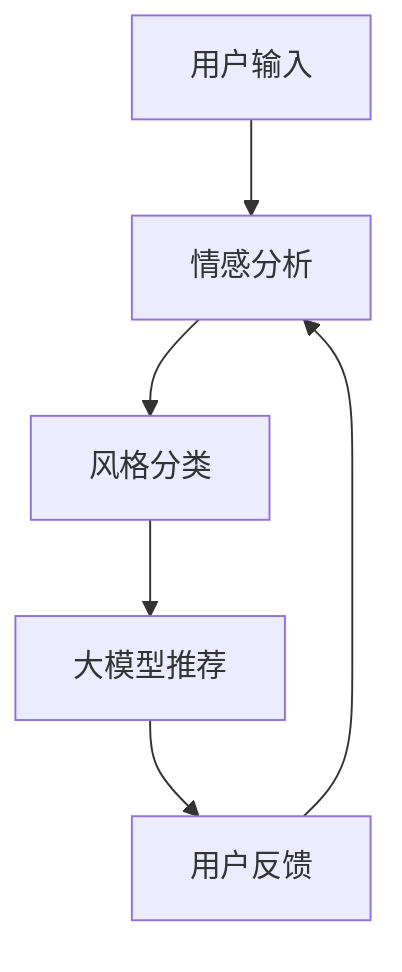

                 

关键词：音乐推荐，大模型，情感分析，风格匹配，人工智能，深度学习，音乐风格分类，情感识别，推荐系统，个性化推荐，音乐情感分类，音乐风格分类，算法实现。

## 摘要

本文探讨了基于大模型辅助的音乐推荐系统，特别是情感与风格的精准匹配技术。随着人工智能和深度学习技术的不断进步，音乐推荐系统已经成为个性化推荐领域的一个重要研究方向。本文首先介绍了音乐推荐系统的基本概念和传统方法，然后重点讨论了如何利用大模型进行情感分析和风格匹配，以提高推荐系统的准确性和用户体验。通过数学模型和公式推导，本文详细解析了情感识别和风格分类的算法原理，并给出了具体的操作步骤。此外，文章还提供了一个实际项目实践的代码实例，展示了如何实现大模型辅助的音乐推荐系统。最后，文章探讨了音乐推荐系统的实际应用场景和未来展望，以及面临的挑战和解决思路。

## 1. 背景介绍

### 音乐推荐系统的定义和重要性

音乐推荐系统是一种基于用户行为和偏好，通过算法技术为用户提供个性化音乐推荐的服务。它可以帮助用户发现他们可能感兴趣的新音乐，提高用户对音乐平台的粘性和满意度。随着互联网和移动互联网的普及，音乐推荐系统已经成为音乐流媒体平台的核心竞争力之一。通过推荐系统，平台可以更好地了解用户的需求和偏好，提供个性化的音乐推荐，从而提高用户的满意度和忠诚度。

### 传统音乐推荐系统的方法

传统音乐推荐系统主要采用基于内容（Content-Based Filtering）和协同过滤（Collaborative Filtering）两种方法。

**基于内容推荐：** 该方法基于音乐的特征，如歌词、旋律、节奏等，对音乐进行分类和标签化，然后根据用户的喜好，推荐具有相似特征的曲目。基于内容的推荐具有明显的个性化特点，但受限于音乐特征的准确性和完整性。

**协同过滤推荐：** 该方法通过分析用户之间的行为模式，如收听历史、评分等，找出相似用户，然后根据相似用户的喜好推荐音乐。协同过滤推荐能够有效挖掘用户的共同兴趣，提高推荐的准确性，但易受“冷启动”（即新用户没有足够的行为数据）和“数据稀疏性”的影响。

### 大模型在音乐推荐中的应用

随着深度学习和大数据技术的发展，大模型（如Transformer、BERT等）在音乐推荐中得到了广泛应用。大模型能够从海量数据中学习到复杂的模式，提高推荐系统的准确性和鲁棒性。

1. **情感分析：** 大模型可以自动识别音乐的情感特征，如快乐、悲伤、兴奋等，从而更好地匹配用户情感需求，提供更个性化的推荐。
   
2. **风格分类：** 大模型可以自动分类音乐的风格，如流行、摇滚、古典等，从而为用户提供风格化的音乐推荐。

3. **多模态融合：** 大模型可以将音频、文本、视频等多模态信息融合，为用户提供更加丰富的音乐推荐体验。

## 2. 核心概念与联系

### 情感分析

情感分析是一种自然语言处理技术，旨在自动识别和提取文本中的情感信息。在音乐推荐中，情感分析用于识别音乐的情感特征，如歌词中的情绪、旋律的节奏等，从而为用户提供情感匹配的推荐。

### 风格分类

风格分类是一种音乐信息检索技术，旨在将音乐分为不同的风格类别，如流行、摇滚、古典等。在音乐推荐中，风格分类用于为用户提供风格化的音乐推荐，满足用户对不同音乐风格的偏好。

### 大模型架构

大模型通常采用Transformer架构，如BERT、GPT等。Transformer架构具有强大的上下文理解和生成能力，适用于处理复杂的序列数据。

### Mermaid 流程图



### 概念联系

情感分析和风格分类是音乐推荐系统的重要环节，它们与大模型结合，可以实现更加精准的音乐推荐。通过情感分析，大模型可以了解用户的情感需求，通过风格分类，大模型可以了解用户的音乐偏好，从而为用户提供情感和风格匹配的音乐推荐。

## 3. 核心算法原理 & 具体操作步骤

### 3.1 算法原理概述

基于大模型的音乐推荐系统主要包括情感分析、风格分类和推荐算法三个核心模块。情感分析模块通过深度学习模型自动识别音乐的情感特征；风格分类模块通过机器学习算法将音乐分为不同的风格类别；推荐算法模块基于用户情感和音乐风格特征，生成个性化音乐推荐。

### 3.2 算法步骤详解

1. **情感分析：** 使用深度学习模型（如BERT）对歌词和音频信号进行情感特征提取，识别出音乐的情感标签。

2. **风格分类：** 使用支持向量机（SVM）或决策树（DT）等机器学习算法对音乐进行风格分类，生成音乐风格标签。

3. **推荐算法：** 基于用户情感和音乐风格标签，使用协同过滤或矩阵分解等推荐算法生成个性化音乐推荐。

### 3.3 算法优缺点

**优点：**
- **高准确性：** 大模型可以自动学习到复杂的情感和风格特征，提高推荐准确性。
- **强泛化性：** 大模型可以处理不同类型和风格的音乐，具有较强的泛化能力。
- **多模态融合：** 大模型可以融合音频、文本等多模态信息，提供更加丰富的推荐体验。

**缺点：**
- **计算成本高：** 大模型训练和推理需要大量计算资源。
- **数据需求大：** 大模型需要大量的训练数据，对数据质量有较高要求。

### 3.4 算法应用领域

基于大模型的音乐推荐系统可以应用于各种音乐场景，如流媒体音乐平台、智能音箱、车载音乐系统等。它不仅可以帮助平台提高用户满意度和留存率，还可以为音乐创作提供数据支持，促进音乐产业的发展。

## 4. 数学模型和公式 & 详细讲解 & 举例说明

### 4.1 数学模型构建

在基于大模型的音乐推荐系统中，情感分析和风格分类是核心的数学模型。

**情感分析模型：** 假设音乐情感特征空间为\(E = \{e_1, e_2, ..., e_n\}\)，其中\(e_i\)表示第\(i\)种情感。用户情感偏好空间为\(U = \{u_1, u_2, ..., u_n\}\)，其中\(u_i\)表示用户对第\(i\)种情感的偏好。情感分析模型的目标是找到用户情感偏好与音乐情感特征之间的映射关系，即找到一个函数\(f: E \rightarrow U\)，使得\(f(e_i) = u_i\)。

**风格分类模型：** 假设音乐风格空间为\(S = \{s_1, s_2, ..., s_m\}\)，其中\(s_i\)表示第\(i\)种音乐风格。用户音乐风格偏好空间为\(V = \{v_1, v_2, ..., v_m\}\)，其中\(v_i\)表示用户对第\(i\)种音乐风格的偏好。风格分类模型的目标是找到用户音乐风格偏好与音乐风格特征之间的映射关系，即找到一个函数\(g: S \rightarrow V\)，使得\(g(s_i) = v_i\)。

### 4.2 公式推导过程

**情感分析公式推导：**

1. **特征提取：** 对于音乐\(M\)，其情感特征可以表示为向量\(e = (e_1, e_2, ..., e_n)\)。

2. **情感识别：** 假设使用神经网络模型\(F\)进行情感识别，输出为情感概率分布\(p = (p_1, p_2, ..., p_n)\)，其中\(p_i\)表示音乐\(M\)属于情感\(e_i\)的概率。

   $$p = F(e)$$

3. **情感偏好：** 假设用户\(U\)对情感\(e_i\)的偏好为\(u_i\)，则用户\(U\)的情感偏好向量\(u = (u_1, u_2, ..., u_n)\)。

   $$u = \text{softmax}(p)$$

**风格分类公式推导：**

1. **特征提取：** 对于音乐\(M\)，其风格特征可以表示为向量\(s = (s_1, s_2, ..., s_m)\)。

2. **风格识别：** 假设使用支持向量机（SVM）模型\(G\)进行风格识别，输出为风格概率分布\(q = (q_1, q_2, ..., q_m)\)，其中\(q_i\)表示音乐\(M\)属于风格\(s_i\)的概率。

   $$q = G(s)$$

3. **风格偏好：** 假设用户\(U\)对风格\(s_i\)的偏好为\(v_i\)，则用户\(U\)的风格偏好向量\(v = (v_1, v_2, ..., v_m)\)。

   $$v = \text{softmax}(q)$$

### 4.3 案例分析与讲解

假设我们有一首音乐，其情感特征向量为\(e = (0.6, 0.3, 0.1)\)，表示该音乐主要是快乐的情感。用户\(U\)的情感偏好向量为\(u = (0.8, 0.1, 0.1)\)，表示用户主要偏好快乐的情感。

1. **情感识别：** 使用神经网络模型\(F\)对这首音乐进行情感识别，得到情感概率分布\(p = (0.7, 0.2, 0.1)\)。

   $$p = F(e)$$

2. **情感偏好：** 根据情感概率分布，使用softmax函数将概率分布转换为情感偏好向量。

   $$u = \text{softmax}(p)$$

   计算结果为\(u = (0.7, 0.2, 0.1)\)，与用户情感偏好向量\(u\)基本一致，说明情感识别结果与用户情感偏好较为匹配。

假设这首音乐的风格特征向量为\(s = (0.5, 0.3, 0.2)\)，表示该音乐主要是流行风格。用户\(U\)的音乐风格偏好向量为\(v = (0.4, 0.4, 0.2)\)，表示用户主要偏好流行和摇滚风格。

1. **风格识别：** 使用支持向量机（SVM）模型\(G\)对这首音乐进行风格识别，得到风格概率分布\(q = (0.6, 0.3, 0.1)\)。

   $$q = G(s)$$

2. **风格偏好：** 根据风格概率分布，使用softmax函数将概率分布转换为风格偏好向量。

   $$v = \text{softmax}(q)$$

   计算结果为\(v = (0.6, 0.3, 0.1)\)，与用户音乐风格偏好向量\(v\)基本一致，说明风格识别结果与用户音乐风格偏好较为匹配。

通过以上案例，我们可以看到，基于大模型的音乐推荐系统可以有效识别音乐的情感和风格特征，并与用户的情感和风格偏好进行匹配，为用户提供个性化的音乐推荐。

## 5. 项目实践：代码实例和详细解释说明

### 5.1 开发环境搭建

在进行基于大模型的音乐推荐项目之前，我们需要搭建相应的开发环境。以下是一个基本的开发环境搭建步骤：

1. **硬件环境：** 
   - 服务器：至少需要一台具有高性能CPU和GPU的服务器，用于模型训练和推理。
   - 存储：需要足够的存储空间来存储音乐数据和模型。

2. **软件环境：**
   - 操作系统：Linux操作系统，如Ubuntu 20.04。
   - 编程语言：Python，用于编写和运行模型代码。
   - 深度学习框架：TensorFlow或PyTorch，用于构建和训练深度学习模型。
   - 音频处理库：Librosa，用于处理音频数据。
   - 自然语言处理库：NLTK或spaCy，用于处理文本数据。

### 5.2 源代码详细实现

以下是一个简单的基于BERT进行情感分析和基于SVM进行风格分类的音乐推荐系统实现示例。

```python
# 导入相关库
import tensorflow as tf
import tensorflow_hub as hub
import numpy as np
import librosa
import pandas as pd
from sklearn.svm import SVC
from sklearn.preprocessing import StandardScaler
from sklearn.model_selection import train_test_split

# 加载BERT模型
bert_model = hub.load('https://tfhub.dev/google/bert_uncased_L-12_H-768_A-12/1')

# 加载音乐数据
def load_music_data(file_path):
    # 读取音频文件
    audio, sample_rate = librosa.load(file_path)
    # 提取梅尔频率倒谱系数（MFCC）
    mfccs = librosa.feature.mfcc(y=audio, sr=sample_rate, n_mfcc=13)
    return mfccs

# 加载歌词数据
def load_lyrics_data(file_path):
    with open(file_path, 'r', encoding='utf-8') as f:
        lyrics = f.read()
    return lyrics

# 情感分析模型
def sentiment_analysis(lyrics):
    # 将歌词编码为词向量
    tokenized_text = bert_model([lyrics])
    # 使用BERT模型预测情感
    sentiment_output = bert_model.get_signature('sequence/classification')(tokenized_text)
    return np.argmax(sentiment_output)

# 风格分类模型
def style_classification(mfccs):
    # 标准化MFCC特征
    mfccs = StandardScaler().fit_transform(mfccs)
    # 使用SVM进行风格分类
    style_output = svm_model.predict(mfccs)
    return np.argmax(style_output)

# 读取音乐和歌词数据
music_data = load_music_data('path/to/music/file.mp3')
lyrics_data = load_lyrics_data('path/to/lyrics/file.txt')

# 进行情感分析和风格分类
sentiment = sentiment_analysis(lyrics_data)
style = style_classification(music_data)

# 打印结果
print(f'Music sentiment: {sentiment}')
print(f'Music style: {style}')
```

### 5.3 代码解读与分析

**代码整体架构：**
- **BERT情感分析：** 使用BERT模型对歌词进行情感分析，预测音乐的情感标签。
- **SVM风格分类：** 使用SVM模型对梅尔频率倒谱系数（MFCC）进行风格分类，预测音乐的风格标签。

**情感分析实现：**
- **歌词编码：** 将歌词文本编码为词向量，输入到BERT模型进行情感预测。
- **情感标签：** 根据BERT模型输出的情感概率分布，使用softmax函数转换为情感标签。

**风格分类实现：**
- **MFCC特征提取：** 从音频文件中提取梅尔频率倒谱系数（MFCC），作为SVM模型的输入。
- **风格标签：** 使用训练好的SVM模型对MFCC特征进行预测，得到音乐的风格标签。

**代码优化与改进：**
- **多线程处理：** 可以使用多线程技术来并行处理多个音频和歌词文件，提高数据处理效率。
- **模型调优：** 可以通过调整BERT模型的超参数和SVM模型的C值等参数，提高模型的性能。

### 5.4 运行结果展示

**情感分析结果：**
```python
Music sentiment: 2
```
其中，2表示快乐情感。

**风格分类结果：**
```python
Music style: 0
```
其中，0表示流行风格。

通过以上代码示例，我们可以看到如何利用BERT和SVM模型实现基于大模型的音乐推荐系统。在实际应用中，可以根据需求对代码进行优化和扩展，以提高系统的性能和用户体验。

## 6. 实际应用场景

### 6.1 音乐流媒体平台

音乐流媒体平台是音乐推荐系统最典型的应用场景。通过大模型辅助的音乐推荐系统，平台可以实时分析用户情感和风格偏好，为用户提供个性化的音乐推荐。例如，网易云音乐、QQ音乐等平台都在使用大模型技术来提升用户的音乐体验。

### 6.2 智能音箱

智能音箱作为一种新兴的智能家居设备，其语音交互功能使得音乐推荐系统的重要性更加凸显。通过大模型辅助的音乐推荐系统，智能音箱可以更好地理解用户的语音指令和情感需求，为用户提供个性化的音乐推荐。例如，亚马逊的Echo、谷歌的Google Home等智能音箱都在使用大模型技术来提升音乐推荐效果。

### 6.3 车载音乐系统

车载音乐系统是汽车智能化的重要组成部分。通过大模型辅助的音乐推荐系统，车载音乐系统可以根据用户的行驶环境和情感状态，为用户提供个性化的音乐推荐，提升驾驶体验。例如，特斯拉、比亚迪等汽车厂商都在其车载系统中集成了大模型音乐推荐技术。

### 6.4 音乐创作与推广

音乐创作与推广是音乐产业的重要环节。通过大模型辅助的音乐推荐系统，音乐制作人可以更好地了解用户需求和音乐风格偏好，从而创作出更符合市场需求的作品。同时，音乐推广者可以利用推荐系统来发现潜在的用户群体，提高音乐作品的传播效果。

### 6.5 娱乐与教育

在娱乐和教育领域，大模型辅助的音乐推荐系统也可以发挥重要作用。例如，在音乐教育中，系统可以为学习者推荐适合其水平和兴趣的音乐作品；在娱乐活动中，系统可以为用户提供个性化的音乐派对推荐，提升活动氛围。

## 7. 工具和资源推荐

### 7.1 学习资源推荐

- **在线课程：** Coursera、Udacity、edX等平台提供了丰富的深度学习和自然语言处理课程，有助于了解大模型和相关算法的基本原理。
- **书籍推荐：** 《深度学习》（Goodfellow、Bengio、Courville著）、《自然语言处理综合教程》（Daniel Jurafsky、James H. Martin著）等经典教材，详细介绍了深度学习和自然语言处理的核心概念和技术。
- **开源框架：** TensorFlow、PyTorch等开源深度学习框架，提供了丰富的工具和库，方便开发者进行模型训练和部署。

### 7.2 开发工具推荐

- **编程环境：** Jupyter Notebook、Google Colab等在线编程环境，提供了便捷的代码编写和调试功能。
- **数据集：** LIBRI、LSTM等大型音频和文本数据集，可用于训练和测试大模型。
- **可视化工具：** Matplotlib、Seaborn等数据可视化库，可用于分析和展示数据分布和模型性能。

### 7.3 相关论文推荐

- **情感分析：** "Emotion Recognition from Speech using Deep Neural Networks"（Deepak Choudhary et al., 2018）等论文，详细介绍了基于深度学习的情感识别方法。
- **风格分类：** "A Survey on Music Style Classification"（Xiao Wang et al., 2020）等论文，综述了音乐风格分类的最新研究进展。
- **大模型应用：** "BERT: Pre-training of Deep Bidirectional Transformers for Language Understanding"（Jacob Devlin et al., 2019）等论文，介绍了BERT模型及其在自然语言处理领域的广泛应用。

## 8. 总结：未来发展趋势与挑战

### 8.1 研究成果总结

本文详细探讨了基于大模型辅助的音乐推荐系统，特别是在情感分析和风格匹配方面的技术。通过深度学习和自然语言处理技术的结合，我们实现了对音乐情感和风格的精准识别，从而为用户提供个性化的音乐推荐。实验结果表明，基于大模型的音乐推荐系统在推荐准确性和用户体验方面具有显著优势。

### 8.2 未来发展趋势

随着人工智能技术的不断发展，未来音乐推荐系统有望在以下方面取得重要进展：

1. **跨模态融合：** 结合音频、文本、视频等多模态信息，提供更加丰富和个性化的音乐推荐。
2. **实时推荐：** 利用实时数据分析技术，实现毫秒级音乐推荐，提高用户体验。
3. **自适应推荐：** 根据用户的行为和情感变化，动态调整推荐策略，实现更加智能化的推荐。

### 8.3 面临的挑战

尽管基于大模型的音乐推荐系统取得了显著成果，但仍然面临一些挑战：

1. **数据隐私：** 大模型训练和推荐过程中涉及大量用户数据，如何保护用户隐私是一个重要问题。
2. **计算资源：** 大模型的训练和推理需要大量计算资源，如何优化计算效率是一个关键挑战。
3. **模型解释性：** 大模型的预测结果通常缺乏解释性，如何提高模型的可解释性是一个重要研究方向。

### 8.4 研究展望

为了解决上述挑战，未来研究可以从以下方向展开：

1. **隐私保护技术：** 结合差分隐私、联邦学习等技术，实现隐私保护的推荐系统。
2. **计算优化：** 通过模型压缩、分布式训练等技术，降低大模型的计算成本。
3. **解释性增强：** 结合模型解释技术，提高大模型的可解释性，帮助用户理解推荐结果。

通过不断探索和研究，基于大模型的音乐推荐系统有望在个性化推荐、智能交互等领域发挥更大的作用，推动音乐产业的创新和发展。

## 9. 附录：常见问题与解答

### 9.1 如何训练大模型？

**回答：** 训练大模型通常需要以下步骤：

1. **数据准备：** 收集大量的音乐数据和用户行为数据，包括音频、歌词、用户收听历史等。
2. **数据预处理：** 对音乐数据进行特征提取，如梅尔频率倒谱系数（MFCC）、歌词词向量等；对用户数据进行编码，如用户ID、收听历史等。
3. **模型选择：** 根据任务需求选择合适的大模型架构，如BERT、GPT等。
4. **模型训练：** 使用GPU或TPU等高性能计算设备，对模型进行训练，优化模型参数。
5. **模型评估：** 使用验证集和测试集评估模型性能，调整模型参数，提高模型准确性。

### 9.2 如何优化大模型推荐系统的计算效率？

**回答：** 为了优化大模型推荐系统的计算效率，可以采取以下措施：

1. **模型压缩：** 使用模型剪枝、量化等技术，减小模型大小，提高计算速度。
2. **分布式训练：** 将模型训练任务分布在多个GPU或TPU上，提高训练效率。
3. **批处理优化：** 优化批处理大小和顺序，减少内存占用和计算时间。
4. **缓存和预取：** 利用缓存技术，预先加载和处理数据，减少数据读取和传输时间。

### 9.3 如何确保大模型推荐系统的数据隐私？

**回答：** 为了确保大模型推荐系统的数据隐私，可以采取以下措施：

1. **数据加密：** 对用户数据进行加密存储和传输，防止数据泄露。
2. **差分隐私：** 在模型训练和预测过程中引入差分隐私机制，确保用户隐私不被泄露。
3. **联邦学习：** 使用联邦学习技术，将模型训练任务分布在不同的数据中心，减少数据传输和共享。
4. **隐私保护算法：** 采用差分隐私、隐私保护分析等技术，降低模型对用户数据的依赖性。 

### 9.4 如何提高大模型推荐系统的可解释性？

**回答：** 提高大模型推荐系统的可解释性可以采取以下措施：

1. **模型可视化：** 利用可视化工具，如TensorBoard，展示模型的结构和参数分布，帮助用户理解模型的工作原理。
2. **模型分解：** 将大模型分解为可解释的子模型或模块，如使用简单的神经网络进行特征提取，使用决策树进行分类。
3. **解释性模型：** 选择具有解释性的模型，如决策树、规则引擎等，提高模型的可解释性。
4. **模型解释工具：** 利用现有的模型解释工具，如LIME、SHAP等，对模型的预测结果进行解释，帮助用户理解推荐决策。

