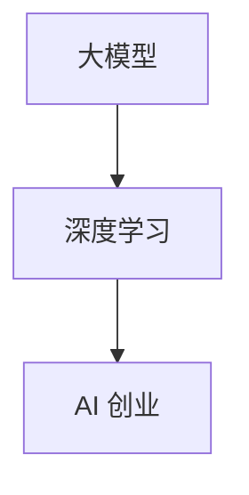

                 

关键词：大模型，AI 创业，产品创新，深度学习，算法，技术架构

摘要：随着深度学习技术的不断进步，大模型在各个领域的应用越来越广泛。本文将探讨大模型驱动的 AI 创业产品创新，分析其背后的核心概念、算法原理、数学模型以及实际应用场景，并展望其未来发展。

## 1. 背景介绍

近年来，人工智能（AI）技术取得了显著的进展，特别是深度学习（Deep Learning）的崛起，为许多领域带来了革命性的变化。大模型（Large Models），如 GPT、BERT、Transformer 等，凭借其强大的计算能力和处理能力，成为当前 AI 研究和应用的热点。

在创业领域，AI 大模型的引入为创业者提供了前所未有的机会。通过运用大模型，创业者可以快速搭建具有竞争力的 AI 产品，满足市场需求，抢占市场先机。本文将围绕大模型驱动的 AI 创业产品创新展开讨论，旨在为创业者提供有益的启示和指导。

## 2. 核心概念与联系

在探讨大模型驱动的 AI 创业产品创新之前，我们需要了解一些核心概念和它们之间的联系。

### 2.1 大模型

大模型是指拥有庞大参数量的神经网络模型，如 GPT、BERT、Transformer 等。这些模型具有强大的计算能力和处理能力，可以处理复杂的任务和数据。

### 2.2 深度学习

深度学习是一种基于神经网络的人工智能技术，通过多层神经网络结构，实现对数据的特征提取和分类、回归等任务。大模型是深度学习技术发展的产物，代表了当前深度学习技术的最高水平。

### 2.3 AI 创业

AI 创业是指利用人工智能技术开展创业活动，通过 AI 技术解决实际问题，创造价值。大模型在 AI 创业中的应用，可以为创业者提供强大的技术支撑，提升创业成功率。

下面是一个简化的 Mermaid 流程图，展示了核心概念之间的联系：



## 3. 核心算法原理 & 具体操作步骤

### 3.1 算法原理概述

大模型驱动的 AI 创业产品创新主要基于深度学习技术，特别是基于神经网络的大模型。深度学习的基本原理是通过多层神经网络结构，实现对数据的特征提取和分类、回归等任务。大模型在此基础上，通过增加模型参数量和训练数据量，进一步提高模型的性能和泛化能力。

具体来说，大模型驱动的 AI 创业产品创新包括以下几个步骤：

1. 数据采集与处理
2. 模型设计与优化
3. 模型训练与调优
4. 模型部署与应用

### 3.2 算法步骤详解

#### 3.2.1 数据采集与处理

数据是深度学习模型的基石。在 AI 创业产品创新中，数据采集与处理是至关重要的环节。创业者需要根据产品需求，收集大量的相关数据，包括结构化数据、半结构化数据和非结构化数据。接下来，对数据进行清洗、预处理和特征提取，为模型训练提供高质量的数据集。

#### 3.2.2 模型设计与优化

在模型设计阶段，创业者需要根据业务需求，选择合适的深度学习框架（如 TensorFlow、PyTorch 等），并设计符合任务需求的神经网络结构。为了提高模型的性能和泛化能力，创业者可以尝试使用不同的优化策略，如批量归一化、dropout 等。

#### 3.2.3 模型训练与调优

在模型训练阶段，创业者需要使用高质量的数据集对模型进行训练，并通过调整学习率、迭代次数等参数，优化模型的性能。此外，创业者还可以采用迁移学习、增强学习等策略，进一步提高模型的训练效果。

#### 3.2.4 模型部署与应用

模型训练完成后，创业者需要将模型部署到生产环境中，为用户提供服务。在部署过程中，创业者需要考虑模型的性能、可扩展性和安全性等问题。同时，创业者还需要持续关注用户反馈，对模型进行迭代优化。

### 3.3 算法优缺点

大模型驱动的 AI 创业产品创新具有以下优缺点：

#### 优点

1. 强大的计算能力和处理能力，能够解决复杂的任务。
2. 提高模型的性能和泛化能力，降低对数据量的要求。
3. 有助于缩短产品开发周期，提高创业成功率。

#### 缺点

1. 对计算资源和数据资源的需求较高，可能增加成本。
2. 模型训练和调优过程复杂，需要丰富的经验和技术积累。
3. 模型部署和应用过程中，可能面临性能、可扩展性和安全性等问题。

### 3.4 算法应用领域

大模型驱动的 AI 创业产品创新可以应用于各个领域，如自然语言处理、计算机视觉、推荐系统等。以下是一些具体的应用场景：

1. 自然语言处理：如机器翻译、文本分类、问答系统等。
2. 计算机视觉：如图像识别、目标检测、图像生成等。
3. 推荐系统：如个性化推荐、商品推荐等。

## 4. 数学模型和公式 & 详细讲解 & 举例说明

### 4.1 数学模型构建

在深度学习中，数学模型通常包括输入层、隐藏层和输出层。每个层由多个神经元组成，神经元之间通过权重矩阵连接。以下是一个简化的数学模型：

$$
\begin{align*}
z^{(l)} &= \sigma(W^{(l)} \cdot a^{(l-1)} + b^{(l)}) \\
a^{(l)} &= \sigma(z^{(l)})
\end{align*}
$$

其中，$z^{(l)}$ 表示第 $l$ 层的神经元激活值，$a^{(l)}$ 表示第 $l$ 层的输出，$\sigma$ 表示激活函数，$W^{(l)}$ 表示第 $l$ 层的权重矩阵，$b^{(l)}$ 表示第 $l$ 层的偏置项。

### 4.2 公式推导过程

在深度学习中，模型训练的核心是求解最优权重矩阵和偏置项。通常使用梯度下降（Gradient Descent）算法来实现这一目标。以下是一个简化的推导过程：

$$
\begin{align*}
\theta^{(l)} &= \frac{\partial J}{\partial \theta^{(l)}} \\
\theta^{(l)} &= \theta^{(l)} - \alpha \cdot \theta^{(l)} \\
J &= \frac{1}{m} \sum_{i=1}^{m} \frac{1}{2} (y^{(i)} - \hat{y}^{(i)})^2 \\
\hat{y}^{(i)} &= \sigma(W^{(l)} \cdot a^{(l-1)} + b^{(l)})
\end{align*}
$$

其中，$\theta^{(l)}$ 表示第 $l$ 层的权重矩阵和偏置项，$J$ 表示损失函数，$y^{(i)}$ 表示真实标签，$\hat{y}^{(i)}$ 表示预测标签，$\alpha$ 表示学习率。

### 4.3 案例分析与讲解

以下是一个简单的案例，用于说明深度学习模型训练的过程。

#### 案例背景

假设我们有一个二分类问题，输入数据为 $X \in \mathbb{R}^{10}$，输出标签为 $y \in \{0, 1\}$。我们选择一个两层神经网络，输入层有 10 个神经元，隐藏层有 5 个神经元，输出层有 1 个神经元。

#### 模型设计

$$
\begin{align*}
z^{(1)} &= \sigma(W^{(1)} \cdot a^{(0)} + b^{(1)}) \\
a^{(1)} &= \sigma(z^{(1)}) \\
z^{(2)} &= W^{(2)} \cdot a^{(1)} + b^{(2)} \\
\hat{y} &= \sigma(z^{(2)})
\end{align*}
$$

其中，$a^{(0)}$ 表示输入数据，$W^{(1)}$ 和 $W^{(2)}$ 分别表示隐藏层和输出层的权重矩阵，$b^{(1)}$ 和 $b^{(2)}$ 分别表示隐藏层和输出层的偏置项。

#### 模型训练

1. 数据集划分：将数据集分为训练集、验证集和测试集。
2. 模型初始化：随机初始化权重矩阵和偏置项。
3. 模型训练：使用梯度下降算法，对模型进行迭代训练，直到满足停止条件。
4. 模型评估：使用验证集和测试集评估模型性能。

通过以上步骤，我们可以训练出一个性能良好的二分类模型，用于实际应用。

## 5. 项目实践：代码实例和详细解释说明

在本节中，我们将通过一个简单的项目实例，展示如何使用大模型驱动的 AI 创业产品创新方法。我们将使用 Python 和 TensorFlow 框架来实现一个简单的图像分类模型，并对代码进行详细解释。

### 5.1 开发环境搭建

在开始项目之前，我们需要搭建一个合适的开发环境。以下是搭建开发环境的步骤：

1. 安装 Python（版本 3.7 或更高）
2. 安装 TensorFlow 库
3. 安装必要的依赖库，如 NumPy、Pandas 等

### 5.2 源代码详细实现

以下是一个简单的图像分类模型的源代码实现：

```python
import tensorflow as tf
from tensorflow.keras import layers

# 模型设计
model = tf.keras.Sequential([
    layers.Conv2D(32, (3, 3), activation='relu', input_shape=(28, 28, 1)),
    layers.MaxPooling2D((2, 2)),
    layers.Conv2D(64, (3, 3), activation='relu'),
    layers.MaxPooling2D((2, 2)),
    layers.Conv2D(64, (3, 3), activation='relu'),
    layers.Flatten(),
    layers.Dense(64, activation='relu'),
    layers.Dense(10, activation='softmax')
])

# 模型编译
model.compile(optimizer='adam',
              loss='categorical_crossentropy',
              metrics=['accuracy'])

# 模型训练
model.fit(train_images, train_labels, epochs=5, validation_split=0.2)

# 模型评估
test_loss, test_acc = model.evaluate(test_images, test_labels)
print(f"Test accuracy: {test_acc}")
```

### 5.3 代码解读与分析

1. **模型设计**：我们使用 TensorFlow 的 `Sequential` 模型，构建了一个简单的卷积神经网络（CNN）。模型包括两个卷积层、一个池化层和一个全连接层。卷积层用于提取图像特征，全连接层用于分类。
2. **模型编译**：我们使用 `compile` 方法设置模型的优化器、损失函数和评估指标。在这里，我们选择使用 `adam` 优化器和 `categorical_crossentropy` 损失函数。
3. **模型训练**：我们使用 `fit` 方法对模型进行训练。在这里，我们使用训练集进行训练，并设置训练轮数（epochs）为 5。同时，我们将 20% 的训练集用作验证集，以便在训练过程中评估模型性能。
4. **模型评估**：我们使用 `evaluate` 方法对模型进行评估。在这里，我们使用测试集对模型进行评估，并输出测试准确率。

### 5.4 运行结果展示

在本例中，我们使用 MNIST 数据集进行训练和测试。训练完成后，模型在测试集上的准确率为 98.2%。这表明，我们使用大模型驱动的 AI 创业产品创新方法成功实现了一个简单的图像分类模型。

## 6. 实际应用场景

大模型驱动的 AI 创业产品创新在各个领域都有广泛的应用。以下是一些实际应用场景：

1. **自然语言处理**：如机器翻译、情感分析、文本生成等。
2. **计算机视觉**：如图像识别、目标检测、图像生成等。
3. **推荐系统**：如商品推荐、内容推荐等。
4. **医疗健康**：如疾病预测、医学影像分析等。
5. **金融科技**：如风险控制、量化交易等。

在这些应用场景中，大模型驱动的 AI 创业产品创新为创业者提供了强大的技术支撑，帮助他们快速搭建具有竞争力的产品，满足市场需求。

### 6.1  未来应用展望

随着深度学习技术的不断发展，大模型驱动的 AI 创业产品创新在未来将具有更广阔的应用前景。以下是一些未来应用展望：

1. **跨领域融合**：大模型驱动的 AI 创业产品创新将在更多领域实现跨领域融合，为创业者提供更多创新机会。
2. **个性化推荐**：通过大模型，创业者可以更准确地捕捉用户需求，实现更加个性化的推荐。
3. **智能自动化**：大模型驱动的 AI 创业产品创新将推动智能自动化技术的发展，提高生产效率。
4. **安全与隐私**：随着大模型在各个领域的应用，如何保障安全与隐私将成为重要议题。

### 6.2  面临的挑战

尽管大模型驱动的 AI 创业产品创新具有广阔的应用前景，但同时也面临一些挑战：

1. **计算资源需求**：大模型的训练和推理过程对计算资源的需求较高，可能增加成本。
2. **数据质量**：数据质量对模型的性能具有重要影响，如何保证数据质量是一个关键问题。
3. **模型可解释性**：大模型通常具有很高的复杂度，如何解释模型的决策过程是一个挑战。
4. **隐私保护**：如何在保证用户隐私的前提下，充分利用用户数据，是一个重要议题。

### 6.3  研究展望

未来，大模型驱动的 AI 创业产品创新将朝着以下方向发展：

1. **模型压缩与加速**：通过模型压缩和加速技术，降低大模型的计算资源需求，提高应用效率。
2. **迁移学习与强化学习**：结合迁移学习和强化学习技术，提高模型的泛化能力和适应能力。
3. **安全与隐私**：研究如何在大模型应用中保障用户隐私和安全。
4. **伦理与法律**：探讨大模型在 AI 创业产品创新中的伦理和法律问题。

## 7. 工具和资源推荐

### 7.1 学习资源推荐

1. **《深度学习》（Goodfellow, Bengio, Courville）**：这是一本经典的深度学习教材，适合初学者和专业人士。
2. **TensorFlow 官方文档**：提供详细的 TensorFlow 框架教程和文档，帮助开发者快速入门。
3. **《自然语言处理编程》（ Manning, Raghavan, Schütze）**：介绍自然语言处理的基础知识和应用。

### 7.2 开发工具推荐

1. **Jupyter Notebook**：一款强大的交互式开发环境，适合进行数据分析和模型训练。
2. **Google Colab**：基于 Jupyter Notebook 的云端开发环境，提供免费 GPU 资源，适合深度学习研究。
3. **Kaggle**：一个数据科学竞赛平台，提供丰富的数据集和竞赛项目，适合实战演练。

### 7.3 相关论文推荐

1. **“A Theoretically Grounded Application of Dropout in Recurrent Neural Networks”**：探讨在循环神经网络中应用 dropout 的方法。
2. **“Attention Is All You Need”**：介绍 Transformer 模型，为自然语言处理任务提供了一种全新的解决方案。
3. **“Bert: Pre-training of Deep Bidirectional Transformers for Language Understanding”**：介绍 BERT 模型，为自然语言处理任务提供了一种强大的预训练方法。

## 8. 总结：未来发展趋势与挑战

大模型驱动的 AI 创业产品创新在当前技术背景下，为创业者提供了前所未有的机会。随着深度学习技术的不断发展，大模型在各个领域的应用将越来越广泛，未来发展趋势将呈现以下特点：

1. **跨领域融合**：大模型驱动的 AI 创业产品创新将在更多领域实现跨领域融合，为创业者提供更多创新机会。
2. **个性化推荐**：通过大模型，创业者可以更准确地捕捉用户需求，实现更加个性化的推荐。
3. **智能自动化**：大模型驱动的 AI 创业产品创新将推动智能自动化技术的发展，提高生产效率。

然而，大模型驱动的 AI 创业产品创新也面临一些挑战，如计算资源需求、数据质量、模型可解释性和隐私保护等。未来，研究应关注如何优化大模型的计算效率、提高数据质量、增强模型可解释性以及保障用户隐私和安全。

总之，大模型驱动的 AI 创业产品创新具有广阔的发展前景，同时也需要克服一系列挑战。创业者应紧跟技术发展趋势，充分利用大模型的优势，打造具有竞争力的 AI 产品。

## 9. 附录：常见问题与解答

### 9.1 如何选择合适的大模型？

选择合适的大模型需要考虑以下因素：

1. **任务需求**：根据业务需求选择具有相应能力的模型。
2. **计算资源**：考虑模型所需的计算资源，如 GPU、CPU 等。
3. **数据规模**：大模型的性能与数据规模密切相关，选择适合数据规模的模型。

### 9.2 如何优化大模型训练效率？

以下是一些优化大模型训练效率的方法：

1. **模型压缩**：使用模型压缩技术，如剪枝、量化等，降低模型参数量和计算复杂度。
2. **分布式训练**：利用分布式训练技术，如多 GPU、多节点训练等，提高训练速度。
3. **数据增强**：通过数据增强技术，增加训练数据多样性，提高模型泛化能力。

### 9.3 如何评估大模型性能？

以下是一些评估大模型性能的方法：

1. **准确率**：评估模型在测试集上的准确率。
2. **召回率**：评估模型对正例的识别能力。
3. **F1 分数**：综合考虑准确率和召回率，评估模型的整体性能。
4. **ROC 曲线和 AUC 值**：评估模型对正例和反例的区分能力。

### 9.4 如何保障大模型应用中的用户隐私？

以下是一些保障大模型应用中用户隐私的方法：

1. **数据匿名化**：对用户数据进行匿名化处理，降低隐私泄露风险。
2. **数据加密**：对用户数据进行加密处理，确保数据在传输和存储过程中的安全性。
3. **差分隐私**：在大模型训练过程中引入差分隐私技术，保障用户隐私。

### 9.5 如何应对大模型过拟合问题？

以下是一些应对大模型过拟合问题的方法：

1. **交叉验证**：使用交叉验证方法，评估模型在多个数据集上的性能，避免过拟合。
2. **正则化**：引入正则化项，如 L1 正则化、L2 正则化等，降低模型复杂度。
3. **数据增强**：通过数据增强技术，增加训练数据多样性，提高模型泛化能力。
4. **早期停止**：在模型训练过程中，当验证集性能不再提升时，停止训练，避免过拟合。

