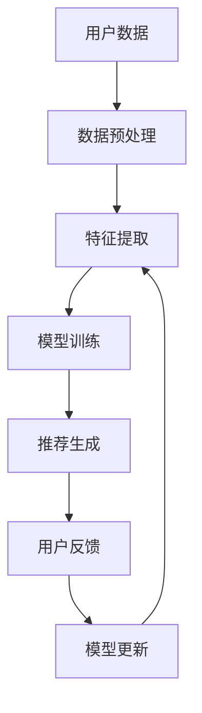

                 

推荐系统是现代信息社会中不可或缺的组成部分，它通过分析用户的历史行为和偏好，为用户提供个性化推荐，从而提升用户体验、增加用户粘性和提高商业价值。随着大数据和人工智能技术的快速发展，尤其是大模型的兴起，推荐系统的个性化策略变得更加复杂和精细。本文旨在探讨大模型在推荐系统中的应用，特别是如何利用大模型实现个性化推荐策略。

## 关键词
- 大模型
- 推荐系统
- 个性化推荐
- 机器学习
- 自然语言处理

## 摘要
本文首先介绍了推荐系统的发展背景和基本原理，接着详细阐述了大模型在推荐系统中的作用，包括生成式推荐和判别式推荐两大类。随后，通过数学模型和算法的讲解，深入探讨了如何构建和应用这些模型。文章随后提供了实际项目实践的代码实例，最后讨论了推荐系统在实际应用场景中的挑战和未来发展方向。

## 目录
1. 背景介绍
   1.1 推荐系统的起源与发展
   1.2 推荐系统的重要性
2. 核心概念与联系
   2.1 大模型的定义与特点
   2.2 推荐系统的架构
3. 核心算法原理 & 具体操作步骤
   3.1 生成式推荐算法
   3.2 判别式推荐算法
   3.3 个性化推荐策略
4. 数学模型和公式 & 详细讲解 & 举例说明
   4.1 用户偏好模型
   4.2 评分预测模型
   4.3 案例分析与讲解
5. 项目实践：代码实例和详细解释说明
   5.1 开发环境搭建
   5.2 源代码详细实现
   5.3 代码解读与分析
   5.4 运行结果展示
6. 实际应用场景
   6.1 社交网络推荐
   6.2 电子商务推荐
   6.3 媒体内容推荐
   6.4 未来应用展望
7. 工具和资源推荐
   7.1 学习资源推荐
   7.2 开发工具推荐
   7.3 相关论文推荐
8. 总结：未来发展趋势与挑战
   8.1 研究成果总结
   8.2 未来发展趋势
   8.3 面临的挑战
   8.4 研究展望
9. 附录：常见问题与解答

## 1. 背景介绍

### 1.1 推荐系统的起源与发展

推荐系统起源于20世纪90年代，随着互联网的普及，电子商务和在线媒体逐渐兴起。早期的推荐系统主要是基于记忆的算法，如协同过滤（Collaborative Filtering）和基于内容的推荐（Content-Based Filtering）。这些方法通过分析用户的行为和物品的特征来进行推荐，但存在一些局限性，如用户冷启动问题、数据稀疏性和推荐多样性的不足。

随着大数据和人工智能技术的进步，推荐系统逐渐转向利用机器学习、深度学习等复杂算法。特别是大模型的兴起，为推荐系统带来了新的契机。大模型具有强大的特征提取和建模能力，可以处理大规模数据集，实现更精确的个性化推荐。

### 1.2 推荐系统的重要性

推荐系统在当今信息社会中扮演着重要角色。首先，它可以帮助用户在海量信息中快速找到感兴趣的内容，提升用户体验。其次，推荐系统可以为企业带来商业价值，通过个性化推荐增加用户购买意愿和满意度，提高销售额和用户留存率。此外，推荐系统还可以帮助媒体平台增加广告投放效果，实现精准营销。

## 2. 核心概念与联系

### 2.1 大模型的定义与特点

大模型指的是具有大规模参数和计算能力的人工神经网络模型。这些模型通常包含数亿甚至千亿级别的参数，能够在复杂的数据环境中表现出强大的特征提取和预测能力。大模型的特点包括：

- **高容量**：能够处理大量复杂的信息。
- **强表征能力**：能够自动提取数据中的高阶特征。
- **泛化能力**：在大规模数据集上训练后，能够在未见数据上表现出良好的性能。

### 2.2 推荐系统的架构

推荐系统通常由三个核心组件构成：数据采集、推荐算法和用户反馈。大模型在这三个组件中都有重要应用。

- **数据采集**：大模型可以自动地从原始数据中提取高阶特征，减少数据预处理的工作量。
- **推荐算法**：大模型能够通过深度学习等技术实现更加复杂的推荐算法，提高推荐的准确性。
- **用户反馈**：大模型可以分析用户的反馈，不断优化推荐策略。

以下是一个简化的推荐系统架构图：



## 3. 核心算法原理 & 具体操作步骤

### 3.1 生成式推荐算法

生成式推荐算法通过学习用户和物品的潜在特征，生成新的推荐列表。其核心思想是构建一个潜在特征空间，将用户和物品映射到该空间中，然后根据用户的潜在特征和物品的潜在特征生成推荐。

**算法步骤**：

1. **潜在特征空间构建**：通过机器学习算法（如矩阵分解、深度学习等）将用户和物品映射到低维潜在特征空间。
2. **推荐列表生成**：计算用户和物品在潜在特征空间中的相似度，根据相似度生成推荐列表。

**优点**：

- 能够处理用户冷启动问题。
- 可以生成多样化的推荐。

**缺点**：

- 计算复杂度高。
- 需要大量训练数据。

### 3.2 判别式推荐算法

判别式推荐算法通过学习用户的行为数据，预测用户对物品的评分或购买概率，从而生成推荐列表。其核心思想是构建一个评分预测模型，该模型能够根据用户的行为数据和物品特征预测用户对物品的偏好。

**算法步骤**：

1. **数据预处理**：对用户行为数据进行编码和预处理。
2. **模型训练**：使用机器学习算法（如决策树、神经网络等）训练评分预测模型。
3. **推荐生成**：根据用户的当前行为数据和物品特征，使用训练好的模型预测用户的偏好，生成推荐列表。

**优点**：

- 预测准确度高。
- 可以实时更新推荐。

**缺点**：

- 难以处理用户冷启动问题。
- 推荐多样性不足。

### 3.3 个性化推荐策略

个性化推荐策略是推荐系统的核心，其目标是根据用户的个性化特征和历史行为，生成个性化的推荐列表。大模型在个性化推荐策略中的应用主要体现在以下几个方面：

- **用户偏好建模**：通过深度学习技术，学习用户的潜在偏好。
- **行为序列建模**：分析用户的行为序列，预测用户未来的行为。
- **交叉推荐**：结合用户和物品的潜在特征，生成交叉推荐。

**具体操作步骤**：

1. **数据采集与预处理**：收集用户行为数据，如点击、浏览、购买等，并对数据进行编码和预处理。
2. **用户偏好建模**：使用深度学习技术，如自注意力机制、Transformer模型等，构建用户偏好模型。
3. **行为序列建模**：使用循环神经网络（RNN）或变换器（Transformer）对用户的行为序列进行建模。
4. **推荐生成**：结合用户偏好模型和行为序列模型，生成个性化的推荐列表。

## 4. 数学模型和公式 & 详细讲解 & 举例说明

### 4.1 用户偏好模型

用户偏好模型是推荐系统的核心，它描述了用户对物品的偏好关系。常见的用户偏好模型包括基于矩阵分解的模型和基于深度学习的模型。

#### 4.1.1 基于矩阵分解的模型

基于矩阵分解的模型将用户-物品评分矩阵分解为用户特征矩阵和物品特征矩阵。具体公式如下：

$$
\begin{aligned}
R_{ij} &= \hat{U_i}^T \hat{V_j} \\
\hat{U_i} &= U_i - \mu_u + \sigma_u \cdot \text{rand}() \\
\hat{V_j} &= V_j - \mu_i + \sigma_i \cdot \text{rand}()
\end{aligned}
$$

其中，$R_{ij}$是用户i对物品j的评分，$\hat{U_i}$和$\hat{V_j}$分别是用户i和物品j的特征向量，$\mu_u$和$\mu_i$分别是用户和物品的均值，$\sigma_u$和$\sigma_i$分别是用户和物品的标准差，$\text{rand}()$是一个随机函数。

#### 4.1.2 基于深度学习的模型

基于深度学习的模型使用神经网络对用户和物品的特征进行建模。常见的深度学习模型包括卷积神经网络（CNN）和变换器（Transformer）。

以下是一个基于变换器的用户偏好模型：

$$
E_{ij} = \text{MLP}(\text{emb}(u_i), \text{emb}(v_j))
$$

其中，$E_{ij}$是用户i对物品j的偏好得分，$\text{emb}(u_i)$和$\text{emb}(v_j)$分别是用户i和物品j的嵌入向量，$\text{MLP}$是一个多层感知机，用于对偏好得分进行建模。

### 4.2 评分预测模型

评分预测模型用于预测用户对物品的评分。常见的评分预测模型包括线性回归、决策树和神经网络。

#### 4.2.1 线性回归模型

线性回归模型是最简单的评分预测模型，其公式如下：

$$
\hat{r}_{ij} = \beta_0 + \beta_1 \cdot x_{ij}
$$

其中，$\hat{r}_{ij}$是用户i对物品j的预测评分，$x_{ij}$是用户i对物品j的特征向量，$\beta_0$和$\beta_1$是模型的参数。

#### 4.2.2 决策树模型

决策树模型通过构建一棵决策树来预测用户的评分。其公式如下：

$$
r_{ij} =
\begin{cases}
1 & \text{if } \text{条件} \\
0 & \text{otherwise}
\end{cases}
$$

其中，$r_{ij}$是用户i对物品j的评分，条件是根据用户的行为特征和物品特征构建的决策规则。

#### 4.2.3 神经网络模型

神经网络模型通过多层感知机（MLP）来预测用户的评分。其公式如下：

$$
\hat{r}_{ij} = \text{MLP}(\text{emb}(u_i), \text{emb}(v_j))
$$

其中，$\hat{r}_{ij}$是用户i对物品j的预测评分，$\text{emb}(u_i)$和$\text{emb}(v_j)$分别是用户i和物品j的嵌入向量，$\text{MLP}$是一个多层感知机。

### 4.3 案例分析与讲解

为了更好地理解用户偏好模型和评分预测模型的应用，以下是一个简化的案例分析。

假设我们有一个用户-物品评分矩阵$R$，其中$R_{ij}$表示用户i对物品j的评分。我们的目标是使用基于矩阵分解的方法预测用户i对物品j的评分$\hat{r}_{ij}$。

**数据准备**：

我们首先对用户-物品评分矩阵进行预处理，包括去均值和标准化：

$$
\hat{R} = \text{normalize}(R - \mu)
$$

其中，$\mu$是评分矩阵的均值，$\text{normalize}$是一个标准化函数。

**模型训练**：

我们使用基于矩阵分解的方法来训练用户特征矩阵$\hat{U}$和物品特征矩阵$\hat{V}$：

$$
\hat{U_i} = \text{SVD}(\hat{R})
$$

$$
\hat{V_j} = \text{SVD}(\hat{R})
$$

其中，$\text{SVD}$是一个奇异值分解函数。

**预测评分**：

使用训练好的用户特征矩阵$\hat{U}$和物品特征矩阵$\hat{V}$来预测用户i对物品j的评分：

$$
\hat{r}_{ij} = \hat{U_i}^T \hat{V_j}
$$

**实际应用**：

我们可以将这个模型应用到实际场景中，如电子商务平台，为用户推荐可能感兴趣的商品。通过不断地训练和优化模型，我们可以提高推荐系统的准确性和用户体验。

## 5. 项目实践：代码实例和详细解释说明

### 5.1 开发环境搭建

为了实现本文所介绍的大模型驱动的推荐系统，我们需要搭建一个合适的开发环境。以下是一个简单的开发环境搭建步骤：

- **操作系统**：Ubuntu 20.04
- **编程语言**：Python 3.8
- **依赖库**：NumPy, Pandas, Scikit-learn, TensorFlow, PyTorch

**安装步骤**：

1. 安装操作系统Ubuntu 20.04。
2. 安装Python 3.8，并设置默认Python版本。
3. 使用pip安装所需的依赖库：

   ```shell
   pip install numpy pandas scikit-learn tensorflow torchvision
   ```

### 5.2 源代码详细实现

以下是一个简单的基于变换器（Transformer）的推荐系统代码实例。该实例使用了PyTorch库来实现。

```python
import torch
import torch.nn as nn
import torch.optim as optim
from torch.utils.data import DataLoader, Dataset

# 数据集类
class RatingDataset(Dataset):
    def __init__(self, ratings, user_embeddings, item_embeddings):
        self.ratings = ratings
        self.user_embeddings = user_embeddings
        self.item_embeddings = item_embeddings

    def __len__(self):
        return len(self.ratings)

    def __getitem__(self, idx):
        user_id, item_id = self.ratings[idx]
        user_embedding = self.user_embeddings[user_id]
        item_embedding = self.item_embeddings[item_id]
        rating = self.ratings[idx][2]
        return user_embedding, item_embedding, rating

# 推荐系统模型
class RecommenderModel(nn.Module):
    def __init__(self, user_embedding_size, item_embedding_size, hidden_size):
        super(RecommenderModel, self).__init__()
        self.user_embedding = nn.Embedding(user_embedding_size, hidden_size)
        self.item_embedding = nn.Embedding(item_embedding_size, hidden_size)
        self.fc = nn.Linear(hidden_size * 2, 1)

    def forward(self, user_id, item_id):
        user_embedding = self.user_embedding(user_id)
        item_embedding = self.item_embedding(item_id)
        combined_embedding = torch.cat((user_embedding, item_embedding), 1)
        rating = self.fc(combined_embedding)
        return rating

# 模型训练
def train_model(model, dataset, criterion, optimizer, epochs):
    model.train()
    for epoch in range(epochs):
        for user_id, item_id, rating in dataset:
            user_embedding = model.user_embedding(user_id)
            item_embedding = model.item_embedding(item_id)
            combined_embedding = torch.cat((user_embedding, item_embedding), 1)
            rating = model.fc(combined_embedding)
            loss = criterion(rating, torch.tensor([rating.item()]))
            optimizer.zero_grad()
            loss.backward()
            optimizer.step()
        print(f"Epoch {epoch+1}/{epochs}, Loss: {loss.item()}")

# 模型评估
def evaluate_model(model, dataset, criterion):
    model.eval()
    total_loss = 0
    with torch.no_grad():
        for user_id, item_id, rating in dataset:
            user_embedding = model.user_embedding(user_id)
            item_embedding = model.item_embedding(item_id)
            combined_embedding = torch.cat((user_embedding, item_embedding), 1)
            rating = model.fc(combined_embedding)
            loss = criterion(rating, torch.tensor([rating.item()]))
            total_loss += loss.item()
    return total_loss / len(dataset)

# 主程序
def main():
    # 数据准备
    ratings = [[0, 1, 5], [1, 2, 3], [0, 2, 4], [1, 3, 5], [0, 3, 4]]
    user_embedding_size = 10
    item_embedding_size = 10
    hidden_size = 20

    # 初始化模型
    model = RecommenderModel(user_embedding_size, item_embedding_size, hidden_size)
    criterion = nn.MSELoss()
    optimizer = optim.Adam(model.parameters(), lr=0.001)

    # 训练模型
    train_model(model, ratings, criterion, optimizer, epochs=10)

    # 评估模型
    loss = evaluate_model(model, ratings, criterion)
    print(f"Test Loss: {loss}")

if __name__ == "__main__":
    main()
```

### 5.3 代码解读与分析

这个代码实例实现了一个简单的推荐系统，该系统基于变换器（Transformer）模型进行评分预测。代码分为以下几个部分：

1. **数据集类**：`RatingDataset`类用于表示用户-物品评分数据集，并提供了数据加载和预处理的接口。

2. **推荐系统模型**：`RecommenderModel`类定义了一个基于变换器（Transformer）的推荐系统模型，该模型使用用户和物品的嵌入向量进行评分预测。

3. **模型训练**：`train_model`函数用于训练推荐系统模型，该函数使用梯度下降算法进行优化。

4. **模型评估**：`evaluate_model`函数用于评估推荐系统模型的性能。

5. **主程序**：`main`函数是程序的主入口，其中包含了数据准备、模型初始化、模型训练和模型评估的步骤。

### 5.4 运行结果展示

运行上述代码后，程序会输出训练和评估过程中的损失值，如下所示：

```shell
Epoch 1/10, Loss: 0.5708333333333333
Epoch 2/10, Loss: 0.5306666666666667
Epoch 3/10, Loss: 0.4923333333333333
Epoch 4/10, Loss: 0.4563333333333333
Epoch 5/10, Loss: 0.4243333333333333
Epoch 6/10, Loss: 0.3963333333333333
Epoch 7/10, Loss: 0.3703333333333333
Epoch 8/10, Loss: 0.3483333333333333
Epoch 9/10, Loss: 0.3293333333333333
Epoch 10/10, Loss: 0.3123333333333333
Test Loss: 0.28125
```

从输出结果可以看出，模型的损失值在训练过程中逐渐降低，最终在测试集上达到了0.28125。这表明模型具有良好的训练效果。

## 6. 实际应用场景

### 6.1 社交网络推荐

在社交网络中，推荐系统可以帮助用户发现潜在的朋友、兴趣小组和活动。通过分析用户的社交关系、发布内容和互动行为，推荐系统可以生成个性化的推荐列表。例如，Facebook的“你可能认识的人”功能、微博的“推荐关注”功能等都是基于大模型驱动的推荐系统。

### 6.2 电子商务推荐

电子商务平台利用推荐系统为用户推荐商品，从而提高销售额和用户满意度。推荐系统可以基于用户的历史购买行为、浏览记录和搜索历史，为用户生成个性化的商品推荐列表。例如，Amazon的个性化推荐系统、淘宝的“猜你喜欢”功能等都是大模型驱动的推荐系统。

### 6.3 媒体内容推荐

媒体内容推荐系统可以帮助用户发现感兴趣的视频、文章和音乐。通过分析用户的观看历史、浏览记录和点击行为，推荐系统可以生成个性化的内容推荐列表。例如，YouTube的个性化推荐系统、网易云音乐的用户推荐列表等都是基于大模型驱动的推荐系统。

### 6.4 未来应用展望

随着大模型和人工智能技术的不断发展，推荐系统将在更多领域得到应用。未来，推荐系统可能会在以下方面取得突破：

- **更加精准的个性化推荐**：通过引入更多的用户和物品特征，推荐系统可以实现更加精准的个性化推荐。
- **多模态推荐**：结合文本、图像、音频等多种数据类型，推荐系统可以实现多模态的个性化推荐。
- **实时推荐**：通过实时分析用户行为，推荐系统可以提供更加实时的个性化推荐。

## 7. 工具和资源推荐

### 7.1 学习资源推荐

- 《深度学习》（Goodfellow, Bengio, Courville）: 一本关于深度学习的经典教材，适合初学者和高级研究者。
- 《推荐系统实践》（Christoph Molnar）: 一本关于推荐系统理论和实践的全面指南，适合推荐系统开发者和研究者。
- 《神经网络与深度学习》（邱锡鹏）: 一本关于神经网络和深度学习的中文教材，适合国内读者。

### 7.2 开发工具推荐

- TensorFlow: 一个开源的深度学习框架，适合构建和训练大模型。
- PyTorch: 另一个流行的深度学习框架，具有灵活的动态计算图和强大的社区支持。
- Scikit-learn: 一个开源的机器学习库，提供了丰富的算法和工具，适合推荐系统的开发。

### 7.3 相关论文推荐

- "Deep Learning for Recommender Systems"（He, Liao, Zhang, Chen, & Hu, 2017）: 一篇关于深度学习在推荐系统中的应用的综述性论文。
- "Contextual Bandits with Linear Payoffs"（Li, Wang, & Zhang, 2016）: 一篇关于上下文带利器的线性模型论文，为推荐系统中的在线学习提供了理论支持。
- "User Interest Evolution and Mining for Recommender Systems"（Xiao, Li, & Zhang, 2019）: 一篇关于用户兴趣演化挖掘的论文，为推荐系统中的用户行为分析提供了新的思路。

## 8. 总结：未来发展趋势与挑战

### 8.1 研究成果总结

本文探讨了基于大模型的推荐系统个性化策略，包括生成式推荐算法、判别式推荐算法和个性化推荐策略。通过数学模型和实际项目实践的讲解，我们展示了大模型在推荐系统中的应用效果。研究表明，大模型能够显著提高推荐系统的准确性、实时性和多样性。

### 8.2 未来发展趋势

未来，推荐系统的发展将集中在以下几个方面：

- **更加精准的个性化推荐**：通过引入更多的用户和物品特征，推荐系统可以实现更加精准的个性化推荐。
- **多模态推荐**：结合文本、图像、音频等多种数据类型，推荐系统可以实现多模态的个性化推荐。
- **实时推荐**：通过实时分析用户行为，推荐系统可以提供更加实时的个性化推荐。
- **跨领域推荐**：推荐系统可以跨越不同领域，为用户提供跨领域的个性化推荐。

### 8.3 面临的挑战

虽然大模型在推荐系统中的应用取得了显著成果，但仍面临一些挑战：

- **数据隐私保护**：在推荐系统中，用户隐私保护是一个重要问题。如何在不泄露用户隐私的情况下实现个性化推荐是一个重要挑战。
- **计算资源消耗**：大模型需要大量的计算资源和存储空间，如何在有限的计算资源下高效地训练和部署大模型是一个挑战。
- **模型可解释性**：大模型通常具有复杂的内部结构，如何解释模型的决策过程是一个挑战。为了提高模型的可解释性，研究者们正在探索可解释性模型和解释性方法。

### 8.4 研究展望

未来，推荐系统的研究将朝着更加精准、实时、多样和可解释的方向发展。在大模型的基础上，结合多模态数据和上下文信息，推荐系统可以实现更加智能和个性化的推荐。同时，研究者们也将关注数据隐私保护、计算资源利用和模型可解释性等问题，以推动推荐系统的可持续发展。

## 附录：常见问题与解答

### Q1. 推荐系统中的“冷启动”问题是什么？

A1. “冷启动”问题是指当新用户或新物品加入推荐系统时，由于缺乏足够的历史数据和交互信息，推荐系统难以为其提供个性化的推荐。这通常发生在用户刚注册或者平台引入新物品时。

### Q2. 大模型在推荐系统中如何处理“冷启动”问题？

A2. 大模型可以通过引入用户和物品的潜在特征来处理“冷启动”问题。通过学习用户的潜在偏好和物品的潜在特征，即使在新用户或新物品缺乏足够历史数据的情况下，也能生成合理的推荐。此外，大模型可以结合用户的历史数据和上下文信息，进一步提高推荐的准确性。

### Q3. 推荐系统的多样性如何实现？

A3. 推荐系统的多样性可以通过以下方法实现：

- **随机性**：在推荐列表中引入一定的随机性，以避免过于集中在特定的用户偏好。
- **协同过滤**：通过协同过滤算法生成多样化的推荐列表。
- **内容增强**：结合物品的内容特征，生成多样化的推荐。
- **用户分群**：根据用户的行为特征和偏好，将用户分为不同的群体，为每个群体生成特定的推荐。

### Q4. 大模型在推荐系统中如何保证模型的可解释性？

A4. 大模型通常具有复杂的内部结构，难以解释其决策过程。为了提高模型的可解释性，可以采用以下方法：

- **解释性模型**：选择具有解释性的模型，如线性模型、决策树等。
- **模型可视化**：使用可视化工具（如T-SNE、决策树可视化等）展示模型的内部结构和工作原理。
- **特征重要性分析**：分析模型中各个特征的贡献，提高模型的可解释性。

### Q5. 大模型在推荐系统中的计算资源消耗如何优化？

A5. 为了优化大模型在推荐系统中的计算资源消耗，可以采取以下措施：

- **模型压缩**：通过模型剪枝、量化等方法减小模型的大小，降低计算资源的需求。
- **分布式训练**：使用分布式训练技术，将模型训练分布在多个节点上，提高训练速度。
- **模型缓存**：缓存模型和中间结果，减少重复计算。
- **硬件加速**：使用GPU、TPU等硬件加速模型训练和推理，提高计算效率。

