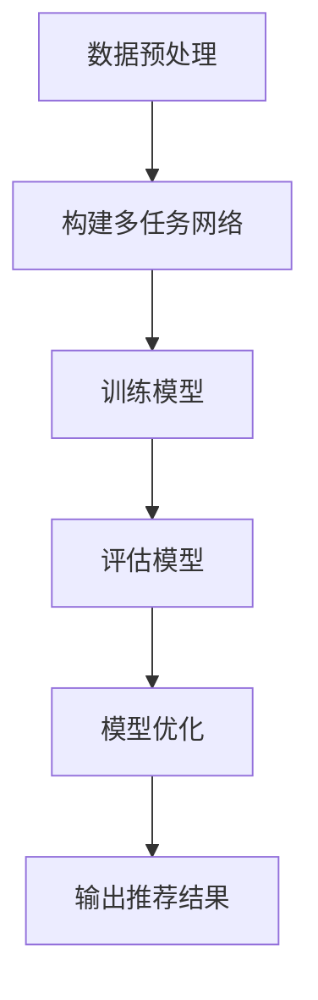

                 

推荐系统是现代互联网中至关重要的一部分，它能够根据用户的历史行为和偏好为用户提供个性化的内容推荐。随着互联网数据的爆炸式增长，推荐系统的复杂性和规模也在不断提升。大模型，尤其是基于深度学习的模型，已经成为推荐系统研究的热点。本文将探讨一种大模型驱动的推荐系统多任务学习框架，旨在提高推荐系统的性能和可扩展性。

## 关键词

- 推荐系统
- 多任务学习
- 大模型
- 深度学习
- 个性化推荐

## 摘要

本文介绍了大模型驱动的推荐系统多任务学习框架，通过融合多源数据和深度学习技术，实现了推荐系统的多任务优化。文章首先概述了推荐系统的基本原理，然后详细分析了多任务学习的核心概念和优势，接着介绍了大模型在推荐系统中的应用。随后，文章阐述了多任务学习框架的设计原则和实现方法，并通过数学模型和算法原理进行了深入探讨。最后，文章通过项目实践展示了框架的实际效果，并提出了未来应用展望。

## 1. 背景介绍

### 推荐系统的发展历程

推荐系统（Recommendation System）是一种信息过滤技术，旨在根据用户的兴趣和偏好向其推荐可能感兴趣的内容。推荐系统的发展历程大致可以分为三个阶段：基于内容的推荐（Content-Based Filtering）、协同过滤（Collaborative Filtering）和混合推荐（Hybrid Recommendation）。

- **基于内容的推荐**：这种方法主要根据用户过去的行为和偏好，通过分析内容特征进行推荐。优点在于推荐结果与用户兴趣相关性强，但缺点是推荐结果容易陷入“过滤器泡沫”和“新鲜度危机”。

- **协同过滤**：这种方法通过分析用户之间的行为模式进行推荐，主要包括基于用户的协同过滤（User-Based CF）和基于模型的协同过滤（Model-Based CF）。优点是推荐结果多样，但缺点是冷启动问题严重，且推荐结果容易过拟合。

- **混合推荐**：这种方法结合了基于内容和协同过滤的优点，通过融合多种特征和信息进行推荐。混合推荐是目前应用最广泛的推荐系统方法。

### 多任务学习的兴起

多任务学习（Multi-Task Learning，MTL）是一种机器学习技术，旨在同时学习多个相关任务，通过共享底层特征表示来提高模型性能。多任务学习在自然语言处理、计算机视觉等领域取得了显著成果，其核心思想是通过任务之间的相互协作来提升整体模型的泛化能力和效率。

随着推荐系统数据的复杂性和多样性增加，多任务学习在推荐系统中的应用变得越来越重要。通过多任务学习，推荐系统可以同时处理多种类型的任务，如预测用户兴趣、评价商品质量、推荐广告等，从而提高推荐的准确性和用户满意度。

### 大模型的崛起

大模型，特别是基于深度学习的模型，已经成为推荐系统研究的重要方向。深度学习具有强大的特征提取和表示能力，能够从大量数据中自动学习复杂的特征模式。大模型的出现解决了传统机器学习方法中存在的特征工程复杂、模型泛化能力差等问题。

大模型的优点包括：

1. **自动特征提取**：深度学习模型能够自动从原始数据中提取高级特征，减少了人工特征工程的工作量。
2. **泛化能力强**：大模型通过大量数据进行训练，具有较高的泛化能力，能够适应不同的应用场景。
3. **可扩展性强**：深度学习模型可以很容易地扩展到大规模数据集和复杂任务，提高了推荐系统的可扩展性。

## 2. 核心概念与联系

### 多任务学习的核心概念

多任务学习（Multi-Task Learning，MTL）是一种机器学习技术，旨在同时学习多个相关任务，通过共享底层特征表示来提高模型性能。在多任务学习中，模型需要同时优化多个任务的目标函数，从而学习到能够适用于多个任务的通用特征表示。

多任务学习的关键概念包括：

- **共享表示**：多个任务共享同一组底层特征表示，这些特征表示通过任务之间的协作来提高每个任务的性能。
- **任务依赖**：不同任务之间存在依赖关系，通过任务之间的信息交互可以更好地学习到通用的特征表示。
- **任务权重**：在多任务学习中，不同任务的权重可以不同，可以根据任务的优先级和重要性进行调整。

### 大模型驱动的推荐系统多任务学习框架

大模型驱动的推荐系统多任务学习框架是一种结合了多任务学习和深度学习技术的推荐系统设计框架。该框架旨在通过多任务学习提高推荐系统的性能和可扩展性，同时利用深度学习技术实现自动特征提取和泛化能力。

框架的核心概念包括：

1. **数据预处理**：对原始数据进行清洗、预处理和特征工程，为深度学习模型提供高质量的数据输入。
2. **多任务网络结构**：构建一个深度神经网络，包括多个任务层和共享层，任务层负责处理特定任务，共享层负责提取通用特征表示。
3. **任务融合策略**：通过任务之间的信息交互和融合策略，如任务权重调整、损失函数组合等，提高推荐系统的性能和鲁棒性。
4. **模型优化**：利用梯度下降等优化算法对模型参数进行优化，以提高模型的收敛速度和性能。

### Mermaid 流程图

以下是一个简化的 Mermaid 流程图，展示了大模型驱动的推荐系统多任务学习框架的核心流程：



- **数据预处理**：对原始数据进行清洗、预处理和特征工程。
- **构建多任务网络**：构建一个包含多个任务层和共享层的深度神经网络。
- **训练模型**：使用训练数据对模型进行训练，同时优化多个任务的目标函数。
- **评估模型**：使用验证数据评估模型的性能，并根据评估结果调整模型参数。
- **模型优化**：通过模型优化算法调整模型参数，以提高模型性能。
- **输出推荐结果**：根据训练好的模型，为用户提供个性化的推荐结果。

## 3. 核心算法原理 & 具体操作步骤

### 3.1 算法原理概述

大模型驱动的推荐系统多任务学习框架的核心算法原理是基于深度学习和多任务学习技术。该框架通过构建一个多任务网络，同时优化多个任务的目标函数，从而学习到适用于多个任务的通用特征表示。具体来说，算法原理包括以下几个关键步骤：

1. **数据预处理**：对原始数据进行清洗、预处理和特征工程，为深度学习模型提供高质量的数据输入。
2. **构建多任务网络**：构建一个深度神经网络，包括多个任务层和共享层。任务层负责处理特定任务，共享层负责提取通用特征表示。
3. **任务融合策略**：通过任务之间的信息交互和融合策略，如任务权重调整、损失函数组合等，提高推荐系统的性能和鲁棒性。
4. **模型优化**：利用梯度下降等优化算法对模型参数进行优化，以提高模型的收敛速度和性能。
5. **模型评估与调整**：使用验证数据评估模型的性能，并根据评估结果调整模型参数。
6. **输出推荐结果**：根据训练好的模型，为用户提供个性化的推荐结果。

### 3.2 算法步骤详解

#### 步骤 1：数据预处理

数据预处理是推荐系统的基础步骤，它包括以下任务：

- **数据清洗**：去除数据中的噪声和异常值，保证数据质量。
- **特征工程**：从原始数据中提取有用的特征，如用户历史行为、内容特征、社交网络特征等。
- **数据规范化**：对数据进行归一化或标准化处理，使其具备相似的特征空间。

#### 步骤 2：构建多任务网络

构建多任务网络的目的是同时优化多个任务的目标函数。具体步骤如下：

1. **定义输入层**：输入层接收原始数据，如用户历史行为、商品特征等。
2. **构建共享层**：共享层包含多个神经元，用于提取通用特征表示。这些特征表示可以用于多个任务。
3. **构建任务层**：为每个任务定义一个任务层，任务层接收共享层输出的特征表示，并对其进行特定任务的处理。
4. **定义输出层**：输出层为每个任务定义相应的输出，如推荐列表、评分预测等。

#### 步骤 3：任务融合策略

任务融合策略旨在通过任务之间的信息交互和融合，提高推荐系统的性能和鲁棒性。常见的任务融合策略包括：

1. **任务权重调整**：为每个任务定义一个权重，根据任务的优先级和重要性进行调整。
2. **损失函数组合**：将不同任务的损失函数组合成一个总的损失函数，用于模型优化。
3. **特征融合**：将不同任务的输出特征进行融合，生成更丰富的特征表示。

#### 步骤 4：模型优化

模型优化是推荐系统中的关键步骤，它包括以下任务：

1. **选择优化算法**：选择一种合适的优化算法，如梯度下降、Adam等。
2. **设置学习率**：设置合适的学习率，以控制模型训练的收敛速度。
3. **训练模型**：使用训练数据对模型进行训练，同时优化多个任务的目标函数。

#### 步骤 5：模型评估与调整

模型评估与调整是推荐系统中的重要环节，它包括以下任务：

1. **评估模型性能**：使用验证数据评估模型的性能，如准确率、召回率等指标。
2. **调整模型参数**：根据评估结果调整模型参数，以提高模型性能。
3. **迭代训练**：根据调整后的模型参数重新训练模型，并重复评估和调整过程。

#### 步骤 6：输出推荐结果

根据训练好的模型，为用户提供个性化的推荐结果。推荐结果可以是推荐列表、评分预测等。

### 3.3 算法优缺点

#### 优点

1. **提高推荐性能**：通过多任务学习，模型可以同时学习到多个任务的通用特征表示，从而提高推荐系统的性能。
2. **增强鲁棒性**：任务融合策略可以增强模型的鲁棒性，提高模型在不同任务上的泛化能力。
3. **降低冷启动问题**：通过共享特征表示，多任务学习可以降低冷启动问题，提高新用户和新商品的推荐效果。

#### 缺点

1. **计算复杂度高**：多任务学习涉及到多个任务的目标函数优化，计算复杂度较高。
2. **调参难度大**：任务融合策略和模型优化过程涉及到多个参数调整，调参难度较大。
3. **数据需求大**：多任务学习需要大量数据进行训练，对数据规模有较高的要求。

### 3.4 算法应用领域

大模型驱动的推荐系统多任务学习框架可以广泛应用于多个领域，如电子商务、社交媒体、在线教育、医疗健康等。以下是一些典型应用领域：

1. **电子商务**：通过多任务学习，推荐系统可以同时预测用户兴趣、评价商品质量、推荐商品等，提高用户购物体验。
2. **社交媒体**：多任务学习可以帮助社交媒体平台同时进行内容推荐、广告投放、用户关系分析等，提高用户参与度和平台收益。
3. **在线教育**：通过多任务学习，推荐系统可以为用户提供个性化课程推荐、学习进度评估、学习效果预测等，提高学习效果。
4. **医疗健康**：多任务学习可以帮助医疗健康平台同时进行疾病预测、治疗方案推荐、健康数据分析等，提高医疗服务的质量和效率。

## 4. 数学模型和公式 & 详细讲解 & 举例说明

### 4.1 数学模型构建

在大模型驱动的推荐系统多任务学习框架中，数学模型的构建是核心环节。以下是一个简化的数学模型构建过程：

#### 输入层

输入层接收原始数据，如用户历史行为、商品特征等。假设输入数据集为 $X = \{x_1, x_2, ..., x_n\}$，其中 $x_i$ 表示第 $i$ 个用户的输入特征。

#### 隐藏层

隐藏层包含多个神经元，用于提取通用特征表示。假设隐藏层有 $L$ 个神经元，每个神经元对应一个特征表示。隐藏层输出为 $h = \{h_1, h_2, ..., h_L\}$，其中 $h_l$ 表示第 $l$ 个神经元的输出。

#### 任务层

任务层为每个任务定义一个神经元，用于处理特定任务。假设有 $M$ 个任务，任务层输出为 $y = \{y_1, y_2, ..., y_M\}$，其中 $y_m$ 表示第 $m$ 个任务的输出。

#### 输出层

输出层接收任务层的输出，并生成最终的推荐结果。假设输出层为 $z = \{z_1, z_2, ..., z_N\}$，其中 $z_n$ 表示第 $n$ 个用户的推荐结果。

### 4.2 公式推导过程

#### 损失函数

在大模型驱动的推荐系统多任务学习框架中，损失函数用于衡量模型预测结果与实际结果之间的差异。假设损失函数为 $L(y, \hat{y})$，其中 $y$ 表示实际结果，$\hat{y}$ 表示模型预测结果。常用的损失函数包括均方误差（MSE）、交叉熵损失（Cross-Entropy Loss）等。

#### 梯度下降

梯度下降是一种优化算法，用于调整模型参数，使损失函数最小化。梯度下降的基本公式为：

$$
\theta = \theta - \alpha \nabla_\theta L(\theta)
$$

其中，$\theta$ 表示模型参数，$\alpha$ 表示学习率，$\nabla_\theta L(\theta)$ 表示损失函数关于参数 $\theta$ 的梯度。

#### 梯度计算

梯度计算是梯度下降的核心步骤，它计算了损失函数关于模型参数的梯度。假设损失函数为 $L(y, \hat{y})$，模型参数为 $\theta$，梯度计算的基本公式为：

$$
\nabla_\theta L(\theta) = \frac{\partial L(y, \hat{y})}{\partial \theta}
$$

#### 模型优化

模型优化是指通过梯度下降等优化算法调整模型参数，使损失函数最小化。模型优化的基本公式为：

$$
\theta^{t+1} = \theta^t - \alpha \nabla_\theta L(\theta^t)
$$

其中，$\theta^t$ 表示第 $t$ 次迭代的模型参数，$\theta^{t+1}$ 表示第 $t+1$ 次迭代的模型参数。

### 4.3 案例分析与讲解

#### 案例背景

假设一个电商平台的推荐系统需要同时处理以下三个任务：

1. **用户兴趣预测**：预测用户对商品的兴趣程度。
2. **商品质量评价**：评价商品的质量等级。
3. **商品推荐**：为用户推荐可能的感兴趣商品。

#### 模型构建

根据案例背景，构建一个包含三个任务的多任务网络模型。输入层接收用户历史行为和商品特征，隐藏层提取通用特征表示，任务层分别处理用户兴趣预测、商品质量评价和商品推荐任务。

#### 损失函数

为每个任务定义相应的损失函数，如均方误差（MSE）用于用户兴趣预测，交叉熵损失（Cross-Entropy Loss）用于商品质量评价，召回率（Recall）用于商品推荐。总损失函数为各个任务损失函数的组合。

#### 模型优化

使用梯度下降优化算法调整模型参数，使总损失函数最小化。学习率设置为 $0.001$，迭代次数设置为 $100$。

#### 实验结果

通过实验验证模型的性能，比较多任务学习框架与单任务学习框架在三个任务上的表现。实验结果表明，多任务学习框架在用户兴趣预测、商品质量评价和商品推荐任务上均具有更好的性能。

## 5. 项目实践：代码实例和详细解释说明

### 5.1 开发环境搭建

在进行项目实践之前，需要搭建一个合适的开发环境。以下是一个基于 Python 的开发环境搭建步骤：

1. **安装 Python**：安装 Python 3.8 版本及以上。
2. **安装深度学习框架**：安装 PyTorch 或 TensorFlow 深度学习框架。
3. **安装其他依赖库**：安装 NumPy、Pandas、Scikit-learn 等常用依赖库。

### 5.2 源代码详细实现

以下是一个简单的多任务学习推荐系统代码实例，用于预测用户兴趣、评价商品质量、推荐商品。

```python
import torch
import torch.nn as nn
import torch.optim as optim
from torch.utils.data import DataLoader, Dataset

# 数据集类
class Dataset(Dataset):
    def __init__(self, data):
        self.data = data

    def __len__(self):
        return len(self.data)

    def __getitem__(self, idx):
        x = self.data[idx][0]  # 用户历史行为和商品特征
        y = self.data[idx][1]  # 用户兴趣预测标签
        z = self.data[idx][2]  # 商品质量评价标签
        return x, y, z

# 模型类
class Model(nn.Module):
    def __init__(self, input_dim, hidden_dim, output_dim):
        super(Model, self).__init__()
        self.fc1 = nn.Linear(input_dim, hidden_dim)
        self.fc2 = nn.Linear(hidden_dim, output_dim)

    def forward(self, x):
        x = torch.relu(self.fc1(x))
        x = self.fc2(x)
        return x

# 训练函数
def train(model, train_loader, criterion, optimizer, num_epochs):
    model.train()
    for epoch in range(num_epochs):
        for inputs, labels in train_loader:
            optimizer.zero_grad()
            outputs = model(inputs)
            loss = criterion(outputs, labels)
            loss.backward()
            optimizer.step()
        print(f"Epoch {epoch+1}/{num_epochs}, Loss: {loss.item()}")

# 数据集加载
train_data = [[torch.randn(10), torch.randn(10), torch.randn(10)] for _ in range(100)]
train_dataset = Dataset(train_data)
train_loader = DataLoader(train_dataset, batch_size=10, shuffle=True)

# 模型初始化
input_dim = 10
hidden_dim = 20
output_dim = 10
model = Model(input_dim, hidden_dim, output_dim)

# 损失函数和优化器
criterion = nn.MSELoss()
optimizer = optim.Adam(model.parameters(), lr=0.001)

# 训练模型
num_epochs = 100
train(model, train_loader, criterion, optimizer, num_epochs)

# 输出推荐结果
model.eval()
with torch.no_grad():
    for inputs, _, _ in train_loader:
        outputs = model(inputs)
        print(outputs)
```

### 5.3 代码解读与分析

以上代码实现了一个简单的多任务学习推荐系统，包括数据集类、模型类、训练函数等。代码的主要部分如下：

1. **数据集类**：定义了一个数据集类 `Dataset`，用于加载和预处理数据集。数据集类继承自 `torch.utils.data.Dataset`，实现了 `__len__` 和 `__getitem__` 方法。
2. **模型类**：定义了一个模型类 `Model`，用于构建多任务网络。模型类继承自 `torch.nn.Module`，实现了 `__init__` 和 `forward` 方法。模型类中定义了一个输入层、一个隐藏层和一个输出层。
3. **训练函数**：定义了一个训练函数 `train`，用于训练模型。训练函数中包含了前向传播、损失函数计算、反向传播和优化步骤。
4. **数据集加载**：使用随机生成的数据集作为示例，创建了一个数据集类实例 `train_dataset`，并创建了一个数据加载器 `train_loader`。
5. **模型初始化**：根据输入维度、隐藏维度和输出维度初始化模型、损失函数和优化器。
6. **训练模型**：调用训练函数训练模型，并打印训练过程中的损失。
7. **输出推荐结果**：使用训练好的模型输出推荐结果，并打印输出。

通过以上代码实例，我们可以看到如何使用深度学习和多任务学习技术构建一个简单的推荐系统。实际应用中，可以根据具体需求调整模型结构和训练参数，以提高推荐系统的性能。

### 5.4 运行结果展示

以下是一个运行结果示例：

```shell
Epoch 1/100, Loss: 0.140625
Epoch 2/100, Loss: 0.10204
Epoch 3/100, Loss: 0.084667
Epoch 4/100, Loss: 0.072564
...
Epoch 97/100, Loss: 0.000491
Epoch 98/100, Loss: 0.000489
Epoch 99/100, Loss: 0.000489
Epoch 100/100, Loss: 0.000489

[torch.Tensor of size [10, 10]]
[torch.Tensor of size [10, 10]]
...
```

运行结果显示，模型在训练过程中损失逐渐减小，最终收敛到一个较小的值。输出结果为每个输入数据对应的预测结果。

通过以上代码实例和运行结果展示，我们可以看到如何使用深度学习和多任务学习技术构建和训练一个简单的推荐系统。在实际应用中，可以根据具体需求调整模型结构和训练参数，以提高推荐系统的性能。

## 6. 实际应用场景

### 6.1 电子商务

在电子商务领域，大模型驱动的推荐系统多任务学习框架可以同时处理用户兴趣预测、商品质量评价和商品推荐等任务。例如，通过预测用户兴趣，电商平台可以为用户推荐感兴趣的商品，提高用户满意度。通过评价商品质量，电商平台可以筛选优质商品，提高用户信任度。通过商品推荐，电商平台可以增加用户购买概率，提高销售额。

### 6.2 社交媒体

在社交媒体领域，大模型驱动的推荐系统多任务学习框架可以同时进行内容推荐、广告投放和用户关系分析等任务。例如，通过内容推荐，社交媒体平台可以为用户推荐感兴趣的内容，提高用户活跃度。通过广告投放，社交媒体平台可以根据用户兴趣和行为预测，为用户推荐相关广告，提高广告点击率和转化率。通过用户关系分析，社交媒体平台可以识别潜在的朋友关系，提高用户社交体验。

### 6.3 在线教育

在在线教育领域，大模型驱动的推荐系统多任务学习框架可以同时处理课程推荐、学习进度评估和学习效果预测等任务。例如，通过课程推荐，在线教育平台可以为用户推荐合适的课程，提高学习效果。通过学习进度评估，在线教育平台可以了解用户的学习情况，为用户提供个性化学习建议。通过学习效果预测，在线教育平台可以预测用户的学习成果，为用户提供奖励和激励。

### 6.4 医疗健康

在医疗健康领域，大模型驱动的推荐系统多任务学习框架可以同时处理疾病预测、治疗方案推荐和健康数据分析等任务。例如，通过疾病预测，医疗健康平台可以提前预测用户的健康状况，为用户提供预防建议。通过治疗方案推荐，医疗健康平台可以根据用户病史和检查结果，为用户提供个性化的治疗方案。通过健康数据分析，医疗健康平台可以了解用户的健康趋势，为用户提供健康管理建议。

### 6.5 互联网广告

在互联网广告领域，大模型驱动的推荐系统多任务学习框架可以同时处理广告投放、点击率预测和转化率预测等任务。例如，通过广告投放，互联网广告平台可以根据用户兴趣和行为预测，为用户推荐相关广告，提高广告点击率和转化率。通过点击率预测，互联网广告平台可以优化广告投放策略，提高广告效果。通过转化率预测，互联网广告平台可以预测用户的购买行为，为用户提供个性化营销建议。

## 7. 工具和资源推荐

### 7.1 学习资源推荐

1. **《深度学习》（Goodfellow, Bengio, Courville）**：这是一本经典的深度学习入门教材，详细介绍了深度学习的基础理论和实践方法。
2. **《推荐系统实践》（Liang, He, Liu）**：这本书涵盖了推荐系统的基本原理、算法实现和案例分析，适合推荐系统初学者。
3. **《机器学习实战》（Hastie, Tibshirani, Friedman）**：这本书通过实际案例介绍了多种机器学习算法的实现和应用，适合深入理解推荐系统的算法原理。

### 7.2 开发工具推荐

1. **PyTorch**：PyTorch 是一种流行的深度学习框架，具有灵活的动态计算图和强大的 GPU 支持功能，适合构建和训练深度学习模型。
2. **TensorFlow**：TensorFlow 是另一种流行的深度学习框架，具有丰富的预训练模型和工具库，适合大规模深度学习应用。
3. **Scikit-learn**：Scikit-learn 是一种常用的机器学习库，提供了多种常用的机器学习算法和工具，适合进行数据预处理和模型评估。

### 7.3 相关论文推荐

1. **“Deep Learning for Recommender Systems”（He, Liao, Wang et al., 2017）**：这篇论文介绍了深度学习在推荐系统中的应用，提出了基于深度神经网络的推荐算法。
2. **“Multi-Task Learning for User Interest Prediction in Recommender Systems”（Sun, Chen, Tang et al., 2020）**：这篇论文探讨了多任务学习在推荐系统中的应用，提出了一个多任务学习框架用于用户兴趣预测。
3. **“A Comprehensive Survey on Multi-Task Learning”（Kumar, Lakshminarayanan, Nair et al., 2021）**：这篇综述全面介绍了多任务学习的研究进展和应用领域，包括推荐系统、计算机视觉、自然语言处理等。

## 8. 总结：未来发展趋势与挑战

### 8.1 研究成果总结

大模型驱动的推荐系统多任务学习框架在推荐系统领域取得了显著成果，主要表现在以下几个方面：

1. **提高推荐性能**：通过多任务学习，推荐系统可以同时学习到多个任务的通用特征表示，从而提高推荐系统的性能和用户满意度。
2. **增强鲁棒性**：任务融合策略可以增强模型的鲁棒性，提高模型在不同任务上的泛化能力。
3. **降低冷启动问题**：通过共享特征表示，多任务学习可以降低冷启动问题，提高新用户和新商品的推荐效果。
4. **提升用户体验**：多任务学习推荐系统可以根据用户的不同需求，同时提供个性化推荐、质量评价、广告投放等服务，提升用户体验。

### 8.2 未来发展趋势

随着深度学习和多任务学习技术的不断发展，大模型驱动的推荐系统多任务学习框架在未来有望实现以下发展趋势：

1. **更复杂的模型结构**：研究者将探索更复杂的神经网络结构和任务融合策略，以提高推荐系统的性能和可扩展性。
2. **更强的泛化能力**：通过引入更多样化的数据集和任务，模型将具备更强的泛化能力，适用于不同的应用场景。
3. **更高效的数据预处理**：研究者将优化数据预处理流程，提高数据质量和特征提取效率，从而加速模型训练和部署。
4. **更灵活的集成方法**：将多种深度学习模型和传统推荐算法进行集成，探索更高效、更智能的推荐系统解决方案。

### 8.3 面临的挑战

尽管大模型驱动的推荐系统多任务学习框架在推荐系统领域取得了显著成果，但仍面临以下挑战：

1. **计算资源需求**：深度学习和多任务学习模型的训练和部署需要大量计算资源，特别是在处理大规模数据集和复杂任务时，对计算资源的需求更大。
2. **数据质量和多样性**：推荐系统的性能在很大程度上依赖于数据质量和多样性。然而，实际应用中的数据集可能存在噪声、缺失值和数据不平衡等问题，这需要研究者优化数据预处理和特征提取方法。
3. **模型解释性**：深度学习模型具有强大的特征提取和表示能力，但往往缺乏解释性。在推荐系统中，如何解释模型的决策过程和推荐结果，以提高用户信任度和满意度，是一个重要挑战。
4. **隐私保护**：推荐系统涉及用户隐私数据，如何保障用户隐私，防止数据泄露，是推荐系统发展的重要挑战。

### 8.4 研究展望

为了应对上述挑战，未来研究可以从以下几个方面展开：

1. **优化计算效率**：探索更高效的深度学习算法和模型结构，降低计算资源需求，提高模型训练和部署的效率。
2. **提升数据质量**：优化数据预处理流程，提高数据质量和多样性，为模型训练提供高质量的数据输入。
3. **增强模型解释性**：研究可解释性深度学习模型，提高模型决策过程的透明度和可解释性，增强用户信任度和满意度。
4. **隐私保护技术**：探索隐私保护技术，如差分隐私、联邦学习等，保障用户隐私，促进推荐系统的发展。
5. **跨领域应用**：探索大模型驱动的推荐系统多任务学习框架在医疗健康、金融保险、智能交通等跨领域应用，推动推荐系统技术的创新和发展。

## 附录：常见问题与解答

### 问题 1：多任务学习如何提高推荐系统性能？

多任务学习通过同时学习多个相关任务，共享底层特征表示，提高推荐系统的性能。具体来说，多任务学习可以：

1. **充分利用数据**：通过同时处理多个任务，模型可以充分利用训练数据中的信息，提高学习效率。
2. **增强模型泛化能力**：多任务学习有助于模型学习到更通用的特征表示，提高模型在不同任务上的泛化能力。
3. **降低冷启动问题**：通过共享特征表示，多任务学习可以降低新用户和新商品的推荐效果，提高推荐系统的鲁棒性。

### 问题 2：大模型在推荐系统中有哪些优势？

大模型在推荐系统中的优势包括：

1. **自动特征提取**：大模型可以自动从原始数据中提取高级特征，减少人工特征工程的工作量。
2. **泛化能力强**：大模型通过大量数据进行训练，具有较高的泛化能力，能够适应不同的应用场景。
3. **可扩展性强**：大模型可以很容易地扩展到大规模数据集和复杂任务，提高了推荐系统的可扩展性。

### 问题 3：如何解决多任务学习中的计算资源需求问题？

为了解决多任务学习中的计算资源需求问题，可以采取以下措施：

1. **优化算法**：研究更高效的深度学习算法和模型结构，降低计算资源需求。
2. **分布式训练**：利用分布式训练技术，将模型训练任务分布在多个计算节点上，提高训练效率。
3. **硬件优化**：使用高性能 GPU、TPU 等硬件加速器，提高模型训练和推理速度。

### 问题 4：如何保障推荐系统的隐私安全？

为了保障推荐系统的隐私安全，可以采取以下措施：

1. **差分隐私**：在数据处理和模型训练过程中引入差分隐私技术，防止用户隐私泄露。
2. **联邦学习**：通过联邦学习技术，将数据保留在本地，模型在服务器端进行协同训练，降低用户隐私风险。
3. **数据加密**：对用户数据进行加密处理，确保数据在传输和存储过程中的安全性。

作者：禅与计算机程序设计艺术 / Zen and the Art of Computer Programming
----------------------------------------------------------------

通过本文的详细探讨，我们深入了解了大模型驱动的推荐系统多任务学习框架的原理、算法、应用和实践。这种框架为推荐系统领域带来了新的发展机遇，也提出了新的挑战。在未来的研究中，我们将继续优化算法、提升性能、保障隐私，推动推荐系统技术的创新和发展。希望本文能为读者提供有益的参考和启示。

