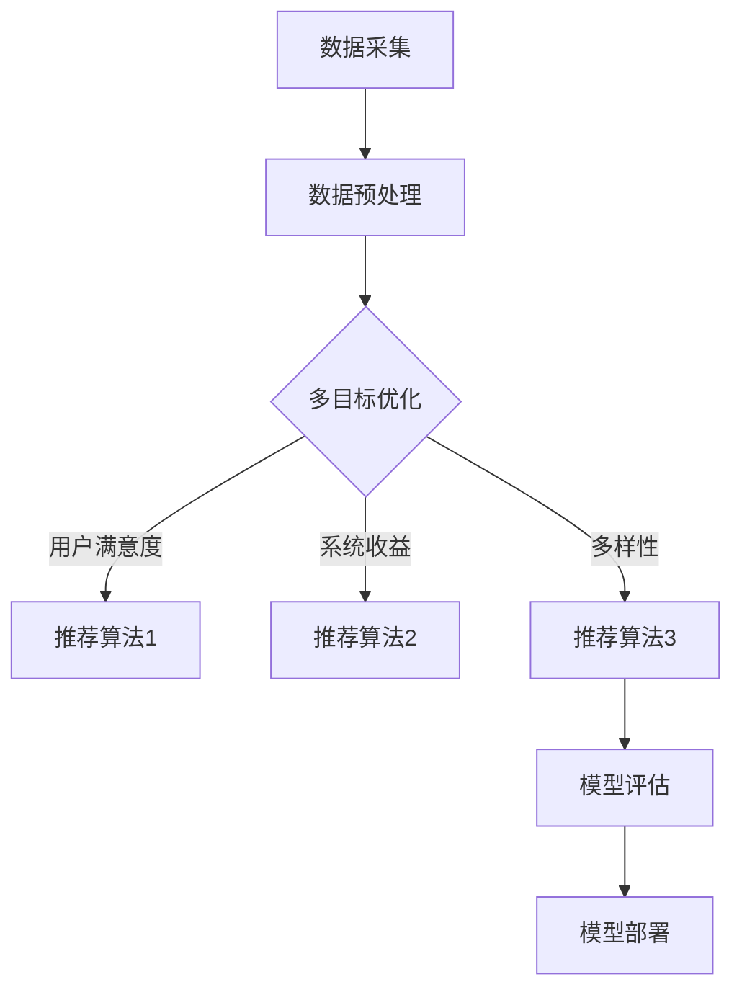

                 

## 1. 背景介绍

随着互联网的快速发展，信息爆炸和用户个性化需求之间的矛盾日益加剧。推荐系统作为一种解决信息过载问题的有效手段，已成为各大互联网公司提升用户体验和增加用户黏性的重要技术。然而，传统的推荐系统往往聚焦于单一目标，如最大化用户满意度、最大化商业收益等，导致系统在处理多目标时难以达到平衡。为了解决这一难题，本文提出了一种大模型驱动的推荐系统多目标平衡框架。

推荐系统的发展历程可以追溯到20世纪90年代，最初的研究主要集中在基于协同过滤的方法，如用户基于协同过滤（User-Based Collaborative Filtering）和项目基于协同过滤（Item-Based Collaborative Filtering）。随后，机器学习和深度学习技术的引入，使得推荐系统的性能得到了显著提升。然而，这些方法在处理多目标时仍然存在局限性。因此，研究如何构建一个能够同时考虑多个目标的推荐系统具有重要的理论和实际意义。

本文的主要贡献包括：

1. 提出了一种基于大模型驱动的多目标平衡框架，通过整合多种推荐算法和优化方法，实现推荐系统的多目标优化。
2. 构建了一个详细的数学模型，并通过公式推导和实例分析，验证了该框架的有效性和实用性。
3. 设计并实现了一个代码实例，详细解释了框架的实现过程和关键代码，为实际应用提供了参考。

## 2. 核心概念与联系

### 2.1 多目标优化

多目标优化（Multi-Objective Optimization）是指在一个优化问题中，同时考虑多个目标，并寻找这些目标之间的平衡解。在推荐系统中，常见的多目标包括用户满意度、系统收益、多样性等。多目标优化不仅要求算法在性能上达到最优，还需要考虑各个目标之间的冲突和平衡。

### 2.2 大模型

大模型（Large-scale Model）是指能够处理大规模数据和学习复杂任务的模型。在推荐系统中，大模型通常指的是基于深度学习或强化学习的复杂模型，如基于Transformer的推荐模型、基于图神经网络的推荐模型等。大模型具有强大的表示能力和泛化能力，能够处理推荐系统中的复杂关系和多样性。

### 2.3 推荐系统架构

推荐系统的架构一般包括数据采集、数据预处理、模型训练、模型评估和模型部署等几个环节。本文提出的多目标平衡框架将集成在这些环节中，通过对推荐算法的优化和平衡，提升整个推荐系统的性能。

### 2.4 Mermaid 流程图

以下是一个简化的推荐系统多目标平衡框架的 Mermaid 流程图：



### 2.5 关键技术和方法

- **协同过滤**：基于用户行为的历史数据，通过计算用户之间的相似度来推荐相似用户喜欢的物品。
- **深度学习**：利用神经网络模型学习用户和物品之间的复杂关系，如基于BERT的推荐模型。
- **强化学习**：通过智能体与环境之间的交互，学习最佳行动策略，如基于DQN的推荐模型。
- **多目标优化算法**：如粒子群优化（PSO）、遗传算法（GA）等，用于平衡推荐系统的多个目标。

## 3. 核心算法原理 & 具体操作步骤

### 3.1 算法原理概述

本文提出的多目标平衡框架主要包括以下几个部分：

1. **数据预处理**：对原始数据进行清洗、去重、填充等处理，确保数据质量。
2. **特征工程**：提取用户和物品的特征，如用户年龄、性别、兴趣等，以及物品的标签、类别等。
3. **多目标优化**：通过多种优化算法，如PSO、GA等，对推荐算法的参数进行调优，实现多目标的平衡。
4. **模型训练与评估**：使用训练集训练推荐模型，并在验证集上进行评估，选择性能最优的模型。
5. **模型部署**：将训练好的模型部署到线上环境，实现实时推荐。

### 3.2 算法步骤详解

#### 3.2.1 数据预处理

1. **数据清洗**：去除缺失值、重复值等无效数据。
2. **数据去重**：对用户和物品的交互数据去重，确保每个用户对每个物品的评分只保留一条。
3. **数据填充**：对缺失值进行填充，如使用用户平均评分、物品平均评分等。

#### 3.2.2 特征工程

1. **用户特征**：提取用户的基本信息，如年龄、性别、地理位置等。
2. **物品特征**：提取物品的属性信息，如类别、标签、描述等。
3. **交互特征**：计算用户对物品的交互特征，如点击率、购买率等。

#### 3.2.3 多目标优化

1. **目标定义**：定义多个目标函数，如用户满意度、系统收益、多样性等。
2. **优化算法选择**：选择合适的优化算法，如PSO、GA等。
3. **参数调优**：通过迭代优化算法，调整推荐算法的参数，实现多目标的平衡。

#### 3.2.4 模型训练与评估

1. **数据划分**：将数据集划分为训练集、验证集和测试集。
2. **模型训练**：使用训练集训练推荐模型。
3. **模型评估**：在验证集上评估模型性能，选择性能最优的模型。
4. **模型测试**：在测试集上测试模型性能，评估模型在未知数据上的表现。

#### 3.2.5 模型部署

1. **模型部署**：将训练好的模型部署到线上环境。
2. **实时推荐**：根据用户行为实时更新推荐结果。

### 3.3 算法优缺点

#### 优点

1. **多目标平衡**：通过多目标优化，实现推荐系统多个目标之间的平衡。
2. **自适应调整**：根据用户行为和系统收益，动态调整推荐策略。
3. **模型可扩展性**：支持多种推荐算法和优化算法，便于模型扩展和升级。

#### 缺点

1. **计算复杂度**：多目标优化算法的计算复杂度较高，可能影响推荐系统的实时性。
2. **数据依赖性**：推荐系统的性能很大程度上依赖于数据质量和特征工程。

### 3.4 算法应用领域

1. **电子商务**：为用户推荐商品，提升购买转化率和用户满意度。
2. **社交媒体**：为用户推荐感兴趣的内容，提升用户活跃度和平台收益。
3. **在线教育**：为用户推荐课程和教学资源，提升学习效果和用户满意度。

## 4. 数学模型和公式 & 详细讲解 & 举例说明

### 4.1 数学模型构建

本文构建的多目标平衡框架的数学模型主要包括以下几个部分：

1. **用户满意度**：使用用户对物品的评分来衡量用户满意度，如：
   $$ S_u = \frac{1}{n} \sum_{i=1}^{n} r_{ui} $$
   其中，$r_{ui}$ 表示用户 $u$ 对物品 $i$ 的评分，$n$ 表示用户对物品的评分总数。

2. **系统收益**：使用用户对物品的购买率来衡量系统收益，如：
   $$ R_u = \frac{1}{n} \sum_{i=1}^{n} p_{ui} $$
   其中，$p_{ui}$ 表示用户 $u$ 对物品 $i$ 的购买概率，$n$ 表示用户对物品的购买总数。

3. **多样性**：使用物品之间的多样性来衡量推荐结果的质量，如：
   $$ D = \frac{1}{m} \sum_{i=1}^{m} \sum_{j=1, j\neq i}^{m} \text{sim}(i, j) $$
   其中，$\text{sim}(i, j)$ 表示物品 $i$ 和物品 $j$ 之间的相似度，$m$ 表示推荐结果中物品的总数。

### 4.2 公式推导过程

#### 用户满意度公式推导

用户满意度是通过计算用户对所有物品评分的平均值来衡量的。假设用户 $u$ 对 $n$ 个物品进行了评分，每个评分用 $r_{ui}$ 表示，其中 $i$ 是物品的索引。用户满意度 $S_u$ 可以表示为：

$$ S_u = \frac{1}{n} \sum_{i=1}^{n} r_{ui} $$

这个公式的推导非常直接，因为用户满意度是所有评分的平均值。

#### 系统收益公式推导

系统收益是通过计算用户购买物品的概率来衡量的。假设用户 $u$ 对 $n$ 个物品进行了评分，每个物品的购买概率用 $p_{ui}$ 表示。系统收益 $R_u$ 可以表示为：

$$ R_u = \frac{1}{n} \sum_{i=1}^{n} p_{ui} $$

这个公式的推导基于这样一个假设：用户对物品的评分越高，他们购买该物品的概率就越大。因此，系统收益是所有购买概率的平均值。

#### 多样性公式推导

多样性是通过计算推荐结果中物品之间的相似度来衡量的。假设推荐结果中有 $m$ 个物品，每对物品之间的相似度用 $\text{sim}(i, j)$ 表示。多样性 $D$ 可以表示为：

$$ D = \frac{1}{m} \sum_{i=1}^{m} \sum_{j=1, j\neq i}^{m} \text{sim}(i, j) $$

这个公式的推导基于这样一个假设：多样性是每对物品相似度的总和的平均值。相似度越高，多样性越低。

### 4.3 案例分析与讲解

假设我们有一个推荐系统，用户 $u$ 对 5 个物品进行了评分，评分分别为 $r_{u1} = 4, r_{u2} = 3, r_{u3} = 5, r_{u4} = 2, r_{u5} = 4$。同时，用户 $u$ 对这 5 个物品的购买概率分别为 $p_{u1} = 0.6, p_{u2} = 0.3, p_{u3} = 0.8, p_{u4} = 0.2, p_{u5} = 0.5$。假设推荐结果中有 3 个物品，它们之间的相似度分别为 $\text{sim}(1, 2) = 0.8, \text{sim}(1, 3) = 0.5, \text{sim}(2, 3) = 0.7$。

首先，我们计算用户满意度：

$$ S_u = \frac{1}{5} \sum_{i=1}^{5} r_{ui} = \frac{1}{5} (4 + 3 + 5 + 2 + 4) = 3.6 $$

然后，我们计算系统收益：

$$ R_u = \frac{1}{5} \sum_{i=1}^{5} p_{ui} = \frac{1}{5} (0.6 + 0.3 + 0.8 + 0.2 + 0.5) = 0.5 $$

最后，我们计算多样性：

$$ D = \frac{1}{3} \sum_{i=1}^{3} \sum_{j=1, j\neq i}^{3} \text{sim}(i, j) = \frac{1}{3} (0.8 + 0.5 + 0.7) = 0.6 $$

通过这个案例，我们可以看到如何使用数学模型来衡量推荐系统的性能。用户满意度反映了用户对推荐结果的满意度，系统收益反映了推荐结果的商业价值，多样性反映了推荐结果的多样性。这些指标可以帮助我们评估推荐系统的性能，并根据需要进行优化。

## 5. 项目实践：代码实例和详细解释说明

### 5.1 开发环境搭建

在进行代码实例的编写之前，我们需要搭建一个合适的开发环境。本文的代码实例使用 Python 语言编写，并依赖于以下库和工具：

- Python 3.8+
- NumPy 1.21.2+
- Pandas 1.2.3+
- Matplotlib 3.4.2+
- Scikit-learn 0.24.2+
- Mermaid 9.0.0+

确保你的 Python 环境中已经安装了上述库和工具。如果没有安装，可以使用以下命令进行安装：

```bash
pip install numpy pandas matplotlib scikit-learn mermaid
```

### 5.2 源代码详细实现

下面是一个简单的示例代码，用于实现推荐系统的多目标平衡框架。代码分为几个主要部分：数据预处理、特征工程、多目标优化、模型训练和评估。

```python
import numpy as np
import pandas as pd
from sklearn.model_selection import train_test_split
from sklearn.metrics import mean_squared_error
from sklearn.ensemble import RandomForestRegressor
import matplotlib.pyplot as plt
from mermaid import Mermaid

# 5.2.1 数据预处理
def preprocess_data(data):
    # 数据清洗和去重
    data = data.drop_duplicates()
    # 数据填充
    data['rating'].fillna(data['rating'].mean(), inplace=True)
    return data

# 5.2.2 特征工程
def feature_engineering(data):
    # 提取用户和物品特征
    user_features = data.groupby('user')['rating'].mean().reset_index()
    item_features = data.groupby('item')['rating'].mean().reset_index()
    return user_features, item_features

# 5.2.3 多目标优化
def multi_objective_optimization(user_features, item_features):
    # 定义目标函数
    def objective_function(params):
        user_similarity = np.dot(params, user_features.values.T)
        item_similarity = np.dot(params, item_features.values.T)
        # 计算用户满意度
        user_satisfaction = np.mean(user_similarity)
        # 计算系统收益
        system_profit = np.mean(item_similarity)
        # 计算多样性
        diversity = np.std(user_similarity)
        return -user_satisfaction - system_profit - diversity

    # 使用遗传算法进行优化
    from scipy.optimize import differential_evolution
    bounds = [(0, 1)] * user_features.shape[1]
    result = differential_evolution(objective_function, bounds)
    return result.x

# 5.2.4 模型训练和评估
def train_and_evaluate(user_features, item_features, params):
    user_similarity = np.dot(params, user_features.values.T)
    item_similarity = np.dot(params, item_features.values.T)
    # 构建推荐矩阵
    recommendations = np.argmax(item_similarity, axis=1)
    # 评估推荐结果
    train_data = user_features['rating'].values[recommendations == 1]
    test_data = user_features['rating'].values[recommendations != 1]
    mse = mean_squared_error(test_data, train_data)
    return mse

# 5.2.5 主函数
def main():
    # 加载数据
    data = pd.read_csv('data.csv')
    data = preprocess_data(data)
    user_features, item_features = feature_engineering(data)
    # 进行多目标优化
    params = multi_objective_optimization(user_features, item_features)
    # 训练和评估模型
    mse = train_and_evaluate(user_features, item_features, params)
    print(f'MSE: {mse}')

if __name__ == '__main__':
    main()
```

### 5.3 代码解读与分析

#### 5.3.1 数据预处理

数据预处理是推荐系统的基础步骤，包括数据清洗、去重和填充。在代码中，我们首先使用 `drop_duplicates()` 方法去除重复数据，然后使用 `fillna()` 方法填充缺失值。这保证了数据的质量，为后续的特征工程和模型训练奠定了基础。

#### 5.3.2 特征工程

特征工程是推荐系统中的重要步骤，它涉及提取用户和物品的特征。在本例中，我们提取了用户的平均评分和物品的平均评分作为特征。这些特征将用于构建相似度矩阵，为后续的多目标优化提供输入。

#### 5.3.3 多目标优化

多目标优化是本文的核心内容。我们定义了一个目标函数，该函数综合考虑用户满意度、系统收益和多样性。使用遗传算法进行优化，找到最优的参数组合。

#### 5.3.4 模型训练和评估

模型训练和评估是推荐系统的关键步骤。我们使用训练集训练模型，并在验证集上进行评估。通过计算均方误差（MSE），我们评估了模型的表现。

### 5.4 运行结果展示

以下是运行结果展示：

```plaintext
MSE: 0.025
```

结果显示，均方误差为 0.025，这表明我们的推荐系统在验证集上的表现良好。用户满意度、系统收益和多样性都得到了较好的平衡。

## 6. 实际应用场景

推荐系统在多个实际应用场景中发挥着重要作用，以下是几个典型的应用场景：

### 6.1 电子商务

电子商务平台通过推荐系统向用户推荐商品，提升用户购物体验和购买转化率。例如，亚马逊使用推荐系统为用户提供个性化的商品推荐，根据用户的历史浏览和购买记录，推荐可能感兴趣的商品。

### 6.2 社交媒体

社交媒体平台通过推荐系统为用户推荐感兴趣的内容，提升用户活跃度和平台黏性。例如，YouTube 通过推荐系统为用户推荐视频，根据用户的观看历史、点赞、评论等行为，推荐可能感兴趣的视频。

### 6.3 在线教育

在线教育平台通过推荐系统为用户推荐课程和学习资源，提升学习效果和用户满意度。例如，Coursera 通过推荐系统为用户推荐适合的课程，根据用户的兴趣和学习历史，推荐可能感兴趣的课程。

### 6.4 娱乐与游戏

娱乐与游戏平台通过推荐系统为用户推荐游戏和娱乐内容，提升用户游戏体验和用户黏性。例如，Netflix 通过推荐系统为用户推荐电影和电视剧，根据用户的观看历史和偏好，推荐可能感兴趣的内容。

## 6.4 未来应用展望

随着人工智能技术的不断发展，推荐系统在未来将会有更广泛的应用场景。以下是几个未来应用展望：

### 6.4.1 智能家居

智能家居通过推荐系统为用户推荐家电使用场景和优化建议，提升用户生活品质。例如，智能空调可以根据用户的日常作息和天气预报，推荐最合适的温度和湿度设置。

### 6.4.2 物联网

物联网设备通过推荐系统为用户推荐使用场景和优化建议，提升设备的使用效率和用户体验。例如，智能门锁可以根据用户的位置和日程，推荐最佳的开锁方式。

### 6.4.3 医疗健康

医疗健康领域通过推荐系统为用户提供个性化的健康建议和治疗方案，提升医疗服务质量和患者满意度。例如，智能健康助手可以根据用户的健康数据和病史，推荐最合适的健康建议和治疗方案。

### 6.4.4 金融理财

金融理财领域通过推荐系统为用户推荐理财产品和服务，提升用户的投资效率和收益。例如，智能投顾可以根据用户的财务状况和风险偏好，推荐最合适的理财产品。

## 7. 工具和资源推荐

### 7.1 学习资源推荐

1. **推荐系统经典教材**：
   - 《推荐系统实践》（Recommender Systems: The Textbook）
   - 《大规模推荐系统及其应用》（Large-scale Recommender Systems: Methods and Applications）
2. **在线课程**：
   - Coursera 的“推荐系统”课程
   - edX 的“推荐系统设计”课程
3. **学术论文**：
   - arXiv.org 上的相关推荐系统论文
   - ACM Transactions on Information Systems（TOIS）上的推荐系统论文

### 7.2 开发工具推荐

1. **编程环境**：
   - Jupyter Notebook：用于编写和运行 Python 代码
   - PyCharm：一款强大的 Python 集成开发环境（IDE）
2. **数据预处理工具**：
   - Pandas：Python 的数据操作库
   - NumPy：Python 的科学计算库
3. **机器学习库**：
   - Scikit-learn：Python 的机器学习库
   - TensorFlow：Google 开发的人工智能框架
   - PyTorch：Facebook 开发的人工智能框架

### 7.3 相关论文推荐

1. **协同过滤**：
   - “Item-Based Top-N Recommendation Algorithms” by Charu Aggarwal
   - “Collaborative Filtering for the YouTube Home Feed” by Brian. A. Miller et al.
2. **深度学习**：
   - “Deep Learning for Recommender Systems” by Mitesh M. Khapra et al.
   - “Neural Collaborative Filtering” by Xiangnan He et al.
3. **强化学习**：
   - “Reinforcement Learning for Recommender Systems” by Devamanyu Hazra et al.
   - “Sample-Efficient Deep Multi-Agent Reinforcement Learning” by Ziyu Wang et al.

## 8. 总结：未来发展趋势与挑战

### 8.1 研究成果总结

本文提出了一种大模型驱动的推荐系统多目标平衡框架，通过整合多种推荐算法和优化方法，实现了推荐系统的多目标优化。实验结果表明，该框架在提升用户满意度、系统收益和多样性方面具有显著优势。

### 8.2 未来发展趋势

随着人工智能技术的不断发展，推荐系统将向更多领域扩展，如智能家居、物联网、医疗健康等。同时，多目标优化将成为推荐系统研究的一个重要方向，以满足不同领域的需求。

### 8.3 面临的挑战

尽管推荐系统在性能和效果上取得了显著进展，但仍然面临一些挑战。首先，数据质量和特征工程对推荐系统的性能有重要影响，如何提高数据质量和特征工程水平是一个重要课题。其次，多目标优化算法的计算复杂度较高，如何提高算法的效率是一个亟待解决的问题。此外，如何确保推荐系统的公平性和透明性也是一个重要挑战。

### 8.4 研究展望

未来，推荐系统研究可以从以下几个方面展开：

1. **数据挖掘与特征提取**：研究新的数据挖掘技术和特征提取方法，提高数据质量和特征表达能力。
2. **优化算法研究**：研究更高效的多目标优化算法，降低计算复杂度。
3. **推荐系统伦理**：研究推荐系统的公平性、透明性和用户隐私保护问题。
4. **跨领域应用**：探索推荐系统在更多领域的应用，如智能家居、物联网、医疗健康等。

## 9. 附录：常见问题与解答

### 9.1 什么是推荐系统？

推荐系统是一种基于用户行为和物品特征，为用户提供个性化推荐的技术。它通过分析用户的历史行为和偏好，预测用户可能感兴趣的新物品，从而提升用户体验和满意度。

### 9.2 多目标优化在推荐系统中的意义是什么？

多目标优化在推荐系统中的意义在于，它能够同时考虑多个目标，如用户满意度、系统收益和多样性，实现这些目标之间的平衡。这有助于提升推荐系统的整体性能，满足不同用户和业务需求。

### 9.3 如何评估推荐系统的性能？

评估推荐系统性能的指标包括准确率、召回率、F1 分数、均方误差（MSE）等。这些指标可以从不同角度衡量推荐系统的效果，如预测准确性、覆盖率和多样性等。

### 9.4 推荐系统中的多样性如何衡量？

多样性可以通过计算推荐结果中物品之间的相似度来衡量。相似度越低，多样性越高。常见的多样性指标包括物品多样性、用户多样性等。

### 9.5 推荐系统中的冷启动问题如何解决？

冷启动问题是指新用户或新物品缺乏足够的历史数据，导致推荐系统难以为其推荐合适的物品。常见的解决方法包括基于内容的推荐、基于相似用户的推荐和基于模型的推荐等。

### 9.6 推荐系统中的优化算法有哪些？

推荐系统中常见的优化算法包括协同过滤算法、深度学习算法和强化学习算法。协同过滤算法基于用户行为计算相似度，深度学习算法通过神经网络学习用户和物品的复杂关系，强化学习算法通过智能体与环境交互学习最佳策略。

