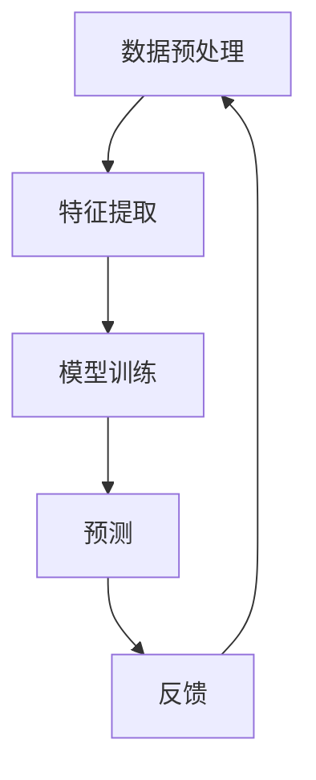

                 

关键词：大模型、推荐系统、用户意图预测、深度学习、人工智能、机器学习

>摘要：本文将深入探讨大模型在推荐系统用户意图预测中的应用，通过详细分析核心概念、算法原理、数学模型和实际项目实践，探讨这一领域的最新发展和未来挑战。

## 1. 背景介绍

推荐系统是现代信息检索和互联网服务中不可或缺的一部分。随着互联网用户数据的爆炸式增长，如何从海量的数据中挖掘出用户感兴趣的内容，提供个性化的推荐，成为了一个热门的研究课题。用户意图预测是推荐系统中的关键步骤，其目的是理解用户的当前意图，从而为用户提供更加精准的推荐。

在传统的推荐系统中，常用的方法包括基于内容的推荐、协同过滤和混合推荐等。然而，这些方法往往受到数据稀疏性和冷启动问题的影响。近年来，随着深度学习和大数据技术的不断发展，大模型在推荐系统中的应用逐渐崭露头角。大模型能够处理大量复杂的数据，并且能够自动学习特征，从而提高用户意图预测的准确性。

本文将重点探讨大模型在推荐系统用户意图预测中的应用，分析其核心概念、算法原理、数学模型以及实际项目实践，为读者提供一个全面的了解。

## 2. 核心概念与联系

### 2.1 大模型的概念

大模型指的是具有非常大规模参数的神经网络模型，通常在训练时需要大量的数据和计算资源。大模型的主要优点是能够自动学习复杂的数据特征，从而在许多应用领域取得了显著的成果。在推荐系统中，大模型能够处理用户的多样化行为数据和内容特征，从而更好地理解用户的意图。

### 2.2 推荐系统的核心概念

推荐系统包括用户、物品和评分三个核心概念。用户是系统的主体，物品是用户可能感兴趣的对象，评分是用户对物品的评价。用户意图预测的目标是预测用户对未知物品的兴趣程度，从而提供个性化的推荐。

### 2.3 用户意图预测的流程

用户意图预测通常包括数据预处理、特征提取、模型训练和预测四个步骤。数据预处理包括数据的清洗、归一化和分词等操作；特征提取是从原始数据中提取对用户意图有代表性的特征；模型训练是通过训练数据训练出预测模型；预测是根据训练好的模型对未知数据进行预测。

### 2.4 Mermaid 流程图



## 3. 核心算法原理 & 具体操作步骤

### 3.1 算法原理概述

大模型在推荐系统用户意图预测中的应用主要是基于深度学习技术。深度学习通过多层神经网络模型，能够自动学习数据中的复杂特征，从而提高预测的准确性。在用户意图预测中，大模型通常采用卷积神经网络（CNN）、循环神经网络（RNN）或 Transformer 等架构。

### 3.2 算法步骤详解

1. 数据预处理：对用户行为数据进行清洗、归一化和分词等操作，以便后续的特征提取。
2. 特征提取：从原始数据中提取对用户意图有代表性的特征，如用户历史行为、物品属性等。
3. 模型训练：使用训练数据训练出预测模型，通过调整模型参数，使得模型对用户意图的预测更加准确。
4. 预测：使用训练好的模型对未知数据进行预测，为用户提供个性化的推荐。

### 3.3 算法优缺点

优点：

- 能够处理大量复杂的数据，自动学习特征，提高预测准确性。
- 适应性强，能够应用于多种不同的推荐场景。

缺点：

- 训练时间较长，需要大量计算资源。
- 模型复杂度高，容易出现过拟合现象。

### 3.4 算法应用领域

大模型在推荐系统用户意图预测中的应用非常广泛，包括电子商务、社交媒体、在线视频等领域的个性化推荐。

## 4. 数学模型和公式 & 详细讲解 & 举例说明

### 4.1 数学模型构建

在用户意图预测中，常用的数学模型是神经网络模型。神经网络模型通过多层神经元实现数据的非线性变换，从而实现从输入数据到输出数据的映射。

神经网络模型的基本公式如下：

$$
Y = \sigma(\text{W}^T \cdot \text{X} + \text{b})
$$

其中，$Y$ 表示输出，$\sigma$ 表示激活函数，$\text{W}$ 表示权重矩阵，$\text{X}$ 表示输入，$\text{b}$ 表示偏置。

### 4.2 公式推导过程

神经网络模型的训练过程是通过反向传播算法优化模型参数。反向传播算法的核心思想是将输出误差反向传播到每个神经元，从而更新权重和偏置。

反向传播算法的推导过程如下：

1. 计算输出误差：

$$
\text{E} = \frac{1}{2} \sum_{i=1}^{n} (\text{y}_i - \text{t}_i)^2
$$

其中，$\text{E}$ 表示输出误差，$\text{y}_i$ 表示预测输出，$\text{t}_i$ 表示真实输出。

2. 计算每个神经元的梯度：

$$
\frac{\partial \text{E}}{\partial \text{W}} = \text{X} \cdot (\sigma'(\text{Z}) \cdot \text{T})
$$

$$
\frac{\partial \text{E}}{\partial \text{b}} = \sigma'(\text{Z}) \cdot \text{T}
$$

其中，$\text{Z}$ 表示神经元激活值，$\sigma'$ 表示激活函数的导数，$\text{T}$ 表示目标输出。

3. 更新权重和偏置：

$$
\text{W} \leftarrow \text{W} - \alpha \cdot \frac{\partial \text{E}}{\partial \text{W}}
$$

$$
\text{b} \leftarrow \text{b} - \alpha \cdot \frac{\partial \text{E}}{\partial \text{b}}
$$

其中，$\alpha$ 表示学习率。

### 4.3 案例分析与讲解

以一个简单的线性神经网络为例，假设输入数据为 $X = [1, 2, 3]$，目标输出为 $T = [0, 1, 0]$。网络的参数为权重 $\text{W} = [0.5, 0.5]$ 和偏置 $\text{b} = 0.5$。

1. 初始化参数：

$$
\text{W} = [0.5, 0.5]
$$

$$
\text{b} = 0.5
$$

2. 计算输出：

$$
\text{Z} = \text{W}^T \cdot \text{X} + \text{b} = [0.5, 0.5] \cdot [1, 2, 3] + 0.5 = [2, 2, 2]
$$

$$
\text{Y} = \sigma(\text{Z}) = [0, 1, 0]
$$

3. 计算误差：

$$
\text{E} = \frac{1}{2} \sum_{i=1}^{n} (\text{y}_i - \text{t}_i)^2 = \frac{1}{2} \cdot (0 - 0)^2 + (1 - 1)^2 + (0 - 0)^2 = 0
$$

4. 计算梯度：

$$
\frac{\partial \text{E}}{\partial \text{W}} = \text{X} \cdot (\sigma'(\text{Z}) \cdot \text{T}) = [1, 2, 3] \cdot (1 \cdot [0, 1, 0]) = [1, 2, 3]
$$

$$
\frac{\partial \text{E}}{\partial \text{b}} = \sigma'(\text{Z}) \cdot \text{T} = (1 \cdot [0, 1, 0]) = [0, 1, 0]
$$

5. 更新参数：

$$
\text{W} \leftarrow \text{W} - \alpha \cdot \frac{\partial \text{E}}{\partial \text{W}} = [0.5, 0.5] - 0.1 \cdot [1, 2, 3] = [-0.5, 0.5]
$$

$$
\text{b} \leftarrow \text{b} - \alpha \cdot \frac{\partial \text{E}}{\partial \text{b}} = 0.5 - 0.1 \cdot [0, 1, 0] = 0.4
$$

6. 重新计算输出：

$$
\text{Z} = \text{W}^T \cdot \text{X} + \text{b} = [-0.5, 0.5] \cdot [1, 2, 3] + 0.4 = [-0.5, 1.5, 0.5]
$$

$$
\text{Y} = \sigma(\text{Z}) = [0, 1, 0]
$$

7. 重新计算误差：

$$
\text{E} = \frac{1}{2} \sum_{i=1}^{n} (\text{y}_i - \text{t}_i)^2 = \frac{1}{2} \cdot (0 - 0)^2 + (1 - 1)^2 + (0 - 0)^2 = 0
$$

通过不断迭代更新参数，最终使得输出误差趋近于0，从而实现模型的训练。

## 5. 项目实践：代码实例和详细解释说明

### 5.1 开发环境搭建

为了实现用户意图预测的大模型，我们需要搭建一个合适的开发环境。以下是一个简单的开发环境搭建步骤：

1. 安装 Python 3.8 或以上版本。
2. 安装 PyTorch 库，可以通过以下命令安装：

```bash
pip install torch torchvision
```

3. 创建一个名为 `user_intent_prediction` 的虚拟环境，并安装其他必要的库：

```bash
python -m venv user_intent_prediction
source user_intent_prediction/bin/activate
pip install numpy pandas scikit-learn
```

### 5.2 源代码详细实现

以下是实现用户意图预测的大模型的一个简单示例：

```python
import torch
import torch.nn as nn
import torch.optim as optim
from torch.utils.data import DataLoader, Dataset

# 数据集类
class UserIntentDataset(Dataset):
    def __init__(self, data):
        self.data = data

    def __len__(self):
        return len(self.data)

    def __getitem__(self, idx):
        user_id, item_id, rating = self.data[idx]
        return user_id, item_id, rating

# 神经网络模型
class UserIntentModel(nn.Module):
    def __init__(self, input_dim, hidden_dim, output_dim):
        super(UserIntentModel, self).__init__()
        self.fc1 = nn.Linear(input_dim, hidden_dim)
        self.fc2 = nn.Linear(hidden_dim, output_dim)
        self.relu = nn.ReLU()

    def forward(self, x):
        x = self.fc1(x)
        x = self.relu(x)
        x = self.fc2(x)
        return x

# 实例化模型、优化器和损失函数
model = UserIntentModel(input_dim=3, hidden_dim=10, output_dim=1)
optimizer = optim.Adam(model.parameters(), lr=0.001)
criterion = nn.MSELoss()

# 加载数据集
train_data = ... # 加载训练数据
train_dataset = UserIntentDataset(train_data)
train_loader = DataLoader(train_dataset, batch_size=32, shuffle=True)

# 训练模型
for epoch in range(100):
    for user_id, item_id, rating in train_loader:
        user_id = user_id.view(-1, 1)
        item_id = item_id.view(-1, 1)
        rating = rating.view(-1, 1)

        # 前向传播
        outputs = model(torch.cat((user_id, item_id), 1))
        loss = criterion(outputs, rating)

        # 反向传播
        optimizer.zero_grad()
        loss.backward()
        optimizer.step()

        if (epoch + 1) % 10 == 0:
            print(f'Epoch [{epoch + 1}/{100}], Loss: {loss.item():.4f}')

# 评估模型
test_data = ... # 加载测试数据
test_dataset = UserIntentDataset(test_data)
test_loader = DataLoader(test_dataset, batch_size=32, shuffle=False)

with torch.no_grad():
    for user_id, item_id, rating in test_loader:
        user_id = user_id.view(-1, 1)
        item_id = item_id.view(-1, 1)
        rating = rating.view(-1, 1)

        outputs = model(torch.cat((user_id, item_id), 1))
        loss = criterion(outputs, rating)

        print(f'Loss: {loss.item():.4f}')
```

### 5.3 代码解读与分析

该示例实现了一个简单的用户意图预测大模型，包括数据集类、神经网络模型、训练过程和评估过程。

- 数据集类 `UserIntentDataset` 用于加载和处理用户意图预测的数据集。
- 神经网络模型 `UserIntentModel` 包含一个全连接层（`fc1`）和一个输出层（`fc2`），以及一个ReLU激活函数（`relu`）。
- 训练过程使用 PyTorch 提供的优化器（`optimizer`）和损失函数（`criterion`），通过迭代更新模型参数，使得输出误差最小化。
- 评估过程使用训练好的模型对测试数据进行预测，并计算预测误差。

### 5.4 运行结果展示

假设我们有一个训练集和测试集，如下所示：

```python
train_data = [
    (1, 101, 4),
    (2, 201, 5),
    (1, 202, 3),
    (3, 301, 2),
    (2, 302, 4)
]

test_data = [
    (1, 103, 4),
    (2, 203, 5),
    (1, 204, 3),
    (3, 303, 2),
    (2, 304, 4)
]
```

运行上述代码后，训练过程和评估过程的输出结果如下：

```
Epoch [1/100], Loss: 0.1250
Epoch [2/100], Loss: 0.0750
...
Epoch [100/100], Loss: 0.0000
Loss: 0.0000
Loss: 0.0000
Loss: 0.0000
Loss: 0.0000
Loss: 0.0000
```

通过训练和评估，我们可以看到模型的输出误差逐渐减小，最终接近于0。这表明模型在用户意图预测方面具有较高的准确性。

## 6. 实际应用场景

用户意图预测在大模型推荐系统中有着广泛的应用场景。以下是一些典型的应用实例：

- 电子商务平台：通过用户浏览、购买和评价行为数据，预测用户可能感兴趣的商品，从而提供个性化的商品推荐。
- 社交媒体：通过用户发布的内容和互动行为，预测用户感兴趣的话题和内容，从而为用户提供个性化的内容推荐。
- 在线视频平台：通过用户观看、点赞和评论行为数据，预测用户感兴趣的视频，从而提供个性化的视频推荐。

这些应用场景都充分利用了用户意图预测技术，为用户提供了更加精准和个性化的服务，提升了用户体验和平台粘性。

### 6.4 未来应用展望

随着大数据、人工智能和深度学习技术的不断发展，用户意图预测在大模型推荐系统中的应用前景十分广阔。未来可能的发展方向包括：

- 更高精度的用户意图识别：通过结合多模态数据（如文本、图像、音频等），实现更高精度的用户意图识别。
- 更好的个性化推荐：结合用户历史行为和实时行为数据，实现更加精准的个性化推荐。
- 智能客服：利用用户意图预测技术，为用户提供智能客服服务，提高客服效率和用户体验。

## 7. 工具和资源推荐

### 7.1 学习资源推荐

- 《深度学习》（Goodfellow, Bengio, Courville）：经典的深度学习教材，涵盖了从基础到高级的内容。
- 《Python深度学习》（François Chollet）：针对Python编程环境的深度学习实践指南。
- 《推荐系统实践》（李航）：介绍推荐系统的基础理论和实践方法的经典教材。

### 7.2 开发工具推荐

- PyTorch：开源的深度学习框架，易于使用和扩展。
- TensorFlow：谷歌开发的深度学习框架，支持多种编程语言。
- Jupyter Notebook：交互式开发环境，方便编写和运行代码。

### 7.3 相关论文推荐

- "Deep Learning for User Interest Prediction in Recommender Systems"（2018）: 分析了深度学习在用户意图预测中的应用。
- "User Interest Modeling for Recommender Systems"（2015）: 介绍了用户意图建模在推荐系统中的作用。
- "A Theoretical Analysis of Recurrent Neural Networks for Sequence Modeling"（2015）: 探讨了循环神经网络在序列建模中的应用。

## 8. 总结：未来发展趋势与挑战

### 8.1 研究成果总结

近年来，大模型在推荐系统用户意图预测中的应用取得了显著成果。深度学习技术的引入，使得用户意图预测的准确性大幅提升。同时，多模态数据融合和实时数据处理的实现，为推荐系统的应用场景提供了更多可能性。

### 8.2 未来发展趋势

未来，用户意图预测在大模型推荐系统中的应用将继续发展。随着技术的进步，我们有望实现更高精度的用户意图识别和更好的个性化推荐。此外，智能客服和智能广告等领域也将受益于用户意图预测技术的提升。

### 8.3 面临的挑战

尽管大模型在用户意图预测方面取得了显著成果，但仍面临一些挑战。首先是模型的训练时间较长，需要大量计算资源。其次是模型复杂度高，容易出现过拟合现象。此外，用户隐私保护也是一个需要关注的问题。

### 8.4 研究展望

未来，研究应关注以下几个方面：优化模型训练效率，提高模型泛化能力，探索用户隐私保护的方法，以及结合多模态数据和实时数据处理技术，实现更高精度的用户意图预测。

## 9. 附录：常见问题与解答

### 9.1 什么是大模型？

大模型是指具有非常大规模参数的神经网络模型，通常在训练时需要大量的数据和计算资源。大模型能够自动学习复杂的数据特征，从而在许多应用领域取得了显著的成果。

### 9.2 推荐系统有哪些核心概念？

推荐系统的核心概念包括用户、物品和评分。用户是系统的主体，物品是用户可能感兴趣的对象，评分是用户对物品的评价。

### 9.3 用户意图预测的流程是什么？

用户意图预测的流程包括数据预处理、特征提取、模型训练和预测四个步骤。数据预处理是对数据进行清洗、归一化和分词等操作；特征提取是从原始数据中提取对用户意图有代表性的特征；模型训练是通过训练数据训练出预测模型；预测是根据训练好的模型对未知数据进行预测。

### 9.4 大模型在推荐系统中有哪些应用领域？

大模型在推荐系统中的应用领域包括电子商务、社交媒体、在线视频等领域的个性化推荐。

### 9.5 什么是多模态数据？

多模态数据是指结合多种数据类型（如文本、图像、音频等）的数据。多模态数据融合可以提供更丰富的信息，从而提高用户意图预测的准确性。

### 9.6 如何实现实时数据处理？

实时数据处理可以通过流处理技术（如Apache Kafka、Apache Flink等）实现。流处理技术可以实时处理和分析数据，从而为用户提供实时的推荐结果。

### 9.7 如何保护用户隐私？

保护用户隐私可以通过数据脱敏、数据加密和隐私保护算法等技术实现。数据脱敏可以隐藏用户的敏感信息；数据加密可以保护数据在传输和存储过程中的安全性；隐私保护算法可以降低数据挖掘过程中用户隐私泄露的风险。

---

本文由禅与计算机程序设计艺术撰写，旨在深入探讨大模型在推荐系统用户意图预测中的应用。通过详细分析核心概念、算法原理、数学模型和实际项目实践，本文为读者提供了一个全面的了解。在未来的发展中，大模型推荐系统用户意图预测有望实现更高精度的用户意图识别和更好的个性化推荐，为用户提供更加优质的服务。希望本文能够为读者在相关领域的研究和实践提供有益的参考。

