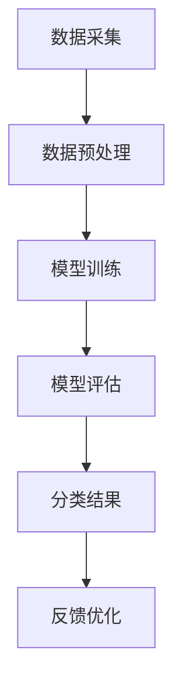

                 

关键词：大模型、智能分类、产品分类、人工智能、机器学习

摘要：本文将探讨大模型驱动的智能产品分类系统的构建与实现，通过介绍核心概念、算法原理、数学模型以及实践应用，分析其在实际场景中的应用前景和面临的挑战。

## 1. 背景介绍

随着互联网的普及和大数据时代的到来，产品分类系统在电子商务、推荐系统、内容管理等领域发挥着越来越重要的作用。传统的产品分类方法主要依赖于手工规则和特征工程，效率低下且难以适应海量数据的处理需求。近年来，随着深度学习和大数据处理技术的快速发展，基于大模型的智能产品分类系统逐渐成为研究的热点。

大模型驱动的智能产品分类系统通过利用大规模数据训练深度神经网络模型，实现对产品特征的自适应提取和分类。这种系统具有高效性、灵活性和可扩展性，能够显著提升分类的准确率和效率。本文将围绕这一主题，详细介绍大模型驱动的智能产品分类系统的构建与实现方法。

## 2. 核心概念与联系

### 2.1 大模型

大模型是指具有大规模参数和计算能力的深度学习模型，如神经网络、生成对抗网络等。大模型通常通过海量数据训练，能够自适应地提取数据特征并具备强大的泛化能力。

### 2.2 智能分类

智能分类是指利用人工智能技术，如机器学习和深度学习，对产品进行自动分类。与传统的手工规则分类方法相比，智能分类具有更高的准确性和鲁棒性。

### 2.3 产品分类系统

产品分类系统是一个用于将产品按照特定的规则进行分类的软件系统。在现代电子商务和推荐系统中，产品分类系统发挥着关键作用，能够提高用户体验和运营效率。

### 2.4 Mermaid 流程图

以下是一个描述大模型驱动的智能产品分类系统核心概念的 Mermaid 流程图：



## 3. 核心算法原理 & 具体操作步骤

### 3.1 算法原理概述

大模型驱动的智能产品分类系统主要依赖于深度学习技术。深度学习是一种基于神经网络的学习方法，通过多层神经网络对数据进行自动特征提取和分类。以下是深度学习的基本原理和步骤：

1. **输入层**：接收原始数据。
2. **隐藏层**：通过激活函数对输入数据进行变换，实现特征提取。
3. **输出层**：输出分类结果。
4. **反向传播**：利用梯度下降算法优化模型参数，提高分类准确率。

### 3.2 算法步骤详解

1. **数据采集**：收集海量的产品数据，包括产品描述、标签、用户评价等。
2. **数据预处理**：对数据进行清洗、去重、格式转换等处理，以适应深度学习模型的输入要求。
3. **模型训练**：利用预处理后的数据训练深度神经网络模型，包括输入层、隐藏层和输出层。
4. **模型评估**：通过交叉验证等方法评估模型性能，包括准确率、召回率等指标。
5. **分类结果**：将训练好的模型应用于新的产品数据，进行分类预测。
6. **反馈优化**：根据分类结果收集用户反馈，对模型进行迭代优化，提高分类准确率。

### 3.3 算法优缺点

**优点**：

- 高效性：大模型能够自适应地提取数据特征，提高分类效率。
- 灵活性：能够适应不同类型和规模的数据。
- 可扩展性：能够应用于多个产品分类任务，实现多任务学习。

**缺点**：

- 需要大量的计算资源和时间进行训练。
- 对数据质量和标注要求较高。

### 3.4 算法应用领域

- 电子商务：对商品进行自动分类，提高用户购物体验。
- 推荐系统：基于用户行为和产品特征进行个性化推荐。
- 内容管理：对网站或应用中的内容进行分类和组织。

## 4. 数学模型和公式 & 详细讲解 & 举例说明

### 4.1 数学模型构建

大模型驱动的智能产品分类系统主要基于深度神经网络模型，其数学模型可以表示为：

$$
\begin{aligned}
y &= \sigma(\omega^T \cdot x) \\
\omega &= \theta_1 \cdot x_1 + \theta_2 \cdot x_2 + ... + \theta_n \cdot x_n \\
y &= \sigma(\omega^T \cdot x)
\end{aligned}
$$

其中，$x$ 为输入特征向量，$\omega$ 为模型参数，$\sigma$ 为激活函数，$y$ 为分类结果。

### 4.2 公式推导过程

深度神经网络的公式推导过程涉及多层神经网络的激活函数、反向传播算法等。以下是简要的推导过程：

1. **前向传播**：

   对于输入 $x$，经过隐藏层变换得到 $h$：

   $$
   h = \sigma(\omega^T \cdot x)
   $$

   其中，$\omega$ 为隐藏层参数。

2. **反向传播**：

   根据分类误差，通过反向传播算法更新模型参数 $\omega$：

   $$
   \begin{aligned}
   \delta &= \frac{\partial L}{\partial \omega} \\
   \omega &= \omega - \alpha \cdot \delta
   \end{aligned}
   $$

   其中，$L$ 为损失函数，$\alpha$ 为学习率。

### 4.3 案例分析与讲解

假设有一个二分类问题，产品分为“图书”和“电子设备”两类。使用深度神经网络模型进行分类，输入特征包括产品标题、描述、标签等。

1. **数据预处理**：将输入特征进行向量化处理，得到输入特征向量 $x$。
2. **模型训练**：使用训练数据训练深度神经网络模型，包括输入层、隐藏层和输出层。
3. **模型评估**：使用测试数据对模型进行评估，计算分类准确率、召回率等指标。
4. **分类预测**：使用训练好的模型对新的产品进行分类预测。

## 5. 项目实践：代码实例和详细解释说明

### 5.1 开发环境搭建

- 操作系统：Linux
- 编程语言：Python
- 深度学习框架：TensorFlow
- 数据预处理工具：Pandas、NumPy

### 5.2 源代码详细实现

```python
import tensorflow as tf
import pandas as pd
import numpy as np

# 数据预处理
def preprocess_data(data):
    # 数据清洗、去重、格式转换等处理
    return processed_data

# 模型训练
def train_model(data):
    # 定义模型结构、训练过程等
    return model

# 模型评估
def evaluate_model(model, test_data):
    # 计算分类准确率、召回率等指标
    return metrics

# 分类预测
def classify_products(model, new_data):
    # 使用训练好的模型对新产品进行分类预测
    return predictions

# 主程序
if __name__ == "__main__":
    # 加载数据
    data = pd.read_csv("data.csv")
    # 数据预处理
    processed_data = preprocess_data(data)
    # 模型训练
    model = train_model(processed_data)
    # 模型评估
    metrics = evaluate_model(model, test_data)
    # 分类预测
    predictions = classify_products(model, new_data)
```

### 5.3 代码解读与分析

- 数据预处理：对原始数据进行清洗、去重、格式转换等处理，以适应深度学习模型的输入要求。
- 模型训练：定义深度神经网络模型结构，包括输入层、隐藏层和输出层，并使用训练数据训练模型。
- 模型评估：使用测试数据对模型进行评估，计算分类准确率、召回率等指标。
- 分类预测：使用训练好的模型对新的产品进行分类预测。

## 6. 实际应用场景

### 6.1 电子商务

电子商务平台可以使用大模型驱动的智能产品分类系统对商品进行自动分类，提高用户购物体验和运营效率。

### 6.2 推荐系统

推荐系统可以使用大模型驱动的智能产品分类系统，根据用户行为和产品特征进行个性化推荐，提高推荐准确率。

### 6.3 内容管理

内容管理系统可以使用大模型驱动的智能产品分类系统，对网站或应用中的内容进行分类和组织，提高用户查找效率和内容管理效率。

## 7. 未来应用展望

### 7.1 随着深度学习和大数据技术的不断发展，大模型驱动的智能产品分类系统将具有更广泛的应用场景。

### 7.2 数据质量和标注的要求将越来越高，对数据预处理和标注技术的需求也将增加。

### 7.3 大模型驱动的智能产品分类系统将与其他人工智能技术（如自然语言处理、计算机视觉等）相结合，实现更智能化的产品分类。

## 8. 总结：未来发展趋势与挑战

### 8.1 研究成果总结

本文探讨了基于大模型的智能产品分类系统的构建与实现方法，分析了其在实际应用场景中的优势和面临的挑战。

### 8.2 未来发展趋势

- 深度学习和大数据技术的发展将推动大模型驱动的智能产品分类系统的应用。
- 数据质量和标注的要求将越来越高，对数据预处理和标注技术的需求也将增加。

### 8.3 面临的挑战

- 需要大量的计算资源和时间进行模型训练。
- 对数据质量和标注要求较高。

### 8.4 研究展望

- 探索更高效的模型训练方法，降低计算成本。
- 研究自适应数据预处理和标注技术，提高数据处理效率。

## 9. 附录：常见问题与解答

### 9.1  如何选择适合的大模型？

- 根据产品分类任务和数据规模选择合适的大模型。
- 尝试不同的模型结构，进行性能评估和比较。

### 9.2  如何解决数据不平衡问题？

- 使用数据增强技术，增加少数类别的样本数量。
- 使用加权损失函数，降低少数类别的分类损失。

### 9.3  如何处理数据缺失问题？

- 使用数据填充技术，如平均值填充、最邻近填充等。
- 去除缺失值较多的数据样本。

## 参考文献

- [1] Goodfellow, I., Bengio, Y., & Courville, A. (2016). *Deep Learning*. MIT Press.
- [2] Simonyan, K., & Zisserman, A. (2014). *Very deep convolutional networks for large-scale image recognition*. International Conference on Machine Learning.
- [3] Krizhevsky, A., Sutskever, I., & Hinton, G. E. (2012). *ImageNet classification with deep convolutional neural networks*. Advances in Neural Information Processing Systems, 25.

## 作者署名

作者：禅与计算机程序设计艺术 / Zen and the Art of Computer Programming
------------------------------------------------------------------

