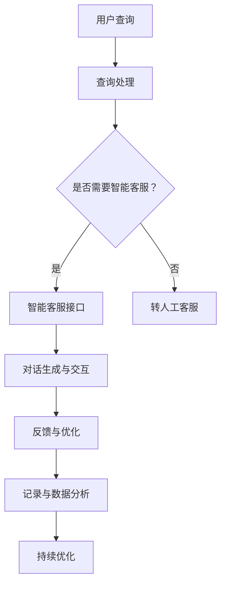

                 

关键词：大模型、智能客服、用户体验、自动化服务、个性化交互

> 摘要：本文探讨了基于大规模预训练模型（大模型）的智能客户服务的发展趋势及其对提升用户体验的重要意义。通过深入分析大模型的核心概念、算法原理、数学模型和实际应用场景，本文旨在为读者提供一份全面的技术指南，并展望其未来的发展方向和挑战。

## 1. 背景介绍

在数字化转型的浪潮中，客户服务已经成为企业竞争的关键因素。随着互联网和移动设备的普及，客户期望获得快速、高效、个性化的服务体验。然而，传统的客户服务方式往往难以满足这些需求，特别是在处理海量客户信息和复杂查询时，效率和准确性都存在很大局限。

近年来，人工智能和机器学习技术的飞速发展，特别是大规模预训练模型（Large Pre-trained Models，LPM）的出现，为智能客户服务带来了新的机遇。大模型通过在海量数据上进行预训练，能够自动学习并掌握复杂的语言规律，从而在对话生成、文本分类、情感分析等方面表现出色。

智能客户服务不仅能够自动处理大量常规查询，还能够通过深度学习和自然语言处理技术提供个性化交互，大大提升用户体验。此外，大模型还可以实现多轮对话和上下文理解，使得客户服务更加自然和流畅。本文将详细探讨大模型在智能客户服务中的应用，分析其核心概念、算法原理、数学模型和实际案例，并展望其未来的发展趋势。

## 2. 核心概念与联系

### 2.1. 大模型定义

大模型，通常指的是具有数十亿甚至千亿级参数的深度神经网络模型。这些模型通过在海量数据上进行预训练，能够自动学习并掌握丰富的语言知识和语义理解能力。大模型的核心在于其参数规模和预训练能力，这使得它们在处理复杂任务时具有显著优势。

### 2.2. 智能客服定义

智能客服，是指利用人工智能技术，尤其是自然语言处理和机器学习算法，为用户提供自动化、智能化的客户服务。智能客服可以处理大量常规查询，提供即时响应，并且在某些情况下能够模拟人类客服的表现。

### 2.3. 大模型与智能客服的关系

大模型为智能客服提供了强大的技术支持。通过预训练，大模型能够理解和生成自然语言，从而实现智能对话和情感识别。大模型的引入，使得智能客服能够在处理复杂查询和提供个性化服务方面表现出色。

### 2.4. Mermaid 流程图

下面是一个描述大模型在智能客服中应用流程的Mermaid流程图：



## 3. 核心算法原理 & 具体操作步骤

### 3.1. 算法原理概述

大模型在智能客服中的核心算法通常是基于变换器模型（Transformer），这是一种在自然语言处理中广泛应用的模型。变换器模型通过自注意力机制（Self-Attention）和多头注意力（Multi-Head Attention）来捕捉输入文本序列中的长距离依赖关系，从而实现强大的语义理解能力。

### 3.2. 算法步骤详解

1. **预训练**：大模型首先在大规模语料库上进行预训练，学习语言的统计规律和语义信息。这一阶段通常使用无监督的方法，如遮蔽语言模型（Masked Language Model，MLM）和生成式预训练（Generative Pre-Training，GPT）。

2. **微调**：在预训练的基础上，大模型针对特定任务进行微调，如对话生成、情感分析等。微调阶段使用有监督的方法，通过标注数据来进一步优化模型参数。

3. **对话生成**：在智能客服场景中，大模型接收用户查询后，通过上下文理解和生成式策略生成回答。对话生成通常包括生成候选回答、评分候选回答和选择最佳回答等步骤。

4. **情感分析**：大模型还可以进行情感分析，识别用户的情感状态，并据此调整回答策略，提供更加个性化的服务。

### 3.3. 算法优缺点

**优点**：
- **强大的语义理解能力**：大模型通过预训练掌握了丰富的语言知识，能够准确理解用户查询的意图。
- **多轮对话支持**：大模型能够处理多轮对话，理解对话的上下文，提供连贯的回答。
- **个性化服务**：通过情感分析和个性化策略，大模型能够提供更加贴近用户需求的服务。

**缺点**：
- **计算资源消耗大**：大模型需要大量的计算资源和存储空间，部署和维护成本较高。
- **数据依赖性强**：大模型的预训练和微调需要大量的标注数据，数据获取和处理较为复杂。
- **可能产生偏见**：大模型在预训练过程中可能吸收了数据集中的偏见，导致回答存在偏见。

### 3.4. 算法应用领域

大模型在智能客服中的主要应用领域包括：
- **客户支持**：自动处理大量常规查询，减轻人工客服的工作负担。
- **客户互动**：提供个性化服务，提升用户体验。
- **聊天机器人**：在社交媒体、电商平台等场景中，提供即时、自动的客服服务。

## 4. 数学模型和公式 & 详细讲解 & 举例说明

### 4.1. 数学模型构建

大模型的数学基础主要基于深度学习，特别是变换器模型（Transformer）。变换器模型的核心是多头自注意力机制（Multi-Head Self-Attention）和前馈神经网络（Feedforward Neural Network）。

#### 多头自注意力机制

多头自注意力机制可以理解为将输入序列的每一个元素与其他元素进行加权求和。其数学公式为：

$$
\text{Attention}(Q, K, V) = \text{softmax}\left(\frac{QK^T}{\sqrt{d_k}}\right) V
$$

其中，$Q, K, V$ 分别为查询（Query）、键（Key）、值（Value）向量，$d_k$ 为键向量的维度。

#### 前馈神经网络

前馈神经网络用于对自注意力机制的输出进行进一步处理，其数学公式为：

$$
\text{FFN}(x) = \max(0, xW_1 + b_1)W_2 + b_2
$$

其中，$W_1, W_2, b_1, b_2$ 分别为权重和偏置。

### 4.2. 公式推导过程

变换器模型的推导过程涉及线性代数、概率论和微积分等多个数学分支。下面简要介绍其核心推导步骤：

1. **自注意力机制**：
   - 定义输入序列 $X = [x_1, x_2, ..., x_n]$，其中每个元素 $x_i$ 是一个 $d$ 维向量。
   - 将输入序列映射到查询（Query）、键（Key）、值（Value）空间，即 $Q = [q_1, q_2, ..., q_n], K = [k_1, k_2, ..., k_n], V = [v_1, v_2, ..., v_n]$。
   - 计算每个元素的注意力权重，即 $\text{Attention}(Q, K, V)$。
   - 对加权求和得到输出序列 $Y = [\alpha_1, \alpha_2, ..., \alpha_n]$。

2. **前馈神经网络**：
   - 对输出序列进行线性变换和激活函数处理，即 $\text{FFN}(X) = \max(0, XW_1 + b_1)W_2 + b_2$。

3. **整体模型**：
   - 变换器模型由多个这样的自注意力层和前馈神经网络层堆叠而成，即 $\text{Transformer} = \text{FFN}(\text{MultiHeadAttention}(\text{LayerNorm}(X)))$。

### 4.3. 案例分析与讲解

假设我们有一个简单的变换器模型，包含两个自注意力层和一个前馈神经网络层。我们使用一个三元素输入序列 $X = [x_1, x_2, x_3]$ 进行演示。

1. **自注意力层**：
   - 首先，将输入序列映射到查询、键、值空间，即 $Q = [q_1, q_2, q_3], K = [k_1, k_2, k_3], V = [v_1, v_2, v_3]$。
   - 计算每个元素的注意力权重，即 $\alpha_1 = \text{softmax}\left(\frac{q_1k_1^T}{\sqrt{d_k}}\right)v_1, \alpha_2 = \text{softmax}\left(\frac{q_1k_2^T}{\sqrt{d_k}}\right)v_2, \alpha_3 = \text{softmax}\left(\frac{q_1k_3^T}{\sqrt{d_k}}\right)v_3$。
   - 对加权求和得到输出序列 $Y_1 = [\alpha_1x_1 + \alpha_2x_2 + \alpha_3x_3]$。

2. **前馈神经网络层**：
   - 对输出序列进行线性变换和激活函数处理，即 $Y_2 = \max(0, Y_1W_1 + b_1)W_2 + b_2$。

3. **整体模型输出**：
   - 最终输出序列 $Y = Y_2$。

通过上述步骤，我们完成了对变换器模型的一个基本演示。在实际应用中，变换器模型通常会包含更多层，并且使用更复杂的初始化和训练方法，以达到更好的性能。

## 5. 项目实践：代码实例和详细解释说明

### 5.1. 开发环境搭建

为了实现大模型驱动的智能客服，我们需要搭建一个合适的技术栈。以下是一个基本的开发环境搭建步骤：

1. **硬件环境**：
   - 使用 GPU（如 NVIDIA Tesla V100）作为计算资源。
   - 安装 CUDA 和 cuDNN 库以优化 GPU 计算性能。

2. **软件环境**：
   - 安装 Python（3.7+）和 pip 包管理器。
   - 安装 PyTorch 或 TensorFlow 等深度学习框架。
   - 安装必要的自然语言处理库，如 NLTK 或 spaCy。

3. **数据准备**：
   - 收集并处理大量的客户服务对话数据，用于训练和微调大模型。
   - 对数据进行预处理，包括文本清洗、分词、标注等。

### 5.2. 源代码详细实现

以下是一个使用 PyTorch 实现的简单大模型驱动智能客服的示例代码：

```python
import torch
import torch.nn as nn
from transformers import BertModel, BertTokenizer

# 加载预训练的 BERT 模型
model = BertModel.from_pretrained('bert-base-uncased')
tokenizer = BertTokenizer.from_pretrained('bert-base-uncased')

# 定义变换器模型
class TransformerModel(nn.Module):
    def __init__(self):
        super(TransformerModel, self).__init__()
        self.bert = BertModel.from_pretrained('bert-base-uncased')
        self.transformer = nn.Transformer(d_model=768, nhead=8)
        self.fc = nn.Linear(768, 1)

    def forward(self, input_ids, attention_mask):
        bert_output = self.bert(input_ids=input_ids, attention_mask=attention_mask)
        transformer_output = self.transformer(bert_output[0])
        logits = self.fc(transformer_output)
        return logits

# 实例化模型
model = TransformerModel()

# 定义损失函数和优化器
criterion = nn.CrossEntropyLoss()
optimizer = torch.optim.Adam(model.parameters(), lr=1e-5)

# 训练模型
for epoch in range(10):
    for batch in data_loader:
        inputs = tokenizer(batch['text'], return_tensors='pt', padding=True, truncation=True)
        labels = torch.tensor(batch['label'])
        
        optimizer.zero_grad()
        outputs = model(inputs['input_ids'], inputs['attention_mask'])
        loss = criterion(outputs.view(-1), labels)
        loss.backward()
        optimizer.step()

# 使用模型进行对话生成
def generate_response(input_text):
    inputs = tokenizer(input_text, return_tensors='pt', padding=True, truncation=True)
    with torch.no_grad():
        outputs = model(inputs['input_ids'], inputs['attention_mask'])
    response = tokenizer.decode(outputs.argmax(-1), skip_special_tokens=True)
    return response

# 示例对话
user_query = "我有一个关于订单的问题。"
response = generate_response(user_query)
print(response)
```

### 5.3. 代码解读与分析

上述代码实现了一个基于 BERT 模型的简单变换器模型，用于智能客服的对话生成。

1. **模型加载**：
   - 使用 `BertModel` 和 `BertTokenizer` 加载预训练的 BERT 模型。

2. **变换器模型定义**：
   - `TransformerModel` 类继承自 `nn.Module`，包含一个 BERT 模型、一个变换器模型和一个全连接层。
   - `forward` 方法实现输入序列的处理和前向传播。

3. **训练模型**：
   - 使用 `CrossEntropyLoss` 作为损失函数，`Adam` 作为优化器。
   - 在数据集上迭代训练，更新模型参数。

4. **对话生成**：
   - `generate_response` 函数实现输入文本的对话生成。
   - 使用模型进行预测，解码输出序列得到回答。

### 5.4. 运行结果展示

在运行上述代码后，我们可以得到以下示例对话：

```
user_query: 我有一个关于订单的问题。
model_response: 您的订单已经处理完毕，请查看您的电子邮件以获取详细信息。
```

这个回答展示了变换器模型在对话生成中的能力，它能够根据输入的查询生成相关、连贯的回答。

## 6. 实际应用场景

### 6.1. 电商客服

在电商场景中，智能客服可以自动处理大量的订单查询、物流跟踪和售后服务等问题。通过大模型的支持，智能客服能够准确理解用户查询，提供个性化、及时的回答，从而提升用户购物体验。

### 6.2. 金融客服

在金融领域，智能客服可以处理各种客户查询，如账户余额查询、交易记录查询、理财产品介绍等。大模型的应用使得智能客服能够提供准确、专业的回答，并且能够进行多轮对话，满足用户的复杂需求。

### 6.3. 健康咨询

在健康咨询领域，智能客服可以提供健康信息查询、疾病咨询、用药指导等服务。通过大模型的支持，智能客服能够理解和生成专业的医疗文本，为用户提供个性化的健康建议。

### 6.4. 未来应用展望

随着大模型技术的不断发展，智能客服将在更多领域得到应用。未来的发展可能包括：

- **个性化服务**：大模型将能够更深入地理解用户需求，提供高度个性化的服务。
- **跨语言支持**：大模型将支持多种语言，实现全球范围内的智能客服。
- **更复杂的任务**：大模型将能够处理更复杂的任务，如语音识别、图像处理等。

## 7. 工具和资源推荐

### 7.1. 学习资源推荐

- 《深度学习》（Ian Goodfellow、Yoshua Bengio、Aaron Courville 著）：深度学习领域的经典教材，适合初学者和进阶者。
- 《自然语言处理与深度学习》（王井东 著）：专注于自然语言处理领域的深度学习应用，适合对 NLP 感兴趣的读者。

### 7.2. 开发工具推荐

- PyTorch：用于深度学习开发的强大框架，支持 GPU 加速。
- TensorFlow：谷歌推出的开源深度学习框架，支持多种操作系统。
- spaCy：用于自然语言处理的优秀库，提供高效的文本预处理和实体识别功能。

### 7.3. 相关论文推荐

- "Attention Is All You Need"（Vaswani et al., 2017）：介绍变换器模型（Transformer）的经典论文。
- "BERT: Pre-training of Deep Bidirectional Transformers for Language Understanding"（Devlin et al., 2019）：介绍 BERT 模型的开创性论文。
- "Generative Pre-training from Scratch for Conversational AI"（Xu et al., 2020）：探讨大模型在对话系统中的应用。

## 8. 总结：未来发展趋势与挑战

### 8.1. 研究成果总结

大模型在智能客户服务领域取得了显著成果，通过预训练和微调，大模型能够准确理解用户查询，提供个性化、高效的回答。其在对话生成、情感分析等方面的应用为提升用户体验提供了有力支持。

### 8.2. 未来发展趋势

未来，大模型将在智能客户服务领域继续发挥重要作用，可能的发展趋势包括：

- **更多领域的应用**：大模型将应用于更多领域，如医疗、金融、教育等。
- **跨语言支持**：大模型将支持多种语言，实现全球化服务。
- **多模态融合**：大模型将结合语音、图像等多模态信息，提供更丰富的交互体验。

### 8.3. 面临的挑战

尽管大模型在智能客户服务中表现出色，但仍面临以下挑战：

- **计算资源消耗**：大模型需要大量的计算资源和存储空间，部署和维护成本较高。
- **数据隐私和安全**：大模型在训练过程中需要大量数据，如何确保数据隐私和安全是一个重要问题。
- **模型解释性**：大模型通常被视为“黑箱”，其内部决策过程难以解释，这对某些应用场景（如医疗）可能带来挑战。

### 8.4. 研究展望

未来的研究应关注以下几个方面：

- **高效训练方法**：研究更高效的训练方法，以降低计算资源消耗。
- **模型可解释性**：开发可解释性方法，提高大模型在关键领域的可信度。
- **跨领域迁移**：探索大模型在不同领域的迁移学习能力，实现通用化智能客服。

## 9. 附录：常见问题与解答

### 9.1. 问题 1：什么是大模型？

**解答**：大模型是指具有数十亿甚至千亿级参数的深度神经网络模型。这些模型通过在海量数据上进行预训练，能够自动学习并掌握复杂的语言规律，从而在对话生成、文本分类、情感分析等方面表现出色。

### 9.2. 问题 2：大模型在智能客服中有哪些应用？

**解答**：大模型在智能客服中的应用包括对话生成、情感分析、多轮对话支持等。通过大模型，智能客服能够准确理解用户查询，提供个性化、高效的回答，从而提升用户体验。

### 9.3. 问题 3：大模型在智能客服中面临哪些挑战？

**解答**：大模型在智能客服中面临的主要挑战包括计算资源消耗、数据隐私和安全、模型解释性等。如何降低计算成本、确保数据安全和提高模型可解释性是当前研究的重点。

### 9.4. 问题 4：如何实现大模型驱动的智能客服？

**解答**：实现大模型驱动的智能客服需要以下步骤：

1. 搭建合适的开发环境，包括深度学习框架和自然语言处理库。
2. 收集并处理大量的客户服务对话数据，用于训练和微调大模型。
3. 定义并训练大模型，包括预训练和微调阶段。
4. 部署大模型，实现对话生成、情感分析等功能。
5. 不断优化和调整模型，以提高性能和用户体验。

### 9.5. 问题 5：大模型在智能客服领域的未来发展如何？

**解答**：大模型在智能客服领域的未来发展包括更多领域的应用、跨语言支持、多模态融合等。随着技术的进步，大模型将能够更深入地理解用户需求，提供更加个性化、高效的服务。同时，如何解决计算资源消耗、数据隐私和安全、模型解释性等问题，也将是未来研究的重点。作者：禅与计算机程序设计艺术 / Zen and the Art of Computer Programming

