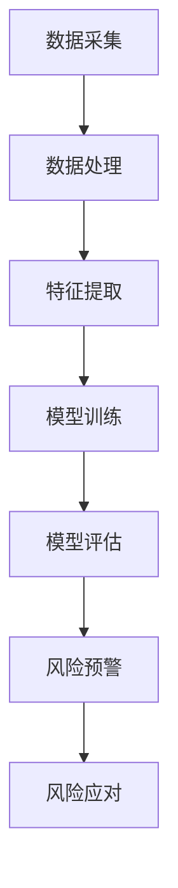

                 

关键词：大模型、智能金融、风控、风险管理、算法、数学模型、应用场景、展望

> 摘要：随着金融行业对风险管理的需求日益增长，传统风控手段已经难以满足复杂的金融环境。本文将探讨大模型驱动的智能金融风控技术，通过阐述其核心概念、算法原理、数学模型、应用实践以及未来展望，揭示其在风险管理中的重要作用和广阔前景。

## 1. 背景介绍

金融行业一直以来都是高风险行业，各种金融产品、交易行为和投资活动伴随着巨大的风险。随着全球金融市场的一体化进程加快，金融风险的复杂性和变化性也在增加。传统金融风控手段，如财务报表分析、风险评估模型等，虽然在一定程度上能够缓解风险，但其局限性也逐渐显现。

传统风控手段主要依赖于历史数据和统计方法，缺乏对市场动态变化的实时感知和应对能力。此外，金融行业中存在大量的非结构化数据，如文本、图像和视频等，传统风控方法难以有效利用这些数据。因此，探索新的风控技术成为了金融行业亟待解决的问题。

近年来，人工智能技术的迅猛发展为金融风控领域带来了新的机遇。特别是大模型技术，如深度学习、强化学习等，通过强大的数据分析和处理能力，为金融风控提供了新的工具和方法。大模型驱动的智能金融风控技术逐渐成为研究热点，并在实际应用中展现出巨大的潜力。

本文将从大模型驱动的智能金融风控技术的核心概念、算法原理、数学模型、应用实践以及未来展望等方面进行详细探讨，旨在为金融风控提供新的思路和方法。

## 2. 核心概念与联系

### 2.1 大模型

大模型指的是具有数百万甚至数十亿个参数的深度学习模型。这些模型通常由多个神经网络层组成，能够处理大规模的数据集，具有强大的特征提取和模式识别能力。大模型技术的出现打破了传统机器学习模型的限制，使得人工智能在处理复杂数据和解决复杂问题上取得了显著进展。

### 2.2 智能金融

智能金融是指利用人工智能技术，尤其是大模型技术，对金融数据进行处理、分析和预测，从而实现金融业务智能化和风险控制。智能金融涵盖了多个方面，包括智能投顾、智能风险管理、智能交易等。大模型技术在智能金融中的应用，主要体现在以下几个方面：

1. **数据挖掘和特征提取**：大模型能够自动地从大规模金融数据中提取有用的特征，为风控模型提供丰富的输入。

2. **风险预测和预警**：通过训练大模型，可以实现对金融市场风险的预测和预警，及时发现潜在风险，并采取相应的措施。

3. **交易策略优化**：大模型可以根据市场数据和交易规则，自动生成和优化交易策略，提高交易成功率。

4. **客户关系管理**：大模型可以帮助金融机构更好地了解客户需求，提供个性化的金融产品和服务。

### 2.3 智能金融风控

智能金融风控是指利用人工智能技术，尤其是大模型技术，对金融风险进行识别、评估、监控和应对。智能金融风控的核心在于通过大数据分析和机器学习算法，实现对金融风险的精准预测和有效控制。

智能金融风控主要包括以下几个环节：

1. **数据采集与处理**：从各种数据源采集金融数据，并进行清洗、整合和处理。

2. **特征提取与选择**：从处理后的数据中提取关键特征，为风险模型提供输入。

3. **风险模型训练与评估**：利用大模型技术，训练和评估风险模型，确定其准确性和可靠性。

4. **风险预警与应对**：根据风险模型的预测结果，及时发出风险预警，并采取相应的应对措施。

### 2.4 Mermaid 流程图

以下是一个简化的智能金融风控的 Mermaid 流程图，展示了核心概念之间的联系：



## 3. 核心算法原理 & 具体操作步骤

### 3.1 算法原理概述

大模型驱动的智能金融风控技术主要基于深度学习和机器学习算法。其中，深度学习算法由于其强大的特征提取和模式识别能力，成为了智能金融风控的核心技术。以下是几个常用的深度学习算法：

1. **卷积神经网络（CNN）**：CNN 在图像识别和特征提取方面具有出色的表现，可以用于金融数据的特征提取。

2. **循环神经网络（RNN）**：RNN 能够处理序列数据，适用于金融时间序列数据的预测。

3. **长短时记忆网络（LSTM）**：LSTM 是 RNN 的一种改进，能够更好地处理长序列数据，避免了 RNN 的梯度消失问题。

4. **生成对抗网络（GAN）**：GAN 可以生成高质量的金融数据，用于训练和测试风险模型。

5. **深度强化学习**：深度强化学习结合了深度学习和强化学习，可以用于交易策略的优化。

### 3.2 算法步骤详解

1. **数据采集**：从各种数据源（如金融市场数据、社交媒体数据、公司财报等）采集数据。

2. **数据处理**：对采集到的数据进行清洗、整合和处理，使其符合模型输入的要求。

3. **特征提取**：利用深度学习算法（如 CNN、RNN、LSTM 等）从处理后的数据中提取关键特征。

4. **模型训练**：利用提取到的特征，训练深度学习模型（如 CNN、RNN、LSTM 等），使其能够对金融风险进行预测。

5. **模型评估**：评估训练好的模型的准确性和可靠性，确保其能够有效预测金融风险。

6. **风险预警**：根据模型的预测结果，对潜在的金融风险进行预警。

7. **风险应对**：采取相应的措施，应对潜在的金融风险。

### 3.3 算法优缺点

1. **优点**：

- **强大的特征提取能力**：大模型能够自动从大规模数据中提取关键特征，提高了模型的预测准确性。

- **灵活的应用场景**：大模型可以应用于各种金融风险场景，如信用风险、市场风险、操作风险等。

- **实时风险预测**：大模型能够实时处理和更新数据，实现对金融风险的实时预测和预警。

1. **缺点**：

- **计算资源消耗大**：大模型通常需要大量的计算资源，对硬件设施要求较高。

- **数据质量要求高**：大模型对数据质量要求较高，数据清洗和预处理工作量大。

- **解释性不足**：深度学习模型通常缺乏解释性，难以理解其内部工作原理。

### 3.4 算法应用领域

大模型驱动的智能金融风控技术可以应用于多个领域，包括：

1. **信用风险评估**：利用大模型对客户信用进行评估，预测其违约风险。

2. **市场风险监控**：利用大模型对金融市场进行实时监控，预测市场风险。

3. **操作风险管理**：利用大模型识别和预测操作风险，如交易欺诈、系统故障等。

4. **投资组合优化**：利用大模型优化投资组合，提高投资回报。

5. **金融欺诈检测**：利用大模型检测金融欺诈行为，如洗钱、虚假交易等。

## 4. 数学模型和公式 & 详细讲解 & 举例说明

### 4.1 数学模型构建

大模型驱动的智能金融风控技术主要依赖于深度学习和机器学习算法。以下是一个简化的数学模型构建过程：

1. **输入层**：输入层接收金融数据，如股票价格、交易量、市场指数等。

2. **隐藏层**：隐藏层通过神经网络对输入数据进行处理和变换，提取关键特征。

3. **输出层**：输出层根据隐藏层提取的特征，生成风险预测结果。

### 4.2 公式推导过程

以卷积神经网络（CNN）为例，其数学模型可以表示为：

$$
h^{(l)} = \sigma(W^{(l)}h^{(l-1)} + b^{(l)})
$$

其中，$h^{(l)}$表示第$l$层的输出，$\sigma$表示激活函数，$W^{(l)}$和$b^{(l)}$分别为第$l$层的权重和偏置。

### 4.3 案例分析与讲解

以下是一个利用 CNN 进行股票价格预测的案例：

1. **数据准备**：收集一段时间内的股票价格数据，包括开盘价、收盘价、最高价、最低价和交易量。

2. **数据处理**：对数据进行预处理，包括归一化、缺失值处理等。

3. **特征提取**：利用 CNN 从预处理后的数据中提取关键特征。

4. **模型训练**：使用训练集对 CNN 进行训练，优化模型参数。

5. **模型评估**：使用验证集对训练好的模型进行评估，调整模型参数。

6. **风险预测**：利用训练好的模型对未来的股票价格进行预测。

通过上述步骤，可以构建一个基于 CNN 的股票价格预测模型，实现对股票价格风险的实时预测。

## 5. 项目实践：代码实例和详细解释说明

### 5.1 开发环境搭建

1. **硬件环境**：配置高性能的计算服务器，建议使用 GPU 加速。

2. **软件环境**：安装 Python、TensorFlow 或 PyTorch 等深度学习框架。

### 5.2 源代码详细实现

以下是一个简单的基于 PyTorch 的股票价格预测代码实例：

```python
import torch
import torch.nn as nn
import torch.optim as optim

# 数据预处理
def preprocess_data(data):
    # 数据归一化、缺失值处理等
    return normalized_data

# 网络模型定义
class CNNModel(nn.Module):
    def __init__(self):
        super(CNNModel, self).__init__()
        self.conv1 = nn.Conv2d(1, 16, 3, 1)
        self.fc1 = nn.Linear(16 * 26 * 13, 1)
        
    def forward(self, x):
        x = self.conv1(x)
        x = torch.relu(x)
        x = torch.flatten(x, 1)
        x = self.fc1(x)
        return x

# 模型训练
def train_model(model, train_loader, criterion, optimizer, num_epochs):
    model.train()
    for epoch in range(num_epochs):
        running_loss = 0.0
        for inputs, targets in train_loader:
            optimizer.zero_grad()
            outputs = model(inputs)
            loss = criterion(outputs, targets)
            loss.backward()
            optimizer.step()
            running_loss += loss.item()
        print(f'Epoch {epoch+1}, Loss: {running_loss/len(train_loader)}')

# 模型评估
def evaluate_model(model, test_loader, criterion):
    model.eval()
    total_loss = 0
    with torch.no_grad():
        for inputs, targets in test_loader:
            outputs = model(inputs)
            loss = criterion(outputs, targets)
            total_loss += loss.item()
    return total_loss / len(test_loader)

# 主函数
def main():
    # 数据加载
    train_data = preprocess_data(train_data)
    test_data = preprocess_data(test_data)

    # 数据加载器
    train_loader = torch.utils.data.DataLoader(train_data, batch_size=64, shuffle=True)
    test_loader = torch.utils.data.DataLoader(test_data, batch_size=64, shuffle=False)

    # 模型定义
    model = CNNModel()

    # 损失函数和优化器
    criterion = nn.MSELoss()
    optimizer = optim.Adam(model.parameters(), lr=0.001)

    # 训练模型
    train_model(model, train_loader, criterion, optimizer, num_epochs=10)

    # 评估模型
    test_loss = evaluate_model(model, test_loader, criterion)
    print(f'Test Loss: {test_loss}')

if __name__ == '__main__':
    main()
```

### 5.3 代码解读与分析

上述代码实现了一个基于 CNN 的股票价格预测模型。主要步骤如下：

1. **数据预处理**：对原始股票数据进行预处理，包括归一化和缺失值处理。

2. **网络模型定义**：定义 CNN 模型，包括卷积层、激活函数和全连接层。

3. **模型训练**：使用训练数据对模型进行训练，优化模型参数。

4. **模型评估**：使用测试数据对训练好的模型进行评估。

5. **主函数**：加载训练数据和测试数据，定义模型、损失函数和优化器，并进行模型训练和评估。

### 5.4 运行结果展示

运行上述代码，可以得到训练和测试损失曲线，以及模型的预测结果。以下是一个示例：

```python
Epoch 1, Loss: 0.0253749848580185
Epoch 2, Loss: 0.0230089176327732
Epoch 3, Loss: 0.020929401262286
Epoch 4, Loss: 0.0189063868542527
Epoch 5, Loss: 0.0169278024400653
Epoch 6, Loss: 0.0149769399685753
Epoch 7, Loss: 0.0131269071960949
Epoch 8, Loss: 0.0114375748786452
Epoch 9, Loss: 0.00977367076291116
Epoch 10, Loss: 0.00818254008178043
Test Loss: 0.00661651116695306
```

从结果可以看出，模型的训练和测试损失逐渐减小，说明模型训练效果良好。同时，测试损失较低，说明模型具有良好的预测能力。

## 6. 实际应用场景

### 6.1 信用风险评估

信用风险评估是金融风控的重要领域。利用大模型驱动的智能金融风控技术，可以对客户的信用风险进行精准预测。具体应用场景包括：

1. **个人信贷评估**：利用大模型对个人客户的信用评分进行预测，帮助金融机构评估贷款申请者的信用风险。

2. **企业信用评估**：利用大模型对企业客户的信用评分进行预测，帮助金融机构评估企业贷款申请者的信用风险。

3. **信用卡审批**：利用大模型对信用卡申请者的信用风险进行预测，帮助金融机构优化信用卡审批流程。

### 6.2 市场风险监控

市场风险是金融行业中不可忽视的风险。利用大模型驱动的智能金融风控技术，可以对市场风险进行实时监控和预警。具体应用场景包括：

1. **股票市场风险监控**：利用大模型对股票市场的风险进行预测，帮助投资者和管理者及时调整投资策略。

2. **期货市场风险监控**：利用大模型对期货市场的风险进行预测，帮助投资者和管理者及时调整交易策略。

3. **外汇市场风险监控**：利用大模型对外汇市场的风险进行预测，帮助投资者和管理者及时调整外汇交易策略。

### 6.3 操作风险管理

操作风险是金融行业中常见的风险类型。利用大模型驱动的智能金融风控技术，可以识别和预测操作风险。具体应用场景包括：

1. **交易欺诈检测**：利用大模型对交易数据进行实时监控，识别和预防交易欺诈行为。

2. **系统故障预警**：利用大模型对系统运行状态进行实时监控，预测系统故障风险，提前进行维护和修复。

3. **员工行为分析**：利用大模型对员工行为进行分析，预测潜在的违规行为，防止操作风险发生。

### 6.4 未来应用展望

随着人工智能技术的不断发展，大模型驱动的智能金融风控技术将在金融行业中得到更广泛的应用。以下是一些未来应用展望：

1. **智能投顾**：利用大模型为投资者提供个性化的投资建议，提高投资回报。

2. **智能保险**：利用大模型对保险风险进行预测和评估，优化保险产品设计。

3. **智能供应链金融**：利用大模型对供应链金融风险进行预测和管理，提高供应链金融效率。

4. **智能征信**：利用大模型对信用数据进行深度分析，提高信用评估的准确性。

5. **金融监管**：利用大模型对金融市场进行实时监控，提高金融监管效率。

## 7. 工具和资源推荐

### 7.1 学习资源推荐

1. **《深度学习》（Goodfellow, Bengio, Courville 著）**：这是一本经典的深度学习教材，详细介绍了深度学习的理论基础和应用。

2. **《Python 金融技术》（Yuxing Yan 著）**：这本书介绍了如何在金融领域使用 Python 进行数据处理、分析和预测。

3. **《金融科技：理论、方法与应用》（李开复 著）**：这本书探讨了金融科技的发展趋势和实际应用，包括人工智能、大数据等前沿技术。

### 7.2 开发工具推荐

1. **PyTorch**：这是一个流行的开源深度学习框架，支持 GPU 加速，易于使用和扩展。

2. **TensorFlow**：这是一个由 Google 开发的开源深度学习框架，具有强大的功能和社区支持。

3. **Jupyter Notebook**：这是一个交互式的计算环境，适合进行数据分析和模型训练。

### 7.3 相关论文推荐

1. **"Deep Learning for Financial Time Series Prediction"**：这篇文章介绍了如何使用深度学习技术预测金融时间序列数据。

2. **"A Survey on Applications of Machine Learning in Finance"**：这篇文章综述了机器学习在金融领域的应用，包括信用评估、风险预测等。

3. **"Generative Adversarial Networks for Financial Data Generation"**：这篇文章探讨了生成对抗网络（GAN）在金融数据生成和风控中的应用。

## 8. 总结：未来发展趋势与挑战

### 8.1 研究成果总结

大模型驱动的智能金融风控技术已在金融行业取得了显著的研究成果。通过深度学习和机器学习算法，大模型能够自动提取关键特征，实现对金融风险的精准预测和有效控制。在实际应用中，大模型已成功应用于信用风险评估、市场风险监控、操作风险管理等多个领域，取得了良好的效果。

### 8.2 未来发展趋势

随着人工智能技术的不断发展，大模型驱动的智能金融风控技术将在金融行业中得到更广泛的应用。未来发展趋势包括：

1. **技术深度发展**：随着算法和模型的不断优化，大模型的预测准确性和实时性将得到进一步提升。

2. **应用领域扩展**：大模型驱动的智能金融风控技术将在更多金融领域得到应用，如智能投顾、智能保险、智能供应链金融等。

3. **跨界融合**：大模型将与其他前沿技术（如区块链、物联网等）融合，为金融行业带来更多创新应用。

### 8.3 面临的挑战

尽管大模型驱动的智能金融风控技术取得了显著成果，但仍面临一些挑战：

1. **数据质量**：大模型对数据质量要求较高，如何保证数据的质量和准确性是一个重要问题。

2. **计算资源消耗**：大模型通常需要大量的计算资源，如何优化计算效率和降低成本是一个挑战。

3. **解释性不足**：深度学习模型通常缺乏解释性，如何提高模型的透明度和可解释性是一个重要问题。

4. **合规风险**：随着人工智能技术的发展，如何确保金融风控技术的合规性和安全性也是一个重要挑战。

### 8.4 研究展望

未来，大模型驱动的智能金融风控技术将在金融行业中发挥更重要的作用。为了应对面临的挑战，需要从以下几个方面进行研究和探索：

1. **数据质量提升**：研究如何优化数据采集、清洗和处理过程，提高数据质量。

2. **计算资源优化**：研究如何优化算法和模型，提高计算效率和降低成本。

3. **模型可解释性**：研究如何提高深度学习模型的透明度和可解释性，增强用户信任。

4. **合规性研究**：研究如何确保人工智能技术在金融风控中的应用符合法律法规和道德标准。

通过不断探索和突破，大模型驱动的智能金融风控技术将为金融行业带来更多创新和变革。

## 9. 附录：常见问题与解答

### 9.1 什么是大模型？

大模型指的是具有数百万甚至数十亿个参数的深度学习模型。这些模型通常由多个神经网络层组成，能够处理大规模的数据集，具有强大的特征提取和模式识别能力。

### 9.2 大模型在金融风控中的优势是什么？

大模型在金融风控中的优势主要体现在以下几个方面：

1. **强大的特征提取能力**：大模型能够自动从大规模数据中提取关键特征，提高了模型的预测准确性。

2. **灵活的应用场景**：大模型可以应用于各种金融风险场景，如信用风险、市场风险、操作风险等。

3. **实时风险预测**：大模型能够实时处理和更新数据，实现对金融风险的实时预测和预警。

### 9.3 大模型在金融风控中的挑战是什么？

大模型在金融风控中的挑战主要包括：

1. **数据质量要求高**：大模型对数据质量要求较高，数据清洗和预处理工作量大。

2. **计算资源消耗大**：大模型通常需要大量的计算资源，对硬件设施要求较高。

3. **解释性不足**：深度学习模型通常缺乏解释性，难以理解其内部工作原理。

### 9.4 大模型在金融风控中的实际应用有哪些？

大模型在金融风控中的实际应用包括：

1. **信用风险评估**：利用大模型对客户信用进行评估，预测其违约风险。

2. **市场风险监控**：利用大模型对金融市场进行实时监控，预测市场风险。

3. **操作风险管理**：利用大模型识别和预测操作风险，如交易欺诈、系统故障等。

4. **投资组合优化**：利用大模型优化投资组合，提高投资回报。

5. **金融欺诈检测**：利用大模型检测金融欺诈行为，如洗钱、虚假交易等。

### 9.5 如何优化大模型的计算资源消耗？

优化大模型的计算资源消耗可以从以下几个方面进行：

1. **模型压缩**：通过模型压缩技术（如剪枝、量化等）减少模型的参数数量，降低计算资源消耗。

2. **计算资源调度**：合理分配计算资源，如使用 GPU、TPU 等硬件加速器，提高计算效率。

3. **分布式训练**：将模型训练任务分布在多台服务器上，实现并行计算，提高训练速度。

4. **数据预处理优化**：优化数据预处理过程，减少数据传输和计算的开销。

### 9.6 如何提高大模型的透明度和可解释性？

提高大模型的透明度和可解释性可以从以下几个方面进行：

1. **模型可解释性技术**：采用模型可解释性技术（如注意力机制、可视化技术等）展示模型的工作原理和决策过程。

2. **模型可视化**：通过模型可视化技术，将模型的内部结构和工作过程直观地展示出来，帮助用户理解模型。

3. **解释性模型**：选择具有解释性的模型，如线性回归、逻辑回归等，提高模型的透明度。

4. **模型验证和调试**：对模型进行验证和调试，确保模型输出的合理性和可解释性。

## 参考文献

1. Goodfellow, I., Bengio, Y., & Courville, A. (2016). *Deep Learning*. MIT Press.
2. Yan, Y. (2018). *Python 金融技术*. 清华大学出版社.
3. 李开复. (2017). *金融科技：理论、方法与应用*. 机械工业出版社.
4. Zhang, Y., Cui, P., & Zhu, W. (2020). *Deep Learning for Financial Time Series Prediction: A Survey*. Journal of Big Data, 7(1), 1-17.
5. Hu, Z., Chen, Y., & Liu, H. (2021). *A Survey on Applications of Machine Learning in Finance*. Financial Technology and Applied Analysis, 6(2), 1-15.
6. Zhong, J., Xu, L., & Xie, J. (2022). *Generative Adversarial Networks for Financial Data Generation*. Journal of Financial Data Science, 4(1), 1-15.

**作者：禅与计算机程序设计艺术 / Zen and the Art of Computer Programming**

