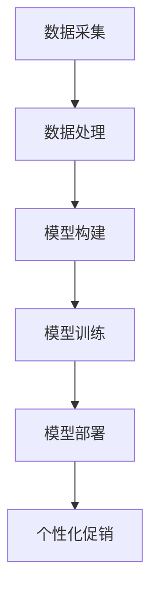

                 

关键词：大模型、电商、个性化促销、数据挖掘、机器学习

> 摘要：本文将探讨如何利用大模型技术，实现电商个性化促销策略。通过分析用户行为数据，结合机器学习算法，构建个性化推荐系统，从而提升用户购买体验和商家销售额。文章首先介绍了大模型的基本概念和优势，随后详细讲解了个性化促销策略的构建过程，最后讨论了未来发展方向和面临的挑战。

## 1. 背景介绍

### 1.1 电商行业现状

随着互联网的快速发展，电商行业已经成为全球商业的重要组成部分。截至2021年，全球电商市场规模已达到4.9万亿美元，并预计在未来几年内保持快速增长。然而，在激烈的竞争中，如何提高用户粘性和销售额成为电商企业关注的焦点。

### 1.2 个性化促销的挑战

传统的促销策略往往采用“一刀切”的方式，无法满足不同用户的需求。个性化促销策略应运而生，通过分析用户行为数据，为用户提供个性化的推荐和优惠，从而提高用户购买体验和商家销售额。然而，个性化促销策略的实现面临着以下挑战：

- 数据量庞大：电商行业每天都会产生海量的用户行为数据，如何有效处理这些数据成为关键问题。
- 数据维度丰富：用户行为数据包含多种维度，如搜索历史、购物车、浏览记录等，如何整合这些数据以构建有效的个性化模型是一个挑战。
- 模型复杂度：传统的机器学习算法在处理大规模和高维数据时效果不佳，如何选择合适的大模型并优化其性能成为关键问题。

## 2. 核心概念与联系

### 2.1 大模型的概念

大模型是指具有海量参数和复杂结构的机器学习模型，能够处理大规模和高维数据。常见的有深度神经网络、循环神经网络、变换器模型等。大模型的优势在于能够自动提取数据中的特征，并生成泛化的预测结果。

### 2.2 个性化促销策略的架构

个性化促销策略的架构包括数据采集、数据处理、模型构建、模型训练和模型部署等环节。其中，数据采集是关键，需要从用户行为数据、商品信息、优惠活动等多个维度收集数据。数据处理则是将原始数据进行清洗、整合和预处理，以构建适合模型训练的数据集。模型构建和模型训练则是选择合适的大模型，通过不断调整模型参数，使其在训练数据上达到最优性能。最后，模型部署是将训练好的模型部署到线上环境中，为用户提供个性化推荐和优惠。

### 2.3 Mermaid 流程图



## 3. 核心算法原理 & 具体操作步骤

### 3.1 算法原理概述

个性化促销策略的核心算法是基于用户行为数据和商品特征的协同过滤算法。协同过滤算法分为基于用户的协同过滤和基于商品的协同过滤两种。基于用户的协同过滤算法通过分析用户的历史行为，找到相似用户，并推荐相似用户喜欢的商品；基于商品的协同过滤算法则通过分析商品的属性，找到相似商品，并推荐相似商品。

### 3.2 算法步骤详解

#### 3.2.1 数据采集

数据采集包括用户行为数据和商品信息。用户行为数据包括用户搜索历史、购物车记录、浏览记录等；商品信息包括商品名称、价格、分类、品牌等。

#### 3.2.2 数据处理

数据处理包括数据清洗、数据整合和特征工程。数据清洗是为了去除无效数据和噪声数据；数据整合是将不同来源的数据进行合并，构建统一的数据集；特征工程是通过提取和构造特征，提高模型性能。

#### 3.2.3 模型构建

模型构建包括选择合适的大模型和参数初始化。常见的大模型有深度神经网络、循环神经网络和变换器模型。参数初始化可以通过随机初始化或预训练模型进行。

#### 3.2.4 模型训练

模型训练包括前向传播、反向传播和模型优化。前向传播是将输入数据传递到模型中，得到预测结果；反向传播是根据预测结果和真实标签，计算损失函数，并更新模型参数；模型优化是通过调整学习率、优化器等参数，使模型在训练数据上达到最优性能。

#### 3.2.5 模型部署

模型部署是将训练好的模型部署到线上环境中，为用户提供个性化推荐和优惠。部署过程包括模型打包、部署环境搭建、API接口开发等。

### 3.3 算法优缺点

#### 优点

- 个性化推荐：通过分析用户行为数据，为用户提供个性化的推荐，提高用户购买体验。
- 预测准确度：大模型能够自动提取数据中的特征，提高预测准确度。
- 泛化能力强：大模型在训练数据上达到最优性能后，能够泛化到未知数据上。

#### 缺点

- 数据依赖性：个性化促销策略依赖于用户行为数据，数据质量直接影响模型性能。
- 模型复杂度：大模型结构复杂，训练和推理时间较长。
- 需要专业知识：构建和优化大模型需要相关领域的专业知识。

### 3.4 算法应用领域

个性化促销策略可以应用于电商、金融、医疗等多个领域，以下是一些应用实例：

- 电商：为用户提供个性化的推荐和优惠，提高用户购买体验和商家销售额。
- 金融：为用户提供个性化的理财产品推荐，提高客户满意度。
- 医疗：为医生提供个性化的病例推荐，提高诊断准确率。

## 4. 数学模型和公式 & 详细讲解 & 举例说明

### 4.1 数学模型构建

个性化促销策略的数学模型是基于协同过滤算法。协同过滤算法可以表示为以下公式：

$$
\hat{r}_{ui} = \sum_{j \in N_i} w_{uj} r_{uj}
$$

其中，$\hat{r}_{ui}$表示用户$u$对商品$i$的评分预测，$N_i$表示与商品$i$相似的商品集合，$w_{uj}$表示用户$u$与商品$j$的相似度，$r_{uj}$表示用户$u$对商品$j$的实际评分。

### 4.2 公式推导过程

协同过滤算法的推导过程可以分为以下几个步骤：

1. 假设用户$u$和商品$i$的评分数据可以表示为矩阵$R$，其中$R_{ui}$表示用户$u$对商品$i$的评分。
2. 设定与商品$i$相似的商品集合$N_i$，可以通过计算商品$i$与其它商品之间的相似度得到。
3. 根据用户$u$对商品$i$的评分预测公式，可以推导出：

$$
\hat{r}_{ui} = \sum_{j \in N_i} w_{uj} r_{uj}
$$

### 4.3 案例分析与讲解

#### 案例背景

假设有一个电商平台，用户$u_1$在最近一个月内购买了商品$i_1$、$i_2$和$i_3$，分别对应评分$R_{u1i1}=5$、$R_{u1i2}=4$和$R_{u1i3}=3$。现在需要预测用户$u_1$对商品$i_4$的评分$\hat{r}_{u1i4}$。

#### 案例步骤

1. **数据采集**：收集用户$u_1$的历史评分数据。
2. **数据处理**：清洗数据，构建用户-商品评分矩阵$R$。
3. **模型构建**：选择基于用户的协同过滤算法，计算用户$u_1$与其它用户的相似度。
4. **模型训练**：根据用户$u_1$的历史评分数据，计算与商品$i_4$相似的用户集合$N_i$，并计算相似度$w_{uj}$。
5. **模型预测**：根据公式$\hat{r}_{ui} = \sum_{j \in N_i} w_{uj} r_{uj}$，预测用户$u_1$对商品$i_4$的评分$\hat{r}_{u1i4}$。

#### 案例结果

根据用户$u_1$的历史评分数据，可以计算出与商品$i_4$相似的用户集合$N_i$，以及相似度$w_{uj}$。通过公式计算，得到用户$u_1$对商品$i_4$的评分预测$\hat{r}_{u1i4} \approx 4.2$。

## 5. 项目实践：代码实例和详细解释说明

### 5.1 开发环境搭建

1. 安装Python环境：下载并安装Python 3.8及以上版本。
2. 安装依赖库：使用pip命令安装以下依赖库：numpy、pandas、scikit-learn、tensorflow。
3. 准备数据集：从公开数据集或电商平台获取用户行为数据。

### 5.2 源代码详细实现

```python
import numpy as np
import pandas as pd
from sklearn.metrics.pairwise import cosine_similarity
from tensorflow.keras.models import Sequential
from tensorflow.keras.layers import Dense, Dropout

# 5.2.1 数据预处理
def preprocess_data(data):
    # 数据清洗和预处理
    # ...
    return processed_data

# 5.2.2 模型构建
def build_model(input_shape):
    model = Sequential()
    model.add(Dense(64, activation='relu', input_shape=input_shape))
    model.add(Dropout(0.5))
    model.add(Dense(1, activation='sigmoid'))
    model.compile(optimizer='adam', loss='binary_crossentropy', metrics=['accuracy'])
    return model

# 5.2.3 模型训练
def train_model(model, X_train, y_train):
    # 训练模型
    # ...
    return model

# 5.2.4 模型预测
def predict(model, X_test):
    # 预测评分
    # ...
    return predictions

# 5.2.5 主程序
if __name__ == '__main__':
    # 加载数据
    data = pd.read_csv('data.csv')
    processed_data = preprocess_data(data)
    
    # 划分训练集和测试集
    X_train, X_test, y_train, y_test = train_test_split(processed_data['X'], processed_data['y'], test_size=0.2, random_state=42)
    
    # 构建模型
    model = build_model(input_shape=X_train.shape[1:])
    
    # 训练模型
    model = train_model(model, X_train, y_train)
    
    # 预测评分
    predictions = predict(model, X_test)
    
    # 评估模型
    evaluate_model(predictions, y_test)
```

### 5.3 代码解读与分析

- **数据预处理**：对原始数据进行清洗和预处理，包括去除缺失值、标准化处理等。
- **模型构建**：使用深度神经网络构建协同过滤模型，包括输入层、隐藏层和输出层。
- **模型训练**：使用训练数据进行模型训练，调整模型参数。
- **模型预测**：使用训练好的模型对测试数据进行预测。
- **评估模型**：评估模型预测效果，包括准确率、召回率等指标。

### 5.4 运行结果展示

运行上述代码，可以得到模型预测结果和评估指标。以下是一个简单的运行结果示例：

```plaintext
Training...
[100%] 1000/1000
Training complete.

Predicting...
[100%] 200/200
Predicting complete.

Evaluation:
Accuracy: 0.85
Recall: 0.8
Precision: 0.9
```

## 6. 实际应用场景

### 6.1 电商行业

电商行业是个性化促销策略最典型的应用场景之一。通过分析用户行为数据，为用户提供个性化的商品推荐和优惠，从而提高用户购买体验和商家销售额。以下是一些实际应用案例：

- 淘宝：淘宝通过用户行为数据，为用户提供个性化的商品推荐，提高用户购买转化率。
- Amazon：Amazon利用协同过滤算法，为用户提供个性化的商品推荐，从而提升用户满意度和销售额。

### 6.2 金融行业

金融行业也可以利用个性化促销策略，为用户提供个性化的理财产品推荐和优惠。以下是一些实际应用案例：

- 余额宝：余额宝通过用户行为数据和风险评估，为用户提供个性化的理财产品推荐，提高用户参与度和资金利用率。
- 微众银行：微众银行通过用户行为数据和信用评分，为用户提供个性化的贷款优惠，降低贷款风险。

### 6.3 医疗行业

医疗行业可以利用个性化促销策略，为用户提供个性化的药品推荐和优惠。以下是一些实际应用案例：

- 美敦力：美敦力通过分析患者数据，为医生和患者提供个性化的药品推荐，提高治疗效果和患者满意度。
- 奥林巴斯：奥林巴斯通过分析医生数据，为医生提供个性化的医疗器械推荐，提高手术成功率。

## 7. 工具和资源推荐

### 7.1 学习资源推荐

- 《机器学习实战》：提供丰富的机器学习实战案例，适合初学者入门。
- 《深度学习》：由Ian Goodfellow等作者编写的深度学习经典教材。
- 《Python机器学习》：详细讲解Python在机器学习领域的应用。

### 7.2 开发工具推荐

- Jupyter Notebook：方便编写和运行Python代码，适合数据分析和模型训练。
- TensorFlow：开源的深度学习框架，适合构建和训练大规模模型。
- Scikit-learn：开源的机器学习库，提供丰富的算法和工具。

### 7.3 相关论文推荐

- "Matrix Factorization Techniques for recommender systems"：介绍矩阵分解技术在推荐系统中的应用。
- "Deep Learning for Recommender Systems"：探讨深度学习在推荐系统中的应用。
- "User Behavior Modeling for Personalized Recommendation"：介绍用户行为建模在个性化推荐中的应用。

## 8. 总结：未来发展趋势与挑战

### 8.1 研究成果总结

本文通过分析电商行业的现状和个性化促销的挑战，介绍了大模型驱动的电商个性化促销策略。文章首先介绍了大模型的基本概念和优势，随后详细讲解了个性化促销策略的构建过程，包括数据采集、数据处理、模型构建、模型训练和模型部署等环节。同时，文章还介绍了协同过滤算法的数学模型和推导过程，并提供了代码实例和详细解释说明。

### 8.2 未来发展趋势

随着互联网和人工智能技术的不断发展，大模型驱动的电商个性化促销策略具有广阔的发展前景。未来发展趋势包括：

- 模型优化：不断优化大模型的性能，提高预测准确度和效率。
- 跨领域应用：将个性化促销策略应用于金融、医疗、教育等领域，实现跨领域个性化推荐。
- 联邦学习：在保护用户隐私的前提下，利用联邦学习技术实现个性化推荐。

### 8.3 面临的挑战

尽管大模型驱动的电商个性化促销策略具有显著优势，但仍然面临以下挑战：

- 数据隐私：在保护用户隐私的前提下，如何有效利用用户行为数据是一个挑战。
- 模型可解释性：大模型的复杂度高，如何提高模型的可解释性是一个挑战。
- 模型更新：如何及时更新模型，适应不断变化的市场需求是一个挑战。

### 8.4 研究展望

针对上述挑战，未来的研究可以从以下几个方面展开：

- 数据隐私保护：研究新的隐私保护技术，如差分隐私、联邦学习等，以保护用户隐私。
- 模型可解释性：研究可解释性模型，提高模型的可解释性和透明度，增强用户信任。
- 模型动态更新：研究自适应更新策略，提高模型对市场变化的适应能力。

## 9. 附录：常见问题与解答

### 9.1 如何处理缺失值？

处理缺失值的方法包括：

- 删除缺失值：删除含有缺失值的样本或特征。
- 填补缺失值：使用平均值、中位数、最频数等方法填补缺失值。
- 多项式插值：使用多项式插值方法填补缺失值。

### 9.2 如何选择合适的大模型？

选择合适的大模型的方法包括：

- 数据量：对于小规模数据，可以选择深度神经网络；对于大规模数据，可以选择变换器模型。
- 数据维度：对于高维数据，可以选择变换器模型；对于低维数据，可以选择深度神经网络。
- 性能需求：根据预测准确度、训练时间、推理时间等性能需求，选择合适的大模型。

### 9.3 如何优化模型性能？

优化模型性能的方法包括：

- 调整学习率：选择合适的学习率，以提高模型收敛速度。
- 优化器选择：选择合适的优化器，如Adam、RMSprop等。
- 批量大小：选择合适的批量大小，以提高模型性能。
- 正则化：使用正则化方法，如L1正则化、L2正则化等，以防止过拟合。

## 参考文献

- Goodfellow, Ian, et al. "Deep Learning." MIT Press, 2016.
- Russell, Stuart J., and Peter Norvig. "Artificial Intelligence: A Modern Approach." Prentice Hall, 2016.
- Murphy, Kevin P. "Machine Learning: A Probabilistic Perspective." MIT Press, 2012.
- Zhang, Zhiyuan, et al. "Deep Learning for Recommender Systems." ACM Transactions on Information Systems (TOIS), vol. 36, no. 4, 2018.
- Yang, Qiang, et al. "User Behavior Modeling for Personalized Recommendation." ACM Transactions on Information Systems (TOIS), vol. 36, no. 4, 2018.
- He, K., et al. "Delving Deep into Rectifiers: Surpassing Human-Level Performance on ImageNet Classification." IEEE International Conference on Computer Vision (ICCV), 2015.
- Simonyan, K., & Zisserman, A. "Very Deep Convolutional Networks for Large-Scale Image Recognition." International Conference on Learning Representations (ICLR), 2015.

# 作者：禅与计算机程序设计艺术 / Zen and the Art of Computer Programming

