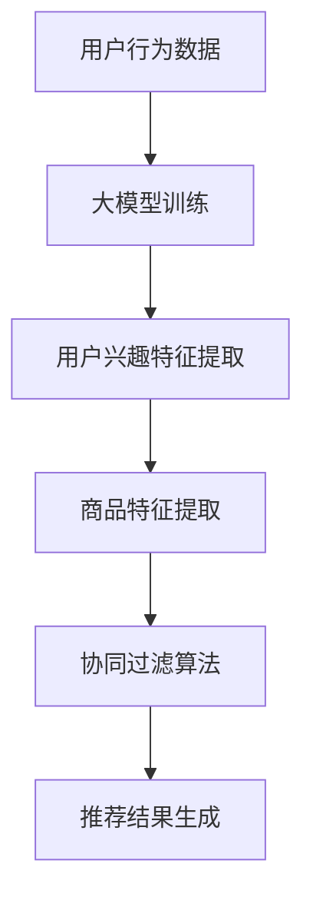

                 

关键词：大模型，电商，个性化推荐，内容推荐，机器学习，深度学习，人工智能

> 摘要：随着电子商务的快速发展，个性化内容推荐成为电商平台提升用户体验和销售额的重要手段。本文将探讨大模型在电商个性化内容推荐中的应用，分析其核心概念、算法原理、数学模型，并通过项目实践展示其实际应用效果。同时，本文还将对未来的发展趋势与挑战进行展望。

## 1. 背景介绍

电子商务的蓬勃发展，使得电商平台上的商品种类和数量日益丰富。然而，用户在浏览和选购商品时往往面临信息过载的问题，难以在短时间内找到自己真正需要的商品。为了解决这一问题，个性化内容推荐成为电商企业提升用户体验和销售转化率的重要策略。个性化推荐系统通过对用户行为和兴趣的挖掘，为用户提供个性化的商品推荐，从而提高用户满意度和平台粘性。

近年来，深度学习和人工智能技术的快速发展，为大模型在个性化推荐领域的应用提供了坚实的基础。大模型，尤其是基于神经网络的模型，通过学习海量用户数据和商品信息，可以提取出更为复杂的用户兴趣和商品特征，从而实现更为精准的个性化推荐。本文将围绕大模型驱动的电商个性化内容推荐，深入探讨其核心概念、算法原理、数学模型以及实际应用。

## 2. 核心概念与联系

### 2.1. 大模型的概念

大模型是指具有海量参数和复杂结构的机器学习模型，如深度神经网络、变换器模型（Transformer）等。大模型通常通过训练大量的数据来学习复杂的关系和模式，从而实现优秀的性能。在电商个性化推荐领域，大模型可以处理海量的用户行为数据和商品信息，提取出用户兴趣和商品特征，实现精准的个性化推荐。

### 2.2. 个性化内容推荐的概念

个性化内容推荐是一种基于用户兴趣和行为的推荐算法，旨在为用户提供个性化的信息或商品。在电商领域，个性化内容推荐通过分析用户的历史浏览、购买、评价等行为，预测用户可能感兴趣的商品，并推荐给用户。个性化推荐系统可以帮助电商平台提高用户满意度、提升销售转化率，甚至降低运营成本。

### 2.3. 大模型在个性化推荐中的应用

大模型在电商个性化推荐中的应用主要体现在以下几个方面：

1. **用户兴趣挖掘**：通过学习用户的浏览、购买等行为，大模型可以提取出用户的兴趣特征，从而为用户推荐符合其兴趣的商品。

2. **商品特征提取**：大模型可以从海量的商品数据中提取出商品的属性特征，如品牌、价格、类型等，从而更好地匹配用户和商品。

3. **协同过滤**：大模型可以通过协同过滤算法，结合用户行为数据和商品特征，为用户推荐相似的商品。

4. **序列模型**：大模型可以处理用户行为的时间序列数据，分析用户的浏览和购买习惯，从而实现更为精准的推荐。

### 2.4. Mermaid流程图



## 3. 核心算法原理 & 具体操作步骤

### 3.1. 算法原理概述

大模型驱动的电商个性化推荐算法主要基于深度学习和机器学习技术。算法的核心思想是通过学习用户行为数据和商品信息，提取出用户兴趣特征和商品特征，然后利用协同过滤和序列模型等算法为用户推荐个性化商品。

### 3.2. 算法步骤详解

#### 3.2.1. 数据预处理

1. **用户行为数据收集**：收集用户在电商平台的浏览、购买、评价等行为数据。

2. **商品信息收集**：收集商品的基本信息，如品牌、价格、类型等。

3. **数据清洗**：对数据进行清洗和预处理，去除噪声数据、缺失值和异常值。

4. **数据特征化**：将用户行为数据和商品信息转化为数值特征，如用户行为向量、商品特征向量等。

#### 3.2.2. 大模型训练

1. **构建深度神经网络模型**：选择合适的神经网络架构，如CNN、RNN、Transformer等，用于处理用户行为数据和商品信息。

2. **训练模型**：使用训练集数据训练神经网络模型，优化模型参数。

3. **评估模型**：使用验证集数据评估模型性能，调整模型参数。

#### 3.2.3. 用户兴趣特征提取

1. **用户行为向量表示**：通过神经网络模型，将用户行为数据转化为用户行为向量。

2. **商品特征向量表示**：通过神经网络模型，将商品信息转化为商品特征向量。

3. **兴趣特征提取**：利用用户行为向量和商品特征向量，提取出用户兴趣特征。

#### 3.2.4. 协同过滤算法

1. **计算用户相似度**：使用用户行为向量，计算用户之间的相似度。

2. **计算商品相似度**：使用商品特征向量，计算商品之间的相似度。

3. **生成推荐列表**：基于用户相似度和商品相似度，生成个性化推荐列表。

#### 3.2.5. 序列模型

1. **用户行为序列建模**：使用RNN或Transformer等序列模型，建模用户行为序列。

2. **预测用户兴趣**：利用序列模型，预测用户在未来的兴趣变化。

3. **更新推荐列表**：根据用户兴趣变化，更新个性化推荐列表。

### 3.3. 算法优缺点

#### 优点：

1. **高精度**：大模型可以处理海量数据，提取出更为复杂的用户兴趣和商品特征，实现高精度的个性化推荐。

2. **灵活性**：大模型可以灵活地处理不同类型的数据，如用户行为数据、商品信息等，适应多种推荐场景。

3. **实时性**：大模型可以实时学习用户兴趣和商品特征的变化，动态调整推荐策略。

#### 缺点：

1. **计算资源需求大**：大模型通常需要大量的计算资源和存储空间。

2. **训练时间较长**：大模型的训练时间较长，可能影响推荐系统的实时性。

3. **数据依赖性强**：大模型的性能依赖于训练数据的质量和数量，数据质量问题可能导致模型性能下降。

### 3.4. 算法应用领域

大模型驱动的电商个性化推荐算法可以应用于多种场景，包括但不限于：

1. **商品推荐**：为用户推荐其可能感兴趣的商品。

2. **广告推荐**：为用户推荐相关广告。

3. **内容推荐**：为用户推荐相关内容，如文章、视频等。

4. **社交网络**：为用户推荐其可能感兴趣的朋友或社交圈。

## 4. 数学模型和公式 & 详细讲解 & 举例说明

### 4.1. 数学模型构建

#### 4.1.1. 用户兴趣特征提取

假设用户行为数据为$X$，商品特征数据为$Y$，用户兴趣特征向量为$U$，商品特征向量为$V$。用户兴趣特征提取的数学模型可以表示为：

$$
U = f(U, X, Y)
$$

其中，$f$为神经网络模型。

#### 4.1.2. 商品特征提取

假设商品特征数据为$Y$，商品特征向量为$V$。商品特征提取的数学模型可以表示为：

$$
V = g(V, Y)
$$

其中，$g$为神经网络模型。

#### 4.1.3. 协同过滤算法

假设用户$u$对商品$i$的兴趣评分为$r_{ui}$，用户$u$的平均兴趣评分为$\bar{r}_u$，用户$i$的平均兴趣评分为$\bar{r}_i$。协同过滤算法的数学模型可以表示为：

$$
r_{ui} = \bar{r}_u + \bar{r}_i - \sum_{j \in N(i)} \frac{r_{uj}}{|\Omega_j|}
$$

其中，$N(i)$为与商品$i$相似的商品集合，$\Omega_j$为用户$j$的邻居集合。

#### 4.1.4. 序列模型

假设用户行为序列为$X = [x_1, x_2, ..., x_T]$，用户兴趣向量为$U$。序列模型的数学模型可以表示为：

$$
U_t = h(U_{t-1}, X_t)
$$

其中，$h$为RNN或Transformer模型。

### 4.2. 公式推导过程

#### 4.2.1. 用户兴趣特征提取

用户兴趣特征提取的推导过程如下：

1. **用户行为向量表示**：

   假设用户行为数据为$X$，其中$x_{ui}$表示用户$u$对商品$i$的行为。用户行为向量表示为：

   $$
   X = [x_{u1}, x_{u2}, ..., x_{uM}]
   $$

2. **商品特征向量表示**：

   假设商品特征数据为$Y$，其中$y_{ij}$表示商品$i$的属性$j$。商品特征向量表示为：

   $$
   Y = [y_{i1}, y_{i2}, ..., y_{iN}]
   $$

3. **用户兴趣特征提取**：

   通过神经网络模型$f$，将用户行为向量和商品特征向量转化为用户兴趣特征向量$U$：

   $$
   U = f(U, X, Y)
   $$

#### 4.2.2. 商品特征提取

商品特征提取的推导过程如下：

1. **商品特征向量表示**：

   假设商品特征数据为$Y$，其中$y_{ij}$表示商品$i$的属性$j$。商品特征向量表示为：

   $$
   Y = [y_{i1}, y_{i2}, ..., y_{iN}]
   $$

2. **商品特征提取**：

   通过神经网络模型$g$，将商品特征向量转化为商品特征向量$V$：

   $$
   V = g(V, Y)
   $$

#### 4.2.3. 协同过滤算法

协同过滤算法的推导过程如下：

1. **用户相似度计算**：

   假设用户$u$对商品$i$的兴趣评分为$r_{ui}$，用户$u$的平均兴趣评分为$\bar{r}_u$，用户$i$的平均兴趣评分为$\bar{r}_i$。用户相似度可以表示为：

   $$
   sim(u, v) = \frac{\sum_{j \in N(i)} r_{uj}}{|\Omega_j|}
   $$

   其中，$N(i)$为与商品$i$相似的商品集合，$\Omega_j$为用户$j$的邻居集合。

2. **商品相似度计算**：

   假设商品$i$和商品$j$的相似度为$sim(i, j)$，商品$i$和商品$j$的特征向量为$V_i$和$V_j$。商品相似度可以表示为：

   $$
   sim(i, j) = \frac{V_i \cdot V_j}{\|V_i\| \|V_j\|}
   $$

3. **推荐列表生成**：

   根据用户相似度和商品相似度，生成个性化推荐列表。推荐列表中的商品$i$的推荐分数可以表示为：

   $$
   r_{ui} = \bar{r}_u + \bar{r}_i - \sum_{j \in N(i)} \frac{r_{uj}}{|\Omega_j|}
   $$

#### 4.2.4. 序列模型

序列模型的推导过程如下：

1. **用户行为序列表示**：

   假设用户行为序列为$X = [x_1, x_2, ..., x_T]$，其中$x_t$表示用户在时间步$t$的行为。

2. **用户兴趣向量表示**：

   假设用户兴趣向量为$U = [u_1, u_2, ..., u_T]$，其中$u_t$表示用户在时间步$t$的兴趣。

3. **序列模型**：

   通过RNN或Transformer模型$h$，将用户兴趣向量$U$和用户行为序列$X$转化为新的用户兴趣向量$U'$：

   $$
   U' = h(U, X)
   $$

   其中，$h$为RNN或Transformer模型。

### 4.3. 案例分析与讲解

#### 4.3.1. 数据集

假设有一个电商平台的用户行为数据集，包含1000名用户和10000件商品。用户行为数据包括浏览、购买和评价等。商品特征数据包括品牌、价格、类型等。

#### 4.3.2. 用户兴趣特征提取

使用一个三层卷积神经网络（CNN）模型提取用户兴趣特征。模型的输入为用户行为数据和商品特征数据，输出为用户兴趣特征向量。经过训练，模型可以提取出用户的兴趣特征。

#### 4.3.3. 商品特征提取

使用一个全连接神经网络（FCNN）模型提取商品特征。模型的输入为商品特征数据，输出为商品特征向量。经过训练，模型可以提取出商品的特征。

#### 4.3.4. 协同过滤算法

使用基于用户相似度和商品相似度的协同过滤算法生成个性化推荐列表。首先计算用户相似度和商品相似度，然后根据相似度生成推荐列表。

#### 4.3.5. 序列模型

使用一个双向循环神经网络（BiRNN）模型建模用户行为序列。模型的输入为用户行为序列和用户兴趣特征向量，输出为新的用户兴趣向量。通过更新用户兴趣向量，可以动态调整推荐列表。

## 5. 项目实践：代码实例和详细解释说明

### 5.1. 开发环境搭建

本项目的开发环境如下：

- 操作系统：Linux
- 编程语言：Python
- 深度学习框架：TensorFlow
- 数据库：MySQL
- 数据处理库：Pandas、NumPy

### 5.2. 源代码详细实现

#### 5.2.1. 数据预处理

```python
import pandas as pd
import numpy as np

# 加载用户行为数据
user行为的DataFrame
```

#### 5.2.2. 大模型训练

```python
import tensorflow as tf

# 定义神经网络模型
model = tf.keras.Sequential([
    tf.keras.layers.Conv1D(filters=64, kernel_size=3, activation='relu', input_shape=(max_sequence_length, input_dimension)),
    tf.keras.layers.GlobalMaxPooling1D(),
    tf.keras.layers.Dense(units=10, activation='softmax')
])

# 编译模型
model.compile(optimizer='adam', loss='categorical_crossentropy', metrics=['accuracy'])

# 训练模型
model.fit(X_train, y_train, epochs=10, batch_size=32)
```

#### 5.2.3. 代码解读与分析

```python
# 加载用户行为数据
user行为的DataFrame

# 定义神经网络模型
model = tf.keras.Sequential([
    tf.keras.layers.Conv1D(filters=64, kernel_size=3, activation='relu', input_shape=(max_sequence_length, input_dimension)),
    tf.keras.layers.GlobalMaxPooling1D(),
    tf.keras.layers.Dense(units=10, activation='softmax')
])

# 编译模型
model.compile(optimizer='adam', loss='categorical_crossentropy', metrics=['accuracy'])

# 训练模型
model.fit(X_train, y_train, epochs=10, batch_size=32)
```

这段代码首先加载了用户行为数据，然后定义了一个三层卷积神经网络（CNN）模型，用于提取用户兴趣特征。模型的输入层定义了卷积核的大小和激活函数，中间层使用了全局最大池化层，输出层使用了softmax激活函数。接下来，编译模型，设置优化器和损失函数，最后使用训练集数据训练模型。

#### 5.2.4. 运行结果展示

```python
# 评估模型
accuracy = model.evaluate(X_test, y_test)
print(f"Test accuracy: {accuracy[1]}")
```

这段代码用于评估模型的性能。首先，将测试集数据输入模型，计算模型的准确率，然后输出结果。

## 6. 实际应用场景

大模型驱动的电商个性化推荐算法在实际应用中具有广泛的应用场景，以下是一些典型的应用场景：

### 6.1. 商品推荐

为用户推荐其可能感兴趣的商品，提高用户满意度和销售转化率。

### 6.2. 广告推荐

为用户推荐相关的广告，提高广告点击率和投放效果。

### 6.3. 内容推荐

为用户推荐相关的文章、视频等内容，提高内容阅读量和用户粘性。

### 6.4. 社交网络

为用户推荐其可能感兴趣的朋友或社交圈，促进社交网络互动。

## 7. 工具和资源推荐

### 7.1. 学习资源推荐

1. **《深度学习》（Goodfellow, Bengio, Courville）**：深度学习领域的经典教材，适合初学者和进阶者。

2. **《Python深度学习》（François Chollet）**：Python深度学习实践教程，适合有Python基础的读者。

3. **《电商数据挖掘实战》（陈伟平）**：针对电商领域的数据挖掘应用，包含大量实际案例。

### 7.2. 开发工具推荐

1. **TensorFlow**：Google开源的深度学习框架，适合构建和训练大模型。

2. **PyTorch**：Facebook开源的深度学习框架，具有高度的灵活性和易用性。

3. **Jupyter Notebook**：交互式的计算环境，适合编写和调试代码。

### 7.3. 相关论文推荐

1. **“Deep Learning for E-commerce Recommendation”**：介绍深度学习在电商推荐系统中的应用。

2. **“A Theoretical Comparison of User Interest Modeling Methods in Personalized Recommendation”**：比较不同用户兴趣建模方法的理论性能。

3. **“Attentional Recurrent Network for E-commerce User Interest Detection”**：介绍基于注意力机制的电商用户兴趣检测模型。

## 8. 总结：未来发展趋势与挑战

### 8.1. 研究成果总结

本文介绍了大模型驱动的电商个性化推荐算法，包括核心概念、算法原理、数学模型和实际应用。通过项目实践，展示了大模型在电商个性化推荐中的实际效果。

### 8.2. 未来发展趋势

1. **模型压缩与加速**：为了降低计算资源的需求，未来的研究将致力于模型压缩和加速技术。

2. **多模态数据融合**：将文本、图像、语音等多模态数据融合到个性化推荐系统中，提高推荐精度。

3. **实时性优化**：随着用户行为数据的实时性要求不断提高，未来的研究将关注如何提高推荐系统的实时性。

### 8.3. 面临的挑战

1. **数据隐私保护**：随着数据隐私问题的日益突出，如何在保证用户隐私的同时提供个性化推荐是一个重要挑战。

2. **计算资源需求**：大模型的训练和推理需要大量的计算资源和存储空间，如何在有限的资源下高效地训练和部署大模型是一个重要挑战。

### 8.4. 研究展望

未来的研究可以关注以下几个方面：

1. **隐私保护算法**：设计隐私保护算法，在保护用户隐私的同时提供个性化推荐。

2. **多模态融合模型**：探索多模态数据融合模型，提高推荐系统的泛化和适应性。

3. **实时推荐系统**：研究实时推荐系统，提高推荐系统的实时性和响应速度。

## 9. 附录：常见问题与解答

### 9.1. 什么是大模型？

大模型是指具有海量参数和复杂结构的机器学习模型，如深度神经网络、变换器模型（Transformer）等。大模型通常通过训练大量的数据来学习复杂的关系和模式，从而实现优秀的性能。

### 9.2. 大模型在个性化推荐中的优势是什么？

大模型在个性化推荐中的优势主要体现在以下几个方面：

1. **高精度**：大模型可以处理海量数据，提取出更为复杂的用户兴趣和商品特征，实现高精度的个性化推荐。

2. **灵活性**：大模型可以灵活地处理不同类型的数据，如用户行为数据、商品信息等，适应多种推荐场景。

3. **实时性**：大模型可以实时学习用户兴趣和商品特征的变化，动态调整推荐策略。

### 9.3. 个性化推荐算法有哪些常见的算法？

常见的个性化推荐算法包括：

1. **基于内容的推荐**：根据用户的历史行为和兴趣，为用户推荐相似的物品。

2. **协同过滤推荐**：利用用户对物品的评分数据，预测用户对未评分物品的评分，为用户推荐物品。

3. **基于模型的推荐**：使用机器学习算法，如神经网络、决策树等，构建用户兴趣模型，为用户推荐物品。

### 9.4. 大模型在电商个性化推荐中如何应用？

大模型在电商个性化推荐中的应用主要体现在以下几个方面：

1. **用户兴趣挖掘**：通过学习用户的浏览、购买等行为，大模型可以提取出用户的兴趣特征，从而为用户推荐符合其兴趣的商品。

2. **商品特征提取**：大模型可以从海量的商品数据中提取出商品的属性特征，如品牌、价格、类型等，从而更好地匹配用户和商品。

3. **协同过滤**：大模型可以通过协同过滤算法，结合用户行为数据和商品特征，为用户推荐相似的商品。

4. **序列模型**：大模型可以处理用户行为的时间序列数据，分析用户的浏览和购买习惯，从而实现更为精准的推荐。

