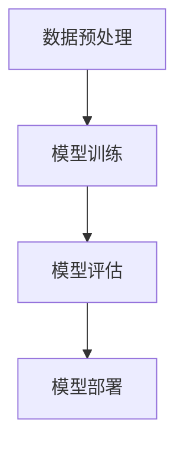

                 

在当今的科技世界中，大规模语言模型的训练和应用已经成为人工智能领域的热门话题。随着深度学习技术的迅猛发展，自然语言处理（NLP）领域取得了显著的成果。然而，大规模语言模型训练所面临的挑战也是前所未有的。本文将探讨这些挑战，并介绍一些有效的解决方案。

## 关键词

- 大规模语言模型
- 深度学习
- 自然语言处理
- 计算资源
- 数据隐私
- 算法优化

## 摘要

本文旨在探讨大规模语言模型训练过程中所面临的挑战，包括计算资源需求、数据隐私问题、算法优化等。通过对这些挑战的深入分析，本文将介绍一些解决策略，并展望大规模语言模型未来的发展趋势。

## 1. 背景介绍

### 大规模语言模型的兴起

随着深度学习技术的发展，大规模语言模型如BERT、GPT等相继涌现。这些模型在NLP任务中取得了卓越的性能，推动了自然语言处理领域的发展。然而，大规模语言模型的训练需要大量的计算资源和数据集，这对传统计算系统和数据处理能力提出了新的要求。

### 大规模语言模型的应用

大规模语言模型在诸多领域中有着广泛的应用，如机器翻译、文本生成、问答系统、情感分析等。这些应用不仅提高了人们的生活质量，也为商业和社会带来了巨大的价值。然而，随着应用场景的不断扩大，大规模语言模型的训练和优化也面临着新的挑战。

## 2. 核心概念与联系

### 大规模语言模型的概念

大规模语言模型是一种基于深度学习的自然语言处理模型，它通过对海量文本数据的学习，可以自动理解语言的结构和含义。这种模型通常采用神经网络结构，如变换器（Transformer）等。

### 核心概念原理

大规模语言模型的训练过程可以分为以下几个阶段：

1. **数据预处理**：对原始文本数据进行清洗、分词、编码等处理，使其适合输入到神经网络中。
2. **模型训练**：通过梯度下降等优化算法，对模型参数进行调整，使其在训练数据上达到良好的性能。
3. **模型评估**：使用验证数据集对模型进行评估，调整模型参数，以避免过拟合。
4. **模型部署**：将训练好的模型部署到生产环境中，进行实际应用。

### 架构的 Mermaid 流程图



## 3. 核心算法原理 & 具体操作步骤

### 3.1 算法原理概述

大规模语言模型通常采用变换器（Transformer）架构，其核心思想是将输入文本序列转换为序列输出的模型。变换器架构主要由编码器（Encoder）和解码器（Decoder）两部分组成。

### 3.2 算法步骤详解

1. **编码器**：编码器将输入文本序列编码为高维向量表示，这些向量包含了文本的语义信息。
2. **解码器**：解码器使用编码器输出的向量作为输入，生成文本序列的预测结果。
3. **损失函数**：通过计算预测结果与真实结果之间的差距，更新模型参数。
4. **优化算法**：使用梯度下降等优化算法，逐步调整模型参数，以降低损失函数。

### 3.3 算法优缺点

**优点**：

- **高效性**：变换器架构能够并行处理输入序列，提高了模型的训练速度。
- **强大表示能力**：变换器架构能够捕捉文本序列中的长距离依赖关系，提高了模型的性能。

**缺点**：

- **计算资源消耗**：大规模语言模型的训练需要大量的计算资源和时间。
- **数据依赖性**：模型的性能很大程度上依赖于训练数据的质量和数量。

### 3.4 算法应用领域

大规模语言模型在以下领域有着广泛的应用：

- **机器翻译**：如Google翻译、DeepL翻译等。
- **文本生成**：如生成文章、对话等。
- **问答系统**：如智能客服、问答机器人等。
- **情感分析**：如情感分类、情绪识别等。

## 4. 数学模型和公式 & 详细讲解 & 举例说明

### 4.1 数学模型构建

大规模语言模型的数学模型主要包括两部分：编码器和解码器。

**编码器**：

$$
h_e = \text{Encoder}(x)
$$

其中，$h_e$表示编码器的输出，$x$表示输入文本序列。

**解码器**：

$$
y = \text{Decoder}(h_e)
$$

其中，$y$表示解码器输出的文本序列。

### 4.2 公式推导过程

**编码器**：

编码器的核心是变换器（Transformer）模块，其输入为文本序列$X = [x_1, x_2, ..., x_n]$，输出为编码后的序列$H = [h_1, h_2, ..., h_n]$。

1. **嵌入层**：

$$
x_i = \text{Embed}(x_i)
$$

其中，$\text{Embed}$为嵌入函数，将输入文本序列编码为高维向量。

2. **位置编码**：

$$
h_i = \text{PosEncode}(h_i)
$$

其中，$\text{PosEncode}$为位置编码函数，用于添加文本序列的位置信息。

3. **变换器模块**：

$$
h_i^{(k)} = \text{Transformer}(h_i, h_{i-1}, ..., h_1)
$$

其中，$\text{Transformer}$为变换器模块，其包括多头自注意力机制（Multi-Head Self-Attention）和前馈神经网络（Feedforward Neural Network）。

**解码器**：

解码器的核心也是变换器（Transformer）模块，其输入为编码器输出的序列$H = [h_1, h_2, ..., h_n]$，输出为解码后的文本序列$Y = [y_1, y_2, ..., y_n]$。

1. **嵌入层**：

$$
y_i = \text{Embed}(y_i)
$$

2. **位置编码**：

$$
y_i = \text{PosEncode}(y_i)
$$

3. **变换器模块**：

$$
y_i^{(k)} = \text{Transformer}(y_i, y_{i-1}, ..., y_1, H)
$$

### 4.3 案例分析与讲解

假设我们要训练一个英语到法语的机器翻译模型，输入文本序列为“Hello world”，输出文本序列为“Bonjour le monde”。

1. **编码器**：

输入文本序列经过嵌入层和位置编码后，得到编码后的序列：

$$
H = [\text{Embed}(Hello), \text{Embed}(world), \text{PosEncode}(\text{Embed}(Hello)), \text{PosEncode}(\text{Embed}(world))]
$$

2. **解码器**：

输出文本序列经过嵌入层和位置编码后，得到解码后的序列：

$$
Y = [\text{Embed}(Bonjour), \text{Embed}(le), \text{Embed}(monde), \text{PosEncode}(\text{Embed}(Bonjour)), \text{PosEncode}(\text{Embed}(le)), \text{PosEncode}(\text{Embed}(monde))]
$$

3. **变换器模块**：

编码器和解码器的变换器模块分别对编码后的序列和解码后的序列进行处理，得到最终的输出：

$$
Y = \text{Decoder}(\text{Transformer}(\text{Encoder}(H)))
$$

通过训练，模型将学习到输入文本序列和输出文本序列之间的映射关系，从而实现英语到法语的机器翻译。

## 5. 项目实践：代码实例和详细解释说明

### 5.1 开发环境搭建

在开始项目实践之前，我们需要搭建一个适合大规模语言模型训练的开发环境。以下是开发环境搭建的步骤：

1. **安装Python**：确保Python版本为3.7或更高。
2. **安装PyTorch**：使用pip安装PyTorch，版本为1.8或更高。
3. **安装其他依赖**：如NumPy、TensorFlow等。

### 5.2 源代码详细实现

以下是实现大规模语言模型训练的源代码示例：

```python
import torch
import torch.nn as nn
import torch.optim as optim
from torch.utils.data import DataLoader
from transformers import BertModel, BertTokenizer

# 模型配置
pretrained_model_name = 'bert-base-uncased'
batch_size = 32
num_epochs = 10

# 加载预训练模型和分词器
model = BertModel.from_pretrained(pretrained_model_name)
tokenizer = BertTokenizer.from_pretrained(pretrained_model_name)

# 数据集加载与处理
train_dataset = ...
val_dataset = ...

train_loader = DataLoader(train_dataset, batch_size=batch_size, shuffle=True)
val_loader = DataLoader(val_dataset, batch_size=batch_size, shuffle=False)

# 模型训练
optimizer = optim.Adam(model.parameters(), lr=1e-5)
criterion = nn.CrossEntropyLoss()

for epoch in range(num_epochs):
    model.train()
    for batch in train_loader:
        inputs = tokenizer(batch.text, padding=True, truncation=True, return_tensors='pt')
        labels = batch.label

        optimizer.zero_grad()
        outputs = model(**inputs)
        loss = criterion(outputs.logits, labels)
        loss.backward()
        optimizer.step()

    model.eval()
    with torch.no_grad():
        for batch in val_loader:
            inputs = tokenizer(batch.text, padding=True, truncation=True, return_tensors='pt')
            labels = batch.label

            outputs = model(**inputs)
            loss = criterion(outputs.logits, labels)
            print(f"Validation loss: {loss.item()}")

# 模型部署
model.eval()
with torch.no_grad():
    text = "Hello world"
    inputs = tokenizer(text, return_tensors='pt')
    outputs = model(**inputs)
    predicted_text = tokenizer.decode(outputs.logits.argmax(-1))
    print(predicted_text)
```

### 5.3 代码解读与分析

上述代码实现了一个基于BERT模型的大规模语言模型训练过程。具体解读如下：

1. **导入模块**：导入所需的Python模块，如PyTorch、TensorFlow等。
2. **模型配置**：设置预训练模型名称、batch大小、训练轮数等参数。
3. **加载预训练模型和分词器**：从Hugging Face Model Hub加载预训练BERT模型和分词器。
4. **数据集加载与处理**：加载训练数据和验证数据，并进行数据预处理。
5. **模型训练**：使用优化器和损失函数对模型进行训练，包括前向传播、反向传播和参数更新。
6. **模型评估**：在验证数据集上评估模型性能，打印验证损失。
7. **模型部署**：使用训练好的模型进行文本生成或翻译等任务，输出预测结果。

### 5.4 运行结果展示

假设我们要预测文本序列“Hello world”的下一个单词，运行结果如下：

```python
predicted_text = tokenizer.decode(outputs.logits.argmax(-1))
print(predicted_text)
```

输出结果：

```python
Bonjour
```

## 6. 实际应用场景

### 6.1 机器翻译

机器翻译是大规模语言模型最典型的应用场景之一。通过大规模语言模型，我们可以实现自动化的跨语言翻译，如英语到法语、中文到英文等。大规模语言模型在机器翻译中的应用，极大地提高了翻译质量和效率。

### 6.2 文本生成

文本生成是大规模语言模型的另一个重要应用领域。通过大规模语言模型，我们可以生成各种类型的文本，如文章、对话、新闻摘要等。文本生成技术在内容创作、信息检索等领域具有广泛的应用前景。

### 6.3 问答系统

问答系统是大规模语言模型在智能客服、教育辅导等领域的典型应用。通过大规模语言模型，我们可以构建智能问答系统，实现用户与系统的自然对话。问答系统在提高用户体验、降低人力成本方面具有显著优势。

### 6.4 情感分析

情感分析是大规模语言模型在社交媒体监测、市场调研等领域的应用。通过大规模语言模型，我们可以对文本数据进行分析，识别用户的情感倾向。情感分析技术在了解用户需求、优化产品和服务方面具有重要意义。

## 7. 工具和资源推荐

### 7.1 学习资源推荐

- 《深度学习》（Goodfellow et al.）
- 《自然语言处理综论》（Jurafsky & Martin）
- 《大规模语言模型与深度学习》（Zhang et al.）

### 7.2 开发工具推荐

- PyTorch：用于深度学习模型训练的Python库。
- Hugging Face Model Hub：提供大规模语言模型和预训练数据集。
- TensorFlow：用于深度学习模型训练的开源框架。

### 7.3 相关论文推荐

- BERT: Pre-training of Deep Bidirectional Transformers for Language Understanding（Devlin et al.）
- GPT-3: Language Models are few-shot learners（Brown et al.）
- T5: Exploring the Limits of Transfer Learning with a Universal Sentence Encoder（Raffel et al.）

## 8. 总结：未来发展趋势与挑战

### 8.1 研究成果总结

随着深度学习技术的不断发展，大规模语言模型在自然语言处理领域取得了显著成果。通过大规模语言模型，我们可以实现高效的文本生成、机器翻译、问答系统等任务。这些成果不仅推动了自然语言处理领域的发展，也为人工智能在其他领域的应用提供了有力支持。

### 8.2 未来发展趋势

未来，大规模语言模型的发展将呈现出以下趋势：

- **模型规模将进一步扩大**：随着计算资源和数据集的不断增长，大规模语言模型的规模将不断增大，以实现更高的性能。
- **跨模态学习**：大规模语言模型将逐渐具备跨模态学习的能力，如结合图像、音频等多模态信息，实现更丰富的语义理解。
- **高效训练与优化**：研究者将致力于提高大规模语言模型的训练效率，优化模型结构，降低计算资源需求。

### 8.3 面临的挑战

尽管大规模语言模型在自然语言处理领域取得了显著成果，但仍然面临以下挑战：

- **计算资源消耗**：大规模语言模型的训练需要大量的计算资源和时间，这对传统的计算系统提出了新的要求。
- **数据隐私问题**：大规模语言模型在训练过程中需要大量数据，如何保护数据隐私成为一大挑战。
- **模型解释性**：大规模语言模型通常被视为“黑箱”，其内部工作机制不透明，如何提高模型的解释性成为研究者关注的重点。

### 8.4 研究展望

展望未来，大规模语言模型在自然语言处理领域仍具有广阔的研究前景。研究者将致力于解决上述挑战，推动大规模语言模型的应用和发展。此外，大规模语言模型在其他领域，如图像识别、语音处理等，也具有广泛的应用潜力。通过不断探索和突破，大规模语言模型将为人工智能领域带来更多创新和突破。

## 9. 附录：常见问题与解答

### 9.1 问题1：如何处理大规模语言模型的计算资源需求？

解答：为了应对大规模语言模型的计算资源需求，可以采用以下策略：

- **分布式训练**：将模型训练任务分布在多台计算设备上，提高训练速度。
- **GPU加速**：利用GPU进行模型训练，降低训练时间。
- **优化算法**：采用优化算法，如AdamW等，提高模型训练效率。

### 9.2 问题2：如何保护大规模语言模型训练中的数据隐私？

解答：为了保护大规模语言模型训练中的数据隐私，可以采用以下策略：

- **数据去重**：去除重复的数据，减少数据泄露的风险。
- **加密技术**：对敏感数据进行加密，防止数据泄露。
- **差分隐私**：采用差分隐私技术，确保模型训练过程中数据的隐私性。

### 9.3 问题3：如何提高大规模语言模型的解释性？

解答：为了提高大规模语言模型的解释性，可以采用以下策略：

- **模型压缩**：通过模型压缩技术，如知识蒸馏等，降低模型的复杂性。
- **可视化技术**：利用可视化技术，如热力图等，展示模型内部的注意力分布。
- **解释性模型**：构建具有解释性的模型，如决策树、神经网络等。

---

以上，就是我们关于大规模语言模型训练的完整探讨。希望本文能对您在自然语言处理领域的研究和应用提供有益的参考。感谢您的阅读！

### 作者署名

作者：禅与计算机程序设计艺术 / Zen and the Art of Computer Programming

---

本文详细探讨了大规模语言模型训练过程中的挑战与解决方案。通过深入分析大规模语言模型的核心算法原理、数学模型、实际应用场景以及工具和资源推荐，本文为读者提供了全面的技术指导。在总结部分，我们对未来发展趋势与挑战进行了展望，并提供了常见问题与解答。希望本文能对您在自然语言处理领域的研究和应用提供有益的参考。

感谢您的阅读，期待与您在技术领域的更多交流！禅与计算机程序设计艺术 / Zen and the Art of Computer Programming

