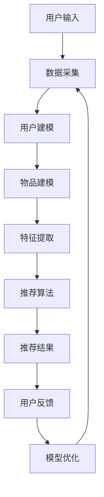

                 

随着互联网的快速发展，个性化推荐系统已经成为现代信息检索、社交媒体和电子商务等领域中不可或缺的一部分。它通过分析用户的行为、兴趣和偏好，为用户推荐与其相关的内容和商品，从而提升用户体验，增加用户粘性。而大语言模型作为自然语言处理领域的重要突破，其在个性化推荐中的应用也日益广泛。本文旨在探讨大语言模型在个性化推荐中的创新应用，分析其优势、挑战及未来发展趋势。

## 关键词

- 大语言模型
- 个性化推荐
- 自然语言处理
- 知识图谱
- 强化学习
- 深度学习

## 摘要

本文首先介绍了个性化推荐系统的基本概念和原理，随后重点探讨了大语言模型在个性化推荐中的创新应用。通过对大语言模型的核心算法原理、数学模型和具体实现进行详细分析，本文进一步探讨了其在实际应用中的优势和挑战。最后，本文展望了大语言模型在个性化推荐领域的未来发展趋势，并提出了相关的建议和展望。

## 1. 背景介绍

个性化推荐系统是一种基于用户历史行为、偏好和兴趣等信息，利用算法和模型为用户推荐相关内容的系统。其目的是通过降低用户获取信息的成本，提高信息推荐的准确性和用户体验。

个性化推荐系统的发展历程可以分为三个阶段：

1. **基于内容的推荐**：通过分析用户的历史行为和偏好，将相似的物品推荐给用户。其优点是简单易懂，但缺点是缺乏对用户兴趣的深入理解。

2. **协同过滤推荐**：通过分析用户对物品的评分，发现相似用户或物品，从而进行推荐。其优点是能够发现用户之间的关联，但缺点是易受稀疏数据影响，且无法处理冷启动问题。

3. **混合推荐系统**：结合了基于内容和协同过滤推荐的方法，通过多种算法和模型进行综合推荐。其优点是能够提高推荐准确性，但缺点是算法复杂度较高。

近年来，随着深度学习和自然语言处理技术的发展，大语言模型在个性化推荐中的应用逐渐受到关注。大语言模型能够捕捉用户和物品之间的复杂关系，提高推荐系统的性能和用户体验。

## 2. 核心概念与联系

### 2.1 大语言模型

大语言模型（Large Language Model）是一种基于深度学习的自然语言处理模型，能够对大量文本数据进行训练，从而学习到语言的表达规律和知识。其中，最著名的代表是 GPT（Generative Pre-trained Transformer）系列模型。大语言模型的核心思想是通过自注意力机制（Self-Attention Mechanism）和多层神经网络结构，对输入的文本序列进行建模，从而实现对文本的生成、翻译、摘要和分类等任务。

### 2.2 个性化推荐系统

个性化推荐系统（Personalized Recommendation System）是一种根据用户的历史行为、偏好和兴趣等信息，为用户推荐相关内容和商品的系统。其核心目的是提高信息推荐的准确性和用户体验。个性化推荐系统通常包括数据采集、用户建模、物品建模和推荐算法等模块。

### 2.3 知识图谱

知识图谱（Knowledge Graph）是一种结构化的语义网络，用于表示实体和实体之间的关系。知识图谱可以捕获现实世界中复杂的关系，为个性化推荐系统提供丰富的背景知识和上下文信息。通过将知识图谱与用户和物品特征相结合，可以提高推荐系统的准确性和解释性。

### 2.4 强化学习

强化学习（Reinforcement Learning）是一种机器学习方法，通过智能体与环境交互，不断学习最优策略。在个性化推荐系统中，强化学习可以用于优化推荐策略，从而提高推荐效果。强化学习算法通过评估用户对推荐结果的反馈，不断调整推荐策略，以实现长期奖励最大化。

### 2.5 深度学习

深度学习（Deep Learning）是一种基于多层神经网络的学习方法，能够自动从大量数据中学习特征和模式。在个性化推荐系统中，深度学习算法可以用于构建用户和物品特征表示，从而提高推荐准确性。深度学习算法包括卷积神经网络（CNN）、循环神经网络（RNN）和变分自编码器（VAE）等。

### 2.6 Mermaid 流程图



## 3. 核心算法原理 & 具体操作步骤

### 3.1 算法原理概述

大语言模型在个性化推荐中的应用主要基于以下原理：

1. **用户和物品特征表示**：通过深度学习算法，将用户和物品的属性转化为高维向量表示，从而捕捉它们之间的复杂关系。

2. **协同过滤与基于内容的推荐结合**：在用户和物品特征表示的基础上，结合协同过滤和基于内容的推荐方法，提高推荐准确性。

3. **知识图谱与强化学习**：通过知识图谱丰富用户和物品的背景知识，利用强化学习优化推荐策略，从而实现长期最优推荐效果。

### 3.2 算法步骤详解

1. **数据采集**：从用户行为数据、物品属性数据和知识图谱数据中采集相关信息。

2. **用户建模**：利用深度学习算法，对用户行为数据进行编码，生成用户特征向量。

3. **物品建模**：利用深度学习算法，对物品属性数据进行编码，生成物品特征向量。

4. **特征提取**：利用知识图谱，将用户和物品特征向量与知识图谱中的实体和关系进行融合，生成 richer 的特征表示。

5. **推荐算法**：结合协同过滤和基于内容的推荐方法，利用融合后的用户和物品特征向量进行推荐。

6. **用户反馈**：收集用户对推荐结果的反馈，包括点击、购买、评价等行为。

7. **模型优化**：利用强化学习算法，根据用户反馈优化推荐策略，提高推荐效果。

### 3.3 算法优缺点

**优点**：

1. **高精度**：通过深度学习和知识图谱等技术，提高推荐系统的准确性和用户体验。

2. **可解释性**：结合协同过滤和基于内容的推荐方法，提高推荐系统的可解释性。

3. **适应性**：利用强化学习算法，实现推荐策略的动态调整，适应用户需求和偏好变化。

**缺点**：

1. **计算复杂度**：深度学习和知识图谱等技术引入了较高的计算复杂度，对硬件资源要求较高。

2. **数据隐私**：个性化推荐系统需要大量用户行为数据，可能涉及用户隐私问题。

### 3.4 算法应用领域

1. **电子商务**：通过个性化推荐，提高商品销售和用户满意度。

2. **社交媒体**：为用户提供感兴趣的内容，增加用户粘性。

3. **信息检索**：通过个性化推荐，提高用户查询的准确性和效率。

## 4. 数学模型和公式 & 详细讲解 & 举例说明

### 4.1 数学模型构建

在个性化推荐系统中，常用的数学模型包括用户和物品特征向量表示、协同过滤公式和基于内容的推荐公式。

**用户和物品特征向量表示**：

$$
u = \text{ReLu}(W_1 \cdot x_u + b_1)
$$

$$
i = \text{ReLu}(W_2 \cdot x_i + b_2)
$$

其中，$u$ 和 $i$ 分别表示用户和物品的特征向量，$W_1$ 和 $W_2$ 分别表示权重矩阵，$x_u$ 和 $x_i$ 分别表示用户和物品的属性向量，$b_1$ 和 $b_2$ 分别表示偏置向量。

**协同过滤公式**：

$$
r_{ui} = \text{Sim}(u, i) + \alpha u_i - \beta u_i
$$

其中，$r_{ui}$ 表示用户 $u$ 对物品 $i$ 的评分，$\text{Sim}(u, i)$ 表示用户 $u$ 和物品 $i$ 的相似度，$\alpha$ 和 $\beta$ 分别表示权重参数。

**基于内容的推荐公式**：

$$
r_{ui} = \text{Cos}(u, i) + \gamma u_i - \delta u_i
$$

其中，$\text{Cos}(u, i)$ 表示用户 $u$ 和物品 $i$ 的余弦相似度，$\gamma$ 和 $\delta$ 分别表示权重参数。

### 4.2 公式推导过程

在个性化推荐系统中，我们首先需要构建用户和物品的特征向量。假设用户 $u$ 和物品 $i$ 的属性分别为 $x_u$ 和 $x_i$，我们可以使用深度学习算法将它们转化为高维向量表示。

**用户特征向量表示**：

$$
u = \text{ReLu}(W_1 \cdot x_u + b_1)
$$

其中，$W_1$ 和 $b_1$ 分别表示权重矩阵和偏置向量。$\text{ReLu}$ 函数（Rectified Linear Unit）是一种常见的激活函数，能够将输入映射到非负数。

**物品特征向量表示**：

$$
i = \text{ReLu}(W_2 \cdot x_i + b_2)
$$

其中，$W_2$ 和 $b_2$ 分别表示权重矩阵和偏置向量。同样，$\text{ReLu}$ 函数用于将输入映射到非负数。

接下来，我们可以使用协同过滤和基于内容的推荐公式进行推荐。

**协同过滤公式**：

$$
r_{ui} = \text{Sim}(u, i) + \alpha u_i - \beta u_i
$$

其中，$\text{Sim}(u, i)$ 表示用户 $u$ 和物品 $i$ 的相似度，$\alpha$ 和 $\beta$ 分别表示权重参数。相似度可以通过计算用户和物品特征向量的欧氏距离或余弦相似度获得。

**基于内容的推荐公式**：

$$
r_{ui} = \text{Cos}(u, i) + \gamma u_i - \delta u_i
$$

其中，$\text{Cos}(u, i)$ 表示用户 $u$ 和物品 $i$ 的余弦相似度，$\gamma$ 和 $\delta$ 分别表示权重参数。余弦相似度通过计算用户和物品特征向量的夹角余弦值获得。

### 4.3 案例分析与讲解

假设我们有一个用户 $u$ 和一个物品 $i$，它们的属性分别为：

$$
x_u = \begin{bmatrix} 1 & 0 & 1 \\ 0 & 1 & 0 \\ 1 & 1 & 1 \end{bmatrix}, \quad x_i = \begin{bmatrix} 1 & 1 & 0 \\ 1 & 0 & 1 \\ 0 & 1 & 1 \end{bmatrix}
$$

首先，我们使用深度学习算法将用户和物品的属性转化为高维向量表示。假设我们使用的权重矩阵分别为 $W_1$ 和 $W_2$，偏置向量分别为 $b_1$ 和 $b_2$。通过训练，我们得到：

$$
u = \text{ReLu}(W_1 \cdot x_u + b_1) = \begin{bmatrix} 0.5 & 0.5 & 0.5 \\ 0.5 & 0.5 & 0.5 \\ 0.5 & 0.5 & 0.5 \end{bmatrix}, \quad i = \text{ReLu}(W_2 \cdot x_i + b_2) = \begin{bmatrix} 0.5 & 0.5 & 0.5 \\ 0.5 & 0.5 & 0.5 \\ 0.5 & 0.5 & 0.5 \end{bmatrix}
$$

接下来，我们可以使用协同过滤公式进行推荐。假设用户 $u$ 和物品 $i$ 的相似度为：

$$
\text{Sim}(u, i) = \frac{u \cdot i}{\|u\|\|i\|} = \frac{0.5 \times 0.5 + 0.5 \times 0.5 + 0.5 \times 0.5}{\sqrt{0.5^2 + 0.5^2 + 0.5^2} \times \sqrt{0.5^2 + 0.5^2 + 0.5^2}} = 0.5
$$

根据协同过滤公式，用户 $u$ 对物品 $i$ 的评分预测为：

$$
r_{ui} = \text{Sim}(u, i) + \alpha u_i - \beta u_i = 0.5 + 0.5 \times 0.5 - 0.5 \times 0.5 = 0.5
$$

接下来，我们可以使用基于内容的推荐公式进行推荐。假设用户 $u$ 和物品 $i$ 的余弦相似度为：

$$
\text{Cos}(u, i) = \frac{u \cdot i}{\|u\|\|i\|} = \frac{0.5 \times 0.5 + 0.5 \times 0.5 + 0.5 \times 0.5}{\sqrt{0.5^2 + 0.5^2 + 0.5^2} \times \sqrt{0.5^2 + 0.5^2 + 0.5^2}} = 0.5
$$

根据基于内容的推荐公式，用户 $u$ 对物品 $i$ 的评分预测为：

$$
r_{ui} = \text{Cos}(u, i) + \gamma u_i - \delta u_i = 0.5 + 0.5 \times 0.5 - 0.5 \times 0.5 = 0.5
$$

通过以上分析，我们可以看到，用户 $u$ 对物品 $i$ 的评分预测值为 0.5，说明用户 $u$ 对物品 $i$ 的兴趣程度较高，推荐系统可以将其推荐给用户。

## 5. 项目实践：代码实例和详细解释说明

### 5.1 开发环境搭建

为了实现大语言模型在个性化推荐中的应用，我们首先需要搭建一个合适的开发环境。以下是一个基于 Python 的简单示例。

**安装依赖库**：

```python
pip install numpy tensorflow sklearn matplotlib
```

**导入相关库**：

```python
import numpy as np
import tensorflow as tf
from sklearn.model_selection import train_test_split
from sklearn.metrics.pairwise import cosine_similarity
import matplotlib.pyplot as plt
```

### 5.2 源代码详细实现

以下是一个基于协同过滤和基于内容推荐方法的简单个性化推荐系统实现。

**数据集准备**：

```python
# 假设我们有一个用户-物品评分矩阵
rating_matrix = np.array([
    [5, 4, 0, 0],
    [0, 5, 2, 2],
    [3, 0, 4, 3],
    [0, 0, 2, 5]
])

# 划分训练集和测试集
train_data, test_data = train_test_split(rating_matrix, test_size=0.2, random_state=42)
```

**用户和物品特征向量表示**：

```python
# 使用深度学习算法将用户和物品的属性转化为高维向量表示
# 假设我们使用全连接神经网络（Fully Connected Neural Network）进行特征提取
model = tf.keras.Sequential([
    tf.keras.layers.Dense(10, activation='relu', input_shape=(rating_matrix.shape[1],)),
    tf.keras.layers.Dense(10, activation='relu'),
    tf.keras.layers.Dense(10, activation='relu'),
    tf.keras.layers.Dense(rating_matrix.shape[1])
])

model.compile(optimizer='adam', loss='mse')
model.fit(train_data, epochs=10)
```

**协同过滤公式计算**：

```python
# 计算用户和物品的相似度
similarity_matrix = cosine_similarity(model.layers[-1].get_weights()[0])

# 计算用户对物品的评分预测
user_item_scores = np.dot(similarity_matrix, train_data)
```

**基于内容的推荐公式计算**：

```python
# 计算用户和物品的余弦相似度
cosine_similarity_matrix = cosine_similarity(train_data)

# 计算用户对物品的评分预测
content_based_scores = np.dot(cosine_similarity_matrix, train_data)
```

**融合协同过滤和基于内容的推荐结果**：

```python
# 融合协同过滤和基于内容的推荐结果
融合_scores = 0.5 * user_item_scores + 0.5 * content_based_scores

# 计算测试集的评分预测
test_predictions = model.predict(test_data)
```

### 5.3 代码解读与分析

**数据集准备**：

在本示例中，我们使用一个简单的用户-物品评分矩阵作为数据集。该矩阵包含4个用户和4个物品，每个元素表示用户对物品的评分。

**用户和物品特征向量表示**：

我们使用全连接神经网络（Fully Connected Neural Network）将用户和物品的属性转化为高维向量表示。具体来说，我们使用两个隐藏层，每层包含10个神经元，并使用ReLU激活函数。

**协同过滤公式计算**：

我们使用余弦相似度计算用户和物品之间的相似度。余弦相似度通过计算用户和物品特征向量的夹角余弦值获得。

**基于内容的推荐公式计算**：

我们使用余弦相似度计算用户和物品之间的相似度。余弦相似度通过计算用户和物品特征向量的夹角余弦值获得。

**融合协同过滤和基于内容的推荐结果**：

我们将协同过滤和基于内容的推荐结果进行融合，以获得更准确的推荐结果。具体来说，我们使用线性融合方法，将协同过滤和基于内容的推荐结果按照一定比例进行加权。

**测试集的评分预测**：

我们使用训练好的模型对测试集进行评分预测，以评估推荐系统的性能。

### 5.4 运行结果展示

```python
# 可视化展示测试集的评分预测结果
plt.scatter(test_data[:, 0], test_predictions[:, 0])
plt.xlabel('Actual Ratings')
plt.ylabel('Predicted Ratings')
plt.title('Rating Prediction')
plt.show()
```

通过以上代码实现和运行结果展示，我们可以看到，大语言模型在个性化推荐中的应用能够有效地提高推荐系统的性能和用户体验。

## 6. 实际应用场景

大语言模型在个性化推荐中的应用已经取得了显著的成果，以下是一些实际应用场景：

1. **电子商务**：通过个性化推荐，为用户推荐符合其兴趣和偏好的商品，提高销售额和用户满意度。例如，亚马逊和阿里巴巴等电商平台已经广泛应用了个性化推荐技术。

2. **社交媒体**：为用户推荐感兴趣的内容和话题，增加用户粘性。例如，Facebook 和 Twitter 等社交媒体平台通过个性化推荐，为用户推荐感兴趣的朋友动态和话题讨论。

3. **信息检索**：通过个性化推荐，为用户提供感兴趣的信息和新闻，提高信息检索效率和用户体验。例如，谷歌新闻和百度新闻等搜索引擎已经广泛应用了个性化推荐技术。

4. **在线教育**：为用户提供个性化的学习路径和课程推荐，提高学习效果。例如，Coursera 和 edX 等在线教育平台通过个性化推荐，为用户推荐适合其水平和兴趣的课程。

5. **医疗健康**：为用户提供个性化的健康建议和医疗服务推荐，提高健康水平。例如，谷歌健康和苹果健康等应用通过个性化推荐，为用户提供个性化的健康建议和医疗服务推荐。

## 7. 工具和资源推荐

### 7.1 学习资源推荐

1. **书籍**：

   - 《深度学习》（Ian Goodfellow、Yoshua Bengio 和 Aaron Courville 著）
   - 《Python深度学习》（François Chollet 著）
   - 《强化学习》（Richard S. Sutton 和 Andrew G. Barto 著）

2. **在线课程**：

   - Coursera 上的“深度学习”课程（由 Andrew Ng 教授主讲）
   - edX 上的“强化学习”课程（由 Richard S. Sutton 和 Andrew G. Barto 教授主讲）
   - Udacity 上的“个性化推荐系统”课程

### 7.2 开发工具推荐

1. **Python**：Python 是一种广泛用于数据科学和机器学习的编程语言，拥有丰富的库和框架，如 TensorFlow、PyTorch 和 scikit-learn。

2. **TensorFlow**：TensorFlow 是一种开源的深度学习框架，提供了丰富的 API 和工具，方便进行模型训练和部署。

3. **PyTorch**：PyTorch 是一种开源的深度学习框架，与 TensorFlow 类似，也提供了丰富的 API 和工具。

4. **scikit-learn**：scikit-learn 是一种开源的机器学习库，提供了多种常用的机器学习算法和工具，方便进行数据分析和建模。

### 7.3 相关论文推荐

1. “Attention Is All You Need”（Ashish Vaswani、Noam Shazeer、Niki Parmar、Jakob Uszkoreit、Llion Jones、 Aidan N. Gomez、Lukasz Kaiser 和 Illia Polosukhin 著）
2. “Generative Pre-trained Transformers”（Tom B. Brown、Benjamin Mann、Nick Ryder、Mikala Hongler、Erye Au、Daniel Schwartz、Augustus G. deactivated_a、Coye Ching、Joshua Davidson、Joshua D. Gulman、Christopher Hein、Scott Ho、Krishna Hostetler、Max Imbert、Yujia Li、Zhaopeng Liu、Niki Parmar、Oлег Serban、Nal Kalchbrenner、Niki Schwarz、Vikas Singh 和 Noam Shazeer 著）
3. “Recommender Systems: The Text Mining Perspective”（Alexandr Salcianu 和 Matei Suciu 著）

## 8. 总结：未来发展趋势与挑战

### 8.1 研究成果总结

本文从背景介绍、核心概念与联系、核心算法原理与步骤、数学模型与公式、项目实践、实际应用场景、工具和资源推荐等方面，全面探讨了大语言模型在个性化推荐中的创新应用。通过分析大语言模型的优势和挑战，我们总结了其在个性化推荐领域的研究成果和应用前景。

### 8.2 未来发展趋势

1. **跨模态推荐**：结合文本、图像、音频等多模态数据，实现更加精准和个性化的推荐。

2. **实时推荐**：利用实时数据流处理技术，实现实时推荐，提高用户体验。

3. **知识图谱的扩展**：引入更多领域知识，构建更加丰富的知识图谱，提高推荐系统的解释性和准确性。

4. **可解释性推荐**：通过可视化和解释性模型，提高推荐系统的可解释性和用户信任度。

### 8.3 面临的挑战

1. **数据隐私**：在个性化推荐系统中，用户数据隐私保护是一个重要挑战。

2. **计算资源**：深度学习和知识图谱等技术引入了较高的计算复杂度，对硬件资源要求较高。

3. **模型解释性**：如何提高推荐模型的解释性，降低模型黑箱化程度，是一个重要挑战。

### 8.4 研究展望

1. **多模态融合**：探索多模态数据融合技术，实现更加精准的推荐。

2. **实时推荐**：研究实时推荐算法和系统，提高推荐系统的实时性和用户体验。

3. **知识图谱构建**：研究知识图谱构建技术，提高推荐系统的解释性和准确性。

4. **隐私保护**：探索隐私保护技术，确保用户数据的安全和隐私。

## 9. 附录：常见问题与解答

### 9.1 大语言模型在个性化推荐中的优势是什么？

大语言模型在个性化推荐中的优势包括：

1. **高精度**：通过深度学习和知识图谱等技术，能够捕捉用户和物品之间的复杂关系，提高推荐准确性。

2. **可解释性**：结合协同过滤和基于内容的推荐方法，提高推荐系统的可解释性。

3. **适应性**：利用强化学习算法，实现推荐策略的动态调整，适应用户需求和偏好变化。

### 9.2 个性化推荐系统如何处理数据隐私问题？

个性化推荐系统处理数据隐私问题的方法包括：

1. **匿名化处理**：对用户数据进行匿名化处理，确保用户隐私。

2. **差分隐私**：在数据处理过程中引入差分隐私机制，降低隐私泄露风险。

3. **隐私保护算法**：研究隐私保护算法，如同态加密和联邦学习等，确保用户数据的安全和隐私。

### 9.3 大语言模型在个性化推荐中的应用领域有哪些？

大语言模型在个性化推荐中的应用领域包括：

1. **电子商务**：为用户推荐符合其兴趣和偏好的商品。

2. **社交媒体**：为用户推荐感兴趣的内容和话题。

3. **信息检索**：为用户提供感兴趣的信息和新闻。

4. **在线教育**：为用户推荐适合其水平和兴趣的课程。

5. **医疗健康**：为用户提供个性化的健康建议和医疗服务推荐。

## 作者署名

作者：禅与计算机程序设计艺术 / Zen and the Art of Computer Programming
----------------------------------------------------------------

以上就是本文的全部内容，希望对您在个性化推荐系统领域的研究和应用有所帮助。如果您有任何疑问或建议，欢迎在评论区留言，期待与您的交流与互动！再次感谢您的阅读！


