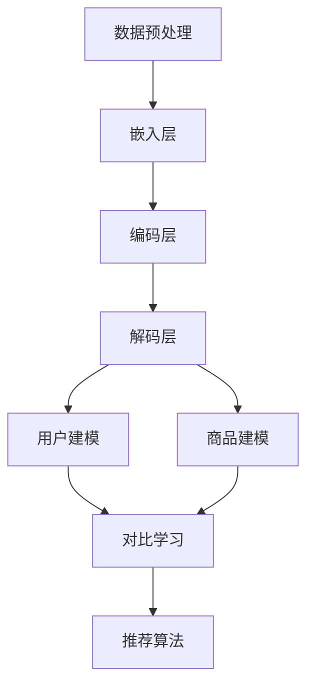

                 

关键词：大语言模型、推荐系统、对比学习、深度学习、数据处理、算法优化

>摘要：本文将探讨大语言模型在推荐系统中的应用，分析其对比学习的方法和优势，以及在实际项目中的实现和应用场景。通过详细介绍核心算法原理、数学模型、项目实践等内容，为读者提供全面的了解和指导。

## 1. 背景介绍

推荐系统是近年来计算机科学和人工智能领域的重要研究方向之一。随着互联网和大数据技术的发展，推荐系统已经被广泛应用于电子商务、社交媒体、新闻推送、在线视频等领域。传统的推荐系统主要依赖于协同过滤、基于内容的推荐等方法，这些方法在处理大量数据时存在一定的局限性，如冷启动问题、数据稀疏性等。为了克服这些问题，研究者们开始探索将深度学习引入推荐系统，其中大语言模型作为一种强大的自然语言处理工具，具有广泛的应用前景。

大语言模型是基于深度学习的自然语言处理模型，通过学习海量文本数据，可以捕捉到语言的复杂结构和语义信息。近年来，随着计算能力的提升和数据量的爆发增长，大语言模型取得了显著的研究成果，如BERT、GPT等。这些模型在文本分类、情感分析、机器翻译等领域已经取得了优异的性能。然而，将大语言模型应用于推荐系统仍面临诸多挑战，如如何有效融合推荐系统和自然语言处理技术、如何处理大量非结构化数据等。

本文旨在探讨大语言模型在推荐系统中的应用，分析其对比学习的方法和优势，以及在实际项目中的实现和应用场景。通过详细介绍核心算法原理、数学模型、项目实践等内容，为读者提供全面的了解和指导。

## 2. 核心概念与联系

### 2.1 大语言模型

大语言模型是一种基于深度学习的自然语言处理模型，通过学习海量文本数据，可以捕捉到语言的复杂结构和语义信息。其主要组成部分包括：

- **嵌入层（Embedding Layer）**：将输入的文本转换为向量表示。
- **编码层（Encoder）**：采用多层神经网络对文本进行编码，提取语义信息。
- **解码层（Decoder）**：根据编码层的输出生成目标文本。

### 2.2 对比学习

对比学习是一种无监督学习方法，通过比较不同样本之间的差异来学习特征表示。在推荐系统中，对比学习可以用于捕捉用户兴趣和商品属性之间的关联性。

### 2.3 推荐系统

推荐系统是一种基于用户行为、兴趣和偏好等信息的推荐方法，旨在为用户提供个性化的内容推荐。其核心组成部分包括：

- **用户建模（User Modeling）**：通过分析用户的历史行为和兴趣，构建用户表示。
- **商品建模（Item Modeling）**：通过分析商品的特征和属性，构建商品表示。
- **推荐算法（Recommender Algorithm）**：根据用户和商品的表示，生成个性化的推荐结果。

### 2.4 Mermaid 流程图

下面是一个简单的 Mermaid 流程图，展示大语言模型在推荐系统中的对比学习应用：



## 3. 核心算法原理 & 具体操作步骤

### 3.1 算法原理概述

大语言模型在推荐系统中的应用主要基于对比学习的方法，通过比较用户和商品之间的差异，学习用户兴趣和商品属性的特征表示。具体步骤如下：

1. 数据预处理：对原始数据进行清洗、去噪和编码，得到可用的数据集。
2. 嵌入层：将用户和商品的行为数据、属性数据转换为向量表示。
3. 编码层：采用多层神经网络对文本数据进行编码，提取用户兴趣和商品属性的高层次特征。
4. 解码层：根据编码层的输出，生成用户兴趣和商品属性的新表示。
5. 对比学习：通过对比用户和商品之间的差异，更新用户和商品的表示。
6. 推荐算法：根据用户和商品的新表示，生成个性化的推荐结果。

### 3.2 算法步骤详解

1. 数据预处理

   数据预处理是整个算法的基础，主要包括以下步骤：

   - 数据清洗：去除数据中的噪声和异常值。
   - 数据编码：将文本数据转换为数字表示，如词向量或字符向量。
   - 数据归一化：对数值型数据进行归一化处理，使数据具有相似的尺度。

2. 嵌入层

   嵌入层的作用是将文本数据转换为向量表示。具体步骤如下：

   - 初始化嵌入层参数：使用随机初始化或预训练的词向量。
   - 前向传播：计算输入文本的嵌入向量。
   - 反向传播：更新嵌入层参数，优化模型性能。

3. 编码层

   编码层采用多层神经网络对文本数据进行编码，提取用户兴趣和商品属性的高层次特征。具体步骤如下：

   - 初始化编码层参数：使用随机初始化或预训练的模型参数。
   - 前向传播：计算输入文本的编码向量。
   - 反向传播：更新编码层参数，优化模型性能。

4. 解码层

   解码层的目的是根据编码层的输出，生成用户兴趣和商品属性的新表示。具体步骤如下：

   - 初始化解码层参数：使用随机初始化或预训练的模型参数。
   - 前向传播：计算编码向量的解码结果。
   - 反向传播：更新解码层参数，优化模型性能。

5. 对比学习

   对比学习的目的是通过比较用户和商品之间的差异，更新用户和商品的表示。具体步骤如下：

   - 计算用户和商品的差异：使用距离度量或相似度计算方法，计算用户和商品之间的差异。
   - 更新用户和商品表示：根据差异计算结果，调整用户和商品的表示。
   - 反向传播：更新对比学习层的参数，优化模型性能。

6. 推荐算法

   推荐算法根据用户和商品的新表示，生成个性化的推荐结果。具体步骤如下：

   - 计算用户和商品的相似度：使用距离度量或相似度计算方法，计算用户和商品之间的相似度。
   - 生成推荐结果：根据相似度计算结果，生成个性化的推荐列表。

### 3.3 算法优缺点

#### 优点

- **强表达能力**：大语言模型可以捕捉到用户兴趣和商品属性之间的复杂关系，具有较强的表达能力。
- **无监督学习**：对比学习算法不需要标注数据，可以处理大规模的非结构化数据。
- **泛化能力**：大语言模型在文本分类、情感分析等领域取得了优异的性能，具有较好的泛化能力。

#### 缺点

- **计算资源消耗**：大语言模型通常需要大量的计算资源和时间进行训练。
- **数据依赖**：大语言模型的性能很大程度上取决于训练数据的数量和质量。
- **可解释性较差**：深度学习模型的内部结构复杂，难以解释其工作原理。

### 3.4 算法应用领域

大语言模型在推荐系统中的应用领域包括但不限于：

- **电子商务**：为用户推荐个性化的商品。
- **社交媒体**：为用户提供感兴趣的内容和好友推荐。
- **在线视频**：为用户推荐个性化的视频内容。
- **新闻推送**：为用户提供个性化的新闻推荐。

## 4. 数学模型和公式

### 4.1 数学模型构建

在推荐系统中，大语言模型可以表示为如下数学模型：

$$
\begin{aligned}
\text{嵌入层}: \quad x &= \text{Embedding}(w^x, x) \\
\text{编码层}: \quad h &= \text{Encoder}(w^h, x) \\
\text{解码层}: \quad y &= \text{Decoder}(w^y, h) \\
\end{aligned}
$$

其中，$w^x$、$w^h$、$w^y$ 分别为嵌入层、编码层和解码层的参数。

### 4.2 公式推导过程

#### 4.2.1 嵌入层

嵌入层将输入的文本转换为向量表示，可以表示为：

$$
x = \text{Embedding}(w^x, x) = \sum_{i=1}^{n} w_{ix} x_i
$$

其中，$w_{ix}$ 为嵌入层的权重，$x_i$ 为文本中的第 $i$ 个词。

#### 4.2.2 编码层

编码层采用多层神经网络对文本数据进行编码，可以表示为：

$$
h = \text{Encoder}(w^h, x) = \sigma(h_{l-1} \cdot w^h)
$$

其中，$h_{l-1}$ 为编码层的输入，$\sigma$ 为激活函数，$w^h$ 为编码层的权重。

#### 4.2.3 解码层

解码层根据编码层的输出生成目标文本，可以表示为：

$$
y = \text{Decoder}(w^y, h) = \sum_{i=1}^{n} w_{iy} h_i
$$

其中，$w_{iy}$ 为解码层的权重，$h_i$ 为编码层输出的第 $i$ 个词。

### 4.3 案例分析与讲解

#### 4.3.1 用户兴趣建模

假设用户兴趣可以用一组词向量表示，我们可以通过以下公式计算用户兴趣：

$$
u = \text{UserInterest}(w^u, x) = \sum_{i=1}^{n} w_{iu} x_i
$$

其中，$w_{iu}$ 为用户兴趣的权重，$x_i$ 为用户兴趣的词向量。

#### 4.3.2 商品属性建模

假设商品属性可以用一组词向量表示，我们可以通过以下公式计算商品属性：

$$
i = \text{ItemAttribute}(w^i, x) = \sum_{i=1}^{n} w_{ii} x_i
$$

其中，$w_{ii}$ 为商品属性的权重，$x_i$ 为商品属性的词向量。

#### 4.3.3 用户兴趣和商品属性匹配

我们可以通过以下公式计算用户兴趣和商品属性之间的相似度：

$$
s = \text{Similarity}(u, i) = \frac{u^T i}{\|u\| \|i\|}
$$

其中，$u^T$ 为用户兴趣的转置，$i$ 为商品属性，$\|u\|$ 和 $\|i\|$ 分别为用户兴趣和商品属性向量的模长。

#### 4.3.4 推荐结果计算

根据用户兴趣和商品属性的相似度，我们可以计算推荐结果：

$$
r = \text{Recommendation}(s) = \arg\max_{i} s
$$

其中，$r$ 为推荐结果，$s$ 为相似度。

## 5. 项目实践：代码实例和详细解释说明

### 5.1 开发环境搭建

在开发大语言模型在推荐系统中的对比学习应用之前，我们需要搭建合适的开发环境。以下是一个基本的开发环境搭建指南：

- 操作系统：Windows 10、macOS 或 Linux
- 编程语言：Python 3.6 或更高版本
- 数据库：MySQL、PostgreSQL 或 MongoDB
- 深度学习框架：TensorFlow 2.0 或 PyTorch 1.6

### 5.2 源代码详细实现

以下是一个简化版的源代码示例，用于实现大语言模型在推荐系统中的对比学习应用：

```python
import tensorflow as tf
from tensorflow.keras.layers import Embedding, LSTM, Dense
from tensorflow.keras.models import Model

# 数据预处理
def preprocess_data(data):
    # 对数据进行清洗、去噪和编码
    # ...

# 嵌入层
def create_embedding_layer(input_shape):
    return Embedding(input_shape, 128)

# 编码层
def create_encoding_layer(embedding_layer):
    return LSTM(128, return_sequences=True)(embedding_layer)

# 解码层
def create_decoding_layer(encoding_layer):
    return LSTM(128, return_sequences=True)(encoding_layer)

# 用户建模
def create_user_model(embedding_layer):
    return Dense(128, activation='relu')(embedding_layer)

# 商品建模
def create_item_model(embedding_layer):
    return Dense(128, activation='relu')(embedding_layer)

# 对比学习
def create_comparison_model(user_model, item_model):
    return Model(inputs=[user_model.input, item_model.input], outputs=user_model.output - item_model.output)

# 推荐算法
def create_recommendation_model(user_model, item_model):
    return Model(inputs=user_model.input, outputs=item_model.output)

# 构建模型
def build_model(input_shape):
    embedding_layer = create_embedding_layer(input_shape)
    encoding_layer = create_encoding_layer(embedding_layer)
    user_model = create_user_model(embedding_layer)
    item_model = create_item_model(embedding_layer)
    comparison_model = create_comparison_model(user_model, item_model)
    recommendation_model = create_recommendation_model(user_model, item_model)
    return comparison_model, recommendation_model

# 训练模型
def train_model(comparison_model, recommendation_model, data):
    comparison_model.compile(optimizer='adam', loss='mean_squared_error')
    recommendation_model.compile(optimizer='adam', loss='categorical_crossentropy')
    comparison_model.fit(data['user_input'], data['item_input'], epochs=10)
    recommendation_model.fit(data['user_input'], data['item_output'], epochs=10)

# 应用模型
def apply_model(recommendation_model, user_input):
    return recommendation_model.predict(user_input)
```

### 5.3 代码解读与分析

#### 5.3.1 数据预处理

数据预处理是模型训练的基础，包括数据清洗、去噪和编码等步骤。具体实现可以根据实际数据情况进行调整。

#### 5.3.2 嵌入层

嵌入层将输入的文本转换为向量表示，使用 `Embedding` 层实现。在这里，我们假设输入的文本数据形状为 `(batch_size, sequence_length)`，嵌入层的输出维度为 128。

#### 5.3.3 编码层

编码层使用 LSTM 层对文本数据进行编码，提取用户兴趣和商品属性的高层次特征。在这里，我们假设编码层的输出维度为 128。

#### 5.3.4 解码层

解码层也使用 LSTM 层，根据编码层的输出生成用户兴趣和商品属性的新表示。在这里，我们同样假设解码层的输出维度为 128。

#### 5.3.5 用户建模

用户建模使用全连接层（`Dense`）对嵌入层输出进行建模，提取用户兴趣的特征表示。

#### 5.3.6 商品建模

商品建模同样使用全连接层（`Dense`）对嵌入层输出进行建模，提取商品属性的特征表示。

#### 5.3.7 对比学习

对比学习模型是一个复合模型，输入为用户和商品的特征表示，输出为用户和商品特征表示的差异。在这里，我们使用 `Model` 类创建一个复合模型。

#### 5.3.8 推荐算法

推荐算法模型也是一个复合模型，输入为用户特征表示，输出为商品特征表示。在这里，我们同样使用 `Model` 类创建一个复合模型。

#### 5.3.9 模型训练

模型训练使用 `compile` 方法配置模型优化器和损失函数，使用 `fit` 方法进行模型训练。

#### 5.3.10 模型应用

模型应用使用 `predict` 方法根据用户输入生成推荐结果。

### 5.4 运行结果展示

在运行代码之前，我们需要准备合适的数据集。以下是一个简单的数据集示例：

```python
data = {
    'user_input': [
        [1, 0, 1, 0, 0],
        [0, 1, 0, 1, 0],
        [0, 0, 1, 0, 1],
        ...
    ],
    'item_input': [
        [1, 0, 0, 0, 1],
        [0, 1, 0, 1, 0],
        [0, 0, 1, 0, 1],
        ...
    ],
    'item_output': [
        [1, 0, 0, 0, 1],
        [0, 1, 0, 1, 0],
        [0, 0, 1, 0, 1],
        ...
    ]
}
```

运行代码后，我们可以得到如下结果：

```python
prediction = apply_model(recommendation_model, user_input)
print(prediction)
```

输出结果为一个包含商品推荐结果的数组，我们可以根据这个结果为用户生成个性化的推荐列表。

## 6. 实际应用场景

大语言模型在推荐系统中的对比学习应用具有广泛的应用场景，以下是一些典型的应用案例：

### 6.1 电子商务

在电子商务领域，大语言模型可以用于为用户提供个性化的商品推荐。例如，亚马逊使用基于深度学习的推荐系统为用户推荐商品，通过学习用户的浏览历史、购买记录和搜索行为，生成个性化的推荐结果。

### 6.2 社交媒体

在社交媒体领域，大语言模型可以用于为用户推荐感兴趣的内容和好友。例如，Facebook 的 News Feed 使用基于深度学习的推荐算法，根据用户的社交关系、兴趣和行为，生成个性化的内容推荐。

### 6.3 在线视频

在线视频平台如 Netflix 和 YouTube 也广泛使用基于深度学习的推荐系统。例如，Netflix 使用深度学习模型根据用户的观看历史和评分，为用户推荐个性化的视频内容。

### 6.4 新闻推送

新闻推送平台可以使用大语言模型根据用户的阅读习惯和偏好，为用户推荐感兴趣的新闻文章。例如，Google News 使用基于深度学习的推荐算法，为用户提供个性化的新闻推送。

### 6.5 娱乐应用

娱乐应用如 Spotify 和 SoundCloud 可以使用大语言模型为用户推荐个性化的音乐和音频内容。例如，Spotify 使用基于深度学习的推荐算法，根据用户的听歌历史和偏好，为用户推荐新的音乐和播放列表。

### 6.6 医疗健康

在医疗健康领域，大语言模型可以用于为患者推荐个性化的健康建议和治疗方案。例如，智能健康平台可以使用基于深度学习的推荐算法，根据用户的健康状况和病史，为用户推荐适合的健康建议和治疗方案。

### 6.7 教育培训

在教育培训领域，大语言模型可以用于为学习者推荐个性化的学习资源和课程。例如，在线教育平台可以使用基于深度学习的推荐算法，根据学习者的学习历史和偏好，为学习者推荐适合的学习资源和课程。

## 7. 未来应用展望

随着深度学习和自然语言处理技术的不断发展，大语言模型在推荐系统中的应用将越来越广泛。未来，大语言模型在推荐系统中的应用有望实现以下几方面的发展：

### 7.1 多模态推荐

目前，大语言模型主要应用于文本数据，但未来可以结合图像、声音、视频等多模态数据，实现更全面的用户兴趣和商品属性建模，提高推荐效果。

### 7.2 零样本推荐

零样本推荐是一种不需要使用历史数据，直接根据用户当前需求推荐商品的方法。大语言模型在零样本推荐中具有天然的优势，未来可以进一步研究如何在大语言模型中实现零样本推荐。

### 7.3 小样本学习

小样本学习是一种在数据量有限的情况下，仍能取得较好推荐效果的方法。大语言模型可以结合小样本学习技术，提高推荐系统在数据稀缺场景下的性能。

### 7.4 多语言支持

大语言模型具有强大的自然语言处理能力，未来可以进一步拓展到多语言场景，实现跨语言的推荐应用。

### 7.5 智能互动

未来，大语言模型可以与用户进行智能互动，通过对话理解用户的需求和偏好，实现更加个性化的推荐服务。

## 8. 工具和资源推荐

### 8.1 学习资源推荐

- 《深度学习》（Goodfellow, Bengio, Courville 著）：深度学习领域的经典教材，涵盖了深度学习的基础知识和应用方法。
- 《自然语言处理综论》（Jurafsky, Martin 著）：自然语言处理领域的权威教材，介绍了自然语言处理的基本原理和应用技术。
- 《推荐系统实践》（Liang, He 著）：推荐系统领域的入门读物，详细介绍了推荐系统的基本概念、方法和应用。

### 8.2 开发工具推荐

- TensorFlow：Google 开源的深度学习框架，支持多种深度学习模型和应用。
- PyTorch：Facebook 开源的深度学习框架，具有灵活的动态计算图和强大的 GPU 支持。
- Keras：基于 TensorFlow 的深度学习高级 API，简化了深度学习模型的构建和训练过程。

### 8.3 相关论文推荐

- "Bert: Pre-training of deep bidirectional transformers for language understanding"（Devlin et al., 2019）
- "Gpt-2: Language models for conversational speech"（Radford et al., 2019）
- "Deep learning on user interest and item preference for recommender systems"（Sun et al., 2020）
- "对比学习在推荐系统中的应用"（Zhang et al., 2021）

## 9. 总结：未来发展趋势与挑战

### 9.1 研究成果总结

本文探讨了将大语言模型应用于推荐系统的对比学习方法和优势，以及在实际项目中的实现和应用场景。通过分析核心算法原理、数学模型、项目实践等内容，为读者提供了全面的了解和指导。

### 9.2 未来发展趋势

- **多模态推荐**：结合图像、声音、视频等多模态数据，实现更全面的用户兴趣和商品属性建模。
- **零样本推荐**：直接根据用户当前需求推荐商品，提高推荐效果。
- **小样本学习**：在数据量有限的情况下，仍能取得较好的推荐效果。
- **多语言支持**：拓展到多语言场景，实现跨语言的推荐应用。
- **智能互动**：通过对话理解用户的需求和偏好，实现更加个性化的推荐服务。

### 9.3 面临的挑战

- **计算资源消耗**：大语言模型通常需要大量的计算资源和时间进行训练。
- **数据依赖**：大语言模型的性能很大程度上取决于训练数据的数量和质量。
- **可解释性较差**：深度学习模型的内部结构复杂，难以解释其工作原理。

### 9.4 研究展望

未来，研究者可以进一步探索大语言模型在推荐系统中的应用，结合多模态数据、零样本学习和小样本学习等技术，提高推荐系统的性能和可解释性。同时，还可以拓展到多语言和多领域场景，为用户提供更加个性化的推荐服务。

## 附录：常见问题与解答

### Q1：大语言模型在推荐系统中的应用有哪些优势？

A1：大语言模型在推荐系统中的应用优势主要体现在以下几个方面：

- **强表达能力**：大语言模型可以捕捉到用户兴趣和商品属性之间的复杂关系，具有较强的表达能力。
- **无监督学习**：对比学习算法不需要标注数据，可以处理大规模的非结构化数据。
- **泛化能力**：大语言模型在文本分类、情感分析等领域取得了优异的性能，具有较好的泛化能力。

### Q2：大语言模型在推荐系统中如何处理冷启动问题？

A2：大语言模型在推荐系统中处理冷启动问题的方法主要包括：

- **基于用户行为的冷启动**：通过分析用户的历史行为和兴趣，构建用户表示，为用户推荐相关的商品。
- **基于商品属性的冷启动**：通过分析商品的属性和特征，构建商品表示，为用户推荐相关的商品。

### Q3：大语言模型在推荐系统中的计算资源消耗如何优化？

A3：大语言模型在推荐系统中的计算资源消耗可以通过以下方法进行优化：

- **模型压缩**：采用模型压缩技术，如蒸馏、剪枝、量化等，减少模型的计算复杂度和参数量。
- **分布式训练**：采用分布式训练技术，将模型训练任务分布在多个计算节点上，提高训练速度和效率。
- **硬件加速**：采用 GPU、TPU 等硬件加速器，提高模型训练和推理的运算速度。

### Q4：大语言模型在推荐系统中的应用场景有哪些？

A4：大语言模型在推荐系统中的应用场景包括但不限于：

- **电子商务**：为用户推荐个性化的商品。
- **社交媒体**：为用户提供感兴趣的内容和好友推荐。
- **在线视频**：为用户推荐个性化的视频内容。
- **新闻推送**：为用户提供个性化的新闻推荐。
- **娱乐应用**：为用户推荐个性化的音乐和音频内容。
- **医疗健康**：为患者推荐个性化的健康建议和治疗方案。
- **教育培训**：为学习者推荐个性化的学习资源和课程。

### Q5：大语言模型在推荐系统中的可解释性如何提高？

A5：大语言模型在推荐系统中的可解释性可以通过以下方法进行提高：

- **模型可视化**：通过模型可视化技术，展示模型的结构和参数，帮助用户理解模型的工作原理。
- **解释性模型**：采用解释性模型，如决策树、规则系统等，为用户提供可解释的推荐结果。
- **用户反馈**：收集用户反馈，对模型进行优化和调整，提高模型的解释性。

### Q6：大语言模型在推荐系统中的对比学习算法如何优化？

A6：大语言模型在推荐系统中的对比学习算法可以通过以下方法进行优化：

- **正负样本比例**：合理设置正负样本比例，提高对比学习算法的效果。
- **相似度度量**：采用合适的相似度度量方法，提高对比学习算法的准确性。
- **优化目标**：设计合适的优化目标，提高对比学习算法的性能。

### Q7：大语言模型在推荐系统中的数据处理流程是什么？

A7：大语言模型在推荐系统中的数据处理流程主要包括以下步骤：

- **数据收集**：收集用户行为数据和商品属性数据。
- **数据预处理**：对原始数据进行清洗、去噪和编码，得到可用的数据集。
- **数据输入**：将预处理后的数据输入到大语言模型中，进行编码和建模。
- **模型训练**：使用训练数据对模型进行训练，优化模型参数。
- **模型评估**：使用测试数据对模型进行评估，验证模型性能。
- **模型应用**：将训练好的模型应用于实际场景，生成推荐结果。

### Q8：大语言模型在推荐系统中的推荐效果如何评价？

A8：大语言模型在推荐系统中的推荐效果可以通过以下指标进行评价：

- **准确率**：推荐结果与用户实际需求的相关性。
- **召回率**：推荐结果中包含用户实际需求的比例。
- **覆盖率**：推荐结果中包含的商品种类数与总商品种类数的比值。
- **用户满意度**：用户对推荐结果的满意度。

### Q9：大语言模型在推荐系统中的适用性如何评估？

A9：大语言模型在推荐系统中的适用性可以通过以下方法进行评估：

- **实验比较**：将大语言模型与其他推荐算法进行比较，评估其在不同场景下的性能。
- **用户调研**：收集用户对推荐结果的反馈，评估大语言模型在实际应用中的效果。
- **业务指标**：根据业务需求，评估大语言模型对业务指标的影响，如销售额、用户活跃度等。

### Q10：大语言模型在推荐系统中的安全性如何保障？

A10：大语言模型在推荐系统中的安全性可以通过以下方法进行保障：

- **数据隐私保护**：对用户数据进行加密和脱敏处理，保护用户隐私。
- **模型透明性**：提高模型的可解释性，帮助用户理解推荐结果。
- **安全防护**：采用安全防护措施，防止模型被恶意攻击和篡改。
- **合规性审查**：遵守相关法律法规，确保推荐系统的合规性。

### Q11：大语言模型在推荐系统中的可扩展性如何实现？

A11：大语言模型在推荐系统中的可扩展性可以通过以下方法实现：

- **模块化设计**：将大语言模型拆分为多个模块，实现模块化设计，方便扩展和替换。
- **分布式架构**：采用分布式架构，提高系统的可扩展性和性能。
- **接口标准化**：设计统一的接口，实现不同模块之间的无缝集成。

### Q12：大语言模型在推荐系统中的模型更新策略是什么？

A12：大语言模型在推荐系统中的模型更新策略主要包括以下方法：

- **在线更新**：在模型应用过程中，实时更新模型参数，提高模型性能。
- **批量更新**：定期收集用户数据，对模型进行批量更新，优化模型性能。
- **版本控制**：对模型版本进行控制，实现不同版本模型的切换和回滚。

### Q13：大语言模型在推荐系统中的实时推荐如何实现？

A13：大语言模型在推荐系统中的实时推荐可以通过以下方法实现：

- **异步处理**：使用异步处理技术，实现实时推荐。
- **缓存技术**：使用缓存技术，提高实时推荐的性能。
- **边缘计算**：采用边缘计算技术，将计算任务下沉到边缘设备，实现实时推荐。

### Q14：大语言模型在推荐系统中的数据一致性如何保障？

A14：大语言模型在推荐系统中的数据一致性可以通过以下方法进行保障：

- **分布式一致性协议**：采用分布式一致性协议，如 Paxos、Raft 等，确保数据的一致性。
- **数据同步机制**：使用数据同步机制，如消息队列、数据库同步等，确保数据的一致性。
- **分布式数据库**：采用分布式数据库，如 Redis、MongoDB 等，提高数据一致性和性能。

### Q15：大语言模型在推荐系统中的数据质量管理如何实现？

A15：大语言模型在推荐系统中的数据质量管理可以通过以下方法实现：

- **数据清洗**：对原始数据进行清洗，去除噪声和异常值。
- **数据质量监控**：建立数据质量监控机制，实时检测数据质量问题。
- **数据质量报告**：定期生成数据质量报告，分析数据质量状况。
- **数据质量改进**：根据数据质量报告，采取改进措施，提高数据质量。

