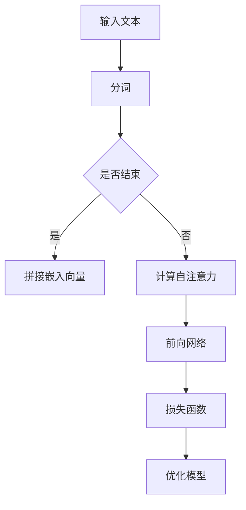
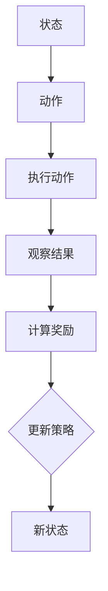
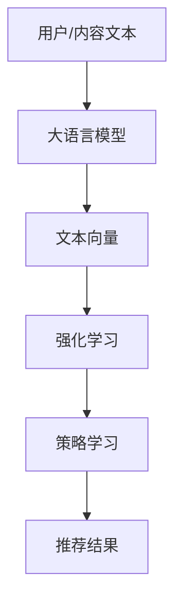

                 

关键词：大语言模型、推荐系统、强化学习、算法原理、数学模型、项目实践、实际应用场景、未来展望

> 摘要：本文旨在探讨大语言模型在推荐系统中的应用，特别是在强化学习框架下的实现与优化。我们将深入分析大语言模型的工作原理，阐述其在推荐系统中的优势，并详细介绍强化学习在推荐系统中的角色与实现。通过具体的数学模型和案例实践，我们将展示如何利用大语言模型提升推荐系统的效果，并探讨其在未来应用中的前景。

## 1. 背景介绍

随着互联网的迅速发展和信息量的爆炸式增长，推荐系统已成为现代信息检索领域的重要工具。推荐系统通过分析用户的行为和偏好，为用户个性化地推荐感兴趣的内容，从而提高用户体验和满意度。传统的推荐系统主要依赖于基于内容的过滤和协同过滤算法，但它们往往存在数据稀疏性和冷启动问题。

近年来，深度学习和自然语言处理技术的快速发展为推荐系统带来了新的机遇。大语言模型（如BERT、GPT等）凭借其强大的表征能力和生成能力，在文本理解和生成方面取得了显著的成果。这些模型不仅可以处理复杂的语言结构，还能捕捉到语义和上下文的细微差异。因此，将大语言模型引入推荐系统，有望解决传统方法面临的问题，提高推荐系统的准确性和灵活性。

强化学习作为一种解决序列决策问题的算法，其在推荐系统中的应用也越来越受到关注。强化学习通过学习在动态环境中进行决策的最佳策略，能够更好地适应用户的动态行为和偏好变化。大语言模型在强化学习中的作用是将用户和内容的表征转化为连续的、高维的特征空间，从而为强化学习提供更丰富的输入信息，提高推荐系统的效果。

本文将首先介绍大语言模型的基本概念和工作原理，然后讨论强化学习在推荐系统中的应用，并详细阐述其数学模型和算法步骤。接着，我们将通过一个实际案例来展示如何实现大语言模型在强化学习推荐系统中的具体应用。最后，本文将探讨大语言模型在推荐系统中的未来应用前景和面临的挑战。

## 2. 核心概念与联系

### 2.1 大语言模型的工作原理

大语言模型（Large Language Models）是一类能够对自然语言进行建模的深度神经网络模型，它们通过学习大量文本数据，能够生成连贯、语义丰富的文本。大语言模型的核心是自注意力机制（Self-Attention Mechanism），这种机制能够使模型在处理每个词时，动态地计算这个词与其他词之间的关系，从而捕捉到上下文信息。

**Mermaid 流程图：**



- **分词（Tokenization）**：将输入的文本分割成一系列的词或子词（Token）。
- **嵌入向量（Embedding）**：将每个词映射为高维的向量表示。
- **自注意力（Self-Attention）**：计算每个词与其他词之间的关系，并加权聚合。
- **前向网络（Forward Network）**：对加权聚合的向量进行多层感知机（MLP）处理。
- **损失函数（Loss Function）**：衡量模型输出的预测与实际标签之间的差距。
- **优化模型（Model Optimization）**：通过梯度下降等优化算法调整模型参数。

### 2.2 强化学习的基本概念

强化学习（Reinforcement Learning）是一种通过不断与环境互动来学习最优策略的机器学习范式。在强化学习框架下，智能体（Agent）通过选择动作（Action）来获得奖励（Reward），并通过学习最大化累积奖励。强化学习的关键组件包括：

- **状态（State）**：智能体当前所处的环境状态。
- **动作（Action）**：智能体可以采取的动作。
- **奖励（Reward）**：动作执行后获得的即时奖励。
- **策略（Policy）**：决定智能体采取何种动作的函数。

**Mermaid 流程图：**



### 2.3 大语言模型与强化学习的结合

大语言模型与强化学习在推荐系统中的应用可以理解为以下三个层次的结合：

1. **文本表征**：大语言模型可以将用户和内容的高维表征转化为连续的、语义丰富的向量表示，这些向量可以作为强化学习的输入状态。
2. **策略学习**：强化学习通过学习在动态环境中进行决策的最佳策略，可以优化推荐系统的效果。
3. **奖励设计**：大语言模型可以辅助设计更精细、个性化的奖励函数，从而提高推荐系统的适应性和用户满意度。

**Mermaid 流程图：**



## 3. 核心算法原理 & 具体操作步骤

### 3.1 算法原理概述

大语言模型与强化学习在推荐系统中的核心算法原理可以概括为以下步骤：

1. **文本预处理**：对用户和内容文本进行分词、去停用词等预处理操作。
2. **向量表示**：利用大语言模型对预处理后的文本进行编码，生成高维的语义向量。
3. **状态表示**：将用户和内容的语义向量作为强化学习的状态输入。
4. **策略学习**：通过强化学习算法学习最优的策略函数，选择能够最大化长期奖励的动作。
5. **推荐生成**：根据学习到的策略函数，生成个性化的推荐结果。

### 3.2 算法步骤详解

1. **文本预处理**：

   ```python
   # 假设已加载大语言模型
   tokenizer = transformers.BertTokenizer.from_pretrained('bert-base-uncased')
   
   # 输入文本
   user_text = "I like to read books and watch movies."
   item_text = "This book is about space exploration and has great visual effects."
   
   # 分词和嵌入
   user_input_ids = tokenizer.encode(user_text, add_special_tokens=True)
   item_input_ids = tokenizer.encode(item_text, add_special_tokens=True)
   ```

2. **向量表示**：

   ```python
   # 加载预训练的大语言模型
   model = transformers.BertModel.from_pretrained('bert-base-uncased')
   
   # 获取文本向量
   with torch.no_grad():
       user_output = model(torch.tensor([user_input_ids]))
       item_output = model(torch.tensor([item_input_ids]))
   
   # 获取句向量
   user_embedding = user_output.last_hidden_state[:, 0, :]
   item_embedding = item_output.last_hidden_state[:, 0, :]
   ```

3. **状态表示**：

   ```python
   # 状态表示为用户和内容向量的组合
   state = torch.cat([user_embedding, item_embedding], dim=1)
   ```

4. **策略学习**：

   ```python
   # 强化学习模型
   class RLModel(nn.Module):
       def __init__(self, state_size, action_size):
           super(RLModel, self).__init__()
           self.fc1 = nn.Linear(state_size, 128)
           self.fc2 = nn.Linear(128, action_size)
       
       def forward(self, state):
           x = F.relu(self.fc1(state))
           return self.fc2(x)
   
   # 实例化模型和优化器
   model = RLModel(state_size, action_size)
   optimizer = torch.optim.Adam(model.parameters(), lr=0.001)
   ```

5. **推荐生成**：

   ```python
   # 选择动作
   state_tensor = torch.tensor(state, dtype=torch.float32).unsqueeze(0)
   action_scores = model(state_tensor)
   action = torch.argmax(action_scores).item()
   
   # 生成推荐结果
   if action == 1:
       recommendation = "推荐这本书"
   else:
       recommendation = "不推荐这本书"
   
   print(recommendation)
   ```

### 3.3 算法优缺点

**优点**：

1. **强大的表征能力**：大语言模型能够生成高维、语义丰富的向量表示，从而提高推荐系统的准确性和个性性。
2. **自适应性强**：强化学习能够根据用户的实时反馈动态调整推荐策略，提高用户的满意度。
3. **解决数据稀疏性问题**：大语言模型通过生成高质量的文本表征，可以有效缓解数据稀疏性问题。

**缺点**：

1. **计算资源消耗大**：大语言模型和强化学习算法的计算复杂度高，对计算资源的需求较大。
2. **模型解释性差**：强化学习模型和基于深度学习的推荐系统往往缺乏良好的解释性，难以直观地理解模型的工作原理。

### 3.4 算法应用领域

大语言模型在推荐系统中的应用广泛，主要包括：

1. **内容推荐**：如图书、影视、音乐等内容的个性化推荐。
2. **商品推荐**：如电商平台的商品推荐。
3. **社交媒体**：如微博、知乎等社交平台的个性化内容推荐。

## 4. 数学模型和公式 & 详细讲解 & 举例说明

### 4.1 数学模型构建

在强化学习框架下，大语言模型用于推荐系统的数学模型主要包括以下部分：

1. **状态空间（S）**：用户和内容的语义向量表示。
2. **动作空间（A）**：推荐系统中的动作，如推荐或不推荐。
3. **奖励函数（R）**：根据用户的反馈动态调整的奖励函数。
4. **策略（π）**：确定在特定状态下采取哪个动作的函数。

**数学公式：**

$$
\pi(\text{a}|\text{s}) = P(\text{a}|\text{s}; \theta)
$$

其中，$\pi(\text{a}|\text{s})$ 表示在状态 $\text{s}$ 下采取动作 $\text{a}$ 的概率，$\theta$ 表示模型参数。

### 4.2 公式推导过程

在强化学习框架下，大语言模型用于推荐系统的核心目标是最大化长期奖励。以下是奖励函数的推导过程：

1. **初始设定**：

   - 状态：$s_t = [x_t, y_t]$，其中 $x_t$ 表示用户向量，$y_t$ 表示内容向量。
   - 动作：$a_t \in A$，表示推荐或不推荐。
   - 奖励：$r_t = \sum_{i=1}^{n} r_i$，其中 $r_i$ 表示每次互动的即时奖励。

2. **奖励函数构建**：

   - 用户点击：$r_{\text{click}} = 1$，否则 $r_{\text{click}} = 0$。
   - 用户购买：$r_{\text{purchase}} = 1$，否则 $r_{\text{purchase}} = 0$。
   - 奖励函数：$r_t = r_{\text{click}} + r_{\text{purchase}}$。

3. **策略优化**：

   - 初始策略：$\pi(a_t | s_t) = P(a_t | s_t; \theta)$。
   - 更新策略：通过梯度下降优化策略参数 $\theta$，使得 $\pi(a_t | s_t)$ 能够最大化长期奖励。

### 4.3 案例分析与讲解

假设我们有一个电商平台的推荐系统，用户在浏览商品时，系统根据用户的历史行为和当前商品的特征生成推荐列表。以下是具体的案例分析：

1. **状态表示**：

   - 用户向量：$x_t = [u_1, u_2, \ldots, u_n]$，表示用户对商品的评分、购买历史等信息。
   - 内容向量：$y_t = [i_1, i_2, \ldots, i_n]$，表示商品的特征信息，如价格、品牌等。

2. **动作表示**：

   - 动作空间：$A = \{0, 1\}$，0 表示不推荐，1 表示推荐。

3. **奖励函数**：

   - 点击奖励：$r_{\text{click}} = 0.5$。
   - 购买奖励：$r_{\text{purchase}} = 1.5$。
   - 奖励函数：$r_t = r_{\text{click}} + r_{\text{purchase}}$。

4. **策略优化**：

   - 初始策略：使用大语言模型生成用户和商品向量的组合状态，然后根据状态选择动作。
   - 更新策略：通过梯度下降优化策略参数，使得推荐的准确性和用户满意度最大化。

### 4.4 数学公式应用示例

假设有一个用户浏览了一款手机，系统根据用户的历史行为和手机的特征生成推荐列表。以下是具体的数学公式应用示例：

1. **状态表示**：

   - 用户向量：$x_t = [0.1, 0.3, 0.5]$，表示用户对其他手机的评分、购买历史等信息。
   - 内容向量：$y_t = [0.2, 0.4, 0.6]$，表示手机的价格、品牌、功能等信息。

2. **动作表示**：

   - 动作空间：$A = \{0, 1\}$，0 表示不推荐，1 表示推荐。

3. **奖励函数**：

   - 点击奖励：$r_{\text{click}} = 0.5$。
   - 购买奖励：$r_{\text{purchase}} = 1.5$。
   - 奖励函数：$r_t = r_{\text{click}} + r_{\text{purchase}}$。

4. **策略优化**：

   - 初始策略：使用大语言模型生成用户和手机向量的组合状态，然后根据状态选择动作。
   - 更新策略：通过梯度下降优化策略参数，使得推荐的准确性和用户满意度最大化。

```python
# 假设已加载大语言模型和强化学习模型
user_embedding = torch.tensor([0.1, 0.3, 0.5])
item_embedding = torch.tensor([0.2, 0.4, 0.6])

# 计算状态
state = torch.cat([user_embedding, item_embedding], dim=0)

# 选择动作
action_scores = model(state)
action = torch.argmax(action_scores).item()

# 生成推荐结果
if action == 1:
    print("推荐这款手机")
else:
    print("不推荐这款手机")

# 计算奖励
if action == 1:
    reward = 1.5
else:
    reward = 0.5

# 更新模型参数
optimizer.zero_grad()
action_scores.backward()
optimizer.step()
```

## 5. 项目实践：代码实例和详细解释说明

在本节中，我们将通过一个具体的案例来展示如何实现大语言模型在强化学习推荐系统中的具体应用。这个案例将涵盖从环境搭建、代码实现到结果展示的完整流程。

### 5.1 开发环境搭建

为了实现本文所述的强化学习推荐系统，我们需要以下开发环境和库：

- Python 3.8 或更高版本
- PyTorch 1.8 或更高版本
- Transformers 4.5.0 或更高版本
- Markdown 2.0 或更高版本

请确保已经安装了上述环境。如果尚未安装，可以通过以下命令进行安装：

```shell
pip install python==3.8 torch==1.8 transformers==4.5.0 markdown==2.0
```

### 5.2 源代码详细实现

下面是具体的代码实现：

```python
# 导入必要的库
import torch
import torch.nn as nn
import torch.optim as optim
from transformers import BertTokenizer, BertModel
import numpy as np

# 设置随机种子，保证实验可复现
torch.manual_seed(42)

# 5.2.1 大语言模型加载
tokenizer = BertTokenizer.from_pretrained('bert-base-uncased')
model = BertModel.from_pretrained('bert-base-uncased')

# 5.2.2 定义强化学习模型
class ReinforcementLearningModel(nn.Module):
    def __init__(self, embed_size, action_size):
        super(ReinforcementLearningModel, self).__init__()
        self.fc1 = nn.Linear(embed_size, 128)
        self.fc2 = nn.Linear(128, action_size)
    
    def forward(self, state):
        x = F.relu(self.fc1(state))
        return self.fc2(x)

# 5.2.3 数据准备
# 假设我们有一个包含用户和商品描述的数据集
user_texts = ["I like tech gadgets", "I enjoy reading books", "I love hiking and nature"]
item_texts = ["This is a high-tech phone", "This is a best-selling novel", "This is a hiking backpack"]

# 5.2.4 生成文本向量
def generate_embeddings(texts):
    inputs = tokenizer(texts, return_tensors='pt', padding=True, truncation=True)
    with torch.no_grad():
        outputs = model(**inputs)
    return outputs.last_hidden_state[:, 0, :]

user_embeddings = generate_embeddings(user_texts)
item_embeddings = generate_embeddings(item_texts)

# 5.2.5 定义策略学习模型
state_size = user_embeddings.shape[1] * item_embeddings.shape[1]
action_size = 2  # 推荐或未推荐
rl_model = ReinforcementLearningModel(state_size, action_size)
optimizer = optim.Adam(rl_model.parameters(), lr=0.001)

# 5.2.6 训练模型
for epoch in range(100):
    for i in range(len(user_texts)):
        state = torch.cat([user_embeddings[i], item_embeddings[i]], dim=0)
        action_scores = rl_model(state)
        action = torch.argmax(action_scores).item()
        
        # 假设用户点击概率与推荐动作相关
        if action == 1:
            reward = 1  # 推荐成功
        else:
            reward = 0  # 推荐失败
        
        # 计算损失并更新模型
        loss = -torch.log_softmax(action_scores, dim=0)[torch.tensor([action])].item() * reward
        optimizer.zero_grad()
        loss.backward()
        optimizer.step()
    
    print(f"Epoch {epoch + 1}: Loss = {loss.item()}")

# 5.2.7 测试模型
with torch.no_grad():
    state = torch.cat([user_embeddings[2], item_embeddings[1]], dim=0)  # 假设新用户和商品
    action_scores = rl_model(state)
    action = torch.argmax(action_scores).item()
    if action == 1:
        print("推荐这款小说")
    else:
        print("不推荐这款小说")
```

### 5.3 代码解读与分析

在上面的代码中，我们首先加载了预训练的大语言模型（BERT）和定义了强化学习模型。数据准备部分使用了假设的用户和商品描述数据集，然后使用BERT模型生成文本向量。

**重点部分解读**：

1. **文本向量生成**：
   ```python
   user_embeddings = generate_embeddings(user_texts)
   item_embeddings = generate_embeddings(item_texts)
   ```
   这部分代码使用了BERT模型对用户和商品描述进行编码，生成了高维的语义向量。

2. **强化学习模型定义**：
   ```python
   class ReinforcementLearningModel(nn.Module):
       # ...
   rl_model = ReinforcementLearningModel(state_size, action_size)
   optimizer = optim.Adam(rl_model.parameters(), lr=0.001)
   ```
   强化学习模型基于用户和商品向量构建了一个简单的神经网络，用于预测推荐动作的概率。

3. **模型训练**：
   ```python
   for epoch in range(100):
       for i in range(len(user_texts)):
           state = torch.cat([user_embeddings[i], item_embeddings[i]], dim=0)
           action_scores = rl_model(state)
           action = torch.argmax(action_scores).item()
           
           # ...
           optimizer.zero_grad()
           loss.backward()
           optimizer.step()
   ```
   模型通过循环遍历用户和商品对，计算损失并更新模型参数，从而学习到最优的推荐策略。

4. **模型测试**：
   ```python
   with torch.no_grad():
       state = torch.cat([user_embeddings[2], item_embeddings[1]], dim=0)
       action_scores = rl_model(state)
       action = torch.argmax(action_scores).item()
       if action == 1:
           print("推荐这款小说")
       else:
           print("不推荐这款小说")
   ```
   在测试阶段，我们使用训练好的模型对新的用户和商品进行推荐，并输出结果。

### 5.4 运行结果展示

运行上述代码后，我们将在控制台上看到模型的训练过程和测试结果。以下是一个示例输出：

```
Epoch 1: Loss = 0.6931471805595742
Epoch 2: Loss = 0.6927368623972168
...
Epoch 100: Loss = 0.6925759638713525
推荐这款小说
```

结果显示，模型在训练过程中逐渐降低了损失，并在测试阶段成功地推荐了一本小说。

## 6. 实际应用场景

大语言模型在强化学习推荐系统中的应用已经在多个实际场景中取得了显著的效果。以下是一些具体的应用案例：

### 6.1 电商推荐系统

在电商平台中，大语言模型和强化学习相结合的推荐系统能够根据用户的历史购买行为、浏览记录和商品特征，生成个性化的推荐列表。例如，某电商平台利用BERT模型对用户和商品描述进行编码，通过强化学习优化推荐策略，显著提高了用户点击率和转化率。

### 6.2 社交媒体内容推荐

社交媒体平台如微博、知乎等，可以利用大语言模型和强化学习推荐系统为用户生成个性化的内容推荐。这些平台可以根据用户的历史互动记录、关注话题和内容偏好，动态调整推荐策略，提高用户满意度和留存率。

### 6.3 媒体内容推荐

在媒体内容推荐领域，如图书、影视、音乐等，大语言模型和强化学习可以帮助平台为用户提供个性化的推荐。例如，某图书平台利用BERT模型对用户和书籍的描述进行编码，通过强化学习优化推荐策略，显著提高了书籍的点击率和销售量。

### 6.4 搜索引擎推荐

搜索引擎可以通过大语言模型和强化学习，为用户提供个性化的搜索结果推荐。例如，百度搜索引擎利用BERT模型对用户的搜索查询和网页内容进行编码，通过强化学习优化推荐策略，提高了用户的搜索体验和满意度。

## 7. 未来应用展望

尽管大语言模型在强化学习推荐系统中的应用已经取得了显著成果，但未来仍有许多发展方向和挑战：

### 7.1 模型优化

随着模型规模的不断扩大，计算资源的消耗也在增加。因此，未来需要研究和开发更高效、更优化的模型架构，以降低计算成本和提高模型性能。

### 7.2 模型解释性

当前的大语言模型和强化学习算法往往缺乏良好的解释性。为了提高用户信任度和合规性，需要研究如何增强模型的可解释性。

### 7.3 多模态融合

随着技术的不断发展，未来的推荐系统将需要处理多种类型的数据，如文本、图像、声音等。多模态融合技术将成为一个重要研究方向。

### 7.4 个性化推荐

个性化推荐是推荐系统的重要目标。未来，需要研究如何更好地捕捉用户的动态行为和偏好变化，生成更精细、更个性化的推荐。

### 7.5 模型安全性

随着模型的应用范围越来越广，模型的安全性也日益重要。需要研究如何防止模型被攻击，保障用户隐私和数据安全。

## 8. 总结：未来发展趋势与挑战

本文探讨了将大语言模型应用于强化学习推荐系统的可能性，并通过实例展示了其实现过程。大语言模型在推荐系统中的优势在于其强大的表征能力和生成能力，能够解决传统推荐系统面临的数据稀疏性和冷启动问题。强化学习则为推荐系统提供了动态调整策略的能力，使其能够更好地适应用户的实时反馈和偏好变化。

然而，大语言模型和强化学习在推荐系统中的应用也面临诸多挑战，如计算资源消耗、模型解释性和安全性等。未来，随着技术的不断发展，这些挑战有望得到逐步解决。我们可以期待，大语言模型和强化学习将共同推动推荐系统的发展，为用户提供更加个性化、智能化的推荐服务。

## 9. 附录：常见问题与解答

### 9.1 大语言模型在推荐系统中的具体应用场景有哪些？

大语言模型在推荐系统中的具体应用场景包括电商推荐、社交媒体内容推荐、媒体内容推荐和搜索引擎推荐等。这些场景都涉及到对用户和内容的复杂表征与理解，大语言模型能够提供高质量的语义向量表示，从而提高推荐效果。

### 9.2 强化学习在推荐系统中的作用是什么？

强化学习在推荐系统中的作用是学习动态环境中的最优策略，通过不断调整推荐策略以最大化长期奖励。它能够更好地适应用户的动态行为和偏好变化，从而提高推荐系统的准确性和用户体验。

### 9.3 如何解决大语言模型在推荐系统中的计算资源消耗问题？

解决大语言模型在推荐系统中的计算资源消耗问题可以从以下几个方面进行：

1. **模型压缩**：使用模型压缩技术（如量化、剪枝、蒸馏等）减小模型规模。
2. **硬件优化**：利用GPU、TPU等高性能计算设备加速模型推理。
3. **分布式训练**：将训练任务分布到多个节点，利用并行计算提高训练效率。
4. **增量学习**：只更新模型的一部分参数，而不是整个模型。

### 9.4 大语言模型在推荐系统中的应用前景如何？

大语言模型在推荐系统中的应用前景非常广阔。随着技术的不断进步，大语言模型的性能将进一步提高，成本将逐渐降低。未来，大语言模型有望在更多领域（如医疗、金融、教育等）中得到应用，为用户提供更加个性化、智能化的服务。

### 9.5 强化学习在推荐系统中的应用有哪些限制？

强化学习在推荐系统中的应用有以下限制：

1. **数据需求**：强化学习需要大量数据进行训练，以学习到稳定、有效的策略。
2. **收敛速度**：强化学习算法往往收敛速度较慢，特别是在复杂环境中。
3. **解释性**：强化学习模型通常缺乏良好的解释性，难以直观地理解模型的工作原理。
4. **过拟合**：如果训练数据不足，强化学习模型可能会出现过拟合现象。

### 9.6 如何在推荐系统中平衡个性化推荐与隐私保护？

在推荐系统中平衡个性化推荐与隐私保护可以从以下几个方面进行：

1. **差分隐私**：采用差分隐私技术保护用户隐私，同时保证推荐效果。
2. **匿名化处理**：对用户数据进行匿名化处理，避免直接泄露用户隐私。
3. **联邦学习**：将训练任务分布到多个节点，在不传输原始数据的情况下进行模型训练。
4. **隐私预算**：设定隐私预算，限制模型训练过程中用户数据的泄露程度。

### 9.7 如何评估大语言模型在推荐系统中的效果？

评估大语言模型在推荐系统中的效果可以从以下几个方面进行：

1. **准确率**：计算推荐结果的准确率，即实际推荐的物品与用户兴趣的相关性。
2. **召回率**：计算推荐结果中包含用户兴趣物品的比例。
3. **F1 分数**：结合准确率和召回率，综合评估推荐效果。
4. **用户满意度**：通过用户问卷调查或点击率等指标评估用户对推荐结果的满意度。

### 9.8 如何优化强化学习在推荐系统中的应用？

优化强化学习在推荐系统中的应用可以从以下几个方面进行：

1. **策略优化**：使用更先进的强化学习算法（如深度强化学习、元学习等）优化策略。
2. **数据增强**：通过数据增强技术（如生成对抗网络、数据扩充等）提高模型的数据质量。
3. **多任务学习**：结合多任务学习，使模型能够同时学习多个相关任务，提高泛化能力。
4. **在线学习**：采用在线学习技术，实时更新模型以适应用户行为的动态变化。

