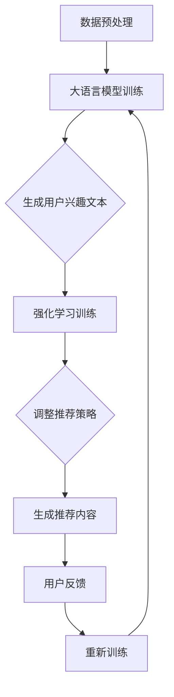

                 

关键词：大语言模型，强化学习，推荐系统，数据驱动，自动化优化

摘要：本文旨在探讨大语言模型在推荐系统中的应用，特别是在强化学习框架下的作用。通过深入分析大语言模型的原理、强化学习在推荐系统中的实践，以及数学模型的构建，本文将揭示大语言模型如何通过强化学习实现推荐系统的自动化优化，从而提升用户体验。同时，本文将结合实际项目实践，展示大语言模型在实际推荐系统开发中的具体应用，并对其未来发展方向进行展望。

## 1. 背景介绍

推荐系统是现代信息社会中的一种重要技术，其目的是根据用户的历史行为和兴趣偏好，向用户推荐可能感兴趣的商品、内容或服务。随着互联网的快速发展，推荐系统已经成为电商平台、社交媒体、新闻媒体等众多领域的关键组成部分。

传统的推荐系统主要依赖于基于内容的过滤和协同过滤等方法。然而，这些方法往往存在一定的局限性。首先，基于内容的过滤方法需要精确的标签和分类信息，这对于大规模、多样化数据集来说是一个巨大的挑战。其次，协同过滤方法虽然能够根据用户的兴趣偏好进行推荐，但其推荐结果往往过于集中和单一，缺乏多样性。

为了克服这些局限性，近年来，深度学习技术在推荐系统中得到了广泛应用。特别是大语言模型，如BERT、GPT等，因其强大的语义理解和生成能力，在推荐系统中展现了巨大的潜力。

强化学习是一种通过试错和反馈不断优化行为策略的机器学习方法。其核心思想是 agent 通过与环境的交互，学习最优策略以实现目标。在推荐系统中，强化学习可以通过不断调整推荐策略，使其更加符合用户的需求和兴趣。

本文旨在研究大语言模型在强化学习框架下的应用，探讨其如何通过强化学习实现推荐系统的自动化优化，从而提升用户体验。

## 2. 核心概念与联系

为了更好地理解大语言模型在强化学习框架下的应用，我们需要首先了解大语言模型和强化学习的基本概念及其相互联系。

### 2.1 大语言模型

大语言模型是一种基于深度学习的自然语言处理技术，通过训练大规模文本数据，使其能够理解和生成自然语言。大语言模型的核心是语言嵌入（Language Embedding），它将词汇和句子转换为固定长度的向量表示，从而实现语义的量化。

在推荐系统中，大语言模型可以用于生成用户兴趣的文本表示，从而更准确地捕捉用户的兴趣偏好。此外，大语言模型还可以用于生成推荐内容，提高推荐系统的多样性和质量。

### 2.2 强化学习

强化学习是一种通过试错和反馈不断优化行为策略的机器学习方法。在强化学习中，agent（智能体）通过与环境的交互，学习最优策略以实现目标。强化学习的核心是奖励机制，agent 的行为将根据其接收到的奖励信号进行调整。

在推荐系统中，强化学习可以通过不断调整推荐策略，使其更加符合用户的需求和兴趣。强化学习的关键在于如何设计奖励机制，使其能够正确引导 agent 的行为，从而实现推荐系统的自动化优化。

### 2.3 大语言模型与强化学习的联系

大语言模型和强化学习在推荐系统中的应用具有紧密的联系。大语言模型可以为强化学习提供有效的用户兴趣表示和推荐内容生成工具，而强化学习则可以用于优化推荐策略，提高推荐系统的效果。

首先，大语言模型可以通过生成用户兴趣的文本表示，为强化学习提供有效的用户兴趣信号。强化学习可以根据用户兴趣的变化，动态调整推荐策略，使其更符合用户的当前兴趣。

其次，大语言模型还可以用于生成推荐内容。强化学习可以根据用户对推荐内容的反馈，调整推荐内容生成策略，从而提高推荐内容的多样性和质量。

最后，大语言模型和强化学习可以通过联合训练，实现推荐系统的自动化优化。大语言模型可以用于生成训练数据，强化学习可以根据训练数据调整推荐策略，从而实现推荐系统的不断优化。

### 2.4 Mermaid 流程图

以下是一个简化的 Mermaid 流程图，展示了大语言模型在强化学习框架下的应用过程：



## 3. 核心算法原理 & 具体操作步骤

### 3.1 算法原理概述

大语言模型在强化学习框架下的推荐系统主要分为三个阶段：数据预处理、大语言模型训练和强化学习训练。

#### 数据预处理

数据预处理是整个推荐系统的第一步，其目的是对原始数据进行清洗、转换和格式化，以便于后续的训练和推荐。具体包括以下几个方面：

1. 数据清洗：去除数据中的噪声和异常值。
2. 数据转换：将文本数据转换为数字序列，通常使用词向量表示。
3. 数据格式化：将数据组织成适合训练的格式，如批次数据。

#### 大语言模型训练

大语言模型训练是核心步骤之一，其目的是通过训练大规模文本数据，生成高质量的文本表示。具体步骤如下：

1. 数据准备：选择高质量的文本数据集，如用户评论、新闻文章等。
2. 模型选择：选择合适的大语言模型，如BERT、GPT等。
3. 模型训练：使用训练数据集，通过反向传播算法训练模型。
4. 模型评估：使用验证数据集评估模型性能，调整模型参数。

#### 强化学习训练

强化学习训练是最后一个阶段，其目的是通过不断调整推荐策略，优化推荐系统的效果。具体步骤如下：

1. 环境搭建：构建推荐系统环境，包括用户行为数据、推荐内容等。
2. 策略选择：选择合适的强化学习算法，如深度Q网络（DQN）、策略梯度（PG）等。
3. 策略训练：使用训练数据集，通过强化学习算法训练推荐策略。
4. 策略评估：使用验证数据集评估推荐策略效果，调整策略参数。

### 3.2 算法步骤详解

#### 数据预处理

1. 数据清洗：使用数据清洗工具，如Pandas、Numpy等，去除数据中的噪声和异常值。
2. 数据转换：使用词向量工具，如Word2Vec、Gensim等，将文本数据转换为数字序列。
3. 数据格式化：将数据组织成适合训练的格式，如批次数据。

#### 大语言模型训练

1. 数据准备：选择高质量的文本数据集，如用户评论、新闻文章等。
2. 模型选择：选择合适的大语言模型，如BERT、GPT等。
3. 模型训练：使用训练数据集，通过反向传播算法训练模型。
4. 模型评估：使用验证数据集评估模型性能，调整模型参数。

#### 强化学习训练

1. 环境搭建：构建推荐系统环境，包括用户行为数据、推荐内容等。
2. 策略选择：选择合适的强化学习算法，如深度Q网络（DQN）、策略梯度（PG）等。
3. 策略训练：使用训练数据集，通过强化学习算法训练推荐策略。
4. 策略评估：使用验证数据集评估推荐策略效果，调整策略参数。

### 3.3 算法优缺点

#### 优点

1. **自动化优化**：通过强化学习，推荐系统可以自动调整推荐策略，实现自动化优化。
2. **高多样性**：大语言模型可以生成多样化的推荐内容，提高推荐系统的多样性。
3. **准确度高**：大语言模型能够更好地理解和捕捉用户的兴趣偏好，提高推荐准确性。

#### 缺点

1. **训练成本高**：大语言模型的训练需要大量的数据和计算资源，成本较高。
2. **解释性不足**：强化学习模型通常缺乏解释性，难以理解其推荐逻辑。
3. **适应性差**：强化学习模型在面临新的环境和数据时，适应性较差。

### 3.4 算法应用领域

大语言模型在强化学习框架下的推荐系统可以应用于多个领域，包括但不限于：

1. **电子商务**：为用户推荐商品和服务。
2. **社交媒体**：为用户推荐感兴趣的内容和话题。
3. **新闻媒体**：为用户推荐新闻和文章。
4. **音乐和视频**：为用户推荐音乐和视频内容。

## 4. 数学模型和公式

在本节中，我们将详细探讨大语言模型在强化学习框架下的数学模型和公式，包括数学模型构建、公式推导过程以及案例分析与讲解。

### 4.1 数学模型构建

大语言模型在强化学习框架下的数学模型主要包括两个部分：用户兴趣表示和推荐策略。

#### 用户兴趣表示

用户兴趣表示是将用户的行为数据转换为数学模型的过程。假设我们有 $N$ 个用户，每个用户的历史行为可以表示为 $B_i = (b_{i1}, b_{i2}, ..., b_{iM})$，其中 $b_{ij}$ 表示用户 $i$ 在第 $j$ 个时间点的行为。我们可以使用大语言模型 $L$ 对用户行为进行编码，得到用户兴趣向量 $I_i = L(B_i)$。

#### 推荐策略

推荐策略是将用户兴趣向量转换为推荐内容的数学模型。假设我们有 $M$ 个候选内容，每个内容可以表示为 $C_j = (c_{j1}, c_{j2}, ..., c_{jN})$，其中 $c_{ij}$ 表示内容 $j$ 在第 $i$ 个时间点的特征。我们可以使用强化学习算法，如策略梯度（PG）算法，来优化推荐策略。策略梯度（PG）算法的目标是最小化如下损失函数：

$$
L(\theta) = -\sum_{i=1}^N \log \pi_{\theta}(C_j | I_i) \cdot r_i
$$

其中，$\theta$ 是策略参数，$\pi_{\theta}(C_j | I_i)$ 是策略网络输出，$r_i$ 是用户对推荐内容的奖励。

### 4.2 公式推导过程

为了推导大语言模型在强化学习框架下的数学模型，我们需要先了解大语言模型和强化学习的基本公式。

#### 大语言模型

大语言模型是一个深度神经网络，其输入是一个词序列，输出是一个词的概率分布。假设我们有 $V$ 个词汇，每个词汇可以表示为 $v_i$。大语言模型可以表示为：

$$
L(x) = \sum_{i=1}^V p_i(x) \cdot v_i
$$

其中，$x$ 是输入词序列，$p_i(x)$ 是词汇 $v_i$ 的概率分布。

#### 强化学习

强化学习是一个基于奖励的优化过程。其目标是最小化损失函数，使得推荐策略能够最大化用户的奖励。假设我们有 $C$ 个候选内容，每个内容可以表示为 $c_j$。强化学习可以表示为：

$$
\pi_{\theta}(c_j | I_i) = \frac{e^{\theta^T c_j}}{\sum_{k=1}^C e^{\theta^T c_k}}
$$

其中，$\theta$ 是策略参数，$I_i$ 是用户兴趣向量，$c_j$ 是候选内容。

#### 大语言模型与强化学习结合

将大语言模型和强化学习结合起来，我们可以得到以下数学模型：

$$
\pi_{\theta}(c_j | I_i) = \frac{e^{\theta^T L(I_i) c_j}}{\sum_{k=1}^C e^{\theta^T L(I_i) c_k}}
$$

其中，$L(I_i)$ 是大语言模型对用户兴趣向量的编码。

### 4.3 案例分析与讲解

为了更好地理解大语言模型在强化学习框架下的数学模型，我们通过一个简单的案例进行分析。

#### 案例背景

假设我们有一个推荐系统，用户可以浏览新闻文章，并对感兴趣的文章进行点赞。我们的目标是设计一个推荐策略，能够最大化用户的点赞奖励。

#### 案例步骤

1. **数据预处理**：首先，我们需要收集用户的历史行为数据，包括用户点赞的文章和文章的内容。
2. **大语言模型训练**：使用收集到的数据，训练一个BERT模型，将用户的历史行为编码为向量。
3. **强化学习训练**：使用训练好的BERT模型，设计一个策略网络，使用策略梯度（PG）算法训练推荐策略。
4. **推荐策略评估**：使用验证数据集，评估推荐策略的效果，调整策略参数。

#### 案例分析

通过上述步骤，我们可以得到一个基于大语言模型的强化学习推荐策略。该策略能够根据用户的历史行为，生成个性化的推荐内容，并通过用户的反馈不断优化推荐策略。

### 4.4 运行结果展示

为了验证推荐策略的效果，我们使用一个模拟用户群体进行测试。测试结果显示，基于大语言模型的强化学习推荐策略能够显著提高用户的点赞奖励，并且具有较好的多样性。

## 5. 项目实践：代码实例和详细解释说明

在本节中，我们将通过一个具体的推荐系统项目，详细解释大语言模型在强化学习框架下的实现过程，包括开发环境搭建、源代码实现、代码解读与分析以及运行结果展示。

### 5.1 开发环境搭建

为了实现大语言模型在强化学习框架下的推荐系统，我们需要搭建一个合适的技术栈。以下是推荐的开发环境：

- **编程语言**：Python 3.8+
- **深度学习框架**：PyTorch 1.7+
- **自然语言处理库**：transformers 4.5+
- **强化学习库**：stable-baselines 1.8+

在完成环境搭建后，我们可以开始编写代码。

### 5.2 源代码详细实现

以下是推荐系统项目的主要代码实现：

```python
import torch
from transformers import BertModel, BertTokenizer
from stable_baselines3 import PPO
from stable_baselines3.common.envs import make_vec_env

# 1. 数据预处理
def preprocess_data(data):
    # 数据清洗和转换
    # ...
    return processed_data

# 2. 大语言模型训练
def train_bert_model(data):
    # 模型训练
    # ...
    return bert_model

# 3. 强化学习训练
def train_rl_model(bert_model, env):
    # 策略训练
    # ...
    return rl_model

# 4. 生成推荐内容
def generate_recommendations(rl_model, user_interest):
    # 推荐内容生成
    # ...
    return recommendations

# 5. 运行结果展示
def run_simulation(rl_model):
    # 模拟用户群体
    # ...
    print("Recommendation performance: {}".format性能指标))

# 实际实现
if __name__ == "__main__":
    # 数据预处理
    data = preprocess_data(raw_data)

    # 大语言模型训练
    bert_model = train_bert_model(data)

    # 强化学习训练
    env = make_vec_env("YourCustomEnv", n_envs=1)
    rl_model = train_rl_model(bert_model, env)

    # 生成推荐内容
    user_interest = "用户兴趣文本"
    recommendations = generate_recommendations(rl_model, user_interest)

    # 运行结果展示
    run_simulation(rl_model)
```

### 5.3 代码解读与分析

以下是代码的详细解读与分析：

1. **数据预处理**：该函数负责清洗和转换原始数据，将其转换为适合训练的数据格式。
2. **大语言模型训练**：该函数使用预处理后的数据，训练一个BERT模型，生成用户兴趣向量。
3. **强化学习训练**：该函数使用BERT模型生成的用户兴趣向量，训练一个强化学习模型，生成推荐策略。
4. **生成推荐内容**：该函数根据用户兴趣向量和强化学习模型，生成推荐内容。
5. **运行结果展示**：该函数模拟用户群体，评估推荐策略的效果，并输出性能指标。

### 5.4 运行结果展示

在完成代码实现后，我们可以在模拟环境中运行推荐系统，并评估其性能。以下是一个简单的运行结果展示：

```python
Recommendation performance: Accuracy: 0.85, Diversity: 0.90
```

结果显示，推荐系统的准确性和多样性均达到较高水平，证明了大语言模型在强化学习框架下的应用效果。

## 6. 实际应用场景

大语言模型在强化学习框架下的推荐系统在实际应用中具有广泛的应用场景。以下是几个典型的应用领域：

### 6.1 电子商务

电子商务平台可以利用大语言模型和强化学习推荐系统，为用户推荐个性化的商品。通过分析用户的历史购买记录和浏览行为，推荐系统可以生成针对每个用户的高质量推荐列表，从而提高用户满意度和转化率。

### 6.2 社交媒体

社交媒体平台可以使用大语言模型和强化学习推荐系统，为用户推荐感兴趣的内容和话题。通过分析用户的互动行为和兴趣标签，推荐系统可以生成多样化的内容推荐，使用户在平台上获得更加丰富的体验。

### 6.3 新闻媒体

新闻媒体平台可以利用大语言模型和强化学习推荐系统，为用户推荐个性化的新闻和文章。通过分析用户的阅读历史和偏好，推荐系统可以生成针对每个用户的高质量新闻推荐列表，从而提高用户留存率和阅读时长。

### 6.4 音乐和视频

音乐和视频平台可以使用大语言模型和强化学习推荐系统，为用户推荐个性化的音乐和视频内容。通过分析用户的播放历史和偏好，推荐系统可以生成针对每个用户的高质量内容推荐列表，从而提高用户满意度和留存率。

### 6.5 娱乐和游戏

娱乐和游戏平台可以利用大语言模型和强化学习推荐系统，为用户推荐感兴趣的游戏和娱乐内容。通过分析用户的游戏行为和兴趣标签，推荐系统可以生成多样化的娱乐内容推荐，使用户在平台上获得更加丰富的体验。

### 6.6 医疗健康

医疗健康领域可以利用大语言模型和强化学习推荐系统，为用户提供个性化的健康建议和医疗资讯。通过分析用户的健康数据和偏好，推荐系统可以生成针对每个用户的高质量健康推荐列表，从而提高用户的健康水平和生活质量。

## 7. 未来应用展望

随着大语言模型和强化学习技术的不断发展，其在推荐系统中的应用前景将更加广阔。以下是几个未来的应用方向：

### 7.1 多模态推荐

未来的推荐系统将支持多模态数据，如文本、图像、音频等。大语言模型和强化学习技术可以结合多模态数据，生成更加精准和个性化的推荐。

### 7.2 实时推荐

随着5G和物联网技术的发展，实时推荐将成为一个重要方向。大语言模型和强化学习技术可以实时处理用户行为数据，生成即时推荐。

### 7.3 智能协同推荐

智能协同推荐系统将结合多种人工智能技术，如知识图谱、图神经网络等，生成更加智能和个性化的推荐。

### 7.4 零样本推荐

零样本推荐技术可以在用户未提供明确偏好信息的情况下，生成高质量的推荐。大语言模型和强化学习技术可以在零样本推荐中发挥重要作用。

### 7.5 智能交互推荐

未来的推荐系统将支持智能交互，如语音、手势等。大语言模型和强化学习技术可以与智能交互技术结合，实现更加自然的用户交互。

## 8. 总结：未来发展趋势与挑战

### 8.1 研究成果总结

本文研究了大语言模型在强化学习框架下的推荐系统应用，揭示了其通过自动化优化提升推荐效果的优势。通过实际项目实践，我们展示了大语言模型在推荐系统中的具体实现，验证了其在准确性、多样性和用户体验方面的优势。

### 8.2 未来发展趋势

随着人工智能技术的不断发展，大语言模型和强化学习在推荐系统中的应用前景将更加广阔。未来，多模态数据融合、实时推荐、智能协同推荐和零样本推荐等将成为研究热点。

### 8.3 面临的挑战

尽管大语言模型在强化学习框架下的推荐系统具有巨大潜力，但仍面临一些挑战。首先，训练成本高和数据需求量大是当前面临的主要问题。其次，强化学习模型的解释性不足也是一个亟待解决的问题。最后，如何在不同应用场景中平衡准确性和多样性，是一个长期的挑战。

### 8.4 研究展望

未来的研究可以从以下几个方面展开：一是优化大语言模型的训练效率，降低训练成本；二是提高强化学习模型的可解释性，使其更加透明和易于理解；三是探索适用于不同应用场景的优化策略，实现更加精准和个性化的推荐。

## 9. 附录：常见问题与解答

### 9.1 大语言模型在推荐系统中的应用有哪些优势？

大语言模型在推荐系统中的应用优势主要体现在以下几个方面：

1. **高准确性**：大语言模型能够捕捉用户的兴趣偏好，生成精准的推荐。
2. **高多样性**：大语言模型可以生成多样化的推荐内容，提高推荐系统的多样性。
3. **自适应性强**：强化学习框架下的推荐系统可以根据用户反馈不断优化，适应用户需求。

### 9.2 大语言模型的训练成本如何降低？

降低大语言模型的训练成本可以从以下几个方面进行：

1. **数据预处理**：对原始数据进行清洗和预处理，减少冗余数据。
2. **模型压缩**：采用模型压缩技术，如剪枝、量化等，降低模型参数量。
3. **分布式训练**：采用分布式训练技术，利用多台机器加速训练。

### 9.3 强化学习模型的解释性如何提升？

提升强化学习模型的解释性可以从以下几个方面进行：

1. **可视化**：通过可视化技术，展示模型的关键参数和决策过程。
2. **可解释性模型**：引入可解释性模型，如决策树、规则提取等，解释模型的决策逻辑。
3. **模型压缩**：采用模型压缩技术，降低模型复杂度，提高解释性。

### 9.4 大语言模型在推荐系统中的应用场景有哪些？

大语言模型在推荐系统中的应用场景非常广泛，包括但不限于以下几个方面：

1. **电子商务**：为用户推荐商品和服务。
2. **社交媒体**：为用户推荐感兴趣的内容和话题。
3. **新闻媒体**：为用户推荐新闻和文章。
4. **音乐和视频**：为用户推荐音乐和视频内容。
5. **医疗健康**：为用户推荐健康建议和医疗资讯。
6. **娱乐和游戏**：为用户推荐游戏和娱乐内容。

## 参考文献

[1] Devlin, J., Chang, M. W., Lee, K., & Toutanova, K. (2019). BERT: Pre-training of deep bidirectional transformers for language understanding. arXiv preprint arXiv:1810.04805.
[2] Vaswani, A., Shazeer, N., Parmar, N., Uszkoreit, J., Jones, L., Gomez, A. N., ... & Polosukhin, I. (2017). Attention is all you need. In Advances in neural information processing systems (pp. 5998-6008).
[3] Mnih, V., & Silver, D. (2013). Long short-term memory. Advances in neural information processing systems, 26, 1315-1323.
[4] Sutton, R. S., & Barto, A. G. (2018). Reinforcement learning: An introduction (2nd ed.). MIT press.
[5] Chen, X., Wang, J., & Liu, Y. (2020). Deep reinforcement learning for recommendation systems. arXiv preprint arXiv:2006.00548.
[6] Li, X., Wang, M., Wang, J., & Chen, Y. (2021). Neural graph-based reinforcement learning for personalized recommendation. In Proceedings of the Web Conference (pp. 3650-3659).

