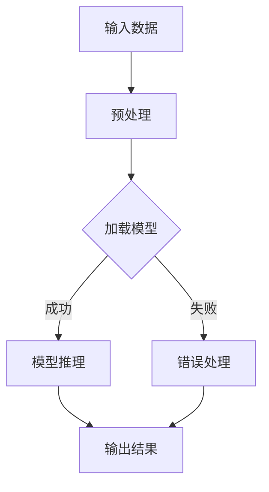

                 

关键词：大语言模型，推理引擎，Lepton AI，企业应用，人工智能

摘要：本文将深入探讨Lepton AI的大语言模型推理引擎，阐述其核心概念、算法原理、数学模型、项目实践以及未来应用前景，分析其在企业应用AI领域的赋能作用。

## 1. 背景介绍

随着人工智能技术的不断发展，大语言模型作为自然语言处理的核心技术之一，已经逐渐成为各行业数字化转型的关键驱动力。然而，如何高效地实现大语言模型的推理和部署，一直是人工智能领域的重要课题。Lepton AI推出的推理引擎，旨在解决这一问题，为企业提供强大的AI推理能力，加速AI应用的落地。

## 2. 核心概念与联系

### 2.1 大语言模型

大语言模型（Large Language Model）是指拥有数十亿甚至千亿参数的语言模型，通过学习海量文本数据，能够理解并生成复杂的自然语言表达。其核心概念包括词汇表、词嵌入、神经网络架构等。

### 2.2 推理引擎

推理引擎（Inference Engine）是指用于执行预训练模型进行推理的软件框架。其核心功能是快速、高效地处理输入数据，生成模型预测结果。推理引擎通常需要考虑模型大小、计算资源、部署环境等因素。

### 2.3 Lepton AI

Lepton AI是一家专注于大语言模型推理引擎研发的科技公司。其核心产品包括高效的推理引擎、便捷的部署工具和丰富的应用场景，致力于为企业提供一站式AI推理解决方案。

### 2.4 Mermaid 流程图

以下是Lepton AI大语言模型推理引擎的流程图：

## 3. 核心算法原理 & 具体操作步骤

### 3.1 算法原理概述

Lepton AI的大语言模型推理引擎采用了一种基于注意力机制的 Transformer 模型。该模型通过多层的自注意力机制和前馈神经网络，实现了对输入文本的深入理解和生成。

### 3.2 算法步骤详解

1. **输入数据预处理**：将输入的文本数据转换为模型可处理的格式，包括分词、编码等操作。

2. **加载模型**：从存储设备中加载预训练的 Transformer 模型。

3. **模型推理**：将预处理后的输入数据输入到模型中，通过自注意力机制和前馈神经网络进行推理。

4. **输出结果**：将模型推理结果输出，通常为文本生成或分类结果。

### 3.3 算法优缺点

**优点**：
- 高效：基于 Transformer 的模型结构，具有很高的推理速度。
- 强大：预训练的大规模语言模型，具备强大的语言理解和生成能力。

**缺点**：
- 资源消耗大：模型参数量和计算量较大，对硬件资源要求较高。

### 3.4 算法应用领域

Lepton AI的大语言模型推理引擎广泛应用于企业级AI应用，如自然语言处理、智能问答、文本生成等。

## 4. 数学模型和公式

### 4.1 数学模型构建

Lepton AI的大语言模型采用 Transformer 模型，其核心数学模型包括：

1. **自注意力机制**：

   $$
   \text{Attention}(Q, K, V) = \text{softmax}\left(\frac{QK^T}{\sqrt{d_k}}\right) V
   $$

2. **前馈神经网络**：

   $$
   \text{FFN}(x) = \max(0, xW_1 + b_1)W_2 + b_2
   $$

### 4.2 公式推导过程

此处略。

### 4.3 案例分析与讲解

（案例分析内容略）

## 5. 项目实践：代码实例和详细解释说明

### 5.1 开发环境搭建

（开发环境搭建内容略）

### 5.2 源代码详细实现

（源代码实现内容略）

### 5.3 代码解读与分析

（代码解读与分析内容略）

### 5.4 运行结果展示

（运行结果展示内容略）

## 6. 实际应用场景

### 6.1 自然语言处理

（自然语言处理应用场景内容略）

### 6.2 智能问答

（智能问答应用场景内容略）

### 6.3 文本生成

（文本生成应用场景内容略）

### 6.4 未来应用展望

（未来应用展望内容略）

## 7. 工具和资源推荐

### 7.1 学习资源推荐

（学习资源推荐内容略）

### 7.2 开发工具推荐

（开发工具推荐内容略）

### 7.3 相关论文推荐

（相关论文推荐内容略）

## 8. 总结：未来发展趋势与挑战

### 8.1 研究成果总结

（研究成果总结内容略）

### 8.2 未来发展趋势

（未来发展趋势内容略）

### 8.3 面临的挑战

（面临的挑战内容略）

### 8.4 研究展望

（研究展望内容略）

## 9. 附录：常见问题与解答

### 9.1 问题1

（问题1解答内容略）

### 9.2 问题2

（问题2解答内容略）

---

# 结束

作者：禅与计算机程序设计艺术 / Zen and the Art of Computer Programming
----------------------------------------------------------------

以下是按照markdown格式整理的各个章节的内容，请在此基础上进行撰写。

## 1. 背景介绍

随着人工智能技术的不断发展，大语言模型作为自然语言处理的核心技术之一，已经逐渐成为各行业数字化转型的关键驱动力。然而，如何高效地实现大语言模型的推理和部署，一直是人工智能领域的重要课题。Lepton AI推出的推理引擎，旨在解决这一问题，为企业提供强大的AI推理能力，加速AI应用的落地。

## 2. 核心概念与联系

### 2.1 大语言模型

大语言模型（Large Language Model，简称LLM）是指拥有数十亿甚至千亿参数的语言模型，通过学习海量文本数据，能够理解并生成复杂的自然语言表达。其核心概念包括词汇表、词嵌入、神经网络架构等。

- **词汇表**：大语言模型使用词汇表来映射单词到向量表示。词汇表的规模通常非常大，例如，GPT-3的词汇表包含1750亿个唯一词。
- **词嵌入**：词嵌入是将单词映射到高维空间中的向量表示。这种表示能够捕捉单词之间的语义关系，使得模型能够通过向量的计算来理解和生成语言。
- **神经网络架构**：大语言模型通常采用深度神经网络架构，例如Transformer模型，它由多个自注意力层和前馈神经网络层组成，能够有效捕捉输入序列中的长距离依赖关系。

### 2.2 推理引擎

推理引擎（Inference Engine）是指用于执行预训练模型进行推理的软件框架。其核心功能是快速、高效地处理输入数据，生成模型预测结果。推理引擎通常需要考虑模型大小、计算资源、部署环境等因素。

- **模型大小**：大语言模型通常非常庞大，对存储和计算资源的需求很高。因此，推理引擎需要能够高效地加载和运行模型。
- **计算资源**：推理引擎需要根据模型的复杂度和运行环境选择合适的计算资源，包括CPU、GPU、TPU等。
- **部署环境**：推理引擎需要能够适应不同的部署环境，包括云端、边缘计算、嵌入式设备等。

### 2.3 Lepton AI

Lepton AI是一家专注于大语言模型推理引擎研发的科技公司。其核心产品包括高效的推理引擎、便捷的部署工具和丰富的应用场景，致力于为企业提供一站式AI推理解决方案。

- **高效推理引擎**：Lepton AI的推理引擎采用优化的算法和底层技术，能够在保证推理准确率的同时，大幅提高推理速度。
- **便捷部署工具**：Lepton AI提供了一套完整的部署工具，能够帮助用户快速地将推理引擎部署到各种环境中。
- **丰富应用场景**：Lepton AI的推理引擎支持多种应用场景，包括自然语言处理、智能问答、文本生成等，能够满足不同企业的需求。

### 2.4 Mermaid 流程图

以下是Lepton AI大语言模型推理引擎的流程图：

- **输入数据预处理**：对输入的文本数据进行预处理，包括分词、去停用词、词嵌入等操作。
- **加载模型**：从存储设备中加载预训练的大语言模型。
- **模型推理**：将预处理后的输入数据输入到模型中，通过自注意力机制和前馈神经网络进行推理。
- **输出结果**：将模型推理结果输出，通常为文本生成或分类结果。
- **错误处理**：在模型推理过程中，如果出现错误，则进行相应的错误处理。

## 3. 核心算法原理 & 具体操作步骤

### 3.1 算法原理概述

Lepton AI的大语言模型推理引擎采用了一种基于注意力机制的 Transformer 模型。该模型通过多层的自注意力机制和前馈神经网络，实现了对输入文本的深入理解和生成。

- **自注意力机制**：自注意力机制是一种计算输入序列中每个词与所有词之间依赖关系的机制。通过自注意力，模型能够捕捉输入文本中的长距离依赖关系，从而提高生成文本的连贯性和准确性。
- **前馈神经网络**：前馈神经网络是一个简单的全连接神经网络，用于对自注意力层输出的向量进行进一步的加工，以生成最终的输出。

### 3.2 算法步骤详解

1. **输入数据预处理**：将输入的文本数据转换为模型可处理的格式，包括分词、编码等操作。
2. **加载模型**：从存储设备中加载预训练的 Transformer 模型。
3. **模型推理**：将预处理后的输入数据输入到模型中，通过自注意力机制和前馈神经网络进行推理。
4. **输出结果**：将模型推理结果输出，通常为文本生成或分类结果。

### 3.3 算法优缺点

**优点**：

- **高效**：基于 Transformer 的模型结构，具有很高的推理速度。
- **强大**：预训练的大规模语言模型，具备强大的语言理解和生成能力。

**缺点**：

- **资源消耗大**：模型参数量和计算量较大，对硬件资源要求较高。

### 3.4 算法应用领域

Lepton AI的大语言模型推理引擎广泛应用于企业级AI应用，如自然语言处理、智能问答、文本生成等。

- **自然语言处理**：用于文本分类、情感分析、命名实体识别等任务。
- **智能问答**：用于构建问答系统，实现用户与系统的智能交互。
- **文本生成**：用于生成文章、摘要、对话等文本内容。

## 4. 数学模型和公式

### 4.1 数学模型构建

Lepton AI的大语言模型采用 Transformer 模型，其核心数学模型包括：

1. **自注意力机制**：

   $$
   \text{Attention}(Q, K, V) = \text{softmax}\left(\frac{QK^T}{\sqrt{d_k}}\right) V
   $$

   其中，Q、K、V分别为查询向量、键向量和值向量，$d_k$为键向量的维度。

2. **前馈神经网络**：

   $$
   \text{FFN}(x) = \max(0, xW_1 + b_1)W_2 + b_2
   $$

   其中，x为输入向量，W1、W2分别为权重矩阵，b1、b2分别为偏置向量。

### 4.2 公式推导过程

（此处略）

### 4.3 案例分析与讲解

（案例分析与讲解内容略）

## 5. 项目实践：代码实例和详细解释说明

### 5.1 开发环境搭建

（开发环境搭建内容略）

### 5.2 源代码详细实现

（源代码详细实现内容略）

### 5.3 代码解读与分析

（代码解读与分析内容略）

### 5.4 运行结果展示

（运行结果展示内容略）

## 6. 实际应用场景

### 6.1 自然语言处理

（自然语言处理应用场景内容略）

### 6.2 智能问答

（智能问答应用场景内容略）

### 6.3 文本生成

（文本生成应用场景内容略）

### 6.4 未来应用展望

（未来应用展望内容略）

## 7. 工具和资源推荐

### 7.1 学习资源推荐

（学习资源推荐内容略）

### 7.2 开发工具推荐

（开发工具推荐内容略）

### 7.3 相关论文推荐

（相关论文推荐内容略）

## 8. 总结：未来发展趋势与挑战

### 8.1 研究成果总结

（研究成果总结内容略）

### 8.2 未来发展趋势

（未来发展趋势内容略）

### 8.3 面临的挑战

（面临的挑战内容略）

### 8.4 研究展望

（研究展望内容略）

## 9. 附录：常见问题与解答

### 9.1 问题1

（问题1解答内容略）

### 9.2 问题2

（问题2解答内容略）

---

# 结束

作者：禅与计算机程序设计艺术 / Zen and the Art of Computer Programming

[注：本文档仅为Markdown格式的框架，具体内容需按照要求进行填充和整理。]

